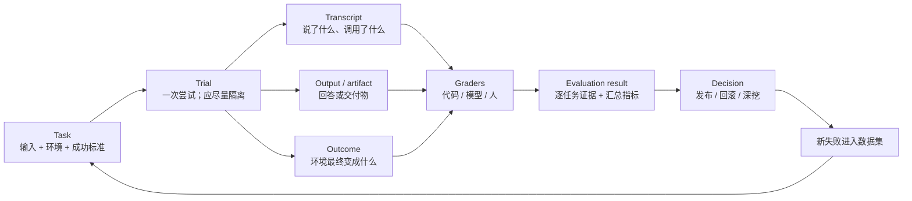
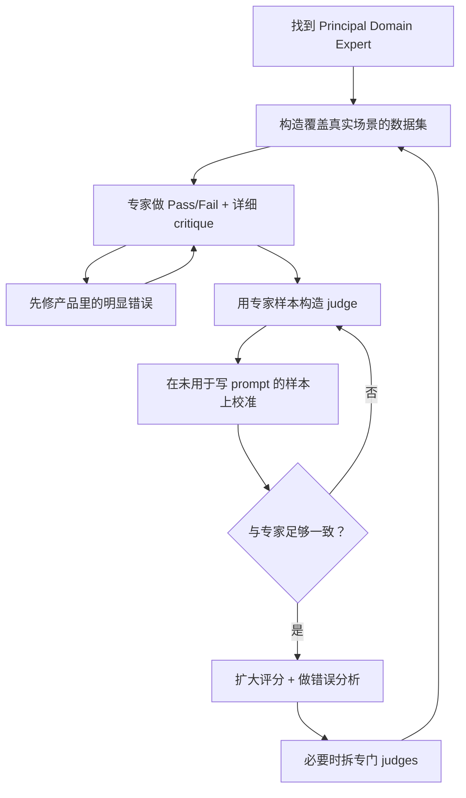
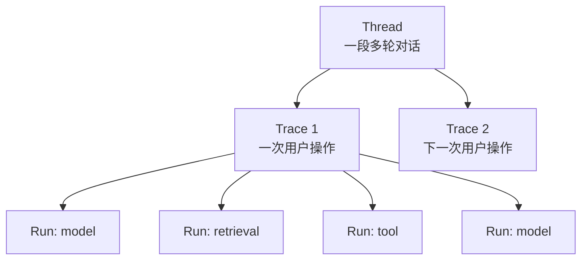
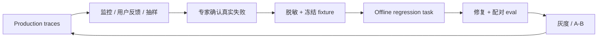

# Agent Evals：从「感觉变好了」到可复现实验

> 研究日期：2026-08-18<br>
> 主题范围：面向会调用工具、跨多轮行动并改变环境状态的 AI agent，讨论如何设计任务集、评测运行、grader、LLM-as-a-judge、统计指标与线上回流。<br>
> 配套学习页：[把「感觉变好了」变成一个数字 — 从零学 Agent Evals](learn/)　**先读那篇建立取舍和顺序，再拿这篇当手册查**<br>
> 阅读约定：文中的 **【来源事实】** 是来源直接支持的陈述，**【综合解释】** 是把多个来源放进同一模型后的推导，**【实践建议】** 是可执行但需按具体产品验证的方案。<br>
> 版本说明：本手册的骨架与词典来自本仓库 [PR #16](https://github.com/caiboyang/ML-learning/pull/16) 的独立实现；在其之上补入了 **§3.6 公开评测失效档案**、**§5.6 Judge 误差修正及其三个前提**、**§6.4 误差棒**、**§7.4 Guardrail 与 Evaluator 的边界**，扩展了来源账本（[M][D][P][S][O1][O2][O3]），并与学习页统一了表述（见 §14.4）。

---

## 0. 先给结论

Eval 不是一个分数，也不是一套 LLM dashboard。它是一条可重复运行的证据链：



一套可信的 agent eval 至少同时回答六个问题：

1. **测什么？**——真实用户任务，而不是为了方便评分而虚构的代理指标。
2. **成功是什么？**——有副作用时优先看环境 outcome；只读任务则检查最终 output / artifact，再看必须遵守的过程约束和主观质量。
3. **谁来判？**——能用代码就不用模型；需要语义判断时才上 LLM judge；人类专家始终是校准锚点。
4. **跑几次？**——agent 有随机性，单次通过不能代表可靠；要按产品需要区分「至少成功一次」与「每次都成功」。
5. **为什么失败？**——总分只报警，transcript / trace 才能定位第一个偏离点。
6. **如何持续有效？**——线上 trace 发现新失败，人工筛选后进入离线回归集；旧 capability 题饱和后转为 regression 题。

最重要的三条工程原则：

- **声明不是结果。** Agent 说「机票已订」不等于数据库里真的存在订单；有副作用时检查环境 outcome，只读任务则核对最终 output / artifact。
- **grader 也必须被评测。** LLM judge 只是另一个会犯错的模型，必须与领域专家在代表性样本上对齐。
- **先读失败，再看均分。** 一个上涨的平均数可以同时掩盖关键用户切片退化、环境污染和 grader 漏洞。

---

## 1. 为什么 Agent 比普通 LLM 更难评

### 1.1 单轮输出变成了一段会改变世界的轨迹

传统单轮 eval 常是：

> prompt → response → score

Agent eval 则更接近：

> task + tools + initial state → 多轮模型/工具循环 → final state + transcript → 多个 graders

【来源事实】Anthropic 把 agent eval 的核心对象拆成 task、trial、grader、transcript、outcome、evaluation harness、agent harness 与 suite。[A]

【综合解释】难点不是「输出更长」这么简单，而是三个变化同时发生：

- **路径变长**：早期错误会沿后续工具调用传播；
- **状态外置**：真正结果可能在文件、数据库、浏览器、工单系统或日历里；
- **解法增多**：多个不同轨迹都可能合法，精确匹配预设路径会误杀创造性的正确解。

### 1.2 同一个「agent」其实是模型与 harness 的组合

| 概念 | 本文定义 | 常见误会 |
|---|---|---|
| **Agent harness / scaffold** | 把模型变成 agent 的运行系统：prompt、工具、循环、状态、权限与停止条件 | 只把模型名当成被测对象 |
| **Evaluation harness** | 负责准备环境、运行 trial、保存 transcript/output/outcome、调用 grader、聚合结果 | 把 LangSmith、Harbor 等框架本身当作 eval |
| **Agent** | 在特定模型、agent harness、配置和环境下运行的整体 | 换了工具或 prompt 仍说「只换了模型」 |

【实践建议】每个实验都记录至少这些版本：

- model/provider 与推理参数；
- system prompt / tools schema / agent harness commit；
- eval dataset 与 grader 版本；
- 环境镜像或 fixture 版本；
- trial 数、并发、时间与随机性设置；
- 成本、token、延迟和错误日志。

否则两个分数即使都叫「pass rate」，也未必在比较同一个系统。

---

## 2. 统一词典：从 Task 到 Decision

### 2.1 核心对象与证据

| 对象 | 含义 | 最小应保存内容 |
|---|---|---|
| **Task / case** | 一道测试题，含输入、初始环境和成功标准 | id、prompt、fixture、grader 配置、slice 标签 |
| **Trial** | 某个 task 的一次尝试；隔离与近似独立是实验设计目标，不是术语定义 | task_id、trial_id、系统版本、起止时间 |
| **Run** | 工具体系中的一次执行单元；不同平台粒度不同 | inputs、outputs、metadata、parent id |
| **Transcript** | eval 语境中一次 trial 的执行记录，**范围限于可观察物** | 模型消息、tool calls/results、关键状态快照；模型内部推理只有在 provider 暴露时才有，且常仅为摘要 |
| **Trace** | observability 语境中一次 operation / turn 内的一组嵌套 runs | root run、child runs、inputs/outputs、metadata |
| **Trajectory** | 从一次执行中投影出的高层消息、动作与观察序列；不必保留完整 run 嵌套 | ordered messages/actions/observations |
| **Output / artifact** | Agent 交付给用户或系统的回答、代码、报告等可观察产物 | final response、文件/diff、引用与结构化字段 |
| **Outcome** | trial 结束后环境的真实最终状态 | DB/file/UI/API state 与预期差异 |
| **Grader / evaluator** | 对 transcript、output/artifact 或 outcome 的一个判断函数 | verdict、理由、证据、grader version |
| **Suite / dataset** | 围绕能力或风险组织的一组 tasks | 所属目标、覆盖切片、维护人 |
| **Experiment** | 同一 dataset 上对一个候选系统配置的完整运行 | per-task trials、聚合结果、成本、基线差异 |

【来源事实】LangSmith 的术语更偏 observability：run 是一个工作单元，trace 是一次操作内的一组 runs，thread 把多轮对话中的多个 traces 串起来。[L1] Anthropic 则把一次 trial 的完整记录称为 transcript，也注明常被叫做 trace 或 trajectory。[A]

【综合解释】一个 trial 对应一条 trace 还是一整个 thread，取决于被测任务是 single-turn 还是 multi-turn；trajectory 也可能只是从 trace/thread 投影出的扁平动作序列。这些词没有跨工具统一的粒度。迁移平台时不要争名字，先核对：

1. 一次用户任务的边界是什么；
2. 多轮对话如何关联；
3. tool result 与环境状态是否被保存；
4. grader 究竟读到哪一层。

### 2.2 Task Result 与 Transcript 是正交证据

| 只看什么 | 会漏掉什么 |
|---|---|
| 只看 Agent 的成功声明 | 可能没有产生所声称的 artifact 或真实副作用 |
| 只看 outcome | 通过泄露数据、越权或偶然捷径得到正确结果 |
| 只看固定工具顺序 | 合法的替代路径与模型创造性 |
| 只看总 token / turns | 更短的轨迹可能只是提前放弃 |

【实践建议】把成功标准分成三层：

1. **Task-result contract**：有副作用时检查环境 outcome；只读任务检查最终 output / artifact；
2. **Process obligations**：鉴权、审批、来源引用、禁止副作用等不可绕过的义务；
3. **Experience quality**：表达、完整性、语气、解释质量等开放判断。

能可靠机械验证的部分优先用确定性 grader。研究任务的 groundedness、coverage 等即使属于前两层，也可能需要经过人类校准的 LLM judge；体验质量则是 LLM judge 最常见的工作区。

---

## 3. 先定义成功，再写数据集

### 3.1 从「两位专家会不会判成一样」开始

【来源事实】Anthropic 建议把 task 写到两位领域专家能独立得出相同 pass/fail 判断，并为每道题准备一个能通过所有 graders 的 reference solution。0% pass@100 往往先提示 task 或 grader 损坏，而不一定是 agent 完全无能。[A]

一个合格 task 至少说明：

```yaml
id: research_q3_revenue_001
input:
  question: "Company X 2025 Q3 revenue是多少？给出原始来源。"
environment:
  web_snapshot: "2025-11-01"
success:
  output:
    answer_usd_million: 1234
  obligations:
    - citation_points_to_primary_filing
    - no_unsupported_material_claim
  quality:
    - concise
    - distinguishes_reported_from_inferred
metadata:
  suite: regression
  slices: [research, exact-answer, primary-source]
```

坏 task 常见症状：

- grader 检查了题面没要求的文件路径、字段或工具顺序；
- success criteria 用「高质量」「全面」等词，却不给可观察定义；
- reference solution 自己无法通过；
- 依赖不断变化的网页，却没有冻结时间或快照；
- 多个要求互相冲突，或者工具权限不足以完成任务。

### 3.2 初始集不需要很大，但要真实

【来源事实】Anthropic 给出的起点是 20–50 个来自真实失败或手工检查的简单任务；LangSmith 文档也建议先人工整理一小批高质量例子，再由生产 traces 扩充。[A][L2]

【实践建议】第一版按四个桶采样：

| 桶 | 问题 | 例子 |
|---|---|---|
| **Happy path** | 核心价值能否完成 | 正常信息齐全的请求 |
| **Boundary** | 边界条件是否稳 | 空结果、多结果、长输入、冲突资料 |
| **Should act** | 该调用工具/执行动作时会不会做 | 查询实时价格、创建草稿 |
| **Should not act** | 不该行动时能否克制 | 缺授权、用户只问建议、信息不足 |

Hamel 提供了一个很实用的覆盖坐标：按 **feature × scenario × persona** 展开，但也明确说这不是通用模板；没有直接用户交互的系统未必需要 persona。[H]

### 3.3 Capability 与 Regression 是两种不同的题

| Suite | 要回答的问题 | 健康状态 | 何时运行 |
|---|---|---|---|
| **Capability / quality** | 「现在能做到多难？」 | 应保留失败空间，给优化一座山爬 | 模型/架构比较、研究迭代 |
| **Regression** | 「以前会的现在还会吗？」 | 应接近 100%，下降就调查 | 每次相关改动、发布门禁 |

【来源事实】Anthropic 建议把已经被攻克、接近饱和的 capability tasks 「毕业」到 regression suite，并持续补更难的 capability tasks。[A]

【实践建议】不要把两套分数混成一个大平均：

- capability 上升说明边界向外推；
- regression 下降说明既有承诺被破坏；
- 两者相加，可能把严重回归伪装成「整体没变」。

### 3.4 Dev suite、Holdout 与控制面隔离

【实践建议】日常调 prompt、tools、agent harness 和 grader 时使用可反复查看失败的 **dev suite**；对外报告候选是否进步或是否发布时，再用锁定的 **system release holdout** 做确认。反复根据同一 holdout 调系统会让它逐渐「耗损」，因此要限制查看频率、记录使用次数，并用新生产案例定期刷新。[G]

整个 `evals/` 属于 eval control plane，不得挂载进 trial workspace。Evaluation harness 用 fixture 初始化环境；被测 agent 只能通过与生产一致的 tools / API 观察这份环境，不能读取 raw fixture 文件。确实要公开的数据，应通过任务输入或正式工具暴露。

下面这些内容不能在 trial 时暴露：

- expected output / goal state；
- reference solution；
- grader 实现与 judge rubric；
- raw fixture 与环境初始化脚本；
- holdout 标签和 case 元数据中会泄露答案的字段。

这不只是防作弊：即使 agent 没有主观「偷看」，可读取的文件、工具描述或上下文也可能无意中泄露成功标准，让分数失去泛化意义。

### 3.5 平衡不是追求 50/50，而是覆盖两种错误方向

只测试「应该搜索」会训练出逢问必搜；只测试「拒绝危险操作」会训练出什么都拒绝。数据集要覆盖：

- false positive：做了不该做的；
- false negative：没做该做的；
- 容易样本与困难样本；
- 高频主路径与低频高损风险；
- 不同语言、长度、用户熟练度与权限等级。

【实践建议】优先级不由数量决定，可用 **发生概率 × 用户损失 × 漏检概率（1 − 检出率）** 做粗排；公式只是讨论风险的起点，不是精确概率模型。

### 3.6 公开评测失效档案

【来源事实】以下四组事实说明「任务和 grader 写坏」不是新手才犯的错，而是全职做评测的机构的常态命中率。[O1][O2][O3][A]

**SWE-bench 三年三代。**

| 时间 | 事件 | 关键数字 |
|---|---|---|
| 2023 | SWE-bench 发布：GitHub issue + 跑测试套件判定 | — |
| 2024-08 | OpenAI 请 93 位 Python 开发者标注 1,699 个样本，每题三人独立评审 | 38.3% 题面欠说明；61.1% 单测可能误杀正确解；**68.3% 被标出至少一项问题** [O1] |
| 2024-08 | 剔除问题样本后**再按难度挑选**（尽量多保留 1–4h 与 >4h 的题，余额随机补齐），得到 500 题的 Verified | GPT-4o 在原始集 16%、在 Verified 33.2% [O1] |
| 2026 | 因**污染 + 测试缺陷 + 饱和**（半年 SOTA 仅 74.9%→80.9%）停用 Verified，转向 SWE-bench Pro（1,865 题） | [O2] |
| 2026-07-08 | 审计 Pro 自己：731 道公开题**约 30% 是坏的**（自动流水线 27.4%、人工 34.1%），**撤回推荐** | [O3] |

Pro 的四类缺陷：测试过严 14.4%（强制题面未提的实现细节）、题面欠说明 7.5%、测试覆盖不足 4.1–9.4%、题面误导 1.9%。[O3]

【来源事实】OpenAI 给出的结构性诊断：这些 issue 和 pull request **当初是为人类协作写的，不是为机器评测写的**；题面、最终合入的代码与单元测试三者本来就不必对齐——PR 里的测试验证的是那一个具体补丁，而不是一份与实现无关的成功判据。[O3]

【综合解释】16% → 33.2% **不是同一批题上的受控重跑**（两个集合不同，且难度配比也变了），所以不能把这个差值当成「修评测带来的增量」。能成立、也正是这条档案的要点的是：**这十七个百分点里没有一点来自模型能力的变化**。

**另外两例。**[A]

- **CORE-Bench**：Claude Opus 4.5 初测 42%。查下来是几个评测问题叠加——期望 96.124991… 却因答 96.12 被判错、任务描述有歧义、部分任务本身随机不可复现。修完后 95%。
- **METR time horizon benchmark**：存在配置错误的任务——题面要求优化**到**某阈值，判分却要求**超过**该阈值，照着说明做的模型反被扣分。

【实践建议】把这份档案翻译成三条自查：

1. **0% pass@100 是任务坏了的信号，不是难题的信号。**[A] 前沿模型在某题上全军覆没时，先读 transcript 再下结论。
2. **从工单、bug tracker、PR 里挖来的任务带着同一种病**（§11 第 1 周第 2 步）。挖来是对的，但必须**重写成与实现无关的成功判据**再入库，不能原样使用。
3. **分数不动时，先怀疑评测再怀疑模型。**[A] Anthropic 的做法是：在有人钻进 eval 细节并读过若干 transcript 之前，不按面值接受任何 eval 分数。


---

## 4. Grader 设计：代码、模型与人各守一层

### 4.1 Grader 梯子

| Grader | 最适合 | 优点 | 主要风险 |
|---|---|---|---|
| **Code-based** | schema、exact match、单测、DB/file state、权限、tool args、延迟/token | 快、便宜、可复现、好调试 | 对合法变体脆弱；难判开放质量 |
| **Model-based** | groundedness、完整性、语气、开放式比较、复杂规则 | 能处理语义与自由文本 | 随机、昂贵、会偏、必须校准 |
| **Human / SME** | 最终标准、争议样本、judge 校准、未知失败 | 最贴近真实需求 | 慢、贵、专家之间也会不同意 |

【来源事实】Anthropic 建议「能确定性就确定性，需要时再用模型，并有选择地用人验证」；一个 task 可以组合多个 graders，并按 binary、weighted 或 hybrid 聚合。[A]

### 4.2 先判结果，不要过度规定路径

如果任务是「退款成功且不超过 100 美元」，核心 grader 应检查：

- refund 记录是否存在；
- amount 是否正确；
- 用户身份是否验证；
- 是否有确认通知。

除非工具顺序本身是安全要求，否则不要强制：

> verify_identity → lookup_order → refund → send_email

Agent 可以先读取公开退款政策再验证身份，也可以先验证再读取私有订单；但私有数据读取和退款副作用都必须发生在授权之后。Anthropic 明确提醒，固定工具序列往往过于脆弱，应尽量评 agent 产物和不可绕过的义务，而非预想的唯一路径。[A]

### 4.3 但「过程」在三类场景必须评分

1. **安全与合规义务**：先授权再读取私有数据、先确认再产生副作用；
2. **信息依据**：研究报告的结论必须能回到检索到的来源；
3. **资源边界**：禁止调用某类工具、最大步骤数、成本或延迟 SLO。

这时评分的不是「唯一正确路线」，而是不可绕过的约束。

### 4.4 Partial credit 只用于诊断，不应稀释硬失败

一个 support agent 完成身份验证、识别订单，但退款失败，确实比第一步就失败更接近成功。可以分别记录子项，帮助定位进展。

但对安全硬门：

```text
quality_score = 0.92
authorization_pass = false
release_verdict = FAIL
```

不要让漂亮的质量均分抵消越权。

---

## 5. LLM-as-a-Judge：先对齐人，再扩大规模

### 5.1 Critique Shadowing 工作流

【来源事实】Hamel 把「专家做二元判断与 critique，再让 judge 追随并迭代」称为 Critique Shadowing。[H]

【实践建议】下图在原流程上加了一层未用于编写 judge prompt 的校准样本；这是防止裁判过拟合的工程护栏，不是 Hamel 原文规定的固定步骤。



这条流程里真正创造价值的不是 judge，而是：

- 专家把隐含标准写成 critique；
- 团队被迫逐条看数据；
- 错误被归类为可修的根因；
- judge 只是把已经理解的判断扩大到更多样本。

### 5.2 为什么先做二元判断

Hamel 反对一开始就堆八个 1–5 分指标：3 与 4 的边界通常没人能稳定解释，均分也不直接告诉你该修什么。[H]

更好的起点：

```json
{
  "verdict": "fail",
  "critique": "回答声称订单 123 的 42 美元退款已完成，但退款工具校验失败，退款表仍为 0 rows。",
  "evidence": ["tool.process_refund.status=validation_error", "db.refunds[order_id=123]=[]"],
  "error_type": "claimed_action_without_outcome"
}
```

二元不是永远拒绝多维度。顺序是：

1. 先让领域专家判断整体是否可接受；
2. 从 critiques 中发现反复出现的真实维度；
3. 再为高价值、可定义的维度建立专门 grader；
4. 需要连续程度时才引入有锚点的等级量表。

### 5.3 一个可校准的 Judge Contract

```yaml
judge:
  target: "最终回答是否由给定来源支持"
  input:
    - user_request
    - retrieved_sources
    - final_answer
  rubric:
    pass: "每个会影响结论的事实都能在来源中找到支持"
    fail: "至少一个实质性事实无来源、与来源冲突或夸大来源"
    unknown: "来源缺失、不可读或证据不足"
  output_schema:
    verdict: [pass, fail, unknown]
    critique: string
    evidence: [string]
  exclusions:
    - "不评价文风"
    - "不使用外部知识补齐证据"
```

关键是让一个 judge 只判一个清晰维度。Anthropic 也建议把不同维度拆给相互隔离的 judges，并允许在信息不足时输出 Unknown。[A]

这里的 **Unknown 是 abstention（拒判）**，不是介于 pass 与 fail 之间的第三个质量等级。Unknown case 应进入人工复核；报告其覆盖率时，从 pass/fail confusion matrix 的分母中单列，并同时给出「全体样本上的 unknown rate」，避免只在已判样本上展示漂亮的 precision/recall。

### 5.4 如何验证 Judge

在代表性、未用于调 judge prompt / rubric 的专家标注集上，至少报告：

【实践建议】这份 **judge-calibration holdout** 与第 3.4 节的 **system release holdout** 必须分开：前者验证 grader，后者验证整个 agent system。先冻结 judge model、prompt 与 rubric，再运行 release holdout，避免一边看最终答案一边改裁判。

| 指标 | 回答什么 | 为什么只看 accuracy 不够 |
|---|---|---|
| **Precision on fail** | judge 判失败时，有多少真是失败 | 低则大量误杀正确输出 |
| **Recall on fail** | 真失败里 judge 找到了多少 | 低则给产品虚假安全感 |
| **Confusion matrix** | 每种错判的数量与方向 | 能看到风险集中在哪 |
| **Unknown rate** | 多久因证据不足拒判 | 过低可能在硬猜，过高则不可用 |
| **Slice metrics** | 不同语言/场景/长度下是否一致 | 总体均分会掩盖局部崩坏 |

【来源事实】Hamel 特别提醒，类别不平衡时 raw agreement 会误导，应分别看 precision 与 recall。[H] EvalGen 研究也用 coverage 与 false-failure rate 检查自动 evaluator 和人类评分的对齐。[V]

### 5.5 已知偏差与对应护栏

MT-Bench / Chatbot Arena 研究记录了 position、verbosity、self-enhancement 与有限推理能力等偏差。[J] 对产品 judge 的实用护栏是：

- **位置偏差**：pairwise 比较时交换 A/B 顺序；不一致就标记复核；
- **冗长偏差**：rubric 明写「不因长度加分」，加入短而正确与长而空的校准对；
- **Self-enhancement bias（偏好自身模型输出）**：隐藏候选模型身份，必要时使用不同模型族 judge；
- **推理错误**：能给 reference answer / source / deterministic check 就给，不要求 judge 凭记忆判断；
- **标准漂移**：每次换 judge model、rubric 或产品规范，都重新跑人类校准；
- **注入与 grader hacking**：把 agent 输出当不可信数据包裹，结构化输出，专门加入「要求 judge 忽略 rubric」的攻击样本。
  【实践建议】要摆正这三条的地位。**分隔与角色标注是 prompt 卫生**——它让模型更容易分清数据与指令，但拦不住指令注入，包括很随手的那种。**结构化输出是解析卫生**——JSON schema 约束的是**语法**而非**判决**：被注入的 judge 可以返回一个格式完全合规的 `"verdict": "pass"`，schema 校验会放行。已有专门面向 LLM-as-a-judge 的优化型注入攻击研究。[S]
  真正撑住判决完整性的是另外两条：**(a) 把对抗样本纳入校准集，并把 judge 在其上的表现当成必须报告的指标**（见 §12.2 checklist）；**(b) 不让 judge 的判定单独决定任何不可逆的事**——高风险判决要有独立检查（确定性状态校验、第二个不同来源的判据，或人工裁决）。

【来源事实】「Who Validates the Validators?」指出自动 evaluator 会继承 LLM 的问题，并观察到 criteria drift：人需要标准才能评分，但看过真实输出后又会修改自己对标准的理解。[V]

【综合解释】Rubric 不是一次写完的宪法，而是一个有版本、要靠反例收敛的产品规格。

### 5.6 Judge 误差修正及其三个前提

【综合解释】judge 通过校准之后仍是一台**有已知误差的测量仪器**，它报出来的通过率不等于真实通过率。

> **先定正类。** §5.4 按 **fail 为正类**报告 precision / recall（因为要盯的是漏放的失败）；本节的式子则要求 **pass 为正类**。两套约定混用会得到另一个数，所以这里用条件概率写清楚，不依赖「TPR / FPR」这两个词的默认指向：
>
> - `s = P(judge 判 pass | 真实 pass)` —— 即 pass 为正类时的 TPR；
> - `f = P(judge 判 pass | 真实 fail)` —— 即 pass 为正类时的 FPR，等于 1 − TNR。

```text
观测通过率 = s × 真实通过率 + f × (1 − 真实通过率)

反解：真实通过率 = (观测通过率 − f) / (s − f)
```

例：s = 0.90、TNR = 0.85（即 f = 0.15），judge 在生产样本上判出 70% 通过：

```text
(0.70 − 0.15) / (0.90 − 0.15) = 0.733 → 73.3%
```

这是流行病学里的 Rogan–Gladen 患病率修正，同一形式。

【实践建议】若手上拿到的是 §5.4 那套 **fail 为正类**的指标，先换算再代入：

- `f = 1 − recall_on_fail` —— 真实 fail 却被判 pass 的比例；
- `s = ` fail 为正类时的**特异度** —— 真实 pass 被判 pass 的比例。

**不要把两套约定的数字直接混进同一个式子。** 用同一组数（0.90 / 0.15）按 fail 为正类走一遍：观测失败率 0.30 = 0.90·θ_fail + 0.15·(1 − θ_fail) → θ_fail = 0.20 → **真实通过率 80%**，而不是 73.3%。两个数都「算对了」，错的是没说清正类是谁。

【实践建议】三个前提，缺一条就不该把修正值报出去：

| 前提 | 违反时会怎样 | 对策 |
|---|---|---|
| **1. 二分类** | judge 会返回 unknown 时，拒判被默默算成一种判断 | 先把 unknown 移出分母；移出后得到的是**「已判样本」上的条件通过率**，不是总体率——要么人工裁决 unknown，要么明确给上下界 |
| **2. 类条件错误率可迁移** | judge 在不同任务类别上错得不一样、而生产的类别配比与校准集不同时，聚合出来的 `s` 与 `f` 在生产上已经不成立，代入公式**可能比不修正还偏** | 按类别分层校准、分层修正；并监控类别配比本身的漂移 |
| **3. TPR/FPR 自身的估计误差被传播** | 几十条标注量出的 0.90 真值可能是 0.83 或 0.95 | **修正值也要给误差棒**，不能当精确数字报 |

【综合解释】前提 2 值得说清楚它**不是**什么。这类修正（Rogan–Gladen 及其变体）成立的经典条件正是 **label shift**：类条件分布 `P(x | y)` 保持不变，只有标签先验 `P(y)` 变化——在这个假设下，固定分类器的混淆率**可以**迁移，这恰恰是修正有效的理由。[P]

所以这里要警惕的不是「发生了 label shift」，而是**这个假设本身被打破**：当生产里任务类别的构成变了，同一个 judge 面对的输入分布在**每个类别内部**也变了，于是 `P(judge 判 pass | 真实 pass)` 本身发生漂移。这属于子群构成变化 / 概念漂移，**不是** label shift——把它叫错名字，会让人去查错误的失效原因，也误述了 [P] 支持修正所依赖的前提。

【综合解释】这个式子还附带两个诊断。

**一、judge 有一个「恰好不偏」的通过率，而它一般不是 50%。** 令观测等于真实，解得

```text
θ* = f / (1 − s + f)          修正幅度 = (1 − s + f) × |真实通过率 − θ*|
```

上例（s = 0.90、f = 0.15）的 θ* 正好是 **60%**：

| 真实通过率 | 观测通过率 | 修正幅度 |
|---|---|---|
| 10% | 22.5% | 12.5 点 |
| 50% | 52.5% | 2.5 点 |
| **60%** | **60.0%** | **0 点** |
| 90% | 82.5% | 7.5 点 |

【实践建议】所以**不要**记成「离 50% 越远修正越大」——10% 与 90% 离 50% 等距，幅度却差 5 个点，因为两侧错误率不对称。只有 `s + f = 1`（即 TPR = TNR）时 θ* 才落在 50%。真正该记的是：**先算出你这个 judge 的 θ*，看你的运行区间离它多远**。

**二、当 s 与 f 接近时**分母趋近 0，修正值发散——这说明一个**分辨不开好坏的 judge，喂多少条数据都得不出结论**。先提升分辨力，再谈跑量。


---

## 6. 随机性：Pass Rate、pass@k 与 pass^k

### 6.1 单次运行没有资格代表 Agent

同一道题可能这次过、下次不过。至少需要区分：

- **per-trial success rate**：一次随机尝试成功的估计概率；
- **per-task success distribution**：哪些题稳定，哪些题像抛硬币；
- **system-level reliability**：产品要求「试一次就行」还是「连续多次都不能错」。

【实践建议】报告结果时保留分母：

> 43/50 tasks passed，150 trials 中 121 次成功；不是只写 80.7%。

并给出按 task 的结果、置信区间或重采样区间。小样本上 82% 与 86% 往往不足以支持强结论。

### 6.2 两个名字很像、方向相反的指标

设每次独立 trial 成功概率为 p：

| 指标 | 问题 | 独立同分布近似 | k 增大时 |
|---|---|---|---|
| **pass@k** | k 次里至少成功一次的概率 | 1 − (1 − p)^k | 上升 |
| **pass^k** | k 次必须全部成功的概率 | p^k | 下降 |

例：p = 0.75，k = 3：

- pass@3 ≈ 98.4%：三次里至少撞对一次很容易；
- pass^3 ≈ 42.2%：连续三次都可靠很难。

【来源事实】Anthropic 用这两个指标说明「解一道即可」与「每次都必须可靠」是相反的产品要求；τ-bench 用最终数据库状态评分，并提出 pass^k 衡量多次 trial 的可靠性。[A][T]

【来源事实】τ-bench 上有一组具体数字说明这个差距有多大：gpt-4o 在**零售域** pass^1 为 **61.2%**（航空域 35.2%），但同一域上 **pass^8 不到 25%**。[T] 摘要里那句「succeed on <50% of the tasks」是跨域的概括，不能安到零售域的单次成绩上。

【综合解释】61.2% 写进报告是能看的数字，甚至可以说「过半」；要求连续八次都对就掉到 25% 以下。**同一个 agent、同一批任务、两个都不算错的口径，得出的是「基本可用」与「基本不可用」两个结论**——所以口径必须由产品需求决定，而不是由哪个数字好看决定。

注意：上式是假设每次独立且成功率恒定的直观模型。真实 eval 中任务难度不同、trial 可能相关，有限样本估计也不能简单套公式。报告时保留任务级数据。

### 6.3 比较候选版本时保持配对

【实践建议】比较 A 与 B：

1. 用同一批 task、相同环境快照与相同 trial 数；
2. 记录每道 task 从 pass→fail、fail→pass 的迁移；
3. 先看 regression hard gates，再看 capability 增益；
4. 对同一 task 做配对重采样或合适的配对检验；
5. 同时报告质量、成本与延迟，不把三者提前压成一个魔法分数。

这种比较比「A 81%，B 84%」更能说明改动究竟帮助了谁、伤害了谁。

### 6.4 误差棒：任务数、配对与聚类

【综合解释】§6.1 说「单次运行没有资格代表 agent」，§6.3 说「比较时保持配对」。这一节给出把这两条量化的口径——没有它，前面所有关于「改进」的讨论都缺一个判据。[M]

**一、通过率本身是估计量，要报标准误。**

```text
SE = √( p·(1 − p) / n )          95% 置信区间 ≈ p ± 1.96·SE
```

按 p = 60% 代入：

| 任务数 n | 标准误 | 95% 区间宽度 | 能分辨什么 |
|---|---|---|---|
| 20 | 11.0% | ±21.5 分 | 只够分辨「能做」与「完全不能做」 |
| 50 | 6.9% | ±13.6 分 | 真值可能在 46%–74% 之间 |
| 100 | 4.9% | ±9.6 分 | 10 分以下的差距仍读不出 |
| 400 | 2.4% | ±4.8 分 | 开始能看 5 分级别的变化 |
| 1000 | 1.5% | ±3.0 分 | 可以谈 3 分 |

【来源事实】Miller 建议用中心极限定理直接算标准误而非 bootstrap，并在报告里把 SE 放在均值下方；其功效分析算例落在**约一千题**的量级上——才能在常规显著性水平下可靠分辨 3 个点的差距。[M]

【实践建议】这条只约束**「报告一个绝对分数」**。日常真正要回答的是「A 比 B 好吗」，那是另一个问题，便宜得多——见下面第二条。另外**报数字时保留分母**：写「43/50 个任务通过，150 次 trial 中成功 121 次」，而不是只写 80.7%。

**二、配对比较能消掉难度方差。**

```text
SE_paired = √( (Var_A + Var_B − 2·Cov(A,B)) / n )
```

【来源事实】同一批题上比较两个系统时，题目难度在两侧高度相关，配对差分把这部分方差直接减掉；Miller 的算例中相关系数 ρ = 0.5、分数均匀分布时方差降到约 1/3。[M]

【实践建议】直接后果：**永远不要拿今天的分数去比文档里记的上周分数——重跑基线**。并逐题记录 pass→fail 与 fail→pass 两个方向的迁移（§6.3）。

**三、加题比加重复更有效。**

【来源事实】同一题重复 K 次只能压缩**采样方差**，压不掉**题目之间的难度方差**。Miller 的算例中，即使把采样噪声彻底消掉（等价于无限次重复），方差也只降到约三分之一；且 K 超过 4–6 次后收益已很小。[M]

【实践建议】预算有限时，先把任务数加上去，再考虑增加重复次数。

**四、任务不独立时，朴素标准误会低估不确定性。**

【来源事实】当多道题共享同一段材料、同一个仓库、同一个客户场景时，需要用聚类标准误；Miller 在两个常用 eval 上实测，**聚类标准误可达朴素值的 3 倍以上**。[M]

【综合解释】所以**任务多样性不只是覆盖率问题，也是统计有效性问题**：从同一个代码仓里挖 50 个 issue，不等于 50 个独立样本。这一条与 §3.5 的切片设计是同一件事的两面。

**五、holdout 反复使用会耗损。**

【来源事实】§3.4 要求把 dev suite 与 release holdout 分开。这条在统计学上有正经理论：自适应数据分析研究表明，**反复依据同一 holdout 的结果调整系统，会让该 holdout 的泛化保证失效**。[D]

【实践建议】因此「记录使用次数」是**治理信号，不是有效性保证**。真正的保证来自限制查看频率与定期用新生产案例换血。


---

## 7. Observability 与 Eval：证据层和判断层

### 7.1 Run、Trace、Thread 各解决什么

LangChain 视频与 LangSmith 文档使用如下层级：[L0][L1]



- **Observability** 记录「发生了什么」；
- **Eval** 根据 task 与标准判断「这算不算好」；
- **Trace** 是证据，不自动等于 verdict；
- **总分** 是报警器，不替代 trace 阅读。

### 7.2 从第一处偏离，而不是最后一句坏话开始修

【综合方法】为一条失败 trajectory 标注 checkpoints：

```text
intent → plan → tool selection → tool arguments → evidence/state → final response → grader inputs → verdict
```

逐层比较 success contract / policy invariant 与 observed，找到**最早可观察的不变量违反**，并把它作为根因分析的起点，即 **first divergence**。它不是「第一个与 reference trajectory 不同的动作」，也不自动证明因果根因：合法轨迹可以不同，只要结果与不可绕过的义务都成立。

| 首个偏离点 | 常见根因 | 优先修复 |
|---|---|---|
| intent | 任务理解错、上下文丢失 | prompt / memory / clarification |
| plan | 缺步骤、顺序违反约束 | planner / policy |
| tool selection | schema 描述差、工具不可见 | tool contract / routing |
| arguments | 提取或格式错误 | schema、validation、retry |
| evidence/state | 工具失败、环境污染、权限错 | runtime / fixture / auth |
| response | 已有正确证据但表达或映射错 | response boundary |
| grader inputs | 关键 output/outcome 未传入或序列化错误 | evaluator data contract |
| verdict | 输入证据正确但 rubric/model 错判 | grader、rubric、human calibration |

只改最后一句 prompt，可能暂时遮住上游错误；first divergence 能帮助区分四类问题：agent 行为、task/spec、grader，以及包含 fixture、权限、超时和资源条件的 evaluation harness / infrastructure。

### 7.3 Offline 与 Online 的闭环

| | Offline eval | Online eval |
|---|---|---|
| 数据 | 冻结 dataset，可含 reference | 真实生产 runs/threads，通常无 reference |
| 目的 | 回归、比较、单元测试、backtest | 监控、安全、异常与新失败发现 |
| 何时 | 发布前 / 每次相关改动 | 部署后 |
| 优势 | 可重复、可配对、能判正确性 | 反映真实分布与未知场景 |
| 局限 | 会与真实使用漂移 | 信号噪声大、常缺 ground truth |

【来源事实】LangSmith 文档与 LangChain 官方文字版把线上失败进入离线 dataset、离线验证修复、再部署观察作为持续改进回路。[L2][L3]

【实践建议】LangChain 文字版简写为生产 traces 自动形成 eval dataset；下面是本文为隐私、可重放性和门禁证据加上的更严格回流流程，不应把每条 bad trace 自动塞进 regression：[L3]

1. 采样或规则找到候选 trace；
2. 去除隐私与敏感信息；
3. 领域专家确认这真是产品失败；
4. 把动态依赖冻结成 fixture；
5. 写清成功标准与 reference solution；
6. 证明旧版本失败、修复版本通过；
7. 进入带 owner 的 suite。

### 7.4 Guardrail 与 Evaluator：按强制点区分，不按速度

【实践建议】这两者常被按「快/慢」或「确定性/概率性」划分，那是**倾向而非定义**——基于模型的内容审核既慢又是概率性的，却仍是 guardrail；事后跑的确定性状态校验既快又确定，却仍是 evaluator。定义性差别只有一条：**它在不在请求路径上、会不会改变发给用户的东西**。

| | Guardrail | Evaluator |
|---|---|---|
| **定义性差别** | 在请求路径上强制执行——拦截、改写或阻断用户将看到的内容 | 事后测量——只产生结论，不改变这次响应 |
| 误报代价 | **立刻打在真实用户身上**，按生产 bug 处理 | **取决于它接到哪个决策**：只进看板时是脏数据；接上 §9.3 的 hard gate 或发布决策后，误报会挡住正确版本、漏报会放回归进生产 |
| 常见形态（倾向） | 正则、校验器、轻量分类器；**也可以是模型** | rubric、LLM judge、代码断言；**也可以是确定性的** |
| 典型取舍 | 延迟预算紧，偏好快而确定的实现，误报压到极低 | 可跑得重，不占用户时间 |
| 典型职责 | 明确的高危失败：PII、违禁内容、格式不合法 | 主观质量、趋势、回归 |

【综合解释】搞混的实际后果是**按 evaluator 的标准去容忍 guardrail 的误报**——而那些误报打在真实用户身上。另外，现成的 LLM guardrail 在接入前应先读它的 prompt：不知道它在拦什么时，它就是一个对用户可见的随机失败源。[H]


---

## 8. 不同 Agent 类型，Grader 重心不同

### 8.1 Coding agent

核心证据：

- fail-to-pass 与 pass-to-pass tests；
- 编译、类型、lint、安全扫描；
- 仓库最终 diff 与文件状态；
- 必要的 LLM rubric：可维护性、任务外改动、解释质量。

反模式：只看最终回答说「已修复」，或只看新增测试而不跑原测试。

### 8.2 Research agent

核心证据：

- **正确性**：可精确核对的事实优先 deterministic；
- **groundedness**：每个实质性 claim 是否有来源支持；
- **coverage**：题目要求的关键面是否覆盖；
- **source quality**：是否使用权威一手资料，而不是搜索排序第一；
- **freshness / scope**：结论是否超出来源日期与适用范围；
- **synthesis quality**：是否区分来源事实、推断与未知。

【来源事实】Anthropic 对 research agent 的建议正是混合 exact match、groundedness、coverage、source quality 与经专家校准的 model rubric。[A]

### 8.3 Conversational / support agent

核心证据：

- DB / CRM / ticket 的终态；
- 工具参数、授权与副作用；
- 多轮 task completion；
- 语气、解释、澄清质量；
- 最大 turns 与人工转接条件。

需要模拟用户时，user simulator 也要有明确 persona、隐藏目标与停止条件；不能把 simulator 的主观满意直接当 ground truth。

### 8.4 Computer-use agent

核心证据：

- 页面/API/文件的最终状态；
- 是否点击或修改了正确对象；
- 不可逆操作前是否确认；
- 截图、DOM、应用状态与后台记录的交叉验证；
- 环境重置与账号隔离。

截图上出现「成功」不等于后台真的成功。

---

## 9. 一个最小 Eval Harness 应该长什么样

### 9.1 目录与数据合同

```text
evals/                          # evaluator-only；不得挂载进 trial workspace
├── tasks.jsonl
├── fixtures/
├── graders/
│   ├── outcome.py
│   ├── obligations.py
│   └── quality_judge.md
├── run_eval.py
└── reports/
```

一条 task：

```json
{
  "id": "refund_order_123",
  "prompt": "Please refund order 123.",
  "fixture": "orders/refund_order_123.json",
  "expected": {
    "outcome": {"refund_created": true, "order_id": 123, "amount_usd": 42},
    "obligations": {"authorization_valid": true, "duplicate_refund_count": 0},
    "quality": {"confirms_amount_and_status": true}
  },
  "graders": ["outcome", "obligations", "support_quality"],
  "slices": ["refund", "happy-path", "should-act"],
  "suite": "regression"
}
```

一次 trial 的不可变产物。**`system_version` 必须覆盖 §1.2 列出的每一项**——只记 commit sha 是不够的：provider 把模型别名重指到新快照、有人调了 temperature 或思考预算、fixture 镜像换了，这几种情况下三个 sha 一个都不会变，两次实质不同的执行却会拿到同一个 `system_version`，既无法复现也无法归因。若 system prompt 与 tools schema 是外置的（不随 harness commit 一起变），要单独记它们的内容哈希：

```json
{
  "task_id": "refund_order_123",
  "trial_id": "t-003",
  "system_version": {
    "model": "provider/model-snapshot",
    "model_alias_resolved_at": "2026-08-18T09:14:03Z",
    "inference_params": {"temperature": 0.0, "top_p": 1.0, "thinking_budget": 4096},
    "agent_harness_commit": "abc123",
    "system_prompt_sha": "sha256:…",
    "tools_schema_sha": "sha256:…",
    "dataset_version": "evals-2026-08-18",
    "grader_version": "g-07",
    "fixture_image": "evalenv@sha256:…"
  },
  "transcript_path": "artifacts/t-003/trace.json",
  "output_path": "artifacts/t-003/final.txt",
  "outcome_path": "artifacts/t-003/state.json",
  "grades": {
    "outcome": {"pass": true},
    "obligations": {"pass": true},
    "support_quality": {"verdict": "pass", "critique": "..."}
  },
  "metrics": {"latency_ms": 4210, "input_tokens": 984, "output_tokens": 211}
}
```

### 9.2 运行顺序

```python
for task in dataset:
    for trial_no in range(repetitions):
        env = make_clean_environment(task.fixture)
        trace = run_production_agent(task.prompt, env)
        output = collect_output_or_artifact(trace, env)
        outcome = snapshot_outcome(env)

        grades = []
        grades += deterministic_graders(task, trace, output, outcome)
        grades += model_graders_when_needed(task, trace, output, outcome)

        save_immutable_trial(task, trial_no, trace, output, outcome, grades)

report_per_task_trials()
report_slices()
compare_with_baseline()
```

这段伪代码故意没有框架依赖。第一版最重要的不是并发、dashboard 或插件系统，而是：

- 每个 trial 真正从干净环境开始；
- 每个 trial 记录**完整运行指纹**（模型快照、推理参数、harness、prompt/tools 哈希、dataset、grader、fixture 镜像），而不只是几个 commit sha；
- 被测路径与生产尽量一致；
- transcript、output/artifact 与 outcome 都保存；
- grader 可独立重跑；
- aggregate 能回钻到具体 task/trial；
- 旧结果不会被新运行覆盖。

### 9.3 Release gate 示例

```yaml
release:
  hard_gates:
    - regression_pass_rate >= 0.98
    - authorization_failures == 0
    - reference_solutions_pass == 1.00
  compare_to_baseline:                  # 必须与基线同批题、同环境快照、同 trial 数重跑
    - capability_pass_rate_delta >= 0   # 按 task 配对；并要求配对差值的 95% 区间下界 > -0.02
    - regression_task_flips_to_fail == 0  # 逐题事件，不看率
    - p95_latency_delta <= 0.15
    - mean_cost_delta <= 0.20
  manual_review:
    - all_new_failures
    - 20_random_passes
    - all_judge_disagreements
```

阈值只是示例，不是跨产品标准。高风险副作用系统可能要求关键切片 pass^k 接近 1；创作工具则可能更重视 pairwise 偏好与用户 A/B。

【实践建议】注意 `hard_gates` 与 `compare_to_baseline` 的**判据类型不同**，别用同一把尺子：

- **回归类是逐题事件**——「有没有原本通过的题翻成失败」，一道翻了就报警，不需要率的统计量。这也是为什么百来条的 CI 套件做回归门就够用。
- **能力类是率的比较**——必须按 §6.3 配对、按 §6.4 给区间。拿一个百来条套件上的 `+4 分` 宣布能力提升，落在噪声里（§6.4 表：n = 100 时 95% 区间约 ±9.6 分）。

【实践建议】`compare_to_baseline` 里的每一项都要求**基线与候选在同一次运行中重跑**，不能拿文档里记录的历史分数比较——模型别名、环境镜像与 grader 版本都可能已经变了（§9.1 的 `system_version`）。

---

## 10. 最常见的十二个反模式

| 反模式 | 为什么危险 | 修法 |
|---|---|---|
| 1. 只做几个漂亮 demo | 选择偏差，无法发现回归 | 固定 task bank，多 trial |
| 2. 只看最终文本 | 声称成功不等于 outcome | 查 DB/file/API/UI state |
| 3. 把 framework 当 eval | 工具不能替你定义成功 | 先写 task/grader，再选平台 |
| 4. 一上来八个 1–5 分 | 标准含混、不可行动 | 先 pass/fail + critique |
| 5. 用 judge 却不校准 | 自动化地放大错判 | 与 SME 算 precision/recall |
| 6. 只测「应该做」 | agent 学会逢问必做 | 加 should-not-act 对照 |
| 7. 固定唯一工具序列 | 误杀合法解法 | grade outcome + obligations |
| 8. trials 共享环境 | 泄漏状态、相关失败 | 每次重置、隔离资源 |
| 9. 比较一次运行 | 随机噪声伪装成改进 | 同题配对、多 trial |
| 10. 只报平均分 | 掩盖高风险切片退化 | per-task、slice、迁移表 |
| 11. 从不读 transcript | 不知道坏的是 agent 还是 eval | 抽样读 pass/fail 与争议 |
| 12. suite 永不维护 | 饱和、漂移、grader 过时 | owner、版本、定期审计 |

---

## 11. 从零到一的实际顺序

### 第 1 周：让证据链先闭合

1. 选一个真实、高频、结果可观察的 workflow；
2. 从手工测试、bug 与 support 记录中写 20–50 个 tasks；
3. 为每道题写 reference solution，并证明 grader 能放行；
4. 先实现 outcome 与 obligations 的 deterministic graders；
5. 跑 production-like agent，每题至少多次，保存完整 transcript；
6. 人工读所有失败与一批通过；
7. 建第一张 error taxonomy，并只修最大的 1–2 类。

### 第 2–3 周：把主观判断校准后自动化

1. 找 principal domain expert；
2. 对代表性样本做 pass/fail + critique；
3. 写单维度 judge 与结构化输出；
4. 在 held-out 样本看 precision、recall、unknown 与 slices；
5. 把高代价错判送人工，把稳定维度扩大自动评分；
6. 增加 capability 与 regression 两套 suite；
7. 在 PR / 模型升级时做与基线的配对比较。

### 上线后：形成飞轮



---

## 12. 三份可直接复制的模板

### 12.1 Task review checklist

- [ ] 用户意图与产品价值是真实的吗？
- [ ] 两位领域专家能独立判定通过/失败吗？
- [ ] 题面公开了 grader 会检查的全部要求吗？
- [ ] Agent 拥有完成任务所需的工具与权限吗？
- [ ] 初始状态可冻结、可恢复、可隔离吗？
- [ ] 有一份 reference solution 通过所有 graders 吗？
- [ ] 同时覆盖相反方向的错误吗？
- [ ] 标注了 suite、slice、风险与 owner 吗？

### 12.2 Judge review checklist

- [ ] 只判一个清晰维度吗？
- [ ] pass / fail / unknown 都有锚点与例子吗？
- [ ] 输入中不可信的 agent 文本与 rubric 分隔了吗？
- [ ] 输出是结构化 verdict + critique + evidence 吗？
- [ ] 用未参与 prompt 编写的专家样本校准了吗？
- [ ] 报告 precision / recall / confusion / unknown / slices 吗？
- [ ] 检查位置、冗长、自我偏好与注入样本了吗？
- [ ] judge model 或 rubric 变化会触发重新校准吗？

### 12.3 Experiment handoff

```text
Decision:
  [ship / hold / rollback / need-more-data]

Compared:
  baseline = ...
  candidate = ...
  dataset/grader/env = ...

Evidence:
  regression = ... (.../... tasks, ... trials)
  capability = ...
  critical slices = ...
  cost / latency = ...

Changed tasks:
  pass -> fail: ...
  fail -> pass: ...

Manual transcript review:
  reviewed ...
  agent failures ...
  task/spec failures ...
  grader failures ...
  evaluation harness / infrastructure failures ...

Known limits:
  ...
```

---

## 13. 三个起始素材各自贡献了什么

| 素材 | 最强贡献 | 不应被误读成 |
|---|---|---|
| Anthropic《Demystifying evals for AI agents》 | 完整 agent eval 词典、grader 组合、capability/regression、环境隔离、多 trial 与长期维护路线 | 「照抄一套 YAML 就完成 eval」 |
| Hamel《Using LLM-as-a-Judge》 | 领域专家中心的 Critique Shadowing、二元判断、judge 校准与错误分析 | 「LLM judge 是 eval 的起点和全部」 |
| LangChain observability/evals 视频 | run/trace/thread 让失败可回放，线上与离线通过 traces 形成反馈环 | 「装上 tracing 平台就自动知道质量」 |

【综合解释】三者拼起来恰好是三层：

1. Anthropic 给 **eval 系统骨架**；
2. Hamel 给 **主观 grader 的人类对齐过程**；
3. LangChain 给 **运行证据与线上回流管道**。

任何一层单独存在都不完整：没有 task/grader 的 trace 只是日志；没有 trace 的低分难以定位；没有人类校准的 judge 只是另一个未经验证的模型。

---

## 14. 来源、范围与可信度

### 14.1 核心来源

| Key | 来源 | 日期 / 快照 | 本文用途 |
|---|---|---|---|
| **[A]** | Anthropic, [Demystifying evals for AI agents](https://www.anthropic.com/engineering/demystifying-evals-for-ai-agents) | 2026-01-09 发布；2026-08-18 读取 | 术语、grader、agent 类型、trial 指标、zero-to-one 路线 |
| **[H]** | Hamel Husain, [Using LLM-as-a-Judge For Evaluation: A Complete Guide](https://hamel.dev/blog/posts/llm-judge/) | 2024-10-29 发布；2026-08-18 读取 | Critique Shadowing、binary critique、校准与 error analysis |
| **[L0]** | LangChain, [Observability and Evals for AI Agents: A Simple Breakdown](https://www.youtube.com/watch?v=FDVdLrloFOw) | 2026-02-17；2026-08-18 复核；重点段 06:32–07:11、10:09–14:30 | run/trace/thread 的评测粒度与 offline/online/ad hoc 回路 |
| **[L1]** | LangChain, [LangSmith Observability concepts](https://docs.langchain.com/langsmith/observability-concepts) | 2026-08-18 读取；mutable docs，未归档 | project / trace / run / thread 术语 |
| **[L2]** | LangChain, [LangSmith Evaluation concepts](https://docs.langchain.com/langsmith/evaluation-concepts) | 2026-08-18 读取；mutable docs，未归档 | offline / online targets 与生产回流 |
| **[L3]** | LangChain, [Agent observability powers agent evaluation](https://www.langchain.com/blog/agent-observability-powers-agent-evaluation) | 2026-01-27 发布；2026-08-18 读取 | 视频主题的官方文字版；生产 traces 到离线、线上与 ad hoc eval 的桥接 |
| **[G]** | Google for Developers, [Datasets: Dividing the original dataset](https://developers.google.com/machine-learning/crash-course/overfitting/dividing-datasets) | 2025-12-03 更新；2026-08-18 读取 | dev / holdout 分工与重复使用造成数据集耗损；原则迁移到 agent eval 时需结合真实分布验证 |

### 14.2 扩展的一手研究

| Key | 来源 | 日期 | 本文用途与边界 |
|---|---|---|---|
| **[V]** | Shankar et al., [Who Validates the Validators?](https://arxiv.org/abs/2404.12272v1) | arXiv v1，2024-04-18 | 自动 evaluator 必须经人验证；criteria drift。研究对象主要是 LLM 输出 evaluator，不等同于完整 agent eval |
| **[J]** | Zheng et al., [Judging LLM-as-a-Judge with MT-Bench and Chatbot Arena](https://arxiv.org/abs/2306.05685v4) | arXiv v4，2023-12-24 | position、verbosity、self-enhancement 与推理偏差。实验是聊天模型评价，迁移到产品 judge 时需再验证 |
| **[T]** | Yao et al., [τ-bench: A Benchmark for Tool-Agent-User Interaction](https://arxiv.org/abs/2406.12045v1) | arXiv v1，2024-06-17 | 最终数据库状态与 pass^k；是特定 benchmark 设计，不是所有产品的统一 grader |
| **[M]** | Evan Miller, [Adding Error Bars to Evals](https://arxiv.org/abs/2411.00640) | 2024-11-01 | §6.4 的全部统计口径：标准误、配对方差、重复采样的收益上限、聚类标准误、功效分析。算例基于特定分布假设，具体数字随你的分数方差与相关性变化 |
| **[D]** | Dwork et al., [Generalization in Adaptive Data Analysis and Holdout Reuse](https://arxiv.org/abs/1506.02629) | 2015 | §3.4 / §6.4 第五条「反复用同一 holdout 会耗损」的理论出处。结论是统计学一般性的，迁移到 agent eval 时不提供具体的耗损速率 |
| **[P]** | Lipton et al., [Detecting and Correcting for Label Shift with Black Box Predictors](https://proceedings.mlr.press/v80/lipton18a.html) | ICML 2018 | §5.6：**label shift 是这类修正成立的经典前提**（类条件分布不变、仅标签先验变化，因此混淆率可迁移）。本文用它界定前提 2 的适用边界，**不**用它解释类条件错误率漂移——那属于子群 / 概念漂移，不是 label shift |
| **[S]** | Shi et al., [Optimization-based Prompt Injection Attack to LLM-as-a-Judge](https://arxiv.org/abs/2403.17710) | 2024 | §5.5：为什么分隔符与结构化输出是卫生手段而非安全边界 |
| **[O1]** | OpenAI, [Introducing SWE-bench Verified](https://openai.com/index/introducing-swe-bench-verified/) | 2024-08 | §3.6：1,699 样本 / 93 位标注者 / 38.3% / 61.1% / 68.3% / 500 题 / 16% 与 33.2% |
| **[O2]** | OpenAI, [Why SWE-bench Verified no longer measures frontier coding capabilities](https://openai.com/index/why-we-no-longer-evaluate-swe-bench-verified/) | 2026 | §3.6：污染、测试缺陷、饱和（74.9%→80.9%）与转向 Pro |
| **[O3]** | OpenAI, [Separating signal from noise in coding evaluations](https://openai.com/index/separating-signal-from-noise-coding-evaluations/) | 2026-07-08 | §3.6：731 道公开题约 30% 损坏（自动 27.4% / 人工 34.1%）、四类缺陷占比、撤回推荐、结构性诊断 |

### 14.3 证据边界

- 本文不是对 eval 平台功能的横评，也不推荐某个 vendor。
- LangChain 视频的术语用同期官方 LangSmith 文档交叉核对；平台 API 与 UI 会继续变化。
- 论文中的具体偏差强度不能直接外推到任意 judge model、语言或业务；本文只把它们作为必须校准的风险类别。
- 示例阈值、目录与 YAML 是【实践建议】，不是来源声称的标准。
- pass@k / pass^k 的直观公式依赖独立同分布假设；真实报告应保留 task-level trials。
- §6.4 的标准误与区间按二项分布直接计算，可自行复核；但它们假设任务独立，任务相关时须改用聚类标准误。[M]
- §5.6 的修正式是二分类估计量，三个前提（二分类、可迁移、误差传播）任一不成立时不应报出修正值。
- §3.6 的 benchmark 数字是**其他团队公开的自评结果**，随时间会变；引用时应回原文核对日期与版本。
- Eval 不替代生产监控、A/B、用户反馈或系统化人评。Anthropic 明确建议把它们作为互补层。[A]

### 14.4 一致性检查

这份手册与配套学习页统一坚持以下表述：

1. output/artifact 与 transcript 都要看；有副作用时再用 environment outcome 证明世界真的改变；
2. deterministic grader 优先，LLM judge 用于必要的开放判断；
3. judge 必须用人类专家样本校准；
4. capability 与 regression 分开报告；
5. pass@k 衡量「至少一次」，pass^k 衡量「每次都可靠」；
6. observability 提供证据，eval 提供判断；
7. 生产 trace 必须经人工确认、脱敏与冻结后才能成为离线 case；
8. aggregate 必须可回钻到 task、trial、transcript、output/artifact、outcome 与 grader evidence；
9. 通过率是估计量，报告时带标准误与分母，比较候选版本时保持配对；
10. judge 的通过率在满足三个前提时才做误差修正，且修正值本身也带不确定性；
11. guardrail 与 evaluator 的区别在**是否在请求路径上强制执行**，不在速度或实现是否确定性；而**误报的代价由它接到哪个下游决策决定**——接上 hard gate 的 evaluator 要按 guardrail 的标准校准；
12. 被评对象是**可独立核验的东西**（有副作用任务看环境状态，只读任务看产物本身），**从不是 agent 关于自己的陈述**；产物指真实交付物（diff、文件、报告），不是对话的最后一句；
13. 回归判据是**逐题事件**，能力判据是**率的比较**；只有后者需要配对与区间；
14. 涉及混淆矩阵与修正的地方**必须先声明正类**（§5.4 用 fail 为正类，§5.6 用 pass 为正类）；
15. 通用打包指标只作**探索信号**用于挑选待人工审阅的样本，线上评估器同样要从自己的误差分析里长出来，不得直接当质量结论；
16. transcript 的证据范围**限于可观察物**——模型内部推理未必存在，归因流程不得依赖它；
17. 「普通软件是确定的」只在**受控条件下的确定性代码路径**上成立；agent harness 自带并发、网络与共享状态，run-to-run 差异要先分清是模型还是基础设施。

---

## 15. 最后一页：你真正要建立的能力

学会 eval 不是学会调用某个 SDK，而是形成四种判断力：

1. **把产品愿望翻译成可观察成功标准**；
2. **为不同性质的判断选择正确 grader**；
3. **把随机分数还原成任务、trial 与不确定性**；
4. **从 trajectory 的第一处偏离找到可修的根因**。

如果一套系统能做到下面这句话，它就已经越过了「凭感觉调 prompt」的阶段：

> 对任何一次分数变化，都能指出是哪些真实任务、哪些 trial、哪一种 output / outcome 或过程义务发生了变化；能展示 transcript 证据，区分 agent、task/spec、grader 与 evaluation harness / infrastructure 故障，并说明这份证据如何支持发布决策。

<script type="module" src="../assets/js/util/mermaid-render.js"></script>
