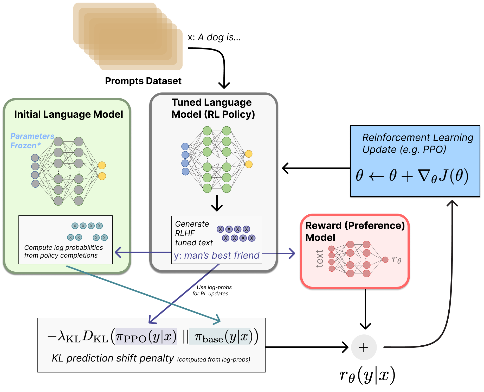
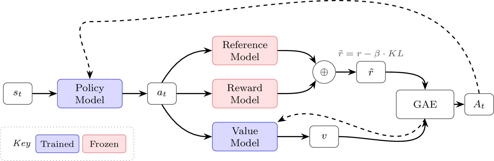
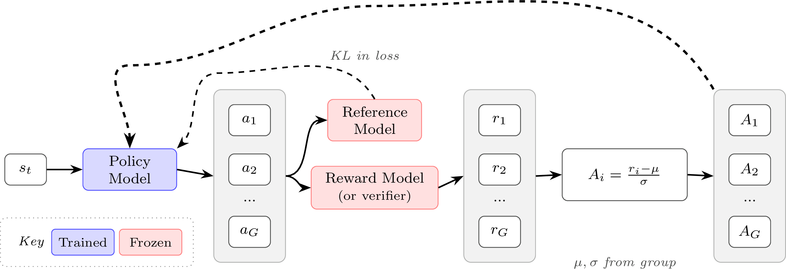

# 🌍 强化学习与 RLHF 学习笔记：策略梯度算法 (Policy Gradient Algorithms)

> 结合原理、图解与核心数学逻辑的完整笔记，可直接用于学习与演示展示。

---

## 📌 一、前言：RLHF的运作机制与现实例子

如果把训练大语言模型 (Large Language Models, LLMs) 比作**“在米其林餐厅培养一位顶级主厨”**，那么在 RLHF（基于人类反馈的强化学习, Reinforcement Learning from Human Feedback）阶段，其实是一个包含“四重角色”的剧组在协同运作。这四个模型各司其职：

### 🥩 1. 策略模型 (Policy Model) —— 【新晋主厨】（主角）
* **角色设定**：就是我们需要不断微调 (Fine-tuning)、让其变聪明的那个大模型主机（比如未经过 RLHF 洗礼的基础 DeepSeek 或 Llama 模型）。
* **运作机制**：客人点单（输入提示词，Prompt：*“解释一下量子物理”*），他负责现拉现做，炒出一盘菜（生成一段回复内容，Response/Completion）。

### 🧐 2. 奖励模型 (Reward Model) —— 【米其林美食评论家】（裁判）
* **角色设定**：一个在前期阶段已经被人类标记数据 (Human-labeled Data) 喂饱、深谙对错的“品鉴家”。
* **运作机制**：主厨把菜端上来，评论家尝一口后给出一个**打分 (Reward, R)**。如果菜香气扑鼻（逻辑清晰、没有幻觉），给高分 +10；如果菜里有毒（胡说八道或者含有毒言论），给扣分 -10。主厨（策略模型）的唯一终极目标，就是想尽一切办法反复试错，让这个预期回报最大化 (Maximize Expected Reward)。

### 📘 3. 参考模型 (Reference Model) —— 【祖传菜谱/老主厨】（防偏栏 / 对照组）
* **角色设定**：它是新晋主厨“原先的样子”（即初始策略模型的绝对冻结版本，权重永远不更新，只读）。
* **痛点（为什么需要它？）**：因为我们遇到过**“奖励作弊 (Reward Hacking)”**。假设这是一家川菜馆，主厨为了迎合一个喜欢吃甜的美食评论家拿到最高分，疯狂在麻婆豆腐里加一斤白糖。这样虽然在特定评分系统下分很高，但这盘菜已经完全背离了人类的常识认知（这在模型表现上，就是模型为了得高分而退化成一台只会念正确代码但没有上下文思考的复读机）。
* **运作机制**：系统会严格对比【新主厨】和【老主厨】做同一道菜的做法差异。如果差异太大，系统就会施加 **KL 散度惩罚 (KL Divergence Penalty)**，强行扣除新主厨的得分，逼迫他“在保持正常人类说话调性的基础上，再去追求高分”。

### 🔮 4. 价值网络 (Value Model) —— 【经验丰富的副厨】（导师 / 预言家，如 PPO 专用）
* **角色设定**：他不看最后做出来的成菜，而是在厨房全程盯着主厨做菜的**每一个微小动作**。
* **运作机制**：当主厨刚切完一份萝卜（模型刚生成了头几个词元，Tokens），副厨就在旁边根据目前的局势预估：*“按你现在的上下文逻辑和火候继续顺着写下去，最后这篇回答大概率也能得 8 分。”* 它输出的值叫 **状态价值 (State Value, V)**。这种预估能帮助主厨在写超长文本的中途就随做随算地纠正偏离路线，而不是非要等写了1万个字被打了低分后，瞎摸乱撞不知道是开头的哪一句话破坏了整个段落的好感度。



---

## 📐 二、策略梯度 (Policy Gradients) 的核心直觉与公式

所有该类算法的本质都可以浓缩为以下核心逻辑：
我们要找到一个梯度方向 (Gradient Direction) 去更新模型的参数（θ）：

```text
Δθ  正比于  Ψ_t * ∇_θ log π_θ(a_t | s_t)
```

*   `∇_θ log π_θ(a_t | s_t)`：代表调整模型参数，以**增加当前文字 (Action, a_t) 出现概率**的方向。
*   `Ψ_t`：代表当前文字或句子的**质量得分权重** (就是所谓的回报 Return 或者优势值 Advantage)。

**一句话总结**：如果得分高 (Ψ_t > 0)，就顺着梯度放大其出现概率；如果得分低 (Ψ_t < 0)，就朝着反方向抑制它的概率。

### 🔍 补充：KL散度惩罚与神秘的 `||` 符号
在原版论文的公式中，你会经常看到在末尾挂着一个惩罚项，比如： `-λ * D_KL( π_PPO(y|x) || π_base(y|x) )`
许多初学者会被里面的双竖线 `||` 迷惑，这**不是逻辑或 (OR)**，也**不是平行**。它是**KL散度 (Kullback-Leibler Divergence) 的专属分隔符**：
* **不用逗号的原因**：数学家用 `||` 代替 `,` ，是为了强烈暗示前后的地位不平等。KL散度是有方向性的 (Asymmetric)！
* **左侧 `π_PPO(y|x)`**：你正在花大算力训练的**新模型**写出这句话的分布概率。
* **右侧 `π_base(y|x)`**：训练开始前那个正常的、冻结的**初始参考模型**写这句话的分布概率。
* **整招的战略意图 (KL Penalty)**：如果新模型虽然拿到了高分，但说话方式越来越怪（偏离了初始基准模型），`||` 左右两边的分歧就会急剧变大。这个项会在它的总得分里狠狠扣减，强行把走火入魔的模型“拉回正常人类说话的语境”。

---

## 🎯 三、算法演进路径解析（为什么要这么迭代？）

算法的迭代并非是单纯地发明新公式，而是为了解决上一代算法在“方差过大 (High Variance)”或“显存吃紧 (High VRAM Usage)”等方面的具体痛点。具体演进逻辑如下：

### 1. 第一阶段：原始 REINFORCE
*   **基本模式**：模型生成一段回答，裁判（Reward Model）打分。得分高，就把这段回答中**所有词**的生成概率统统提高；得分低，就统统降低。
*   **痛点（为什么要演进）**：由于只看最后的“总分”（绝对分，Absolute Reward），评价会非常不稳定。比如模型写了一篇水平一般的文章得 5 分，但另一篇胡言乱语得 1 分，这会导致模型不知道 5 分算是好还是坏，引发极大的**训练高方差（震荡，High Variance）**。

### 2. 第二阶段：引入 Baseline 与 RLOO (REINFORCE Leave-One-Out)
*   **和前一个阶段的区别**：为了解决方差问题，第二代算法引入了“基线（Baseline）”。不再单纯看绝对分，而是看**相对分（优势 Advantage = 实际得分 Reward - 基线预期分 Baseline）**。
*   **RLOO 的巧妙设计**：传统的做法是需要训练一个庞大的“价值模型 (Value Model)”来评估预期的基线分。但 RLOO 选择了一种取巧的方式：让模型针对**同一个问题(Prompt)生成多个备选回答 (Completions)**。在算某一个回答的优势时，直接把**组内其他几个回答的均分 (Mean Reward)**作为该回答的基线。
*   **痛点（为什么要演进）**：RLOO 虽然免去了额外训练基线模型的麻烦，但它的步进更新方式依然是原始的。如果某一次偶然得分极高，梯度更新的步子可能迈得**太大**，直接把模型原有的正常发声能力“带偏”走火入魔。我们需要一种能“限制步子大小”的安全机制。


---

### 3. 第三阶段：PPO (近端策略优化, Proximal Policy Optimization)
*   **和前一个模型的区别**：PPO 作为近几年的行业标杆，为了让策略更新别“用力过猛”拉垮模型，引入了两个核武器：
    1.  **重要性采样 (Importance Sampling)**：比较新版本和旧版本模型在生成当前词的概率变化率（比率，Ratio ρ）。
    2.  **截断机制 (Clipping Mechanism)**：如果变化率太大（比如跑出了 `[0.8, 1.2]` 的安全区间），就强制截断，无论优势多大都不再给更多额外奖励。这个机制强行画出了一个**信任/安全区域 (Trust Region)**。
    3.  **庞大精密的体系**：为了配合 PPO 对每个词级别进行精确预估，它往往需要并行存在一个完整的**价值网络 (Value Model)**（几乎和策略模型一样大）。
*   **痛点（为什么要演进）**：PPO 非常稳健，但是在当代庞大的分布式系统上（特别是长推理链训练）有一个致命弱点：**太耗显存 (VRAM Hungry)**。你需要同时跑多个极大模型（策略、奖励、参考、价值模型等）。随着基座大模型单体逐渐变强变大，多养一个“价值网络”成了一种算力与显存灾难。




---

### 4. 第四阶段：GRPO (组相对策略优化, Group Relative Policy Optimization)
GRPO 是 DeepSeek-V3, R1 等最新标杆模型的底层核心策略分支。本质是精简瘦身高度优化版的大语言模型 PPO。
*   **和前一个模型 PPO 的区别**：
    1.  **彻底舍弃价值模型（Value Model）**：直接省下了极其惊人的显存开销，这也是能进行庞大参数量 RLHF 的关键！
    2.  **汲取 RLOO 的长处**：如何做到不用价值模型还能算基线？它倒退回了并改良了 RLOO 的组内比较法。对同一个 Prompt 让模型生出好几个（比如 4-8 个）不同的回答（组，Group）。
    3.  **计算革新**：直接针对这一组答案的分数，算出**组内均值 (Group Mean)**和**组内标准差 (Group Standard Deviation)**。任何一个回答的“相对优势”，就是看它在组里表现比平均成绩高了几个标准差 （`Advantage = (Score - Mean) / Std`）。然后把这个相对优势代入 PPO 的截断等式中。
*   **迭代带来的绝对优势**：极大地精简了架构。砍掉价值模型省出的海量显存和算力，全部回馈给“给同一个问题大规模生成多样化思维链（Chain of Thought, CoT）回答”的强化学习探索机制。这是目前激发逻辑**推理**能力最高效的做法。



---

## 🛠️ 四、步入长文本时代：长上下文带来的挑战与模型变体

当我们指导模型写超长思维链（CoT，动辄几千至数万个 Token）时，原有的 PPO、GRPO 等**基于词元级别 (Token-level)** 评估的算法表现出了明显的水土不服。在极长序列下，连乘的“相对变化率”极容易因为前后累加导致数值崩溃或失真。

### 1. 序列级别的优化变体：GSPO 与 CISPO
*   **痛点（为什么要演进）**：Token级别的更新目标会导致遇到整体很长的句子时表现出怪异的震荡（Erratic Behavior），使得长序列优化异常困难。
*   **GSPO (组序列策略优化, Group Sequence Policy Optimization)**：
    *   **区别**：将优化目标从 Token 细节强行拉高到 **序列层面 (Sequence-level)**。使用**整段回复相对概率的几何平均数 (Geometric Mean)**来计算总体重要性比率。这解决了长序列生成由于连乘造成的比率数值溢出崩溃，使得长回答与短回答能放在一个合理的尺度下评估。
*   **CISPO (截断重要性采样策略优化, Clipped Importance Sampling Policy Optimization)**：
    *   **区别**：GSPO 和 PPO 依然会去因为“截断（Clipping）上限”而扔掉梯度信号。当面临极端长思考中极其罕见但是绝对正确、重要的词汇时，扔掉梯度会让模型变成睁眼瞎。CISPO 采用了一种叫 Stop-Gradient 的底层黑科技去**直接截断重要性采样权重系数本身 (Directly clipping the importance weights)**，进而在保留控制方差安全性的同时，让那些即便严重偏离均值的极端推理关键点也能留下微弱但是至关重要的反向传播（微调）信号。

### 2. 工程破局：异步训练与 TIS (截断重要性采样)
*   **现实困境（为何要异步）**：算法再好，PPO / GRPO 这类在线策略关联算法 (On-policy Algorithms) 的核心要求都是 —— 模型必须等待这一轮大家全部做完题、复核打完分后统一更新大脑。这就导致大量运算单元在互相无谓地干等，严重拉低大模型训练的吞吐速度 (Throughput)。
*   **工程解决方案**：采用**读写分离的分布式异步架构 (Distributed Asynchronous Architecture)**（类似 Ray 的架构）。专门的推理节点没日没夜地做卷子（演员节点 Actors，可搭载 vLLM）；专门的中心节点仅仅负责默默接收各种考卷结果算梯度、更新中心模型（学习节点 Learners）。
*   **TIS 的补位作用**：这套工厂流水线由于存在交接的时差（负责考试的模型答卷时，所用的模型参数或许已经是远古版本了），必须利用补位机制 **TIS (截断重要性采样, Truncated Importance Sampling)** 给学习率加上一套“数学补偿系数”，去熨平新旧版本模型由于时空错位带来的轻微“梯度漂移 (Gradient Drift)”。


---

> **结语**：RLHF的进阶不在于堆砌新奇的公式，大浪淘沙留下的多是像 GRPO 这样结合长文本客观情景进行的“断舍离设计”。而制胜的王道更多隐藏诸如KL散度加设阈值的控制、奖励机制去方差技巧 (Variance Reduction Techniques) 以及超长样本的分布平衡当中。

---

## 📚 参考资料 / References
* 关于深入实现与技术细节的补充阅读：[RLHF Book - Policy Gradients (Implementation)](https://rlhfbook.com/c/06-policy-gradients#implementation)
