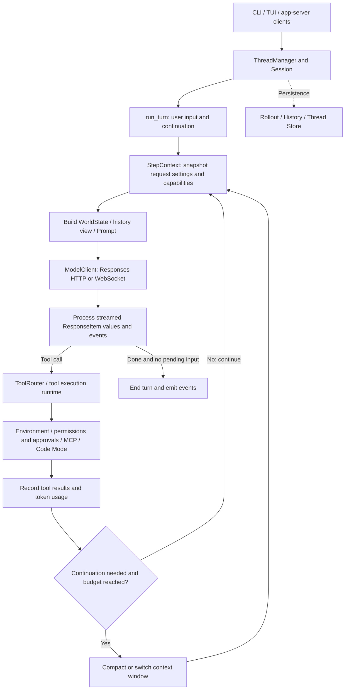
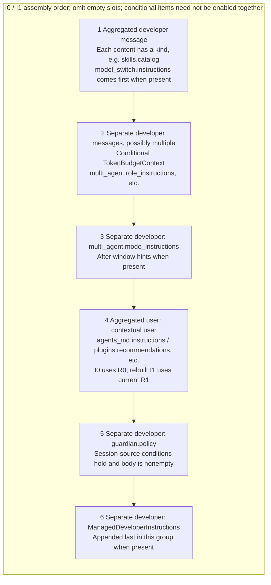
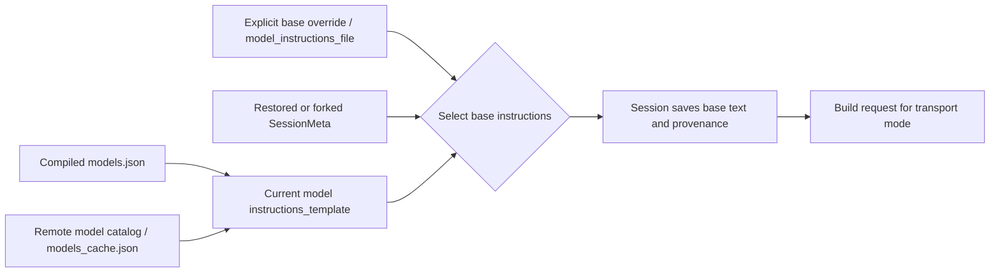
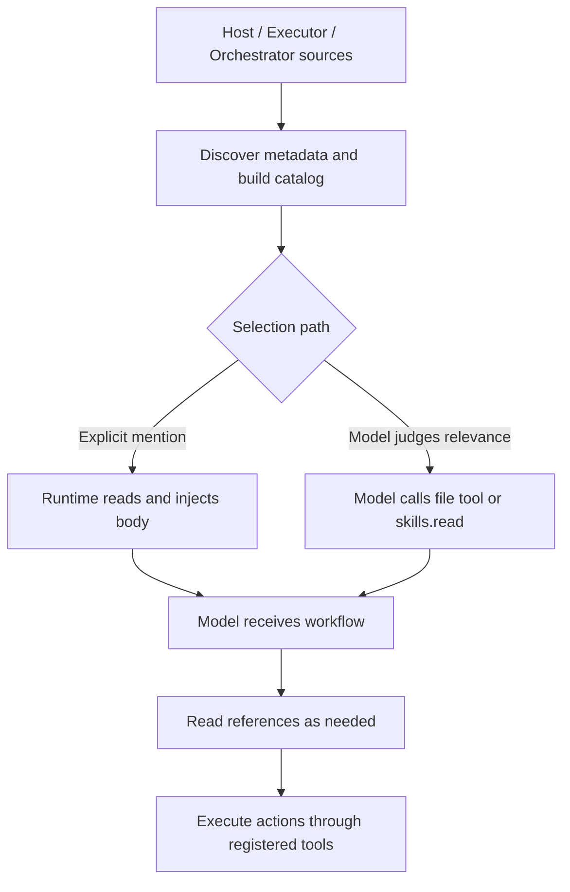
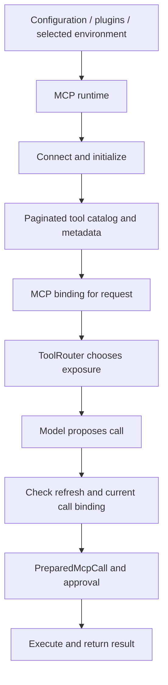
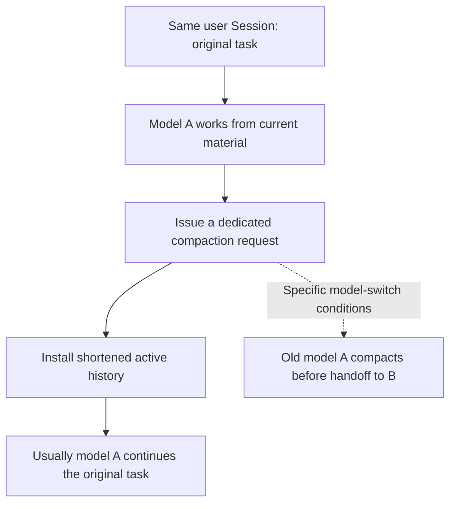
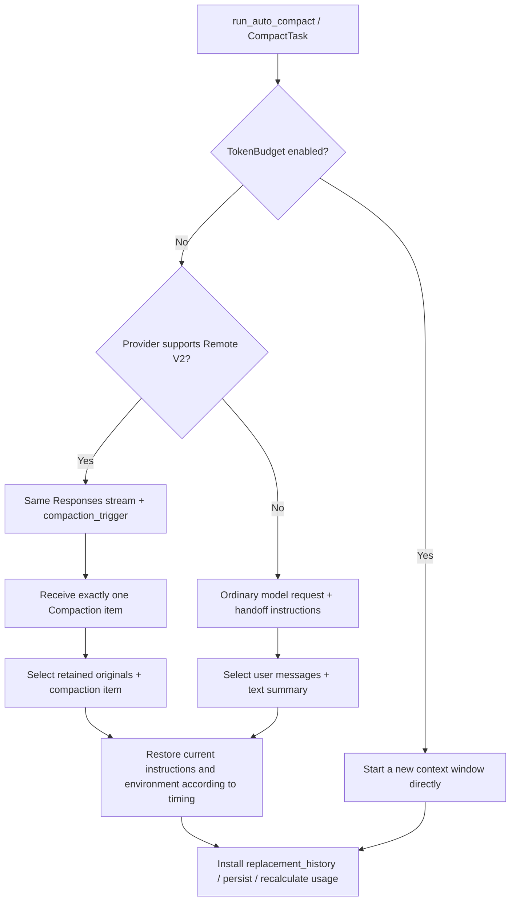
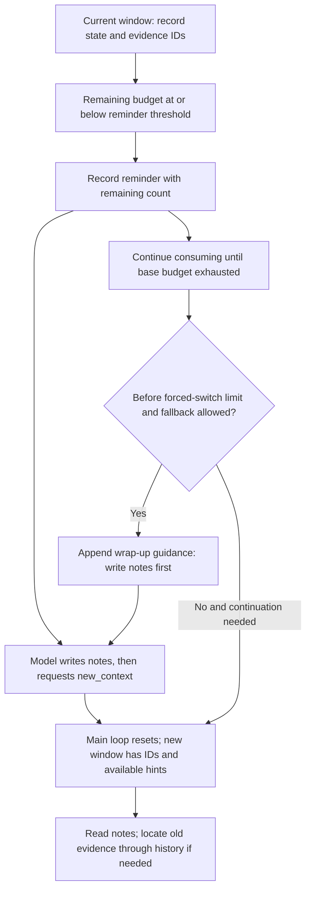

# Inside the Codex Harness: Execution, Skills, MCP, and Context Management

[中文](Codex_Harness_Research.html) · **English**

> Companion guide: [The Codex Harness: From Requests to Execution and Recovery](learn/en.html). Read the guide for the execution order, then use this manual to check source, constants, and conditions.<br>
> Reading conventions: **[Source fact]** means behavior directly supported by this snapshot; **[Interpretation]** summarizes mechanisms; **[Practical guidance]** identifies engineering tradeoffs that need your own evaluation.<br>
> Related study: [Comparative Context Compression Research (Chinese)](../agent-context-compression/Agent_Context_Compression_Research.html). Interpret each platform against its own snapshot. The WorldState misconception has also been corrected there; history/notes and pressure warnings separately identify the newer snapshot's conditions.

Audit date: 2026-09-11 (America/Los_Angeles). Official repository: `openai/codex`. Pinned commit: [`944d6fd1ba4baab69dbedd205282dc72ec20abb5`](https://github.com/openai/codex/tree/944d6fd1ba4baab69dbedd205282dc72ec20abb5), committed at 2026-09-12 01:21:25 UTC.

“Current” in this document refers only to this source snapshot, not every released client, account, or server deployment. **[Source fact]** describes what the code does; **[Interpretation]** explains the problems those mechanisms address. No real model was called to assess compaction quality, and the full Rust test suite was neither built nor run.

**Prerequisites: familiarity with agent harnesses, model sampling, and tool calls.** This document directly examines Codex's client implementation: object boundaries, request assembly, capability loading, history rewriting, and recovery. The companion guide uses source-structure diagrams and named implementation comparisons to explain tradeoffs.

Both documents follow the same learning path; this manual further divides it into numbered source sections: **architecture → request anatomy → input loading → runtime updates → compaction and recovery → comparison and evaluation**. Locate the system, inspect a concrete input, then trace its origins and changes. Chapter transitions in the guide connect these parts.

| Guide chapter | Question you should be able to answer | Manual sections |
|---|---|---|
| 1. Architecture | Which objects carry request flow and state flow? | §1–2 |
| 2. Request anatomy | Where are instructions, tools, history, and program state? | §3 Input layout |
| 3. Instructions and capabilities | Who fills each input component, under which conditions? | §4 |
| 4. Runtime updates | How do tool results, user input, and rule changes enter history? | §2, §5, §5.3 |
| 5. Compaction and recovery | When is history rewritten; what is retained, rebuilt, and resumed? | §6–8 |
| 6. Comparison and evaluation | What does Codex gain and pay relative to other organizations? | §9–11 |

| Diagram entry | Corresponding source analysis |
|---|---|
| [Codex modules](learn/en.html#step-1) / [run_turn sampling boundary](learn/en.html#step-2) | §2 Session, StepContext, ModelClient, and ToolRouter |
| [Base-instruction assembly](learn/en.html#step-4) / [Skill sources and injection](learn/en.html#skills-step) / [MCP call binding](learn/en.html#mcp-step) | §4 Configuration, model catalogs, extensions, and tools |
| [ContextManager state](learn/en.html#step-3) / [WorldState's three states and diffs](learn/en.html#step-5) | §5 Typed history; §5.3 Notifications and recovery baselines |
| [Budget explorer](learn/en.html#step-6) / [Three history-replacement paths](learn/en.html#step-7) | §6 Measurement and triggers; §7 Compaction; §8 Replacement checkpoints |
| [Request deltas and caching](learn/en.html#step-9) / [Follow a compaction trace](learn/en.html#step-10) | §9 Cache boundaries; §11 Verification evidence |

<a id="scope"></a>

## 1. What exactly is open source?

Codex's open-source scope supports studying a complete coding-agent client runtime: CLI/TUI, app-server, the core loop, tool routing, execution environments, context management, persistence, and model-request construction. The repository uses Apache-2.0. This does not mean the model weights, inference service, remote compaction algorithm, or entire hosted product are open source. [Repository license](https://github.com/openai/codex/blob/944d6fd1ba4baab69dbedd205282dc72ec20abb5/LICENSE)

OpenAI's engineering article explains that this core supports multiple Codex product forms. Still distinguish shared architecture from a particular product's deployed details. [Official architecture article](https://openai.com/index/unrolling-the-codex-agent-loop/)

**Central claim: the most instructive part of the Codex harness is how it assigns state to the model or the program and decides when to rebuild model input, rather than one long prompt.**

**[Interpretation]** We follow requests through Session → StepContext → Prompt / ToolRouter, and state through ContextManager → WorldState / Rollout. These two paths locate loading, compaction, and recovery responsibilities.

<a id="architecture"></a>

## 2. Harness structure



**Reading focus: use the diagram to locate components, then examine consistency boundaries, typed history, and state reconstruction in the table. Layered components alone do not establish uniqueness.**

This simplifies the main path for teaching. Hooks, interruption, queued input, model switches, and tool discovery all affect the real loop. `run_turn` is not one question followed by one answer: a user request may involve many sampling steps and tool executions. The source combines model continuation requirements with pending user input; a text response alone does not prove that the task is finished. [Main loop](https://github.com/openai/codex/blob/944d6fd1ba4baab69dbedd205282dc72ec20abb5/codex-rs/core/src/session/turn.rs#L163)

| Component | Responsibility | Focus: location or design choice? | Source entry |
|---|---|---|---|
| ThreadManager / Session | Session lifecycle, active tasks, history, shared services | Locate ownership; component names do not establish uniqueness | `core/src/thread_manager.rs`, `core/src/session/` |
| TurnContext | Context and preferences for a task turn | Distinguish turn and sampling lifetimes | `core/src/session/turn_context.rs` |
| StepContext | Snapshot of model, environment, MCP, tools, AGENTS.md for one request | Consistent settings, rules, and tool plan for sampling; not a frozen external world | `core/src/session/step_context.rs` |
| ContextManager | Active history, token information, context baselines, retained facts | Typed items and metadata; rewrite/recovery boundaries | `core/src/context_manager/history.rs` |
| WorldState | Comparable sections for environment, instructions, and capabilities | Comparable state, three knowledge states, replacement/revocation; not just final strings | `core/src/context/world_state/` |
| ModelClient | Serialization, streaming, retries, delta-transport state | Standard Responses/Lite wire formats and delta branches | `core/src/client.rs` |
| ToolRouter | Model-visible tools, deferred discovery, Code Mode, execution entry points | Distinguish visible schema, discovery, and execution binding | `core/src/tools/router.rs` |

**[Interpretation]** For Java developers, Session resembles a long-lived session object, and StepContext an immutable request-scoped snapshot. It provides a consistent sampling view of environment, rules, and tool plans. MCP still checks refresh state and obtains a PreparedMcpCall before execution. Request-plan consistency and actual call-binding consistency are separate; external connections and catalog changes are not permanently frozen. See §4.6. [StepContext fields and constraints](https://github.com/openai/codex/blob/944d6fd1ba4baab69dbedd205282dc72ec20abb5/codex-rs/core/src/session/step_context.rs#L17)

<a id="request-layout"></a>

## 3. Input layout of one request

This decomposition is a logical model, not a literal definition of wire fields:

```text
Model input = base behavior instructions + tool definitions + current environment/rules + active conversation history

Program state = configuration, permissions, tool runtime state, context baselines, history metadata, persistent records
```

They overlap but cannot replace one another. History on disk is not necessarily visible to the model on every request; permission text read by the model is not the mechanism enforcing those permissions.

<a id="input-anatomy"></a>

### 3.1 Dissecting input: position, type, and source are different dimensions

The [interactive input explorer](learn/en.html#context-map) switches among the initial request, tool results, rule updates, post-Local/V2 compaction, and a new TokenBudget window. Inspect each item's identity. The positions are:

```text
Client program state (not automatically sent)     Standard Responses request
Configuration / model catalog ─────────────────→ instructions
Tool registry / MCP binding ───────────────────→ tools
WorldState / extensions ────────────────────────→ rule and environment fragments in input
ContextManager history ────────────────────────→ ordered items in input
Rollout / checkpoint ──recovery─────────────────→ current history; not the whole archive sent directly
```

| Object | Position in a standard request | Role / type | Source and meaning |
|---|---|---|---|
| Base instructions | Top-level instructions | No message.role | Configuration, inheritance, or model template; assembled separately from active history |
| Tool definitions | Top-level tools | Schema, not tool results | Current model_visible_specs; not necessarily every registered tool |
| AGENTS rules | Context messages in input | user; agents_md.instructions | Program-constructed project rules, not this turn's actual user input |
| Skill catalog | Extension fragments in input | developer; skills.catalog | Catalog contribution from this Skills extension |
| Selected Skill body | Injected fragment in input | user; skills.selected_skill_instructions | Read and injected by the runtime; role=user does not make it an actual user request |
| U1 / U2 | History items in input | user; user.text | Actual user requirements in the example |
| Call / result | History items in input | function_call / function_call_output | Separate typed items, paired by call_id; do not force message.role onto them |
| Local summary | Tail of replacement history | user; compaction.summary | Model summary wrapped by the client, not a new system policy |
| V2 compaction item | Tail of replacement history | compaction; no ordinary message.role | encrypted_content is opaque to the client |

The user role can carry requirements, AGENTS rules, Skill bodies, and Local summaries. **Role expresses instruction hierarchy; kind and source help the program identify, retain, and rebuild content.** I0/I1 in the diagram are visual groups of initial fragments, not protocol items.

#### 3.1.1 Expanding I0 / I1: not one undifferentiated context block



This is a **slot diagram** of the initial-context constructor, not a full transcript. An aggregate message contains multiple content items; do not draw each kind as a separate message. Guardian policy follows contextual user. Standard top-level instructions/tools and Lite prefixes are outside the group, as shown above. The group occupies different history positions initially and after mid-turn compaction; see the comparison below and [expandable explorer](learn/en.html#context-map). [Construction and final order](https://github.com/openai/codex/blob/944d6fd1ba4baab69dbedd205282dc72ec20abb5/codex-rs/core/src/session/mod.rs#L4264)

A selected Skill's `skills.selected_skill_instructions` uses a **separate user-role injection path**, not a fixed slot 4 in the constructor. Model-initiated reading appears as tool calls/results. Keep catalog, selected body, and reading result distinct.

Responses Lite ordering matters: `AdditionalTools` with its own developer role is inserted first, then a developer fragment for nonempty base instructions, then original input. Top-level instructions becomes empty and tools is omitted. These prefixes are rebuilt per request, not necessarily appended to persistent history. [Request conversion](https://github.com/openai/codex/blob/944d6fd1ba4baab69dbedd205282dc72ec20abb5/codex-rs/core/src/client.rs#L804), [Skill roles and kinds](https://github.com/openai/codex/blob/944d6fd1ba4baab69dbedd205282dc72ec20abb5/codex-rs/ext/skills/src/fragments.rs#L39), [Local summary role](https://github.com/openai/codex/blob/944d6fd1ba4baab69dbedd205282dc72ec20abb5/codex-rs/core/src/context/compaction_summary.rs#L17)

Simplified mid-turn compaction:

```text
Before: I0(R0) → U1 → c2 / FAIL → ΔR(R1) → U2 → c3 / edit succeeded
Local:  U1 → I1(R1) → U2 → S (text summary)
V2:     U1 → I1(R1) → U2 → Compaction (opaque)
Reset:  I1 (current rules and available window hints; no automatic U1/U2 or summary)
```

U1/U2 are assumed to fit the verbatim-retention budget; other candidates and modalities are omitted. Not every real request looks like this. Ordinary updates append ΔR; compaction installs replacement history and rebuilds rules according to timing. A static system/user/assistant three-layer diagram cannot explain these distinct changes.

<a id="instructions"></a>

## 4. How does the harness load instructions, Skills, and MCP?

What people call the “system prompt” spans multiple message sources here. Distinguish server-side system instructions, client base instructions, developer messages, AGENTS.md user context, and tool definitions.

### 4.1 Base-instruction priority: configuration → inherited session → model catalog



At `Session` initialization, the exact priority is:

1. Resolved `config.base_instructions`.
2. `session_meta.base_instructions` from restored/inherited history.
3. The template returned by the current model's `get_model_instructions()`.

Configuration resolution itself prioritizes an explicit override over `model_instructions_file` contents, then the compatibility field `cfg.instructions`. `developer_instructions` is a separate additional-content path. A custom instruction file therefore replaces the base source rather than automatically appending to the default prompt. [Priority](https://github.com/openai/codex/blob/944d6fd1ba4baab69dbedd205282dc72ec20abb5/codex-rs/core/src/session/mod.rs#L687), [File reading](https://github.com/openai/codex/blob/944d6fd1ba4baab69dbedd205282dc72ec20abb5/codex-rs/core/src/config/mod.rs#L3894)

<a id="provenance"></a>

#### Why save Custom / Model provenance as well as text?

User-provided base instructions should survive model changes. Model A's defaults must not be mistaken for a user override when switching to B. `BaseInstructionsProvenance` encodes that lifecycle distinction. [Provenance type](https://github.com/openai/codex/blob/944d6fd1ba4baab69dbedd205282dc72ec20abb5/codex-rs/protocol/src/models.rs#L1524)

```rust
enum BaseInstructionsProvenance {
    Custom,
    Model { model: String },
}
```

At initialization, explicit configuration defaults to `Custom` unless the caller supplies known provenance. Inherited provenance is reused. For old history without provenance, `Model` is inferred only if saved text exactly equals the current template; otherwise it remains unknown. This is migration compatibility, not complete recovery of actual origins. [Initialization logic](https://github.com/openai/codex/blob/944d6fd1ba4baab69dbedd205282dc72ec20abb5/codex-rs/core/src/session/session.rs#L719)

| Case | Saved meaning | Downstream use |
|---|---|---|
| User instruction file → `Custom` | Explicit user choice of base text | Remains an override when constructing model configuration |
| Inherited from A → `Model { A }` | A's defaults, not user customization | Filter out the override so the current model can use its own template |
| Old history with unresolvable provenance | Text origin unknown | Keep it unknown; do not assume a replaceable model default |

Also distinguish **persisted base text** from **instructions sent to the current model**. A model switch can generate a WorldState `ModelSwitchInstructions` developer fragment, moved to the front of the developer bundle, without rewriting SessionMeta in place. `get_prompt_base_instructions()` may conditionally adjust a request copy, such as removing update-plan guidance, without changing text used for persistence or forks. [Override filtering](https://github.com/openai/codex/blob/944d6fd1ba4baab69dbedd205282dc72ec20abb5/codex-rs/core/src/config/mod.rs#L1625), [Current model state](https://github.com/openai/codex/blob/944d6fd1ba4baab69dbedd205282dc72ec20abb5/codex-rs/core/src/session/world_state.rs#L46), [Switch rendering](https://github.com/openai/codex/blob/944d6fd1ba4baab69dbedd205282dc72ec20abb5/codex-rs/core/src/context/world_state/model.rs#L44), [Request copy](https://github.com/openai/codex/blob/944d6fd1ba4baab69dbedd205282dc72ec20abb5/codex-rs/core/src/session/mod.rs#L1409)

**[Interpretation]** Provenance answers who owns configuration and how it may evolve. Saving only the final string conflates user choices with model defaults and makes safe restoration and model switching harder.

**Implementation comparison · Who maintains the prompt lifecycle?** LangChain's `system_prompt` accepts strings or SystemMessage values and supports dynamic prompt middleware. Codex builds priority and persisted provenance into the client. This distinguishes user overrides from defaults, at the cost of model catalogs, provenance migration, and old-session compatibility. It does not imply every LangChain application stores only a final string. [LangChain prompt interface](https://docs.langchain.com/oss/python/langchain/agents#system-prompt)

### 4.2 Model catalogs and ModelMessages

`models.json` is compiled into the program. `ModelsManager` also handles remote metadata, disk caches, ETags, identity matching, and refresh policy. Entries contain capabilities and window information as well as `model_messages.instructions_template`. Finding a prompt.md on GitHub is therefore insufficient to identify the base instructions used by a running session. [Bundled entry](https://github.com/openai/codex/blob/944d6fd1ba4baab69dbedd205282dc72ec20abb5/codex-rs/models-manager/src/lib.rs#L15), [Remote refresh and merging](https://github.com/openai/codex/blob/944d6fd1ba4baab69dbedd205282dc72ec20abb5/codex-rs/models-manager/src/manager.rs#L435)

Another version difference: this snapshot's `get_model_instructions()` returns **literal template text** and no longer expands personality placeholders using old `instructions_variables`, which remain for compatibility. `Personality::None` is handled in model-configuration overrides and can remove the Personality section. Do not carry forward an older explanation that personality variables are always dynamically expanded. [Template implementation](https://github.com/openai/codex/blob/944d6fd1ba4baab69dbedd205282dc72ec20abb5/codex-rs/protocol/src/openai_models.rs#L534), [Personality override](https://github.com/openai/codex/blob/944d6fd1ba4baab69dbedd205282dc72ec20abb5/codex-rs/models-manager/src/model_info.rs#L19)

`ModelMessages` also contains built-in tool descriptions, approval and permission text, collaboration modes, multi-agent messages, and token-budget reminders/fallback configuration. Missing fields may use built-in text. For example, None and an empty string for `ToolMessage.description` mean “use the built-in description” and “leave the description empty,” respectively. **Model-specific text management does not put every string exclusively on the server.** [ModelMessages](https://github.com/openai/codex/blob/944d6fd1ba4baab69dbedd205282dc72ec20abb5/codex-rs/protocol/src/openai_models.rs#L551), [Fallback semantics](https://github.com/openai/codex/blob/944d6fd1ba4baab69dbedd205282dc72ec20abb5/codex-rs/protocol/src/openai_models.rs#L597)

**[Interpretation]** Models, tool instructions, and context policies can evolve together, reducing hard-coded client branches. But a fixed binary alone cannot fully reproduce behavior when remote catalogs participate. Record actual catalogs, overrides, inherited text, and provenance too. Offline, cached, and static-catalog paths still exist; “the system prompt is not in the client” is too broad. [Bundled catalog initialization](https://github.com/openai/codex/blob/944d6fd1ba4baab69dbedd205282dc72ec20abb5/codex-rs/models-manager/src/manager.rs#L298)

### 4.3 Base instructions are not always in top-level instructions

| Path | How instructions and tools are sent |
|---|---|
| Standard Responses | `instructions = base_instructions.text`; tools use a separate `tools` field |
| Model metadata `use_responses_lite=true` | Prepend `AdditionalTools` and a developer-role base-instruction message to `input`; top-level instructions is empty and top-level tools is absent |

Lite also derives stable IDs from the session and visible content, avoiding random new identities on retry/recovery. **Role semantics, the internal Prompt object, and wire JSON fields are separate layers.** [Two assembly paths](https://github.com/openai/codex/blob/944d6fd1ba4baab69dbedd205282dc72ec20abb5/codex-rs/core/src/client.rs#L795), [Developer role of base-instruction fragments](https://github.com/openai/codex/blob/944d6fd1ba4baab69dbedd205282dc72ec20abb5/codex-rs/core/src/context/base_instructions.rs#L7)

Equivalent construction for Lite IDs, subsequently wrapped as `ResponseItemId` with `at` / `msg` type prefixes:

```text
namespace        = UUIDv5(NAMESPACE_OID, string bytes of thread_id)
AdditionalTools  = UUIDv5(namespace, serialized tool bytes)
BaseInstructions = UUIDv5(namespace, base-instruction text bytes)
```

The same thread and payload produce the same ID; another thread need not. The source guarantees stable identity for these request-only prefixes across retries/recovery, not KV-cache hits. `store:false` also does not imply every turn retransmits everything; see §9.

#### Initial-context assembly positions

Start with the [I0/I1 slot diagram](#input-anatomy), then check the assembly code.

`build_initial_context_with_world_state()` aggregates developer content, moves model-switch content first, then adds separate developer fragments, separately handled multi-agent mode, aggregated contextual user content, and applicable guardian policy and managed developer instructions. Extensions declare positions through `PromptSlot` values such as `DeveloperPolicy`, `DeveloperCapabilities`, and `ContextWindow`. The notes thread hint enters window context rather than being arbitrarily appended to the user request. [Assembly entry](https://github.com/openai/codex/blob/944d6fd1ba4baab69dbedd205282dc72ec20abb5/codex-rs/core/src/session/mod.rs#L4110), [Final order](https://github.com/openai/codex/blob/944d6fd1ba4baab69dbedd205282dc72ec20abb5/codex-rs/core/src/session/mod.rs#L4296)

**Implementation comparison · Similar rule text, different placement interfaces.** OpenHands converts SystemPromptEvent into a system message. Standard Codex Responses puts base instructions in a top-level field; Lite converts them into input prefixes. Both implement base behavior guidance over different protocols. “Base instructions are always developer messages” applies only to the relevant fragment path. [OpenHands events and roles](https://docs.openhands.dev/sdk/arch/events)

### 4.4 AGENTS.md is user context with discovery order and a budget

Project discovery proceeds root → cwd, using `.git` to identify the root by default. Within each directory, candidates are selected in order: `AGENTS.override.md`, `AGENTS.md`, then configured fallback names. It does not concatenate every candidate in a directory. Project text shares a default 32 KiB budget; without a root, only cwd is checked. Core also receives global/task user instructions from host providers and skips project discovery when the project is untrusted. [Discovery algorithm](https://github.com/openai/codex/blob/944d6fd1ba4baab69dbedd205282dc72ec20abb5/codex-rs/core/src/agents_md.rs#L1), [Source management](https://github.com/openai/codex/blob/944d6fd1ba4baab69dbedd205282dc72ec20abb5/codex-rs/core/src/agents_md_manager.rs#L1)

These become user-role context fragments; the AGENTS.md filename grants no system authority. `AgentsMdManager` caches results. Repository rereads depend on environment selection and trust changes, so editing a file does not guarantee a disk reread before the next sample. Global/task providers have their own fetching/caching responsibilities. [Manager refresh](https://github.com/openai/codex/blob/944d6fd1ba4baab69dbedd205282dc72ec20abb5/codex-rs/core/src/agents_md_manager.rs#L63), [AGENTS state and role](https://github.com/openai/codex/blob/944d6fd1ba4baab69dbedd205282dc72ec20abb5/codex-rs/core/src/context/world_state/agents_md.rs#L37)

**Implementation comparison · Project instructions and path rules differ.** OpenHands documents repo skills as always-present project context, while PathTrigger adds rules to observations on file access. Codex uses `user / agents_md.instructions` here and a manager controls refresh. Compare trigger, role, and update policy; do not place every instruction file in system or equate all OpenHands repo skills with path rules. [OpenHands Skill types](https://docs.openhands.dev/sdk/arch/skill)

<a id="skills-loading"></a>

### 4.5 Skills: discovery, selection, bodies, and resources

**[Source fact]** Skills have distinct source boundaries; not every entry is a file in a host directory.

| Source | Discovery | Reading |
|---|---|---|
| Host | Configured skill roots, user/repository .agents/skills, system skills, plugins, extra roots; deduplicated paths | Read SKILL.md through the corresponding filesystem |
| Executor | Capability snapshot or skill roots of the execution environment | Validate authority/package identity and read through the owning environment's filesystem |
| Orchestrator | Query MCP resources with MIME mcp/skill | Read package resources through MCP resource interfaces |

Host roots include the compatible $CODEX_HOME/skills location. Repository .agents/skills is discovered between the project root and task cwd. Discovery order, scope, and plugin identity affect entry handling; this is not a whole-disk scan followed by name-based overwriting. The Orchestrator provider has enablement and environment conditions, not universal availability in local sessions. [Host roots](https://github.com/openai/codex/blob/944d6fd1ba4baab69dbedd205282dc72ec20abb5/codex-rs/ext/skills/src/host_roots.rs#L29), [Environment sources](https://github.com/openai/codex/blob/944d6fd1ba4baab69dbedd205282dc72ec20abb5/codex-rs/ext/skills/src/provider/executor.rs#L72), [Orchestrator sources](https://github.com/openai/codex/blob/944d6fd1ba4baab69dbedd205282dc72ec20abb5/codex-rs/ext/skills/src/provider/orchestrator.rs#L26), [Extension startup conditions](https://github.com/openai/codex/blob/944d6fd1ba4baab69dbedd205282dc72ec20abb5/codex-rs/ext/skills/src/extension.rs#L155)

#### First loading boundary: scanned files are not necessarily in the model window

Discovery reads SKILL.md for metadata and may read associated configuration. **Progressive disclosure means the model sees catalog summaries before bodies as needed; it does not mean the process never read the files earlier.** The Host service caches snapshots by cwd/configuration and offers cache clearing. Sampling is not synonymous with rescanning the filesystem. [Discovery implementation](https://github.com/openai/codex/blob/944d6fd1ba4baab69dbedd205282dc72ec20abb5/codex-rs/ext/skills/src/loader/discovery.rs#L54), [Host snapshot cache](https://github.com/openai/codex/blob/944d6fd1ba4baab69dbedd205282dc72ec20abb5/codex-rs/ext/skills/src/host_service.rs#L177), [Cache clearing](https://github.com/openai/codex/blob/944d6fd1ba4baab69dbedd205282dc72ec20abb5/codex-rs/ext/skills/src/host_service.rs#L375)

Catalog rendering has its own budget: an explicit `max_context_tokens` is capped at 10,000 tokens; otherwise, a known model window yields 2% of that window; without either, the fallback is 8,000 characters. Units differ by branch, and 10,000 is not a universal cap. The renderer allocates description space and may use short path aliases. [Catalog budgets](https://github.com/openai/codex/blob/944d6fd1ba4baab69dbedd205282dc72ec20abb5/codex-rs/ext/skills/src/render.rs#L129), [Rendering](https://github.com/openai/codex/blob/944d6fd1ba4baab69dbedd205282dc72ec20abb5/codex-rs/ext/skills/src/render.rs#L492)



#### Second loading boundary: explicit versus model-initiated selection

1. **Explicit selection.** Selection handles structured Skill inputs, mentions of skill:// or SKILL.md, and explicit textual Skill mentions, filtering disabled entries and resolving conflicts/duplicates. It is not semantic retrieval that automatically classifies every natural-language task. [Selection logic](https://github.com/openai/codex/blob/944d6fd1ba4baab69dbedd205282dc72ec20abb5/codex-rs/ext/skills/src/selection.rs#L22)
2. **Runtime injection.** During turn input, the Skills extension lists sources, reads selected main prompts, and emits `SkillInstructions`. Core also retains a Host loading path and records injected paths to avoid repetition. “The model must call read itself before seeing a body” is therefore inaccurate. [Turn contributions](https://github.com/openai/codex/blob/944d6fd1ba4baab69dbedd205282dc72ec20abb5/codex-rs/ext/skills/src/extension.rs#L355), [Core loading](https://github.com/openai/codex/blob/944d6fd1ba4baab69dbedd205282dc72ec20abb5/codex-rs/core/src/session/turn.rs#L1009), [Host deduplication and reading](https://github.com/openai/codex/blob/944d6fd1ba4baab69dbedd205282dc72ec20abb5/codex-rs/ext/skills/src/host_prompt.rs#L10)
3. **Model-initiated selection.** For a merely related task, the catalog lets the model decide whether to read. Host files use available file tools; resource-backed sources use skills.list / skills.read. This does not unconditionally auto-load all relevant bodies.

The extension's `AvailableSkillsInstructions` uses developer; `SkillInstructions` uses user, with `skills.selected_skill_instructions` and fields including name, path, resource_access, and contents. **Skill bodies enter history as identifiable instruction fragments, not automatically promoted system prompts.** [Fragment definitions](https://github.com/openai/codex/blob/944d6fd1ba4baab69dbedd205282dc72ec20abb5/codex-rs/ext/skills/src/fragments.rs#L39)

#### Third loading boundary: read bodies, references, and scripts separately

skills.read accepts a package, optional resource, and cursor. Omitting resource reads the main SKILL.md; referenced files use resource identifiers returned in the catalog. Executor reads also provide skill_root for bundled scripts. Resource interfaces validate package ownership instead of treating skill:// as a local path. Pagination uses a cached read snapshot. [Read tool](https://github.com/openai/codex/blob/944d6fd1ba4baab69dbedd205282dc72ec20abb5/codex-rs/ext/skills/src/tools/read.rs#L35), [Environment/resource validation](https://github.com/openai/codex/blob/944d6fd1ba4baab69dbedd205282dc72ec20abb5/codex-rs/ext/skills/src/provider/executor.rs#L130)

Size limits are path-specific: extension auto-injection truncates the main body at 8,000 bytes. Core's Host path has corresponding truncation for agent-plugin Skills. Neither implies all Host bodies are limited to 8 KB, and neither is the catalog's token budget. [Body truncation](https://github.com/openai/codex/blob/944d6fd1ba4baab69dbedd205282dc72ec20abb5/codex-rs/ext/skills/src/render.rs#L1176), [Host injection](https://github.com/openai/codex/blob/944d6fd1ba4baab69dbedd205282dc72ec20abb5/codex-rs/ext/skills/src/host_prompt.rs#L69)

**[Interpretation]** A Skill primarily supplies instructions and resources for how to do work. Reading script instructions neither executes the script nor creates permission to execute it; actions still go through tools and environments. Catalogs, bodies, references, and outputs occupy context separately, connecting on-demand loading and later compaction within one information lifecycle.

**Implementation comparison · Who decides when a body enters input?** OpenHands keyword/path triggers expose deterministic injection points. Codex distinguishes explicit selection from model-initiated reading. The former makes triggers easier to locate; the latter requires tracing catalogs, reads, and injected outputs. These are different diagnostic entry points, not proof of lower token cost. [OpenHands triggers](https://docs.openhands.dev/sdk/arch/skill)

<a id="mcp-loading"></a>

### 4.6 MCP: configuration, connection, catalog, exposure, call binding

MCP “loading” has at least five stages. A configured server is not necessarily connected, fully exposed through schemas, or authorized for a particular invocation.

| Stage | Source behavior | Boundary |
|---|---|---|
| Gather configuration | Session, plugins, selected-environment servers, then policy/permission constraints | Not one hard-coded configuration file |
| Connect | Stdio uses the local/Executor launcher; Streamable HTTP handles transport and authentication | Transport determines connection, not model exposure |
| Initialize and list | initialize negotiates capabilities, reads server instructions, then paginates list_tools | Resource and tool catalogs use distinct interfaces |
| Build request plan | MCP binding catalog plus built-in, extension, and dynamic tools forms ToolRouter | Direct, deferred, and Code Mode exposure need separate selection |
| Execute | Check dirty refresh, obtain current binding, create PreparedMcpCall, then approve/call | Connections and metadata need not remain unchanged after request transmission |

Configuration entries: [Session projection](https://github.com/openai/codex/blob/944d6fd1ba4baab69dbedd205282dc72ec20abb5/codex-rs/core/src/session/mcp.rs#L92), [Runtime inputs](https://github.com/openai/codex/blob/944d6fd1ba4baab69dbedd205282dc72ec20abb5/codex-rs/core/src/session/mcp_runtime.rs#L330), [Plugin parsing](https://github.com/openai/codex/blob/944d6fd1ba4baab69dbedd205282dc72ec20abb5/codex-rs/codex-mcp/src/plugin_config.rs#L45). Plugin parsing can retain valid server entries while reporting others' errors; an invalid top-level format is a separate case. Connection code: [Transport construction](https://github.com/openai/codex/blob/944d6fd1ba4baab69dbedd205282dc72ec20abb5/codex-rs/codex-mcp/src/rmcp_client.rs#L1136), [Initialization and first catalog](https://github.com/openai/codex/blob/944d6fd1ba4baab69dbedd205282dc72ec20abb5/codex-rs/codex-mcp/src/rmcp_client.rs#L907), [Paginated list_tools](https://github.com/openai/codex/blob/944d6fd1ba4baab69dbedd205282dc72ec20abb5/codex-rs/codex-mcp/src/rmcp_client.rs#L654).



The diagram shows ordinary connection establishment. Ordinary sources in this snapshot use Eager startup; SubAgent sources choose LazyWhenCached, which defers initialization only when cache and implementation conditions hold. Prewarming has a separate best-effort coalescing queue. A cached catalog does not prove every MCP server initialized; deferred exposure does not mean server startup waits for the first search. Required-server initialization failures have dedicated validation. [Startup policy](https://github.com/openai/codex/blob/944d6fd1ba4baab69dbedd205282dc72ec20abb5/codex-rs/core/src/session/mcp_runtime.rs#L388), [Lazy conditions](https://github.com/openai/codex/blob/944d6fd1ba4baab69dbedd205282dc72ec20abb5/codex-rs/codex-mcp/src/connection_manager.rs#L256), [Prewarming](https://github.com/openai/codex/blob/944d6fd1ba4baab69dbedd205282dc72ec20abb5/codex-rs/core/src/session/mcp_prewarm.rs#L1), [Required validation](https://github.com/openai/codex/blob/944d6fd1ba4baab69dbedd205282dc72ec20abb5/codex-rs/codex-mcp/src/connection_manager/required.rs#L1)

#### Two consistency boundaries, not a permanently frozen request

During sampling, McpBinding supplies a frozen model-visible catalog. The runtime reuses or recaptures it based on catalog revision, preventing arbitrary mixing of versions during schema assembly. [Binding](https://github.com/openai/codex/blob/944d6fd1ba4baab69dbedd205282dc72ec20abb5/codex-rs/codex-mcp/src/binding.rs#L30), [Revision checks](https://github.com/openai/codex/blob/944d6fd1ba4baab69dbedd205282dc72ec20abb5/codex-rs/codex-mcp/src/runtime.rs#L366)

At execution, McpHandler calls `Session::prepare_mcp_call`, first runs `refresh_mcp_if_dirty`, then obtains `current_binding_for_call` and prepares the invocation. Execution metadata and configuration come from that prepared call, and approval occurs within this boundary. **This is more accurate than claiming schema, client, and permissions remain one snapshot from sampling through execution.** If the catalog changed, inspect actual preparation to determine executability; an old schema alone cannot guarantee success. [Call preparation](https://github.com/openai/codex/blob/944d6fd1ba4baab69dbedd205282dc72ec20abb5/codex-rs/core/src/session/mcp_runtime.rs#L61), [Handler](https://github.com/openai/codex/blob/944d6fd1ba4baab69dbedd205282dc72ec20abb5/codex-rs/core/src/tools/handlers/mcp.rs#L175), [Approval](https://github.com/openai/codex/blob/944d6fd1ba4baab69dbedd205282dc72ec20abb5/codex-rs/core/src/mcp_tool_call.rs#L219)

MCP resources have separate list/read paths. Orchestrator Skills read resources; this does not register each Skill as an MCP tool. Tool schemas, resource content, and Skill instructions are separate objects. [Resource interfaces](https://github.com/openai/codex/blob/944d6fd1ba4baab69dbedd205282dc72ec20abb5/codex-rs/codex-mcp/src/binding.rs#L108)

**Implementation comparison · How do schemas connect to executors?** OpenHands discovers and wraps MCPToolDefinition values at initialization and invokes them through MCPToolExecutor. Codex separately maintains model-visible plans and execution-time PreparedMcpCall. Compare the binding boundary between catalog change and invocation without assuming the other implementation lacks consistency protections. [OpenHands MCP architecture](https://docs.openhands.dev/sdk/arch/tool-system#mcp-integration)

<a id="tool-loading"></a>

### 4.7 On-demand model exposure and plugins connecting the loading chains

build_tool_router gathers built-in tools, MCP tools, extension executors, and dynamic tools, then applies exposure policy, exclusions, conflicts, namespaces, and modes. Execution registries and model-visible definitions are maintained separately. [Assembly entry](https://github.com/openai/codex/blob/944d6fd1ba4baab69dbedd205282dc72ec20abb5/codex-rs/core/src/tools/spec_plan.rs#L125), [Final plan](https://github.com/openai/codex/blob/944d6fd1ba4baab69dbedd205282dc72ec20abb5/codex-rs/core/src/tools/spec_plan.rs#L352), [Router fields](https://github.com/openai/codex/blob/944d6fd1ba4baab69dbedd205282dc72ec20abb5/codex-rs/core/src/tools/router.rs#L74)

| Exposure | How the model obtains capability | What does not follow |
|---|---|---|
| Direct | Schema enters this request's tool definitions | Every configured server tool is present |
| Deferred | Catalog cues first; search returns loadable definitions | Search installs new servers |
| Code Mode | Code execution entry plus nested tool definitions | Every nested tool must also be a top-level schema |
| Hidden / policy-excluded | Not exposed through ordinary direct/deferred paths | Hidden tools remain freely callable |

This is a teaching classification; source combinations include DirectModelOnly, DeferredModelOnly, and CodeModeOnly. Search depends on model support and namespace-tool conditions; direct/deferred MCP choices and plugin budgets have their own branches. [Search conditions](https://github.com/openai/codex/blob/944d6fd1ba4baab69dbedd205282dc72ec20abb5/codex-rs/core/src/tools/spec_plan.rs#L629), [MCP exposure](https://github.com/openai/codex/blob/944d6fd1ba4baab69dbedd205282dc72ec20abb5/codex-rs/core/src/mcp_tool_exposure.rs#L75), [Code Mode registration](https://github.com/openai/codex/blob/944d6fd1ba4baab69dbedd205282dc72ec20abb5/codex-rs/core/src/tools/spec_plan.rs#L791)

tool_search builds a BM25 index over the current deferred registry, validates query/limit, returns `LoadableToolSpec` values, and merges related definitions. It searches an existing tool catalog, not the internet, and installs no dependencies. Catalog caches invalidate when registry identity or dynamic search information changes. [Index and caching](https://github.com/openai/codex/blob/944d6fd1ba4baab69dbedd205282dc72ec20abb5/codex-rs/core/src/tools/handlers/tool_search.rs#L53), [Query and results](https://github.com/openai/codex/blob/944d6fd1ba4baab69dbedd205282dc72ec20abb5/codex-rs/core/src/tools/handlers/tool_search.rs#L205)

Plugins may contribute both Skills and MCP configuration, but these enter separate chains. For an explicitly selected Host Skill, Core may also run `maybe_prompt_and_install_mcp_dependencies`, subject to first-party client source, the `SkillMcpDependencyInstall` feature, missing dependencies, policy, and installation choice, followed by installation and possible authentication. **Reading SKILL.md does not establish that its MCP dependencies are installed or authorized.** [Plugin MCP contributions](https://github.com/openai/codex/blob/944d6fd1ba4baab69dbedd205282dc72ec20abb5/codex-rs/ext/mcp/src/lib.rs#L62), [Skill dependencies](https://github.com/openai/codex/blob/944d6fd1ba4baab69dbedd205282dc72ec20abb5/codex-rs/core/src/mcp_skill_dependencies.rs#L40)

**[Interpretation]** Codex separates capability cues, usage instructions, callable definitions, external connections, and pre-execution binding/approval. This reduces resident context and gives different sources appropriate lifecycles. Diagnosis must identify the failing layer rather than label every problem a missing prompt.

<a id="context"></a>

## 5. Maintaining history and current rules together

### 5.1 Active history is typed data

`ContextManager` stores `Arc<Vec<ResponseItemEnvelope>>`, not one string. An Envelope contains a `ResponseItem` and harness metadata, including client provenance, tool-output budgets, compaction-model compatibility markers, and user-input ordering. Read-only snapshots share memory; mutation copies it. [History structure](https://github.com/openai/codex/blob/944d6fd1ba4baab69dbedd205282dc72ec20abb5/codex-rs/core/src/context_manager/history.rs#L69), [Envelope](https://github.com/openai/codex/blob/944d6fd1ba4baab69dbedd205282dc72ec20abb5/codex-rs/history/src/lib.rs#L36)

This matters in practice: calls and results must match by `call_id`; `role=user` alone cannot distinguish real user messages from program injections. Assistant phases, encrypted reasoning, images, and other structure must not disappear through plain-text concatenation.

<a id="fragments"></a>

#### From fragment to wire: roles, kinds, and text markers

`ContextualUserFragment` declares a body, `role()`, `content_kind()`, opening/closing markers, and whether it requires a separate message. `render_fragment()` produces `RenderedFragment`. Conversion to `ResponseItem` places kinds in `internal_chat_message_metadata_passthrough.content_item_kinds`, so type information extends beyond client memory. [Trait and conversion](https://github.com/openai/codex/blob/944d6fd1ba4baab69dbedd205282dc72ec20abb5/codex-rs/context-fragments/src/fragment.rs#L35)

| Information | Question answered | Examples and boundaries |
|---|---|---|
| `role` | Which instruction level does the message occupy? | AGENTS.md uses `user`; base-instruction fragments use `developer` |
| `content_kind` | What kind of content is each item? | `agents_md.instructions`, `model.base_instructions`, `compaction.summary`; actual user text uses `user.text` |
| Marker | How is previously injected text recognized without structured state? | Identify old AGENTS blocks; markerless fragments do not match arbitrary bodies |
| Envelope metadata | How should the harness handle the history item? | Provenance, budgets, retention conditions; distinct from wire kind labels |

In the update path, `merge_contextual_fragments()` merges only **consecutive fragments with the same role when both permit merging**. N fragments become N content items in one message, with a matching kind array. A fragment requiring its own message ends the merge run. The following shape omits IDs and other fields; it is not a captured request. [Merge implementation](https://github.com/openai/codex/blob/944d6fd1ba4baab69dbedd205282dc72ec20abb5/codex-rs/core/src/context_manager/updates.rs#L12)

```json
{
  "type": "message",
  "role": "user",
  "content": [
    {"type": "input_text", "text": "<fragment A body>"},
    {"type": "input_text", "text": "<fragment B body>"}
  ],
  "internal_chat_message_metadata_passthrough": {
    "content_item_kinds": ["feature_a.instructions", "feature_b.instructions"]
  }
}
```

**[Interpretation]** Merging messages preserves content classification, so receivers need not infer origin from `role=user` alone. But client source does not establish whether servers use labels for training, billing, or compaction. The `is_openai=false` send branch strips internal metadata and `encrypted_function_args`; this is not a guarantee supported by every Responses provider. [Sending boundary](https://github.com/openai/codex/blob/944d6fd1ba4baab69dbedd205282dc72ec20abb5/codex-rs/core/src/client.rs#L843)

<a id="input-preparation"></a>

### 5.2 Limit and prepare input before compaction

| Timing | Operation | Reason |
|---|---|---|
| Tool result enters history | Truncate by model policy or tool-specific override | One large log must not occupy every future request without limit |
| Before sending | Fill missing outputs and remove invalid orphan outputs | Preserve protocol structure; some missing results are marked `aborted` |
| Before sending | Handle unsupported images/audio according to model input modalities | History may originate from a model with different capabilities |
| Before remote compaction | If needed, rewrite a contiguous suffix of eligible tool outputs toward the estimated window limit | The compaction request must itself fit |

The last operation does not scan all old outputs and arbitrarily delete some. It walks backward from the tail and stops at an ineligible item. It is not a universal recovery guarantee for arbitrarily oversized input. [History insertion and normalization](https://github.com/openai/codex/blob/944d6fd1ba4baab69dbedd205282dc72ec20abb5/codex-rs/core/src/context_manager/history.rs#L350), [Tail preparation](https://github.com/openai/codex/blob/944d6fd1ba4baab69dbedd205282dc72ec20abb5/codex-rs/core/src/compact_remote_history.rs#L73)

**Implementation comparison · Tool-output cleanup is not unique to Codex.** LangChain's ContextEditingMiddleware / ClearToolUsesEdit can clear older results, retain recent ones, and optionally clear call arguments. Codex here handles a contiguous rewritable suffix before remote compaction. Triggers, scan direction, and retained objects differ; “everyone else just summarizes” is not a valid baseline. [LangChain context editing](https://docs.langchain.com/oss/python/langchain/middleware/built-in#context-editing)

### 5.3 WorldState: full initialization, then appended diffs

<a id="world-state"></a>

Each section has a stable ID, a `Snapshot` containing only comparison data, and `render_diff(previous)`. None means no model notification is needed. These diffs are **semantic change notices**: an AGENTS change may resend the full text with replacement wording, not hand a JSON patch directly to the model. [Section contract](https://github.com/openai/codex/blob/944d6fd1ba4baab69dbedd205282dc72ec20abb5/codex-rs/core/src/context/world_state/mod.rs#L226)

#### Why does previous state need three states?

| State | Knowledge about retained history | AGENTS example |
|---|---|---|
| `Known(snapshot)` | Exact snapshot can be reconstructed | Send nothing if equal; otherwise replace/remove based on previous content |
| `Absent` | No usable snapshot or matching-fragment evidence for this section | Send current rules in full without replacement wording; does not mean they never appeared anywhere in the session |
| `Unknown` | Old fragment evidence exists but exact snapshot is unavailable | Send full current rules with replacement wording, or explicitly revoke old rules if current rules are empty |

`Option<Snapshot>` alone collapses “no old rules visible” and “old rules visible but exact content unknown” into None. Without replacement wording in the latter case, old rules may still influence work. If history says “run all tests” but current rules say “module tests only,” the active version must be explicit even when the old snapshot is lost. [AGENTS three-state implementation](https://github.com/openai/codex/blob/944d6fd1ba4baab69dbedd205282dc72ec20abb5/codex-rs/core/src/context/world_state/agents_md.rs#L52)

`render_history_diff()` prefers snapshots. Without one, it scans legacy fragment roles/markers and returns Unknown on a match. Deserialization failure also falls back to Unknown. For sections declaring a retained-fragment matcher, a saved snapshot can still be treated as Absent if its text is no longer in retained history. **Saved state is not necessarily still visible to the model.** [History fallback](https://github.com/openai/codex/blob/944d6fd1ba4baab69dbedd205282dc72ec20abb5/codex-rs/core/src/context/world_state/mod.rs#L413), [Deserialization fallback](https://github.com/openai/codex/blob/944d6fd1ba4baab69dbedd205282dc72ec20abb5/codex-rs/core/src/context/world_state/mod.rs#L111)

These are knowledge states passed to a section, not universal text templates shared by every section; model sections must still determine whether the model changed. Diffing is not file watching: comparison needs an updated snapshot from `AgentsMdManager`. Environment selection, task cwd, or trust changes can trigger repository rereads. In-place edits usually do not change the cache key, and cd in a shell subprocess does not automatically change the task environment. [Cache boundary](https://github.com/openai/codex/blob/944d6fd1ba4baab69dbedd205282dc72ec20abb5/codex-rs/core/src/agents_md_manager.rs#L79)

#### Model notices versus recovery merge patches

`ContextManager::update_world_state()` produces two outputs: fragments rendered against retained history, and state records written to rollout. With no baseline it saves a full snapshot; with a baseline it saves an RFC 7386 merge patch. Unchanged state produces no patch. [Dual outputs](https://github.com/openai/codex/blob/944d6fd1ba4baab69dbedd205282dc72ec20abb5/codex-rs/core/src/context_manager/history.rs#L295)

Deletion semantics in a teaching tool-catalog example:

```json
{"before": {"tools": {"search": "Find references", "db": "Query data"}},
 "patch":  {"tools": {"db": null}},
 "after":  {"tools": {"search": "Find references"}}}
```

Null in an object patch means deletion, so null object fields are recursively removed from snapshots before comparison. Arrays are replaced as a whole, not cleared elementwise by that rule. A section serializing entirely to null is logged as an error and skipped. Recovery applies full snapshots and patches chronologically, clearing old baselines at compaction. Orphan patches without a full baseline are ignored; a delta alone cannot reconstruct the whole. [Patch algorithm](https://github.com/openai/codex/blob/944d6fd1ba4baab69dbedd205282dc72ec20abb5/codex-rs/core/src/context/world_state/mod.rs#L307), [Null handling](https://github.com/openai/codex/blob/944d6fd1ba4baab69dbedd205282dc72ec20abb5/codex-rs/core/src/context/world_state/mod.rs#L485), [Recovery replay](https://github.com/openai/codex/blob/944d6fd1ba4baab69dbedd205282dc72ec20abb5/codex-rs/core/src/session/rollout_reconstruction.rs#L439)

Some sections save rendering fingerprints with `WorldStateHash`: SHA-1 with a domain separator, separately length-prefixed role and text, and normalized CRLF. It detects visible-fragment changes; **it is not a tool-result backup, prompt cache key, or authentication credential**. [Fingerprint](https://github.com/openai/codex/blob/944d6fd1ba4baab69dbedd205282dc72ec20abb5/codex-rs/core/src/context/world_state/mod.rs#L262)

**[Interpretation]** Ordinary execution appends change notices while preserving the existing prefix. Rebuilding canonical context after compaction creates an opportunity to remove old rules and establish a fresh baseline. The transferable design is program-maintained state, explicit model notices, and separate recovery records—not an assumption that natural-language replacement wording can never be misunderstood.

<a id="world-state-boundary"></a>

#### Correction to the related study: WorldState is not a tool-output snapshot

The comparative study previously explained the removal of original tool-result items by claiming WorldState saved tool state. That causal account lacked evidence and has been corrected in its text and diagrams. Built-in sections in this snapshot represent environment, rules, permissions, model, and capabilities. `ToolsState` stores deferred-tool namespaces and descriptions, with a 4 KiB rendering limit and 250-character per-description limit. It does not store call results. [ToolsState](https://github.com/openai/codex/blob/944d6fd1ba4baab69dbedd205282dc72ec20abb5/codex-rs/core/src/context/world_state/tools.rs#L12)

Separate three facts: workspace changes may remain; some output information may enter a summary/opaque checkpoint; complete original-text retrieval depends on separate storage/retrieval paths. The Local handoff prefix mentions tool state, but does not establish a full output snapshot or that deletion is always safe because rereading is possible. [Handoff prefix](https://github.com/openai/codex/blob/944d6fd1ba4baab69dbedd205282dc72ec20abb5/codex-rs/prompts/templates/compact/summary_prefix.md)

**[Practical guidance]** For changing files, one-time APIs, random output, and time-specific test results, rerunning produces a new observation rather than necessarily recovering old evidence. If exact historical results matter, explicitly save originals and verify addressable recovery. “The world still exists” is not a fidelity evaluation.

<a id="budget"></a>

## 6. When does compaction trigger?

### 6.1 Token usage combines server observations and local estimates

Ordinary counting roughly combines the latest server-reported usage with estimates for local items added after the last model-generated item. If the server omitted past reasoning, corresponding estimates are added. After compaction, usage is recalculated for the new history. [Counting](https://github.com/openai/codex/blob/944d6fd1ba4baab69dbedd205282dc72ec20abb5/codex-rs/core/src/context_manager/history.rs#L663), [Post-compaction recalculation](https://github.com/openai/codex/blob/944d6fd1ba4baab69dbedd205282dc72ec20abb5/codex-rs/core/src/session/mod.rs#L4645)

Local byte-based estimation is not an exact tokenizer. `estimate_token_count_with_base_instructions` is not an exact measurement of the full server prompt either. Do not read UI estimates as token-by-token measurements of actual model input.

### 6.2 Budgets have at least two levels

Let `W` be the resolved context window, `p` be `effective_context_window_percent`, and `C` be the configured automatic-compaction budget.

For ordinary `Total` scope:

```text
Default automatic threshold A = floor(0.90 × W)
When configured             A = min(C, floor(0.90 × W))
Full usable-window limit    H = floor(p × W / 100)
```

A relevant fallback configuration may add a buffer. `BodyAfterPrefix` instead counts only growth after the current window's initial prefix toward the automatic budget, while independently checking the full-window limit. Neither “only compact at 90%” nor “always compact at 200k” is generally correct. [Model thresholds](https://github.com/openai/codex/blob/944d6fd1ba4baab69dbedd205282dc72ec20abb5/codex-rs/protocol/src/openai_models.rs#L521), [Scopes and full-window limit](https://github.com/openai/codex/blob/944d6fd1ba4baab69dbedd205282dc72ec20abb5/codex-rs/core/src/session/context_window.rs#L49)

One source-test fixture uses `W=272,000`, `p=95`, and `C=250,000`, yielding `A=244,800` and `H=258,400`. This explains the formula; it is not the current account's model specification. [Threshold tests](https://github.com/openai/codex/blob/944d6fd1ba4baab69dbedd205282dc72ec20abb5/codex-rs/protocol/src/openai_models.rs#L1811)

**Implementation comparison · Normalize units first.** OpenHands documents event-count checks for LLMSummarizingCondenser. LangChain summarization middleware supports token, message-count, or window-fraction triggers. Codex's BodyAfterPrefix distinguishes initial prefix from later growth while checking the full window. These parameters cannot simply share one percentage axis. [OpenHands condenser](https://docs.openhands.dev/sdk/arch/condenser), [LangChain trigger configuration](https://docs.langchain.com/oss/python/langchain/middleware/built-in#summarization)

### 6.3 There is more than one trigger point

| Trigger point | Condition and handling |
|---|---|
| Before new-turn sampling | Existing context reaches budget; compact before ordinary sampling |
| After tools / sampling | Continued execution or pending input is needed and budget is reached |
| Manual user request | `Op::Compact` starts a separate CompactTask |
| Model switch | Known compaction compatibility hashes change, or a smaller window faces excessive history; the old model may compact first |
| Special paths | Guardian overflow recovery has dedicated logic, not universal unlimited automatic retries |

This is program control, not reliance on the model remembering to summarize near the limit. Missing compatibility hashes do not establish incompatibility: the source detects a change only when both exist and differ. [Trigger logic](https://github.com/openai/codex/blob/944d6fd1ba4baab69dbedd205282dc72ec20abb5/codex-rs/core/src/session/turn.rs#L1231), [In-turn trigger](https://github.com/openai/codex/blob/944d6fd1ba4baab69dbedd205282dc72ec20abb5/codex-rs/core/src/session/turn.rs#L597)

<a id="compaction"></a>

## 7. Three compaction paths

<a id="compaction-session-model"></a>

### 7.1 Object identity: does compaction change Session or model?



This diagram applies to summarizing compaction; TokenBudget reset skips model summarization. The user's task Session and request-level ModelClientSession are different objects. Creating the latter does not start a new user task or change the model.

| Path | Request-level session | Model specified in request | Result destination |
|---|---|---|---|
| Remote V2 | Reuse the supplied client session in-turn; separate calls may create one | Current `turn_context.model_info()` | Original user Session's replacement history |
| Local summary | Create ModelClientSession and reuse across compaction retries | Current `turn_context.model_info()` | Summary and retained history in the original Session |
| TokenBudget | No model summarization request | Not applicable | New context window in the original task |

V2 reads original history/base instructions, appends a trigger, and uses supplied current model metadata. Local reads history, appends a summary request, and also uses supplied model metadata. **The client does not default to a separate small summarizer in these ordinary paths. Public client source cannot prove whether Remote V2 uses another model internally on the server.** [V2 request/session](https://github.com/openai/codex/blob/944d6fd1ba4baab69dbedd205282dc72ec20abb5/codex-rs/core/src/compact_remote_v2_attempt.rs#L31), [V2 model parameters](https://github.com/openai/codex/blob/944d6fd1ba4baab69dbedd205282dc72ec20abb5/codex-rs/core/src/compact_remote_v2.rs#L379), [Local client session](https://github.com/openai/codex/blob/944d6fd1ba4baab69dbedd205282dc72ec20abb5/codex-rs/core/src/compact.rs#L246), [Local model parameters](https://github.com/openai/codex/blob/944d6fd1ba4baab69dbedd205282dc72ec20abb5/codex-rs/core/src/compact.rs#L764)

On A → B switches, a known compatibility-hash change or a smaller B window with the relevant history pressure may cause A to compact first. Under particular authentication, provider, and error conditions, failure with A can retry using B. This is a model-switch branch, not a separate model for every compaction. [Switch and fallback conditions](https://github.com/openai/codex/blob/944d6fd1ba4baab69dbedd205282dc72ec20abb5/codex-rs/core/src/session/turn.rs#L1296)

### 7.2 Routing among the three paths



Routing uses provider capability, not whether a model name contains `codex`. OpenAI, recognized Azure Responses providers, and Amazon Bedrock implementations in this snapshot can declare V2; other providers can use Local summarization. [Routing](https://github.com/openai/codex/blob/944d6fd1ba4baab69dbedd205282dc72ec20abb5/codex-rs/core/src/session/turn.rs#L1397), [Provider detection](https://github.com/openai/codex/blob/944d6fd1ba4baab69dbedd205282dc72ec20abb5/codex-rs/model-provider/src/provider.rs#L353), [Bedrock capability](https://github.com/openai/codex/blob/944d6fd1ba4baab69dbedd205282dc72ec20abb5/codex-rs/model-provider/src/amazon_bedrock/mod.rs#L220)

**Implementation comparison · Which layer configures policy and model?** LangChain SummarizationMiddleware accepts a separate model, trigger, and keep. Codex routes distinct compaction lifecycles in the client. The former exposes policy composition to application authors; the latter centralizes history installation/recovery but requires understanding features, providers, and model switching. [LangChain summarization middleware](https://docs.langchain.com/oss/python/langchain/short-term-memory#summarize-messages)

### 7.3 Remote V2: a protocol-level compaction checkpoint

Call chain:

```text
run_auto_compact
  → run_inline_remote_auto_compact_task
  → run_remote_compact_v2_attempt
      clone history → prepare tail outputs if needed → for_prompt_annotated
      append {"type":"compaction_trigger"}
      retain base instructions and current tool definitions
  → ModelClientSession.stream
  → collect exactly one {"type":"compaction", "encrypted_content":"…"}
  → build_v2_compacted_history
  → replace_compacted_history
```

The trigger is a control item for this request, not persisted as an ordinary history item. Collection requires a completion event and exactly one compaction item; other assistant text is not mistaken for the summary. [Request construction](https://github.com/openai/codex/blob/944d6fd1ba4baab69dbedd205282dc72ec20abb5/codex-rs/core/src/compact_remote_v2_attempt.rs#L37), [Output validation](https://github.com/openai/codex/blob/944d6fd1ba4baab69dbedd205282dc72ec20abb5/codex-rs/core/src/compact_remote_v2.rs#L401)

**This is a major difference from older material.** The earlier official article and public API tutorials described a separate `/responses/compact`. This snapshot's V2 path uses ordinary Responses streaming plus `compaction_trigger`; integration tests explicitly assert `/v1/responses`. That neither removes the public compact API nor proves arbitrary third-party Responses-compatible services support the control item. [Test assertion](https://github.com/openai/codex/blob/944d6fd1ba4baab69dbedd205282dc72ec20abb5/codex-rs/core/tests/suite/compact_remote.rs#L969)

Returned `encrypted_content` is opaque to the client. Public code establishes reception, retention, and retransmission, but not its internal summary format, training method, fidelity, or any particular latent-memory algorithm. It is not a public KV-cache snapshot format either. [Protocol type](https://github.com/openai/codex/blob/944d6fd1ba4baab69dbedd205282dc72ec20abb5/codex-rs/protocol/src/models.rs#L1211)

#### What does Remote V2 retain?

| History category | Retention as original items after compaction |
|---|---|
| Actual user messages and recognized HookPrompt | Candidates under a shared budget |
| Assistant messages, tool calls/results, old compaction items | Outside this verbatim selection path; their information is not necessarily absent from the new checkpoint |
| AgentMessage | Separate filtering excludes specific subagent progress/completion messages and limits estimated per-item size |
| Client-supplied developer messages | Require `retain_client_developer_messages` and provenance metadata |
| Current environment, permissions, AGENTS.md, other harness context | Rebuilt from canonical state, not replaced by retaining all old developer messages |

Candidates share a **64,000-token** retention budget. Selection runs newest to oldest, may truncate the boundary message, then restores chronological order and appends the compaction item. This is neither target summary length nor total context length. The snapshot defaults `compaction_image_budget` on, counting retained user images toward the budget; client-developer retention defaults off. [Retention algorithm](https://github.com/openai/codex/blob/944d6fd1ba4baab69dbedd205282dc72ec20abb5/codex-rs/core/src/compact_remote_v2.rs#L476), [Budget and filtering](https://github.com/openai/codex/blob/944d6fd1ba4baab69dbedd205282dc72ec20abb5/codex-rs/core/src/compact_remote_v2.rs#L534), [Feature defaults](https://github.com/openai/codex/blob/944d6fd1ba4baab69dbedd205282dc72ec20abb5/codex-rs/features/src/lib.rs#L1759)

### 7.4 Local: ordinary model summarization orchestrated by the client

“Local” refers to client-side orchestration, not necessarily a locally running model.

The client appends a summary request and asks an ordinary model for a handoff summary. The public template requests progress/decisions, constraints/preferences, next steps, and essential data/references. It belongs to the Local path; **it does not reveal Remote V2's server-side prompt**. [Public summary template](https://github.com/openai/codex/blob/944d6fd1ba4baab69dbedd205282dc72ec20abb5/codex-rs/prompts/templates/compact/prompt.md)

The client then retains actual user text newest-first under an **estimated 20,000-token** budget and appends the prefixed handoff summary. `CompactionSummary` inserts it as context rather than promoting it to a system policy. If the summarization request itself overflows, Local tries removing the oldest history items and retrying. This still loses information and may change cache prefixes. [Local calls and error handling](https://github.com/openai/codex/blob/944d6fd1ba4baab69dbedd205282dc72ec20abb5/codex-rs/core/src/compact.rs#L240), [20k retention construction](https://github.com/openai/codex/blob/944d6fd1ba4baab69dbedd205282dc72ec20abb5/codex-rs/core/src/compact.rs#L667)

### 7.5 TokenBudget: experimental window reset

This path explicitly skips model/server summarization, calls `start_new_context_window`, and builds a new window with current initial context. A feature may additionally retain client developer messages. It does not automatically mean all user messages plus an automatic summary. [Reset implementation](https://github.com/openai/codex/blob/944d6fd1ba4baab69dbedd205282dc72ec20abb5/codex-rs/core/src/compact_token_budget.rs#L20), [New-window contents](https://github.com/openai/codex/blob/944d6fd1ba4baab69dbedd205282dc72ec20abb5/codex-rs/core/src/session/mod.rs#L4398)

The public repository also contains a history-notes extension for retrieval and notes across windows. Automatic `context_management` activation checks model capability, authentication, provider, and account conditions. Both `token_budget` and `context_management` default off in this snapshot. They are not universal Codex defaults, and this report does not infer their activation in the current task. [Experimental flags](https://github.com/openai/codex/blob/944d6fd1ba4baab69dbedd205282dc72ec20abb5/codex-rs/features/src/lib.rs#L1615), [Activation conditions](https://github.com/openai/codex/blob/944d6fd1ba4baab69dbedd205282dc72ec20abb5/codex-rs/core/src/session/token_budget.rs#L21), [Public history/notes implementation](https://github.com/openai/codex/blob/944d6fd1ba4baab69dbedd205282dc72ec20abb5/codex-rs/ext/history-notes/src/tools.rs)

<a id="history-notes"></a>

#### Not one switch: separate default activation, guidance, and registration

| Layer | Actual condition | Why “off” is insufficient |
|---|---|---|
| Rust feature | `Feature::TokenBudget` defaults to `false` | Explicit configuration and conditional entry points can change the default |
| Model auto-activation | With `model_messages.token_budget.enabled=true` and no explicit setting, attempt activation | False blocks this default path, not explicit enablement |
| Per-turn guidance resolution | With the feature enabled and no explicit details, use current model default messages/budgets | Activation and text selection after activation are separate decisions |
| `context_management` entry | Check model capability, provider, authentication, account conditions before activation | Model JSON alone cannot establish reachability |
| history-notes registration | Also require `use_history_notes_extension`, OpenAI provider, Codex backend authentication | Reset does not guarantee native retrieval tools |

Five bundled descriptors have token-budget objects whose `enabled` is explicitly false or omitted and deserializes to false; four others lack the object. Present objects use reminder threshold 6,144 and fallback buffer 16,384. These are **conditional catalog settings**, not runtime constants for all models. Auto-activation also respects explicit configuration and managed constraints. [Model activation/resolution](https://github.com/openai/codex/blob/944d6fd1ba4baab69dbedd205282dc72ec20abb5/codex-rs/core/src/session/token_budget.rs#L80), [Per-turn resolution](https://github.com/openai/codex/blob/944d6fd1ba4baab69dbedd205282dc72ec20abb5/codex-rs/core/src/session/turn_context.rs#L821), [Field defaults](https://github.com/openai/codex/blob/944d6fd1ba4baab69dbedd205282dc72ec20abb5/codex-rs/protocol/src/openai_models.rs#L606), [Catalog samples](https://github.com/openai/codex/blob/944d6fd1ba4baab69dbedd205282dc72ec20abb5/codex-rs/models-manager/models.json#L104), [Tool registration](https://github.com/openai/codex/blob/944d6fd1ba4baab69dbedd205282dc72ec20abb5/codex-rs/ext/history-notes/src/extension.rs#L45)

#### Notes preserve continuation cues; history retrieves addressed details

| Interface | Purpose | Source-visible limits |
|---|---|---|
| `history.list_windows / list_items` | Locate windows/items | Filter by agent, window, role, tool; returns server-normalized history |
| `history.read_item / search_contents` | Read by window/item ID or search literal substrings | Character offset/length; read-only and eventually consistent |
| `notes.write_file / append_to_file` | Save goals, progress, pending work, evidence addresses | Explicit tool actions; reset does not write notes automatically |
| `notes.read_file / list_files_by_prefix / search_contents` | Restore/find checkpoints | Virtual paths, not workspace files; lists/search may lag |
| `get_context_remaining` | Query the currently calculated remaining budget | Reuses §6.1 / §6 measurement, not another exact tokenizer |
| `new_context` | Request a new window | Handler sets a flag; the main loop handles it at a continuation boundary |

History and notes route to `alpha/history/v2/*` and `alpha/notes/v2/*`, respectively. They are not aliases for local rollout reads. The model saves opaque window/item IDs: read directly when known, otherwise list/search first. Notes can retain task state and evidence addresses, with originals fetched as needed. [Tools and schemas](https://github.com/openai/codex/blob/944d6fd1ba4baab69dbedd205282dc72ec20abb5/codex-rs/ext/history-notes/src/tools.rs#L24), [Budget handler](https://github.com/openai/codex/blob/944d6fd1ba4baab69dbedd205282dc72ec20abb5/codex-rs/core/src/tools/handlers/get_context_remaining.rs#L81), [Window-request handler](https://github.com/openai/codex/blob/944d6fd1ba4baab69dbedd205282dc72ec20abb5/codex-rs/core/src/tools/handlers/new_context_window.rs#L38)

One unresolved boundary: bundled guidance restricts cross-thread note writes, while native notes descriptions permit access to other agents' notes. Thread/agent terminology and wording differ; neither statement alone establishes server authorization policy. This study confirms public client interfaces, not server-side cross-scope permissions.

<a id="pressure"></a>

#### Pressure signals need actionable next steps

Under the bundled configuration above, the intended continuation flow is:



The condition is `remaining <= threshold`, not exactly 6,144 remaining. Reminders and fallback each track deduplication state. Fallback additionally needs zero base remaining, configured text, and current permission to fall back. The buffer is counted only with a fallback prompt, and the full-window hard limit can arrive first. **There is no guaranteed 16,384-token wrap-up allowance.** Guidance permitting only notes + new_context is not an executor-enforced tool allowlist. [Reminder conditions](https://github.com/openai/codex/blob/944d6fd1ba4baab69dbedd205282dc72ec20abb5/codex-rs/core/src/session/token_budget.rs#L161), [Buffer and hard limit](https://github.com/openai/codex/blob/944d6fd1ba4baab69dbedd205282dc72ec20abb5/codex-rs/core/src/session/context_window.rs#L87), [Main-loop ordering](https://github.com/openai/codex/blob/944d6fd1ba4baab69dbedd205282dc72ec20abb5/codex-rs/core/src/session/turn.rs#L600)

**[Interpretation]** With actions to write notes, query budget, and request windows, pressure can become an operational signal. Tool descriptions also tell the model not to narrate internal bookkeeping to the user; model awareness and user visibility are different questions. This is a testable mechanism hypothesis, not proof of superiority over Hermes' transparent compaction or timely, complete note writing. It transfers some summary-fidelity concerns to note completeness, evidence addressability, retrieval availability, and recovery cost.

<a id="recovery"></a>

## 8. Why do rules not rely solely on summaries after compaction?

The source distinguishes two canonical-context injection timings:

| Timing | Operation | What the model sees next |
|---|---|---|
| Manual / pre-turn compaction | `DoNotInject`; clear reference baseline | Next ordinary context construction fully injects current rules/environment |
| Mid-turn compaction | `BeforeLastUserMessage` | Insert current canonical context before the last actual user message, leaving summary/compaction at the tail |

A common mid-turn shape, where `U` denotes actual messages retained within budget:

```text
Base instructions assembled separately

input:
    U1 … U(n-1)
    current permissions + AGENTS.md + environment + other initial context
    Un
    compaction checkpoint / handoff summary
```

Without an actual user message, insertion falls back before the summary/compaction item. Source comments connect keeping the summary last mid-turn to model training layout, making ordering part of the behavior contract. [Injection modes](https://github.com/openai/codex/blob/944d6fd1ba4baab69dbedd205282dc72ec20abb5/codex-rs/core/src/compact.rs#L63), [Insertion algorithm](https://github.com/openai/codex/blob/944d6fd1ba4baab69dbedd205282dc72ec20abb5/codex-rs/core/src/compact.rs#L607)

**[Interpretation]** Rebuilding rules from reliable sources reduces the risk of summarization changing them. Special requirements found only in early user messages may still depend on summaries or verbatim budgets. This design does not guarantee every constraint survives.

Persistence also uses explicit checkpoints. `CompactedItem` saves `replacement_history`, window IDs, response ID, retained facts, and related data; applying replacement records the corresponding WorldState baseline. Resume/fork should restore the compacted model view, not unconditionally reinsert every old tool result. The repository includes mock integration tests for this. [Installation/persistence](https://github.com/openai/codex/blob/944d6fd1ba4baab69dbedd205282dc72ec20abb5/codex-rs/core/src/session/mod.rs#L3943), [Resume/fork tests](https://github.com/openai/codex/blob/944d6fd1ba4baab69dbedd205282dc72ec20abb5/codex-rs/core/tests/suite/compact_resume_fork.rs#L198)

**Implementation comparison · Different replay units.** OpenHands appends Condensation to an event log, then generates the next View. Codex saves replacement history and state baselines. Audit events/forgotten sets in the former, installed history/rebuilt state in the latter. Neither lets you infer model visibility from a disk record alone. [OpenHands View and Condensation](https://docs.openhands.dev/sdk/arch/condenser)

<a id="cache"></a>

## 9. Caching, transport deltas, and compaction are distinct

| Mechanism | Primarily reduces | What it does not change |
|---|---|---|
| Prompt caching | Repeated-prefix computation and associated cost | Active context still occupies the window |
| WebSocket deltas | Repeated request payload transmission | Logical input still contains the accepted prefix |
| Compaction / reset | Active-window content | Persistence does not guarantee immediate visibility or losslessness |

The January 2026 engineering article said Codex then did not use `previous_response_id`. This snapshot implements WebSocket deltas: only matching request properties and input extending the prior request plus response items permit a delta with the previous response ID. Without that match, the optimization does not apply. [Delta matching](https://github.com/openai/codex/blob/944d6fd1ba4baab69dbedd205282dc72ec20abb5/codex-rs/core/src/client.rs#L1254), [Wire construction](https://github.com/openai/codex/blob/944d6fd1ba4baab69dbedd205282dc72ec20abb5/codex-rs/core/src/client.rs#L1793)

Remote V2 keeps original instructions/tools and appends a trigger at the tail, structurally favoring prefix reuse. But pre-compaction preparation rewrites input, and tool/model changes affect reuse. Replacement history after compaction usually no longer strictly extends the old history. Thus compaction does not guarantee cache hits throughout. Measure `cached_input_tokens`, cache writes, request volume, and task quality to assess hits and savings.

Two other commonly confused conditions:

- `store:false` does not mean the server has no temporary state; WebSocket deltas remain possible. Stable IDs address prefix-item identity, deltas address repeated transport, and the server determines KV-cache hits. UUIDv5 does not establish a unique caching strategy.
- `prompt_cache_key` prefers an override. A particular `SessionSource::Internal(source)` with a parent ID yields `"{source}:{parent_thread_id}"`; otherwise it uses the session ID. If a parent defaults to P, an internal task may use source:P, which differs from P and from other sources. Including a parent ID does not put the parent and every child in one cache partition. [Key construction](https://github.com/openai/codex/blob/944d6fd1ba4baab69dbedd205282dc72ec20abb5/codex-rs/core/src/client.rs#L497)

<a id="principles"></a>

## 10. Engineering principles derived from the source

These are design interpretations, not publicly promised OpenAI outcomes:

1. **Typed history comes before summary algorithms.** Roles, call pairs, phases, original IDs, and provenance are execution semantics.
2. **Keep stable rules in program-owned sources.** Reinject after compaction so the summarizer is not their only custodian.
3. **Distinguish soft budgets from full-window limits.** Measure pressure from prefixes, growing history, tool outputs, and model switches.
4. **Leave room for the compaction request itself.** Summarization after overflow may also overflow.
5. **Persist replacement checkpoints explicitly.** Recovery should reproduce the model view, not indiscriminately resurrect discarded content.
6. **Treat cache benefits as conditional.** Shorter output and cheaper next requests are different claims.
7. **Separate verbatim retention from summary coverage.** Original-text budgets protect recent requests but cannot prove all earlier constraints survive.
8. **Read experimental features with their flags and entry paths.** A history tool or reset implementation in the repository does not establish use in an arbitrary deployed session.

<a id="harness-relations"></a>

### 10.1 Other harnesses: shared problems, different responsibilities

These comparisons use official architecture documents read on 2026-09-12; Codex remains pinned to this document's commit. Compare interfaces/data flow, not deployed defaults or task performance.

| Question | Codex | OpenHands SDK | LangChain agent / LangGraph |
|---|---|---|---|
| Core context representation | Typed active history and program-state baselines | Append-only event stream and LLM View | Agent messages state and checkpointer |
| How compaction takes effect | Construct/install replacement history | Append Condensation; next View filters events and inserts summary | Configured SummarizationMiddleware updates message state |
| Model selection responsibility | Current model_info ordinarily; old-model branch on switching | LLMSummarizingCondenser has its own LLM configuration | Middleware independently specifies model, trigger, keep |
| Type and source | Separate role, content_kind, Envelope metadata | Separate Event.source and LLM role | Message state, runtime context, and storage serve distinct purposes |

OpenHands documents Condensation's forgotten_event_ids, summary, and summary_offset, followed by View.from_events on the next step. Events remain in the append-only log. Persistent events and the current model view are separated there too, but compaction auditing enters through different objects than Codex's replacement checkpoints. [Condenser](https://docs.openhands.dev/sdk/arch/condenser), [Events and roles](https://docs.openhands.dev/sdk/arch/events)

LangChain's official example configures a checkpointer for an agent and separately installs SummarizationMiddleware, allowing a summarizer model different from the main task model and a configured retention amount. This is an agent-layer policy, not default automatic summarization in every LangGraph graph. [Short-term memory and summarization middleware](https://docs.langchain.com/oss/python/langchain/short-term-memory#summarize-messages)

### 10.2 What is instructive about Codex's design, and what does it cost?

The following analyzes the source behavior already discussed; it is not a performance ranking.

| Design | Specific problem | Benefit | Cost / unresolved issue |
|---|---|---|---|
| Separate content_kind and role | user may represent actual input or injected content | Retain/rebuild by semantic kind rather than one rule for all | Metadata, markers, and legacy compatibility become more complex; the principle is not unique |
| WorldState + three states + canonical rebuilding | Old rules remain while exact snapshots may be missing | Explicit replacement/revocation; less rule-fidelity burden on summaries | Depends on state sources/cache refresh; no guarantee of original tool evidence |
| Custom / Model provenance | Model defaults can masquerade as user overrides after switching | Preserve custom instructions while updating model defaults | Missing provenance prevents perfect intent recovery |
| Staged catalog / body / schema / call | Large capability definitions crowd every request | Add visible content on demand | More search, read, and binding steps; each may fail |
| Replacement checkpoint and output validation | Stable continuation/recovery after compaction | Audit which model view was installed | Opaque V2 content; valid format does not establish semantic completeness |
| Separate StepContext and PreparedMcpCall | Catalogs/connections can change between sampling and execution | Consistency for sampling plans and actual calls independently | A previously visible tool definition does not guarantee later execution success |

Read backward from failure scenarios: identify a failure, show how the structure addresses it, and state what remains unsolved. Proving superiority requires comparable tasks, models, and budgets, with measurements of constraint retention, completion, latency, and token cost.

<a id="evidence"></a>

## 11. Suggested source reading order and verification boundaries

Execution/context path: `session/step_context.rs` → `session/turn.rs` → `context_manager/history.rs` → `session/context_window.rs` → `compact_remote_v2_attempt.rs` / `compact_remote_v2.rs` → `compact.rs` → `session/world_state.rs` → `client.rs` → `models-manager/src/manager.rs`.

Loading paths: `ext/skills/src/host_roots.rs` → `selection.rs` / `extension.rs` → `tools/read.rs`; `core/src/session/mcp_runtime.rs` → `codex-mcp/src/rmcp_client.rs` / `binding.rs` → `core/src/tools/spec_plan.rs` → `handlers/tool_search.rs` / `handlers/mcp.rs`. Establish sources/catalogs before model exposure and actual calls.

| Work performed in the original audit | What it supports | What it does not support |
|---|---|---|
| Downloaded official repository and pinned SHA | Reproducible source locations | Released-version or every-account configuration claims |
| Traced entry points, provider capabilities, feature defaults | Distinguishing reachable and experimental paths | Actual backend activation |
| Read compaction, retention, resume/fork tests and assertions | Intended protocol/history properties | Tests were not run; no passing-test claim |
| Compared official article and prompting guide | Historical explanation versus this client snapshot | Remote compaction internals |
| Checked pinned links and line references | Avoiding drift and invalid locations | Model summarization-quality evaluation |

Further evaluation should measure long-task completion, early-constraint retention, repeated file reads/tool actions, cached tokens across compaction, and recovery consistency, rather than compression ratio alone.

### 11.1 Consistency checklist across the two documents

- Separate Skill discovery, body injection, resource reads, and execution; separate MCP connection, exposure, refresh, and binding.
- Pin both documents to the same commit; infer neither remote algorithms nor deployed activation from client source.
- 64k / 20k are original-message retention budgets; 90% is the ordinary Total default-threshold formula.
- Remote V2 uses `compaction_trigger` in Responses streaming; Local's public template does not explain V2's internal prompt.
- Separate TokenBudget reset from summarizing compaction; experimental source defaults do not describe every deployment.
- Standard Responses and Lite use different instruction fields; AGENTS.md is user context.
- Separate WebSocket deltas, prompt caching, and window compaction; neither cache hits nor lossless summaries are guaranteed.
- Separate wire content kinds, client Envelopes, and recovery markers; internal metadata has a provider-specific sending boundary.
- Separate WorldState's three-state notices from persisted merge patches; tool catalogs are not result backups.
- Separate model default activation, Rust features, explicit configuration, and history-notes registration; 6,144 / 16,384 are not unconditional guarantees.
- The guide's orders test is constructed for teaching; distinguish Local text summaries, opaque V2 checkpoints, and summary-free reset.

<script type="module" src="../assets/js/util/mermaid-render.js"></script>
