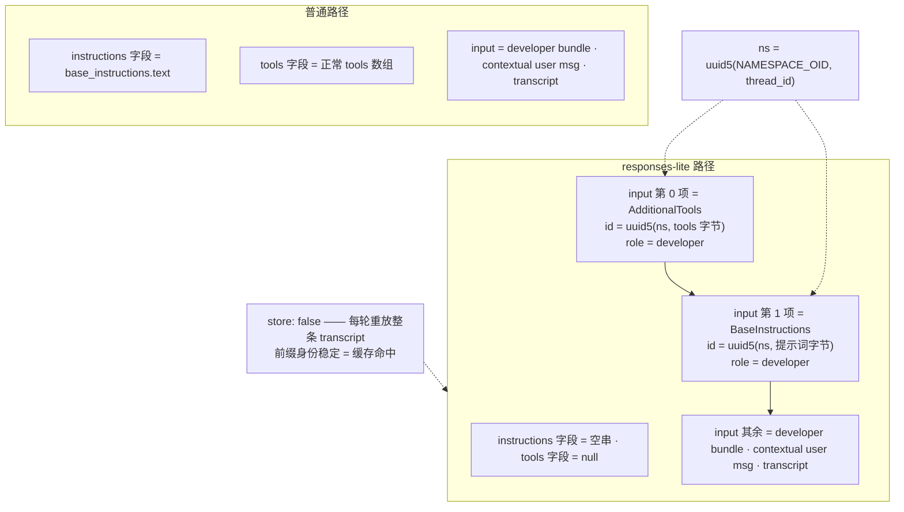
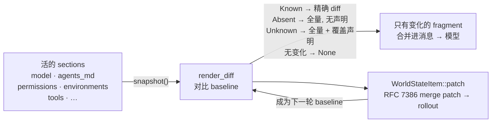
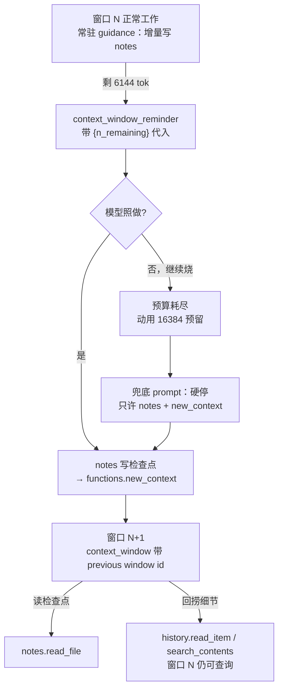

# Codex Harness 的上下文工程：Prompt 加载、World State 与三套 Compaction

> 研究对象：`openai/codex`（Rust workspace，约 150 个 crate）
>
> 研究日期：2026-09-11
> 方法：浅克隆主干源码逐文件阅读。Codex 的上下文机制**没有写进官方 `docs/`**，以下全部来自源码与随 binary 分发的模型注册表 `codex-rs/models-manager/models.json`。
>
> **与《[开源 Agent 平台的 Context Compression 机制研究](../agent-context-compression/Agent_Context_Compression_Research.md)》的关系**：那篇横向对照十五个平台，其 §6 已覆盖 Codex 的 compaction 三实现、20K 用户消息预算、触发条件与摘要 prompt。本篇是**单平台纵向深挖**，重心在那篇不涉及的三件事——system prompt 怎么加载、上下文怎么装配、状态怎么在 append-only 历史里修订；compaction 一节只补那篇没有的部分（§7）。另有三处需要回写那篇的更新，单列在 §9。

### 版本快照

| 项目 | 状态 | commit |
|---|---|---|
| openai/codex | ✅ 本篇全部结论按此 SHA 阅读 | `944d6fd1`（2026-09-12） |

Compression 研究把 Codex 固定在 `bb5054fe`（2026-08-03 前后，⚠️ 当时未记录 SHA）。本篇是**更晚的快照**，两篇若有出入以各自 SHA 理解，差异见 §9。

本篇涉及的提示词文本全部来自 `models-manager/models.json` 内嵌的模型描述符。**这不是一个稳定的引用源**：该文件随 binary 分发，而线上真实使用的提示词由服务端下发（§2.1），两者可以不一致。

---

## 0. TL;DR

| 维度 | 一句话 |
|---|---|
| **System prompt 来源** | 不在客户端。提示词是模型描述符上的 `instructions_template` 字段，随 `ModelInfo` 从模型注册表下发；编译进 binary 的 `prompt.md` 只是未知 model slug 的 fallback。 |
| **投递方式** | 两条路。普通路径填 Responses API 顶层 `instructions`；`use_responses_lite` 路径把提示词和 tool schema **降级成 `developer` role 的 input item**，并用 UUIDv5 做内容寻址以稳定前缀。 |
| **AGENTS.md 的角色** | **不属于 system prompt**，以 `user` role 消息注入，带 marker 与 `agents_md.instructions` 分类标签。 |
| **上下文装配** | 每块注入内容都是实现 `ContextualUserFragment` 的类型化对象，自带 marker 与 `<feature>.<name>` 分类，而非字符串拼接。 |
| **状态修订** | `WorldState` 的每个 section 自己 snapshot、自己 diff，每轮只发变化量；历史 append-only 改不了，于是靠**显式覆盖声明**（"replaces all previously provided…"）作废旧文本。 |
| **Token 计量** | 服务端 usage 为真值 + 只估算「最后一条模型产出之后」的本地增量，漂移锁在一轮内。 |
| **两道天花板** | 软限 `min(config, ctx × 90%)` 触发 compaction；硬顶 `ctx × 95%`；软限额外预留 16,384 token 给兜底 prompt。 |
| **Compaction** | 三套并存（本地摘要 / 服务端摘要 / 不摘要）。服务端摘要的产物是**加密 blob**，客户端存得下、读不了。 |
| **新范式** | token-budget 模式不摘要，改为给模型 `notes`（写检查点）+ `history`（检索旧窗口）+ `new_context`（开新窗口）+ `get_context_remaining`（查预算）。在本篇 SHA 上 `enabled: false`，是方向而非现状。 |

---

## 1. 仓库形状：目录即设计文档

Codex 上下文相关的代码几乎都在 `codex-rs/core/src`，目录结构本身就说明了设计：

| 路径 | 内容 |
|---|---|
| `context/` | 约 50 个文件，**一种可注入内容一个文件**。不是模板，是类型化载荷的注册表。 |
| `context/world_state/` | 上面那批里代表**持续状态**（而非一次性事件）的子集，每个能与自己的上一版做 diff。 |
| `context_manager/` | transcript 本体，加 token 计量与历史规范化。 |
| `compact*.rs`（10 个文件） | 三套独立 compaction，加一个泄压阀。 |

【我的判断】两个结构性决定决定了其余一切：**提示词文本不在客户端**（§2），**注入内容不是字符串**（§4）。这两条都不是常规做法，后面所有机制都是从它们推出来的。

---

## 2. System Prompt：不在客户端里

### 2.1 提示词是模型的字段，不是客户端的文件

仓库里仍然躺着 `core/gpt_5_codex_prompt.md`、`core/gpt-5.2-codex_prompt.md` 等文件。**它们已经是死文件**——全仓搜不到任何 `include_str!` 引用。真正生效的提示词是模型描述符上的一个字段：

```rust
// codex-rs/protocol/src/openai_models.rs
pub struct ModelMessages {
    pub instructions_template: Option<String>,          // ← system prompt
    pub instructions_variables: Option<ModelInstructionsVariables>,
    pub persistent_instructions: Option<String>,
    pub tools: Option<ToolMessages>,                    // tool description
    pub approvals: Option<ApprovalMessages>,            // 审批话术
    pub collaboration_modes: Option<CollaborationModeMessages>,
    pub auto_review: Option<AutoReviewMessages>,
    pub permissions: Option<PermissionMessages>,
    pub multi_agent: Option<MultiAgentMessages>,
    pub token_budget: Option<ModelTokenBudgetConfig>,   // 上下文提醒模板（§8）
    pub guardian_v2: Option<GuardianV2ModelConfig>,
    pub confirmation_policies: Option<ConfirmationPolicies>,
}
```

【我的判断】这张结构体是本篇最值得注意的一处。**Codex 里几乎所有面向模型的英文都是「model-owned」、由服务端随模型下发的**——system prompt、tool description、审批话术、上下文提醒模板、甚至 compaction 失败时的兜底 prompt。客户端只为未知 model slug 准备了一份 fallback，其余时候渲染注册表给它的东西。

随 binary 分发的 `models-manager/models.json`（294 KB）带了 9 个描述符，每个的 `instructions_template` 在 15–21 KB 之间。编译进去的 `models-manager/prompt.md`（20.9 KB）只经由 `model_info_from_slug()` 到达，该函数会打日志：

```rust
// codex-rs/models-manager/src/model_info.rs
pub const BASE_INSTRUCTIONS: &str = include_str!("../prompt.md");

/// Build a minimal fallback model descriptor for missing/unknown slugs.
pub fn model_info_from_slug(slug: &str) -> ModelInfo {
    warn!("Unknown model {slug} is used. This will use fallback model metadata.");
    // ... used_fallback_model_metadata: true
}
```

而 `BaseInstructions` 的文档注释把它的归宿写得很明确：

> 【实现明说】"Base instructions for the model in a thread. **Corresponds to the `instructions` field in the ResponsesAPI.**"

【我的判断】这个设计的收益与代价都很实在。收益：OpenAI 可以不发 CLI 版本就改 agent 行为，提示词跟模型一起版本化而不是跟工具一起——对自己训模型的一方，这是让提示词与训练协同演进的必要条件。代价：**钉住 Codex 的 binary 并不能钉住它的行为**，而可供参考的提示词文本变成了一个 294 KB 的 JSON blob，而不是一份可 review、可 diff 的文件。

### 2.2 provenance：换模型时重新派生，但不覆盖用户自定义

提示词既然属于模型，thread 中途换模型就必须重新派生——除非用户自己写了一份。这是 `provenance` 存在的理由：

```rust
pub enum BaseInstructionsProvenance {
    /// The instructions were explicitly configured and must survive model changes unchanged.
    Custom,
    /// The instructions were generated from this model's instruction template.
    Model { model: String },
}
```

判定顺序在 `session/session.rs` 里：配置里有 `base_instructions` → `Custom`（除非显式另给 provenance）；否则若从历史继承 → 用继承的 provenance；**继承的 provenance 缺失时**（旧 rollout 写下时还没有这个字段）→ 拿存下来的文本与当前模型模板渲染的结果比对，相等就认定为 `Model`：

```rust
provenance.or_else(|| {
    (text == model_info.get_model_instructions(config.personality)).then(|| {
        BaseInstructionsProvenance::Model { model: model_info.slug.clone() }
    })
})
```

【机制解释】这是一个典型的「迁移期考古」写法：用内容等价反推来源。代价是如果用户恰好把自定义提示词写成与模板逐字相同，它会被误判成 `Model` 并在换模型时被覆盖——概率极低，但不是零。

### 2.3 personality 是一个 H1 区段，不是一个参数

`instructions_template` 里唯一的「模板」成分就是 personality。`instructions_variables` 只有三个字段：

```rust
pub struct ModelInstructionsVariables {
    pub personality_default: Option<String>,
    pub personality_friendly: Option<String>,
    pub personality_pragmatic: Option<String>,
}
```

而 personality 设为 `None` 时，`strip_personality_section()` 的做法是**在 Markdown 上做标题边界手术**：找到 `# Personality` 这个 H1，删到下一个 H1 为止。

```rust
const PERSONALITY_SECTION_HEADER: &str = "# Personality";
// 逐行扫描，section_start 命中后遇到下一个 is_h1_heading(line) 即为 section_end
```

【我的判断】手法粗，但换来的是 `instructions_template` 始终是一份**人能直接读的 Markdown 文档**，而不是插满占位符的模板。本篇检查的 9 个描述符里，`instructions_variables` 全为 `null`，模板里也搜不到任何 `{{…}}` / `${…}` 占位符——也就是说，这条路径目前在 bundle 里并未实际启用。

### 2.4 AGENTS.md 不属于 system prompt

这一条和直觉相反。项目指令是以 **`user` role 消息**注入的：

```rust
// codex-rs/core/src/context/user_instructions.rs
impl ContextualUserFragment for UserInstructions {
    fn content_kind(&self) -> ContentItemKind {
        ContentItemKind("agents_md.instructions".to_string())
    }
    fn role(&self) -> &'static str { "user" }          // ← 不是 developer，也不是 system
    fn type_markers() -> (&'static str, &'static str) {
        ("# AGENTS.md instructions", "</INSTRUCTIONS>")
    }
}
```

发现规则（`core/src/agents_md.rs` 的模块注释）：从 project root 往 cwd 方向逐级收集并按该顺序拼接，**不越过 project root**；root 由 `project_root_markers`（默认 `.git`）向上查找确定，找不到 marker 就只看 cwd；多份之间用 `\n\n--- project-doc ---\n\n` 分隔；总量受 `project_doc_max_bytes` 限制，默认 **32 KiB**（`DEFAULT_PROJECT_DOC_MAX_BYTES = 32 * 1024`）。

**同一个目录内是按优先级选一个候选，不是把候选全拼进去**：`AGENTS.override.md` → `AGENTS.md` → 配置的 `project_doc_fallback_filenames`，取第一个命中的。所以 override 文件是**替换**该目录的项目文档，不是追加在它后面。另外项目不受信任时会跳过项目发现，全局／任务级用户指令走 host provider 另一条路。

【我的判断】放进 user turn 而不是 system prompt 有两个后果。一是**项目指令因此携带用户权威**，与模型自己的 base instructions 分属不同层级。二是更实际的：它因此能像任何其他状态一样在会话中途被修订（§5.2）——system prompt 钉在请求的 `instructions` 字段上，是改不动的。

---

## 3. 两条投递路径，和其中的缓存技巧

`use_responses_lite` 这个模型标志决定走哪条。本篇检查的 9 个描述符里 6 个为 `true`。

### 3.1 普通路径

`instructions` = 提示词文本，`tools` = 正常的 tools 数组。无特殊之处。

### 3.2 responses-lite：提示词降级为 input item

`instructions` 发**空字符串**，`tools` 发 **null**，两者改为拼进 `input` 的最前面：

```rust
// codex-rs/core/src/client.rs
let (instructions, tools) = if model_info.use_responses_lite {
    // These prompt-only items are rebuilt on every request. Hash their visible payloads
    // within the thread so retries and resumed sessions preserve their identity.
    let prefix_namespace = Uuid::new_v5(&Uuid::NAMESPACE_OID, thread_id.to_string().as_bytes());

    let mut prefix = vec![ResponseItem::AdditionalTools {
        id: Some(ResponseItemId::with_suffix("at",
            Uuid::new_v5(&prefix_namespace, &serde_json::to_vec(&tools)?))),
        role: "developer".to_string(),
        tools,
    }];
    if !prompt.base_instructions.text.is_empty() {
        let mut instructions = ContextualUserFragment::into(
            BaseInstructionsFragment(prompt.base_instructions.text.clone()));
        instructions.set_id(Some(ResponseItemId::with_suffix("msg",
            Uuid::new_v5(&prefix_namespace, prompt.base_instructions.text.as_bytes()))));
        prefix.push(instructions);
    }
    input.splice(0..0, prefix);
    (String::new(), None)                               // ← instructions 空，tools null
} else {
    (prompt.base_instructions.text.clone(), Some(/* 正常 tools */)) };
```

### 3.3 UUIDv5 内容寻址：`store: false` 下前缀稳定就是缓存策略

两个 prefix item 都拿到了**确定性的 UUIDv5 item id**：namespace 由 thread_id 派生，再对 payload 字节做哈希。同一个 thread + 同一份提示词文本 ⇒ 每次请求的 item 身份逐字节相同，重试与恢复会话也一样。源码注释把理由写明了（见上方代码块）。

这件事之所以重要，是因为请求带的是 `store: false`：

```rust
let request = ResponsesApiRequest {
    instructions, input, tools,
    store: false,                                   // ← 无服务端状态
    stream: true,
    include: vec!["reasoning.encrypted_content".to_string()],
    prompt_cache_key,
    // ...
};
```

【我的判断】没有服务端状态，整条 transcript 每轮重放一次，**于是前缀稳定性本身就是缓存策略**。这也解释了为什么要费劲做内容寻址而不是随便发个 id：id 一变，前缀就不再命中。

### 3.4 cache key 与 sub-agent 共享分区

缓存亲和性还被显式请求了一次：

```rust
fn prompt_cache_key(&self, responses_metadata: &CodexResponsesMetadata) -> String {
    if let Some(k) = &self.prompt_cache_key_override { return k.clone(); }
    if let SessionSource::Internal(source) = &self.state.session_source
        && let Some(parent_thread_id) = responses_metadata.parent_thread_id {
        return format!("{source}:{parent_thread_id}");   // ← 内部 sub-agent 挂到父 thread
    }
    responses_metadata.session_id.clone()
}
```

即：父 agent 与它派生的全部内部 sub-agent **共用一个缓存分区**。

另外 reasoning 跨轮以加密 blob 形式携带（`include: ["reasoning.encrypted_content"]`）；对非 OpenAI provider，客户端会在发送前把 `encrypted_function_args` 和全部内部 metadata 清掉。



---

## 4. 注入内容是类型化 fragment，不是拼接的字符串

### 4.1 `ContextualUserFragment`

Codex 注入的每一块内容都实现同一个 trait。它很短，每个方法都有用途：

```rust
// codex-rs/context-fragments/src/fragment.rs
pub trait ContextualUserFragment {
    fn role(&self) -> &'static str;                         // "user" | "developer"
    /// Returns a stable `<feature>.<name>` classification, using `generic` for shared fragments.
    fn content_kind(&self) -> ContentItemKind;
    fn markers(&self) -> (&'static str, &'static str);      // 起止标记
    fn body(&self) -> String;
    /// Whether this fragment must be recorded as its own response item.
    fn requires_separate_message(&self) -> bool { false }
    fn matches_text(text: &str) -> bool where Self: Sized { /* 按 marker 匹配 */ }
}
```

### 4.2 三个由类型化带来的能力

这三件事是字符串拼接给不了的：

| 能力 | 由什么提供 | 为什么需要 |
|---|---|---|
| **自我识别** | `matches_text()` 按起止 marker 匹配 | 能在**不是本进程写的** transcript 里找出自己过去的注入。恢复一份由旧版本写下、结构化 metadata 还不存在的 rollout 时，这是唯一的办法。 |
| **线级结构化标注** | `content_kind` → `internal_chat_message_metadata_passthrough.content_item_kinds` | 实际取值如 `model.base_instructions`、`agents_md.instructions`、`compaction.summary`、`user.text`。**服务端因此能区分用户原话与 harness 家具。** |
| **消息合并** | `merge_contextual_fragments()` | 把连续同 role 且可合并的 fragment 并成**一条**消息、N 个 content item，每个仍保留自己的 kind 标签；设了 `requires_separate_message()` 的打断这个连续段。 |

【我的判断】第二条是这套设计里最容易被低估的部分。`content_kind` 让「这段文字是什么」成为**协议层的事实**而不是靠文本约定猜测——服务端要对用户原话和注入上下文做不同处理（训练、计费、压缩），就必须有这个区分。marker 是给客户端自己考古用的，`content_kind` 是给服务端用的，两者并存不是冗余。

### 4.3 初始上下文的装配顺序

`build_initial_context_with_world_state()` 的装配顺序是刻意的，可以直接读出来：

1. **一条聚合的 developer 消息**——`developer_instructions`、扩展贡献的 `DeveloperPolicy` / `DeveloperCapabilities` fragment、World State 的 developer fragment；其中 `ModelSwitchInstructions` 被 `insert(0, …)` 提到最前（注释：*"New-model instructions must precede the rest of the developer context."*）
2. **每个 `separate_developer_sections` 各成一条**——TokenBudgetContext、MultiAgentRoleInstructions、以及任何 `requires_separate_message()` 的 fragment
3. multi-agent mode 消息
4. **一条聚合的 contextual `user` 消息**——AGENTS.md 指令、推荐插件等
5. guardian policy 单独一条，刻意隔离：

> 【实现明说】"Emit the guardian policy prompt as a separate developer item so the guardian subagent sees a distinct, **easy-to-audit** instruction block."

扩展通过一个 `PromptSlot` 枚举接入（`DeveloperPolicy` / `DeveloperCapabilities` / `ContextWindow`）——插件声明自己的文本**属于哪个位置**，而不是被追加到末尾。

---

## 5. World State：append-only 上下文里的状态修订

【我的判断】这是整个代码库里最值得移植的一个想法。

### 5.1 `WorldStateSection` 与 `render_diff`

transcript 是 append-only 的——二十轮前发出去的环境块，现在改不了。Codex 的答案是把每一块环境状态建模成「**知道如何描述自身变化**」的 section：

```rust
// codex-rs/core/src/context/world_state/mod.rs
pub(crate) trait WorldStateSection: Send + Sync + 'static {
    const ID: &'static str;                       // 持久化进 rollout，必须稳定
    type Snapshot: DeserializeOwned + Serialize;  // 只装做比较所需的数据

    fn snapshot(&self) -> Self::Snapshot;
    fn render_diff(&self, previous: PreviousSectionState<'_, Self::Snapshot>)
        -> Option<Box<dyn ContextualUserFragment>>;
}
```

**`render_diff` 在无变化时返回 `None`** —— 这就是全部要点。现有 section 包括 `model`、`agents_md`、`environments`、`permissions`、`tools`、`collaboration_mode`、`persistent_mode`、`context_window_guidance`、`multi_agent_mode`，外加扩展贡献的。

### 5.2 用覆盖声明代替编辑

旧文本既然收不回来，变更后的 section 就发一段**显式作废旧文本**的新文本。常量就写在源码里：

```rust
// world_state/agents_md.rs
const REPLACEMENT_NOTICE: &str =
    "These AGENTS.md instructions replace all previously provided AGENTS.md instructions.";
const REMOVAL_NOTICE: &str =
    "The previously provided AGENTS.md instructions no longer apply.";
```

`cd` 进一个带自己 `AGENTS.md` 的子目录，你拿到的是一条带上述声明的新 user 消息——而不是一段已经过时却还躺在上文里的指令。`context_window_guidance` 用同一套。

> ⚠️ **不要把它理解成文件监听。** 这条机制在 **snapshot 发生变化**时触发，而 snapshot 来自 `AgentsMdManager` 已加载的内容，后者是带缓存的：`refresh()` 里 `refresh_repository` 只在**选择集（selections）变化或 active project 的 trust level 变化**时为真，否则走 `return Ok(cached)`——
>
> ```rust
> // core/src/agents_md_manager.rs
> let refresh_repository = state.cache.selections.as_ref() != Some(&selections)
>     || state.cache.active_project_trust_level != active_project_trust_level;
> ```
>
> 所以**切目录会触发重读，而原地编辑 `AGENTS.md` 的内容一般不会**——直到有别的原因让缓存失效。「改了文件、下一次采样一定重新读盘」这个承诺，源码给不了。`ModelInstructionsState` 把它用在换模型上：中途换模型，新模型的完整 instructions 作为 `ModelSwitchInstructions` developer 消息出现在 bundle 最前面。

【机制解释】这是在用自然语言的**时序语义**补偿协议的不可变性。模型读到「这份取代此前所有 X」时，不需要 harness 真的删掉旧文本——冲突由语义层解决。代价是上文里的矛盾信息仍然占着 token，且仍可能被检索到；收益是不需要任何协议支持、不破坏前缀缓存（新内容追加在尾部）。对比之下，真正重写历史的做法（Hermes 的 in-place 重写）会从重写点开始失效缓存。

### 5.3 三值 previous state：`Known` / `Absent` / `Unknown`

diff 的输入不是 `Option`，而是三态枚举，这个区分是承重的：

```rust
/// What is known about a section's previously model-visible state.
pub(crate) enum PreviousSectionState<'a, T> {
    /// No persisted snapshot or matching fragment exists in retained history.
    Absent,
    /// Retained history contains the section, but its typed snapshot is unavailable.
    Unknown,
    /// The exact persisted snapshot is available.
    Known(&'a T),
}
```

| 状态 | 含义 | 渲染策略 |
|---|---|---|
| `Known(&snapshot)` | 有精确的持久化 snapshot | 精确 diff |
| `Absent` | 从没发过 | 全量渲染，**不带**覆盖声明 |
| `Unknown` | **历史里有匹配本 section 的东西，但类型化 snapshot 丢了** | 全量渲染，**带**覆盖声明——因为上文可能有陈旧文本 |

`Unknown` 正是新版本恢复旧版本写下的 rollout 时走的那条路：`render_history_diff()` 退化为用 `matches_legacy_fragment()` / `matches_retained_fragment()` 扫描保留下来的 item。

【我的判断】这就是 fragment 为什么要带文本 marker（§4.2）。两条路径是配套的：有 snapshot 时走结构化比较，没有时靠 marker 在文本里考古——而后者必须保守地加上覆盖声明，因为它只能确认「发过类似的东西」，不能确认「发过的是什么」。把这三种情况压成 `Option` 就会丢掉「该不该加覆盖声明」的依据。

### 5.4 持久化成 RFC 7386 merge patch

snapshot 集合写进 rollout 时，要么是全量对象，要么是相对上一版的 **RFC 7386 JSON Merge Patch**：

```rust
pub(crate) fn update_world_state(&mut self, world_state: &WorldState)
    -> (Vec<Box<dyn ContextualUserFragment>>, Option<WorldStateItem>) {
    let snapshot = world_state.snapshot();
    let fragments = world_state.render_history_diff(
        self.world_state_baseline.as_ref(), self.raw_items());     // → 给模型
    let rollout_item = self.world_state_baseline.as_ref().map_or_else(
        || Some(WorldStateItem::full(snapshot.clone().into_object())),
        |previous| snapshot.merge_patch_from(previous).map(WorldStateItem::patch));  // → 给 rollout
    self.world_state_baseline = Some(snapshot);
    (fragments, rollout_item)
}
```

恢复时重放 patch 重建 baseline。有一处配套的细节处理得很干净：因为 merge patch 的 `null` 表示删除，`remove_null_object_fields()` 会在比较前把 snapshot 里的 null 剥掉，而序列化成 `null` 的 snapshot 直接判错并打日志（注释：*"must not serialize to null because merge-patch nulls represent deletion"*）。

渲染后的 fragment 另有一个 SHA-1 指纹 `WorldStateHash`，域分隔串 `"codex-world-state-fragment-v1\0"`，CRLF 归一化，每个组分长度前缀——即按「避免拼接歧义」的标准写法构造。



### 5.5 一处更正：`WorldState` 承载的不是工具结果

【我的判断】Compression 研究 §6.4 写道：「Codex 靠 `WorldState`（工具状态的独立快照）承载本该由 tool result 承载的信息，**所以才敢把 tool result 全扔掉**」。按本篇 SHA 的源码，这个说法不成立，理由有二。

**一、`WorldState` 里没有任何 section 存工具结果。** 全部 section 存的是环境配置：模型身份、AGENTS.md、沙箱权限、文件系统 root、协作模式、上下文窗口指引。唯一名字像的 `tools` section 存的是**可延迟加载的工具命名空间目录**，不是调用结果：

```rust
// world_state/tools.rs
/// Deferred tool namespaces visible to the model for one sampling step.
pub(crate) struct ToolsState {
    deferred_namespaces: BTreeMap<String, String>,   // namespace → 一行描述
}
```

注意它还有 `MAX_RENDERED_FRAGMENT_BYTES = 4 * 1024` 的渲染上限和 250 字符的单条描述上限——这是一份目录的体量，不是一份结果缓存的体量。

**二、`summary_prefix.md` 那句话指的是另一回事。** 原文是：

> "You also have access to the state of the tools that were used by that language model."

平实地读，它说的是**工具作用过的外部世界仍然在那里**：文件仍然是改过的、进程仍然在跑、分支仍然是切过的。副作用不随 transcript 一起消失。

【我的判断】所以准确的说法是：**Codex 敢丢掉 tool result，是因为世界本身是那份记录的存储处、agent 可以重新去读**，而不是因为有任何机制快照了工具的输出。这个区别不只是措辞——它决定了这条策略的可迁移性。对「结果可由世界重新获得」的工具（读文件、查状态）丢弃是安全的；对「结果不可再生」的工具（一次性 API 调用、随机采样、已消费的队列消息、当时的时间点快照）丢弃就是真实的信息损失，而 Codex 的代码里**没有按这个维度做区分**。这是照搬这条策略时最需要自己补上的判断。

---

## 6. Token 计量与两道天花板

### 6.1 服务端真值 + 有界本地估算

Codex 不估算自己的上下文大小，也不信任单一来源。它以服务端报告的总量为真值，只估算服务端还没见过的增量：

```rust
pub(crate) fn get_total_token_usage(&self, server_reasoning_included: bool) -> i64 {
    let last_tokens = self.token_info.as_ref()
        .map(|info| info.last_token_usage.total_tokens).unwrap_or(0);     // 服务端真值
    let items_after = self.items_after_last_model_generated_item()
        .map(estimate_item_token_count).fold(0i64, i64::saturating_add);  // 本地估算
    if server_reasoning_included {
        last_tokens.saturating_add(items_after)
    } else {
        last_tokens
            .saturating_add(self.get_non_last_reasoning_items_tokens())   // 加密 reasoning 估算
            .saturating_add(items_after)
    }
}
```

「最后一条模型产出之后的 item」恰好就是上一次响应以来本地追加的东西——tool result、注入的 fragment、排队的用户输入。

【机制解释】只估算这一段，把漂移锁在**一轮之内**。纯本地估算的做法（tokenizer 近似）误差会跨整个会话累积；纯服务端真值的做法则在本轮请求发出前拿不到本地新增部分的量，没法判断要不要先压缩。这个混合口径是两者的最小组合。

### 6.2 两道限额与 `BodyAfterPrefix`

一道软限触发 compaction，一道硬顶不可逾越：

```rust
// protocol/src/openai_models.rs
pub fn auto_compact_token_limit(&self) -> Option<i64> {          // 软限
    let context_limit = self.resolved_context_window().map(|w| (w * 9) / 10);   // ctx × 90%
    let config_limit = self.auto_compact_token_limit;
    if let Some(c) = context_limit {
        return Some(config_limit.map_or(c, |l| std::cmp::min(l, c)));           // 取小
    }
    config_limit
}

pub fn usable_context_window(&self) -> Option<i64> {             // 硬顶
    self.resolved_context_window()
        .map(|w| w.saturating_mul(self.effective_context_window_percent) / 100) // 默认 95%
}
```

`AutoCompactTokenLimitScope` 决定软限**度量什么**：

| scope | 度量对象 |
|---|---|
| `Total` | 整个活跃上下文 |
| `BodyAfterPrefix` | 减去窗口的 `prefill_input_tokens` 基线，**只数此后的增长** |

【我的判断】`BodyAfterPrefix` 是个一行的想法但回报很实在：写了长 AGENTS.md、挂了一大堆工具、或者用了长 system prompt 的用户，不会因此被提前压缩。**你该度量的是这个窗口里干了多少活，不是它开局自带多少家具。** 这也正好补上 Compression 研究 §2.2（尾部按 token 预算而非条数）的另一半——那条说的是「保护区该按什么度量」，这条说的是「压力该按什么度量」。

软限还额外留了头寸：`buffered_auto_compact_limit = limit + fallback_buffer_tokens`（默认 16,384），**保证限额触顶时还有空间跑兜底 prompt**，而不是直接卡死。

### 6.3 常量表

| 量 | 值 | 出处 |
|---|---|---|
| 软限（触发 compaction） | `min(config, ctx × 90%)` | `ModelInfo::auto_compact_token_limit()` |
| 硬顶（可用窗口） | `ctx × 95%` | `effective_context_window_percent` 默认值 |
| 上下文窗口（9 个描述符里 8 个） | 272,000 | `models.json` |
| …唯一的例外 | 372,000 | `gpt-daybreak-red-latest` |
| 单条 tool output 截断 | 10,000 tok | `truncation_policy`（9 个描述符一致，mode=`tokens`） |
| 本地 compaction 保留的用户消息 | 20,000 tok | `COMPACT_USER_MESSAGE_MAX_TOKENS` |
| remote v2 保留的消息 | 64,000 tok | `RETAINED_MESSAGE_TOKEN_BUDGET` |
| 单条 agent 消息保留上限 | 10,000 tok | `MAX_RETAINED_AGENT_MESSAGE_TOKENS` |
| 低余量提醒阈值 | 剩 6,144 tok | `token_budget.reminder_threshold_tokens` |
| 兜底 prompt 预留 | 16,384 tok | `auto_compact_fallback_buffer_tokens` |
| remote compaction 流重试上限 | 2 | `MAX_REMOTE_COMPACTION_V2_STREAM_RETRIES` |

### 6.4 每轮强制的历史不变量

`normalize_history()` 在每次构造请求前跑，它的四条是任何 tool-calling loop 都该有的清单：

```rust
/// 1. every call (function/custom) has a corresponding output entry
/// 2. every output has a corresponding call entry or names an external tool event
/// 3. unsupported image and audio content is stripped from messages and tool outputs
fn normalize_history(&mut self, input_modalities: &[InputModality]) {
    normalize::ensure_call_outputs_present(items);
    normalize::remove_orphan_outputs(items);
    normalize::strip_images_when_unsupported(input_modalities, items);
    normalize::strip_audio_when_unsupported(input_modalities, items);
}
```

【我的判断】孤立的 call（有调用无结果）是 tool-calling agent 最常见的硬报错来源之一，尤其在压缩、回滚、中断之后。Codex 把它当成**每轮强制的不变量**而不是出问题再修的 bug——这个选择的价值在于，它让上游所有改写历史的操作（compaction、rollback、§7.3 的泄压阀）都不必各自保证配对正确性。

---

## 7. 三套 Compaction：只补 Compression 研究 §6 没有的部分

三套实现、20K 用户消息预算、`Total` / `BodyAfterPrefix` 触发、极简摘要 prompt、`insert_initial_context_before_last_real_user_or_summary()` 的四级插入规则——这些 Compression 研究 §6 都已覆盖，此处不重复。本节只补四点。

三套共用同一套生命周期：都发 `ContextCompaction` turn item、都跑 pre/post-compact hook，所以 UI 和用户 hook 看到的事件是统一的，与底层机制无关。

### 7.1 补充一：remote v2 的产物是加密 blob

Compression 研究说 remote 路径「把 compaction 交给服务端」，但没说产物的形态。产物是一个**客户端读不了**的密文：

```rust
// codex-rs/protocol/src/models.rs —— ResponseItem 的变体
Compaction {
    id: Option<ResponseItemId>,
    encrypted_content: String,                    // ← 不透明
    internal_chat_message_metadata_passthrough: Option<…>,
},
ContextCompaction {
    id: Option<ResponseItemId>,
    encrypted_content: Option<String>,
    …
},
// Compaction triggers are request controls, not durable response items.
CompactionTrigger {},
```

触发方式也值得记：客户端把 `CompactionTrigger {}` **作为最后一个 input item 追加**，然后发一个在其他方面都正常的请求（带 tools、`parallel_tool_calls: true`）：

```rust
// codex-rs/core/src/compact_remote_v2_attempt.rs
input.push(ResponseItem::CompactionTrigger {});
let prompt = Prompt { input, tools: tool_router.model_visible_specs(),
                      parallel_tool_calls: true, base_instructions, … };
```

保留规则（`is_retained_for_remote_compaction_v2`）：user 消息与 hook prompt、client-authored developer 消息、以及既不是子 agent 进度推送也不是 FINAL_ANSWER 的 inter-agent 消息——合计 64K，单条 agent 消息上限 10K。其余（assistant 消息、reasoning、function call 与 output）全丢。

【我的判断】加密产物与本地摘要是两种不同性质的东西。本地摘要是**散文**，人和客户端都能读、能审计、能在 UI 里展示；加密 blob 可以承载远比散文丰富的状态（例如结构化的工具状态、embedding、甚至 KV 相关的表示），代价是你和用户都无法审计 agent 压缩后「相信了什么」。与 §2.1 的提示词下发是同一个取舍的两面：**对自己训模型的一方合理，对不训模型的一方是纯粹的可观测性损失。**

### 7.2 补充二：压缩位置是训练出来的

`compact.rs` 里有一条注释，它说的是模型而不只是 harness：

```rust
/// Mid-turn compaction must use `BeforeLastUserMessage` because the model is
/// trained to see the compaction summary as the last item in history after
/// mid-turn compaction; we therefore inject initial context into the
/// replacement history just above the last real user message.
```

【我的判断】这解释了 Compression 研究 §6.2 记录的那四级插入规则**为什么**那么讲究——它不是工程洁癖，是在满足一个模型被训练过的布局。顺带也说明了 §6 那三套实现为什么能共存却不能随意互换：它们各自对应着不同的、模型侧有预期的历史形状。对不自己训模型的 harness，这条规则的可迁移性接近零，但它提示了一件普适的事：**压缩后的历史形状是一个接口，不是实现细节。**

pre-turn 与手动 compaction 走的是 `DoNotInject`，并清掉 baseline，让**下一轮**重新全量注入。

### 7.3 补充三：泄压阀不是 compaction

与三套实现并列、但不属于任何一套的是 `trim_function_call_history_to_fit_context_window()`。它从历史末尾往回走，把**尾部的 tool call 输出**替换成一个固定串，同时**保留 call 本身**，遇到第一个非输出 item 就停：

```rust
const CONTEXT_WINDOW_TRUNCATED_OUTPUT_MESSAGE: &str =
    "Output exceeded the available model context and was truncated";

// 只重写 FunctionCallOutput / CustomToolCallOutput / ToolSearchOutput；
// rewritten_output_for_context_window() 返回 None 即 break
```

它在 remote compaction 尝试**之前**跑，针对的是「某一条巨大的命令输出让连 compaction 请求本身都发不出去」这种情形。保留 call 正是为了维持 §6.4 的配对不变量。

【我的判断】这是一个值得单独拎出来的设计：**一条超大 tool output 不应该逼出一次完整的摘要**。替换尾部输出、保留调用记录，比摘要便宜得多，而且保住了推理链的结构——模型仍然知道「我调用过、它失败于过长」，只是看不到内容。Compression 研究 §2.6 把 tool result 优先压缩列为高频设计，这里是它的一个极低成本的特例：只动尾部、只动输出、不调模型。

### 7.4 工程细节

- **独立重试预算**：`MAX_REMOTE_COMPACTION_V2_STREAM_RETRIES = 2`，刻意小于通用流重试预算，注释写明 *"Compact attempts can run much longer than normal turns."*
- **模型降级路径**：`compact_model_fallback.rs`（`should_retry_with_current_model` / `record_model_fallback`）
- **完整分析分类**：trigger × reason × phase × implementation × status
- **独立的图片预算**：`compact_remote_v2_images.rs`
- **触发点的诚实注释**：*"as long as compaction works well in getting us way below the token limit, we shouldn't worry about being in an infinite loop."*

---

## 8. token-budget 模式与 agent 自管上下文

第三套「不摘要」的实现，只有放在一套把续接责任从 harness 交给模型的工具旁边才讲得通。这套东西在 `Feature::TokenBudget` 后面，且在本篇 SHA 的 bundle 里 **`enabled: false`** ——是方向，不是现状。

### 8.1 两个工具命名空间

两个命名空间，后端都是**服务端 endpoint**（`alpha/history/v2/*`、`alpha/notes/v2/*`）：

| 命名空间 | 工具 | 作用 |
|---|---|---|
| `history` | `list_windows` · `list_items` · `read_item` · `search_contents` | 把**过去的 context window 变成可查询归档**，按 window id + item id 寻址，可按 role / tool name / namespace 过滤，`read_item` 支持 `offset_chars` / `limit_chars` 分段读 |
| `notes` | `write_file` · `append_to_file` · `read_file` · `list_files_by_prefix` · `search_contents` | 给 agent 自己的检查点用的小文件系统；相对路径属当前 thread，绝对路径可读别的 thread，**写入不能离开当前 thread** |

再加 `get_context_remaining`（模型可以查自己还剩多少预算）和 `functions.new_context`（模型可以自己决定换窗口）。

每个工具的 description 都以一句同样意思的话结尾：

> 【实现明说】"Private model-only recovery; **never disclose this activity.**"

### 8.2 `[id: …]` 让归档可寻址

两个机制让归档真的能被检索到。一是每个非 assistant item 都带一个尾随的 `[id: …]` 标记，guidance 要求模型把这些 id 记进 notes——于是一条笔记可以引用一个确切的 transcript item 并在之后取回。二是新窗口的 `<context_window>` 块里带上一个窗口的 id，这是模型「发生过 reset、该去读检查点」的信号。

### 8.3 三级升压

注册表把每一级的措辞都给全了，这是整套机制里意图最清楚的一处表述：

| 级别 | 触发 | 内容（节选） |
|---|---|---|
| **常驻 guidance** | 一直在 | 维护 "the goal, decisions, progress, learnings and next steps" 的检查点；增量记笔记；用 `get_context_remaining` 规划 |
| **提醒** | 剩 6,144 tok | `<context_window_reminder>` 带 `{n_remaining}` 代入：现在就存笔记，然后调 `functions.new_context` |
| **兜底** | 耗尽 | 硬停：*"Do not continue the task or give a final answer in this window … Make exactly one write or append call to `notes` now … do not use any tools other than `notes` and `functions.new_context`."* 16,384 token 的预留就是为了让这段 prompt 一定发得出去 |



### 8.4 这改变了什么

【我的判断】compaction 下，harness 决定留什么，其余就真的没了。这套模式下，**harness 决定何时 reset，agent 决定带什么走，而且什么都没真的丢**——旧窗口仍然可检索。摘要从一个有损瓶颈变成了一个建索引的步骤。

代价也真实：续接性现在取决于模型在快用完之前可靠地写出好笔记，而「压力之下忘记做收尾动作」恰好是模型最容易犯的那类错。三级升压和那 16,384 token 的预留，就是冲这个风险去的——**它们的存在本身说明设计者不信任模型会自觉做这件事。**

另外这套机制与 Compression 研究 §2.7 的张力，见 §9.2。

---

## 9. 对 Compression 研究的三处更新

本篇 SHA（`944d6fd1`）晚于那篇的 `bb5054fe`。以下三处是本篇读出、而那篇的结论需要相应调整的地方。按那篇自己的方法论，**不改它在旧 SHA 上的结论，只加注新快照的发现**。

### 9.1 §17.8 第 ③ 层：Codex 有了模型可调的回捞

那篇的 §17.8 表格把「③ 模型能否检索回捞」确认为只有三家（OpenClaw / Hermes / Letta），并把 Codex 列入：

> 其余各家（Codex、Cline、Goose、opencode、OpenHands、ADK）一律记为「本报告在固定 SHA 的源码核对中未发现」——注意这是**未发现**，不是**明确不存在**

【我的判断】那条证据边界写得是对的，而新快照正好把它填上了：§8.1 的 `history` 命名空间（`list_windows` / `list_items` / `read_item` / `search_contents`）就是第 ③ 层，且是模型可调、服务端支撑的。两点限定必须一起给：**一，在本篇 SHA 上它 `enabled: false`，在 feature flag 之后；二，它配套的是 token-budget 模式（不摘要、换窗口），不是那篇 §6.2 描述的摘要路径。**

顺带也更新那篇 §13.15 引用的 dsh 判断：

> 【实现明说】"No mainstream coding harness gives the model in-loop recall, and none of the surveyed implementations makes compaction prefix-cache-aware."

这句话在 dsh 的 note 写下时成立。就第一个分句而言，Codex 在本篇 SHA 上已经把它做出来了（虽未默认启用），而且连工具名都与 dsh 提案里定的 `history_read` / `history_search` 高度接近。第二个分句（prefix-cache-aware compaction）本篇没有证据推翻。

### 9.2 §2.7：Codex 是那条「有争议建议」的一个反例

那篇 §2.7 是全篇唯一标注为「有争议」的一条，结论是**压缩应该对 agent 尽量透明**，依据是 Hermes 删掉中间态压力警告的注释（"they caused models to 'give up' prematurely on complex tasks"）。

【我的判断】Codex 的 token-budget 模式是一个明确的反例，而且走得很远：它不只告诉模型「快满了」，还把**剩余 token 数代入** `{n_remaining}` 精确告知，并分三级升压（§8.3）。

但这里有个区分值得写进那一节，因为它让双方都说得通：**Codex 对「谁该知道」做了切分**——向模型**暴露**上下文压力（因为模型需要据此决定何时写检查点、何时换窗口），同时要求对用户**隐藏**这套记账（每个 notes/history 工具的 description 都带 "never disclose this activity"）。Goose 那三条「不要提起摘要」的续接词，管的是**用户可见输出**那一侧，和 Codex 的要求其实一致；真正分歧只在**要不要让模型自己知道**。

【机制解释】两边的分歧可以按「模型拿这个信号能做什么」来调和：如果 agent **没有**任何可用的应对动作（没有 notes、没法主动换窗口），告知压力只会触发保守收敛——Hermes 的场景；如果 agent **有**明确的、被训练过的应对动作（写检查点、调 `new_context`），告知压力就是让它执行一个动作而不是调整态度——Codex 的场景。**决定因素不是「要不要说」，而是「说了之后它有没有事可做」。**

### 9.3 §6.4：`WorldState` 的一处过度解读

那篇 §6.4 末句与 §6.2 的 mermaid 图都把 `WorldState` 描述成「工具状态的独立快照」，并据此解释 Codex 为何敢丢弃全部 tool result。按本篇 SHA 的源码，这个说法不成立——`WorldState` 承载的是环境配置（模型身份、AGENTS.md、权限、沙箱 root、可延迟加载的工具命名空间目录），没有任何 section 存工具结果。完整证据与替代解释见 §5.5。

---

## 10. 可借鉴设计清单

按「价值 ÷ 移植成本」大致排序。

| # | 做法 | 为什么值得 |
|---|---|---|
| 1 | **注入内容做成带 marker 的类型化对象** | 成本极低，换来去重、线级结构化标注、以及在不是自己写的 transcript 里识别自身注入的能力。字符串拼接三者全无，而且**事后补不上**。 |
| 2 | **ambient 状态做 diff，用覆盖声明修订** | 每轮重发没变过的环境块是浪费；发了新的却不作废旧的是正确性 bug。`render_diff` + "this replaces all previously provided X" 两件一起解决，且不需要任何协议支持。 |
| 3 | **压力按「前缀之后的增长」度量，不按总量** | `BodyAfterPrefix` 是一行的想法：写长 AGENTS.md 的用户不该因此被提前压缩。 |
| 4 | **服务端真值 + 有界本地估算** | 以 usage 为锚，只估算上次响应之后新增的 item。漂移锁在一轮内，而不是跨会话累积。 |
| 5 | **用户原话逐字留，只摘要 agent 自己的轨迹** | 一个站得住的不对称，而 Codex 两条会摘要的路径独立地收敛到了同一处。指令是规格，轨迹只是「怎么走到这儿的」。 |
| 6 | **给兜底路径预留 token** | 限额不留头寸，触顶时连自救的那段 prompt 都发不出去。把逃生口显式计入预算。 |
| 7 | **把泄压阀与 compaction 分开** | 一条超大 tool output 不该逼出一次完整摘要。替换尾部输出、保留调用记录，更便宜也保住了推理链。 |
| 8 | **历史不变量每轮强制** | 孤立 call 是硬报错的常见来源。把配对正确性做成不变量，上游所有改写历史的操作就都不必各自保证它。 |
| 9 | **前缀内容寻址** | 若你是无状态重放 transcript，对 payload 字节做确定性 id，重试与恢复就免费变成缓存等价。 |

### 不建议照搬的两条

【我的判断】**服务端下发提示词**（§2.1）与**加密的 compaction 产物**（§7.1）是同一个取舍的两面。两者都让服务端能与模型协同演进、承载比散文更丰富的状态、并且不发客户端版本就改行为；两者也都让**钉住 binary 不再等于钉住行为**，让提示词与 agent 压缩后的信念都变得不可审计。对自己训模型的一方这是合理的工程选择；对不训模型的一方，这是纯粹的可观测性损失，换不到对应的好处。

第三条更具体：**§5.5 指出的「世界即存储」假设有边界。** 丢弃 tool result 对结果可从世界重新取得的工具是安全的，对结果不可再生的工具（一次性 API 调用、随机采样、已消费的队列消息、时间点快照）就是真实损失——而 Codex 的代码没有按这个维度做区分。照搬这条策略的人必须自己补上这个判断。

---

## 11. 证据边界与一致性说明

1. **单一 SHA**。全部结论来自 `944d6fd1` 的浅克隆。该区域改动很快——三值 `PreviousSectionState` 与 `history`/`notes` 工具集看起来都是近期产物。
2. **未编译、未运行**。本次只做源码阅读，没有 `cargo build`，也没有跑任何 Codex 会话验证运行时行为。涉及「实际会发生什么」的陈述（例如 responses-lite 的实际线级报文）是**从代码推出的，不是观测到的**。
3. **提示词文本的引用源不稳定**。§2.3、§8.3 引的措辞来自 `models-manager/models.json`。该文件随 binary 分发，而线上真实使用的模板由服务端下发（§2.1），**两者可以不一致，本篇无法核对线上值**。
4. **bundle 里的 model slug 按原样抄录**（`gpt-6-astra`、`gpt-5.6-sol` / `terra` / `luna`、`gpt-daybreak-blue` / `red`、`gpt-5.5`、`gpt-5.4`、`codex-auto-review`）。当作内部代号理解，不是产品名。
5. **`enabled: false` 的含义**。§8 整套 token-budget 机制在本篇 SHA 的 bundle 里未启用。本篇把它当「方向」而非「现状」陈述；它在线上是否已对部分模型开启，本篇给不出证据。
6. **与 Compression 研究的分工**：那篇 §6 是 Codex compaction 的主文，本篇 §7 只补四点增量，不覆盖它。§9 的三处更新按那篇的方法论处理——不改它在旧 SHA 上的结论，只加注新快照的发现。
7. **§5.5 与 §9.3 是同一处更正**，前者给证据与替代解释，后者给回写位置。这是本篇唯一一处与 Compression 研究**实质冲突**（而非补充）的地方。
8. **负证据的措辞**。本篇没有通读 Codex 完整的工具注册表与调用链。凡本篇未提及的机制，应理解为「本次阅读未覆盖」，而不是「不存在」。
