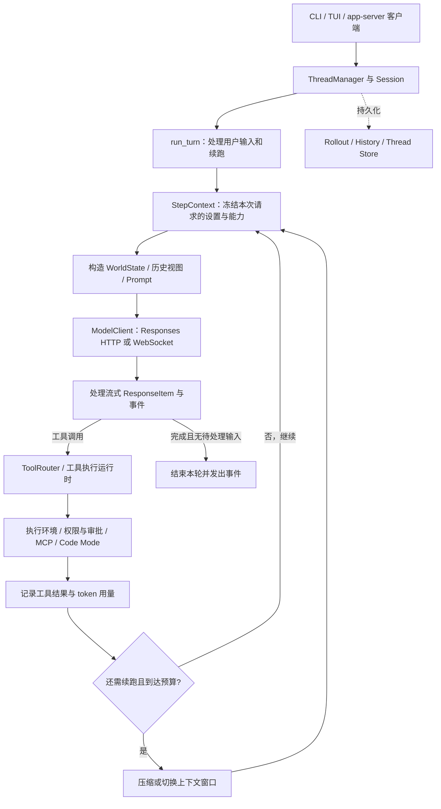
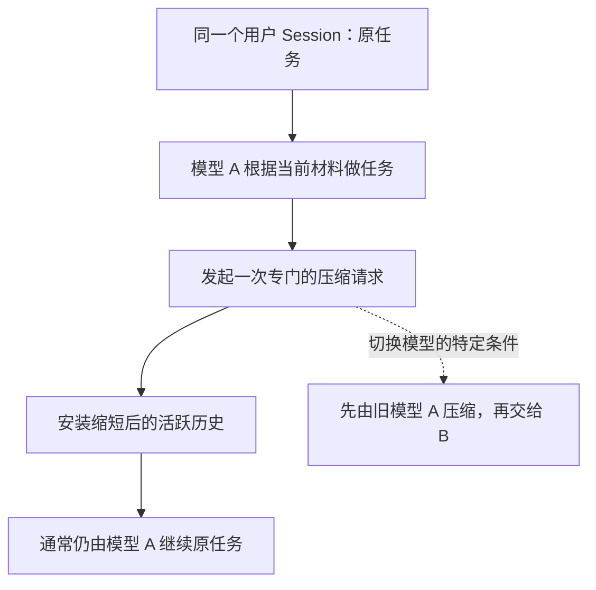
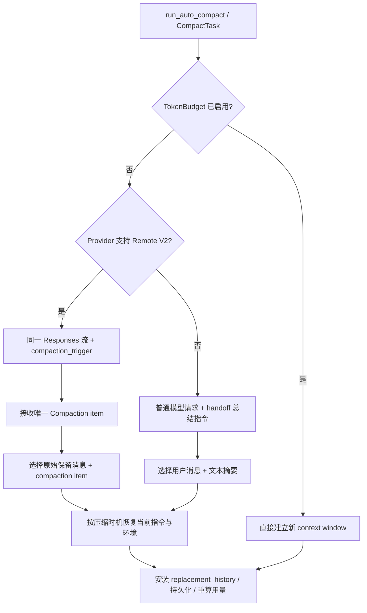
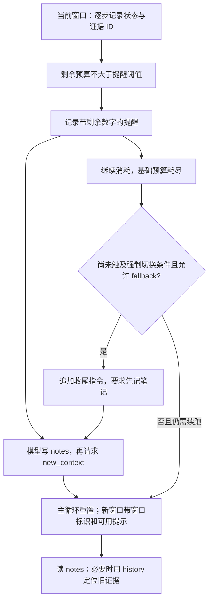
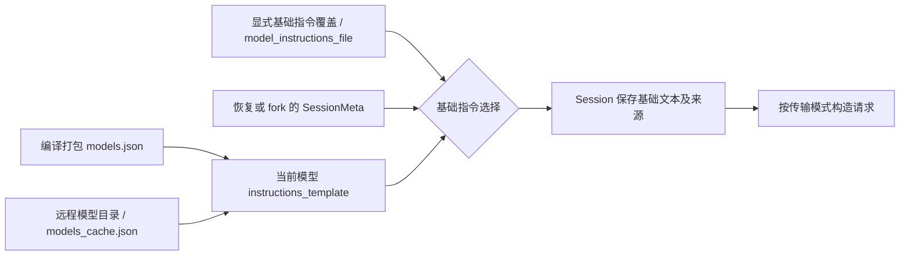
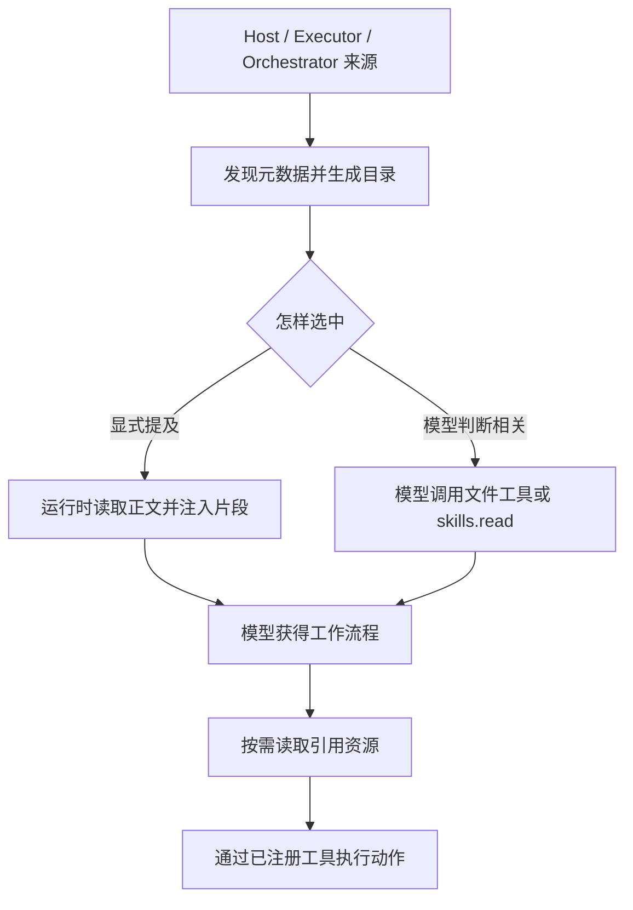
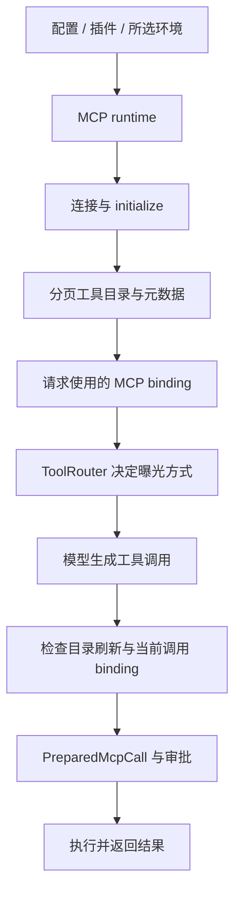

# Codex Harness 源码分析：执行循环、Skills、MCP 与上下文管理

> 配套学习页：[Codex Harness 分析：从请求到执行与恢复](learn/)。先读学习页建立执行顺序，再用本手册核对源码、常量和适用条件。<br>
> 阅读约定：**【来源事实】** 指本快照源码直接支持的行为，**【综合解释】** 指对机制的归纳，**【实践建议】** 指需要自行评测的工程取舍。<br>
> 相关专题：[Context Compression 横向研究](../agent-context-compression/Agent_Context_Compression_Research.html)。平台实现按各自快照理解；关于 WorldState 的概念性误读已同步更正，history/notes 与压力提醒则另标新快照的条件。

审计日期：2026-09-11（America/Los_Angeles）。官方仓库：`openai/codex`。固定提交：[`944d6fd1ba4baab69dbedd205282dc72ec20abb5`](https://github.com/openai/codex/tree/944d6fd1ba4baab69dbedd205282dc72ec20abb5)，提交时间为 2026-09-12 01:21:25 UTC。

本文中的「当前」仅指这份源码快照，不代表所有已发布客户端、账户或服务端部署。**【来源事实】**说明代码实际做什么；**【综合解释】**说明这些机制解决什么问题。未调用真实模型测试压缩质量，也未构建或运行整个 Rust 测试套件。

**阅读前提：已理解 agent harness、模型采样与工具调用。** 本文直接分析 Codex 的客户端实现：对象边界、请求装配、能力加载、历史重写与恢复。配套学习页以源码结构图为主，生活类比仅辅助说明机制。

本手册按源码主题编号，学习页按六章教学顺序推进：**整体地图 → 请求解剖 → 输入加载 → 执行变化 → 压缩恢复 → 横向评价**。先定位整个系统，再观察一份具体输入，随后追踪它的来源和变化；学习页的章末过渡把各部分接成同一条线。

| 学习章节 | 读完应能回答 | 对应手册 |
|---|---|---|
| 1. 整体地图 | 请求流与状态流分别经过哪些对象？ | §1–2 |
| 2. 请求解剖 | instructions、tools、history 和程序状态在哪里？ | §3 与下方输入剖面 |
| 3. 指令与能力加载 | 谁把输入各部分填进去，按什么条件？ | §7 |
| 4. 运行中的变化 | 工具结果、用户输入和规则更新怎样进入历史？ | §2、§3、§7.5 |
| 5. 压缩与恢复 | 何时重写，什么保留，什么重建，怎样续接？ | §4–6 |
| 6. 比较与评价 | 相比其他组织方式，Codex 获得什么、付出什么？ | §8–10 |

| 图解入口 | 对应源码分析 |
|---|---|
| [Codex 模块关系](learn/#step-1) / [run_turn 的采样边界](learn/#step-2) | §2 Session、StepContext、ModelClient 与 ToolRouter |
| [基础指令装配](learn/#step-4) / [Skills 来源与注入](learn/#skills-step) / [MCP 调用绑定](learn/#mcp-step) | §7 配置、模型目录、扩展与工具加载 |
| [ContextManager 状态](learn/#step-3) / [WorldState 三态与差异](learn/#step-5) | §3 类型化历史、§7.5 通知与恢复基线 |
| [预算交互图](learn/#step-6) / [三路径历史替换](learn/#step-7) | §4 计量与触发、§5 压缩、§6 replacement checkpoint |
| [请求增量与缓存](learn/#step-9) / [沿 compaction trace 核对](learn/#step-10) | §8 缓存边界、§10 验证证据 |

<a id="scope"></a>

## 1. 先回答：究竟开源了什么？

Codex 的开源范围足以研究一个完整 coding agent 的客户端运行时：CLI/TUI、app-server、核心循环、工具路由、执行环境、上下文管理、持久化，以及模型请求构造。仓库采用 Apache-2.0 许可证。它并不等于模型权重、推理服务、远程 compaction 算法和整个托管产品都开源。[仓库许可](https://github.com/openai/codex/blob/944d6fd1ba4baab69dbedd205282dc72ec20abb5/LICENSE)

OpenAI 的工程文章说明这一核心支撑多种 Codex 产品形态。分析时仍须区分共享架构与某个产品当下的部署细节。[官方架构说明](https://openai.com/index/unrolling-the-codex-agent-loop/)

**核心判断：Codex harness 最值得学习的是“把哪些状态交给模型、哪些状态由程序维护、何时重新组装模型输入”的工程，而不是某一段很长的提示词。**

**【综合解释】** 下文沿 Session → StepContext → Prompt / ToolRouter 追踪请求，沿 ContextManager → WorldState / Rollout 追踪状态；用这两条线定位加载、compaction 与恢复的职责。

<a id="architecture"></a>

## 2. Harness 的构造



图是主路径的教学简化：hooks、中断、队列输入、模型切换、工具发现都会影响实际循环。`run_turn` 不是“一问一答”，一次用户请求可以包含很多次模型采样和工具执行。源码会把模型要求继续和待处理用户输入合并判断，不能仅凭模型输出了一条文字就判定任务结束。[主循环](https://github.com/openai/codex/blob/944d6fd1ba4baab69dbedd205282dc72ec20abb5/codex-rs/core/src/session/turn.rs#L163)

| 部件 | 负责什么 | 源码入口 |
|---|---|---|
| ThreadManager / Session | 会话生命周期、活动任务、历史与共享服务 | `core/src/thread_manager.rs`、`core/src/session/` |
| TurnContext | 一轮任务的上下文及偏好 | `core/src/session/turn_context.rs` |
| StepContext | 某次模型请求的模型、环境、MCP、工具表、AGENTS.md 快照 | `core/src/session/step_context.rs` |
| ContextManager | 活跃历史、token 信息、上下文基线、保留事实 | `core/src/context_manager/history.rs` |
| WorldState | 把环境、指令与能力组织成可比较的状态片段 | `core/src/context/world_state/` |
| ModelClient | 序列化请求、流式传输、重试、增量传输状态 | `core/src/client.rs` |
| ToolRouter | 区分模型可见工具、延迟发现、Code Mode 与实际执行入口 | `core/src/tools/router.rs` |

**【综合解释】** 对 Java 开发者，可以把 Session 理解为长期会话对象，把 StepContext 理解为不可变的 request-scoped snapshot。它为采样时的环境、规则与工具计划提供一致视图；MCP 执行前仍会检查刷新并取得本次 PreparedMcpCall。因此要区分请求计划的一致性与实际调用绑定的一致性，不能把外部连接和目录变化也视作永久冻结，详见 §7.7。[StepContext 的字段与约束](https://github.com/openai/codex/blob/944d6fd1ba4baab69dbedd205282dc72ec20abb5/codex-rs/core/src/session/step_context.rs#L17)

<a id="context"></a>

## 3. Context 不只有聊天记录

可以用下面的分解理解一次模型输入。它是逻辑模型，不是实际 wire 字段的逐字定义：

```text
模型输入 = 基础行为指令 + 工具定义 + 当前环境/规则 + 活跃对话历史

程序状态 = 配置、权限、工具运行状态、上下文基线、历史元数据、持久化记录
```

两者有交集，但不能互相替代。磁盘上留有历史，并不意味着模型每次都能看见那些历史；模型读到一段权限说明，也不等于权限由这段文字执行。

<a id="input-anatomy"></a>

### 先解剖一次输入：位置、类型、来源不是同一维度

[交互剖面图](learn/#context-map) 可以切换初始请求、工具返回、规则更新、Local/V2 压缩后及 TokenBudget 新窗口，并逐项查看身份。可见位置如下：

```text
客户端程序状态（不自动发送）      普通 Responses 请求
配置 / 模型目录 ─────────────→ instructions
工具 registry / MCP binding ─→ tools
WorldState / extensions ──────→ input 中的规则与环境片段
ContextManager 历史 ──────────→ input 中有顺序的 items
Rollout / checkpoint ──恢复──→ 当前历史；不作为整个档案库直接发送
```

| 对象 | 普通请求中的位置 | role / 类型 | 来源及含义 |
|---|---|---|---|
| 基础指令 | 顶层 instructions | 不带 message.role | 配置、继承或模型模板；独立于活跃历史装配 |
| 工具定义 | 顶层 tools | schema，不是 tool result | 本次 model_visible_specs，不一定包含全部已注册工具 |
| AGENTS 规则 | input 的上下文消息 | user；agents_md.instructions | 程序从项目规则构造，不是真实用户本轮输入 |
| Skills 目录 | input 的扩展片段 | developer；skills.catalog | 此 Skills extension 的目录贡献 |
| 选中 Skill 正文 | input 的注入片段 | user；skills.selected_skill_instructions | 运行时读取并注入；不因 role=user 就成为真实用户请求 |
| U1 / U2 | input 历史项 | user；user.text | 本例真实用户要求 |
| 调用／结果 | input 历史项 | function_call / function_call_output | 独立 typed items，以 call_id 配对，不强行套 message.role |
| Local 摘要 | replacement history 尾部 | user；compaction.summary | 模型摘要经客户端包装；不是新的 system policy |
| V2 压缩项 | replacement history 尾部 | compaction，无普通 message.role | encrypted_content 对客户端不透明 |

同一个 user role 可以承载用户要求、AGENTS 规则、Skill 正文和 Local 摘要；**角色说明指令层级，类别与来源帮助程序判断它是什么、怎样保留或重建。** 图中的 I0/I1 只是把多个初始片段折叠成一个视觉分组，并不是 protocol item。

Responses Lite 的顺序尤其不能画反：input 先插入 `AdditionalTools`（自带 developer role），再插入非空基础指令的 developer fragment，之后才是原 input。顶层 instructions 变空，tools 省略；这些前缀由每次请求重建，不代表追加进了持久历史。[请求转换](https://github.com/openai/codex/blob/944d6fd1ba4baab69dbedd205282dc72ec20abb5/codex-rs/core/src/client.rs#L804)、[Skills 角色与类别](https://github.com/openai/codex/blob/944d6fd1ba4baab69dbedd205282dc72ec20abb5/codex-rs/ext/skills/src/fragments.rs#L39)、[Local 摘要角色](https://github.com/openai/codex/blob/944d6fd1ba4baab69dbedd205282dc72ec20abb5/codex-rs/core/src/context/compaction_summary.rs#L17)

回合中压缩的简化变化：

```text
之前：I0(R0) → U1 → c2 / FAIL → ΔR(R1) → U2 → c3 / 修改成功
Local：U1 → I1(R1) → U2 → S（文本摘要）
V2：   U1 → I1(R1) → U2 → Compaction（不透明）
Reset：I1（当前规则与可用窗口提示；不自动带 U1/U2 或摘要）
```

假设 U1/U2 均在原文保留预算内，省略其他候选和模态；不是任意实际请求都长这样。普通更新追加 ΔR；compaction 则安装 replacement history，并按时机重建规则。不能用静态“system/user/assistant”三层图解释这两种不同变化。

### 3.1 活跃历史是有类型的数据

`ContextManager` 保存 `Arc<Vec<ResponseItemEnvelope>>`，而不是单个字符串。Envelope 包含 `ResponseItem` 和 harness 元数据，元数据会记录客户端来源、工具输出预算、压缩模型兼容标记、用户输入顺序等。只读快照共享内存，修改时再复制。[历史结构](https://github.com/openai/codex/blob/944d6fd1ba4baab69dbedd205282dc72ec20abb5/codex-rs/core/src/context_manager/history.rs#L69)、[Envelope](https://github.com/openai/codex/blob/944d6fd1ba4baab69dbedd205282dc72ec20abb5/codex-rs/history/src/lib.rs#L36)

这个差别很实用：调用和结果要按 `call_id` 对应，用户消息和程序注入消息不能只靠 `role=user` 区分，assistant 的阶段、加密 reasoning、图片等也不能在拼接纯文本时丢掉。

<a id="fragments"></a>

#### 从 fragment 到 wire：角色、类别和文本标记各管什么？

`ContextualUserFragment` 声明正文、`role()`、`content_kind()`、起止 marker 和是否独占消息。`render_fragment()` 产出 `RenderedFragment`，转换成 `ResponseItem` 时，类别进入 `internal_chat_message_metadata_passthrough.content_item_kinds`。因此类型信息不止存在于客户端内存。[trait 与转换](https://github.com/openai/codex/blob/944d6fd1ba4baab69dbedd205282dc72ec20abb5/codex-rs/context-fragments/src/fragment.rs#L35)

| 信息 | 回答的问题 | 例子与边界 |
|---|---|---|
| `role` | 消息属于哪个指令层级？ | AGENTS.md 是 `user`；基础指令 fragment 是 `developer` |
| `content_kind` | 每个 content item 是什么类别？ | `agents_md.instructions`、`model.base_instructions`、`compaction.summary`；真实用户文本另有 `user.text` |
| marker | 缺少结构化状态时，怎样识别过去注入的文本？ | 识别旧 AGENTS 块；无 marker 的 fragment 不会任意匹配正文 |
| Envelope 元数据 | harness 怎样处理这个历史项？ | 来源、预算、保留条件；与 wire 类别标签不是同一结构 |

更新路径中的 `merge_contextual_fragments()` 只合并**连续、同 role、双方都允许合并**的片段。N 个片段成为一条消息的 N 个 content item，类别数组与之逐项对应；独占消息的片段会截断合并段。以下为省略 ID 等字段的形状示意，不是实际请求：[合并实现](https://github.com/openai/codex/blob/944d6fd1ba4baab69dbedd205282dc72ec20abb5/codex-rs/core/src/context_manager/updates.rs#L12)

```json
{
  "type": "message",
  "role": "user",
  "content": [
    {"type": "input_text", "text": "<片段 A 正文>"},
    {"type": "input_text", "text": "<片段 B 正文>"}
  ],
  "internal_chat_message_metadata_passthrough": {
    "content_item_kinds": ["feature_a.instructions", "feature_b.instructions"]
  }
}
```

**【综合解释】** 消息可以合并，内容分类仍保留，接收端不必只靠 `role=user` 猜来源。但客户端源码不能证明服务端具体用这些标签做训练、计费还是压缩；`is_openai=false` 的发送分支会清除内部 metadata 和 `encrypted_function_args`，不能把它写成所有 Responses provider 都支持的保证。[发送边界](https://github.com/openai/codex/blob/944d6fd1ba4baab69dbedd205282dc72ec20abb5/codex-rs/core/src/client.rs#L843)

<a id="input-preparation"></a>

### 3.2 在压缩以前，先限制和整理输入

| 时机 | 操作 | 为什么需要 |
|---|---|---|
| 工具结果入历史 | 按模型策略或工具专用覆盖值截断输出 | 一次大日志不能不受限地占满后续所有请求 |
| 发送前 | 补齐缺失的工具输出、移除不合法的孤立输出 | 保持协议结构；部分缺失结果会标成 `aborted` |
| 发送前 | 根据模型输入模态处理不支持的图片、音频 | 历史可能来自能力不同的模型 |
| 远程压缩前 | 必要时重写尾部连续可处理的工具输出，使估算输入接近窗口限制 | 压缩请求本身也需要装进窗口 |

最后一项不是“扫描所有旧工具结果并任选删除”：实现从尾部向前走，遇到不可重写项会停。它也不是保证任意超长输入都能恢复的万能兜底。[入历史和正规化](https://github.com/openai/codex/blob/944d6fd1ba4baab69dbedd205282dc72ec20abb5/codex-rs/core/src/context_manager/history.rs#L350)、[压缩前尾部整理](https://github.com/openai/codex/blob/944d6fd1ba4baab69dbedd205282dc72ec20abb5/codex-rs/core/src/compact_remote_history.rs#L73)

### 3.3 Token 用量是“服务端观测 + 本地估计”

常规计数大致为：最近一次服务端报告的 token 用量，加上最后一个模型生成 item 之后新增的本地 items 估计；如果服务端没有计入过去 reasoning，还会补相应估计。压缩完成后另行重算新历史用量。[计数实现](https://github.com/openai/codex/blob/944d6fd1ba4baab69dbedd205282dc72ec20abb5/codex-rs/core/src/context_manager/history.rs#L663)、[压缩后重算](https://github.com/openai/codex/blob/944d6fd1ba4baab69dbedd205282dc72ec20abb5/codex-rs/core/src/session/mod.rs#L4645)

本地基于字节的估计不是精确 tokenizer；`estimate_token_count_with_base_instructions` 也不是对完整服务端 prompt 的精确计量。不要把界面估计数理解为模型实际输入的逐 token 测量。

<a id="budget"></a>

## 4. Compaction 什么时候触发？

### 4.1 预算至少有两个层次

定义 `W` 为当前解析出来的上下文窗口，`p` 为 `effective_context_window_percent`，`C` 为配置的自动压缩预算。

普通 `Total` 口径下：

```text
默认自动压缩阈值 A = floor(0.90 × W)
有配置时          A = min(C, floor(0.90 × W))
完整可用窗口上限 H = floor(p × W / 100)
```

启用了相应 fallback 配置时还可能有 buffer。`BodyAfterPrefix` 则只把当前窗口初始 prefix 之后增长的 token 计入自动压缩预算，但仍独立检查完整窗口上限。不能一概说“达到 90% 才压缩”或“固定 200k 压缩”。[模型阈值](https://github.com/openai/codex/blob/944d6fd1ba4baab69dbedd205282dc72ec20abb5/codex-rs/protocol/src/openai_models.rs#L521)、[两种口径与完整窗口限制](https://github.com/openai/codex/blob/944d6fd1ba4baab69dbedd205282dc72ec20abb5/codex-rs/core/src/session/context_window.rs#L49)

源码测试里的一个例子：`W=272,000`、`p=95`、配置 `C=250,000`，得到 `A=244,800`、`H=258,400`。这是解释公式的测试 fixture，不是当前账户的模型规格。[阈值测试](https://github.com/openai/codex/blob/944d6fd1ba4baab69dbedd205282dc72ec20abb5/codex-rs/protocol/src/openai_models.rs#L1811)

### 4.2 触发点不止一个

| 触发位置 | 条件与处理 |
|---|---|
| 新一轮采样前 | 已有上下文达到预算，先压缩再进入正常采样 |
| 工具执行／采样后 | 还需要继续执行或处理待输入消息，并且预算到达上限 |
| 用户手动请求 | `Op::Compact` 启动独立 CompactTask |
| 模型切换 | 已知 compaction 兼容 hash 变化，或切换到更小窗口且历史太大，可先使用旧模型压缩 |
| 特殊路径 | Guardian 的上下文超限恢复有专门逻辑，不能推广成所有请求都会无限自动重试 |

这是程序控制的机制，不依赖模型记住“快满了请总结”。模型切换时 hash 缺失也不等于不兼容；源码只在两个 hash 都存在且不同的情况下判断变化。[触发逻辑](https://github.com/openai/codex/blob/944d6fd1ba4baab69dbedd205282dc72ec20abb5/codex-rs/core/src/session/turn.rs#L1231)、[回合内触发](https://github.com/openai/codex/blob/944d6fd1ba4baab69dbedd205282dc72ec20abb5/codex-rs/core/src/session/turn.rs#L597)

<a id="compaction"></a>

## 5. Compaction 实际有三条路径

<a id="compaction-session-model"></a>

### 先看对象身份：压缩是否更换 Session 与模型？



这幅图适用于总结型 compaction；TokenBudget 重置跳过模型总结。用户的任务 Session 与请求层的 ModelClientSession 是两种对象：新建后者，不等于新开一个用户任务或换模型。

| 路径 | 请求层 session | 请求指定哪个模型 | 结果去哪里 |
|---|---|---|---|
| Remote V2 | 回合内可复用传入的 client session；独立调用可新建 | 本次 `turn_context.model_info()` | 原用户 Session 的 replacement history |
| Local 总结 | 新建 ModelClientSession，并在压缩重试间复用 | 本次 `turn_context.model_info()` | 原用户 Session 的摘要与保留历史 |
| TokenBudget | 不发模型总结请求 | 不适用 | 原任务开始新的上下文窗口 |

V2 的构造读取原会话历史与基础指令、追加 trigger，调用传入当前模型元数据。Local 读取历史并追加总结要求，也使用传入的模型元数据。**客户端没有在这两条普通路径中默认另选一个摘要小模型；Remote V2 服务端内部是否另有模型参与，公开客户端不能证明。**[V2 请求与 client session](https://github.com/openai/codex/blob/944d6fd1ba4baab69dbedd205282dc72ec20abb5/codex-rs/core/src/compact_remote_v2_attempt.rs#L31)、[V2 模型参数](https://github.com/openai/codex/blob/944d6fd1ba4baab69dbedd205282dc72ec20abb5/codex-rs/core/src/compact_remote_v2.rs#L379)、[Local client session](https://github.com/openai/codex/blob/944d6fd1ba4baab69dbedd205282dc72ec20abb5/codex-rs/core/src/compact.rs#L246)、[Local 模型参数](https://github.com/openai/codex/blob/944d6fd1ba4baab69dbedd205282dc72ec20abb5/codex-rs/core/src/compact.rs#L764)

切换 A → B 时，若已知 compaction 兼容 hash 改变，或 B 窗口更小且历史达到相应压力条件，可先用旧模型 A 压缩。特定认证、provider 与错误条件下，旧模型压缩失败可回退到当前 B 重试。它是切换模型的处理分支，不是每次 compaction 都另开一个模型。[切换与 fallback 条件](https://github.com/openai/codex/blob/944d6fd1ba4baab69dbedd205282dc72ec20abb5/codex-rs/core/src/session/turn.rs#L1296)

### 再看路由：程序怎样选择三条路径



路由依据是 provider capability，不是简单检查模型名字是否带 `codex`。该快照的 OpenAI、识别出的 Azure Responses provider、Amazon Bedrock provider 实现都可声明 V2；其他 provider 可以走本地总结路径。[路由](https://github.com/openai/codex/blob/944d6fd1ba4baab69dbedd205282dc72ec20abb5/codex-rs/core/src/session/turn.rs#L1397)、[provider 判断](https://github.com/openai/codex/blob/944d6fd1ba4baab69dbedd205282dc72ec20abb5/codex-rs/model-provider/src/provider.rs#L353)、[Bedrock capability](https://github.com/openai/codex/blob/944d6fd1ba4baab69dbedd205282dc72ec20abb5/codex-rs/model-provider/src/amazon_bedrock/mod.rs#L220)

### 5.1 Remote V2：协议化的压缩 checkpoint

调用链：

```text
run_auto_compact
  → run_inline_remote_auto_compact_task
  → run_remote_compact_v2_attempt
      clone history → 必要时整理尾部输出 → for_prompt_annotated
      追加 {"type":"compaction_trigger"}
      保留基础 instructions 和当前工具表
  → ModelClientSession.stream
  → 收集恰好一个 {"type":"compaction", "encrypted_content":"…"}
  → build_v2_compacted_history
  → replace_compacted_history
```

触发项只是本次请求的控制项，不作为普通历史 item 持久化。接收端要求出现完成事件和恰好一个 compaction item；不会把其他 assistant 文本误当作摘要。[请求构造](https://github.com/openai/codex/blob/944d6fd1ba4baab69dbedd205282dc72ec20abb5/codex-rs/core/src/compact_remote_v2_attempt.rs#L37)、[输出校验](https://github.com/openai/codex/blob/944d6fd1ba4baab69dbedd205282dc72ec20abb5/codex-rs/core/src/compact_remote_v2.rs#L401)

**这是本次审计与旧资料最大的差异之一。** 早期官方文章和公共 API 教程介绍独立 `/responses/compact`。此快照的 Codex V2 路径使用正常 Responses 流和 `compaction_trigger`；仓库集成测试显式断言路径为 `/v1/responses`。这不意味着公共 compact API 被取消，也不意味着任意第三方 Responses 兼容服务支持这个控制项。[测试断言](https://github.com/openai/codex/blob/944d6fd1ba4baab69dbedd205282dc72ec20abb5/codex-rs/core/tests/suite/compact_remote.rs#L969)

返回的 `encrypted_content` 对客户端不透明。公开代码能证明它怎样接收、保留和重新发送这个 item，但不能证明其内部摘要格式、训练方法、信息保真率或是否采用某种具体 latent-memory 算法。它也不是公开的 KV-cache 快照格式。[协议类型](https://github.com/openai/codex/blob/944d6fd1ba4baab69dbedd205282dc72ec20abb5/codex-rs/protocol/src/models.rs#L1211)

#### Remote V2 保留什么？

| 历史类别 | 压缩后作为原始 item 保留的规则 |
|---|---|
| 真实用户消息、识别出的 HookPrompt | 纳入保留候选；受到共享预算限制 |
| assistant 消息、工具调用和结果、旧 compaction item | 不属于这条原文保留筛选路径；不能据此断言其信息完全不在新 checkpoint 中 |
| AgentMessage | 有独立过滤：排除特定子 agent 进度与完成消息，并限制单条估算大小 |
| 客户端提供的 developer 消息 | 需要 `retain_client_developer_messages` 开关，且有来源元数据标记 |
| 当前环境、权限、AGENTS.md 等 harness 上下文 | 由当前 canonical state 重建，不以“保留所有旧 developer 消息”替代 |

候选共享 **64,000 token** 的保留预算，从新到旧选取，边界消息可能截断，然后恢复时间顺序，最后追加 compaction item。这不是摘要的目标长度，也不是总上下文长度。该快照 `compaction_image_budget` 源码默认开启，会把保留用户图片计入预算；客户端 developer 保留开关默认关闭。[保留算法](https://github.com/openai/codex/blob/944d6fd1ba4baab69dbedd205282dc72ec20abb5/codex-rs/core/src/compact_remote_v2.rs#L476)、[预算与筛选](https://github.com/openai/codex/blob/944d6fd1ba4baab69dbedd205282dc72ec20abb5/codex-rs/core/src/compact_remote_v2.rs#L534)、[开关默认值](https://github.com/openai/codex/blob/944d6fd1ba4baab69dbedd205282dc72ec20abb5/codex-rs/features/src/lib.rs#L1759)

### 5.2 Local：客户端组织的普通模型总结

这里的 local 指“客户端执行总结编排”，不保证模型在本机运行。

客户端把一条总结请求追加到历史，用普通模型生成 handoff summary。公开模板要求交接：进度与决策、约束与偏好、下一步、关键数据和引用。这个模板供 local 路径使用，**不能据此反推 Remote V2 的服务端内部 prompt**。[公开总结模板](https://github.com/openai/codex/blob/944d6fd1ba4baab69dbedd205282dc72ec20abb5/codex-rs/prompts/templates/compact/prompt.md)

随后从真实用户消息中由近到远保留最多 **20,000 估算 token**，追加带 handoff 前缀的摘要。摘要通过 `CompactionSummary` 进入上下文，而不是凭空提升为新的 system policy。若总结请求本身超窗，local 路径会尝试移除最旧历史项后重试；这仍然会丢失信息，且可能改变缓存前缀。[local 调用与异常处理](https://github.com/openai/codex/blob/944d6fd1ba4baab69dbedd205282dc72ec20abb5/codex-rs/core/src/compact.rs#L240)、[20k 保留构造](https://github.com/openai/codex/blob/944d6fd1ba4baab69dbedd205282dc72ec20abb5/codex-rs/core/src/compact.rs#L667)

### 5.3 TokenBudget：实验性的窗口重置

该路径明确跳过模型／服务端总结，调用 `start_new_context_window`，用当前 initial context 建立新窗口；可按开关额外保留客户端 developer 消息。它不自动等价于“保留全部用户消息 + 自动摘要”。[重置实现](https://github.com/openai/codex/blob/944d6fd1ba4baab69dbedd205282dc72ec20abb5/codex-rs/core/src/compact_token_budget.rs#L20)、[新窗口内容](https://github.com/openai/codex/blob/944d6fd1ba4baab69dbedd205282dc72ec20abb5/codex-rs/core/src/session/mod.rs#L4398)

公开仓库同时有 history-notes extension，为窗口转换提供历史检索和笔记能力。`context_management` 的自动激活还检查模型能力、认证、provider 和账户条件。`token_budget` / `context_management` 在本快照的源码默认值均为关闭，不能将其当作所有 Codex 用户的默认行为，也不在本报告推断当前任务是否启用。[实验开关](https://github.com/openai/codex/blob/944d6fd1ba4baab69dbedd205282dc72ec20abb5/codex-rs/features/src/lib.rs#L1615)、[激活条件](https://github.com/openai/codex/blob/944d6fd1ba4baab69dbedd205282dc72ec20abb5/codex-rs/core/src/session/token_budget.rs#L21)、[公开历史／笔记工具实现](https://github.com/openai/codex/blob/944d6fd1ba4baab69dbedd205282dc72ec20abb5/codex-rs/ext/history-notes/src/tools.rs)

<a id="history-notes"></a>

#### 不是一个开关：默认激活、提示配置、工具注册分开判断

| 层次 | 实际判断 | 为什么不能合并成一句“没开” |
|---|---|---|
| Rust feature | `Feature::TokenBudget` 源码默认 `false` | 显式配置和受条件约束的入口可改变默认值 |
| 模型自动激活 | `model_messages.token_budget.enabled` 为真，且没有显式配置时，尝试开启 feature | `false` 阻止这条默认激活路径，不是否决显式开启 |
| 每轮提示解析 | feature 已启用且没有显式细项时，可取当前模型的默认消息与预算 | “自动开启”与“开启后用什么文本”是两次判断 |
| `context_management` 入口 | 检查模型能力、provider、认证及账户条件，再尝试激活 | 不能只看模型 JSON 判断可达性 |
| history-notes 注册 | 还要求 `use_history_notes_extension`、OpenAI provider 和 Codex backend 认证 | 窗口重置不自动保证拥有原生检索工具 |

打包目录中 5 个描述符带 token-budget 对象，`enabled` 显式为 false 或省略后反序列化为 false，另外 4 个无该对象。已有对象的提醒阈值为 6,144、fallback buffer 为 16,384；这是**目录的条件配置**，不是所有模型的运行时常量。自动激活还尊重显式配置和托管约束。[模型默认激活与解析](https://github.com/openai/codex/blob/944d6fd1ba4baab69dbedd205282dc72ec20abb5/codex-rs/core/src/session/token_budget.rs#L80)、[每轮解析条件](https://github.com/openai/codex/blob/944d6fd1ba4baab69dbedd205282dc72ec20abb5/codex-rs/core/src/session/turn_context.rs#L821)、[字段默认值](https://github.com/openai/codex/blob/944d6fd1ba4baab69dbedd205282dc72ec20abb5/codex-rs/protocol/src/openai_models.rs#L606)、[目录样本](https://github.com/openai/codex/blob/944d6fd1ba4baab69dbedd205282dc72ec20abb5/codex-rs/models-manager/models.json#L104)、[工具注册](https://github.com/openai/codex/blob/944d6fd1ba4baab69dbedd205282dc72ec20abb5/codex-rs/ext/history-notes/src/extension.rs#L45)

#### notes 保存续接线索，history 按地址取回细节

| 接口 | 用途 | 源码可见的限制 |
|---|---|---|
| `history.list_windows / list_items` | 定位窗口和历史项 | 按 agent、窗口、role、工具筛选；返回服务端规范化历史 |
| `history.read_item / search_contents` | 按窗口 ID、item ID 读取，或按字面子串搜索 | 读取支持字符偏移和长度；只读、最终一致 |
| `notes.write_file / append_to_file` | 保存目标、进度、待办与证据地址 | 显式工具动作，重置不会自动代写笔记 |
| `notes.read_file / list_files_by_prefix / search_contents` | 恢复或寻找检查点 | 虚拟路径，不是工作区文件；列表和搜索可能延迟可见 |
| `get_context_remaining` | 查询当前计算的剩余预算 | 复用 §3.3 / §4 的计量，不是额外的精确 tokenizer |
| `new_context` | 请求建立新窗口 | handler 设置标记，主循环在续跑边界处理 |

history 与 notes 分别路由到 `alpha/history/v2/*`、`alpha/notes/v2/*`，不是读本地 rollout 文件的别名。模型保存窗口和 item 的不透明 ID；已知地址时直接 read，不知道时先 list/search。笔记可以只留任务状态与证据地址，再按需取回原文。[工具与 schema](https://github.com/openai/codex/blob/944d6fd1ba4baab69dbedd205282dc72ec20abb5/codex-rs/ext/history-notes/src/tools.rs#L24)、[预算 handler](https://github.com/openai/codex/blob/944d6fd1ba4baab69dbedd205282dc72ec20abb5/codex-rs/core/src/tools/handlers/get_context_remaining.rs#L81)、[窗口请求 handler](https://github.com/openai/codex/blob/944d6fd1ba4baab69dbedd205282dc72ec20abb5/codex-rs/core/src/tools/handlers/new_context_window.rs#L38)

一个尚不能抹平的边界：打包 guidance 说跨 thread 笔记写入受限，而原生 notes 描述允许访问其他 agent 的笔记。两者的 thread / agent 命名与措辞不一致，不能任选一句推出服务端授权策略；本次只确认公开客户端接口，没有验证服务端跨范围权限。

<a id="pressure"></a>

#### 压力信号后面必须有可执行动作

按上述打包配置，预期的续接流程是：



提醒判断是 `remaining <= threshold`，不是恰好剩 6,144 才触发；提醒与 fallback 各有去重状态。fallback 还要求基础余量为零、存在配置文本且当前允许兜底。buffer 只在有 fallback prompt 时计算；完整窗口硬限仍可能先到，因此**不能保证一定获得 16,384 token 收尾**，也不能把“只准 notes + new_context”的提示词当成工具执行器的强制白名单。[提醒条件](https://github.com/openai/codex/blob/944d6fd1ba4baab69dbedd205282dc72ec20abb5/codex-rs/core/src/session/token_budget.rs#L161)、[buffer 与硬限](https://github.com/openai/codex/blob/944d6fd1ba4baab69dbedd205282dc72ec20abb5/codex-rs/core/src/session/context_window.rs#L87)、[主循环先后关系](https://github.com/openai/codex/blob/944d6fd1ba4baab69dbedd205282dc72ec20abb5/codex-rs/core/src/session/turn.rs#L600)

**【综合解释】** 模型有记笔记、查询预算、主动换窗口的动作，压力就可以成为操作信号。与此同时，工具描述要求不向用户播报内部记账；“模型是否知道”与“用户是否看到”是两个问题。这是可检验的机制假设，不证明它优于 Hermes 的透明压缩，更不证明模型会及时记好笔记。它将一部分摘要保真问题转为笔记完整性、证据可寻址性、检索可用性与恢复成本问题。

<a id="recovery"></a>

## 6. 为什么压缩后规则不会只靠摘要保留？

源码区分两种 canonical context 注入时机：

| 时机 | 操作 | 模型接下来看到什么 |
|---|---|---|
| 手动／回合前压缩 | `DoNotInject`，清除 reference baseline | 下一次正常上下文构造完整注入当前规则与环境 |
| 回合中压缩 | `BeforeLastUserMessage` | 把当前 canonical context 插到最后一条真实用户消息之前，使 compaction item／摘要仍处于历史尾部 |

回合中常见的重组形状如下，`U` 表示预算内保留的真实消息：

```text
基础 instructions 单独构造

input:
    U1 … U(n-1)
    当前权限 + AGENTS.md + 环境 + 其他 initial context
    Un
    compaction checkpoint / handoff summary
```

若没有真实用户消息，插入点会退到摘要或 compaction item 前。源码注释说明回合中让摘要保持最后与模型训练布局有关，因此顺序是行为契约的一部分。[两种注入模式](https://github.com/openai/codex/blob/944d6fd1ba4baab69dbedd205282dc72ec20abb5/codex-rs/core/src/compact.rs#L63)、[插入算法](https://github.com/openai/codex/blob/944d6fd1ba4baab69dbedd205282dc72ec20abb5/codex-rs/core/src/compact.rs#L607)

**【综合解释】** 把规则从可靠状态源重建，可以减少模型把规则总结错的风险。但只出现在很早用户消息里的特殊要求仍可能依赖摘要或原文预算；这个设计不能保证所有约束永不丢失。

持久化也采用明确 checkpoint：`CompactedItem` 保存 `replacement_history`、窗口 ID、response ID、保留事实等；应用 replacement 后记录对应 WorldState 基线。resume/fork 应恢复压缩后的模型视图，而不是无条件把所有旧工具结果重新塞回窗口。仓库有对应的 mock 集成测试。[安装与持久化](https://github.com/openai/codex/blob/944d6fd1ba4baab69dbedd205282dc72ec20abb5/codex-rs/core/src/session/mod.rs#L3943)、[resume/fork 测试](https://github.com/openai/codex/blob/944d6fd1ba4baab69dbedd205282dc72ec20abb5/codex-rs/core/tests/suite/compact_resume_fork.rs#L198)

<a id="instructions"></a>

## 7. Harness 怎样加载指令、Skills 和 MCP？

日常所说的“system prompt”在这里包含多条不同来源的消息。应区分服务端 system、客户端基础 instructions、developer 消息、AGENTS.md 用户级上下文和工具定义。

### 7.1 基础指令优先级：配置 → 会话继承 → 模型目录



准确优先级在 `Session` 初始化时是：

1. 已解析的 `config.base_instructions`。
2. 恢复／继承历史中的 `session_meta.base_instructions`。
3. 当前模型 `get_model_instructions()` 返回的模板。

配置解析内部又把显式 override 放在 `model_instructions_file` 内容之前，之后才是兼容字段 `cfg.instructions`。`developer_instructions` 是另一路附加内容。因而自定义基础指令文件是替换基础来源，不是自动追加到默认 prompt 后面。[优先级](https://github.com/openai/codex/blob/944d6fd1ba4baab69dbedd205282dc72ec20abb5/codex-rs/core/src/session/mod.rs#L687)、[文件读取](https://github.com/openai/codex/blob/944d6fd1ba4baab69dbedd205282dc72ec20abb5/codex-rs/core/src/config/mod.rs#L3894)

<a id="provenance"></a>

#### 为什么文本之外还要保存 Custom / Model 来源？

用户提供的基础指令应该跨模型保留；从模型 A 派生的默认指令则不能在切换到 B 时被误当作用户 override。`BaseInstructionsProvenance` 把这个生命周期区别落成数据：[来源类型](https://github.com/openai/codex/blob/944d6fd1ba4baab69dbedd205282dc72ec20abb5/codex-rs/protocol/src/models.rs#L1524)

```rust
enum BaseInstructionsProvenance {
    Custom,
    Model { model: String },
}
```

Session 初始化时：显式配置默认标为 `Custom`（调用方可另传已知来源）；继承来源存在就沿用；旧历史缺少来源时，只有保存文本与当前模板逐字相同，才反推为 `Model`，否则继续保持未知。这是迁移兼容策略，不能还原所有真实来源。[初始化判断](https://github.com/openai/codex/blob/944d6fd1ba4baab69dbedd205282dc72ec20abb5/codex-rs/core/src/session/session.rs#L719)

| 情形 | 保存的含义 | 下游用途 |
|---|---|---|
| 用户指令文件 → `Custom` | 用户明确选择的基础文本 | 构造模型配置时仍作为 override |
| 继承自模型 A → `Model { A }` | A 的默认指令，不是用户自定义 | 构造模型配置时过滤这个 override，允许当前模型使用自己的模板 |
| 旧历史且来源无法推断 | 不知道文本来自哪里 | 保留未知，不能直接视为可替换的模型默认值 |

还要区分**持久化基础文本**和**当前模型收到的指令**：模型切换可由 WorldState 产生 `ModelSwitchInstructions` developer 片段，提到 developer bundle 最前，不等于原地覆盖 SessionMeta。`get_prompt_base_instructions()` 另可按条件调整请求副本，例如移除 update-plan 说明，而不修改用于持久化和 fork 的文本。[override 过滤](https://github.com/openai/codex/blob/944d6fd1ba4baab69dbedd205282dc72ec20abb5/codex-rs/core/src/config/mod.rs#L1625)、[当前模型状态](https://github.com/openai/codex/blob/944d6fd1ba4baab69dbedd205282dc72ec20abb5/codex-rs/core/src/session/world_state.rs#L46)、[切换渲染](https://github.com/openai/codex/blob/944d6fd1ba4baab69dbedd205282dc72ec20abb5/codex-rs/core/src/context/world_state/model.rs#L44)、[请求副本](https://github.com/openai/codex/blob/944d6fd1ba4baab69dbedd205282dc72ec20abb5/codex-rs/core/src/session/mod.rs#L1409)

**【综合解释】** provenance 回答“这段配置属于谁、允许怎样演进”。只保存最后拼好的字符串，会混淆用户选择和模型默认值，让恢复与模型切换难以安全更新指令。

### 7.2 模型目录与 ModelMessages

`models.json` 编译打包进程序，`ModelsManager` 还管理远程模型元数据、磁盘缓存、ETag、身份匹配和刷新策略。模型条目既有能力与窗口信息，也有 `model_messages.instructions_template`。所以“在 GitHub 找到一个 prompt.md”不足以确定某个已运行会话实际用的是哪份基础指令。[打包入口](https://github.com/openai/codex/blob/944d6fd1ba4baab69dbedd205282dc72ec20abb5/codex-rs/models-manager/src/lib.rs#L15)、[远程刷新与合并](https://github.com/openai/codex/blob/944d6fd1ba4baab69dbedd205282dc72ec20abb5/codex-rs/models-manager/src/manager.rs#L435)

另一个版本差异：本快照的 `get_model_instructions()` 返回 **literal template 文本**，不再用旧 `instructions_variables` 做 personality 占位符展开；旧字段为兼容保留。`Personality::None` 的处理在模型配置覆盖阶段，可移除 Personality section。不能根据历史版本解释成“一直动态填充 personality 变量”。[模板实现](https://github.com/openai/codex/blob/944d6fd1ba4baab69dbedd205282dc72ec20abb5/codex-rs/protocol/src/openai_models.rs#L534)、[personality 覆盖处理](https://github.com/openai/codex/blob/944d6fd1ba4baab69dbedd205282dc72ec20abb5/codex-rs/models-manager/src/model_info.rs#L19)

`ModelMessages` 还容纳内建工具描述、审批与权限文本、协作模式、多 agent 消息，以及 token-budget 的提醒和兜底配置。部分字段缺失会用内建文本，例如 `ToolMessage.description` 的 None 与空字符串分别表示“用内建描述”和“描述留空”。**按模型管理文本，不等于所有文字只在服务器。**[ModelMessages](https://github.com/openai/codex/blob/944d6fd1ba4baab69dbedd205282dc72ec20abb5/codex-rs/protocol/src/openai_models.rs#L551)、[fallback 语义](https://github.com/openai/codex/blob/944d6fd1ba4baab69dbedd205282dc72ec20abb5/codex-rs/protocol/src/openai_models.rs#L597)

**【综合解释】** 模型、工具说明与上下文策略可以配套更新，减少客户端硬编码分支。但固定 binary 不足以完全复现远程目录参与后的行为；还应记录实际目录、配置覆盖、继承文本和来源。离线、缓存及静态目录路径仍存在，不能概括为“system prompt 不在客户端”。[打包目录初始化](https://github.com/openai/codex/blob/944d6fd1ba4baab69dbedd205282dc72ec20abb5/codex-rs/models-manager/src/manager.rs#L298)

### 7.3 基础指令甚至不总在顶层 instructions 字段

| 路径 | 基础指令与工具怎样发送 |
|---|---|
| 普通 Responses | `instructions = base_instructions.text`；工具放入独立 `tools` 字段 |
| 模型元数据 `use_responses_lite=true` | 在 `input` 前插入 `AdditionalTools` 与 developer-role 基础指令消息；顶层 instructions 为空，顶层 tools 不提供 |

Lite 路径还以会话和可见内容生成稳定 ID，使重试／恢复不会因随机新 ID 改变这些前缀项。这个分支说明：**角色语义、内部 Prompt 对象、wire JSON 字段是三个层次，不能混为一谈。**[两种请求装配](https://github.com/openai/codex/blob/944d6fd1ba4baab69dbedd205282dc72ec20abb5/codex-rs/core/src/client.rs#L795)、[基础指令 developer 角色](https://github.com/openai/codex/blob/944d6fd1ba4baab69dbedd205282dc72ec20abb5/codex-rs/core/src/context/base_instructions.rs#L7)

Lite 稳定 ID 的等价构造如下，实际再包装为带 `at` / `msg` 类型前缀的 `ResponseItemId`：

```text
namespace        = UUIDv5(NAMESPACE_OID, thread_id 的字符串字节)
AdditionalTools  = UUIDv5(namespace, 序列化后的 tools 字节)
BaseInstructions = UUIDv5(namespace, 基础指令文本的字节)
```

同一 thread、相同 payload 得到相同 ID；换 thread 则不保证相同。源码保证的是这些请求专用前缀项在重试和恢复时身份稳定，没有承诺“ID 稳定就命中 KV cache”。`store:false` 也不能推出“每轮必定完整重传”，详见 §8。

#### 初始上下文的装配位置

`build_initial_context_with_world_state()` 先聚合 developer 内容，将模型切换片段提到其中最前；再加入独立 developer 片段、单独处理的多 agent 模式、聚合的 contextual user 消息，以及适用时的 guardian policy 和 managed developer instructions。扩展通过 `DeveloperPolicy`、`DeveloperCapabilities`、`ContextWindow` 等 `PromptSlot` 声明位置；notes 的 thread hint 进入窗口上下文，并非随便拼在用户请求末尾。[装配入口](https://github.com/openai/codex/blob/944d6fd1ba4baab69dbedd205282dc72ec20abb5/codex-rs/core/src/session/mod.rs#L4110)、[最终顺序](https://github.com/openai/codex/blob/944d6fd1ba4baab69dbedd205282dc72ec20abb5/codex-rs/core/src/session/mod.rs#L4296)

### 7.4 AGENTS.md 是 user context，有发现顺序和预算

项目发现沿 root → cwd，默认用 `.git` 识别 root；同目录按 `AGENTS.override.md`、`AGENTS.md`、配置 fallback 名称选择候选，不是把同目录所有候选都拼进去。项目文本共享默认 32 KiB 预算；无 root 时只看 cwd。当前 core 还通过 host providers 接收全局／任务级用户指令，项目不受信任时跳过项目发现。[发现算法](https://github.com/openai/codex/blob/944d6fd1ba4baab69dbedd205282dc72ec20abb5/codex-rs/core/src/agents_md.rs#L1)、[来源管理](https://github.com/openai/codex/blob/944d6fd1ba4baab69dbedd205282dc72ec20abb5/codex-rs/core/src/agents_md_manager.rs#L1)

它们被装配成 user-role 上下文片段，不会因文件名叫 AGENTS.md 获得 system 权限。`AgentsMdManager` 有缓存；repository 重读与环境选择／信任状态变化有关，不能承诺“编辑文件后下一次采样一定重新读盘”。全局与任务 provider 也有自己的抓取／缓存职责。[管理器 refresh](https://github.com/openai/codex/blob/944d6fd1ba4baab69dbedd205282dc72ec20abb5/codex-rs/core/src/agents_md_manager.rs#L63)、[AGENTS 状态与角色](https://github.com/openai/codex/blob/944d6fd1ba4baab69dbedd205282dc72ec20abb5/codex-rs/core/src/context/world_state/agents_md.rs#L37)

### 7.5 WorldState：全量初始化，后续追加差异

<a id="world-state"></a>

每个 section 有稳定 ID、只包含比较所需数据的 `Snapshot`，并实现 `render_diff(previous)`。返回 None 表示无需通知模型。这里的 diff 是**语义变化通知**：AGENTS 改变时可以重新发整段并声明取代旧规则，不是把 JSON patch 直接交给模型。[section 契约](https://github.com/openai/codex/blob/944d6fd1ba4baab69dbedd205282dc72ec20abb5/codex-rs/core/src/context/world_state/mod.rs#L226)

#### 为什么 previous state 必须有三态？

| 状态 | 对当前保留历史知道什么 | 以 AGENTS section 为例 |
|---|---|---|
| `Known(snapshot)` | 有可还原的精确快照 | 相同不发；改变时据旧内容发替换或移除通知 |
| `Absent` | 没有该 section 的有效快照／匹配片段依据 | 当前有规则则全量发，不加替换声明；不等于整段会话从未出现过 |
| `Unknown` | 有旧片段依据，但精确快照不可用 | 当前有规则则全量发并声明替换；当前无规则则明确撤销旧规则 |

只用 `Option<Snapshot>` 会把“看不到旧规则”和“看得到旧规则但不知道确切内容”压成一个 None。后者若不作覆盖声明，旧规则仍可能影响任务。例如历史保留了“运行全部测试”，当前变成“只跑模块测试”，即使旧 snapshot 丢失，也要说清哪份生效。[AGENTS 三态实现](https://github.com/openai/codex/blob/944d6fd1ba4baab69dbedd205282dc72ec20abb5/codex-rs/core/src/context/world_state/agents_md.rs#L52)

`render_history_diff()` 优先使用快照；缺少快照时扫描 legacy fragment 的 role 与 marker，命中给 Unknown。快照反序列化失败也退到 Unknown。对声明了 retained-fragment matcher 的 section，即使快照仍在，若对应文本不在保留历史，也可按 Absent 处理。**保存过状态不等于模型仍看得见状态。**[历史回退](https://github.com/openai/codex/blob/944d6fd1ba4baab69dbedd205282dc72ec20abb5/codex-rs/core/src/context/world_state/mod.rs#L413)、[反序列化回退](https://github.com/openai/codex/blob/944d6fd1ba4baab69dbedd205282dc72ec20abb5/codex-rs/core/src/context/world_state/mod.rs#L111)

这三态是传给 section 的知识状态，不是全体 section 共用的文本模板；模型 section 仍要判断模型是否变化。diff 也不是文件监听：只有 `AgentsMdManager` 交出变化后的快照才能比较。环境选择／任务工作目录或信任状态改变可触发 repository 重读；原地编辑文件通常不改变缓存键，单个 shell 子进程里的 cd 也不自动等于更换任务环境。[缓存边界](https://github.com/openai/codex/blob/944d6fd1ba4baab69dbedd205282dc72ec20abb5/codex-rs/core/src/agents_md_manager.rs#L79)

#### 给模型的通知与给恢复器的 merge patch

`ContextManager::update_world_state()` 产出两份东西：按保留历史渲染的 fragments，以及写入 rollout 的状态记录。无 baseline 时保存 full snapshot，有 baseline 时保存 RFC 7386 merge patch；状态未变不产生 patch。[双输出](https://github.com/openai/codex/blob/944d6fd1ba4baab69dbedd205282dc72ec20abb5/codex-rs/core/src/context_manager/history.rs#L295)

用工具目录做教学例子，删除语义如下：

```json
{"before": {"tools": {"search": "查资料", "db": "查数据"}},
 "patch":  {"tools": {"db": null}},
 "after":  {"tools": {"search": "查资料"}}}
```

对象 patch 中的 null 表示删除，所以比较前递归移除 snapshot 对象中的 null 字段；数组整体替换，不按同一规则清空元素。整个 section 序列化为 null 时记错并跳过。恢复按时间顺序应用 full 与 patch，遇到 compaction 清掉旧基线；没有 full baseline 的孤立 patch 被忽略，不能凭一个增量恢复全貌。[patch 算法](https://github.com/openai/codex/blob/944d6fd1ba4baab69dbedd205282dc72ec20abb5/codex-rs/core/src/context/world_state/mod.rs#L307)、[null 处理](https://github.com/openai/codex/blob/944d6fd1ba4baab69dbedd205282dc72ec20abb5/codex-rs/core/src/context/world_state/mod.rs#L485)、[恢复重放](https://github.com/openai/codex/blob/944d6fd1ba4baab69dbedd205282dc72ec20abb5/codex-rs/core/src/session/rollout_reconstruction.rs#L439)

部分 section 用 `WorldStateHash` 保存渲染指纹：SHA-1 加域分隔串，role 和文本分别带长度，CRLF 归一化。它比较模型可见片段是否改变，**不是工具结果备份、prompt cache key 或安全认证凭证**。[指纹](https://github.com/openai/codex/blob/944d6fd1ba4baab69dbedd205282dc72ec20abb5/codex-rs/core/src/context/world_state/mod.rs#L262)

**【综合解释】** 正常执行追加变化通知，保留已有历史前缀；压缩后重新生成 canonical context，则提供清理旧规则、建立新基线的机会。可迁移的设计是“程序维护状态、向模型显式通知变化、独立保存恢复状态”，不是假设自然语言覆盖声明永远不会被误解。

<a id="world-state-boundary"></a>

#### 更正关联研究：WorldState 不是工具输出快照

横向研究此前把“压缩后不保留 tool result 原始项”归因于 WorldState 保存了工具状态，这个因果解释缺少依据，已在原文和图中更正。此快照内建 sections 表达环境、规则、权限、模型和能力；`ToolsState` 保存延迟工具命名空间及描述，渲染上限 4 KiB、单条描述上限 250 字符，不保存调用结果。[ToolsState](https://github.com/openai/codex/blob/944d6fd1ba4baab69dbedd205282dc72ec20abb5/codex-rs/core/src/context/world_state/tools.rs#L12)

需要分开三件事：工作区修改可能仍在；工具结果的部分信息可能进入摘要／不透明 checkpoint；完整原文能否取回取决于独立存储与检索路径。local 交接前缀提到工具状态，不能据此推出“有完整输出快照”，也不能推出“因为能重读，所以删除总是安全”。[交接前缀](https://github.com/openai/codex/blob/944d6fd1ba4baab69dbedd205282dc72ec20abb5/codex-rs/prompts/templates/compact/summary_prefix.md)

**【实践建议】** 对变化中的文件、一次性 API、随机输出和某个时刻的测试结果，重跑会产生新观测，未必恢复旧证据。依赖精确历史结果时，应显式保存原文并验证可寻址的恢复路径；不能用“世界还在”替代保真评测。

<a id="skills-loading"></a>

### 7.6 Skills：发现、选择、读正文、读资源

**【来源事实】** Skills 有不同的来源边界。不能把所有条目都解释成宿主机某个目录里的文件：

| 来源 | 怎样发现 | 怎样读取 |
|---|---|---|
| Host | 配置层的 skills roots、用户与仓库的 .agents/skills、系统 skills、插件和额外 roots；路径去重 | 通过对应文件系统读取 SKILL.md |
| Executor | 执行环境提供的能力快照，或该环境的 skill roots | 按 authority / package 校验身份，用所属环境的文件系统读取 |
| Orchestrator | 从 MCP resources 中查询 MIME 为 mcp/skill 的资源 | 经 MCP resource 接口读取 package 内资源 |

Host roots 包括兼容的 $CODEX_HOME/skills；仓库 .agents/skills 沿项目根到任务 cwd 的范围查找。发现顺序、scope、插件身份共同参与条目处理，不能简化成“全盘扫描，然后按名字覆盖”。Orchestrator provider 还有启用及环境条件，并非所有本地会话都默认开放。[Host roots](https://github.com/openai/codex/blob/944d6fd1ba4baab69dbedd205282dc72ec20abb5/codex-rs/ext/skills/src/host_roots.rs#L29)、[环境来源](https://github.com/openai/codex/blob/944d6fd1ba4baab69dbedd205282dc72ec20abb5/codex-rs/ext/skills/src/provider/executor.rs#L72)、[Orchestrator 来源](https://github.com/openai/codex/blob/944d6fd1ba4baab69dbedd205282dc72ec20abb5/codex-rs/ext/skills/src/provider/orchestrator.rs#L26)、[扩展启动条件](https://github.com/openai/codex/blob/944d6fd1ba4baab69dbedd205282dc72ec20abb5/codex-rs/ext/skills/src/extension.rs#L155)

#### 第一道加载边界：文件被扫描，不等于正文已进入模型窗口

发现过程会读取 SKILL.md 来解析元数据，也可读取附属配置。**渐进披露指模型先看到目录摘要，再按需看到正文；不是说进程在此之前绝不读文件。** Host 服务按 cwd 和配置缓存快照，并提供清缓存入口；不能把每次采样等同于重新扫描文件系统。[发现实现](https://github.com/openai/codex/blob/944d6fd1ba4baab69dbedd205282dc72ec20abb5/codex-rs/ext/skills/src/loader/discovery.rs#L54)、[Host 快照缓存](https://github.com/openai/codex/blob/944d6fd1ba4baab69dbedd205282dc72ec20abb5/codex-rs/ext/skills/src/host_service.rs#L177)、[清缓存](https://github.com/openai/codex/blob/944d6fd1ba4baab69dbedd205282dc72ec20abb5/codex-rs/ext/skills/src/host_service.rs#L375)

目录渲染也有独立预算：有显式 `max_context_tokens` 时最多 10,000 tokens；否则有模型窗口信息时取其 2%，再否则回退到 8,000 字符。不同分支单位不同，10,000 也不是所有分支共同的上限。渲染器分配描述空间并可使用短路径别名。[目录预算](https://github.com/openai/codex/blob/944d6fd1ba4baab69dbedd205282dc72ec20abb5/codex-rs/ext/skills/src/render.rs#L129)、[目录渲染](https://github.com/openai/codex/blob/944d6fd1ba4baab69dbedd205282dc72ec20abb5/codex-rs/ext/skills/src/render.rs#L492)



#### 第二道加载边界：显式选择和模型自主选择

1. **显式选择。** selection 处理结构化 Skill 输入、指向 skill:// 或 SKILL.md 的 mention，以及文本中的显式技能提及，并过滤禁用条目、处理名称冲突与去重。它不是用语义检索自动判断所有自然语言任务。[选择逻辑](https://github.com/openai/codex/blob/944d6fd1ba4baab69dbedd205282dc72ec20abb5/codex-rs/ext/skills/src/selection.rs#L22)
2. **运行时注入。** Skills extension 在回合输入阶段列出来源、读取选中条目的 main prompt，然后生成 `SkillInstructions`。Core 另保留 Host skill 的加载路径，并记录已注入路径以避免重复；所以“必须等模型亲自调用 read 才能看到正文”也不准确。[回合贡献](https://github.com/openai/codex/blob/944d6fd1ba4baab69dbedd205282dc72ec20abb5/codex-rs/ext/skills/src/extension.rs#L355)、[Core 加载](https://github.com/openai/codex/blob/944d6fd1ba4baab69dbedd205282dc72ec20abb5/codex-rs/core/src/session/turn.rs#L1009)、[Host 去重与读取](https://github.com/openai/codex/blob/944d6fd1ba4baab69dbedd205282dc72ec20abb5/codex-rs/ext/skills/src/host_prompt.rs#L10)
3. **模型自主选择。** 当任务只是与某技能相关，目录让模型判断是否读取；Host 文件通过可用文件工具读取，资源来源则有 skills.list / skills.read。不能把这种行为解释成 harness 无条件自动加载全部相关正文。

该 extension 的 `AvailableSkillsInstructions` 是 developer role；`SkillInstructions` 是 user role，并带 `skills.selected_skill_instructions` 分类和 name、path、resource_access、contents 等字段。**Skill 正文不是自动升级成 system prompt；它以可识别的指令片段进入历史。**[片段定义](https://github.com/openai/codex/blob/944d6fd1ba4baab69dbedd205282dc72ec20abb5/codex-rs/ext/skills/src/fragments.rs#L39)

#### 第三道加载边界：正文、引用文件和脚本各自读取

skills.read 接收 package、可选 resource 和 cursor；省略 resource 读取主 SKILL.md，引用文件用返回目录中的资源标识读取。Executor 读取还会给出执行打包脚本所需的 skill_root，资源读接口校验 package 归属，而不是把 skill:// 当成本地路径。分页使用缓存读取快照。[read 工具](https://github.com/openai/codex/blob/944d6fd1ba4baab69dbedd205282dc72ec20abb5/codex-rs/ext/skills/src/tools/read.rs#L35)、[环境与资源校验](https://github.com/openai/codex/blob/944d6fd1ba4baab69dbedd205282dc72ec20abb5/codex-rs/ext/skills/src/provider/executor.rs#L130)

大小限制也要按路径说：extension 自动注入主正文会截到 8,000 bytes；Core Host 路径对 agent-plugin skill 有对应截断，不能泛化成“所有 Host skill 正文最多 8 KB”，更不能与目录 token 预算混为一谈。[正文截断](https://github.com/openai/codex/blob/944d6fd1ba4baab69dbedd205282dc72ec20abb5/codex-rs/ext/skills/src/render.rs#L1176)、[Host 注入](https://github.com/openai/codex/blob/944d6fd1ba4baab69dbedd205282dc72ec20abb5/codex-rs/ext/skills/src/host_prompt.rs#L69)

**【综合解释】** Skill 主要提供“怎样完成任务”的说明与资源。读到一段运行脚本的说明，既不代表脚本已执行，也不代表凭空新增了执行权限；动作仍需经过工具与执行环境。目录、正文、引用资源、工具输出分别占用上下文，这使按需加载与后续 compaction 成为同一条信息生命周期的不同阶段。

<a id="mcp-loading"></a>

### 7.7 MCP：配置、连接、目录、请求曝光、调用绑定

MCP 的“加载”至少包含五个阶段。配置中存在一个 server，不能直接推出它已连接、所有工具 schema 已进入模型请求，或某次调用已获准执行。

| 阶段 | 源码实际处理 | 边界 |
|---|---|---|
| 汇集配置 | 会话配置、插件贡献、所选执行环境的 server，再施加策略与权限约束 | 配置来源不是单个写死文件 |
| 建立连接 | Stdio 使用对应本地或 Executor launcher；Streamable HTTP 处理连接与认证 | transport 决定连接路径，不决定模型曝光方式 |
| 初始化与取目录 | initialize 协商能力、读取 server instructions，再分页 list_tools | resource 目录与 tool 目录是不同接口 |
| 构造请求计划 | 取 MCP binding 的工具目录，结合内建、扩展和动态工具生成 ToolRouter | 直接、延迟及 Code Mode 曝光仍需单独选择 |
| 执行调用 | 检查 dirty refresh，取当前调用 binding，生成 PreparedMcpCall，再处理审批与实际调用 | 不应假定请求发出后连接与元数据永不变化 |

配置入口见 [会话投影](https://github.com/openai/codex/blob/944d6fd1ba4baab69dbedd205282dc72ec20abb5/codex-rs/core/src/session/mcp.rs#L92)、[运行时输入](https://github.com/openai/codex/blob/944d6fd1ba4baab69dbedd205282dc72ec20abb5/codex-rs/core/src/session/mcp_runtime.rs#L330)、[插件配置解析](https://github.com/openai/codex/blob/944d6fd1ba4baab69dbedd205282dc72ec20abb5/codex-rs/codex-mcp/src/plugin_config.rs#L45)。插件配置解析能保留合法 server 条目并报告其他条目的错误；顶层格式错误又是另一种情况。连接实现见 [transport 构造](https://github.com/openai/codex/blob/944d6fd1ba4baab69dbedd205282dc72ec20abb5/codex-rs/codex-mcp/src/rmcp_client.rs#L1136)、[初始化和首次工具目录](https://github.com/openai/codex/blob/944d6fd1ba4baab69dbedd205282dc72ec20abb5/codex-rs/codex-mcp/src/rmcp_client.rs#L907)、[分页 list_tools](https://github.com/openai/codex/blob/944d6fd1ba4baab69dbedd205282dc72ec20abb5/codex-rs/codex-mcp/src/rmcp_client.rs#L654)。



图表示常规建立连接的路径。此快照普通来源使用 Eager startup policy；SubAgent 来源选择 LazyWhenCached，只有缓存及实现条件满足时才可推迟初始化。预热还有独立的 best-effort 合并队列；因此不能把“目录来自缓存”写成“所有 MCP 都已初始化”，也不能把“延迟曝光”写成“首次搜索才启动 server”。required server 的初始化失败有专门校验。[启动策略](https://github.com/openai/codex/blob/944d6fd1ba4baab69dbedd205282dc72ec20abb5/codex-rs/core/src/session/mcp_runtime.rs#L388)、[延迟条件](https://github.com/openai/codex/blob/944d6fd1ba4baab69dbedd205282dc72ec20abb5/codex-rs/codex-mcp/src/connection_manager.rs#L256)、[预热](https://github.com/openai/codex/blob/944d6fd1ba4baab69dbedd205282dc72ec20abb5/codex-rs/core/src/session/mcp_prewarm.rs#L1)、[required 校验](https://github.com/openai/codex/blob/944d6fd1ba4baab69dbedd205282dc72ec20abb5/codex-rs/codex-mcp/src/connection_manager/required.rs#L1)

#### 两个一致性边界，而不是永久冻结一次请求

采样时，McpBinding 提供冻结的模型可见目录；运行时根据 catalog revision 复用或重新捕获 binding。这样组装 schema 时不会随意混用目录版本。[binding](https://github.com/openai/codex/blob/944d6fd1ba4baab69dbedd205282dc72ec20abb5/codex-rs/codex-mcp/src/binding.rs#L30)、[revision 检查](https://github.com/openai/codex/blob/944d6fd1ba4baab69dbedd205282dc72ec20abb5/codex-rs/codex-mcp/src/runtime.rs#L366)

执行时，McpHandler 会调用 `Session::prepare_mcp_call`，先 `refresh_mcp_if_dirty`，再取得 `current_binding_for_call` 并准备调用。该次执行使用的 metadata 和配置来自 prepared call；审批也在这个调用边界内处理。**这比“schema、client、权限在整次采样到执行期间永远是同一个快照”更准确。** 如果期间目录改变，必须以实际调用准备结果判断能否执行，不能只凭旧 schema 保证成功。[调用准备](https://github.com/openai/codex/blob/944d6fd1ba4baab69dbedd205282dc72ec20abb5/codex-rs/core/src/session/mcp_runtime.rs#L61)、[handler](https://github.com/openai/codex/blob/944d6fd1ba4baab69dbedd205282dc72ec20abb5/codex-rs/core/src/tools/handlers/mcp.rs#L175)、[调用审批](https://github.com/openai/codex/blob/944d6fd1ba4baab69dbedd205282dc72ec20abb5/codex-rs/core/src/mcp_tool_call.rs#L219)

MCP resources 还有独立的 list/read 路径。前面的 Orchestrator skills 使用资源读取，不等于它们每个都被注册成一个 MCP tool；工具 schema、资源内容、skill 指令是三个不同对象。[resource 接口](https://github.com/openai/codex/blob/944d6fd1ba4baab69dbedd205282dc72ec20abb5/codex-rs/codex-mcp/src/binding.rs#L108)

<a id="tool-loading"></a>

### 7.8 工具怎样按需进入模型，以及插件怎样连接两条加载链

build_tool_router 汇集内建工具、MCP 工具、扩展 executor、动态工具等，施加 exposure policy 后再处理排除、冲突、命名空间和模式。执行注册表与模型可见定义分别维护。[组装入口](https://github.com/openai/codex/blob/944d6fd1ba4baab69dbedd205282dc72ec20abb5/codex-rs/core/src/tools/spec_plan.rs#L125)、[最终计划](https://github.com/openai/codex/blob/944d6fd1ba4baab69dbedd205282dc72ec20abb5/codex-rs/core/src/tools/spec_plan.rs#L352)、[Router 字段](https://github.com/openai/codex/blob/944d6fd1ba4baab69dbedd205282dc72ec20abb5/codex-rs/core/src/tools/router.rs#L74)

| 曝光方式 | 模型如何获得能力 | 不能据此推断 |
|---|---|---|
| Direct | 工具 schema 直接进入本次工具定义 | 所有已配置 server 的工具都在这里 |
| Deferred | 先给目录线索，搜索后返回可加载定义 | 搜索会安装新 server |
| Code Mode | 通过代码执行入口和嵌套工具定义使用 | 每个嵌套工具必须同时作为顶层 schema |
| Hidden / 策略排除 | 不按普通直接或延迟方式曝光 | 隐藏等于模型仍可任意调用 |

表中是教学分类，源码还有 DirectModelOnly、DeferredModelOnly、CodeModeOnly 等组合。搜索入口受模型支持与 namespace tools 条件影响；MCP 的直接／延迟选择和插件预算也有各自分支。[搜索启用条件](https://github.com/openai/codex/blob/944d6fd1ba4baab69dbedd205282dc72ec20abb5/codex-rs/core/src/tools/spec_plan.rs#L629)、[MCP 曝光](https://github.com/openai/codex/blob/944d6fd1ba4baab69dbedd205282dc72ec20abb5/codex-rs/core/src/mcp_tool_exposure.rs#L75)、[Code Mode 注册](https://github.com/openai/codex/blob/944d6fd1ba4baab69dbedd205282dc72ec20abb5/codex-rs/core/src/tools/spec_plan.rs#L791)

tool_search 针对当前 deferred registry 建立 BM25 索引，校验 query 与 limit，返回可加载的 `LoadableToolSpec`，并合并相关定义。这是对已有工具目录的检索，不是互联网搜索，也不负责安装依赖。目录缓存按 registry 身份或动态搜索信息变化失效。[索引与缓存](https://github.com/openai/codex/blob/944d6fd1ba4baab69dbedd205282dc72ec20abb5/codex-rs/core/src/tools/handlers/tool_search.rs#L53)、[查询与结果](https://github.com/openai/codex/blob/944d6fd1ba4baab69dbedd205282dc72ec20abb5/codex-rs/core/src/tools/handlers/tool_search.rs#L205)

插件可以同时贡献 Skills 与 MCP 配置，但两者分别进入上面的加载链。Core 对显式选中的 Host skill 还可能执行 `maybe_prompt_and_install_mcp_dependencies`：受第一方客户端来源、`SkillMcpDependencyInstall` feature、缺失依赖、策略和安装选择等条件约束，再走安装与可能的认证流程。**不能因为读了某个 SKILL.md，就认定其 MCP 依赖已自动安装或授权。**[插件 MCP 贡献](https://github.com/openai/codex/blob/944d6fd1ba4baab69dbedd205282dc72ec20abb5/codex-rs/ext/mcp/src/lib.rs#L62)、[技能依赖处理](https://github.com/openai/codex/blob/944d6fd1ba4baab69dbedd205282dc72ec20abb5/codex-rs/core/src/mcp_skill_dependencies.rs#L40)

**【综合解释】** Codex 将“告诉模型有哪些能力”“提供如何使用的说明”“加载可调用定义”“连接外部服务”“执行前绑定与审批”拆开。它既降低常驻上下文的成本，也让不同来源的能力遵守各自的生命周期；故障定位必须先指出卡在哪一层，不能一概归为 prompt 没加载。


<a id="cache"></a>

## 8. Cache、传输增量与压缩是三件事

| 机制 | 主要减少什么 | 没有改变什么 |
|---|---|---|
| Prompt caching | 重复前缀的模型计算与相应成本 | 活跃上下文仍然占窗口 |
| WebSocket 增量 | 重复发送的请求 payload | 逻辑输入仍包含已接受的前缀 |
| Compaction / reset | 活跃模型窗口内容 | 历史持久化不自动等于随时可见，也不保证信息无损 |

2026 年 1 月工程文章说当时 Codex 不使用 `previous_response_id`。此快照已实现 WebSocket 增量：只有请求属性匹配、当前 input 是此前 request + response items 的扩展时，才发送增量和上一 response ID；不匹配就不能套用这个增量优化。[增量匹配](https://github.com/openai/codex/blob/944d6fd1ba4baab69dbedd205282dc72ec20abb5/codex-rs/core/src/client.rs#L1254)、[wire 构造](https://github.com/openai/codex/blob/944d6fd1ba4baab69dbedd205282dc72ec20abb5/codex-rs/core/src/client.rs#L1793)

Remote V2 总结请求保留原 instructions 与工具表，并在历史尾部追加 trigger，结构上有利于复用前缀；但压缩前整理会改写输入，工具／模型变化也会影响复用。压缩完成后替换历史又通常不再是旧历史的严格扩展，因此不能声称“compaction 全程必然 cache hit”。是否命中和省多少钱需要实测 `cached_input_tokens`、cache write、请求量与任务质量。

还有两个容易混淆的条件：

- `store:false` 不代表服务端完全没有临时状态，客户端仍可走 WebSocket 增量。稳定 ID 解决前缀项身份，增量机制解决传输重复，KV cache 是否命中另由服务端决定，不能从 UUIDv5 推导“唯一缓存策略”。
- `prompt_cache_key` 优先取 override；特定 `SessionSource::Internal(source)` 且有 parent ID 时返回 `"{source}:{parent_thread_id}"`；其他情况取 session ID。普通父任务默认 key 若为 P，内部任务可为 source:P，两者不相等；不同 source 也不同。包含 parent ID 不等于父任务和所有子任务共享一个缓存分区。[key 构造](https://github.com/openai/codex/blob/944d6fd1ba4baab69dbedd205282dc72ec20abb5/codex-rs/core/src/client.rs#L497)

<a id="principles"></a>

## 9. 从源码中提炼的工程原则

以下为设计解释，而非 OpenAI 公开承诺的效果：

1. **先有类型化历史，再谈摘要算法。** 角色、调用配对、phase、原始 ID、来源元数据是执行语义。
2. **把稳定规则保存在程序状态源里。** 压缩后重新注入，不让总结模型成为唯一的规则保管者。
3. **区分软预算和完整窗口限制。** 同时测量 prefix、增量历史、工具输出和模型切换的压力。
4. **给压缩请求本身留空间。** “超窗以后再总结”也可能总结失败。
5. **显式保存 replacement checkpoint。** 恢复应复现当时的模型视图，不应把已压掉的数据不加选择地全部复活。
6. **把缓存收益作为条件，不作为口号。** 输出更短与下一轮更便宜不是同一命题。
7. **区分原始保留与摘要覆盖。** 原文预算可保护近期请求，但无法证明摘要完整保留所有早期约束。
8. **实验能力必须跟调用路径和开关一起看。** 仓库里出现 history 工具或 reset 实现，不能据此判断任意线上会话正在使用它。

<a id="harness-relations"></a>

### 9.1 与其他 harness 的关系：共同问题，不同责任分配

以下对照使用本次读取的官方架构文档；Codex 仍以本文固定提交为准。只比较接口与数据流，不推断线上默认配置或任务效果。

| 问题 | Codex | OpenHands SDK | LangChain agent / LangGraph |
|---|---|---|---|
| 核心上下文表示 | 类型化活跃历史与程序状态基线 | 追加式事件流与 LLM View | Agent messages state 与 checkpointer |
| 压缩如何生效 | 构造并安装 replacement history | 追加 Condensation，下一步生成过滤旧事件并插入摘要的 View | 配置 SummarizationMiddleware 更新消息状态 |
| 模型选择的责任 | 普通路径使用本次 model_info；切换时有旧模型分支 | LLMSummarizingCondenser 有自己的 LLM 配置 | 总结 middleware 可以独立指定 model、trigger 和 keep |
| 类型与来源 | role、content_kind、Envelope metadata 分开 | Event.source 与 LLM role 分开 | 消息状态、运行上下文和存储有不同用途 |

OpenHands 官方文档描述了 Condensation 的 forgotten_event_ids、summary 与 summary_offset，以及下一步的 View.from_events；事件本身保留在追加日志中。它说明“持久事件”和“本次模型视图”同样可以分开，但压缩的审计入口与 Codex replacement checkpoint 不同。[Condenser](https://docs.openhands.dev/sdk/arch/condenser)、[事件与角色](https://docs.openhands.dev/sdk/arch/events)

LangChain 官方示例为 agent 配置 checkpointer，并单独安装 SummarizationMiddleware，可指定不同于主任务模型的摘要模型及保留量。这里讨论的是 LangChain agent 层提供的策略，不能扩大为“所有 LangGraph graph 都默认自动摘要”。[短期记忆与总结中间件](https://docs.langchain.com/oss/python/langchain/short-term-memory#summarize-messages)

### 9.2 Codex 的设计巧妙在哪里，又付出什么代价？

以下是由已述源码行为得出的设计分析，不是性能排名。

| 设计 | 解决的具体问题 | 收益 | 代价／仍未解决的事 |
|---|---|---|---|
| content_kind 与 role 分离 | user 既可能是真用户，也可能是注入内容 | 可按语义类别保留／重建，而非一刀切 | 元数据、marker 和旧历史兼容更复杂；此原则并非 Codex 独有 |
| WorldState + 三态 + canonical 重建 | 旧规则还在历史里，精确 snapshot 可能缺失 | 能明确替换／撤销，并减少摘要承担的规则保真责任 | 依赖状态源与缓存刷新，不能保证原工具证据可恢复 |
| Custom / Model provenance | 切换模型时默认文本可能冒充用户覆盖 | 保留自定义指令，又让模型默认模板可更新 | 旧会话缺来源时无法完美还原意图 |
| catalog / body / schema / call 分阶段 | 大量能力定义挤占每次请求 | 按需增加模型可见内容 | 增加检索、读取和绑定步骤，各层均可能失败 |
| replacement checkpoint 与请求产物校验 | 压缩完成后需稳定续接与恢复 | 可审计“安装了什么模型视图” | V2 内容不透明，格式正确不证明摘要语义完整 |
| StepContext 与 PreparedMcpCall 分开 | 采样与执行之间目录和连接可能变化 | 分别维持采样计划及实际调用的一致性 | 不能承诺模型看过的旧工具定义一定仍能成功执行 |

阅读方法是反向验证：先提出故障场景，再看该结构如何避免故障，最后指出它没有解决什么。要证明比其他 harness 更好，还需要同任务、同模型与可比预算的约束保留率、完成率、延迟和 token 成本评测。

<a id="evidence"></a>

## 10. 建议的源码阅读顺序与验证边界

执行与上下文主线：`session/step_context.rs` → `session/turn.rs` → `context_manager/history.rs` → `session/context_window.rs` → `compact_remote_v2_attempt.rs` / `compact_remote_v2.rs` → `compact.rs` → `session/world_state.rs` → `client.rs` → `models-manager/src/manager.rs`。

加载支线：`ext/skills/src/host_roots.rs` → `selection.rs` / `extension.rs` → `tools/read.rs`；`core/src/session/mcp_runtime.rs` → `codex-mcp/src/rmcp_client.rs` / `binding.rs` → `core/src/tools/spec_plan.rs` → `handlers/tool_search.rs` / `handlers/mcp.rs`。先确认来源和目录，再确认模型曝光与实际调用。

| 本次做了什么 | 能支持什么 | 不能支持什么 |
|---|---|---|
| 下载官方仓库并固定 SHA | 源码定位可复核 | 不代表已发布版本或所有账户配置 |
| 跟踪入口、provider capability、feature defaults | 区分可达路径与实验分支 | 不代表后端实际开启状态 |
| 阅读 compaction、retention、resume/fork 测试及断言 | 了解仓库设计要维护的协议与历史性质 | 本次没有运行测试，不能报告测试通过 |
| 对照官方文章和 prompting guide | 识别历史解释与当前客户端的差异 | 不揭示远程压缩算法内部实现 |
| 检查文档中的固定源码链接与行号 | 避免引用漂移和无效定位 | 不构成模型摘要质量评测 |

进一步评测应测长任务完成率、早期约束保留、重复读文件次数、重复工具操作、压缩前后 cached tokens 和恢复一致性，而不是只比较压缩比。

### 两页一致性检查

- Skills 的发现、正文注入、资源读取与动作执行分开；MCP 的连接、曝光、刷新和调用绑定分开。
- 两页固定同一源码提交；远程服务端算法与线上启用状态都不由客户端源码推断。
- 64k / 20k 都是原始消息保留预算；90% 是普通 Total 口径的默认阈值公式。
- Remote V2 使用 Responses 流中的 `compaction_trigger`；Local 的公开总结模板不能用来解释 V2 的内部 prompt。
- TokenBudget 重置与普通总结 compaction 分开；实验开关的源码默认关闭不等于所有部署配置。
- 普通 Responses 与 Responses Lite 的指令字段不同；AGENTS.md 属于 user context。
- WebSocket 增量、prompt cache 和窗口压缩分开；没有保证缓存命中或摘要无损的结论。
- fragment 的 wire 类别、客户端 Envelope 与恢复 marker 分开；内部 metadata 的发送有 provider 边界。
- WorldState 三态通知与持久化 merge patch 分开；工具目录不是工具结果备份。
- 模型默认激活、Rust feature、显式配置与 history-notes 注册分开；6,144 / 16,384 不作为无条件保证。
- 学习页的订单测试是教学构造，区分 local 文本摘要、V2 不透明 checkpoint 与无摘要重置。

<script type="module" src="../assets/js/util/mermaid-render.js"></script>
