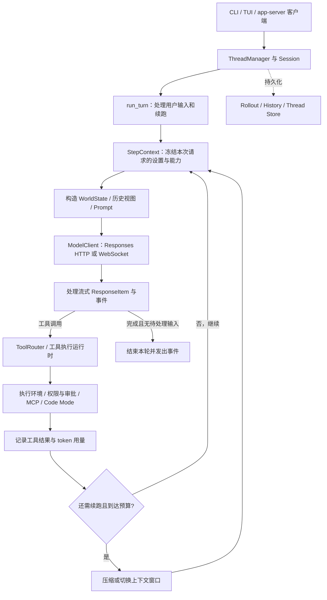
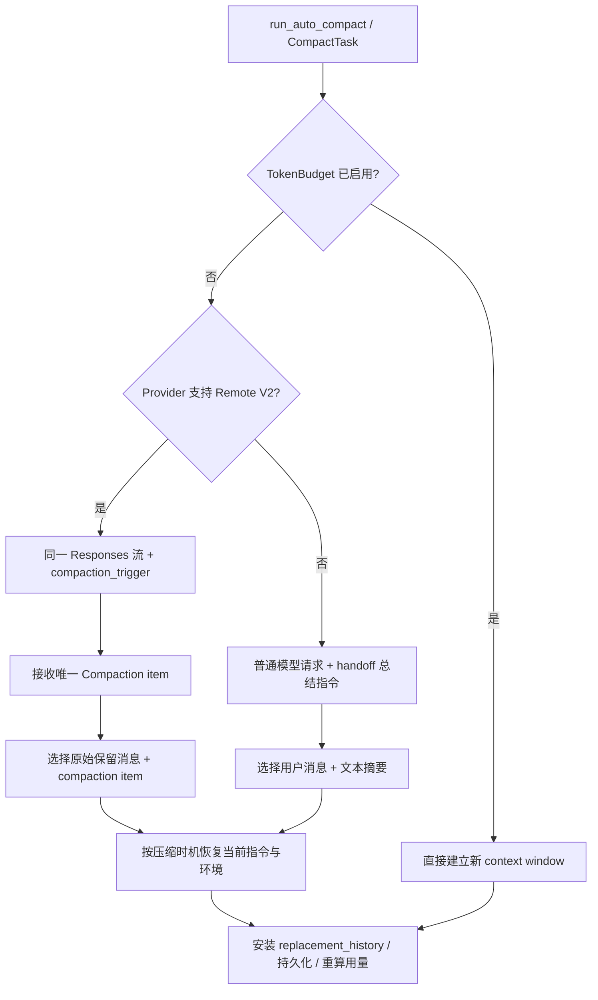
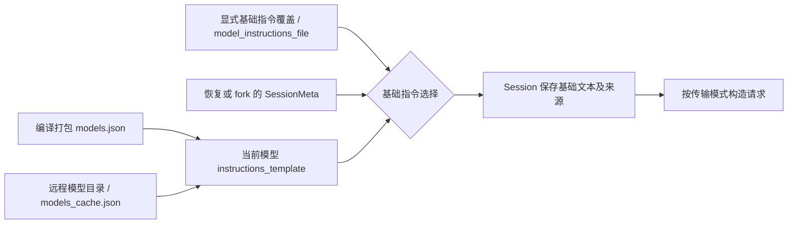

# Codex Harness 源码分析：执行循环、上下文、Compaction 与指令加载

> 配套学习页：[让 Agent 跨过上下文窗口 — 从零拆解 Codex Harness](learn/)。先读学习页建立执行顺序，再用本手册核对源码、常量和适用条件。<br>
> 阅读约定：**【来源事实】** 指本快照源码直接支持的行为，**【综合解释】** 指对机制的归纳，**【实践建议】** 指需要自行评测的工程取舍。<br>
> 相关专题：[Context Compression 横向研究](../agent-context-compression/Agent_Context_Compression_Research.html)。那篇保留各平台的审计快照；本篇单独追踪 Codex 的较新实现，不将不同版本结论混用。

审计日期：2026-09-11（America/Los_Angeles）。官方仓库：`openai/codex`。固定提交：[`944d6fd1ba4baab69dbedd205282dc72ec20abb5`](https://github.com/openai/codex/tree/944d6fd1ba4baab69dbedd205282dc72ec20abb5)，提交时间为 2026-09-12 01:21:25 UTC。

本文中的「当前」仅指这份源码快照，不代表所有已发布客户端、账户或服务端部署。**【来源事实】**说明代码实际做什么；**【综合解释】**说明这些机制解决什么问题。未调用真实模型测试压缩质量，也未构建或运行整个 Rust 测试套件。

<a id="scope"></a>

## 1. 先回答：究竟开源了什么？

Codex 的开源范围足以研究一个完整 coding agent 的客户端运行时：CLI/TUI、app-server、核心循环、工具路由、执行环境、上下文管理、持久化，以及模型请求构造。仓库采用 Apache-2.0 许可证。它并不等于模型权重、推理服务、远程 compaction 算法和整个托管产品都开源。[仓库许可](https://github.com/openai/codex/blob/944d6fd1ba4baab69dbedd205282dc72ec20abb5/LICENSE)

OpenAI 的工程文章把 harness 定义为协调用户、模型和工具的执行逻辑，并说明这一核心支撑多种 Codex 产品形态。分析时仍须区分共享架构与某个产品当下的部署细节。[官方架构说明](https://openai.com/index/unrolling-the-codex-agent-loop/)

**核心判断：Codex harness 最值得学习的是“把哪些状态交给模型、哪些状态由程序维护、何时重新组装模型输入”的工程，而不是某一段很长的提示词。**

<a id="architecture"></a>

## 2. Harness 的构造



图是主路径的教学简化：hooks、中断、队列输入、模型切换、工具发现都会影响实际循环。`run_turn` 不是“一问一答”，一次用户请求可以包含很多次模型采样和工具执行。源码会把模型要求继续和待处理用户输入合并判断，不能仅凭模型输出了一条文字就判定任务结束。[主循环](https://github.com/openai/codex/blob/944d6fd1ba4baab69dbedd205282dc72ec20abb5/codex-rs/core/src/session/turn.rs#L163)

| 部件 | 负责什么 | 源码入口 |
|---|---|---|
| ThreadManager / Session | 会话生命周期、活动任务、历史与共享服务 | `core/src/thread_manager.rs`、`core/src/session/` |
| TurnContext | 一轮任务的上下文及偏好 | `core/src/session/turn_context.rs` |
| StepContext | 某次模型请求的模型、环境、MCP、工具表、AGENTS.md 快照 | `core/src/session/step_context.rs` |
| ContextManager | 活跃历史、token 信息、上下文基线、保留事实 | `core/src/context_manager/history.rs` |
| WorldState | 把环境、指令与能力组织成可比较的状态片段 | `core/src/context/world_state/` |
| ModelClient | 序列化请求、流式传输、重试、增量传输状态 | `core/src/client.rs` |
| ToolRouter | 区分模型可见工具、延迟发现、Code Mode 与实际执行入口 | `core/src/tools/router.rs` |

**【综合解释】** 对 Java 开发者，可以把 Session 理解为长期会话对象，把 StepContext 理解为不可变的 request-scoped snapshot。一次请求看到的工具 schema、执行时用的工具路由、环境权限与 AGENTS.md 应来自同一份快照，避免异步配置刷新把一轮操作拆成互不一致的两半。[StepContext 的字段与约束](https://github.com/openai/codex/blob/944d6fd1ba4baab69dbedd205282dc72ec20abb5/codex-rs/core/src/session/step_context.rs#L17)

<a id="context"></a>

## 3. Context 不只有聊天记录

可以用下面的分解理解一次模型输入。它是逻辑模型，不是实际 wire 字段的逐字定义：

```text
模型输入 = 基础行为指令 + 工具定义 + 当前环境/规则 + 活跃对话历史

程序状态 = 配置、权限、工具运行状态、上下文基线、历史元数据、持久化记录
```

两者有交集，但不能互相替代。磁盘上留有历史，并不意味着模型每次都能看见那些历史；模型读到一段权限说明，也不等于权限由这段文字执行。

### 3.1 活跃历史是有类型的数据

`ContextManager` 保存 `Arc<Vec<ResponseItemEnvelope>>`，而不是单个字符串。Envelope 包含 `ResponseItem` 和 harness 元数据，元数据会记录客户端来源、工具输出预算、压缩模型兼容标记、用户输入顺序等。只读快照共享内存，修改时再复制。[历史结构](https://github.com/openai/codex/blob/944d6fd1ba4baab69dbedd205282dc72ec20abb5/codex-rs/core/src/context_manager/history.rs#L69)、[Envelope](https://github.com/openai/codex/blob/944d6fd1ba4baab69dbedd205282dc72ec20abb5/codex-rs/history/src/lib.rs#L36)

这个差别很实用：调用和结果要按 `call_id` 对应，用户消息和程序注入消息不能只靠 `role=user` 区分，assistant 的阶段、加密 reasoning、图片等也不能在拼接纯文本时丢掉。

### 3.2 在压缩以前，先限制和整理输入

| 时机 | 操作 | 为什么需要 |
|---|---|---|
| 工具结果入历史 | 按模型策略或工具专用覆盖值截断输出 | 一次大日志不能不受限地占满后续所有请求 |
| 发送前 | 补齐缺失的工具输出、移除不合法的孤立输出 | 保持协议结构；部分缺失结果会标成 `aborted` |
| 发送前 | 根据模型输入模态处理不支持的图片、音频 | 历史可能来自能力不同的模型 |
| 远程压缩前 | 必要时重写尾部连续可处理的工具输出，使估算输入接近窗口限制 | 压缩请求本身也需要装进窗口 |

最后一项不是“扫描所有旧工具结果并任选删除”：实现从尾部向前走，遇到不可重写项会停。它也不是保证任意超长输入都能恢复的万能兜底。[入历史和正规化](https://github.com/openai/codex/blob/944d6fd1ba4baab69dbedd205282dc72ec20abb5/codex-rs/core/src/context_manager/history.rs#L350)、[压缩前尾部整理](https://github.com/openai/codex/blob/944d6fd1ba4baab69dbedd205282dc72ec20abb5/codex-rs/core/src/compact_remote_history.rs#L73)

### 3.3 Token 用量是“服务端观测 + 本地估计”

常规计数大致为：最近一次服务端报告的 token 用量，加上最后一个模型生成 item 之后新增的本地 items 估计；如果服务端没有计入过去 reasoning，还会补相应估计。压缩完成后另行重算新历史用量。[计数实现](https://github.com/openai/codex/blob/944d6fd1ba4baab69dbedd205282dc72ec20abb5/codex-rs/core/src/context_manager/history.rs#L663)、[压缩后重算](https://github.com/openai/codex/blob/944d6fd1ba4baab69dbedd205282dc72ec20abb5/codex-rs/core/src/session/mod.rs#L4645)

本地基于字节的估计不是精确 tokenizer；`estimate_token_count_with_base_instructions` 也不是对完整服务端 prompt 的精确计量。不要把界面估计数理解为模型实际输入的逐 token 测量。

<a id="budget"></a>

## 4. Compaction 什么时候触发？

### 4.1 预算至少有两个层次

定义 `W` 为当前解析出来的上下文窗口，`p` 为 `effective_context_window_percent`，`C` 为配置的自动压缩预算。

普通 `Total` 口径下：

```text
默认自动压缩阈值 A = floor(0.90 × W)
有配置时          A = min(C, floor(0.90 × W))
完整可用窗口上限 H = floor(p × W / 100)
```

启用了相应 fallback 配置时还可能有 buffer。`BodyAfterPrefix` 则只把当前窗口初始 prefix 之后增长的 token 计入自动压缩预算，但仍独立检查完整窗口上限。不能一概说“达到 90% 才压缩”或“固定 200k 压缩”。[模型阈值](https://github.com/openai/codex/blob/944d6fd1ba4baab69dbedd205282dc72ec20abb5/codex-rs/protocol/src/openai_models.rs#L521)、[两种口径与完整窗口限制](https://github.com/openai/codex/blob/944d6fd1ba4baab69dbedd205282dc72ec20abb5/codex-rs/core/src/session/context_window.rs#L49)

源码测试里的一个例子：`W=272,000`、`p=95`、配置 `C=250,000`，得到 `A=244,800`、`H=258,400`。这是解释公式的测试 fixture，不是当前账户的模型规格。[阈值测试](https://github.com/openai/codex/blob/944d6fd1ba4baab69dbedd205282dc72ec20abb5/codex-rs/protocol/src/openai_models.rs#L1811)

### 4.2 触发点不止一个

| 触发位置 | 条件与处理 |
|---|---|
| 新一轮采样前 | 已有上下文达到预算，先压缩再进入正常采样 |
| 工具执行／采样后 | 还需要继续执行或处理待输入消息，并且预算到达上限 |
| 用户手动请求 | `Op::Compact` 启动独立 CompactTask |
| 模型切换 | 已知 compaction 兼容 hash 变化，或切换到更小窗口且历史太大，可先使用旧模型压缩 |
| 特殊路径 | Guardian 的上下文超限恢复有专门逻辑，不能推广成所有请求都会无限自动重试 |

这是程序控制的机制，不依赖模型记住“快满了请总结”。模型切换时 hash 缺失也不等于不兼容；源码只在两个 hash 都存在且不同的情况下判断变化。[触发逻辑](https://github.com/openai/codex/blob/944d6fd1ba4baab69dbedd205282dc72ec20abb5/codex-rs/core/src/session/turn.rs#L1231)、[回合内触发](https://github.com/openai/codex/blob/944d6fd1ba4baab69dbedd205282dc72ec20abb5/codex-rs/core/src/session/turn.rs#L597)

<a id="compaction"></a>

## 5. Compaction 实际有三条路径



路由依据是 provider capability，不是简单检查模型名字是否带 `codex`。该快照的 OpenAI、识别出的 Azure Responses provider、Amazon Bedrock provider 实现都可声明 V2；其他 provider 可以走本地总结路径。[路由](https://github.com/openai/codex/blob/944d6fd1ba4baab69dbedd205282dc72ec20abb5/codex-rs/core/src/session/turn.rs#L1397)、[provider 判断](https://github.com/openai/codex/blob/944d6fd1ba4baab69dbedd205282dc72ec20abb5/codex-rs/model-provider/src/provider.rs#L353)、[Bedrock capability](https://github.com/openai/codex/blob/944d6fd1ba4baab69dbedd205282dc72ec20abb5/codex-rs/model-provider/src/amazon_bedrock/mod.rs#L220)

### 5.1 Remote V2：协议化的压缩 checkpoint

调用链：

```text
run_auto_compact
  → run_inline_remote_auto_compact_task
  → run_remote_compact_v2_attempt
      clone history → 必要时整理尾部输出 → for_prompt_annotated
      追加 {"type":"compaction_trigger"}
      保留基础 instructions 和当前工具表
  → ModelClientSession.stream
  → 收集恰好一个 {"type":"compaction", "encrypted_content":"…"}
  → build_v2_compacted_history
  → replace_compacted_history
```

触发项只是本次请求的控制项，不作为普通历史 item 持久化。接收端要求出现完成事件和恰好一个 compaction item；不会把其他 assistant 文本误当作摘要。[请求构造](https://github.com/openai/codex/blob/944d6fd1ba4baab69dbedd205282dc72ec20abb5/codex-rs/core/src/compact_remote_v2_attempt.rs#L37)、[输出校验](https://github.com/openai/codex/blob/944d6fd1ba4baab69dbedd205282dc72ec20abb5/codex-rs/core/src/compact_remote_v2.rs#L401)

**这是本次审计与旧资料最大的差异之一。** 早期官方文章和公共 API 教程介绍独立 `/responses/compact`。此快照的 Codex V2 路径使用正常 Responses 流和 `compaction_trigger`；仓库集成测试显式断言路径为 `/v1/responses`。这不意味着公共 compact API 被取消，也不意味着任意第三方 Responses 兼容服务支持这个控制项。[测试断言](https://github.com/openai/codex/blob/944d6fd1ba4baab69dbedd205282dc72ec20abb5/codex-rs/core/tests/suite/compact_remote.rs#L969)

返回的 `encrypted_content` 对客户端不透明。公开代码能证明它怎样接收、保留和重新发送这个 item，但不能证明其内部摘要格式、训练方法、信息保真率或是否采用某种具体 latent-memory 算法。它也不是公开的 KV-cache 快照格式。[协议类型](https://github.com/openai/codex/blob/944d6fd1ba4baab69dbedd205282dc72ec20abb5/codex-rs/protocol/src/models.rs#L1211)

#### Remote V2 保留什么？

| 历史类别 | 压缩后作为原始 item 保留的规则 |
|---|---|
| 真实用户消息、识别出的 HookPrompt | 纳入保留候选；受到共享预算限制 |
| assistant 消息、工具调用和结果、旧 compaction item | 不属于这条原文保留筛选路径；不能据此断言其信息完全不在新 checkpoint 中 |
| AgentMessage | 有独立过滤：排除特定子 agent 进度与完成消息，并限制单条估算大小 |
| 客户端提供的 developer 消息 | 需要 `retain_client_developer_messages` 开关，且有来源元数据标记 |
| 当前环境、权限、AGENTS.md 等 harness 上下文 | 由当前 canonical state 重建，不以“保留所有旧 developer 消息”替代 |

候选共享 **64,000 token** 的保留预算，从新到旧选取，边界消息可能截断，然后恢复时间顺序，最后追加 compaction item。这不是摘要的目标长度，也不是总上下文长度。该快照 `compaction_image_budget` 源码默认开启，会把保留用户图片计入预算；客户端 developer 保留开关默认关闭。[保留算法](https://github.com/openai/codex/blob/944d6fd1ba4baab69dbedd205282dc72ec20abb5/codex-rs/core/src/compact_remote_v2.rs#L476)、[预算与筛选](https://github.com/openai/codex/blob/944d6fd1ba4baab69dbedd205282dc72ec20abb5/codex-rs/core/src/compact_remote_v2.rs#L534)、[开关默认值](https://github.com/openai/codex/blob/944d6fd1ba4baab69dbedd205282dc72ec20abb5/codex-rs/features/src/lib.rs#L1759)

### 5.2 Local：客户端组织的普通模型总结

这里的 local 指“客户端执行总结编排”，不保证模型在本机运行。

客户端把一条总结请求追加到历史，用普通模型生成 handoff summary。公开模板要求交接：进度与决策、约束与偏好、下一步、关键数据和引用。这个模板供 local 路径使用，**不能据此反推 Remote V2 的服务端内部 prompt**。[公开总结模板](https://github.com/openai/codex/blob/944d6fd1ba4baab69dbedd205282dc72ec20abb5/codex-rs/prompts/templates/compact/prompt.md)

随后从真实用户消息中由近到远保留最多 **20,000 估算 token**，追加带 handoff 前缀的摘要。摘要通过 `CompactionSummary` 进入上下文，而不是凭空提升为新的 system policy。若总结请求本身超窗，local 路径会尝试移除最旧历史项后重试；这仍然会丢失信息，且可能改变缓存前缀。[local 调用与异常处理](https://github.com/openai/codex/blob/944d6fd1ba4baab69dbedd205282dc72ec20abb5/codex-rs/core/src/compact.rs#L240)、[20k 保留构造](https://github.com/openai/codex/blob/944d6fd1ba4baab69dbedd205282dc72ec20abb5/codex-rs/core/src/compact.rs#L667)

### 5.3 TokenBudget：实验性的窗口重置

该路径明确跳过模型／服务端总结，调用 `start_new_context_window`，用当前 initial context 建立新窗口；可按开关额外保留客户端 developer 消息。它不自动等价于“保留全部用户消息 + 自动摘要”。[重置实现](https://github.com/openai/codex/blob/944d6fd1ba4baab69dbedd205282dc72ec20abb5/codex-rs/core/src/compact_token_budget.rs#L20)、[新窗口内容](https://github.com/openai/codex/blob/944d6fd1ba4baab69dbedd205282dc72ec20abb5/codex-rs/core/src/session/mod.rs#L4398)

公开仓库同时有 history-notes extension，为窗口转换提供历史检索和笔记能力。`context_management` 的自动激活还检查模型能力、认证、provider 和账户条件。`token_budget` / `context_management` 在本快照的源码默认值均为关闭，不能将其当作所有 Codex 用户的默认行为，也不在本报告推断当前任务是否启用。[实验开关](https://github.com/openai/codex/blob/944d6fd1ba4baab69dbedd205282dc72ec20abb5/codex-rs/features/src/lib.rs#L1615)、[激活条件](https://github.com/openai/codex/blob/944d6fd1ba4baab69dbedd205282dc72ec20abb5/codex-rs/core/src/session/token_budget.rs#L21)、[公开历史／笔记工具实现](https://github.com/openai/codex/blob/944d6fd1ba4baab69dbedd205282dc72ec20abb5/codex-rs/ext/history-notes/src/tools.rs)

<a id="recovery"></a>

## 6. 为什么压缩后规则不会只靠摘要保留？

源码区分两种 canonical context 注入时机：

| 时机 | 操作 | 模型接下来看到什么 |
|---|---|---|
| 手动／回合前压缩 | `DoNotInject`，清除 reference baseline | 下一次正常上下文构造完整注入当前规则与环境 |
| 回合中压缩 | `BeforeLastUserMessage` | 把当前 canonical context 插到最后一条真实用户消息之前，使 compaction item／摘要仍处于历史尾部 |

回合中常见的重组形状如下，`U` 表示预算内保留的真实消息：

```text
基础 instructions 单独构造

input:
    U1 … U(n-1)
    当前权限 + AGENTS.md + 环境 + 其他 initial context
    Un
    compaction checkpoint / handoff summary
```

若没有真实用户消息，插入点会退到摘要或 compaction item 前。源码注释说明回合中让摘要保持最后与模型训练布局有关，因此顺序是行为契约的一部分。[两种注入模式](https://github.com/openai/codex/blob/944d6fd1ba4baab69dbedd205282dc72ec20abb5/codex-rs/core/src/compact.rs#L63)、[插入算法](https://github.com/openai/codex/blob/944d6fd1ba4baab69dbedd205282dc72ec20abb5/codex-rs/core/src/compact.rs#L607)

**【综合解释】** 把规则从可靠状态源重建，可以减少模型把规则总结错的风险。但只出现在很早用户消息里的特殊要求仍可能依赖摘要或原文预算；这个设计不能保证所有约束永不丢失。

持久化也采用明确 checkpoint：`CompactedItem` 保存 `replacement_history`、窗口 ID、response ID、保留事实等；应用 replacement 后记录对应 WorldState 基线。resume/fork 应恢复压缩后的模型视图，而不是无条件把所有旧工具结果重新塞回窗口。仓库有对应的 mock 集成测试。[安装与持久化](https://github.com/openai/codex/blob/944d6fd1ba4baab69dbedd205282dc72ec20abb5/codex-rs/core/src/session/mod.rs#L3943)、[resume/fork 测试](https://github.com/openai/codex/blob/944d6fd1ba4baab69dbedd205282dc72ec20abb5/codex-rs/core/tests/suite/compact_resume_fork.rs#L198)

<a id="instructions"></a>

## 7. System prompt 的特殊加载方式

日常所说的“system prompt”在这里包含多条不同来源的消息。应区分服务端 system、客户端基础 instructions、developer 消息、AGENTS.md 用户级上下文和工具定义。

### 7.1 基础指令优先级：配置 → 会话继承 → 模型目录



准确优先级在 `Session` 初始化时是：

1. 已解析的 `config.base_instructions`。
2. 恢复／继承历史中的 `session_meta.base_instructions`。
3. 当前模型 `get_model_instructions()` 返回的模板。

配置解析内部又把显式 override 放在 `model_instructions_file` 内容之前，之后才是兼容字段 `cfg.instructions`。`developer_instructions` 是另一路附加内容。因而自定义基础指令文件是替换基础来源，不是自动追加到默认 prompt 后面。[优先级](https://github.com/openai/codex/blob/944d6fd1ba4baab69dbedd205282dc72ec20abb5/codex-rs/core/src/session/mod.rs#L687)、[文件读取](https://github.com/openai/codex/blob/944d6fd1ba4baab69dbedd205282dc72ec20abb5/codex-rs/core/src/config/mod.rs#L3894)

### 7.2 模型目录可以远程刷新

`models.json` 编译打包进程序，`ModelsManager` 还管理远程模型元数据、磁盘缓存、ETag、身份匹配和刷新策略。模型条目既有能力与窗口信息，也有 `model_messages.instructions_template`。所以“在 GitHub 找到一个 prompt.md”不足以确定某个已运行会话实际用的是哪份基础指令。[打包入口](https://github.com/openai/codex/blob/944d6fd1ba4baab69dbedd205282dc72ec20abb5/codex-rs/models-manager/src/lib.rs#L15)、[远程刷新与合并](https://github.com/openai/codex/blob/944d6fd1ba4baab69dbedd205282dc72ec20abb5/codex-rs/models-manager/src/manager.rs#L435)

另一个版本差异：本快照的 `get_model_instructions()` 返回 **literal template 文本**，不再用旧 `instructions_variables` 做 personality 占位符展开；旧字段为兼容保留。`Personality::None` 的处理在模型配置覆盖阶段，可移除 Personality section。不能根据历史版本解释成“一直动态填充 personality 变量”。[模板实现](https://github.com/openai/codex/blob/944d6fd1ba4baab69dbedd205282dc72ec20abb5/codex-rs/protocol/src/openai_models.rs#L534)、[personality 覆盖处理](https://github.com/openai/codex/blob/944d6fd1ba4baab69dbedd205282dc72ec20abb5/codex-rs/models-manager/src/model_info.rs#L19)

### 7.3 基础指令甚至不总在顶层 instructions 字段

| 路径 | 基础指令与工具怎样发送 |
|---|---|
| 普通 Responses | `instructions = base_instructions.text`；工具放入独立 `tools` 字段 |
| 模型元数据 `use_responses_lite=true` | 在 `input` 前插入 `AdditionalTools` 与 developer-role 基础指令消息；顶层 instructions 为空，顶层 tools 不提供 |

Lite 路径还以会话和可见内容生成稳定 ID，使重试／恢复不会因随机新 ID 改变这些前缀项。这个分支说明：**角色语义、内部 Prompt 对象、wire JSON 字段是三个层次，不能混为一谈。**[两种请求装配](https://github.com/openai/codex/blob/944d6fd1ba4baab69dbedd205282dc72ec20abb5/codex-rs/core/src/client.rs#L795)、[基础指令 developer 角色](https://github.com/openai/codex/blob/944d6fd1ba4baab69dbedd205282dc72ec20abb5/codex-rs/core/src/context/base_instructions.rs#L7)

### 7.4 AGENTS.md 是 user context，有发现顺序和预算

项目发现沿 root → cwd，默认用 `.git` 识别 root；同目录按 `AGENTS.override.md`、`AGENTS.md`、配置 fallback 名称选择候选，不是把同目录所有候选都拼进去。项目文本共享默认 32 KiB 预算；无 root 时只看 cwd。当前 core 还通过 host providers 接收全局／任务级用户指令，项目不受信任时跳过项目发现。[发现算法](https://github.com/openai/codex/blob/944d6fd1ba4baab69dbedd205282dc72ec20abb5/codex-rs/core/src/agents_md.rs#L1)、[来源管理](https://github.com/openai/codex/blob/944d6fd1ba4baab69dbedd205282dc72ec20abb5/codex-rs/core/src/agents_md_manager.rs#L1)

它们被装配成 user-role 上下文片段，不会因文件名叫 AGENTS.md 获得 system 权限。`AgentsMdManager` 有缓存；repository 重读与环境选择／信任状态变化有关，不能承诺“编辑文件后下一次采样一定重新读盘”。全局与任务 provider 也有自己的抓取／缓存职责。[管理器 refresh](https://github.com/openai/codex/blob/944d6fd1ba4baab69dbedd205282dc72ec20abb5/codex-rs/core/src/agents_md_manager.rs#L63)、[AGENTS 状态与角色](https://github.com/openai/codex/blob/944d6fd1ba4baab69dbedd205282dc72ec20abb5/codex-rs/core/src/context/world_state/agents_md.rs#L37)

### 7.5 WorldState：全量初始化，后续追加差异

每个状态 section 可以保存快照并实现 `render_diff`。第一次或 reference baseline 丢失时完整构造 initial context；有基线时只生成需要通知模型的差异。AGENTS 更新会附带“替换先前指令”的语义，移除也会发明确通知；模型变化可以追加 `ModelSwitchInstructions`。[正常更新路径](https://github.com/openai/codex/blob/944d6fd1ba4baab69dbedd205282dc72ec20abb5/codex-rs/core/src/session/mod.rs#L4466)、[模型切换 section](https://github.com/openai/codex/blob/944d6fd1ba4baab69dbedd205282dc72ec20abb5/codex-rs/core/src/context/world_state/model.rs#L25)

**【综合解释】** 这接近“程序维护状态、向模型发送状态变化事件”。正常追加有利于维持稳定历史前缀，压缩又提供一次重新建立 canonical baseline 的机会；它不是无限追加互相冲突的 prompt 文本。

### 7.6 Skills 与工具也参与 context 构造

Skills extension 负责目录、使用规则、按回合贡献和显式提及处理。目录通常提供名称、描述、来源位置，正文随后按选择和加载规则读取；不是初始化时把所有 SKILL.md 正文都塞入同一个系统消息。当前实现还支持不同来源和短路径别名。[目录渲染](https://github.com/openai/codex/blob/944d6fd1ba4baab69dbedd205282dc72ec20abb5/codex-rs/ext/skills/src/catalog_prompt.rs#L81)、[回合贡献](https://github.com/openai/codex/blob/944d6fd1ba4baab69dbedd205282dc72ec20abb5/codex-rs/ext/skills/src/extension.rs#L355)

ToolRouter 也区分 `model_visible_specs`、Code Mode 映射和 deferred 工具。可执行工具集合不必全部以完整 schema 常驻模型输入；具体曝光方式要看本次工具计划。[工具可见性](https://github.com/openai/codex/blob/944d6fd1ba4baab69dbedd205282dc72ec20abb5/codex-rs/core/src/tools/router.rs#L74)

<a id="cache"></a>

## 8. Cache、传输增量与压缩是三件事

| 机制 | 主要减少什么 | 没有改变什么 |
|---|---|---|
| Prompt caching | 重复前缀的模型计算与相应成本 | 活跃上下文仍然占窗口 |
| WebSocket 增量 | 重复发送的请求 payload | 逻辑输入仍包含已接受的前缀 |
| Compaction / reset | 活跃模型窗口内容 | 历史持久化不自动等于随时可见，也不保证信息无损 |

2026 年 1 月工程文章说当时 Codex 不使用 `previous_response_id`。此快照已实现 WebSocket 增量：只有请求属性匹配、当前 input 是此前 request + response items 的扩展时，才发送增量和上一 response ID；不匹配就不能套用这个增量优化。[增量匹配](https://github.com/openai/codex/blob/944d6fd1ba4baab69dbedd205282dc72ec20abb5/codex-rs/core/src/client.rs#L1254)、[wire 构造](https://github.com/openai/codex/blob/944d6fd1ba4baab69dbedd205282dc72ec20abb5/codex-rs/core/src/client.rs#L1793)

Remote V2 总结请求保留原 instructions 与工具表，并在历史尾部追加 trigger，结构上有利于复用前缀；但压缩前整理会改写输入，工具／模型变化也会影响复用。压缩完成后替换历史又通常不再是旧历史的严格扩展，因此不能声称“compaction 全程必然 cache hit”。是否命中和省多少钱需要实测 `cached_input_tokens`、cache write、请求量与任务质量。

<a id="principles"></a>

## 9. 从源码中提炼的工程原则

以下为设计解释，而非 OpenAI 公开承诺的效果：

1. **先有类型化历史，再谈摘要算法。** 角色、调用配对、phase、原始 ID、来源元数据是执行语义。
2. **把稳定规则保存在程序状态源里。** 压缩后重新注入，不让总结模型成为唯一的规则保管者。
3. **区分软预算和完整窗口限制。** 同时测量 prefix、增量历史、工具输出和模型切换的压力。
4. **给压缩请求本身留空间。** “超窗以后再总结”也可能总结失败。
5. **显式保存 replacement checkpoint。** 恢复应复现当时的模型视图，不应把已压掉的数据不加选择地全部复活。
6. **把缓存收益作为条件，不作为口号。** 输出更短与下一轮更便宜不是同一命题。
7. **区分原始保留与摘要覆盖。** 原文预算可保护近期请求，但无法证明摘要完整保留所有早期约束。
8. **实验能力必须跟调用路径和开关一起看。** 仓库里出现 history 工具或 reset 实现，不能据此判断任意线上会话正在使用它。

<a id="evidence"></a>

## 10. 建议的源码阅读顺序与验证边界

阅读顺序：`session/step_context.rs` → `session/turn.rs` → `context_manager/history.rs` → `session/context_window.rs` → `compact_remote_v2_attempt.rs` / `compact_remote_v2.rs` → `compact.rs` → `session/world_state.rs` → `client.rs` → `models-manager/src/manager.rs`。

| 本次做了什么 | 能支持什么 | 不能支持什么 |
|---|---|---|
| 下载官方仓库并固定 SHA | 源码定位可复核 | 不代表已发布版本或所有账户配置 |
| 跟踪入口、provider capability、feature defaults | 区分可达路径与实验分支 | 不代表后端实际开启状态 |
| 阅读 compaction、retention、resume/fork 测试及断言 | 了解仓库设计要维护的协议与历史性质 | 本次没有运行测试，不能报告测试通过 |
| 对照官方文章和 prompting guide | 识别历史解释与当前客户端的差异 | 不揭示远程压缩算法内部实现 |
| 检查文档中的固定源码链接与行号 | 避免引用漂移和无效定位 | 不构成模型摘要质量评测 |

进一步评测应测长任务完成率、早期约束保留、重复读文件次数、重复工具操作、压缩前后 cached tokens 和恢复一致性，而不是只比较压缩比。

### 两页一致性检查

- 两页固定同一源码提交；远程服务端算法与线上启用状态都不由客户端源码推断。
- 64k / 20k 都是原始消息保留预算；90% 是普通 Total 口径的默认阈值公式。
- Remote V2 使用 Responses 流中的 `compaction_trigger`；Local 的公开总结模板不能用来解释 V2 的内部 prompt。
- TokenBudget 重置与普通总结 compaction 分开；实验开关的源码默认关闭不等于所有部署配置。
- 普通 Responses 与 Responses Lite 的指令字段不同；AGENTS.md 属于 user context。
- WebSocket 增量、prompt cache 和窗口压缩分开；没有保证缓存命中或摘要无损的结论。

<script type="module" src="../assets/js/util/mermaid-render.js"></script>
