# MCP 2.0 学习手册：从 API、RPC 到无状态 AI 集成协议

> 从零建立 MCP 的底层心智模型：
> API、REST、RPC、JSON-RPC，
> Host / Client / Server，
> Prompt / Resource / Tool，
> 再从 **MCP 1.0 的有状态会话**
> 走到 **MCP 2.0 的无状态请求**。
>
> 本文既适合第一次学习 MCP，
> 也可作为迁移与安全审计参考。
> 教学称呼与官方精确版本的对应关系，
> 在第 0 节一次讲清。

---

## 0. 阅读合同：本文怎样称呼 MCP 1.0 与 MCP 2.0

### 0.1 冻结范围

本文冻结于 **2026-08-09**。

当前规范快照：

- 仓库：
  [`modelcontextprotocol/modelcontextprotocol`](https://github.com/modelcontextprotocol/modelcontextprotocol)
- 当前官方规范修订：
  [`2026-07-28`](https://modelcontextprotocol.io/specification/2026-07-28)
- 本文审计的当前规范 commit：
  [`5f5440bb26a62e2cf3440b92da5a667efa03b267`](https://github.com/modelcontextprotocol/modelcontextprotocol/tree/5f5440bb26a62e2cf3440b92da5a667efa03b267)
- 本文审计的 MCP 1.0 对照（官方 Legacy）commit：
  [`38c84e9f93ad191d9eb26d92b945d17bd0efcaf3`](https://github.com/modelcontextprotocol/modelcontextprotocol/tree/38c84e9f93ad191d9eb26d92b945d17bd0efcaf3)
- MCP 1.0 代表性对照规范：
  [`2025-11-25`](https://modelcontextprotocol.io/specification/2025-11-25)

这里的“冻结”意味着：

1. 所有协议结论以这两个 commit 为审计锚点。
2. 所有网页链接优先指向带日期的规范页。
3. 不把 SDK `main` 的未来行为倒推为本文结论。
4. 不把某个 Host 的产品行为写成协议义务。
5. 不把某篇教程的示例写成官方 wire contract。

### 0.2 三种标签

全文使用三种标签区分证据强度：

- **【事实】**
  规范、schema、SEP 或官方发布材料直接支持。
- **【解释】**
  为帮助学习者建立心智模型而做的推导。
- **【评价】**
  对设计取舍的判断；
  不是协议本身宣称。

示例：

> **【事实】**
> MCP 2.0 是无状态协议。
>
> **【解释】**
> “无状态”不是业务系统不能存状态，
> 而是不能把理解当前请求所需的协议状态
> 藏在上一次连接或握手里。
>
> **【评价】**
> 这更适合负载均衡和故障恢复，
> 但会把显式状态建模的责任交还给应用开发者。

### 0.3 规范词强度

MCP 规范沿用 RFC 风格的规范词：

| 英文 | 本文译法 | 应如何阅读 |
|---|---|---|
| MUST | 必须 | 不满足即不符合该条规范 |
| MUST NOT | 禁止 | 做了即不符合该条规范 |
| SHOULD | 应当 | 可以偏离，但应有充分理由 |
| SHOULD NOT | 不应 | 可以偏离，但应有充分理由 |
| MAY | 可以 | 可选能力 |

本文会尽量保留强度，
不会把 “SHOULD” 擅自升级为 “MUST”。

### 0.4 本文的教学口径

**【事实】**
官方当前规范使用日期版本，
其 schema 同时定义：

- `LATEST_PROTOCOL_VERSION = "2026-07-28"`
- `JSONRPC_VERSION = "2.0"`

见冻结 commit 的
[`schema/2026-07-28/schema.ts`](https://github.com/modelcontextprotocol/modelcontextprotocol/blob/5f5440bb26a62e2cf3440b92da5a667efa03b267/schema/2026-07-28/schema.ts)。

官方规范本身使用日期 revision，
并在兼容性文档中使用
**Legacy / Modern** 两个 era 名称。

本文为了让从零学习和前后对比更顺畅，
统一使用：

| 教学主称呼 | 对应的官方范围 | 本文代表版本 |
|---|---|---|
| **MCP 1.0** | 官方 **Legacy** era，即 `2025-11-25` 及以前 | `2025-11-25` |
| **MCP 2.0** | 官方 **Modern** era，即 `2026-07-28` 及以后 | `2026-07-28` |

因此本文说“MCP 1.0 哪里遇到问题”，
是在讨论 Legacy era 的会话式架构，
并不表示官方发布过一个语义版本号 `1.0`。

本文说“MCP 2.0 怎样解决”，
是在讨论 Modern era 的无状态架构，
并不把 `2.0` 写入协议报文。

最重要的区分是：

```text
本文的 MCP 2.0 = protocol revision 2026-07-28 及以后
≠ JSON-RPC 2.0
≠ TypeScript SDK v2
```

### 0.5 三只独立的“版本时钟”

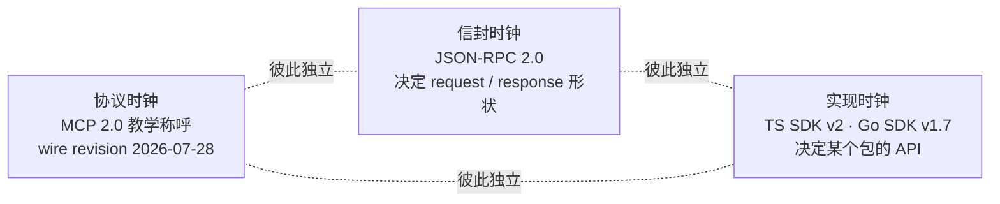

学习和讲解架构时可以写：

```text
MCP 2.0 采用无状态、每请求自描述的模型。
```

写代码、报 bug、发布兼容性声明时应写：

```text
我们的 Server 支持 MCP protocol revision 2026-07-28。
使用 TypeScript SDK v2.x 实现。
```

官方把
`2026-07-28` 及以后称作 **Modern**，
把 `2025-11-25` 及以前称作 **Legacy**；
见
[Versioning and Compatibility](https://modelcontextprotocol.io/specification/2026-07-28/basic/versioning)。

后文除引用官方术语、
精确兼容性判断和来源审计外，
统一称 **MCP 1.0 / MCP 2.0**。

---

## 1. 从最底层开始：什么是 API

### 1.1 API 不是一种网络格式

API 是 **Application Programming Interface**。

最小定义是：

> 一方允许另一方按某个合同使用能力。

这个合同可以是：

- 本地函数；
- 系统调用；
- 动态链接库；
- 浏览器 DOM；
- HTTP 服务；
- 消息队列；
- 数据库驱动；
- 命令行程序；
- MCP Server。

因此，
“API 和 MCP 有什么区别”
这个问题本身有点像：

> “交通工具和火车有什么区别？”

API 是大类；
MCP 是其中一种特定的跨进程协议合同。

### 1.2 一个 API 合同至少回答什么

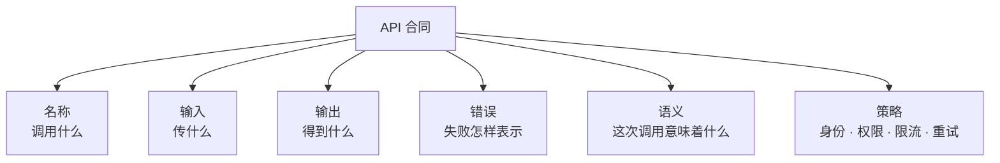

例如一个天气函数：

```ts
getWeather(city: string): Promise<Weather>
```

只看签名，
我们知道输入输出，
但仍不知道：

- 城市名用中文还是 IATA code；
- 结果是当前天气还是预报；
- 超时是否可重试；
- 是否计费；
- 是否需要用户授权位置；
- 是否会记录查询；
- 错误是抛异常还是返回空值。

**【解释】**
协议价值通常不只在“能传字节”，
而在把这些语义变成多方可复用的合同。

### 1.3 进程内与进程外

进程内函数调用大致是：

```text
caller
  → 在同一地址空间放参数
  → 跳到函数代码
  → 拿到返回值
```

跨进程调用必须额外解决：

1. 如何序列化；
2. 如何寻址；
3. 如何传输；
4. 如何关联请求与响应；
5. 如何表示失败；
6. 如何处理超时、取消和重试；
7. 如何认证与授权；
8. 如何演进版本。

REST、RPC、JSON-RPC 和 MCP
都在回答其中一部分，
但层次不同。

---

## 2. REST：把远端世界看成资源

### 2.1 REST 的核心直觉

REST 风格通常把服务抽象成资源：

```http
GET /weather?city=Beijing
```

或者：

```http
GET /cities/Beijing/weather
```

常见 HTTP 动词表达：

- `GET`：读取；
- `POST`：创建或触发；
- `PUT`：整体替换；
- `PATCH`：局部修改；
- `DELETE`：删除。

**【解释】**
REST 的重心是：

> “这个资源现在是什么状态？”

而不是：

> “请调用名为 `getWeather` 的函数。”

### 2.2 REST 的消息路径

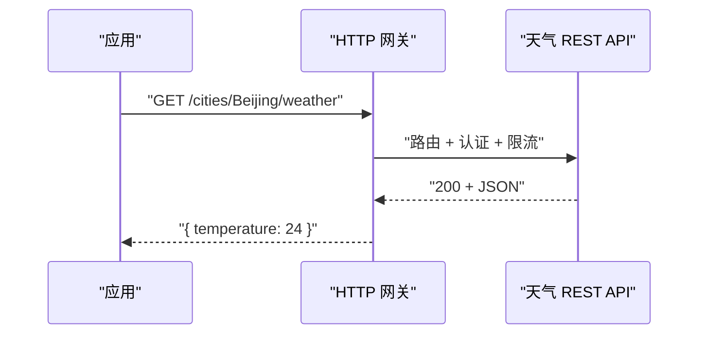

### 2.3 无状态与可缓存：有关联，但不是一回事

REST 的无状态约束要求：

> 每个请求都携带理解和处理它所需的信息，
> Server 不依赖“上一条请求留下的会话上下文”。

这让中间组件更容易独立观察、转发和重试请求，
也让 Server 更容易横向扩容。
代价是一些上下文可能要在每次请求中重复携带。

缓存是 REST 的另一项约束。
响应需要被标记为可缓存或不可缓存；
可缓存响应可以被后续等价请求复用，
但也引入返回陈旧数据的风险。

两者的关系是：

- 自包含请求让缓存层更容易判断两个请求是否等价；
- 但“请求无状态”不等于“响应一定可缓存”；
- cache key、有效期、私有数据隔离仍需单独定义。

这也是理解 MCP 2.0 的一个铺垫：
它吸收了“每个请求尽量自描述”的工程收益，
但它仍是以命名方法为中心的 RPC 协议，
不会因此变成 REST。

上述两个约束及其取舍见 Fielding 对
[REST Stateless 与 Cache 约束](https://ics.uci.edu/~fielding/pubs/dissertation/rest_arch_style.htm)
的原始定义。

### 2.4 REST 擅长什么

- 浏览器和网关生态成熟；
- HTTP cache 语义成熟；
- URL 易于观测和路由；
- 资源 CRUD 容易理解；
- 与 CDN、WAF、反向代理自然配合。

### 2.5 REST 没有自动解决什么

仅有一个 OpenAPI 文档，
并不会自动告诉 AI Host：

- 哪些 endpoint 适合给模型调用；
- 哪个调用具有破坏性；
- 用户是否需要先批准；
- 结果应以怎样的内容块进入上下文；
- 哪些能力是 prompt、resource 或 tool；
- 如何向用户补问缺失字段；
- 如何跨不同服务使用统一发现流程。

这不代表 REST 做得不好。

它解决的是更一般的 Web API 问题，
并非专为 AI Host 与工具生态设计。

---

## 3. RPC：把远端世界看成方法调用

### 3.1 RPC 的核心直觉

RPC 是 **Remote Procedure Call**。

它试图让跨进程操作看起来像：

```ts
const weather = await remote.getWeather({
  city: "Beijing"
});
```

调用者面对：

- 方法名；
- 参数；
- 返回值；
- 远端错误。

### 3.2 REST 与 RPC 不是敌对阵营

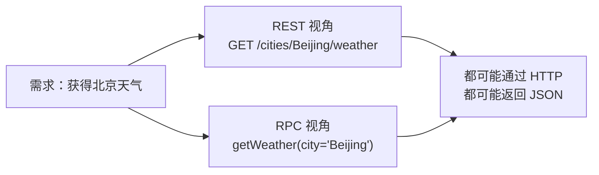

它们可以使用相同传输。

区别主要在应用语义：

- REST 强调资源和统一 HTTP 动词；
- RPC 强调具体方法和参数。

### 3.3 远端调用不能真的等同本地函数

本地函数失败时，
通常不会遇到：

- 网络分区；
- 请求已执行但响应丢失；
- 服务端升级造成 schema 不兼容；
- 同一个请求被重复提交；
- 认证 token 过期；
- 中间网关返回 HTML 错误页。

**【评价】**
好的 RPC 抽象应减少样板代码，
但不应让开发者忘掉分布式系统的不确定性。

---

## 4. JSON-RPC 2.0：MCP 使用的通用消息信封

### 4.1 JSON-RPC 管什么

MCP 的所有消息必须符合
[JSON-RPC 2.0](https://www.jsonrpc.org/specification)；
MCP 对消息又增加了自己的约束，
见当前
[Base Protocol](https://modelcontextprotocol.io/specification/2026-07-28/basic)。

因此可以直接说：

> **MCP 是一个建立在 JSON-RPC 2.0 信封之上的 RPC 应用协议。**

HTTP 和 stdio 只是它可使用的 transport，
不会把以 `method` 与 `params` 为核心的调用语义变成 REST。

下面四段只演示 **JSON-RPC 2.0 信封**，
方法名也是虚构的；它们故意省略 MCP 字段，
不能直接当作 MCP 2.0 的 `2026-07-28` 报文发送。
真正的 MCP 2.0 request 还必须带完整 namespaced `_meta`，
成功结果也必须带 `resultType`；第 12 节会给出完整示例。

一个请求：

```json
{
  "jsonrpc": "2.0",
  "id": 7,
  "method": "math/add",
  "params": {
    "a": 2,
    "b": 3
  }
}
```

成功响应：

```json
{
  "jsonrpc": "2.0",
  "id": 7,
  "result": {
    "value": 5
  }
}
```

错误响应：

```json
{
  "jsonrpc": "2.0",
  "id": 7,
  "error": {
    "code": -32602,
    "message": "Invalid params"
  }
}
```

通知：

```json
{
  "jsonrpc": "2.0",
  "method": "events/changed",
  "params": {
    "name": "weather"
  }
}
```

通知没有 `id`，
接收方不能发响应。

### 4.2 MCP 2.0 不支持 JSON-RPC batching

原始 JSON-RPC 2.0 允许把多个消息放进一个数组批量发送。
MCP 2.0 则把 wire message 收窄为单个：

```text
JSONRPCRequest | JSONRPCNotification | JSONRPCResponse
```

而不是这些消息的数组。
MCP 已在 `2025-06-18` revision 移除 batching，
MCP 2.0 延续这一约束；
不能因为底层 JSON-RPC 规范支持 batch，
就向 MCP endpoint 发送 batch array。

在 Streamable HTTP 上，规则更具体：

- Client 发出的每条 JSON-RPC message 都使用一次新的 HTTP `POST`；
- POST body 必须是一条 JSON-RPC request 或 notification；
- body 不能是 batch，也不能由 Client 发送 JSON-RPC response。

可审计依据分别是冻结的
[2025-06-18 Changelog](https://modelcontextprotocol.io/specification/2025-06-18/changelog)、
[2026-07-28 schema](https://github.com/modelcontextprotocol/modelcontextprotocol/blob/5f5440bb26a62e2cf3440b92da5a667efa03b267/schema/2026-07-28/schema.ts)
与
[Streamable HTTP / Sending Messages](https://modelcontextprotocol.io/specification/2026-07-28/basic/transports/streamable-http#sending-messages)。

### 4.3 `id` 是做什么的

同一连接中可能并发多个请求：

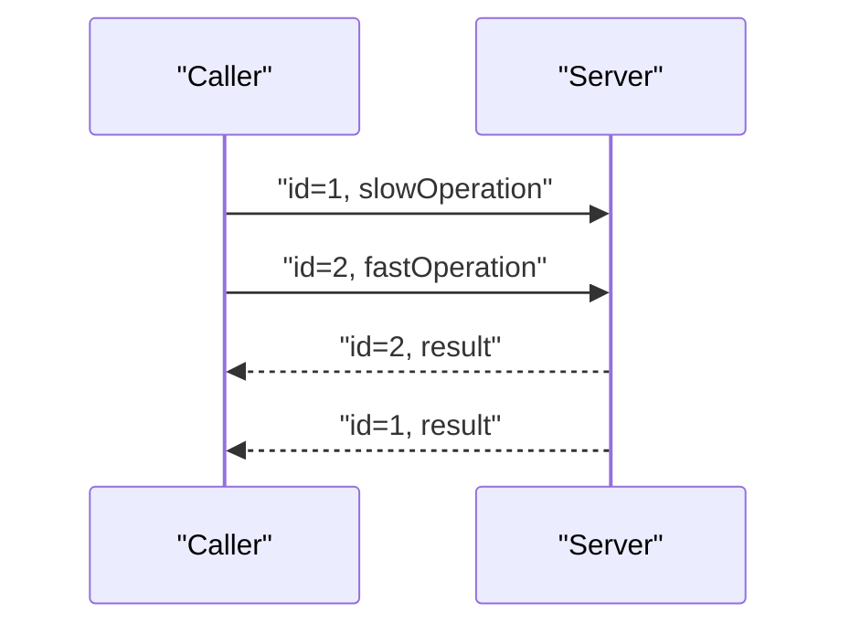

响应顺序可以不同于请求顺序。

调用者靠 `id` 做关联。

MCP 2.0 进一步要求：

- request `id` 必须是字符串或整数；
- 不能为 `null`；
- 尚未完成的请求之间不能复用同一个 `id`。

见当前
[Base Protocol / Requests](https://modelcontextprotocol.io/specification/2026-07-28/basic#requests)。

### 4.4 JSON-RPC 不管什么

JSON-RPC 本身不知道：

- 什么是 Tool；
- 如何列出 Tool；
- Tool 参数用什么 schema；
- 什么是 Prompt 或 Resource；
- 用户何时批准；
- Server 支持哪个 MCP 版本；
- Client 支持 elicitation 吗；
- HTTP OAuth 怎么做；
- MCP 内容如何表示图片、音频或资源链接。

所以 JSON-RPC 是信封，
不是 MCP 的全部。

### 4.5 MCP 对成功响应新增的关键要求

MCP 2.0 的成功结果必须有 `resultType`：

```json
{
  "jsonrpc": "2.0",
  "id": 7,
  "result": {
    "resultType": "complete",
    "value": 5
  }
}
```

核心值包括：

- `complete`：本次操作已完成；
- `input_required`：还需要 Client 提供输入；
- extension 可以声明额外值，例如 Tasks 的 `task`。

为兼容 MCP 1.0 Server，
缺少 `resultType` 的 MCP 1.0 响应
由 MCP 2.0 Client 当作 `complete`；
见
[Base Protocol / Result responses](https://modelcontextprotocol.io/specification/2026-07-28/basic#result-responses)。

### 4.6 分层不要混淆

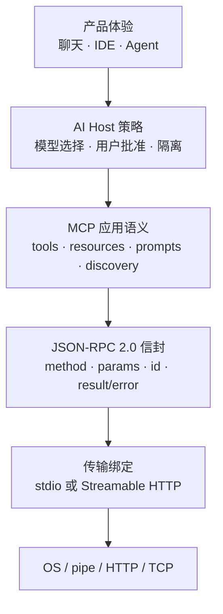

**【解释】**
MCP 的主要价值不在发明另一种 JSON，
而在 RPC 信封之上
统一 AI 工具生态的语义、发现和安全责任。

---

## 5. MCP 为什么存在

### 5.1 没有 MCP 时的 N×M 集成

假设有：

- 4 个 AI Host；
- 5 个数据或工具服务。

传统做法往往让每个 Host
分别实现每个服务的适配器：

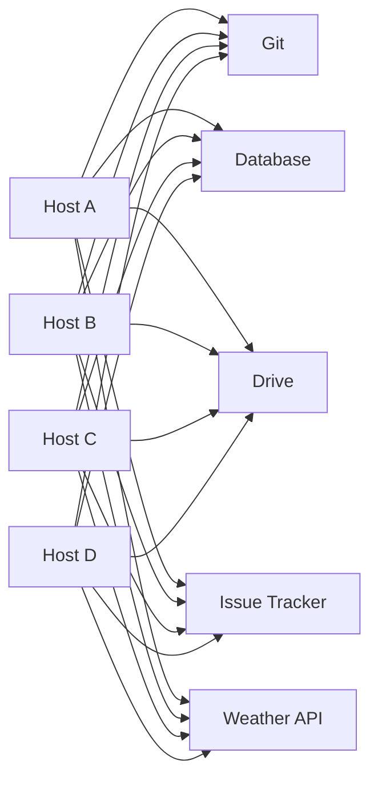

这里没有声称
“MCP 从数学上消灭所有 N×M 工作”。

现实中仍有：

- 认证差异；
- UI 差异；
- Host 能力差异；
- 部署差异；
- 产品策略差异。

但 MCP 让双方至少共享：

- 消息模型；
- 发现方法；
- Tool/Resource/Prompt schema；
- 内容块；
- 能力声明；
- 错误结构；
- 版本兼容流程；
- HTTP 授权框架。

### 5.2 MCP 之后的标准边界

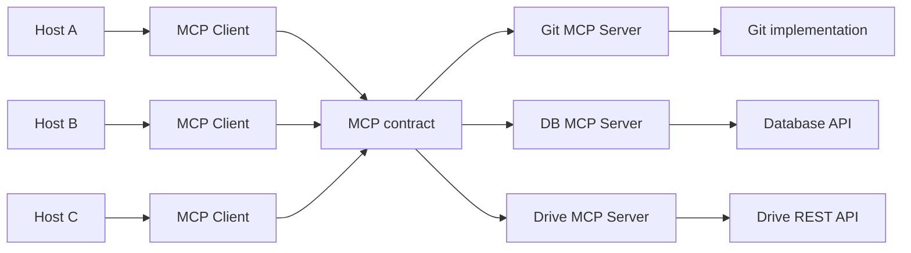

**【事实】**
官方说明 MCP 受 Language Server Protocol 启发，
目标是形成模型应用连接外部系统的开放标准；
见
[MCP Specification](https://modelcontextprotocol.io/specification/2026-07-28)
和最初的
[2024-11-25 发布公告](https://www.anthropic.com/news/model-context-protocol)。

### 5.3 MCP 不替代后端 API

一个 GitHub MCP Server 可能内部仍调用：

```http
POST /repos/{owner}/{repo}/issues
```

一个数据库 MCP Server
可能内部仍执行 SQL。

一个本地文件 MCP Server
可能内部仍调用操作系统文件 API。

MCP 统一的是：

```text
AI Host ↔ MCP Server
```

而不是强迫所有后端改用 MCP：

```text
MCP Server ↔ 实际业务系统
```

### 5.4 MCP 与模型 tool calling

模型供应商常提供 tool/function calling：

```json
{
  "name": "get_weather",
  "description": "Get weather for a city",
  "parameters": {
    "type": "object",
    "properties": {
      "city": {
        "type": "string"
      }
    },
    "required": ["city"]
  }
}
```

这和 MCP Tool 相似，
但边界不同：

| 模型 tool calling | MCP |
|---|---|
| Host 与某个模型 API 之间的合同 | Host/Client 与 MCP Server 之间的合同 |
| 描述模型如何选择工具 | 描述工具如何发现、调用和返回 |
| 通常不规定工具来自哪里 | 明确 Server、transport、capability 等 |
| 由模型厂商 API 定义 | 开放协议规范 |

**【解释】**
Host 通常会把 MCP Tool
转换成模型 API 接受的 tool schema，
再把模型选择转换成 `tools/call`。

这是一种常见实现路径，
不是规范要求 Host 内部必须采用的唯一架构。

---

## 6. Host、Client、Server：三个角色不要混成两个

当前官方角色定义见
[Architecture](https://modelcontextprotocol.io/specification/2026-07-28/architecture)。

### 6.1 Host

Host 是用户实际使用的 AI 应用，
例如：

- IDE；
- 桌面助手；
- 聊天应用；
- Agent runtime；
- 自动化平台。

Host 通常负责：

- 保存对话；
- 调用模型；
- 创建 MCP Client；
- 聚合多个 Server 的上下文；
- 展示 Tool；
- 获得用户同意；
- 执行安全策略；
- 隔离不同 Server；
- 决定把什么发给模型。

### 6.2 Client

MCP Client 是 Host 内部的协议参与者。

**【事实】**
一个 Client 与一个 Server
保持一对一关系。

一个 Host 可以创建多个 Client，
分别连接多个 Server。

Client 负责：

- 编码和发送 MCP 消息；
- 声明协议版本和 capabilities；
- 处理响应与通知；
- 执行兼容性流程；
- 把 Host 的许可决策落实为协议行为。

Client 不必是独立进程。

它可以只是 Host 进程中的一个对象或库实例。

### 6.3 Server

MCP Server 提供聚焦的能力：

- Tools；
- Resources；
- Prompts；
- 可选 utilities；
- 可选 extensions。

它可以是：

- Client 启动的本地 stdio 子进程；
- 远端 HTTP 服务；
- 某个企业系统前面的 adapter；
- 一个同时调用多个后端的聚合服务。

### 6.4 正确拓扑

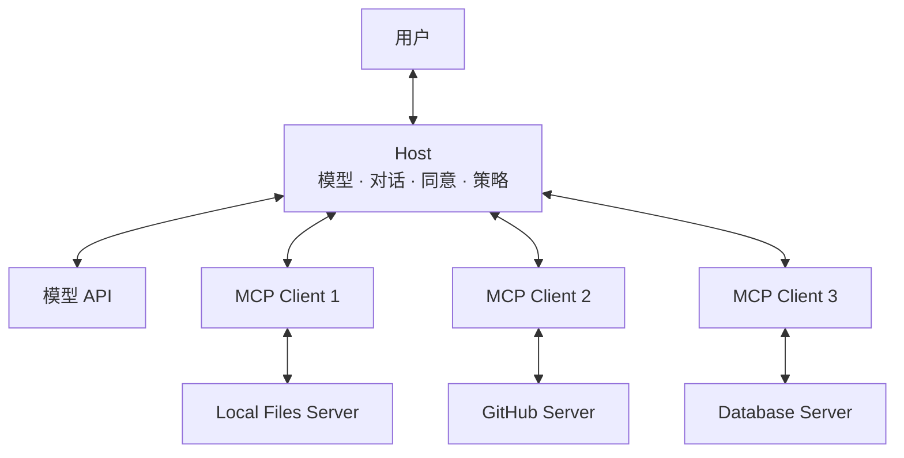

错误心智模型：

```text
模型 → 一个无所不知的 MCP 总服务器
```

更准确的心智模型：

```text
Host 代表用户，
协调模型和多个相互隔离的 Server。
```

### 6.5 信任边界

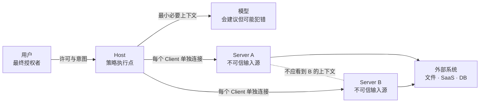

**【事实】**
官方架构强调：

- Host 维护安全策略与 consent；
- Server 不应自动看到整个对话；
- Server 之间应保持隔离；
- Host 只暴露必要上下文。

见当前
[Architecture / Design Principles](https://modelcontextprotocol.io/specification/2026-07-28/architecture)。

---

## 7. 三个 Server 原语：Prompt、Resource、Tool

官方把核心 Server features 分成三类，
见
[Server Features](https://modelcontextprotocol.io/specification/2026-07-28/server)。

### 7.1 一张控制权图

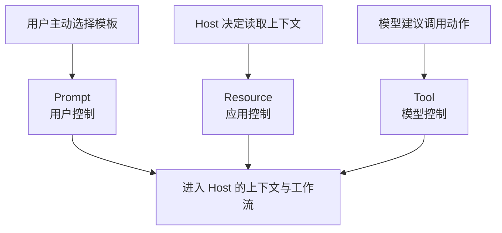

这里的“控制”是交互设计倾向，
不是绕过授权的许可证。

模型控制 Tool 意味着：

> 模型可以根据上下文主动建议调用。

不意味着：

> 模型说调用就必须执行。

### 7.2 Prompt：用户选择的模板

Prompt 适合：

- “总结这个仓库”；
- “生成 release note”；
- “进行安全审查”；
- 带参数的预定义工作流入口。

常用方法：

```text
prompts/list
prompts/get
```

`prompts/list`
让 Client 发现可用 Prompt。

`prompts/get`
根据名称和参数取得消息模板。

当前规范见
[Prompts](https://modelcontextprotocol.io/specification/2026-07-28/server/prompts)。

### 7.3 Resource：应用决定何时读取的上下文

Resource 适合：

- 文件内容；
- 数据库记录；
- Git history；
- 文档；
- 服务状态；
- 可通过 URI 标识的数据。

常用方法：

```text
resources/list
resources/templates/list
resources/read
```

Resource 以 URI 标识，
可以返回文本或二进制 blob。

当前规范见
[Resources](https://modelcontextprotocol.io/specification/2026-07-28/server/resources)。

### 7.4 Tool：模型可以建议调用的动作

Tool 适合：

- 搜索；
- 执行查询；
- 创建 issue；
- 修改文件；
- 发送消息；
- 调用外部系统。

常用方法：

```text
tools/list
tools/call
```

当前规范见
[Tools](https://modelcontextprotocol.io/specification/2026-07-28/server/tools)。

### 7.5 Tool 定义

概念化示例：

```json
{
  "name": "get_weather",
  "title": "查询天气",
  "description": "查询指定城市的当前天气",
  "inputSchema": {
    "type": "object",
    "properties": {
      "city": {
        "type": "string"
      }
    },
    "required": ["city"],
    "additionalProperties": false
  },
  "outputSchema": {
    "type": "object",
    "properties": {
      "temperature": {
        "type": "number"
      },
      "conditions": {
        "type": "string"
      }
    },
    "required": ["temperature", "conditions"],
    "additionalProperties": false
  }
}
```

当前默认 JSON Schema dialect 是 2020-12。

实现必须至少支持该 dialect；
见
[Base Protocol / JSON Schema Usage](https://modelcontextprotocol.io/specification/2026-07-28/basic#json-schema-usage)。

`inputSchema` 约束调用参数；
可选的 `outputSchema` 约束结构化结果。
`structuredContent` 本身也是 optional，
可以是任意符合 schema 的 JSON value；
当前 `CallToolResult.content` 仍是 required。
如果 Tool 声明了 `outputSchema`，
Server **MUST** 返回符合它的 `structuredContent`，
Client **SHOULD** 在交给模型前验证结果。
为了兼容只读取内容块的 Client，
Server **SHOULD** 同时在 `content` 中放一份序列化 JSON。
这里的 MCP `structuredContent`
与模型供应商的 structured output 不是一回事。
见
[Tools / Structured Content](https://modelcontextprotocol.io/specification/2026-07-28/server/tools#structured-content)。

### 7.6 为什么不把所有东西都做成 Tool

可以把“读文件”做成 Tool，
但 Resource 额外表达：

- 它是可寻址内容；
- Host 可决定何时读取；
- 可以列出与订阅变化；
- UI 可以把它展示为上下文对象。

可以把“代码审查模板”做成 Tool，
但 Prompt 额外表达：

- 它是用户主动选择的工作流入口；
- 返回的是对话消息模板；
- 不一定立即执行外部副作用。

**【评价】**
三个原语的价值不是技术上互不可替代，
而是保留控制权与交互语义。

把所有东西都塞进 Tool，
会丢失这层语义。

### 7.7 原语选择表

| 问题 | 更可能选择 |
|---|---|
| 用户是否主动选择一个模板？ | Prompt |
| 内容是否有稳定 URI？ | Resource |
| Host 是否应自行决定何时加载？ | Resource |
| 是否执行计算或副作用？ | Tool |
| 模型是否需要主动建议调用？ | Tool |
| 是否只是用户可复用的消息骨架？ | Prompt |

---

## 8. MCP 1.0 究竟做了什么

### 8.1 先固定本文口径

**【事实】**
官方把这一时期称为 Legacy era；
本文统一教学称呼为 **MCP 1.0**。

MCP 1.0 包括多个官方日期修订，
例如：

- `2024-11-05`
- `2025-03-26`
- `2025-06-18`
- `2025-11-25`

版本发布记录可从
[官方 GitHub Releases](https://github.com/modelcontextprotocol/modelcontextprotocol/releases)
审计。

本文用 `2025-11-25`
代表成熟的 MCP 1.0 对照。

### 8.2 MCP 1.0 的核心心智模型

MCP 1.0 Client 与 Server
先建立并初始化一个带状态 session：

```text
连接
  → initialize
  → 版本与 capability 协商
  → initialized 通知
  → operation
  → shutdown
```

官方 Legacy lifecycle 原文见
[2025-11-25 Lifecycle](https://modelcontextprotocol.io/specification/2025-11-25/basic/lifecycle)。

官方 Legacy architecture 直接称其为
“one stateful session per server”，
见
[2025-11-25 Architecture](https://modelcontextprotocol.io/specification/2025-11-25/architecture)。

### 8.3 三阶段生命周期

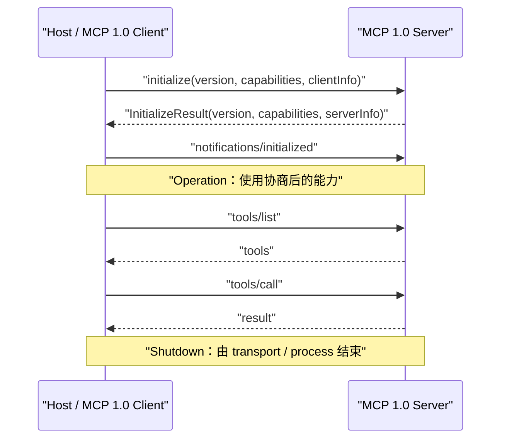

关键规则：

1. `initialize` 必须是首次交互。
2. Client 提议协议版本。
3. 双方交换 capabilities。
4. Server 返回协商后的协议版本。
5. Client 发 `notifications/initialized`。
6. 此后只能使用已协商能力。

### 8.4 MCP 1.0 initialize 示例

简化后的教学示例：

```json
{
  "jsonrpc": "2.0",
  "id": 1,
  "method": "initialize",
  "params": {
    "protocolVersion": "2025-11-25",
    "capabilities": {
      "sampling": {},
      "elicitation": {}
    },
    "clientInfo": {
      "name": "example-host",
      "version": "1.0.0"
    }
  }
}
```

Server 返回：

```json
{
  "jsonrpc": "2.0",
  "id": 1,
  "result": {
    "protocolVersion": "2025-11-25",
    "capabilities": {
      "tools": {
        "listChanged": true
      },
      "resources": {
        "subscribe": true,
        "listChanged": true
      }
    },
    "serverInfo": {
      "name": "example-server",
      "version": "1.0.0"
    }
  }
}
```

然后 Client 通知：

```json
{
  "jsonrpc": "2.0",
  "method": "notifications/initialized"
}
```

这些是教学裁剪，
精确字段应以冻结的
[MCP 1.0 对照 schema commit](https://github.com/modelcontextprotocol/modelcontextprotocol/tree/38c84e9f93ad191d9eb26d92b945d17bd0efcaf3)
为准。

### 8.5 MCP 1.0 capability 的意义

能力协商避免一方盲目调用：

- Client 不支持 sampling，
  Server 就不应发 sampling request。
- Server 不支持 resources，
  Client 就不应调用 `resources/list`。
- Server 不声明 list changed，
  Client 就不能假设会收到变更通知。

这个目标是合理的。

MCP 2.0 没有取消 capability，
而是改变 capability 的携带方式。

### 8.6 MCP 1.0 transport 演进

早期 `2024-11-05`
有两种标准 transport：

- stdio；
- HTTP with SSE。

见
[2024-11-05 Transports](https://modelcontextprotocol.io/specification/2024-11-05/basic/transports)。

`2025-03-26`
引入 Streamable HTTP，
替代 MCP 1.0 早期的 HTTP+SSE。

到 `2025-11-25`，
Streamable HTTP 仍允许：

- `Mcp-Session-Id`；
- POST 请求；
- GET 打开 Server→Client SSE；
- SSE 事件恢复；
- Server→Client 独立 JSON-RPC 请求。

### 8.7 MCP 1.0 stdio

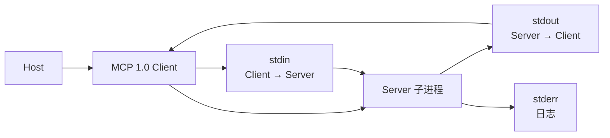

优点：

- 无需监听网络端口；
- 本地权限可继承；
- 部署简单；
- 双向消息自然；
- 适合桌面 Host 启动工具进程。

约束：

- stdout 必须保持协议纯净；
- 日志写 stderr；
- 子进程生命周期由 Host 管理；
- 每个 Host 可能各自启动实例。

### 8.8 MCP 1.0 Streamable HTTP

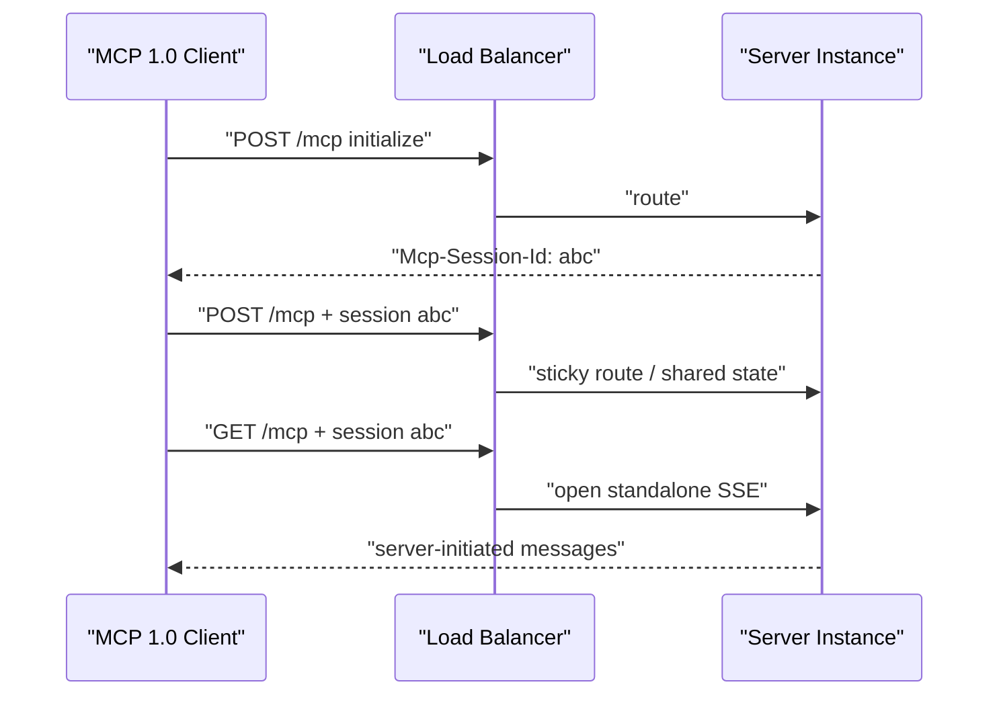

这里已经能看到：

协议 session 与基础设施路由开始耦合。

但先不要急着批判。

下一节先完整走一遍
MCP 1.0 Tool 调用，
才能理解它带来的开发体验。

---

## 9. MCP 1.0 端到端 Tool call

### 9.1 场景

用户问：

> 北京现在天气怎样？

系统中有：

- 一个聊天 Host；
- 一个模型 API；
- 一个 MCP 1.0 Client；
- 一个 weather MCP Server；
- 一个实际天气 REST API。

### 9.2 完整路径

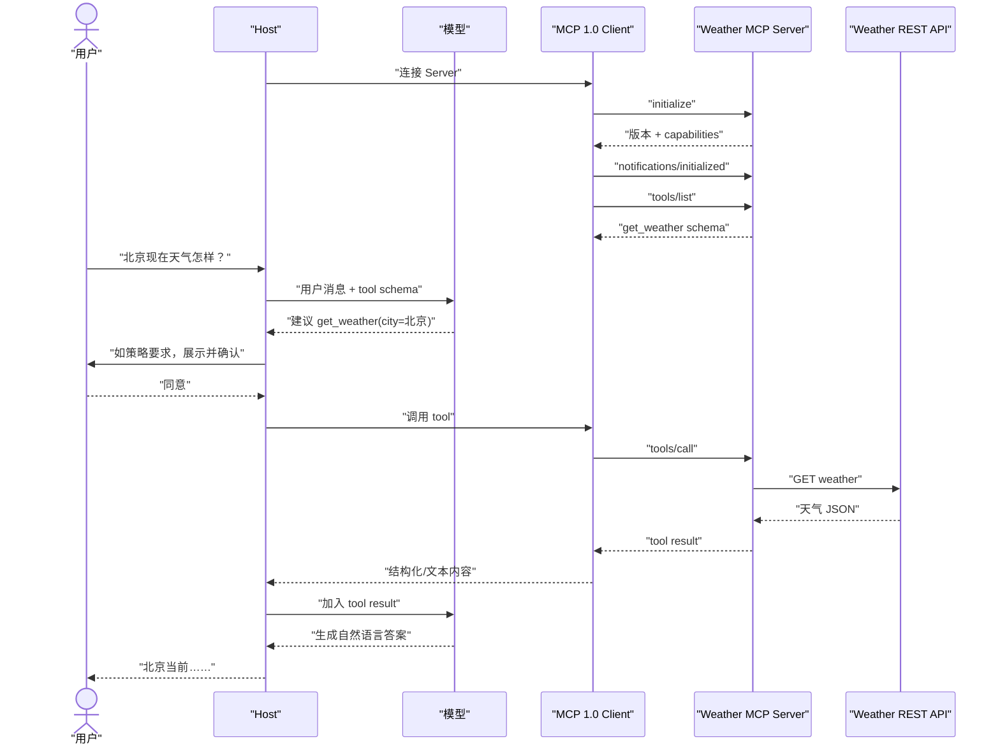

### 9.3 `tools/list`

MCP 1.0 Client 发现工具：

```json
{
  "jsonrpc": "2.0",
  "id": 2,
  "method": "tools/list",
  "params": {}
}
```

首次请求省略 `cursor`。
cursor 是 Server 生成的不透明值，
Client **MUST NOT** 解析、修改或推断其格式。

Server 返回：

```json
{
  "jsonrpc": "2.0",
  "id": 2,
  "result": {
    "tools": [
      {
        "name": "get_weather",
        "description": "查询城市当前天气",
        "inputSchema": {
          "type": "object",
          "properties": {
            "city": {
              "type": "string"
            }
          },
          "required": ["city"]
        },
        "outputSchema": {
          "type": "object",
          "properties": {
            "temperature": {
              "type": "number"
            },
            "conditions": {
              "type": "string"
            }
          },
          "required": ["temperature", "conditions"]
        }
      }
    ],
    "nextCursor": "page-2"
  }
}
```

有 `nextCursor` 表示 Client 可以继续请求下一页，
Client 将它原样放进下一次 `params.cursor`：

```json
{
  "jsonrpc": "2.0",
  "id": 4,
  "method": "tools/list",
  "params": {
    "cursor": "page-2"
  }
}
```

Client 把第二页 `tools` 追加到已经收集的第一页结果，
而不是用第二页覆盖第一页；
只要响应继续带 `nextCursor`，
就重复“原样回传 cursor → 累积结果”。
这里的“累积”是 Client 应用逻辑，
不是 MCP 对结果容器的 MUST；
协议也不保证跨页 snapshot consistency，
底层数据同时变化时可能出现 gap 或 duplicate。

没有 `nextCursor` 时，Client **SHOULD** 视为分页结束；
Page size 由 Server 决定，
Client **MUST NOT** 假定固定大小。
无效 cursor **SHOULD** 返回
`-32602 Invalid params`。

上面的 opaque cursor、`nextCursor` flow、
Server 决定 page size、缺少 `nextCursor` 的结束判断
与 invalid cursor 处理，
是 MCP 1.0 和 MCP 2.0 共有的分页规则。

下面这条是 `2026-07-28` 新增的明确规则，
不能倒写成 MCP 1.0 当时已有的规范义务：

> 空字符串仍是有效 cursor；
> MCP 2.0 Client **MUST NOT** 把它当作分页结束。

见
[2025-11-25 Pagination](https://modelcontextprotocol.io/specification/2025-11-25/server/utilities/pagination)
与
[2026-07-28 Pagination](https://modelcontextprotocol.io/specification/2026-07-28/server/utilities/pagination)。

### 9.4 Host 把 Tool 交给模型

这一段不是 MCP wire message。

Host 可能调用任意模型 API：

```json
{
  "messages": [
    {
      "role": "user",
      "content": "北京现在天气怎样？"
    }
  ],
  "tools": [
    {
      "name": "get_weather",
      "description": "查询城市当前天气",
      "parameters": {
        "type": "object",
        "properties": {
          "city": {
            "type": "string"
          }
        },
        "required": ["city"]
      }
    }
  ]
}
```

模型返回 Tool 选择，
同样不是 MCP 规范的一部分。

### 9.5 `tools/call`

Host 经 Client 发出：

```json
{
  "jsonrpc": "2.0",
  "id": 3,
  "method": "tools/call",
  "params": {
    "name": "get_weather",
    "arguments": {
      "city": "北京"
    }
  }
}
```

Server 调用天气后端，
再返回：

```json
{
  "jsonrpc": "2.0",
  "id": 3,
  "result": {
    "content": [
      {
        "type": "text",
        "text": "{\"temperature\":24,\"conditions\":\"多云\"}"
      }
    ],
    "structuredContent": {
      "temperature": 24,
      "conditions": "多云"
    },
    "isError": false
  }
}
```

端到端合同是：

1. `tools/list` 中的 `outputSchema` 声明结构；
2. `tools/call` 的 `structuredContent` 提供机器可读值；
3. Server 在声明 `outputSchema` 后 **MUST** 让两者一致；
4. Client **SHOULD** 验证；
5. `content` 中保留序列化 JSON，兼容旧 Client。

MCP 2.0 响应还必须处理 `resultType`，
后文会给出当前版本的完整示例。

### 9.6 Tool 协议错误与 Tool 执行失败不同

协议错误示例：

```json
{
  "jsonrpc": "2.0",
  "id": 3,
  "error": {
    "code": -32602,
    "message": "Unknown tool"
  }
}
```

表示：

- Tool 名称未知、`CallToolRequest` 信封不符合 schema，
  或 Server 本身发生协议级错误；
- Client 应把它当 RPC 失败。

这里的“信封不符合 schema”指 JSON-RPC/MCP 请求结构错误，
不是 Tool 业务参数的值不合法。

Tool 执行结果中的失败：

```json
{
  "jsonrpc": "2.0",
  "id": 3,
  "result": {
    "content": [
      {
        "type": "text",
        "text": "天气供应商暂时不可用"
      }
    ],
    "isError": true
  }
}
```

表示：

- `tools/call` 协议调用成功到达；
- Tool 的执行失败，例如上游 API 失败、
  日期格式或范围等输入值校验失败、业务规则拒绝；
- Host 可以把结果反馈给模型，
  让模型修正参数或向用户解释。

规范给 Client 的模型反馈强度并不相同：

- Client **MAY** 把 protocol error 提供给模型；
- Client **SHOULD** 把 `isError: true` 的 execution error 提供给模型，
  以便模型自我修正。

因此，不能为了省事把参数值 validation、
业务失败或后端 API 失败都塞进 JSON-RPC `error`。

当前 Tool 行为以
[2026-07-28 Tools / Error Handling](https://modelcontextprotocol.io/specification/2026-07-28/server/tools#error-handling)
为准。

### 9.7 这一链路最容易混淆的四份合同

| 合同 | 参与方 |
|---|---|
| 用户界面合同 | 用户 ↔ Host |
| 模型 tool calling 合同 | Host ↔ 模型 API |
| MCP 合同 | MCP Client ↔ MCP Server |
| 后端 REST 合同 | MCP Server ↔ 天气 API |

排查问题时必须先问：

> 错误发生在哪一份合同里？

否则很容易把：

- 模型没有选工具；
- Host 拒绝调用；
- MCP schema 校验失败；
- 天气 API 429；

混成一句含糊的：

> “MCP 不工作。”

---

## 10. MCP 1.0 的早期设计做对了什么，又付出了什么

### 10.1 不应从结论倒推“MCP 1.0 设计愚蠢”

MCP 1.0 的目标环境很大一部分是：

- 桌面应用；
- IDE；
- Host 启动本地子进程；
- 一次连接对应一个使用上下文；
- Server 需要向 Client 请求 sampling、roots 或 elicitation；
- 双方希望只在开头协商一次能力。

在这个环境里，
有状态 session 有真实收益。

### 10.2 MCP 1.0 设计的收益

| 设计 | 当时的直接收益 |
|---|---|
| `initialize` | 一次性交换版本、身份展示信息和能力 |
| session capability | 后续消息不必重复声明 |
| Server→Client request | sampling、elicitation 等像普通 RPC 一样自然 |
| 长连接 SSE | Server 可随时推送请求和通知 |
| `Mcp-Session-Id` | Server 能把多次 HTTP 调用关联到同一协议上下文 |
| 连接生命周期 | 开始、运行、结束容易映射到进程或 UI 生命周期 |

### 10.3 MCP 1.0 设计的隐含假设

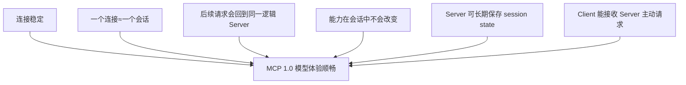

这些不是永远错误的假设。

本地 stdio 场景中，
它们经常成立。

问题在于：

> 协议把这些部署假设，
> 变成了所有远端实现都要承担的基础条件。

### 10.4 得失不是同一维度

MCP 1.0 优化的是：

- 交互连续性；
- 双向调用自然度；
- 单连接编程模型；
- 初始化后消息简洁。

MCP 2.0 优化的是：

- 横向扩容；
- 故障恢复；
- 网关可见性；
- 显式状态；
- 请求独立性；
- 兼容与 extension 演进。

**【评价】**
这不是从“有功能”退化到“没功能”，
而是把连续交互重新编码成
可重试的请求状态和显式 extension。

---

## 11. MCP 1.0 进入远端生产后暴露了什么问题

官方动机最集中地记录在：

- [SEP-2575：Make MCP Stateless](https://modelcontextprotocol.io/seps/2575-stateless-mcp)
- [SEP-2567：Sessionless via Explicit State Handles](https://modelcontextprotocol.io/seps/2567-sessionless-mcp)
- [2026-07-28 Changelog](https://modelcontextprotocol.io/specification/2026-07-28/changelog)
- [2026-07-28 官方发布说明](https://blog.modelcontextprotocol.io/posts/2026-07-28/)

### 11.1 横向扩容

MCP 1.0 请求依赖 initialize 建立的状态时：

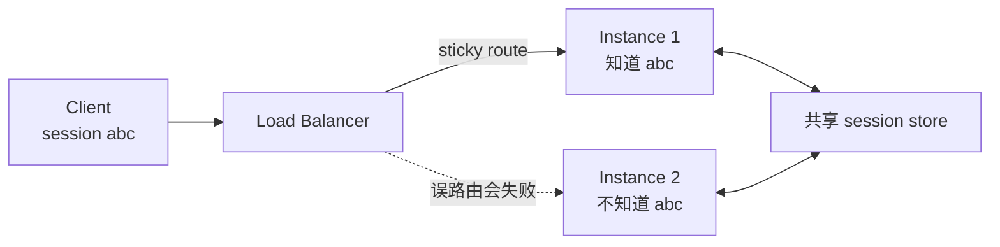

运维只有几种选择：

- sticky routing；
- 共享 session store；
- 将所有相关消息固定在一个有状态 actor；
- 失败时让整个 session 重建。

这些都不是不可能，
但会增加：

- 基础设施复杂度；
- 故障模式；
- 成本；
- 回收和过期逻辑；
- 灰度升级难度。

### 11.2 故障恢复

若保存 session 的实例崩溃：

- Client 的连接还可能存在假象；
- 新实例没有初始化上下文；
- 未完成的 Server→Client request 需要恢复；
- SSE event id 与 replay buffer 要维护；
- Client 和 Server 要判断从哪里继续。

**【解释】**
状态不是消失了，
而是以最难观测的方式
散落在连接、内存和重连逻辑中。

### 11.3 session 的语义没有收敛

SEP-2567 指出，
不同 Client 把 session 理解为：

- 一次 Tool call；
- 一次应用启动；
- 一个页面；
- 一个聊天 thread；
- 一段登录状态；
- 一个用户。

于是 Server 很难知道：

> session 中保存的状态究竟应该共享到哪里？

一个购物车可能希望跨页面共享；

同一用户的两个并行沙箱
又必须隔离。

单个模糊 session scope
无法同时表达两者。

### 11.4 Server callback 与网络拓扑

MCP 1.0 Server 可以向 Client 发独立 request。

远端环境因此要保证：

- Client 有可持续接收通道；
- 代理不会提前关闭连接；
- 负载均衡能把回调路由到正确 Client；
- 请求与重连状态能恢复；
- callback 的授权语境没有丢失。

### 11.5 网关深度解析

若所有 HTTP 请求都是：

```http
POST /mcp
```

网关只看 URL
无法知道它是：

- `tools/call`；
- `resources/read`；
- `prompts/get`；
- `tools/list`。

想做差异化：

- WAF 规则；
- 审计；
- 限流；
- 路由；
- 成本统计；

就必须解析 JSON body。

### 11.6 缓存困难

如果 Tool 列表可以隐式依赖 session，
网关和 Client 难以回答：

- 列表可缓存多久；
- 可否跨用户复用；
- 列表顺序是否稳定；
- 何时失效。

### 11.7 为什么这些是协议问题

可以在 SDK 内打补丁，
但当每个 SDK 都独立约定：

- session 恢复；
- callback 重试；
- list cache；
- feature negotiation；
- gateway headers；

生态会再次碎片化。

所以 `2026-07-28`
把这些问题提升到协议层处理。

---

## 12. MCP 2.0 总览：从隐式 session 到自描述请求

### 12.1 官方定义

**【事实】**
MCP 2.0 是无状态协议：

- 处理请求所需信息包含在请求中；
- Server 不能从同一连接上的早先请求推断版本、capability 或身份；
- 一个连接可以交错多个 task、thread 或 conversation；
- 跨请求状态必须由 Client 携带显式 identifier。

见
[Base Protocol / Statelessness](https://modelcontextprotocol.io/specification/2026-07-28/basic#statelessness)。

### 12.2 “无状态”不是什么意思

它不表示：

- Tool 不能创建数据库记录；
- Server 不能保存 job；
- OAuth 不能有 token；
- Client 不能有对话；
- Task 不能长时间运行；
- Resource 不能变化；
- Server 不能缓存。

它表示：

> 这些状态不能只靠
> “你还在上次那条连接上”
> 来隐式定位。

### 12.3 MCP 2.0 主路径

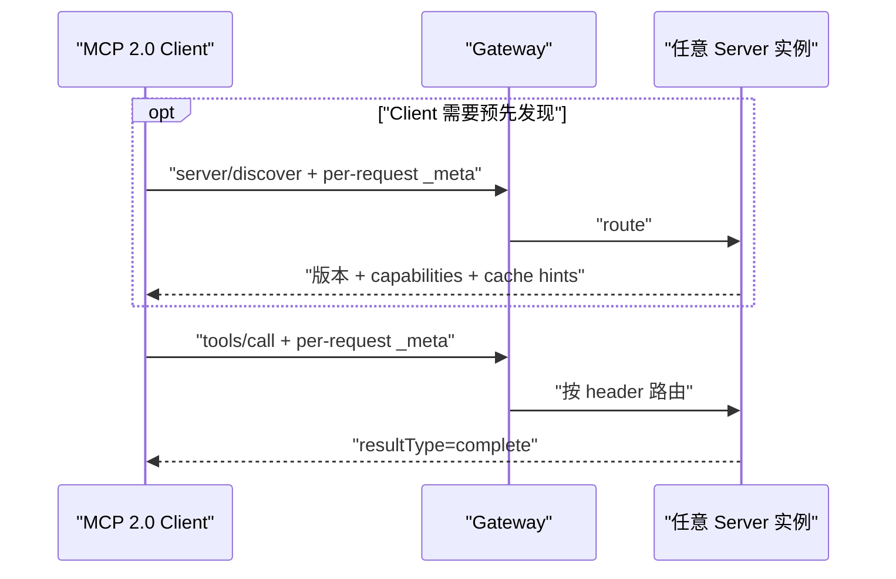

这里没有：

- `initialize`；
- `notifications/initialized`；
- `Mcp-Session-Id`；
- “这条连接属于哪个 conversation”的隐式假设。

### 12.4 每个请求的必需 metadata

当前请求 `_meta` 中：

| 字段 | 强度 | 用途 |
|---|---|---|
| `io.modelcontextprotocol/protocolVersion` | MUST | 当前请求采用的协议修订 |
| `io.modelcontextprotocol/clientCapabilities` | MUST | 当前请求可用的 Client capabilities |
| `io.modelcontextprotocol/clientInfo` | SHOULD include | 展示、日志、调试 |
| `io.modelcontextprotocol/logLevel` | MAY；**deprecated** | 该请求希望的最低日志级别 |

精确要求见
[Base Protocol / `_meta`](https://modelcontextprotocol.io/specification/2026-07-28/basic#_meta)。

注意：

- `clientInfo` **不是 MUST**；
- 规范说 Client **SHOULD** 在每个请求携带；
- 它是自报信息；
- 不能用作认证或安全决策。

`io.modelcontextprotocol/logLevel` 所属的 Logging feature
在 `2026-07-28` 已 deprecated，
但字段仍可使用。
如果一个 request **没有**携带该字段，
Server **MUST NOT** 为这个 request 发送
`notifications/message`；
如果携带，Server **MAY** 在该 request 的 response stream 上、
final response 之前，
发送不低于所请求级别的日志通知。
Server **MUST NOT** 把它们放到
`subscriptions/listen` 或其他 request 的 stream。
这里约束的是 MCP `notifications/message`，
不禁止 stderr 或 OpenTelemetry 观测。
见
[Logging](https://modelcontextprotocol.io/specification/2026-07-28/server/utilities/logging)。

### 12.5 一个 MCP 2.0 `tools/call`

```json
{
  "jsonrpc": "2.0",
  "id": "call-42",
  "method": "tools/call",
  "params": {
    "name": "get_weather",
    "arguments": {
      "city": "北京"
    },
    "_meta": {
      "io.modelcontextprotocol/protocolVersion": "2026-07-28",
      "io.modelcontextprotocol/clientCapabilities": {},
      "io.modelcontextprotocol/clientInfo": {
        "name": "example-host",
        "version": "2.4.0"
      }
    }
  }
}
```

成功响应：

```json
{
  "jsonrpc": "2.0",
  "id": "call-42",
  "result": {
    "resultType": "complete",
    "content": [
      {
        "type": "text",
        "text": "{\"temperature\":24,\"conditions\":\"多云\"}"
      }
    ],
    "structuredContent": {
      "temperature": 24,
      "conditions": "多云"
    },
    "isError": false,
    "_meta": {
      "io.modelcontextprotocol/serverInfo": {
        "name": "weather-server",
        "version": "3.1.0"
      }
    }
  }
}
```

这个结果与第 7.5 节声明的 `outputSchema` 一致：
`structuredContent` 提供机器可读对象，
`content` 同时保留同一对象的 serialized JSON，
供只读取内容块的 Client 使用。

`serverInfo` 同样是自报展示信息，
不是可信身份。

### 12.6 必需 metadata 缺失

若缺少必需 per-request 字段：

- JSON-RPC error：
  `-32602 Invalid params`
- HTTP：
  `400 Bad Request`

若操作需要 Client 没声明的 capability：

- `MissingRequiredClientCapabilityError`
- code：
  `-32021`
- `data.requiredCapabilities`
  列出缺少的能力。

见当前
[Base Protocol / Error Codes](https://modelcontextprotocol.io/specification/2026-07-28/basic#error-codes)。

---

## 13. MCP 2.0 的版本与 capability：没有初始化，如何协商

### 13.1 `server/discover`

**【事实】**
MCP 2.0 Server **MUST** 实现 `server/discover`。

MCP 2.0 Client 调用它是 **optional**。

Client 可以：

1. 先 discover；
2. 或直接调用任意 RPC，
   再处理版本错误。

但有一个兼容性特例：
同时支持 MCP 1.0 与 MCP 2.0 的 stdio Client
**SHOULD** 先发送 `server/discover` 作为探测，
再决定留在 MCP 2.0 或回退 MCP 1.0。
这不是 MCP 2.0 的 protocol prerequisite；
对双栈 stdio Client，
它承担 era 识别作用。

只支持 MCP 2.0 的 stdio Client
不需要为 MCP 1.0 fallback 而 probe，
但官方仍把先发 `server/discover` 标为 **RECOMMENDED**：
某些 MCP 1.0 Server 可能不检查初始化顺序，
并把 `tools/call` 这类 era-ambiguous method
按 MCP 1.0 语义直接执行；
probe 可以让失败变得确定且可诊断。

见
[Discovery / When to Call](https://modelcontextprotocol.io/specification/2026-07-28/server/discover#when-to-call)
与
[stdio / Backward Compatibility](https://modelcontextprotocol.io/specification/2026-07-28/basic/transports/stdio#backward-compatibility)。

### 13.2 完整 discovery request

```json
{
  "jsonrpc": "2.0",
  "id": "discover-1",
  "method": "server/discover",
  "params": {
    "_meta": {
      "io.modelcontextprotocol/protocolVersion": "2026-07-28",
      "io.modelcontextprotocol/clientInfo": {
        "name": "ExampleClient",
        "version": "1.0.0"
      },
      "io.modelcontextprotocol/clientCapabilities": {}
    }
  }
}
```

官方示例响应：

```json
{
  "jsonrpc": "2.0",
  "id": "discover-1",
  "result": {
    "resultType": "complete",
    "supportedVersions": [
      "2026-07-28"
    ],
    "capabilities": {
      "tools": {},
      "resources": {}
    },
    "_meta": {
      "io.modelcontextprotocol/serverInfo": {
        "name": "ExampleServer",
        "version": "1.0.0"
      }
    },
    "instructions": "Provides weather utilities.",
    "ttlMs": 3600000,
    "cacheScope": "public"
  }
}
```

### 13.3 版本不支持

若 Server 不支持请求版本：

```json
{
  "jsonrpc": "2.0",
  "id": 1,
  "error": {
    "code": -32022,
    "message": "Unsupported protocol version",
    "data": {
      "supported": [
        "2026-07-28",
        "2025-11-25"
      ],
      "requested": "1900-01-01"
    }
  }
}
```

Client 应先求自己与 Server 支持 revision 的交集。
若存在共同 revision，Client **SHOULD** 选择其中一个
并重试原 request。

若没有共同 revision，
Client 应把版本不兼容错误
surface 给用户或上层调用方，
而不是继续猜测版本。

**【实现建议，不是 versioning 规范义务】**
实现可为版本协商后的 retry 分配新的 JSON-RPC `id`，
便于避免与旧请求的追踪状态混淆；
Versioning 章节本身没有要求这里必须换 `id`。
不要把它和 MRTR 混淆：
MRTR 初次 request 与 retry 使用不同 `id`
是明确的 **MUST**。

`UnsupportedProtocolVersionError`
是可识别的 MCP 2.0 error，
证明对端理解 MCP 2.0 wire；
即使协商失败，也不能因此 fallback 到 MCP 1.0 `initialize`。

精确规则与示例见
[Protocol Version Negotiation](https://modelcontextprotocol.io/specification/2026-07-28/basic/versioning#protocol-version-negotiation)。

### 13.4 为什么 discover 不是新 initialize

| `initialize` | `server/discover` |
|---|---|
| MCP 1.0 首次交互，必须调用 | MCP 2.0 Client 可选调用 |
| 建立会话上下文 | 只查询 Server 声明 |
| capability 供后续 session 隐式使用 | 每个请求仍携带 Client capability |
| 有 `initialized` 通知 | 没有对应完成通知 |
| 与生命周期绑定 | 可缓存的普通 RPC |

### 13.5 capability 的现代含义

capability 表示：

> 该参与方支持某种协议行为。

它不表示：

- 用户已经授权；
- 当前 token 有权限；
- 当前 Server 一定会使用该能力；
- capability 名字本身可信；
- Host 必须把能力展示给模型。

### 13.6 Extension negotiation

MCP 2.0 正式提供 extension map。

官方 extension 使用：

```text
io.modelcontextprotocol/...
```

第三方应使用反向 DNS：

```text
com.example/...
```

Extension 必须是 opt-in；
一方支持、另一方不支持时，
支持方 **MUST** 二选一：

- 回退到 core protocol behavior；
- 或用适当错误拒绝请求。

Extension 自身 **SHOULD** 说明预期 fallback。
因此“明确失败”也可能是合规选择，
不能一概要求静默降级。

见
[Extensions Overview](https://modelcontextprotocol.io/extensions/overview)。

---

## 14. MCP 2.0 的显式状态 handle：无状态不等于无连续性

### 14.1 为什么需要 handle

有些操作天然跨请求：

- 分页查询；
- 沙箱；
- 购物车；
- 长任务；
- 上传会话；
- 外部工作流；
- MRTR 中间状态。

MCP 2.0 不禁止这些状态。

规范要求跨请求状态由 Client
在每个相关请求中携带显式 identifier。
一种常见做法是创建 Tool 返回 handle，
后续 Tool 再把它当普通参数传回：

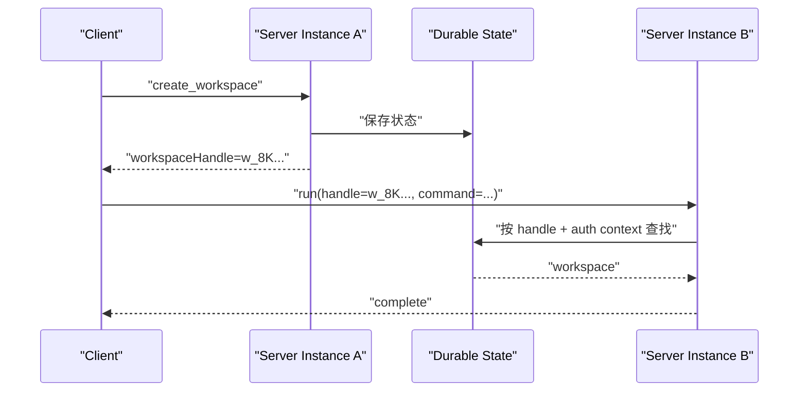

### 14.2 handle 的推荐性质

**【事实】**
Handle 不是新的 protocol method、schema type 或 wire feature；
它只是 Tool 结果和参数里的普通应用数据。

**【非规范设计建议】**
这类 handle 通常最好：

- 显式出现在参数或结果中；
- 对 Client opaque；
- 可在任意实例解析或查找；
- 有清晰 scope；
- 有过期策略；
- 与授权上下文共同校验；
- 不依赖 transport connection identity。

SEP-2567 给出完整动机，
见
[Sessionless via Explicit State Handles](https://modelcontextprotocol.io/seps/2567-sessionless-mcp)。

### 14.3 handle 不是权限

危险写法：

```text
只要知道 workspaceHandle，
就允许访问 workspace。
```

正确写法：

```text
lookup(
  handle,
  authenticated_subject,
  tenant,
  required_scope
)
```

如果 handle 本身是 bearer secret：

- 需要足够熵；
- 不能出现在日志和 URL；
- 需要 TTL；
- 需要可撤销；
- 泄露后风险等同 credential。

### 14.4 connection 不是 conversation

当前规范明确说：

- stdio process 不是 conversation；
- HTTP connection 不是 session；
- Client 可在同一 transport 中交错无关请求；
- Server 不得把 process identity
  当作 conversation continuity。

**【解释】**
Host 可以有十个聊天 thread，
复用同一个 Server process。

Server 需要 thread 状态时，
必须通过显式、经过授权的参数表达。

---

## 15. MCP 2.0 的 MRTR：把 Server 回调改写成可重试结果

MRTR 是 **Multi Round-Trip Requests**。

规范入口：

- [Message Patterns](https://modelcontextprotocol.io/specification/2026-07-28/basic#message-patterns)
- [SEP-2322：MRTR](https://modelcontextprotocol.io/seps/2322-MRTR)

### 15.1 它解决什么

Tool 执行到一半可能需要：

- 用户补充字段；
- 用户选择选项；
- Client 执行 elicitation；
- Client 进行 sampling；
- Client 提供 roots 信息。

MCP 1.0：

```text
Server → Client 发一条独立 request
```

MCP 2.0：

```text
Server ← 返回 input_required
Client 解决输入
Client → 重试原 RPC
```

### 15.2 时序

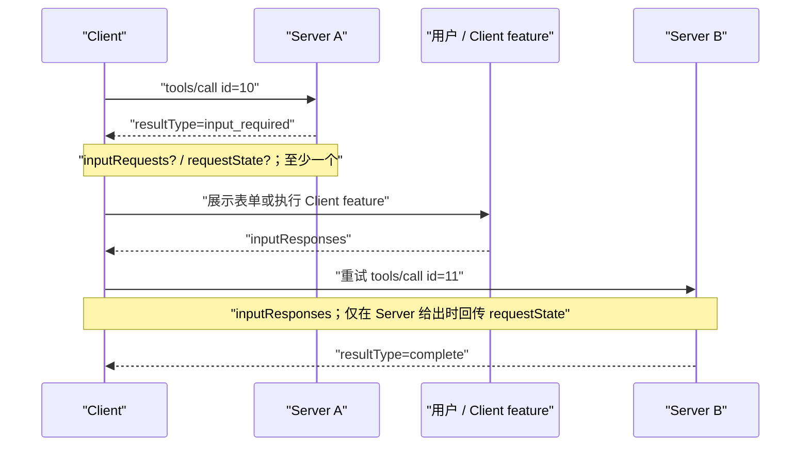

### 15.3 MRTR 的适用范围与关键不变量

`InputRequiredResult` 只允许出现在：

| Client request | Server 可否返回 `input_required` |
|---|---|
| `tools/call` | MAY |
| `resources/read` | MAY |
| `prompts/get` | MAY |
| 其他 Client request | **MUST NOT** |

核心不变量是：

1. `inputRequests` 与 `requestState` 都是 optional，
   但每个 `InputRequiredResult` **MUST** 至少包含其中一个。
2. 若响应含 `inputRequests`，Client 重试前 **MUST** 先构造所需输入；
   若没有，Client **MAY** 立即重试。
3. 若响应含 `requestState`，Client **MUST** 原样回传，
   且 **MUST NOT** 检查、解析、修改或猜测其内容。
4. 若响应不含 `requestState`，Client 重试时 **MUST NOT** 自己添加。
5. MRTR 重试 **MUST** 使用新的 JSON-RPC `id`。
6. `inputRequests`、`inputResponses` 与 `requestState`
   只关联原 request 的这次重试，不能串到其他并行 request。
7. Server **MUST NOT** 请求 Client capability 中未声明支持的 Client feature。
8. 每个 `inputRequests` value **MUST** 是
   `ElicitRequest`、`CreateMessageRequest` 或 `ListRootsRequest`。

不要：

- 解析并修改 `requestState`；
- 把 JSON-RPC `id` 当业务状态 handle；
- 假设重试回到原实例；
- 在没有 capability 时发起对应 input request。

### 15.4 概念化响应

```json
{
  "jsonrpc": "2.0",
  "id": 10,
  "result": {
    "resultType": "input_required",
    "inputRequests": {
      "approval": {
        "method": "elicitation/create",
        "params": {
          "mode": "form",
          "message": "请选择部署环境",
          "requestedSchema": {
            "type": "object",
            "properties": {
              "environment": {
                "type": "string",
                "enum": [
                  "staging",
                  "production"
                ]
              }
            },
            "required": [
              "environment"
            ]
          }
        }
      }
    },
    "requestState": "opaque-state-from-server"
  }
}
```

这里的 `approval` 是 Server 分配的关联 key；
重试时 `inputResponses.approval`
必须放对应的 `ElicitResult`，
并用新的 JSON-RPC `id`、原样带回 `requestState`。

完整重试 request 如下：

```json
{
  "jsonrpc": "2.0",
  "id": 11,
  "method": "tools/call",
  "params": {
    "name": "deploy",
    "arguments": {
      "service": "checkout"
    },
    "inputResponses": {
      "approval": {
        "action": "accept",
        "content": {
          "environment": "staging"
        }
      }
    },
    "requestState": "opaque-state-from-server",
    "_meta": {
      "io.modelcontextprotocol/protocolVersion": "2026-07-28",
      "io.modelcontextprotocol/clientInfo": {
        "name": "example-host",
        "version": "2.4.0"
      },
      "io.modelcontextprotocol/clientCapabilities": {
        "elicitation": {
          "form": {}
        }
      }
    }
  }
}
```

注意 `inputResponses` 与 `requestState`
都在 `params` 顶层，
和 `name`、`arguments` 同级，
不能塞进 `arguments` 或 `_meta`。
本例因为 Server 返回了 `requestState` 才回传；
若上一响应没有它，必须把这一行整个省略。

上述约束见
[MRTR / Supported Requests 与 Basic Workflow](https://modelcontextprotocol.io/specification/2026-07-28/basic/patterns/mrtr#supported-requests)。

### 15.5 MRTR 的代价

它带来：

- 更容易横向扩容；
- 更清晰的重试边界；
- 不需要 Server 主动连回 Client；
- 中间状态显式传递。

也要求开发者处理：

- 幂等性；
- state TTL；
- 重放；
- 用户取消；
- 重试时外部副作用是否已经发生；
- 多轮输入的授权一致性。

**【评价】**
MRTR 消除了协议对持久回调通道的依赖，
没有消除分布式 workflow 的复杂性。

---

## 16. MCP 2.0 transports

当前标准 binding 仍是：

- stdio；
- Streamable HTTP。

见
[Transports](https://modelcontextprotocol.io/specification/2026-07-28/basic/transports)。

### 16.1 MCP 2.0 stdio

当前 stdio 仍然是：

- Client 启动 Server 子进程；
- stdin/stdout 交换 UTF-8 JSON-RPC；
- 每条消息一行；
- Server 可把日志写 stderr；
- stdout 不能混入非协议内容。

见
[stdio Transport](https://modelcontextprotocol.io/specification/2026-07-28/basic/transports/stdio)。

变化在于协议语义：

- Client request 每次自描述；
- Server 不再发独立 JSON-RPC request；
- 需要输入时返回 MRTR；
- 同一 process 可承载无关 conversation。

### 16.2 MCP 2.0 Streamable HTTP

```mermaid
flowchart LR
    C["Client"]
    G["Gateway<br/>读取 method/name headers"]
    S1["Stateless Instance 1"]
    S2["Stateless Instance 2"]
    S3["Stateless Instance 3"]
    C -->|"POST /mcp<br/>request A"| G
    C -->|"POST /mcp<br/>request B"| G
    G --> S1
    G --> S2
    G --> S3
```

每个请求独立 POST 到 MCP endpoint。

响应可以是：

- 单个 JSON；
- 与本请求绑定的 SSE stream。

长期通知使用：

```text
subscriptions/listen
```

见
[Streamable HTTP](https://modelcontextprotocol.io/specification/2026-07-28/basic/transports/streamable-http)。

### 16.3 关键 HTTP headers

MCP 2.0 Streamable HTTP 的 Client 义务包括：

| Header | 强度与适用范围 | 作用 |
|---|---|---|
| `Accept: application/json, text/event-stream` | 每个 JSON-RPC POST **MUST** 同时声明两种响应类型 | Client 必须能接单个 JSON 或请求范围内的 SSE |
| `MCP-Protocol-Version` | 每个 POST **MUST** | 声明协议版本；必须与 body 一致 |
| `Mcp-Method` | 所有 JSON-RPC request **REQUIRED** | 镜像 body 的 `method` |
| `Mcp-Name` | `tools/call`、`resources/read`、`prompts/get` **REQUIRED** | 镜像 `params.name` 或 `params.uri` |
| `Authorization` | 启用授权时 | 携带为该 MCP Server 签发的 Bearer token |

`Origin` 属于另一条 Server 安全义务：
Server **MUST** 验证收到的 Origin，
但规范没有把它列成非浏览器 Client 每次必发的 request metadata header。

`Mcp-Name` 适用于例如：

- `tools/call`
- `resources/read`
- `prompts/get`

Server **MAY** 在 Tool `inputSchema` 的 primitive 属性上声明
`x-mcp-header`；一旦声明，Streamable HTTP Client **MUST**
把对应参数镜像成 `Mcp-Param-{Name}`。
若调用参数的值为 `null`，
Client **MUST** 省略对应 header；
参数路径缺失时同样 **MUST** 省略；
这两种情况下 Server **MUST NOT** 期待该 header。

`x-mcp-header` 本身还有严格的名称、唯一性、
primitive 类型与静态可达性约束。
只要某个 Tool 的任意 `x-mcp-header` 违反约束，
Streamable HTTP Client **MUST** 拒绝该 Tool definition，
并把这个 Tool 从 `tools/list` 结果中剔除；
Client **SHOULD** 记录含 Tool 名和原因的 warning。
其他 transport **MAY** 完全忽略该 annotation。

`Mcp-Name` 或 `Mcp-Param-*` 的值不能安全表示为普通 ASCII 时，
必须使用规范的 `=?base64?…?=` sentinel 编码；
Server 比对 body 前必须先解码。

Server 开发者 **SHOULD NOT**
把 password、API key、token 或 PII 等敏感参数
标为 `x-mcp-header`，
因为中间网络组件通常可以看到 header。

见
[Tools / x-mcp-header](https://modelcontextprotocol.io/specification/2026-07-28/server/tools#x-mcp-header)
与
[Streamable HTTP / Custom Headers](https://modelcontextprotocol.io/specification/2026-07-28/basic/transports/streamable-http#custom-headers-from-tool-parameters)。

Header 与 JSON body 不一致时：

- `HeaderMismatch`
- code `-32020`

若 body 中存在非 `null` 参数值却缺少应有 header，
Server **MUST** 返回 HTTP `400`
和 JSON-RPC `-32020 HeaderMismatch`。

### 16.4 Header 为什么重要

```mermaid
flowchart TD
    Req["POST /mcp"]
    Headers["Mcp-Method: tools/call<br/>Mcp-Name: delete_file"]
    Gateway["Gateway / WAF"]
    Policy["更严格审批 · 限流 · 审计"]
    Body["JSON-RPC body"]
    Req --> Headers --> Gateway --> Policy
    Req --> Body
    Gateway -->|"仍需 Server 校验 header/body 一致"| Body
```

Headers 让基础设施不必深度解析 body
就能初步分类。

但它们不是可信授权声明。

Server 仍必须：

- 解析 body；
- 验证一致性；
- 验证 token；
- 验证 Tool 参数；
- 执行业务权限。

### 16.5 被移除的机制：不只发生在 HTTP

下面这些机制已经从 MCP 2.0 的 `2026-07-28` wire protocol
**removed**，不是“仍可采用、只是官方不推荐”。

生命周期与通用 RPC：

- `initialize` / `notifications/initialized` handshake；
- protocol-level session；
- 双向 `ping` RPC；
- Server 在 transport 上主动发独立 Client request 的旧模式，
  改为 MRTR 的 `input_required` + retry。

JSON-RPC batching 也不在 MCP 2.0 中，
但它早在 `2025-06-18` revision 就已移除，
不是 `2026-07-28` 新发生的变化；见第 4.2 节。

旧日志、Roots 与变更机制：

- `logging/setLevel` 已移除，
  日志级别改由每个 request 的
  `_meta["io.modelcontextprotocol/logLevel"]` 携带；
- 顶层 Server→Client `roots/list` 调用已移除，
  同名 request object 只可嵌在 MRTR `inputRequests` 中；
- `notifications/roots/list_changed` 已移除；
- `resources/subscribe` 与 `resources/unsubscribe` 已移除，
  Tool、Prompt、Resource list 变化和单个 Resource 更新
  统一通过 `subscriptions/listen` opt in。

旧 elicitation 关联机制：

- `notifications/elicitation/complete` 已移除；
- URL mode 的 `elicitationId` 已移除；
- 跨 MRTR retry 的关联由 Server 编码进 `requestState`，
  而不是再由 Server 主动发送完成通知。

HTTP 状态与恢复机制：

- `Mcp-Session-Id`；
- HTTP `DELETE` session termination；
- standalone HTTP GET SSE endpoint；
- SSE event ID、`Last-Event-ID`、stream resumability 和消息重投；
- 基于 session 的 sticky route / message route。

**deprecated** 与 **removed** 不同：

- 上述具体机制已从 MCP 2.0 移除；
- Roots、Sampling、Logging 这些 feature 则仍在规范中，
  只是 deprecated；
- MCP 1.0 Server 仍可能合法使用旧 wire mechanism，
  所以双栈 Client 仍可能需要 fallback；
- 旧 HTTP+SSE transport 是 deprecated，
  不能和 MCP 2.0 已删除的 standalone GET 行为混为一谈。

逐项变更见
[2026-07-28 Changelog](https://modelcontextprotocol.io/specification/2026-07-28/changelog)。

### 16.6 订阅不是 session

`subscriptions/listen.params.notifications`
是 required object；
它内部的四个 filter 都是 optional，
Client 用它们显式选择自己要接收的变化：

| filter | opt-in 的通知 |
|---|---|
| `toolsListChanged: true` | `notifications/tools/list_changed` |
| `promptsListChanged: true` | `notifications/prompts/list_changed` |
| `resourcesListChanged: true` | `notifications/resources/list_changed` |
| `resourceSubscriptions: string[]` | 数组中指定 URI 的 `notifications/resources/updated` |

每项都可省略；省略或未选择就是未订阅。
Server **MUST NOT** 推送 Client 没有显式请求的通知类型，
也不能对 `resourceSubscriptions` 之外的 URI
发送 `notifications/resources/updated`。

```mermaid
sequenceDiagram
    participant C as "Client"
    participant S as "Server"
    C->>S: "subscriptions/listen(filters)"
    Note over C,S: "这是一个长时间未完成的 request"
    S-->>C: "notifications/subscriptions/acknowledged"
    Note over C,S: "必须是该 subscription 的第一条消息"
    S-->>C: "notification + subscriptionId"
    S-->>C: "notification + subscriptionId"
    alt "HTTP"
        C-xS: "关闭 response stream"
    else "stdio"
        C-->>S: "notifications/cancelled(request id)"
    end
```

长请求仍是请求/响应模式。

状态范围属于这个 request，
而不是底层 connection。

Server 发出的订阅通知必须携带：

```text
_meta["io.modelcontextprotocol/subscriptionId"]
```

以便 Client 关联来源；
首条消息必须是
`notifications/subscriptions/acknowledged`，
并携带同一 subscription ID；
在 ack 之前 Server **MUST NOT** 推送订阅通知。
Acknowledgement 返回 Server 实际接受的 filter 子集，
Client 不能假定 Server 接受了全部请求项。

Request-scoped 的 `notifications/progress`
和 `notifications/message`
仍只走原 request 的 response stream，
不走 `subscriptions/listen`。
取消方式依 transport 而异：
HTTP 关闭 SSE response stream；
stdio 发送引用 `subscriptions/listen` request ID 的
`notifications/cancelled`。

Server 主动结束订阅时，
**SHOULD** 在关闭 stream 前
向原 `subscriptions/listen` request
返回一个 empty complete response：

```json
{
  "jsonrpc": "2.0",
  "id": 1,
  "result": {
    "resultType": "complete",
    "_meta": {
      "io.modelcontextprotocol/subscriptionId": 1
    }
  }
}
```

Client 收到它，
就知道 Server graceful closure 已完成。
如果不是 Client 主动取消，
transport 关闭却没有这条 final response，
则表示 unexpected disconnect；
Client **MAY** 把它当作 reconnect 的触发条件，
不能误记为一次正常完成。

stdio connection 终止后若重新建立，
Client **MUST** 重新发送 `subscriptions/listen`
来恢复每项订阅；
Server 不跨 connection 保留 subscription state。

见
[Subscriptions](https://modelcontextprotocol.io/specification/2026-07-28/basic/patterns/subscriptions)
和
[Base Protocol / `_meta`](https://modelcontextprotocol.io/specification/2026-07-28/basic#_meta)。

---

## 17. MCP 2.0 的缓存、Extension 与 Client features

### 17.1 Cacheable result 的硬性义务

缓存不是泛泛建议。
Server 对以下操作的 `resultType: "complete"` 结果
**MUST** 携带 `ttlMs` 与 `cacheScope`：

```text
server/discover · tools/list · prompts/list
resources/list · resources/templates/list · resources/read
```

`ttlMs` **MUST >= 0**。
`private` 缓存 **MUST NOT**
跨 authorization context 共享。

`input_required` 中间结果不可缓存；
带 `inputResponses` 或 `requestState` 的 MRTR retry 结果
也 **MUST NOT** 缓存，
因为这些输入不在普通 cache key 内。

详见当前
[Caching](https://modelcontextprotocol.io/specification/2026-07-28/server/utilities/caching)。

### 17.2 新鲜度、失效与授权

TTL 是 freshness hint，
不是数据永不变化的保证，
也不是后台轮询周期。

通知会立即使相关 cache stale。
Tool 列表另应保持确定性顺序，
以利稳定缓存和模型 prompt cache。

缓存不等于授权：
执行调用时仍须重新鉴权。
变更流使用 `subscriptions/listen`，
不再把可变 catalog 藏在 session 内；
完整变化见
[Changelog](https://modelcontextprotocol.io/specification/2026-07-28/changelog)。

### 17.3 Extension：必须由双方 opt in

正式 extension 通过 capabilities opt-in，
可以独立于 core protocol 演进。

一方不支持时，支持方必须选择：

- 回退 core behavior；
- 或明确拒绝。

Extension 自身应说明预期 fallback，
不能把 extension 冒充 core。

当前代表：

- [MCP Apps](https://modelcontextprotocol.io/extensions/apps/overview)：Tool 可关联 `ui://` 资源，在 Host 的 sandboxed iframe 中展示；支持情况由 Host 决定。
- [Tasks](https://modelcontextprotocol.io/extensions/tasks/overview)：长任务可返回 `resultType: "task"` 与 durable `taskId`，Client 用 `tasks/get`、`tasks/update`、`tasks/cancel`；状态包括 `working`、`input_required`、`completed`、`failed`、`cancelled`。取消是 cooperative：`tasks/cancel` 只确认取消意图，Server 不保证停下，Task 仍可能 `completed` 或 `failed`。它是官方 extension，不是所有实现都必须支持；最终设计见 [SEP-2663](https://modelcontextprotocol.io/seps/2663-tasks-extension)。

### 17.4 Tasks 是 extension，不是 core 自动能力

```mermaid
stateDiagram-v2
    [*] --> working
    working --> input_required
    input_required --> working: "tasks/update"
    working --> completed
    working --> failed
    working --> cancelled: "tasks/cancel（若被采纳）"
    input_required --> cancelled: "tasks/cancel（若被采纳）"
```

迁移时不能把 `2025-11-25` experimental Tasks wire
当成当前 extension 的兼容子集：

- 旧的 blocking `tasks/result`
  被 polling `tasks/get` 与新的 `tasks/update` 替代；
- 旧 `tasks/list` 已 removed；
- 当前 Tasks 是必须通过 capability opt in 的官方 extension，
  不是 MCP 2.0 core 的默认能力。

Tasks 的状态机可以持久化长作业，
但协议只定义交互合同；
worker、保留期和实际取消语义仍由实现负责。

### 17.5 Feature deprecated 与旧 RPC removed 必须分开

Client feature 状态如下：

| Feature | `2026-07-28` 状态 | 新实现应怎样做 |
|---|---|---|
| Elicitation | 当前 core feature | 在 MRTR 中向用户补问；form 不得索取密码、token、API key、支付凭据，敏感流程用 URL mode；旧 `notifications/elicitation/complete` 和 `elicitationId` 已 removed；见 [Elicitation](https://modelcontextprotocol.io/specification/2026-07-28/client/elicitation) |
| Sampling | **deprecated，尚未 removed** | 兼容实现仍可通过 MRTR 支持；新 Server 优先直接接模型 API；见 [Sampling](https://modelcontextprotocol.io/specification/2026-07-28/client/sampling) |
| Roots | **deprecated，尚未 removed** | `roots/list` 仍可在 MRTR 内使用；旧 `notifications/roots/list_changed` 已 removed；Roots 从来不是文件权限边界；见 [Roots](https://modelcontextprotocol.io/specification/2026-07-28/client/roots) |
| Logging | **deprecated，尚未 removed** | `notifications/message` 仍可按 request 的 `logLevel` 使用；旧 `logging/setLevel` 已 removed；新实现优先 stderr 或 OpenTelemetry；见 [Logging](https://modelcontextprotocol.io/specification/2026-07-28/server/utilities/logging) |

换句话说：

- Roots feature 是 deprecated，
  但具体 RPC `notifications/roots/list_changed` 已 removed；
- Logging feature 是 deprecated，
  但具体 RPC `logging/setLevel` 已 removed；
- `notifications/message` 没有被移除，
  只是改成由每个 request 的 deprecated `logLevel` 控制。

官方
[弃用登记](https://modelcontextprotocol.io/specification/2026-07-28/deprecated)
规定 Roots、Sampling、Logging、DCR
最早只能在 `2027-07-28` 当日或之后的修订移除。

教程不能把 deprecated 写成“已不能用”，
也不能把 MCP 2.0 已移除的机制写成“只是建议不用”。

---

## 18. MCP 2.0 的 HTTP Authorization 与安全责任

### 18.1 适用范围与 OAuth 角色

HTTP authorization 是 optional capability。
启用时：

- MCP Server 是 OAuth protected resource；
- MCP Client 是 OAuth client；
- Authorization Server 是独立角色。

stdio **SHOULD NOT** 套用这套 HTTP OAuth 流程，
通常从环境取得凭据。

规范见
[Authorization](https://modelcontextprotocol.io/specification/2026-07-28/basic/authorization)。

### 18.2 Authorization Code 主路径

```mermaid
sequenceDiagram
    participant C as "MCP Client"
    participant R as "MCP Resource Server"
    participant P as "Protected Resource Metadata"
    participant A as "Authorization Server"
    C->>R: "POST /mcp without token"
    R-->>C: "401 + WWW-Authenticate resource_metadata=URL"
    C->>P: "GET resource_metadata URL"
    P-->>C: "authorization_servers"
    C->>A: "发现 AS metadata / 注册 client"
    C->>A: "Authorization Code + PKCE + resource"
    A-->>C: "code + 可选 iss"
    C->>C: "按 AS 宣告与响应 presence 规则校验 iss"
    C->>A: "code + verifier + resource"
    A-->>C: "audience-bound access token"
    C->>R: "Authorization: Bearer …"
    R->>R: "校验 issuer · audience · scope"
    R-->>C: "MCP response"
```

### 18.3 最低安全清单

最低安全清单：

- Authorization Code + PKCE S256；跳转前记录经验证的 expected issuer。若响应带 `iss`，Client **MUST** 与 expected issuer 做精确比较；若 AS 宣告支持 response `iss` 却漏发，Client **MUST** 拒绝。若既未宣告也未返回，最低规范允许继续；要求所有 AS 都必须返回 `iss` 属于更严格的本地策略。
- 授权和 token 请求携带 `resource`；Server 校验 audience。
- Bearer token 只放 `Authorization` header，不放 query。
- 禁止 token passthrough：Server 只接受为自己签发的 token。
- Client registration 绑定 issuer；优先预注册或 Client ID Metadata Document；DCR 已 deprecated。
- HTTP Server 必须验证 `Origin` 防 DNS rebinding；本地服务默认绑定 loopback。
- `clientInfo`/`serverInfo` 是自报展示信息，禁止当身份。
- Tool 描述、annotations、Prompt、Resource 内容均视为不可信输入。
- 外部 JSON Schema `$ref` 默认禁止联网解析；限制 schema 深度、子 schema 数或验证时间，防 SSRF/DoS；见 [JSON Schema Usage](https://modelcontextprotocol.io/specification/2026-07-28/basic#json-schema-usage)。
- 每次按认证主体、tenant、scope 校验显式 handle；handle 不是授权。
- Host 对副作用 Tool 保留可见性、确认、拒绝和审计；Server 间最小权限隔离。

更完整的 OAuth 威胁说明见
[Authorization Security Considerations](https://modelcontextprotocol.io/specification/2026-07-28/basic/authorization/security-considerations)。

---

## 19. 从 MCP 1.0 迁移到 MCP 2.0：不要在一条连接里猜版本

### 19.1 先识别 protocol era，再选择共同 revision

```mermaid
flowchart TD
    Start["Client 要连接 Server"]
    T{"Transport?"}
    Start --> T
    T -->|"stdio"| D["先发 server/discover probe"]
    D -->|"DiscoverResult / recognized MCP 2.0 error"| M["留在 MCP 2.0；必要时换共同版本重试"]
    D -->|"非 MCP 2.0 error 或 timeout"| L["回退 MCP 1.0 initialize；同 process 也可双栈"]
    T -->|"HTTP"| H["带 MCP 2.0 headers 发第一个请求"]
    H -->|"2xx / recognized MCP 2.0 JSON-RPC error"| M
    H -->|"4xx 且无 recognized MCP 2.0 error body"| L
```

### 19.2 迁移顺序

迁移顺序：

1. 先冻结当前 MCP 1.0 行为和 conformance tests。
2. Server 实现 `server/discover`，同时保留 MCP 1.0 `initialize` 处理路径；双栈可共用 endpoint/process。
3. 让核心 handler 不再读取 initialize/session 隐式状态。
4. 为每个 request 校验版本与 Client capabilities。
5. 跨请求业务状态改成显式 identifier；若采用 handle 设计模式，补授权、TTL、幂等和重放测试。
6. Server→Client request 改成 MRTR；长任务评估 Tasks extension。
7. HTTP 移除 `Mcp-Session-Id` 依赖、standalone GET SSE 与 event resume；通知改 `subscriptions/listen`。
8. 增加 `Accept`、`MCP-Protocol-Version`、`Mcp-Method`/`Mcp-Name` 等 required headers，并验证 header/body 一致。
9. 增加 cache hints 与确定性 list 顺序。
10. 观测双栈流量，再按官方 deprecation policy 退役 MCP 1.0。

### 19.3 兼容性与 wire 验证

兼容性要点：

- MCP 2.0 Server 必须有 `server/discover`；MCP 2.0 Client 不必须预调用。
- stdio 双栈 Client **SHOULD** 先 discovery；
  只有错误无法识别为 MCP 2.0 response，
  或发生 timeout，才 fallback。
- HTTP 只有 `4xx` 且 JSON-RPC error body
  无法识别为 MCP 2.0 时才 fallback。
- `UnsupportedProtocolVersionError`
  证明对端支持官方 Modern era；
  应选择共同日期 revision 后重试，不能回退 MCP 1.0。
- 双栈 Server 可以在同一 process / endpoint
  依据 opening shape 选择 era。
- 精确探测规则见
  [Discovery / When to Call](https://modelcontextprotocol.io/specification/2026-07-28/server/discover#when-to-call)。
- MCP 2.0 Client 收到 MCP 1.0 响应缺少 `resultType` 时按 `complete`。
- MCP 1.0 的 `resource not found` code `-32002` 仍应被兼容 Client 接受；MCP 2.0 改用 `-32602`。
- MCP 1.0 的实验性 Tasks wire shape 与当前 extension 不兼容，必须显式迁移。
- “SDK 能编译”不证明协议兼容；抓取实际 wire message 验证版本、metadata、headers、error 和 retry。

---

## 20. MCP 不解决的边界

### 20.1 协议不会自动提供这些保证

MCP 不自动保证：

- Tool 是安全或正确的；
- 模型会选对 Tool；
- 用户真的理解了批准内容；
- OAuth token scope 足够细；
- Tool call 具有幂等性；
- 后端 API 不会 429；
- 多步事务具有原子性；
- Resource 内容没有 prompt injection；
- Server 保存的业务状态不会丢；
- Host UI 会支持全部 extension；
- sandbox、数据驻留、审计与合规已经完成；
- 同名 Tool 在不同 Server 上语义一致。

### 20.2 责任只是被标出，没有消失

**【评价】**
MCP 标准化“接口和责任落点”，
不是把责任消灭。

越接近真实副作用，
越要依赖 Host policy、Server authorization
和后端事务共同防护。

---

## 21. MCP 1.0 问题 → 证据 → MCP 2.0 变化 → 剩余责任

### 21.1 可审计总表

| 问题 | 官方证据 | MCP 2.0 变化 | 仍由谁负责 |
|---|---|---|---|
| session 阻碍扩容 | [SEP-2575](https://modelcontextprotocol.io/seps/2575-stateless-mcp) | 移除 initialize/session；每请求自描述 | Server 设计 durable state；平台部署 |
| session scope 含糊 | [SEP-2567](https://modelcontextprotocol.io/seps/2567-sessionless-mcp) | 移除 session；跨请求状态显式引用，handle 只是普通 Tool 数据的设计模式 | 应用定义 scope、TTL、auth binding |
| callback 依赖双向流 | [SEP-2322](https://modelcontextprotocol.io/seps/2322-MRTR) | `input_required` + retry | 幂等、取消、重放、副作用边界 |
| 版本/能力藏在握手 | [Versioning](https://modelcontextprotocol.io/specification/2026-07-28/basic/versioning) | per-request `_meta` + optional discovery | Client 选择兼容版本 |
| 网关看不懂 POST | [Streamable HTTP](https://modelcontextprotocol.io/specification/2026-07-28/basic/transports/streamable-http) | method/name headers | 网关策略；Server 一致性校验 |
| catalog 难缓存 | [Changelog](https://modelcontextprotocol.io/specification/2026-07-28/changelog) | TTL、scope、稳定顺序、listen | 权限变化与失效策略 |
| 长任务阻塞 | [Tasks](https://modelcontextprotocol.io/extensions/tasks/overview) | opt-in Tasks extension | durable worker、进度、保留期 |
| OAuth mix-up/token 误投 | [Authorization](https://modelcontextprotocol.io/specification/2026-07-28/basic/authorization) | `iss`、PKCE、resource audience | AS 配置、token storage、scope |
| Tool 可造成副作用 | [Tools](https://modelcontextprotocol.io/specification/2026-07-28/server/tools) | schema、结果与安全指导 | Host consent；Server authorization |
| schema 可触发 SSRF/DoS | [Base Protocol](https://modelcontextprotocol.io/specification/2026-07-28/basic#json-schema-usage) | 禁止默认远程 `$ref`、要求资源边界 | validator 配额、allowlist、监控 |

### 21.2 这张表怎样使用

不要只读“变化”一列。
每次设计或 review 都依次问：

1. 旧问题是否有官方证据；
2. MCP 2.0 改的是 wire、feature 还是部署建议；
3. 改动是否真的覆盖该问题；
4. 未覆盖的责任最终落在 Host、Client、Server 还是后端。

---

## 22. 来源分级、漂移与一致性

### 22.1 来源优先级

来源优先级：

1. 冻结 commit 的 TypeScript schema：wire shape 的 source of truth。
2. 带日期的 `2026-07-28` / `2025-11-25` normative spec。
3. Final SEP、官方 changelog、deprecated registry。
4. 官方发布博客与 SDK 文档：解释动机和实现，但不覆盖 schema。
5. 社区教程：只作延伸阅读，绝不反推当前规范。

### 22.2 冲突处理与全局一致性

一致性规则：

- 网页与 schema 冲突：以冻结 schema 为准并记录 doc drift。
- 不带日期 Learn 页面与日期规范冲突：以日期规范为准。
- 发布博客的简化 JSON 漏字段：以 normative spec 为准。
- SDK README 与 wire 抓包冲突：分别记录 SDK 文档行为和实际行为。
- 同一修正必须同步更新正文、表格、Mermaid、迁移步骤和结论。
- 所有 “MUST / SHOULD / MAY” 在改写前复核原文强度。
- 所有 “deprecated / removed / optional extension” 分开检索，禁止互换。

### 22.3 非规范延伸阅读

以下资料只帮助换一个角度理解，**不进入事实证据链**：

- Microsoft 的 [MCP for Beginners：2026-07-28 Release Candidate](https://github.com/microsoft/mcp-for-beginners/blob/main/01-CoreConcepts/mcp-2026-07-28-release-candidate.md)：图解清楚，但标题和正文明确基于 RC，仓库 `main` 还会漂移；其简化请求示例不能替代 final schema。
- [mcp-from-scratch](https://github.com/pguso/mcp-from-scratch)：零依赖手写 JSON-RPC/stdio，适合理解 MCP 1.0 内部；README 明确针对 `2025-11-25`，生命周期和 sampling 不能照搬到 MCP 2.0。
- Postman，2026-07-29，[MCP goes stateless — and Postman's ready](https://blog.postman.com/mcp-goes-stateless-and-postmans-ready/)：适合理解双栈测试与 Inspector 工作流；产品自动探测行为不是 MCP Client 的普遍规范义务。
- MCP Migration Studio，2026-06-09，[2026-07-28 migration guide](https://mcpmigrate.dev/blog/mcp-spec-2026-07-28-migration-guide)：迁移排查清单实用，但文章基于 RC；其中 `_meta` 示例使用未加命名空间的键且漏掉必需 `clientCapabilities`，不能复制到 final 实现。
- [OWASP MCP Security Cheat Sheet](https://cheatsheetseries.owasp.org/cheatsheets/MCP_Security_Cheat_Sheet.html)：威胁分类实用；session-ID 等机械细节可能仍指向 MCP 1.0，最终以日期规范为准。
- Microsoft Azure Architecture Blog 的 [API vs MCP decision matrix](https://techcommunity.microsoft.com/blog/azurearchitectureblog/decision-matrix-api-vs-mcp-tools-%E2%80%94-the-great-integration-showdown-%F0%9F%A5%8A/4499385)：适合作为“MCP 不取代 API”的工程反方视角，不是协议证据。

阅读任何 “MCP 2.0 tutorial” 或 SDK v2 guide 时，先确认其目标 revision，再检查它是否把 JSON-RPC 2.0、SDK v2、MCP 1.0 Tasks 或 `initialize` 误当当前协议。

---

## 23. MCP 2.0 最终心智模型

### 23.1 一张分层图

```mermaid
flowchart TB
    U["用户意图与批准"]
    H["Host<br/>对话 · 模型 · 策略 · 隔离"]
    C["每 Server 一个 MCP Client"]
    P["MCP 2.0<br/>wire revision 2026-07-28<br/>无状态 JSON-RPC 应用协议"]
    T["stdio / Streamable HTTP"]
    S["MCP Server<br/>Prompt · Resource · Tool"]
    B["后端 API / DB / Files"]
    U --> H --> C --> P --> T --> S --> B
    S -. "input_required" .-> C
    C -. "MRTR 新 id 重试" .-> S
```

### 23.2 四句话带走

记住四句话：

1. 本文统一把官方 Legacy era 教学称为 MCP 1.0，把 Modern era 教学称为 MCP 2.0。
2. JSON-RPC 2.0 是信封，MCP `2026-07-28` 才是协议修订。
3. MCP 2.0 的核心不是“功能更多”，而是每请求自描述、显式状态和可重试交互。
4. 协议建立共同边界；授权、隔离、幂等、事务和用户控制仍需实现者完成。

---

<script type="module" src="../assets/js/util/mermaid-render.js"></script>
