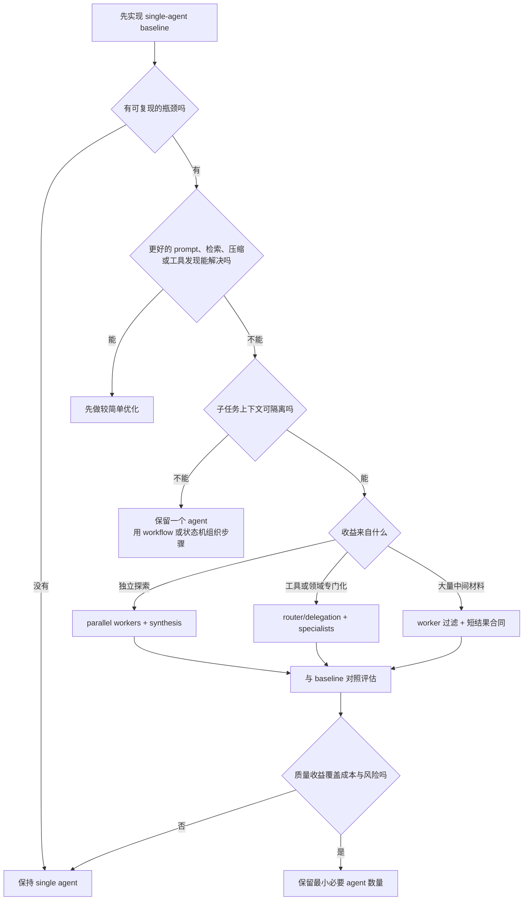
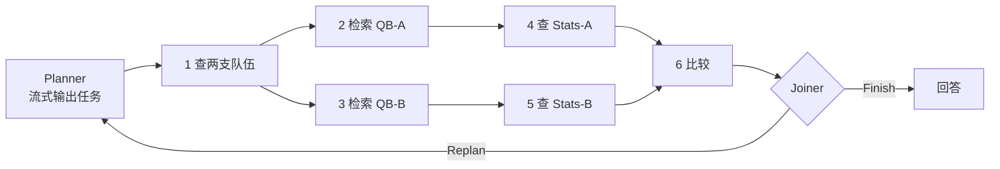
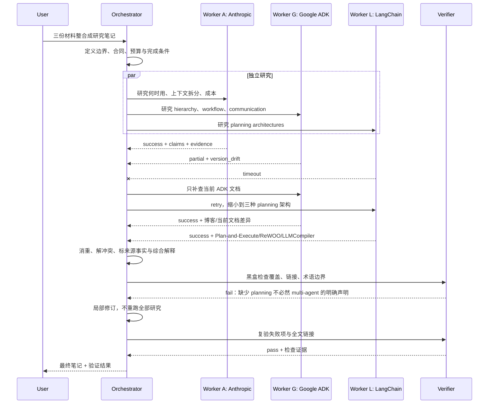
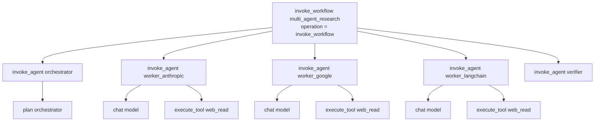

# Multi-Agent Systems：何时拆分、如何协作、怎样评测

> 研究与链接校验日期：**2026-08-23**<br>
> 核心范围：Anthropic 的 multi-agent 决策框架、Google ADK 的协作模型、LangChain 的 planning agents。<br>
> 阅读约定：**【来源事实】** 表示来源直接支持；**【综合解释】** 表示把多个来源放进同一模型后的推导；**【实践建议】** 表示可执行但仍需用自己的任务验证。<br>
> 版本提醒：ADK 与 LangChain/LangGraph 都在快速演进。本文讲稳定的架构思想；涉及类名、API 和推荐路径时，须以当前官方文档为准。<br>
> 建议读法：先走一遍配套的 [十步视觉学习路径](learn/)，再把本文当作 schema、失败轨迹、评估矩阵与来源边界的详细参考。

---

## 学习目标

读完后，你应该能：

1. 用可验证的理由判断一个任务该保持 single-agent，还是值得拆成 multi-agent；
2. 按**上下文边界、数据依赖和副作用**拆任务，而不是机械地按“规划、开发、测试、评审”分角色；
3. 区分 hierarchy、sequence、parallel、loop、delegation、shared state 和显式 agent invocation；
4. 解释 planning architecture 与 multi-agent 为什么是两个正交维度；
5. 写出最小任务合同，处理超时、缺证据、冲突和有限重规划；
6. 用 single-agent baseline 证明多智能体的质量收益是否值得额外 token、成本、延迟和维护复杂度。

### 建议学习路线

| 阶段 | 先做什么 | 为什么 |
|---|---|---|
| 1. 建基线 | 一个 agent + 必需工具，保存完整 trace | 没有基线，就不知道多 agent 解决了什么 |
| 2. 学固定控制流 | 手写 sequence、parallel、loop | 先理解依赖、并发和停止条件，不急着让模型调度一切 |
| 3. 学动态委派 | 加一个 orchestrator/router 和 2–3 个 specialist | 观察路由错误与 handoff 损失 |
| 4. 学 planning | 把任务表示成 step list、变量依赖或 DAG | 区分“如何规划工作”和“谁执行工作” |
| 5. 学恢复与评测 | 注入超时、空结果、冲突，比较 baseline | 能恢复且净收益为正，架构才算成立 |

---

## 0. 先看一个常见的调试现场

你在看一条客服 agent 的 trace。用户只想知道退货进度，主 agent 却先后拿到了完整订单历史、账单规则和物流记录。最后的回答只用到订单号、当前状态和下一步处理时间。与此同时，另一个发票查询与退货进度没有数据依赖，本来可以单独处理。

这时，拆分才有具体理由。订单 worker 留住冗长历史，只回传几个经过核对的字段，主上下文因此没有被中间材料淹没。发票 worker 只加载账单工具与相关规则，负责另一组事实核对。两条查询没有数据依赖，所以适合并发；并发首先增加覆盖面，在条件合适时也会缩短墙钟时间。

如果每个 worker 仍收到整段对话，完成后再把大段结果互相转述，系统只是多了模型调用和交接点。路由、共享状态与结果合并也会带来新的失败路径。

【来源事实】Anthropic 建议先找出 single-agent 的可复现瓶颈，再决定是否使用 multi-agent；其团队报告，在自己的场景中，多智能体通常消耗单智能体 **3–10 倍 token**。这是供应商经验，不是跨模型、跨任务的定律。[Anthropic 原文][A]

真正要检查的是上下文边界。规划、实现和测试若持续依赖同一批决策细节，交给不同 agent 往往会增加转述损失。两个独立研究方向只需回传统一格式的证据，拆分就合理得多。

---

## 1. 先统一概念：什么是 multi-agent

### 1.1 先看运行时边界，不看类名

代码里出现 `PlannerAgent`、`ResearchAgent` 和 `SummaryAgent`，还不能说明系统里有三个 agent。先看运行时：它们是否有各自可见的上下文和状态，能否使用不同工具或权限，是否分别运行自己的执行循环并决定何时停止。如果所谓 `SummaryAgent` 只是一次固定的模型调用，它更适合被记作 workflow node。

本文采用下面这个 provider-neutral 的工作定义：

> `agent = 模型或确定性策略 + 指令 + 可见上下文/状态 + 工具/权限 + 执行循环 + 停止条件`

一次 LLM 调用、一个普通函数或一个带 `Agent` 后缀的类名，都不会自动算作独立 agent。

> `multi-agent system = 多个拥有可区分上下文、职责或控制权的运行单元，通过代码或消息协调，共同完成一个上层目标`

Anthropic 的工程定义强调多个 LLM 实例在独立对话上下文中运行并由代码协调，与这里的判断方式一致。[Anthropic 原文][A] 本文的定义稍宽，允许 worker 使用确定性策略；是否算 agent，仍取决于运行时边界，而不是节点名称。

### 1.2 经典 MAS 与现代 LLM agent team 不要混为一谈

【来源事实】Google Cloud 的 ADK 文章用三点介绍 MAS：**decentralized control、local views、emergent behavior**。[Google ADK 原文][G]

【综合解释】这更接近经典 MAS 的一种理想类型；同一篇文章后面的 ADK 示例又大量采用 root/parent/sub-agent 层级。现代 LLM multi-agent 可以中心化、层级化，也可以去中心化。因此：

- “没有唯一 boss”不是所有 multi-agent 的硬条件；
- 多个 agent 并不会自动产生有益的 emergent behavior；
- 判断系统是否 multi-agent，应先看执行单元和上下文/控制边界，而不是看类名。

### 1.3 六个核心坐标

面对任何 multi-agent 框架，先忽略品牌名，用下面六个问题定位：

| 坐标 | 要回答的问题 | 常见选择 |
|---|---|---|
| 1. Decomposition | 谁把目标拆成可执行任务？ | 人工静态拆分、router、planner、orchestrator |
| 2. Assignment | 任务交给谁，凭什么？ | 固定绑定、规则路由、LLM delegation、竞标/协商 |
| 3. Execution | 子任务按什么顺序运行？ | sequential、parallel、loop、dependency DAG |
| 4. Communication & State | agent 看到什么，怎样传值？ | 消息传递、shared state、artifact reference、event log |
| 5. Synthesis | 谁消重、解冲突、补缺口？ | orchestrator、solver、joiner、独立 verifier |
| 6. Evaluation | 怎样知道整体和每一跳正确？ | outcome grader、trajectory 检查、成本/延迟、人工复核 |

这六个坐标的价值在于：同一个“orchestrator-worker”系统可以采用静态或动态分解、顺序或并行执行、消息或共享状态；只说拓扑名称还不足以描述系统。

---

## 2. 什么时候用，什么时候不用

### 2.1 三类真实收益

#### 上下文保护

适合“读取很多、主任务只需一点”的子任务，例如从长订单记录中提取当前状态，或从多篇资料中提取与一个子问题有关的证据。

【来源事实】Anthropic 给出的实践信号是：子任务会产生约 1000 tokens 以上材料，而多数不再影响主任务后续推理；数字只是经验性信号，不是阈值。[Anthropic 原文][A]

**为什么有效**：worker 可以在自己的 context 中检索、试错、过滤，主 agent 只接收短结论、证据和未决问题，从而降低主上下文污染。

#### 并行探索

适合互不依赖的研究方向、多个独立 API 查询或候选方案生成。

**为什么有效**：独立轨迹扩大搜索空间，降低所有推理都困在同一路径上的风险。并发可以缩短相对串行执行的墙钟时间，但不会减少总计算量。

#### 专业化

适合工具跨多个无关领域，或不同任务需要相互冲突的指令、权限与领域上下文。

【来源事实】Anthropic 把约 15–20+ 个工具视为“单 agent 可能承压”的实践信号，同时明确建议先尝试按需工具发现；它不是硬上限。[Anthropic 原文][A]

**为什么有效**：缩小候选工具与权限范围，可以降低误选工具、参数混淆和越权面。

### 2.2 最关键的拆分测试：上下文是否真能隔离

好的边界：

- 亚洲市场与欧洲市场分别研究，最后按统一字段合并；
- 两个拥有清晰接口的独立组件；
- 黑盒 verifier 只读取产物、验收标准和测试工具；
- 多个只读数据源的独立查询。

坏的边界：

- 把同一功能的规划、编码、测试、评审顺次交给四个 agent；
- 两个 agent 必须频繁确认同一个不断变化的状态；
- 多个 agent 同时写同一文件、记录或外部资源，却没有事务/锁；
- specialist 的领域边界本身无法可靠判断。

一个简单判断法：

> 如果 worker 为了继续工作，必须不断问另一个 worker“你刚才为什么这么做”，边界通常拆错了。

### 2.3 决策树



### 2.4 明确不该用的情况

- 任务简单、低价值、一次或少数工具调用即可完成；
- 步骤稳定且可由普通代码可靠完成；
- 子任务强耦合，持续共享同一决策历史；
- 系统没有 trace、预算、超时和明确验收条件；
- 多 agent 只是为了模仿真实公司的职位；
- 写操作无法隔离或回滚，失败的现实代价很高；
- 还没有强 single-agent baseline，却已经在比较 agent 数量。

---

## 3. 常见协作拓扑，以及 ADK 如何表达它们

### 3.1 先区分拓扑、控制流和通信

- **拓扑**：谁可以指挥或调用谁；
- **控制流**：谁先运行、谁可并行、何时循环；
- **通信**：输入输出通过消息、共享状态还是 artifact 传递。

三者可以自由组合。层级结构不等于顺序执行；共享状态也不等于所有 agent 都应看到完整历史。

### 3.2 常见拓扑速查

| 模式 | 形状 | 适合 | 主要风险 |
|---|---|---|---|
| Orchestrator–Workers | 一个协调者动态拆分、派发、汇总 | 子任务形状随输入变化的研究或分析 | 中心路由错误、协调者瓶颈 |
| Router–Specialists | 分类后交给一个或少数专家 | 类别清晰、工具/权限差异明显 | 误路由、边界模糊 |
| Sequential Pipeline | A → B → C | 明确的数据加工依赖 | 延迟相加、错误级联 |
| Parallel Fan-out/Fan-in | A/B/C 并发后汇合 | 独立读任务、覆盖面探索 | 重复工作、结果冲突、共享状态 race |
| Generator–Verifier | 产出后做黑盒检查 | 测试、schema、引用、合规 | verifier 过早宣布成功 |
| Loop / Critique | 生成—检查—修订 | 有客观收敛条件的迭代 | 无限循环、质量不升但成本持续增长 |
| Peer / Swarm | 节点间自由转交或协商 | 局部信息、探索性强的实验 | 难调试、死循环、责任不清 |

【实践建议】初学者先学 orchestrator–workers 与 generator–verifier。它们的所有权、输入输出和停止条件更容易显式化。

### 3.3 Google ADK 原文中的 hierarchy

【来源事实】Google ADK 文章描述 parent/sub-agent hierarchy：一个 parent 可以管理多个 sub-agents，而一个 agent 只有一个 parent。[Google ADK 原文][G]

这个 single-parent rule 是 **ADK 的层级建模规则**，不是通用 MAS 标准。它让委派和所有权清楚，但层级过深会增加 handoff 损失、延迟和根节点压力。

ADK 原文还区分三类 agent：

| ADK 术语 | 作用 | 边界 |
|---|---|---|
| `LLM Agent` | 用模型理解、推理并选择动作 | 不是说所有 agent 都必须由 LLM 驱动 |
| `Workflow Agent` | 用预定义控制流管理 sub-agents | 更接近确定性 manager/workflow |
| `Custom Agent` | 用 `BaseAgent` 扩展框架逻辑 | 是 ADK 扩展点，不是通用 specialist 定义 |

### 3.4 Sequential、Parallel、Loop

| ADK 原文模式 | 语义 | 适用条件 | 必须补上的护栏 |
|---|---|---|---|
| `SequentialAgent` | sub-agents 依次执行 | B 确实依赖 A 的结果 | 上游校验、失败短路、checkpoint |
| `ParallelAgent` | 独立 sub-agents 并发 | 无数据依赖，且副作用不冲突 | 有界并发、超时、冲突合并、race 检查 |
| `LoopAgent` | 重复执行 sub-agents | 有可观测的改进目标 | `max_iterations`、预算、明确退出信号 |

【来源事实】当前 ADK 文档强调 template workflow 的整体控制流是确定性的；parallel 分支结果顺序可能不确定，loop 也不会凭空知道何时停止。[ADK workflow 文档][G2]

### 3.5 Shared state、delegation、AgentTool

Google 文章给出三种协作机制：

1. **Shared Session State**：多个 agent 通过共同 state 的 key 传递结果。适合流水线传值；需要命名空间、版本和并发写策略。
2. **LLM-Driven Delegation**：parent/coordinator 根据请求动态选择 sub-agent。适合类别可描述但无法完全硬编码的路由；需要评估误路由和 fallback。
3. **Explicit Invocation / `AgentTool`**：把 agent 包装成工具，由调用方显式调用。原文把它类比为按需咨询的外部专家；sub-agent 则是层级中的成员。[Google ADK 原文][G]

`AgentTool`、session state 的具体语义都属于 ADK，不应冒充跨框架协议。通用层面只需说：**显式调用、动态委派、共享状态**是三种不同的协作选择。

### 3.6 截至 2026-08-23 的 ADK 漂移提示

2025 年 Google Cloud 博客适合建立基础直觉，但当前 ADK 2.0 文档已把 workflow 扩展为 graph-based、dynamic、collaborative、template 等路径；对 Python/Go，文档把 graph/dynamic workflows 描述为对部分 template workflow 的更灵活替代，而不是说旧类立刻不存在。[ADK workflows][G2]

所以：

- 学习 `SequentialAgent` / `ParallelAgent` / `LoopAgent` 的**控制流思想**；
- 写代码前重新查当前 ADK API、协作 mode 和已知限制；
- 不把一篇 2025 博客里的类名当成 2026 年唯一推荐路径。

---

## 4. Planning 与 multi-agent 是两个正交维度

这份 multi-agent 笔记先花一节拆解 single-agent planning，因为架构图常把 planner、worker、joiner 画成多个框。图中的框首先只是 workflow node，不一定是 agent。看清单个模型如何规划、传值和调度工具之后，才能判断某个节点是否真的拥有独立上下文、职责或控制权。下面用 ReAct、ReWOO 和 LLMCompiler 校准这条边界，再回到 multi-agent 设计。

### 4.1 为什么不能画等号

Planning 回答：

> 工作怎样分解、依赖怎样表达、何时执行、何时重规划？

Multi-agent 回答：

> 哪些独立运行单元拥有自己的上下文、职责、工具或控制权，它们怎样协作？

planner、executor、solver、joiner 可以由不同 agent 承担，也可以只是一个应用图里的普通节点和工具函数。**因此 planning architecture 不一定是 multi-agent。**

一个单 agent 可以先列计划再逐步调用工具；一个 multi-agent 系统也可以没有显式 planner，只由 router 把请求交给 specialist。

|  | 无显式 planning | 有显式 planning |
|---|---|---|
| Single-agent | ReAct 式逐步行动 | 一个 agent 生成并执行 step list / DAG |
| Multi-agent | router → specialist | planner/orchestrator → 多 workers → joiner |

### 4.2 先固定同一个任务

下面三种架构共用一个任务和同一组依赖：查出本届 Super Bowl 的两支参赛队伍，分别检索两队的 quarterback，再按相同的常规赛字段比较两人。队伍、球员和统计都用占位符表示，避免把时效体育事实混进架构讨论。

```text
T1  查两支参赛队伍
├─ T2A  用 T1 的 Team A 检索 quarterback ─ T3A  查 QB-A 的常规赛数据 ┐
└─ T2B  用 T1 的 Team B 检索 quarterback ─ T3B  查 QB-B 的常规赛数据 ├─ T4 比较 ─ T5 回答
                                                                       ┘
```

真实依赖并不复杂：`T1` 必须先完成；A、B 两条分支随后可以各自推进；`T4` 要等两边统计都齐全。三种架构的差别在于谁先把这些关系写出来，工具返回异常时何时改路，以及两个 ready 分支能否同时运行。

### 4.3 ReAct：看完本轮结果，再决定下一步

ReAct 把语言推理和环境动作交错起来。Thought 是写进上下文的语言动作，可用于分解目标、解释 observation、跟踪进度和处理例外；Action 改变外部环境或调用工具；Observation 再进入下一轮决策。[ReAct 论文][R] 作者的 HotpotQA 代码通常在每轮用一次 completion 生成 Thought 和 Action，调用环境后把三者追加到历史；解析失败时才额外补生成 Action。[ReAct 官方代码][R_CODE]

同一任务可以这样运行，所有返回值仍是占位符：

| 轮次 | Thought 与 Action | Observation | 下一轮怎样变 |
|---:|---|---|---|
| 1 | 先查参赛队伍：`Search(本届 Super Bowl 参赛队伍)` | `<Team A>, <Team B>` | 两条 QB 查询第一次有了具体实体 |
| 2 | 查 Team A 的 QB：`Search(<Team A> quarterback)` | `<QB-A>` | A 分支可以查统计 |
| 3 | 查 QB-A 数据：`Stats(<QB-A>, season)` | 返回了 `<postseason stats>` | 口径错误，下一轮改成 regular season |
| 4 | 修正查询：`Stats(<QB-A>, regular season)` | `<Stats-A>` | A 分支完成 |
| 5 | 查 Team B 的 QB：`Search(<Team B> quarterback)` | `<QB-B>` | B 分支可以查统计 |
| 6 | 查 QB-B 数据：`Stats(<QB-B>, regular season)` | `<Stats-B>` | 两边字段齐全后才能比较 |
| 7 | 调用比较工具：`Compare(<Stats-A>, <Stats-B>)` | `<Comparison>` | 比较结果成为一条新的 observation |
| 8 | 读取 `<Comparison>`，再执行 `Finish(<answer with sources>)` | `<Finished>` | 输出带来源的答案并结束 |

轮 3 到轮 4 展示了 ReAct 真正解决的问题：下一步取决于刚拿到的 observation，模型无需在开工前猜中全部路径。工具超时、实体含糊或页面结构变化时，它也有机会改查询或换工具。

代价同样清楚。经典循环要等本轮工具返回后才能产生下一动作，所以 A、B 两条独立分支不会天然并发。这里的复杂度是把作者参考代码的调用形状与 ReWOO 的 token 公式合在一起推出来的，ReAct 论文没有直接给出这条定律：若执行 `k` 轮，模型调用数是 `O(k)`；若每轮新增的 Thought/Action/Observation 长度近似相同，第 `t` 轮输入是 `O(t)`，最大单次输入是 `O(k)`，全任务累计输入是 `O(k²)`。这个推导还假设无状态 API 每轮重传全历史；prompt caching、服务端状态或轨迹压缩会改变实际计算与计费。[ReAct 官方代码][R_CODE] [ReWOO 论文][P1]

换成账单算术更直观。假设第 `t` 轮的输入恰好是 `t × 1k` token，没有缓存或压缩，而且只计算 input token；10 轮累计输入就是 `(1 + 2 + ... + 10) × 1k = 55k` token。`55k` 只演示这组等差数列怎样累加，不是任何模型或任务的测量结果。

ReAct 给恢复留下决策点，但不保证模型一定能从坏 observation 中恢复。生产实现仍要补步骤预算、重复检测、工具 timeout、结构化错误和写操作保护。它原生描述的是一个 agent 与环境的循环，不带并行 worker、任务 DAG 或 agent 间协议。

### 4.4 Plan-and-Execute：从逐步决定过渡到先列步骤

LangChain 的 Plan-and-Execute 先让 planner 生成多步清单，再让 executor 逐项完成，随后由 planner 判断结束或重规划。[LangChain 原文][L] 它把全局方向从每一步的局部决策中抽了出来，也允许用较便宜的执行模型。

这个版本仍以 step list 为主，没有 `#E1` 或 `$1` 这样的显式值引用；执行也主要串行。下面的 ReWOO 和 LLMCompiler 分别补上“值怎样流动”和“ready task 怎样调度”这两个问题，因此 Plan-and-Execute 在这里作为过渡，不单独展开。

### 4.5 ReWOO：先写完整蓝图，再顺序填 evidence

ReWOO 把流程拆成 Planner、Worker、Solver。Planner 在任何工具返回前一次性生成完整的 `Plan` 与 evidence slots；Worker 调用工具并把结果绑定到 `#E`；Solver 最后读取原问题、全部 Plan 与 Evidence 作答。[ReWOO 论文][P1]

```text
Plan: 查两支参赛队伍。
#E1 = Search[本届 Super Bowl 参赛队伍]
Plan: 用 #E1 中第一支队伍的名称查官方 quarterback 资料。
#E2 = Search[first team in #E1 starting quarterback official]
Plan: 用 #E1 中第二支队伍的名称查官方 quarterback 资料。
#E3 = Search[second team in #E1 starting quarterback official]
Plan: 查 QB-A 的常规赛字段。
#E4 = Search[#E2 regular season stats]
Plan: 查 QB-B 的相同字段。
#E5 = Search[#E3 regular season stats]
```

物理执行顺序是 `Planner → #E1 → #E2 → #E3 → #E4 → #E5 → Solver`。`#E1` 先返回两支队伍，`#E2` 和 `#E3` 再据此分别检索 quarterback，统计查询只使用已经落到 evidence slot 的 QB 资料，因此数据链是闭合的。作者原始 `PWS` 实现用普通 `for` loop 依次执行 evidence，并在每一步替换已经绑定的 `#E`。[ReWOO 官方实现][P1_CODE] `#E2` 与 `#E3` 在 `#E1` 完成后虽然互不依赖，原版 Worker 仍不会并行执行。

`#E` 解决的是显式传值和重复顶层规划。它不是一张经过验证的 DAG：原版没有独立 dependency list、拓扑排序、cycle check、条件分支或执行期 replan。本例把 `Search[...]` 设为不调用模型的检索工具，所以总共只有 Planner 和 Solver 两次模型调用。ReWOO 并不固定为两次；计划里每增加一个 `LLM[...]` evidence slot，就会再增加一次模型调用。一般调用形状仍是一次 Planner，加上零到多次 LLM-backed Worker，再加一次 Solver。[ReWOO 论文][P1] [ReWOO 官方实现][P1_CODE]

如果统计工具返回空结果，原始 Work 阶段不会回到 Planner 改蓝图。Worker 继续填后续 evidence，Solver 最后尝试谨慎作答。这个选择减少了 observation 对计划的干扰，也会让错误假设拖到最后才暴露。它适合执行路径大体可预见、值依赖清楚、主要压力来自重复 prompt 的任务；探索式排障和大量异常分支通常更适合逐步决策或混合架构。

### 4.6 LLMCompiler：流式生成 DAG，ready 就执行

LLMCompiler 的物理流可以直接记成三步。Planner 用模型流式写出带编号的 task 和 `$id` 依赖；Task Fetching Unit 是普通调度器，检查 readiness、替换参数，再把任务交给 Executor 异步调用工具；作者官方实现最后让 Joiner 读取完整轨迹并选择 Finish 或 Replan。[LLMCompiler 论文][P2] [LLMCompiler 官方实现][P2_CODE]

名称上要区分论文与实现：论文正式列出的三个组件是 Function Calling Planner、Task Fetching Unit 和 Executor；本文所说的 Joiner 是作者官方实现中负责最终汇总并判断 Finish/Replan 的模型阶段，不代表第四个自治 agent。[LLMCompiler 论文][P2] [LLMCompiler 官方实现][P2_CODE]

```text
1. search("本届 Super Bowl 两支队伍")
2. search_qb("first team in $1", source="official")
3. search_qb("second team in $1", source="official")
4. search_stats("$2 regular season stats")
5. search_stats("$3 regular season stats")
6. compare("$4", "$5")
7. join()
```

这条轨迹按 readiness 展开：

1. Planner 一输出任务 1，Executor 就能开始搜索；Planner 同时继续生成任务 2 到 7。
2. 任务 1 完成后，两条 `search_qb` 任务一起 ready，可以并发检索各队的官方 quarterback 资料。
3. 任务 2 完成即可启动任务 4，不必等待 B 分支；任务 3 与任务 5 同理。
4. 任务 6 等待 `$4` 和 `$5`，所以整体工具时间受更慢的那条分支控制。
5. Joiner 读取计划和 observations。证据够就 Finish；缺口改变了依赖或查询路径时，才触发下一轮 Planner。

这里的并发语义是“ready task 可异步执行”，并不绑定某个固定的 `ThreadPoolExecutor` 或线程模型。Replan 也只是把已有轨迹交给 Planner 生成下一份计划；应用可以要求它优先保留成功结果，但架构本身不保证只改局部子图。



并发收益取决于加权关键路径，不取决于图里画了多少节点。漏边会让任务过早启动，多余的边会把并行重新串行化；`$id` 也看不见两个工具是否写同一文件或数据库行。写操作还要另加 read/write set、锁、幂等、超时结果核验与补偿。Joiner 的 replan 需要次数和总预算，否则会重复工作，甚至重复副作用。

LLMCompiler 也不天然是 multi-agent。Planner 和 Joiner 可以复用同一个模型，Task Fetching Unit 是普通 scheduler，Executor 可以只调用函数或 API。只有某些节点真正启动拥有独立上下文和控制权的 agent runtime 时，具体部署才是 multi-agent。

### 4.7 放在同一张表里比较

| 维度 | ReAct | ReWOO 原版 | LLMCompiler |
|---|---|---|---|
| 何时决定下一步 | 每次 observation 后 | 工具运行前一次生成完整蓝图 | Planner 流式生成 task；Joiner 可在图完成后要求 replan |
| 计划表示 | 增长中的 Thought / Action / Observation 历史 | `Plan:` 与 `#E = Tool[input]` 文本 slots | 带 `$id` 引用的 task DAG |
| observation 后是否改计划 | 每轮都可以局部调整 | Work 阶段不改，Solver 最后综合 | 当前图内按原依赖执行；Joiner 可触发新一轮 plan |
| 原生可并行性 | 经典单轨循环没有分支调度 | 潜在依赖可见，但原始 Worker 顺序执行 | Task Fetching Unit 调度全部 ready tasks |
| 模型调用与上下文 | 约每轮一次顶层决策；历史持续增长并反复重送 | Planner + Solver 固定两端；LLM-backed Worker 另算；各 step 不读完整轨迹 | Planner 与 Joiner 为主要模型阶段；Executor 可为函数、API 或 LLM；工具 observations 汇总到 Joiner |
| 失败恢复 | 坏 observation 回到下一轮决策；仍需预算与结构化错误 | 原版无执行期 replan，失败 evidence 交给 Solver | task 级错误处理需应用补齐；Joiner 可 Finish/Replan，replan 必须有上限 |
| 更适合 | 路径不确定、实体歧义、工具结果会改变下一步 | 路径可预见、值依赖清楚、希望减少重复 prompt | 部分独立的高延迟工具调用，依赖可显式表达，wall-clock latency 重要 |
| 不适合 | 大量 ready 分支、长历史、昂贵串行工具链 | 异常路径多、需要条件/循环/执行中改计划、追求原生并发 | DAG 接近单链、共享写冲突、严格限流、Planner 难以稳定画对依赖 |
| 是否天然 multi-agent | 否，一个 agent 就能跑完整循环 | 否，Planner/Worker/Solver 可以是同一程序的节点 | 否，Planner/TFU/Executor/Joiner 是组件，不等于自治 agent |

### 4.8 怎么选

- 刚拿到的页面、错误或环境状态会决定下一步时，先考虑 ReAct。
- 路径能预先写清，主要问题是每步重复调用大模型和重送历史时，ReWOO 提供了较小的 plan-first 结构。
- 依赖图里有多条慢分支，且依赖与副作用都能显式约束时，LLMCompiler 才有稳定的调度空间。
- 若步骤固定、模型不需要决定路由，普通代码 workflow 通常更简单。

这四条是架构选择规则，不是性能排名。实际保留哪种方案，仍要在同一任务集、模型、工具和预算下对照 single-agent baseline。

### 4.9 截至 2026-08-23 的 LangChain 漂移提示

2024 年博客链接的部分 notebook 已成为迁移或归档占位，不应直接当最新版教程。当前实现应优先看 [LangGraph Workflows and Agents][L2]；该文档也明确区分 workflow 的预定代码路径与 agent 的动态过程。LangChain 博客仍适合学习 Plan-and-Execute、ReWOO、LLMCompiler 的比较框架；执行细节和实验数字以对应论文与作者代码为准。

---

## 5. 通信合同：任务怎样交出去，结果怎样回来

### 5.1 先声明：下面不是行业标准

`TaskEnvelope` 和 `AgentResult` 是**本文自拟的 provider-neutral 教学模型**，用于说明一个可靠 handoff 至少要包含什么。它们不是 Anthropic、ADK、LangChain 或任何标准组织定义的 wire protocol。

实际系统可以用 JSON Schema、Pydantic、Protobuf、数据库表或框架 state 实现；字段名也可以不同。

### 5.2 TaskEnvelope

示例使用的完整来源 URL：[Google Cloud ADK 原文][G]。

```yaml
task_envelope:
  task_id: research-adk-001
  parent_task_id: multiagent-note-000
  objective: "提取 ADK 原文中的协作模式及其边界"
  inputs:
    artifact_refs:
      - "https://cloud.google.com/blog/topics/developers-practitioners/building-collaborative-ai-a-developers-guide-to-multi-agent-systems-with-adk"
    facts_already_known: []
  context_boundary:
    include: ["hierarchy", "Sequential", "Parallel", "Loop", "communication"]
    exclude: ["写最终跨来源结论", "修改仓库"]
  output_contract:
    format: "claims_with_evidence"
    required_fields: ["claim", "source_url", "evidence_type", "uncertainty"]
  dependencies: []
  permissions:
    tools: ["web_read"]
    write_scope: []
  budgets:
    max_model_calls: 6
    max_tool_calls: 10
    deadline_seconds: 180
  retry_policy:
    max_attempts: 2
    retryable: ["timeout", "rate_limit"]
  stop_conditions:
    - "所有 required_fields 已填"
    - "无法访问一手来源时返回 blocked，不用二手来源冒充"
```

为什么这些字段重要：

- `objective` 防止 worker 自己扩题；
- `context_boundary` 同时写 include/exclude，减少重叠和越界；
- `output_contract` 让 synthesizer 不必猜结果结构；
- `dependencies` 决定能否并行；
- `permissions` 把最小权限写进任务，而不是让所有 worker 继承全部工具；
- `budgets` 与 `stop_conditions` 防止递归、循环和成本失控。

### 5.3 AgentResult

结果中的 `evidence.url` 仍指向同一份可点击的 [Google Cloud ADK 原文][G]。

```yaml
agent_result:
  task_id: research-adk-001
  attempt: 1
  status: partial        # success | partial | retryable_error | blocked
  claims:
    - claim: "ParallelAgent 用于并发执行相互独立的 sub-agents"
      evidence_refs: ["src-1"]
      confidence: medium
  evidence:
    - id: src-1
      url: "https://cloud.google.com/blog/topics/developers-practitioners/building-collaborative-ai-a-developers-guide-to-multi-agent-systems-with-adk"
      source_type: primary_official
      checked_at: "2026-08-23"
  artifacts: []
  open_questions:
    - "当前 ADK 2.0 是否仍把 template workflow 作为首选"
  usage:
    model_calls: 2
    tool_calls: 4
    input_tokens: 6200
    output_tokens: 900
    wall_ms: 18400
  errors:
    - code: version_drift
      retryable: false
      detail: "博客与当前文档的推荐路径不同"
  recommended_next_action: "核对当前 adk.dev workflows 文档"
```

`status: partial` 不是失败的委婉说法。它允许 orchestrator 保留已经验证的证据，同时只补派缺口，而不是丢弃全部工作后重跑。

### 5.4 物理派发示例：OpenAI Responses API

下面是 **provider-specific implementation example**：它只展示怎样把前面的 provider-neutral `TaskEnvelope` / `AgentResult` 落到一次真实 API 往返，不把 OpenAI 的 item 类型反推成通用协议。【来源事实】Responses API 的 function call 出现在 `response.output`；应用执行后，要把原 output item 与引用同一 `call_id` 的 `function_call_output` 一起放入后续 input。`strict: true` 还要求 object 关闭 `additionalProperties`，并把所有 properties 列入 `required`。[OpenAI Function calling guide][OAI_FUNCTION]

```python
import json
import os

from openai import OpenAI

client = OpenAI()
ORCHESTRATOR_MODEL = os.environ["ORCHESTRATOR_MODEL"]
WORKER_MODEL = os.environ["WORKER_MODEL"]

DELEGATE_TOOL = {
    "type": "function",
    "name": "delegate_research",
    "description": "Create one bounded TaskEnvelope for a research worker.",
    "parameters": {
        "type": "object",
        "properties": {
            "task_id": {"type": "string"},
            "objective": {"type": "string"},
            "include": {"type": "array", "items": {"type": "string"}},
            "exclude": {"type": "array", "items": {"type": "string"}},
            "source_urls": {"type": "array", "items": {"type": "string"}},
        },
        "required": ["task_id", "objective", "include", "exclude", "source_urls"],
        "additionalProperties": False,
    },
    "strict": True,
}


def validate_task_envelope(value):
    expected = {"task_id", "objective", "include", "exclude", "source_urls"}
    if not isinstance(value, dict):
        raise ValueError("TaskEnvelope must be an object")
    if set(value) != expected:
        raise ValueError("TaskEnvelope fields do not match the transport schema")
    if not isinstance(value["task_id"], str) or not isinstance(value["objective"], str):
        raise ValueError("task_id and objective must be strings")
    for key in ("include", "exclude", "source_urls"):
        if not isinstance(value[key], list) or not all(isinstance(x, str) for x in value[key]):
            raise ValueError(f"{key} must be a list of strings")
    return value


def dispatch_one(user_task):
    orchestrator_input = [{"role": "user", "content": user_task}]
    routed = client.responses.create(
        model=ORCHESTRATOR_MODEL,
        input=orchestrator_input,
        tools=[DELEGATE_TOOL],
        tool_choice={"type": "function", "name": "delegate_research"},
        parallel_tool_calls=False,
    )

    # 1. Orchestrator 返回 function_call；应用解析并验证 arguments。
    orchestrator_input.extend(routed.output)
    call = next(
        item
        for item in routed.output
        if item.type == "function_call" and item.name == "delegate_research"
    )
    task_envelope = validate_task_envelope(json.loads(call.arguments))

    # 2. 这是一个全新的 worker model request，不是在本地假装“切换角色”。
    worker = client.responses.create(
        model=WORKER_MODEL,
        instructions="Execute only the supplied TaskEnvelope and return evidence-backed findings.",
        input=json.dumps(task_envelope, ensure_ascii=False),
    )
    agent_result = {
        "task_id": task_envelope["task_id"],
        "attempt": 1,
        "status": "success" if worker.output_text.strip() else "partial",
        "claims": [],
        "evidence": [],
        "artifacts": [{"type": "worker_text", "content": worker.output_text}],
        "open_questions": [],
        "usage": {"model_calls": 1},
        "errors": [],
        "recommended_next_action": "synthesize" if worker.output_text.strip() else "retry_or_stop",
    }

    # 3. 用原 function_call 的同一个 call_id 回传 worker 结果。
    orchestrator_input.append(
        {
            "type": "function_call_output",
            "call_id": call.call_id,
            "output": json.dumps(agent_result, ensure_ascii=False),
        }
    )
    final = client.responses.create(
        model=ORCHESTRATOR_MODEL,
        input=orchestrator_input,
        tools=[DELEGATE_TOOL],
    )
    return final.output_text
```

`strict` 约束的是 function-call JSON 形状，不替应用完成语义授权。应用仍要检查 URL、权限、预算和 include/exclude 边界；上面的 `agent_result` 沿用 5.3 的字段，但生产实现还应对每个字段做完整 schema 校验。

### 5.5 通信的五条最低规则

1. **传 artifact reference，少传整段对话**：保留可追溯性，也减少重复 token。
2. **事实与推断分栏**：worker 不应把自己的架构推论写成来源原话。
3. **错误结构化**：至少区分 retryable、blocked、invalid task 和 unsafe。
4. **结果可幂等合并**：用 `task_id + attempt` 去重，重试不能重复写外部状态。
5. **版本化共享状态**：写入 `{key, version, writer, timestamp}`，并行写必须有 merge/compare-and-swap 规则。

### 5.6 Message passing 与 shared state

| 选择 | 优点 | 风险 | 适合 |
|---|---|---|---|
| 直接消息 | 边界清楚，最小披露，易追踪 | handoff 可能漏信息 | 独立 worker、短任务 |
| Shared state | 流水线读取方便，少复制大对象 | key 冲突、陈旧值、race、权限扩大 | 受控 workflow、明确 schema |
| Artifact store + reference | 大文件不进每个 context，可校验版本 | 需要生命周期和访问控制 | 报告、代码、数据集、长文档 |
| Event log | 可重放、可审计、易定位第一处偏离 | 实现成本更高 | 长任务、可恢复执行 |

共享 state 是运行时数据平面，不应等同于“把完整聊天记录发给所有 agent”。

---

## 6. 一个端到端、多轮失败恢复例子

### 6.1 任务

用户要求：

> 比较三份 multi-agent 材料，写一份中文研究笔记；必须使用一手来源，指出版本漂移，并给出可执行 lab。

orchestrator 先判断：三份来源可以独立阅读，适合并行；最终概念统一与写作强耦合，应由一个 synthesizer 完成；引用检查可黑盒验证。

### 6.2 轨迹



### 6.3 每一轮发生了什么

**Round 0：派发前**

- orchestrator 判断依赖：A/G/L 互不依赖，可以并发；synthesis 依赖三者；verification 依赖草稿。
- 每个 worker 收到不同 `context_boundary`，避免三人都写整篇综述。
- 写清来源等级、输出 schema、预算和停止条件。

**Round 1：部分成功**

- Anthropic worker 成功；结果可以冻结，不再重跑。
- ADK worker 发现博客与 2026 当前文档有漂移，返回 `partial`，而不是选择一个版本假装没有冲突。
- LangChain worker 超时，错误标记为 `retryable_error`。

**Round 2：定向恢复**

- 对 ADK 只补派“当前 workflows 文档”的缺口；不重复阅读已完成的博客。
- 对 LangChain 缩小任务范围，并复用已抓取 artifact；若再次超时，降级为串行读取或由 orchestrator 接管。
- 写操作仍未发生，所以重试是安全的。

**Round 3：整合**

- synthesizer 不按三篇文章顺序拼接，而是按“定义 → 决策 → 拓扑 → planning → 合同 → 恢复 → eval”重组。
- 同一事实出现冲突时保留时间戳和来源；不以多数投票替代证据判断。

**Round 4：黑盒验证**

- verifier 只读交付物、用户要求与链接，不需要知道写作过程；这是低 handoff 成本的独立边界。
- 第一次验证失败后只修缺项，再复验；“部分检查通过”不能当作全文通过。

### 6.4 恢复策略的顺序

遇到失败时按这个顺序处理：

1. **分类**：任务无效、暂时性工具错误、证据不足、权限不足，还是结果冲突？
2. **保留已验证成果**：checkpoint 和 artifact 不随一次失败丢失。
3. **缩小重试范围**：只重试失败节点；保持 `task_id`，增加 `attempt`。
4. **换路径或降级**：更换来源、模型、工具，或退回单 agent/人工检查。
5. **有限重规划**：例如最多 1 次 replan；每次必须减少一个明确缺口。
6. **停止并诚实交付**：预算耗尽时返回 partial/blocked 和缺口，不无限循环。

### 6.5 Agentic Saga：副作用失败后怎样补偿

前面的局部 retry/replan 主要修复推理或只读研究；它不等于撤销现实副作用。agent 一旦会改代码、推送 commit、创建 PR 或发送通知，失败恢复就不能只重跑模型调用。

【来源事实】Garcia-Molina 与 Salem 在 1987 年提出 Saga：把长事务拆成可交错执行的子事务；若后续失败，就执行相应的 compensating transactions 来修正已完成的部分执行。[Saga 原始论文][SAGA]

【综合解释】本文把 Saga 应用于 agent workflow，称为 **Agentic Saga**。这是教学性的工程适配，不是 OpenTelemetry、ADK、LangChain 或其他框架定义的标准模式。核心不是“让另一个 agent 道歉”，而是让 orchestrator 对每个现实副作用维护可执行、可审计的补偿合同。

【实践建议】以“生成代码修改 → 创建 PR → 通知 reviewer”为例。模型只负责提出工具参数；应用必须先按结构化 schema、repo/branch allowlist 与权限规则验证，再调用工具：

| 正向步骤 | 现实副作用 | 补偿动作 | 关键边界 |
|---|---|---|---|
| `T1 create_commit` | 远端分支出现新 commit | `C1 revert_commit` | `commit_sha` 必须来自工具结果，不能由模型填写 |
| `T2 open_pull_request` | 仓库出现可见 PR | `C2 close_pull_request` | 使用工具返回的 `pull_request_id`，关闭也不会抹掉审计历史 |
| `T3 notify_reviewers` | reviewer 已看到通知 | 没有真正逆操作 | 只在 PR 已确认创建且通过 commit gate 后发送；失败后只能补发更正 |

【实践建议】orchestrator 的最小执行规则是：

1. **调用前持久化 intent**：先写入稳定 `saga_id`、step、结构化参数摘要和 `forward_idempotency_key`，初始 `outcome: pending`；不能先写外部系统、后补审计记录。
2. **显式结果才决定状态**：工具明确返回未提交，记为 `not_committed`；明确成功且带 provider operation ID，记为 `committed`。`forward_operation_id` 只能从工具/provider 结果提取，不能接受模型臆造的 commit SHA、PR number 或 message ID。
3. **超时/响应丢失一律记 `unknown`**：请求可能未到达，也可能已经提交但回包丢失。先按 idempotency key 查询 provider 状态；若 provider 支持幂等，可用同一 key 安全重放以取得原结果。
4. **unknown 时冻结回退**：在当前 step 收敛为 `committed` 或 `not_committed` 前，不得补偿更早步骤。否则当前动作稍后浮现为成功时，系统会进入新的不一致状态；无法自动收敛就转 `manual_review`。
5. **确认 committed 才入补偿栈**：保存工具返回的 `forward_operation_id` 后才压入对应补偿。若工作流随后中止，再按本例的依赖逆序尝试 `C2 → C1`；这只是本例顺序，不是所有 Saga 的普适规则。
6. **补偿也可能失败**：持久化 `compensation_pending/failed`，有限重试后进入人工处理；不能把“已发起补偿”报告成“已恢复”。
7. **正向与补偿都要幂等**：分别使用稳定 key，例如 `pr-42:T2:forward` 与 `pr-42:T2:compensate`；重放同一动作应返回已有结果，而不是创建第二个 PR 或重复关闭。

请求超时后的 intent 会先停在 `unknown`；只有 reconcile 后确认 committed，才生成补偿栈条目：

```yaml
forward_intent:
  saga_id: pr-42
  forward_step: open_pull_request
  forward_idempotency_key: pr-42:T2:forward
  outcome: unknown              # pending | committed | not_committed | unknown
  forward_operation_id: null    # 只能由工具/provider 结果填入

compensation_entry:
  saga_id: pr-42
  forward_step: open_pull_request
  forward_operation_id: pr-184  # reconcile 确认后，来自 provider
  forward_idempotency_key: pr-42:T2:forward
  compensate_action: close_pull_request
  compensate_args:
    pull_request_id: pr-184
  compensate_idempotency_key: pr-42:T2:compensate
  status: pending
```

**补偿不等于回滚历史。** 补偿是在当前世界中提交一个新的语义修正动作：reviewer 可能已经看到 PR 或通知，并发流程也可能已经读取旧状态。`revert` 与 `close` 能把仓库带回可接受状态，却不能让原 commit、PR 和审计记录消失。对于不可逆通知，应把人工审批、延迟发送、outbox/confirm 阶段或明确的更正流程放在 commit gate 之前，而不是事后假装存在完美 rollback。

---

## 7. 上下文、token、成本与延迟

### 7.1 为什么 token 会膨胀

多智能体总 token 可粗略拆成：

```text
总 token
= orchestrator 上下文与推理
+ Σ worker 的重复前缀、输入与输出
+ handoff / 汇总 / 验证
+ 重试与重规划
```

上下文隔离能保护主 agent，却不意味着系统总 token 更少。每个 worker 仍需装载指令、任务合同和必要背景。

【来源事实】Anthropic 2026 博客报告其经验中 multi-agent 相对 single-agent 常为 **3–10× token**。[A] 其 2025 research system 工程文章还报告了另一个不同参照：agent 约为普通 chat 的 4× token，multi-agent 约为 chat 的 15×；两组数字参照不同，不能直接互换。[Anthropic research system][A2]

同一工程文章报告其内部 research eval 在特定模型组合下相对单 agent 提升 90.2%，以及复杂研究墙钟时间最多下降 90%。这些是 Anthropic 内部系统与评估的供应商案例，不是一般保证。[A2]

### 7.2 并行降低的是关键路径，不是总工作量

若三个独立 worker 分别耗时 10、15、20 秒：

- 串行主体时间约为 `10 + 15 + 20 = 45s`；
- 理想并行主体时间约为 `max(10, 15, 20) = 20s`；
- 实际还要加派发、排队、rate limit、汇总和重试。

因此要同时看：

- **总计算量**：tokens、model calls、tool calls、成本；
- **墙钟时间**：p50/p95 latency、critical path、汇总等待；
- **质量**：覆盖、正确性、证据和稳定性。

### 7.3 四类权衡

| 设计选择 | 可能收益 | 代价/风险 |
|---|---|---|
| 更多 workers | 搜索覆盖更大 | 重复研究、合并困难、成本近似增长 |
| 更窄 context | 更聚焦、主上下文更干净 | 边界写错会漏关键依赖 |
| 更深 hierarchy | 局部管理更清楚 | handoff 信息损失、延迟、根因难追踪 |
| 更多 replans | 适应 observation | thrashing、重复执行、副作用风险 |
| shared state | 传值方便 | race、陈旧值、权限扩散 |
| 小模型 executor | 降低单步成本 | 难步骤正确率可能下降 |

【实践建议】设置系统级预算，而不只给单 agent 限额：`max_agents`、`max_parallelism`、`max_depth`、`max_model_calls`、`max_tool_calls`、`max_replans`、`deadline` 和总 token/cost ceiling。

### 7.4 Planning 论文数字也要看证据边界

LangChain 博客宣称 planning agents 可能更快、更省成本、质量更高，但正文没有给完整 benchmark 表。[L]

- ReWOO 的 HotpotQA 1000 样本主表使用 `gpt-3.5-turbo`，两种方法都给 2 个工具和 6 个同任务 exemplars。平均 tokens 从 ReAct 的 `9795.1` 降到 `1986.2`，比例为 **4.93×**。semantic Acc 从 `40.8` 到 `42.4`，是 **+1.6 个百分点**，相对约 `+3.9%`；F1 是 `+0.5` 个百分点，EM 则是 `-1.8` 个百分点。因此摘要中的“约 5× token efficiency、4% accuracy improvement”不能改写成“所有准确率指标提高 4 个百分点”。[ReWOO 论文][P1]
- LLMCompiler 表格里的最好 latency 与 cost 结果都来自 Movie Recommendation 的特定 GPT 配置：**3.74× latency speedup** 和 **6.73× cost reduction**。其中 latency 是 `20.47s / 5.47s`，基线是论文为减少循环和早停而专门提示过的 `ReAct†`；原始 ReAct 因延迟不稳定未报告 latency。ParallelQA 的 LLaMA-2 70B 准确率从 `59.59%` 到 `68.14%`，是 **+8.55 个百分点**（相对约 `+14.3%`）；它不是跨模型、跨 benchmark 的普遍“约 9% 提升”。[LLMCompiler 论文][P2]

> 附注：LangChain 2024 博客写 3.6×，LLMCompiler 摘要写约 3.7×，表格最好值是 3.74×。本文按各自来源保留，并把它们都限定为特定 benchmark 与配置下的 `up to` 结果。[L] [P2]

---

## 8. 失败模式：症状、根因、护栏

| 失败模式 | 为什么发生 | 可执行护栏 |
|---|---|---|
| 交接失真 | 摘要丢掉动机、失败尝试和隐含约束 | 按上下文拆；传 artifact + schema；强耦合步骤留给同一 agent |
| 错误分解 | orchestrator 把正确目标拆成错误任务 | 保存 plan；检查覆盖/重叠/依赖；允许局部 replan |
| 误路由 | specialist 边界模糊或任务描述不足 | 路由测试集、置信度、fallback、混淆矩阵 |
| 重复劳动/覆盖缺口 | workers 的 include/exclude 不明确 | 任务合同写范围；synthesizer 做 coverage map |
| Sequential 错误级联 | 下游把上游输出当事实 | 每个边界校验；关键事实带证据；失败短路 |
| Parallel race | 分支同时写共享 key/资源 | 只并行无冲突任务；命名空间、版本、锁、事务 |
| Unsafe parallelism | 无数据依赖不代表无副作用冲突 | 标注 read/write set；写操作串行或审批；保证幂等 |
| Loop 不收敛 | 没有目标、退出信号或质量增益判断 | max iterations；每轮 delta；无增益即停止 |
| Replan thrashing | joiner 总觉得“不够” | 明确缺口；限制 replans；禁止重复同一计划 |
| 合并幻觉 | synthesizer 抹平来源冲突 | 保留 provenance；显式列分歧；不以投票代替证据 |
| 过早胜利 | verifier 只跑少量正向检查 | 全量 checklist、负向测试、证据化 pass/fail |
| 权限扩大 | worker 继承所有工具和数据 | capability allowlist、最小权限、敏感写操作审批 |
| Prompt injection 传播 | 一个 worker 把外部恶意文本当指令回传 | 数据/指令分离；结果标记不可信；输出过滤与来源验证 |
| 规模失控 | agent 自我复制或层级无限加深 | max agents/depth；只有 orchestrator 可派发；预算熔断 |
| 难以复现 | 随机路由、并发顺序和外部状态变化 | trace、版本、输入快照、task/attempt id、checkpoint |

一个重要原则：不要只在最终回答失败时看最后一个 agent。应从 trace 中找到**第一处偏离**：分解、路由、工具调用、状态写入、worker 结果还是 synthesis。

---

## 9. 怎样评测 multi-agent 是否真的值得

### 9.1 从 single-agent baseline 开始

至少比较四个候选：

| 版本 | 说明 | 它回答的问题 |
|---|---|---|
| S0 | 强 prompt 的 single agent + 相同工具 | 最简单系统能做到什么 |
| S1 | single agent + context compression / tool discovery | 瓶颈能否用更简单优化解决 |
| W1 | 固定 workflow：sequence/parallel/loop | 收益是否来自确定性控制流，而非多 agent 自治 |
| M1 | 动态 orchestrator + specialists/workers | 动态分解与独立上下文是否带来额外净收益 |

没有 S0/S1，无法判断 M1 是在解决问题，还是只是在增加调用数。

### 9.2 同题评估矩阵

| 层级 | 指标 | 具体问题 |
|---|---|---|
| Outcome | task success、正确性、完整性、约束满足 | 最终任务真的完成了吗 |
| Decomposition | 子任务覆盖率、重叠率、依赖边正确率 | 计划是否可执行且没有漏项 |
| Assignment | 委派准确率、漏/重复委派、fallback 成功率 | 该不该派、派给谁是否正确 |
| Worker | 局部 success、工具/参数正确率、证据质量 | 每个 worker 是否守住自己的合同 |
| Synthesis | 冲突发现率、证据保留率、遗漏率 | 汇总是否超越简单拼接 |
| Recovery | tool failure 恢复率、partial 保留率、replan 次数 | 失败后能否局部恢复并停下 |
| Efficiency | tokens、成本、model/tool calls | 质量收益花了多少计算 |
| Latency | p50/p95、critical path、并发利用率 | 用户实际等多久 |
| Safety | 越权、重复副作用、审批正确率 | 是否以不允许的路径完成 |
| Reliability | 多 trial pass rate、失败类型分布 | 一次成功能否稳定复现 |

【来源事实】当前 ADK eval 文档强调不只看 final response，也看 trajectory/tool use；multi-agent 的中间响应同样可成为评估证据。[ADK evaluate][G3]

### 9.3 实验方法

1. 从 20–50 个真实任务/失败案例开始，标注切片：可并行、强耦合、工具多、长上下文、写副作用。
2. 固定模型、工具、数据快照和 grader；对 S0/S1/W1/M1 跑同一任务集。
3. 随机系统运行多次；报告逐任务结果，不只报平均分。
4. 用代码 grader 检查 schema、链接、文件和环境 outcome；语义质量再用经人工校准的 judge。
5. 保存完整 trace，失败归因到第一处偏离。
6. 做 ablation：减少一个 worker、取消 verifier、把动态路由换成规则，观察质量—成本变化。

### 9.4 一个务实的保留门槛

不要问“多 agent 分数高不高”，而要问：

> 在目标任务切片上，M1 相对最强简单基线的质量/覆盖提升，是否稳定大于额外成本、p95 延迟、故障率和维护负担？

【实践建议】发布决策至少同时显示：

```text
quality_delta
cost_ratio
p95_latency_delta
task_success_rate
routing_error_rate
duplicate_work_rate
recovery_rate
```

任何一个硬安全义务失败，都不应被更高平均质量抵消。

### 9.5 OpenTelemetry GenAI trace：先还原“第一处偏离”

【来源事实】截至 2026-08-23，OpenTelemetry 的 GenAI agent/framework semantic conventions 状态仍是 **Development**，并已从 core semantic-conventions 页面迁到独立的 `semantic-conventions-genai` 仓库。[迁移说明][OTEL_MOVED] 当前文档定义了 `invoke_workflow`、远程/进程内 `invoke_agent`、`plan` 与 `execute_tool` 等 span；普通模型推理由 GenAI inference span 表达。[Agent spans][OTEL_AGENT] [GenAI spans][OTEL_SPANS]

这些是 span 语义，不是一份 multi-agent task protocol。规范也没有强制所有框架生成完全相同的父子树。下面是**本文建议的最小 trace 树**，用来把最终失败回钻到 plan、worker、tool 或 verifier：



这棵树描述的是**一次实际执行**，不是 planner 的 task DAG。DAG join 可能依赖两个前驱，但一个 span 仍只有一个 parent；【实践建议】把依赖 ID 放在任务合同/事件中，必要时用 span links 表达额外因果关系，不要靠开始时间猜依赖。

#### 官方字段：按对应 span 的 requirement level 使用

| 当前 OTel 字段 | 用途 | 边界 |
|---|---|---|
| `gen_ai.operation.name` | 区分 `invoke_workflow`、`invoke_agent`、`plan`、`execute_tool`、`chat` 等操作 | 在对应规范 span 上使用已定义值 |
| `gen_ai.workflow.name` | 低基数、对应用有意义的 workflow 名 | 不要用每次运行都变化的 ID，也不要默认写框架类型名 |
| `gen_ai.agent.name`、`gen_ai.agent.id`、`gen_ai.agent.version` | 标识被调用 agent 及其版本 | requirement level 随远程/进程内 span 与字段可用性变化 |
| `gen_ai.conversation.id` | 关联已有 session/thread | 仅在应用/框架确有 ID 时记录；不要临时生成 UUID 冒充 |
| `gen_ai.provider.name`、`gen_ai.request.model` | 标识 provider 与请求模型 | 并非每类 agent/workflow span 都同时要求 |
| `gen_ai.usage.input_tokens`、`gen_ai.usage.output_tokens` | 归因模型用量 | 应记录在规范允许且 provider 可给出用量的 span 上 |
| `gen_ai.tool.name`、`gen_ai.tool.call.id` | 标识工具与某次调用 | `tool.name` 在 execute-tool span 必需；call id 可用时推荐 |
| `error.type` | 低基数错误类别 | 操作以错误结束时条件必需；详细堆栈留在受控事件/日志 |

【来源事实】`gen_ai.input.messages`、`gen_ai.output.messages`、`gen_ai.tool.call.arguments` 与 `gen_ai.tool.call.result` 等内容字段是 opt-in，规范明确警告它们可能包含敏感信息；默认不应为了“trace 完整”就采集原始 prompt、PII 或工具结果。[OTEL_SPANS]

#### 本文建议字段：不要放进 `gen_ai.*` 冒充标准

下面的 `app.multi_agent.*` 是**本文建议的应用自定义 schema**。生产系统应按自己的 OTel attribute namespace、基数和隐私政策调整：

| 建议字段 | 回答的问题 |
|---|---|
| `app.multi_agent.task.id` | 这是哪一个结构化子任务 |
| `app.multi_agent.task.parent_id` | 它由哪个任务拆出 |
| `app.multi_agent.task.attempt` | 这是第几次重试，是否在重复劳动 |
| `app.multi_agent.task.dependency_ids` | planner 声明了哪些前驱；用于还原 DAG |
| `app.multi_agent.task.status` | `success/partial/retryable_error/blocked` 中哪一种 |
| `app.multi_agent.delegation.reason` | orchestrator 为什么选这个 worker |
| `app.multi_agent.artifact.ids` | 结果落在哪些可追溯 artifact；避免把正文塞进 span |
| `app.multi_agent.budget.model_calls` | 当前任务消耗了多少模型调用 |
| `app.multi_agent.saga.id`、`app.multi_agent.saga.step` | 此副作用属于哪个 Saga 和步骤 |
| `app.multi_agent.compensation.status` | 补偿是 pending、succeeded 还是 failed |

【实践建议】高基数 task/artifact ID 保留在 trace 查询中，不要直接作为聚合 metric label；内容只存摘要、hash 或受控 artifact reference。至少把 `agent/harness version`、任务合同版本、attempt、错误类别和 Saga 状态保留下来，才能从最终坏结果定位第一处偏离。

#### 版本漂移怎么处理

- 在 telemetry 资源或部署元数据中记录 semantic-conventions 版本/commit 与 instrumentation 版本；
- 升级前对照 emitted spans，而不是只看最新网页字段；
- dashboard 同时容忍旧字段迁移窗口，但不要永久双写两套自定义含义；
- 本节只确认截至 2026-08-23 的 Development 规范，字段和 requirement level 以后仍可能不兼容地变化。

---

## 10. 最小实践 Lab：研究型 orchestrator–workers

### 10.1 这个 lab 究竟教什么

不是教你“多开几个 agent”，而是让你亲手观察五件事：

1. 任务图和上下文边界如何决定 agent 数量；
2. 只有独立节点才能并行；
3. 结构化 handoff 如何降低合并成本；
4. 一个 worker 失败时如何局部恢复；
5. multi-agent 是否真的胜过 single-agent baseline。

### 10.2 任务与限制

选择一个需要阅读 9–12 份一手资料的技术问题，例如：

> 比较三种 agent memory 方案的状态模型、失败恢复和评测方式。

限制：

- 最多 3 个 research workers；
- 最多 1 次 replan；
- workers 只读，不允许外部写操作；
- 每条重要结论必须带 URL、来源类型、检查日期和不确定性；
- synthesizer 只接收 `AgentResult`，不接收每个 worker 的整段 scratchpad。

### 10.3 依次实现四版

**A. S0 single-agent baseline**

- 一个 agent 完成检索、阅读、比较和写作；
- 保存 token、tool calls、总时间、来源覆盖和引用错误。

**B. W1 固定 parallel workflow**

- 人工把 9–12 份资料分成三个不重叠集合；
- 三个 worker 并发提取相同 schema；
- 一个确定性 merge 步骤按字段合并。

**C. M1 动态 orchestrator**

- orchestrator 根据问题生成 2–3 个子问题和依赖；
- 只并行 `dependencies: []` 的任务；
- synthesizer 做消重、冲突和缺口检查。

**D. M1 + failure recovery**

- 人为让一个 worker 超时；
- 让另一个 worker 返回缺来源的 `partial`；
- 验证系统能保留成功结果、只补派缺口，并在一次 replan 后停止。

### 10.4 把 Lab 接到真实派发

单个子任务的物理数据流直接复用 5.4 的 `dispatch_one`：`function_call → arguments 解析/验证 → 新 worker request → AgentResult → 同 call_id 的 function_call_output → orchestrator`。Lab 这一层只增加 DAG 批次、并发上限、一次局部 replan 和最终验收，不再复制一份 SDK 循环：

```python
def run_research(user_task):
    plan = make_dependency_plan(user_task, max_workers=3)
    assert is_acyclic(plan.dependencies)
    assert writes_do_not_conflict(plan.tasks)

    results = []
    for ready_batch in topological_batches(plan.tasks, plan.dependencies):
        # 每个 dispatch_one 都执行 5.4 的真实 Responses API 物理派发。
        results += bounded_parallel_map(dispatch_one, ready_batch, max_parallelism=3)

    gaps = validate_results(results)
    if gaps and plan.replans_used < 1:
        repairs = replan_only_gaps(gaps, prior_results=results)
        results += bounded_parallel_map(dispatch_one, repairs, max_parallelism=2)

    draft = synthesize(results, preserve_provenance=True)
    verdict = verify(draft, required_coverage=user_task.requirements)
    return draft if verdict.passed else partial_delivery(draft, verdict.failures)
```

这里的 control-loop helper 仍是教学伪代码；真实模型请求、item 传递与 `call_id` 关联以 5.4 为准。实现 Lab 时，应把每次 `function_call`、worker response 和 `function_call_output` 保存进 trace，才能区分“模型决定派发”和“应用真的启动了另一个 worker request”。

### 10.5 记录表

| 版本 | 质量/10 | 一手来源覆盖 | 引用错误 | tokens | model calls | wall time | 恢复成功 |
|---|---:|---:|---:|---:|---:|---:|---:|
| S0 |  |  |  |  |  |  | N/A |
| W1 |  |  |  |  |  |  | N/A |
| M1 |  |  |  |  |  |  | N/A |
| M1 + failure |  |  |  |  |  |  |  |

### 10.6 完成标准

- S0、W1、M1 使用同一任务、来源范围和 grader；
- trace 能定位每次分解、委派、工具调用、结果与重试；
- failure 版不会因为一次超时丢掉全部成果；
- 报告质量、成本和延迟，不只挑最漂亮的一个数字；
- 最后能说清楚：收益来自上下文隔离、并行、专业化，还是其实只来自更好的 workflow。

---

## 11. 自测题

先自己作答，再看下面的参考答案。

1. 一个 planner 生成 DAG，普通函数执行各节点。这一定是 multi-agent 吗？为什么？
2. 为什么“规划 agent → 编码 agent → 测试 agent → 评审 agent”常是坏边界？什么情况下 verifier 又是好边界？
3. 两个任务没有数据依赖，是否就一定能并行？还要检查什么？
4. ADK 的 `AgentTool` 与 sub-agent 区别能否当作跨框架标准？
5. `Shared Session State` 为什么不等于共享完整对话？
6. worker 返回 `partial` 时，orchestrator 为什么不应直接全量重跑？
7. multi-agent 的 token 变多，但 wall time 变短，矛盾吗？
8. 怎样用实验区分“多 agent 有效”与“固定并行 workflow 已经足够”？
9. 为什么只检查最终回答会漏掉越权或错误路由？
10. 如果 dynamic multi-agent 的质量比 baseline 高 2%，成本高 6×、p95 延迟高 2×，应该上线吗？还缺哪些信息？

### 参考答案

1. 不一定。Planning 是依赖与调度结构；若只有一个 agent，其他都是确定性节点/工具，它仍可归为 single-agent workflow。
2. 四阶段共享大量实现动机，handoff 会丢信息；黑盒 verifier 只需产物、验收标准和工具，context 可真正隔离。
3. 不一定。还要检查副作用、共享资源、rate limit、锁、幂等和权限。
4. 不能。它是 ADK 的具体建模与命名。
5. State 应是受 schema、权限和版本控制的数据平面；完整历史会造成污染、泄露和 token 浪费。
6. 应保留已验证结果，只补缺口；全量重跑增加成本、随机差异和重复副作用。
7. 不矛盾。并发减少 critical path，但系统总计算量通常增加。
8. 增加 W1：固定拆分与并行；与 M1 在同一任务集比较。若 W1 已达到同等质量，动态路由可能没有净收益。
9. 正确结果可能通过越权、泄露数据或错误工具偶然得到；需要 outcome、process obligations 和 trajectory 共同判断。
10. 不能只凭这三个数决定。还需任务价值、安全硬门槛、统计不确定性、关键切片、故障/恢复率和用户延迟预算。

---

## 12. 一页总结

1. **先有 baseline，再谈团队。** 先证明 single agent 的具体瓶颈。
2. **按 context boundary 拆。** 能独立工作、结构化回传、黑盒验证才是好边界。
3. **拓扑不等于控制流。** hierarchy、parallel、loop、shared state、delegation 分别回答不同问题。
4. **Planning 不等于 multi-agent。** ReAct、Plan-and-Execute、ReWOO、LLMCompiler 描述决策、规划或调度；是否多智能体取决于执行单元边界。
5. **合同要比 prompt 更完整。** 目标、范围、依赖、权限、预算、输出、证据、错误和停止条件缺一不可。
6. **失败要局部恢复。** checkpoint、partial result、有限重试、有限 replan、诚实停止。
7. **并行优化关键路径，不优化总 token。** 同时报告质量、成本和 p95 延迟。
8. **评估每一跳，也评估最终 outcome。** 分解、路由、worker、synthesis、恢复都应可回钻。
9. **框架术语不是标准。** ADK、LangGraph、Anthropic 的具体类名和字段要带版本语境。
10. **最小必要复杂度。** 如果 single agent 或 deterministic workflow 达到同样结果，就不要保留动态 multi-agent。

---

## 13. 来源与延伸阅读

### 13.1 三份核心材料覆盖表

| 来源 | 本文主要采用 | 不应误读为 |
|---|---|---|
| [Anthropic：Building multi-agent systems][A] | 何时用/不用、context-centric decomposition、orchestrator–subagent、verification、token 代价 | 3–10× token 是跨系统定律；角色越多越专业 |
| [Google Cloud：Building Collaborative AI with ADK][G] | hierarchy、Sequential/Parallel/Loop、shared state、delegation、AgentTool | 所有 MAS 都必须去中心化；ADK 术语是通用标准 |
| [LangChain：Plan-and-Execute Agents][L] | ReAct 到 plan-first 架构的比较入口，以及 Plan-and-Execute、ReWOO、LLMCompiler 的关系 | planning node 天然是独立 agent；博客摘要可代替原论文、作者代码或当前 API 文档 |

### 13.2 核心来源

- [A] [Anthropic, *Building multi-agent systems: When and how to use them*（2026-01-23）](https://claude.com/blog/building-multi-agent-systems-when-and-how-to-use-them)
- [G] [Google Cloud, *Building Collaborative AI: A Developer's Guide to Multi-Agent Systems with ADK*（2025-11-05）](https://cloud.google.com/blog/topics/developers-practitioners/building-collaborative-ai-a-developers-guide-to-multi-agent-systems-with-adk)
- [L] [LangChain, *Plan-and-Execute Agents*（2024-02-13）](https://www.langchain.com/blog/planning-agents)

### 13.3 少量一手延伸

- [A2] [Anthropic Engineering, *How we built our multi-agent research system*](https://www.anthropic.com/engineering/multi-agent-research-system) — 生产工程、内部评估与成本案例；数字只代表该系统。
- [G2] [Google ADK, *Workflows*](https://adk.dev/workflows/) — 当前 workflow 分类与迁移语境。
- [G3] [Google ADK, *Why evaluate agents*](https://adk.dev/evaluate/) — final response、trajectory/tool-use 与多智能体中间证据。
- [L2] [LangGraph, *Workflows and agents*](https://docs.langchain.com/oss/python/langgraph/workflows-agents) — 当前 workflow/agent 区分与 orchestrator-worker 等模式。
- [R] [Yao et al., *ReAct: Synergizing Reasoning and Acting in Language Models*](https://arxiv.org/abs/2210.03629) — Thought、Action、Observation 的原始定义与实验边界。
- [R_CODE] [ReAct 作者的 HotpotQA 参考实现](https://github.com/ysymyth/ReAct/blob/master/hotpotqa.ipynb) — 逐轮生成 Thought/Action、调用环境并追加 observation。
- [P1] [Xu et al., *ReWOO: Decoupling Reasoning from Observations for Efficient Augmented Language Models*](https://arxiv.org/pdf/2305.18323) — Plan/Work/Solve、HotpotQA 表格与 token 分析。
- [P1_CODE] [ReWOO 作者的 PWS 执行流](https://github.com/billxbf/ReWOO/blob/main/algos/PWS.py) — evidence 解析、变量替换与原版顺序 Worker。
- [P2] [Kim et al., *An LLM Compiler for Parallel Function Calling*](https://arxiv.org/html/2312.04511v3) — streamed task DAG、Task Fetching Unit、实验表格与失败分析。
- [P2_CODE] [LLMCompiler 作者代码库](https://github.com/SqueezeAILab/LLMCompiler) — parser、readiness scheduler、Executor 与 Joiner/Replan 实现。
- [OAI_FUNCTION] [OpenAI, *Function calling guide*](https://developers.openai.com/api/docs/guides/function-calling) — Responses API 的 function-call item、tool output 回传与 strict schema 要求。
- [SAGA] [Garcia-Molina and Salem, *Sagas*（Princeton Technical Report TR-070-87）](https://www.cs.princeton.edu/techreports/1987/070.pdf) — Saga 与 compensating transaction 的原始来源。
- [OTEL_MOVED] [OpenTelemetry, *GenAI attributes moved*](https://opentelemetry.io/docs/specs/semconv/registry/attributes/gen-ai/) — GenAI conventions 的迁移与旧 registry 状态。
- [OTEL_AGENT] [OpenTelemetry, *Semantic Conventions for GenAI agent and framework spans*](https://github.com/open-telemetry/semantic-conventions-genai/blob/main/docs/gen-ai/gen-ai-agent-spans.md) — workflow、agent 与 plan spans；状态为 Development。
- [OTEL_SPANS] [OpenTelemetry, *Semantic conventions for generative client AI spans*](https://github.com/open-telemetry/semantic-conventions-genai/blob/main/docs/gen-ai/gen-ai-spans.md) — inference、tool span、字段和内容采集边界。
- [D1] [Choi et al., *Debate or Vote: Which Yields Better Decisions in Multi-Agent Large Language Models?*（NeurIPS 2025）](https://proceedings.neurips.cc/paper_files/paper/2025/hash/934252acd87f254d5d4672fbde283bd2-Abstract-Conference.html)：区分 debate 与 majority voting 的实验研究。
- [D2] [Choi et al., *An Empirical Study of Group Conformity in Multi-Agent Systems*（Findings of ACL 2025）](https://aclanthology.org/2025.findings-acl.265/)：多 agent 讨论中的群体从众实证。

### 13.4 证据边界

- 三篇核心材料都是厂商/框架团队的架构文章，适合建立心智模型，但不能代替你自己的受控评估。
- Anthropic 案例数字与 ReWOO/LLMCompiler 论文数字来自不同任务、模型、参照和版本，本文没有把它们横向相加或直接外推。
- Google 原博客没有系统覆盖失败、安全和 benchmark；对应章节中的许多护栏已标为【综合解释】或【实践建议】。
- ADK 与 LangChain/LangGraph 的 API、类名、示例路径可能继续漂移。本文最后核对日期为 2026-08-23，实施前请重查当前一手文档。
- Agentic Saga 是把原始 Saga 思想应用于 agent 副作用工作流的【综合解释】，不是某个 agent 框架的现成标准。
- OpenTelemetry GenAI semantic conventions 在核对日仍为 Development；本文建议的 `app.multi_agent.*` 字段不属于 OTel 标准。
- 本文没有展开 debate、majority voting 或 consensus。NeurIPS 2025 的实验把 debate 与 voting 分开后，发现不少收益来自简单多数；另一项 ACL 2025 研究观察到，中立 agent 会向人数多数或能力更强的 agent 靠拢。[D1] [D2] 两项研究的任务与实验设置不同，本文只把 gain attribution 和 group conformity 记为风险，不据此给协作拓扑排名。

[A]: https://claude.com/blog/building-multi-agent-systems-when-and-how-to-use-them
[A2]: https://www.anthropic.com/engineering/multi-agent-research-system
[G]: https://cloud.google.com/blog/topics/developers-practitioners/building-collaborative-ai-a-developers-guide-to-multi-agent-systems-with-adk
[G2]: https://adk.dev/workflows/
[G3]: https://adk.dev/evaluate/
[L]: https://www.langchain.com/blog/planning-agents
[L2]: https://docs.langchain.com/oss/python/langgraph/workflows-agents
[R]: https://arxiv.org/abs/2210.03629
[R_CODE]: https://github.com/ysymyth/ReAct/blob/master/hotpotqa.ipynb
[P1]: https://arxiv.org/pdf/2305.18323
[P1_CODE]: https://github.com/billxbf/ReWOO/blob/main/algos/PWS.py
[P2]: https://arxiv.org/html/2312.04511v3
[P2_CODE]: https://github.com/SqueezeAILab/LLMCompiler
[OAI_FUNCTION]: https://developers.openai.com/api/docs/guides/function-calling
[SAGA]: https://www.cs.princeton.edu/techreports/1987/070.pdf
[OTEL_MOVED]: https://opentelemetry.io/docs/specs/semconv/registry/attributes/gen-ai/
[OTEL_AGENT]: https://github.com/open-telemetry/semantic-conventions-genai/blob/main/docs/gen-ai/gen-ai-agent-spans.md
[OTEL_SPANS]: https://github.com/open-telemetry/semantic-conventions-genai/blob/main/docs/gen-ai/gen-ai-spans.md
[D1]: https://proceedings.neurips.cc/paper_files/paper/2025/hash/934252acd87f254d5d4672fbde283bd2-Abstract-Conference.html
[D2]: https://aclanthology.org/2025.findings-acl.265/

---

<sub>

研究笔记，非官方文档。本文的统一坐标系、TaskEnvelope、AgentResult、Agentic Saga、恢复顺序、trace 建议字段和评估矩阵是教学性综合，不是厂商协议或行业标准。

[十步视觉学习路径](learn/) · [返回 ML Learning Notes](../)

</sub>

<!-- GitHub Pages/Jekyll emits Mermaid fences as code blocks; render them client-side. -->
<script type="module" src="../assets/js/util/mermaid-render.js"></script>
