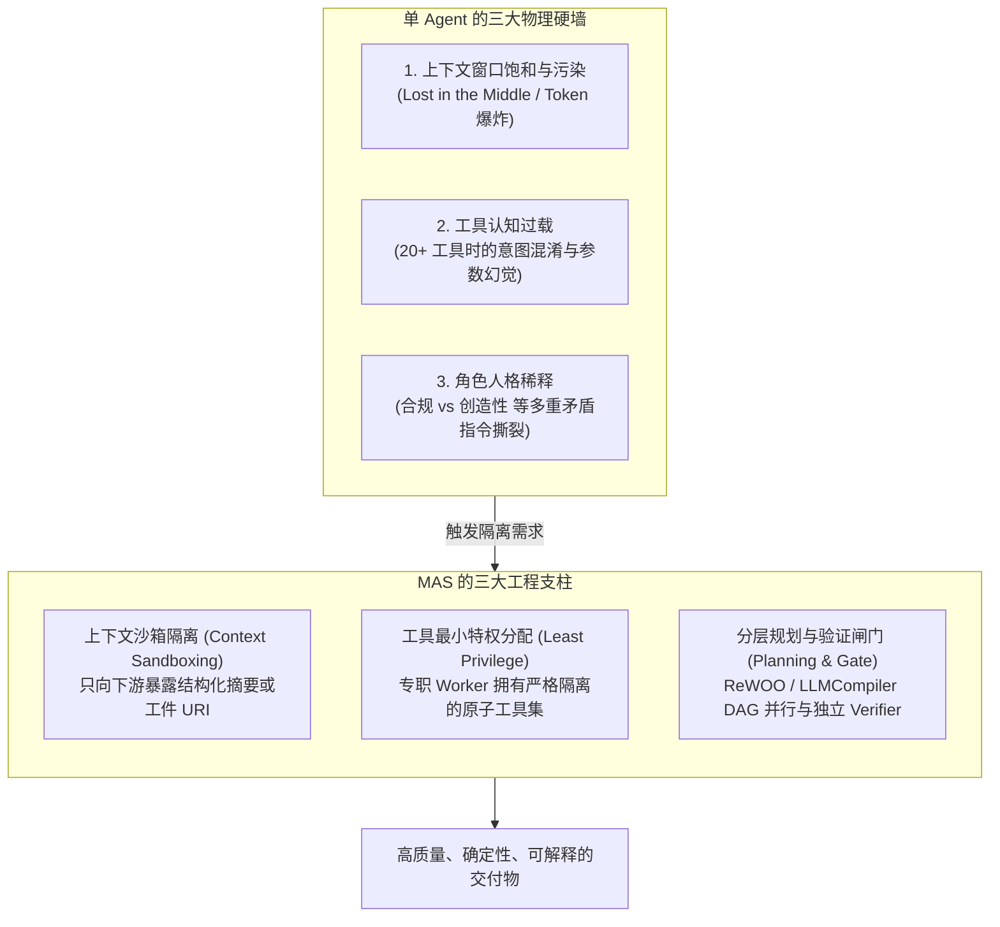
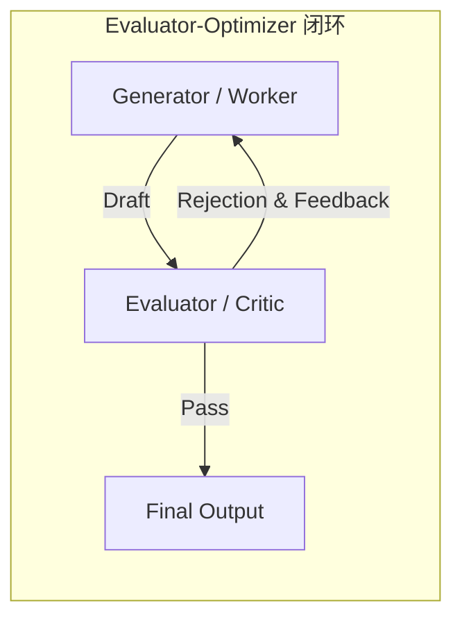
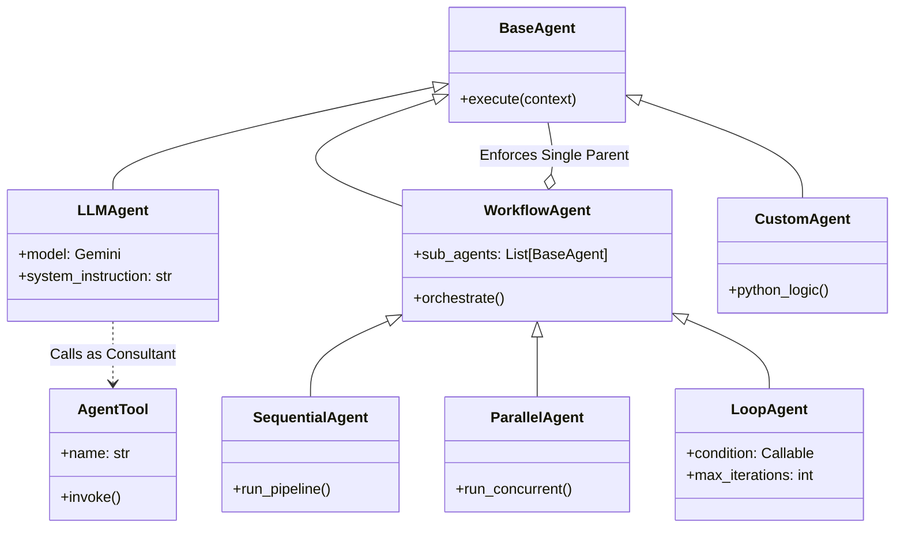
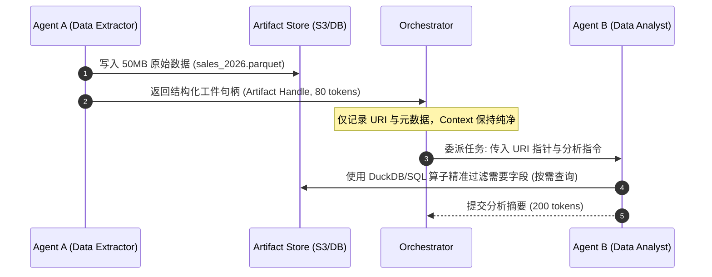
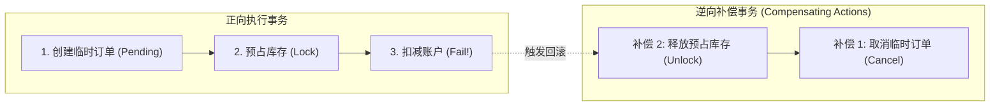

# Multi-Agent Systems 参考手册：架构拓扑、规划引擎与协作状态

> 研究日期：2026-08-23<br>
> 主题范围：面向由多个大语言模型（LLM）驱动的协作系统，讨论多智能体系统（MAS）的设计哲学、任务解耦、拓扑范式（Anthropic / Google ADK / LangGraph / AutoGen / CrewAI / Swarm）、规划与执行引擎、状态管理、共识与失效遏制，以及分布式可观测性与评测。<br>
> 配套学习页：[从零开始掌握多智能体：Multi-Agent Systems 10步学习路径](learn/)　**先读那篇建立取舍和心智模型，再拿这篇当手册查**<br>
> 阅读约定：文中的 **【来源事实】** 是来源直接支持的陈述，**【综合解释】** 是把多个来源放进同一模型后的推导，**【实践建议】** 是可执行但需按具体系统验证的工程方案。<br>
> 来源对齐：本手册完整融合了 Anthropic 官方指南《Building Multi-Agent Systems: When and How to Use Them》、Google Cloud《Building Collaborative AI with ADK》、LangChain《Planning Agents》以及 2024–2026 年主流多 Agent 生态与学术实证（ReWOO, LLMCompiler, Multi-Agent Debate, OTel GenAI）。

---

## 0. 先给结论

多智能体系统（Multi-Agent Systems, MAS）不是“给同一个问题塞进更多 LLM”，也不是让一群设定了花哨 Prompt 的 Agent 在没有约束的聊天室里互相吹捧。

**MAS 是对上下文窗口（Context Window）、工具认知负载（Cognitive Tool Load）以及系统级错误传播（Error Compounding）的工程隔离与治理。**



一套工业级生产可用的 MAS 必须同时回答六个核心工程问题：

1. **何时拆分？**——必须按照**上下文边界（Context Boundaries）**而非**问题类型（Problem Types）**拆分。让负责实现的 Worker 自己写测试，而不是拆出传话筒式的“测试员”。
2. **何时绝不用 MAS？**——简单任务切勿引入 MAS。MAS 的 Token 消耗通常是单 Agent 的 **3 到 10 倍**，且端到端成功率遵循乘法级联衰减 $P_{\text{sys}} = \prod p_i$。
3. **如何规划？**——放弃低效短视的盲目 ReAct 循环；选择两阶段 Plan-and-Execute、解耦变量占位的 **ReWOO**，或利用 DAG 拓扑实现无阻塞并行的 **LLMCompiler**。
4. **如何共享状态？**——严禁在 Agent 之间传递动辄数万 Token 的完整原始对话历史。必须推行**工件引用指针模式（Artifact Reference Pattern）**，通过 URI 句柄（Handle）按需检索。
5. **如何避免共识坍塌？**——警惕多智能体辩论中的**马屁精陷阱（Sycophancy Cascade）**，强制异构模型互审、对抗性角色分配与基于外部工具执行证据的盲审仲裁（Blind Arbitration）。
6. **如何监控与定位？**——引入 OpenTelemetry GenAI 分布式 Trace 树，通过**第一处偏离检测（Earliest Divergence Detection）**与反事实消融分析，将故障准确归因到特定 Step。

---

## 1. 为什么需要 Multi-Agent：单 Agent 的能力边界与崩溃现场

### 1.1 单 Agent 的三道物理硬墙

在没有多 Agent 协同的单体架构中，Agent 作为一个巨大的死循环运行在单一上下文会话中：
$$\text{State}_{t+1} = \text{LLM}(\text{SystemPrompt}, \text{Tools}, \text{History}_{0 \dots t}, \text{Observation}_t)$$

【来源事实】Anthropic 明确指出，在实际生产评估中，多 Agent 方案因重复上下文注入、协调提示词与摘要交互，通常比等效的单 Agent 消耗 **3 到 10 倍**的 Token。[A1]

【综合解释】既然 MAS 如此昂贵，为什么不能永远使用单 Agent？因为单 Agent 会在复杂的长程任务中遭遇三道无法逾越的物理硬墙：

```
+----------------------------------------------------------------------------------------------------+
|                                    单 AGENT 的三道物理硬墙                                          |
+------------------------------+----------------------------------+----------------------------------+
| 硬墙 1: 上下文窗口污染       | 硬墙 2: 工具认知过载             | 硬墙 3: 角色人格稀释             |
+------------------------------+----------------------------------+----------------------------------+
| - 检索文档、报错日志疯狂累积 | - 给单 Agent 塞入 20~50+ 个工具  | - Prompt 中同时塞入互相矛盾的指令|
| - Lost in the Middle 现象加剧| - Schema 描述相互重叠与歧义      | - 既要「发散头脑风暴」又要「合规」|
| - 关键用户约束被淹没失效     | - 产生高概率工具误选与参数幻觉   | - 随着对话轮次增加产生指令漂移   |
+------------------------------+----------------------------------+----------------------------------+
```

1. **上下文窗口污染（Context Window Pollution & Lost in the Middle）**：
   单 Agent 运行 10 轮以上后，检索到的海量原始数据、调试时的堆栈 Trace、失败重试的垃圾输出把上下文塞得满满当当。即使窗口容量标称 1M/2M tokens，LLM 在注意力计算中对长文本中间信息的检索准确率依然会显著退化，最终把初始 System Prompt 里的关键业务约束彻底遗忘。
2. **工具认知过载（Cognitive Overload from Tool Explosion）**：
   当一个单体 Agent 被赋予 30 个跨越财务、Git、SQL、邮件、Docker 的工具时，工具 Schema 自身就占据数千 Token，且不同工具参数间的细微边界会使 LLM 的函数路由能力断崖式崩塌，频繁出现参数类型拼错、调用非法工具等低级错误。
3. **角色人格稀释（Persona Dilution & Instruction Drift）**：
   单 Agent 无法同时扮演好两个存在根本张力的角色。要求同一个模型实例既充当“最大胆的代码重构者”又充当“最吹毛求疵的合规安全官”，最终只会得到一个平庸、妥协且不断指令漂移的折中产物。

---

## 2. 统一词典与多 Agent 坐标系

为了消除不同框架（Anthropic, Google ADK, LangGraph, AutoGen, CrewAI, Swarm）在术语上的混淆，本手册定义标准化的多 Agent 概念坐标系：

| 统一术语 | 英文对照 | 核心定义与工程边界 | 常见误区 |
|---|---|---|---|
| **智能体** | **Agent** | 包含模型推理、私有指令、工具集与局部状态的最小自主决策实体。 | 把纯 Python 脚本函数称为 Agent |
| **子智能体** | **Subagent / Worker** | 在独立沙箱中被上层唤起、执行受限子任务、完成后仅返回精简结果的节点。 | 让 Subagent 直接持有全局会话历史 |
| **主管 / 编排者** | **Supervisor / Orchestrator** | 负责任务意图分类、DAG 拆解、子任务分发与最终结果聚合的中枢节点。 | 让 Orchestrator 亲自去做脏活细节调用 |
| **共享黑板** | **Blackboard (Shared State)** | 所有协作 Agent 均可读写的全局集中式状态或内存空间（如 ADK Session）。 | 把未经清洗的中间过程直接写进黑板 |
| **消息信封** | **Message Envelope** | 智能体之间异步通信的强类型载荷，包含 Sender, Recipient, Intent, Data。 | 传递无格式的自由纯文本 |
| **工件指针** | **Artifact Reference (URI)** | 指向外部持久化存储（S3/GCS/DB）的对象句柄（如 `art://table_01.parquet`）。 | 把 10MB 的 CSV 原始数据贴在 Prompt 里 |
| **单步 vs 轨迹** | **Step vs Trajectory** | Step 是单次 Tool Call/LLM 调用；Trajectory 是达成目标全流程的所有 Step 序列。 | 把整个 Trajectory 当成一次不可分的 Step |
| **验证闸门** | **Verification Gate** | 独立于执行者的专用审计 Agent 或代码规则引擎，负责在状态提交前做硬性校验。 | 让编写代码的 Agent 自行宣布“我测过了” |

---

## 3. 核心设计哲学与决策树

### 3.1 第一性原则：按「上下文边界」拆分，绝不按「问题类型」拆分

【来源事实】Anthropic 官方研究强调，团队在设计多 Agent 系统时最容易踩的陷阱就是**按问题类型拆分（Decomposing by Problem Type）**，例如设立一个“架构设计 Agent”、一个“编码 Agent”、一个“测试 Agent”。[A1]

【综合解释】按问题类型拆分会导致致命的**“传话筒效应”（Telephone Game）**与**上下文割裂**：
- 编码 Agent 并不理解架构设计 Agent 思考过程中的隐式权衡；
- 测试 Agent 拿到代码时，丢失了编码 Agent 在实现时的内部逻辑分支和边界上下文，只能写出浮于表面的弱测试用例；
- 跨 Agent 频繁来回交接产生的 Token 损耗与信息衰减，远远超过了所谓的专业分工收益。

```mermaid
flowchart TD
    subgraph AntiPattern["❌ 错误方式：按问题类型拆分 (Anti-Pattern)"]
        direction LR
        P1[规划 Agent] -->|丢失探索上下文| P2[编码 Agent]
        P2 -->|丢失实现假设与细节| P3[测试 Agent]
        P3 -->|反复打回/传话筒退化| P2
    end

    subgraph RecommendedPattern["✅ 推荐方式：按上下文边界拆分 (Anthropic Recommended)"]
        direction TB
        Lead[Lead Orchestrator]
        W_Auth[Worker A: 认证模块<br/>(设计 + 编码 + 单元测试)]
        W_Pay[Worker B: 支付模块<br/>(设计 + 编码 + 单元测试)]
        Auditor[Independent Verifier<br/>(端到端全量集成测试)]
        
        Lead -->|分发独立领域上下文| W_Auth
        Lead -->|分发独立领域上下文| W_Pay
        W_Auth -.->|提交验证就绪代码| Lead
        W_Pay -.->|提交验证就绪代码| Lead
        Lead --> Auditor
    end
```

【实践建议】**Decomposition follows context.** 
- 赋予每个 Worker 闭环完成一个垂直子模块所需的**全部能力（规划+编码+自测）**，因为它持有该模块最完备、最深度的上下文；
- 顶层 Orchestrator 只负责划分模块接口边界，并在最外层设置独立的 Verification Subagent 进行全量回归与验收。

---

### 3.2 MAS 选型决策树

```
+----------------------------------------------------------------------------------------------------+
|                                    MAS 架构选型工程决策树                                          |
+----------------------------------------------------------------------------------------------------+
|                                                                                                    |
|  任务能否通过单 Agent + Tool Search (动态工具检索) + 良好 Prompt 稳定解决？                         |
|  ├── 是 ──> 【强力推荐】保持 Single-Agent 架构 (最省 Token、延迟最低、零跨节点失效)                |
|  └── 否                                                                                            |
|       │                                                                                            |
|       ├── 任务是否具有严格的静态流水线顺序（A -> B -> C）？                                         |
|       │    ├── 是 ──> 【Prompt Chaining / Sequential Pipeline】 (确定性代码流水线，非自主 MAS)     |
|       │    └── 否                                                                                  |
|       │         ├── 任务是否是多个完全独立的子任务可并发加速？                                     |
|       │         │    ├── 是 ──> 【Parallelization / LLMCompiler DAG】 (并发执行 + Joiner 汇总)     |
|       │         │    └── 否                                                                        |
|       │         │         ├── 任务需要跨越不同专业领域，且子任务需要动态规划和深度交互？           |
|       │         │         │    └── 是 ──> 【Orchestrator-Workers / LangGraph Supervisor】           |
|       │         │         └── 是否涉及不可逆破坏性操作或高风险业务？                               |
|       │         │              └── 是 ──> 强制引入 【Verification Gate / LLM Saga 补偿事务】       |
+----------------------------------------------------------------------------------------------------+
```

---

## 4. 架构拓扑与协作范式深度剖析

### 4.1 Anthropic 的 5 种基础模式与多 Agent 延伸

Anthropic 将基于 LLM 的系统构建模式划分为工作流（Workflow）与自主智能体（Agent）两大梯队：

```
+----------------------------------------------------------------------------------------------------+
|                                  ANTHROPIC 架构拓扑全景                                            |
+------------------------------------+---------------------------------------------------------------+
| 拓扑模式                           | 核心机制与架构特征                                            |
+------------------------------------+---------------------------------------------------------------+
| 1. Prompt Chaining (提示词链)      | 确定性串行工作流。每个 LLM 节点完成固定转化，输出作为下一节点输入。|
| 2. Routing (智能路由)              | 分类器判断意图，将请求分流至专有 Prompt / 专有 Toolset 的单一专门节点。|
| 3. Parallelization (并行化)        | 分为 Sectioning (分块并发提速) 与 Voting (同题多跑，投票抑制幻觉)。 |
| 4. Orchestrator-Workers (编排-工人)| 中央编排者动态决定生成哪些 Worker，分发独立上下文，最终聚合产物。|
| 5. Evaluator-Optimizer (生成-优化) | 双节点循环：Generator 产出草稿，Evaluator 对照标准严苛打回修正。 |
+------------------------------------+---------------------------------------------------------------+
```



---

### 4.2 Google ADK（Agent Development Kit）的树状与协作体系

【来源事实】Google ADK 基于分布式智能体理念，强调三个核心基石：**Decentralized Control（去中心化控制）**、**Local Views（局部视野）**与 **Emergent Behavior（涌现行为）**。[G1]

#### ADK 核心原语与架构设计
1. **三大 Agent 实体**：
   - `LLMAgent`：智能核心（基于 Gemini），负责语义理解、复杂推理与自主决策；
   - `WorkflowAgent`：结构化流程管理者，负责控制流调度（内置 `SequentialAgent`、`ParallelAgent`、`LoopAgent`）；
   - `CustomAgent`：继承自 `BaseAgent` 的纯 Python 代码业务节点。
2. **单一父节点规则（Single Parent Rule）**：
   ADK 强制要求树状组织结构，每个 Subagent 必须且只能有一个确定的 Parent Agent。这消除了多头管理引发的状态竞争与控制死锁。
3. **Subagents 与 AgentTools 的本质解耦**：
   - **Subagent**：组织内部的正式员工，拥有自己的生命周期和会话作用域；
   - **AgentTool**：外部顾问（Consultant），被当成常规函数工具挂载，按需调用但不破坏树状层级。



---

### 4.3 现代 6 大 MAS 框架全景对比矩阵

```
+------------------------------------------------------------------------------------------------------------------------------------------+
|                                                      主流 MAS 框架全维度对比矩阵 (2024-2026)                                              |
+-------------------+----------------------+--------------------+--------------------+--------------------+--------------------+-----------+
| 维度              | LangGraph            | Google ADK         | Anthropic 原生     | AutoGen v0.4 Core  | CrewAI             | Swarm     |
+-------------------+----------------------+--------------------+--------------------+--------------------+--------------------+-----------+
| 核心设计哲学      | 状态图与 Pregel 引擎 | 树状云原生编排体系 | 隔离沙箱与提示词流 | 异步 Actor 消息模型| 角色扮演与流水任务 | 无状态交接|
| 控制流机制        | 确定性节点+条件边    | WorkflowAgent 树   | Orchestrator 循环  | Event Bus Pub/Sub  | Hierarchical Manager| Function Handoff |
| 状态管理模型      | 集中 TypedDict Reducer| 共享 Session 白板  | 局部变量+结构化摘要| Actor 内部强隔离   | 内存字典 (Memory)  | 极简 ContextVars |
| Token 与延迟消耗  | 低 (按需激活节点)    | 低/中 (Gemini Caching)| 极低 (沙箱强过滤)  | 极低 (Core 模式下) | 高 (重度角色 Prompt)| 极低 (零额外开销) |
| 工具沙箱隔离      | 进程/容器级别隔离    | GCP Cloud Run 沙箱 | 独立上下文沙箱     | Docker/E2B MicroVM | 本地执行/容器      | 宿主进程内|
| 断点续跑 (HITL)   | 原生 Checkpoint 时间旅行| GCP Task 审批挂起  | 代码层显式 Interrupt| 异步 Human Topic   | Task 参数配置      | 需外部接管|
+-------------------+----------------------+--------------------+--------------------+--------------------+--------------------+-----------+
```

---

## 5. 规划与执行引擎演进

### 5.1 Naive ReAct 的短视与崩溃

传统的 ReAct 模式通过 `Thought -> Action -> Observation` 循环进行：
- **短视贪心（Short-sightedness）**：每次只看眼前一步，缺乏全局里程碑规划；
- **错误死循环（Compounding & Wandering）**：一旦中间某步工具返回未预料的结果，Agent 极易陷入盲目重试，直到 Token 耗尽；
- **极高的 Token 与延迟浪费**：每调一个简单工具，都要拉起一次大模型全量上下文推理。

---

### 5.2 规划引擎演进四代梯队

```mermaid
flowchart TD
    subgraph Gen1["第一代：Naive ReAct"]
        R1["LLM 思考"] --> A1["执行工具 1"] --> O1["注入观察结果"] --> R2["LLM 思考"] --> A2["执行工具 2"]
    end

    subgraph Gen2["第二代：Plan-and-Execute"]
        Planner["Planner (大模型生成完整清单)"] --> Exec["Executor (逐项串行执行)"] --> Replanner["Replanner (评估并重写)"]
    end

    subgraph Gen3["第三代：ReWOO (变量解耦)"]
        ReWOO_Plan["Planner (生成带 #E1 变量的计划)"] --> Worker_NoLLM["Worker 纯代码变量替换并批量调用"] --> Solver["Solver 聚合最终答案"]
    end

    subgraph Gen4["第四代：LLMCompiler (DAG 并行流)"]
        Stream_Plan["Streaming Planner (流式产出 DAG)"] --> TFU["Task Fetching Unit (依赖满足即并行发射)"] --> Joiner["Joiner (判定是否需要重规划)"]
    end
```



### 5.3 核心规划引擎对比

| 架构 | 规划机制 | 执行机制 | 变量占位支持 | 典型延迟表现 | 适用场景 |
|---|---|---|---|---|---|
| **ReAct** | 单步交替 | 每步必调 LLM | ❌ 无 | 最慢（串行等待） | 极简未知任务 |
| **Plan-and-Execute** | 事前完整规划 | 串行执行器 | ❌ 弱 | 中等（计划后串行） | 多步骤长程调研 |
| **ReWOO** | 解耦计划（含 `#E` 节点） | 纯代码循环填值 | ✅ 强（`#E1`, `#E2`） | 极快（执行阶段零 LLM） | 确定性 API 数据拼接 |
| **LLMCompiler** | 结构化 DAG 生成 | 动态依赖并行调度 | ✅ 强（`${1}`, `${2}`） | 最快（3.6x 提速，依赖解耦并行） | 延迟敏感的企业级复杂 API 编排 |

---

## 6. 状态、内存与工件管理

### 6.1 共享黑板 vs 消息传递

在多 Agent 协同中，状态流转存在两大主流流派：
1. **共享黑板模式（Blackboard / Shared State）**（以 Google ADK / LangGraph 为代表）：
   - 所有 Agent 围绕同一个全局 Session State 读写；
   - 优点：状态可见性高，便于状态持久化与快照回滚；
   - 危险：多个并发 Agent 写入时可能产生**状态竞态条件（Race Condition）**与非受控的状态污染。
2. **消息传递模式（Message Passing / Actor Model）**（以 AutoGen v0.4 Core 为代表）：
   - 每个 Agent 拥有绝对私有的内部状态，彼此仅通过不可变的强类型消息交互；
   - 优点：彻底杜绝并发冲突，天然支持跨网络分布式部署；
   - 危险：跨节点状态汇总需要显式设计聚合并行模式。

---

### 6.2 工件引用指针模式（The Artifact Reference Pattern）

【综合解释】MAS 中最严重的 Token 浪费发生在“在 Agent 间直接传递原始大数据”。一个包含 10,000 行数据的 CSV，如果被 Agent A 完整输出到消息中给 Agent B，将直接烧掉数万 Token 并引发注意力模糊。



【实践建议】**严格实施指针传递**：
- Subagent 处理海量数据时，统一将产物写入 Blob 或缓存；
- 向上层汇报时，只返回包含 `artifact_id`、`uri`、`schema`、`row_count` 与 `summary` 的结构化描述体；
- 下游 Subagent 通过专有工具（如 SQL 探针）定向抽取局部信息。

---

## 7. 共识、辩论与失效遏制

### 7.1 级联失效率的残酷数学

在由 $n$ 个相互依赖的 Agent 节点构成的执行链条中，若每个 Agent 的单步执行可靠性为 $p_i \in (0, 1]$，则系统整体端到端成功率 $P_{\text{system}}$ 为：

$$P_{\text{system}} = \prod_{i=1}^n p_i$$

```
当单步成功率为 95% (p = 0.95) 时：
- 5 步流水线：  P = 0.95^5  ≈ 77.38%
- 10 步流水线： P = 0.95^10 ≈ 59.87%
- 20 步流水线： P = 0.95^20 ≈ 35.85%
```

【实践建议】通过**幂等重试（Idempotent Retry）**提升单步等效可靠性：
若引入局部代码校验与最多 $k$ 次重试，单步等效可靠性提升为：
$$p_{\text{effective}} = 1 - (1 - p)^k$$
在 $p=0.90, k=3$ 时，$p_{\text{effective}} = 1 - 0.1^3 = 99.9\%$。

---

### 7.2 Multi-Agent Debate 与马屁精陷阱（Sycophancy Cascade）

【来源事实】学术研究（Du et al., 2023; Liang et al., 2023）证明多 Agent 相互辩论可纠正事实幻觉。但在无约束的自由辩论中，LLM 受 RLHF 对齐偏好的影响，极易产生**顺从妥协（Sycophancy）**——次级 Agent 会在第二轮轻易认同主要 Agent 的错误假说，导致假共识（False Consensus）。

```
                                [第 1 轮：独立发散]
                           Agent A (Claude)          Agent B (Gemini)
                                   \                /
                                    \              /
                                [第 2 轮：强制交叉盘问]
                           Agent A 寻找 B 的漏洞    Agent B 寻找 A 的漏洞
                                    \              /
                                     \            /
                                [第 3 轮：盲审仲裁]
                           Judge Agent (必须核验 Tool 执行证据)
                                            |
                                  [最终不可篡改判定]
```

**三项工程防御措施：**
1. **强制角色对立**：显式设定辩方与控方，严禁在前两轮达成共识；
2. **模型异构化**：混合部署 Anthropic Claude、Google Gemini 与 OpenAI GPT，打破同源预训练偏置；
3. **盲审裁判（Blind Arbitration）**：裁判 Agent 只能看到匿名论点与底层的 Tool 执行结果，不带引用证据的推论一律判定无效。

---

### 7.3 不可逆副作用与 Agentic Saga 补偿事务

当 Agent 拥有写数据库、发邮件、转账等真实世界副作用时，单纯的重试会导致数据灾难。必须引入 **LLM Saga 模式**：



【实践建议】每一个具备副作用的 Agent 工具必须成对注册正向操作与补偿操作（如 `create_user` 对应 `delete_user`）。一旦后续步骤发生不可逆崩溃，编排器按逆序自动调用补偿事务链。

---

## 8. 可观测性、评测与归因定位

### 8.1 OpenTelemetry GenAI 语义规范与分布式 Trace 树

```mermaid
gantt
    title 多智能体分布式 Trace 树 (OpenTelemetry)
    dateFormat X
    axisFormat %s秒

    section Supervisor
    Orchestrator Run :active, 0, 12
    
    section Worker 1 (Auth)
    Invoke Subagent Auth :crit, 1, 5
    tool.call (ReadSchema) :2, 3
    tool.call (GenCode) :3, 5
    
    section Worker 2 (Database)
    Invoke Subagent DB :active, 5, 10
    tool.call (ExecuteMigration) :6, 8
    
    section Verifier
    Invoke Verifier (E2E Test) :done, 10, 12
```



**核心 Trace 属性标签：**
- `gen_ai.conversation.id`：贯穿所有智能体的全局 Trace ID；
- `gen_ai.agent.name` / `gen_ai.agent.id`：当前执行节点的身份与层级；
- `gen_ai.operation.name`：`create_agent` / `invoke_agent` / `execute_tool` / `agent_handoff`；
- `gen_ai.usage.prompt_tokens` / `completion_tokens`：每个节点的精细化成本监控。

---

### 8.2 第一处偏离检测与反事实归因

当一个由 8 个 Agent 协同完成的复杂任务最终结果错误时，切忌把所有 Agent 一并责怪：
1. **第一处偏离检测（Earliest Divergence Detection）**：
   在 Trace 的每个节点输出端挂载断言检查器，顺着拓扑流找到**第一个**违背规范的输出。下游所有节点的错误均判定为“受污染上下文引起的受害者失败”；
2. **反事实消融归因（Counterfactual Step Ablation）**：
   将怀疑出错的 Agent $i$ 的输出替换为人工作出的标准答案（Gold Output），若下游全流程立即恢复成功，则 Agent $i$ 承担全额失效归因责任。

---

## 9. 框架横向选型矩阵与生产代码模式

### 9.1 经典模式 1：Anthropic 风格的 Orchestrator-Worker 与代码级校验循环

```python
from typing import Dict, Any, List
from pydantic import BaseModel, Field

class SubtaskResult(BaseModel):
    task_id: str
    status: str
    summary: str
    artifact_uri: str = Field(description="URI pointer to generated artifact")

def run_orchestrator_worker_pipeline(user_goal: str, max_attempts: int = 3) -> Dict[str, Any]:
    """Anthropic Best Practice: Orchestrator-Workers with Hardcoded App-Level Loop"""
    orchestrator = LeadOrchestratorAgent()
    verifier = IndependentVerificationAgent()
    
    for attempt in range(1, max_attempts + 1):
        # 1. Orchestrator decomposes goal into isolated subtasks
        plan = orchestrator.generate_execution_plan(user_goal)
        
        worker_results: List[SubtaskResult] = []
        for task in plan.tasks:
            # 2. Worker executes in an isolated sandbox with minimum necessary context
            worker = DomainWorkerAgent(domain=task.domain)
            res = worker.execute_isolated(task.instructions, task.context_slice)
            worker_results.append(res)
            
        # 3. Orchestrator aggregates structured summaries (preventing token explosion)
        combined_draft = orchestrator.synthesize_results(worker_results)
        
        # 4. Independent Verifier checks against negative test suites
        audit_report = verifier.verify_solution(user_goal, combined_draft)
        if audit_report.is_passed:
            return {"status": "SUCCESS", "result": combined_draft, "attempts": attempt}
        
        # Feed explicit failure feedback into next orchestrator loop
        user_goal = f"{user_goal}\n[Feedback on Attempt {attempt}]: {audit_report.failure_reasons}"
        
    raise RuntimeError(f"MAS pipeline failed to converge after {max_attempts} attempts.")
```

---

### 9.2 经典模式 2：ReWOO 变量解耦规划代码模式

```python
import re
from typing import Dict, Any

class ReWOOExecutionEngine:
    """ReWOO: Decoupling Planning from Execution using Variable Placeholders"""
    def __init__(self, planner_llm, tool_registry):
        self.planner = planner_llm
        self.tools = tool_registry

    def execute(self, query: str) -> str:
        # 1. Planner outputs a plan containing #E1, #E2 variable placeholders
        blueprint = self.planner.generate_rewoo_plan(query)
        # Example blueprint:
        # Plan 1: Search weather in Tokyo -> #E1 = WeatherSearch[Tokyo]
        # Plan 2: Convert temperature from #E1 -> #E2 = UnitConverter[#E1.temp]
        
        variable_store: Dict[str, Any] = {}
        
        # 2. Execution phase runs deterministically in pure code (NO LLM calls!)
        for step in blueprint.steps:
            # Replace variable references (#E1) with evaluated results
            resolved_args = self._resolve_variables(step.args, variable_store)
            tool_fn = self.tools.get(step.tool_name)
            
            # Execute tool and populate variable
            result = tool_fn(**resolved_args)
            variable_store[f"#{step.id}"] = result
            
        # 3. Solver LLM receives only clean query and final variable dictionary
        final_answer = self.planner.solve(query, variable_store)
        return final_answer

    def _resolve_variables(self, args: dict, store: dict) -> dict:
        # Regex substitution of #E[0-9]+ references
        ...
```

---

## 10. 常见陷阱、反模式与按症状排查清单

```
+----------------------------------------------------------------------------------------------------+
|                                    MAS 常见反模式与按症状排查清单                                   |
+--------------------------+--------------------------------------+----------------------------------+
| 症状表现                 | 根本原因 (Root Cause)                | 修复方案 (Actionable Fix)        |
+--------------------------+--------------------------------------+----------------------------------+
| 早期误判 (Early Victory) | 验证 Agent 只跑了一个表面用例便宣告成功| 在 Verifier Prompt 中强制全量回归与负向用例 |
| 无限抛球 (Ping-Pong Loop)| 两 Agent 互相指责，不断把任务推给对方| 代码层硬编码 `max_attempts` 熔断机制 |
| 幻觉移交 (Hallucinated)  | Orchestrator 移交给不存在的 Subagent | 使用严格 Pydantic Tool Schema 约束路由枚举 |
| Token 指数爆炸           | 跨 Agent 传递了未经裁剪的完整 Trace  | 推行 Artifact Reference Pattern (URI 句柄) |
| 群体合谋 (Echo Chamber)  | 多 Agent 辩论因同源模型陷入从众迎合  | 异构模型交叉盲审，强制前两轮对立辩论 |
| 级联崩溃 (Cascade Fail)  | 某中间 Worker 抛错导致下游全部瘫痪   | 引入 Agentic Saga 补偿事务与局部重试 |
+--------------------------+--------------------------------------+----------------------------------+
```

---

## 11. 来源账本与一致性说明

本手册所有核心论断均由以下官方权威文献与学术论文支撑：

- **[A1] Anthropic**: *Building Multi-Agent Systems: When and How to Use Them* (2025/2026) & *Building Effective Agents*.
- **[G1] Google Cloud**: *Building Collaborative AI: A Developer's Guide to Multi-Agent Systems with ADK* (2025/2026).
- **[L1] LangChain**: *Planning Agents* (Plan-and-Execute, ReWOO, LLMCompiler) by LangChain Engineering.
- **[M1] AutoGen v0.4**: *Layered Architecture and Actor Model for Multi-Agent Systems* (Microsoft Research).
- **[D1] Multi-Agent Debate**: Du et al. (2023) *Improving Factuality and Reasoning in Language Models through Multi-Agent Debate*.
- **[R1] ReWOO Paper**: Xu et al. (2023) *ReWOO: Decoupling Reasoning from Observation for Efficient Augmented Language Models*.
- **[C1] LLMCompiler Paper**: Kim et al. (2024) *An LLM Compiler for Parallel Function Calling*.
- **[O1] OpenTelemetry**: *Semantic Conventions for Generative AI Operations and Multi-Agent Tracing* (2025/2026).

---
*Multi-Agent Systems Reference Manual · Produced for ML-Learning Architecture Series.*
