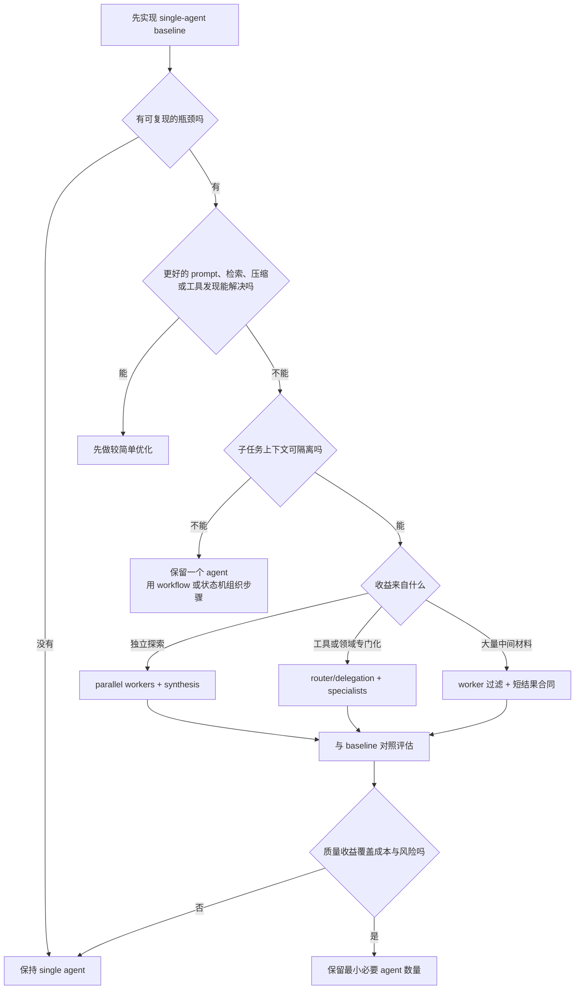
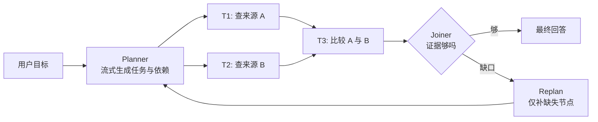
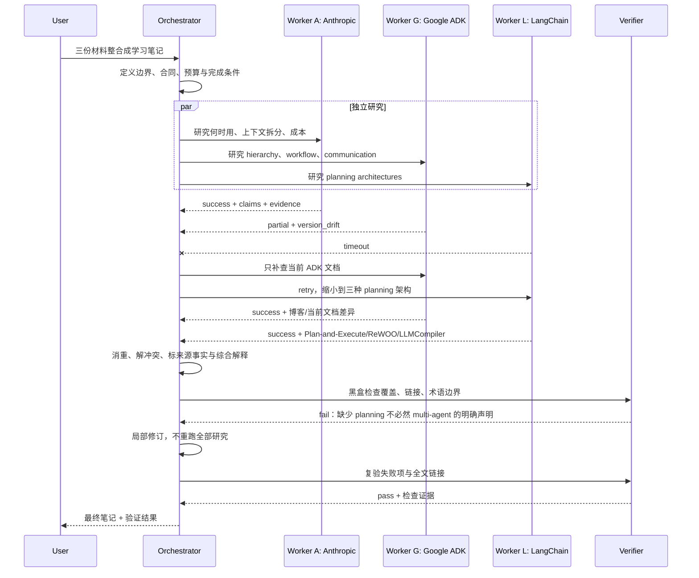

# Multi-Agent Systems：何时拆分、如何协作、怎样评测

> 研究与链接校验日期：**2026-08-23**<br>
> 核心范围：Anthropic 的 multi-agent 决策框架、Google ADK 的协作模型、LangChain 的 planning agents。<br>
> 阅读约定：**【来源事实】** 表示来源直接支持；**【综合解释】** 表示把多个来源放进同一模型后的推导；**【实践建议】** 表示可执行但仍需用自己的任务验证。<br>
> 版本提醒：ADK 与 LangChain/LangGraph 都在快速演进。本文讲稳定的架构思想；涉及类名、API 和推荐路径时，须以当前官方文档为准。<br>
> 建议读法：先走一遍配套的 [十步视觉学习路径](learn/)，再把本文当作 schema、失败轨迹、评估矩阵与来源边界的详细参考。

---

## 学习目标

读完后，你应该能：

1. 用可验证的理由判断一个任务该保持 single-agent，还是值得拆成 multi-agent；
2. 按**上下文边界、数据依赖和副作用**拆任务，而不是机械地按“规划、开发、测试、评审”分角色；
3. 区分 hierarchy、sequence、parallel、loop、delegation、shared state 和显式 agent invocation；
4. 解释 planning architecture 与 multi-agent 为什么是两个正交维度；
5. 写出最小任务合同，处理超时、缺证据、冲突和有限重规划；
6. 用 single-agent baseline 证明多智能体的质量收益是否值得额外 token、成本、延迟和维护复杂度。

### 建议学习路线

| 阶段 | 先做什么 | 为什么 |
|---|---|---|
| 1. 建基线 | 一个 agent + 必需工具，保存完整 trace | 没有基线，就不知道多 agent 解决了什么 |
| 2. 学固定控制流 | 手写 sequence、parallel、loop | 先理解依赖、并发和停止条件，不急着让模型调度一切 |
| 3. 学动态委派 | 加一个 orchestrator/router 和 2–3 个 specialist | 观察路由错误与 handoff 损失 |
| 4. 学 planning | 把任务表示成 step list、变量依赖或 DAG | 区分“如何规划工作”和“谁执行工作” |
| 5. 学恢复与评测 | 注入超时、空结果、冲突，比较 baseline | 能恢复且净收益为正，架构才算成立 |

---

## 0. 先给结论

Multi-agent 不是 single-agent 的“高级版开关”。它是用更多独立执行上下文换取三类能力：

- **上下文保护**：把大量中间材料留在 worker 内，只把必要结论交回主上下文；
- **并行探索**：让彼此独立的路径同时搜索，主要提高覆盖面，也可能缩短墙钟时间；
- **专业化**：给不同 worker 更窄的工具、指令、权限或领域资料。

但代价也同时出现：重复加载上下文、任务交接、结果合并、路由错误、共享状态冲突、错误级联，以及更难调试的非确定轨迹。

【来源事实】Anthropic 把“先证明单智能体的具体瓶颈，再考虑多智能体”作为核心建议，并报告其场景中多智能体通常消耗单智能体 **3–10 倍 token**。这是供应商自身经验，不是跨模型、跨任务的定律。[Anthropic 原文][A]

最值得记住的一句话是：

> **按上下文边界拆，而不是按组织架构或工种名称拆。**

如果规划、执行、测试需要共享同一批细节与决策历史，把它们交给不同 agent 可能只是在制造“传话游戏”。反过来，两个研究方向彼此独立、只需回传结构化证据，就是很自然的边界。

---

## 1. 先统一概念：什么是 multi-agent

### 1.1 一个可操作的定义

本文把 **agent** 看成一个运行单元：

> `模型或确定性策略 + 指令 + 可见上下文/状态 + 工具/权限 + 执行循环 + 停止条件`

因此，agent 不等于一次 LLM 调用，也不等于一个角色名称。

本文把 **multi-agent system** 定义为：

> 多个这样的运行单元拥有可区分的上下文、职责或控制权，通过代码或消息协调，共同完成一个上层目标。

这个定义与 Anthropic 文章中“多个 LLM 实例运行于独立对话上下文，并由代码协调”的工程定义相容。[Anthropic 原文][A] 它也允许某些 worker 使用确定性逻辑，而不强迫每个节点都由 LLM 自主决策。

### 1.2 经典 MAS 与现代 LLM agent team 不要混为一谈

【来源事实】Google Cloud 的 ADK 文章用三点介绍 MAS：**decentralized control、local views、emergent behavior**。[Google ADK 原文][G]

【综合解释】这更接近经典 MAS 的一种理想类型；同一篇文章后面的 ADK 示例又大量采用 root/parent/sub-agent 层级。现代 LLM multi-agent 可以中心化、层级化，也可以去中心化。因此：

- “没有唯一 boss”不是所有 multi-agent 的硬条件；
- 多个 agent 并不会自动产生有益的 emergent behavior；
- 判断系统是否 multi-agent，应先看执行单元和上下文/控制边界，而不是看类名。

### 1.3 六个核心坐标

面对任何 multi-agent 框架，先忽略品牌名，用下面六个问题定位：

| 坐标 | 要回答的问题 | 常见选择 |
|---|---|---|
| 1. Decomposition | 谁把目标拆成可执行任务？ | 人工静态拆分、router、planner、orchestrator |
| 2. Assignment | 任务交给谁，凭什么？ | 固定绑定、规则路由、LLM delegation、竞标/协商 |
| 3. Execution | 子任务按什么顺序运行？ | sequential、parallel、loop、dependency DAG |
| 4. Communication & State | agent 看到什么，怎样传值？ | 消息传递、shared state、artifact reference、event log |
| 5. Synthesis | 谁消重、解冲突、补缺口？ | orchestrator、solver、joiner、独立 verifier |
| 6. Evaluation | 怎样知道整体和每一跳正确？ | outcome grader、trajectory 检查、成本/延迟、人工复核 |

这六个坐标的价值在于：同一个“orchestrator-worker”系统可以采用静态或动态分解、顺序或并行执行、消息或共享状态；只说拓扑名称还不足以描述系统。

---

## 2. 什么时候用，什么时候不用

### 2.1 三类真实收益

#### 上下文保护

适合“读取很多、主任务只需一点”的子任务，例如从长订单记录中提取当前状态，或从多篇资料中提取与一个子问题有关的证据。

【来源事实】Anthropic 给出的实践信号是：子任务会产生约 1000 tokens 以上材料，而多数不再影响主任务后续推理；数字只是经验性信号，不是阈值。[Anthropic 原文][A]

**为什么有效**：worker 可以在自己的 context 中检索、试错、过滤，主 agent 只接收短结论、证据和未决问题，从而降低主上下文污染。

#### 并行探索

适合互不依赖的研究方向、多个独立 API 查询或候选方案生成。

**为什么有效**：独立轨迹扩大搜索空间，降低所有推理都困在同一路径上的风险。并发可以缩短相对串行执行的墙钟时间，但不会减少总计算量。

#### 专业化

适合工具跨多个无关领域，或不同任务需要相互冲突的指令、权限与领域上下文。

【来源事实】Anthropic 把约 15–20+ 个工具视为“单 agent 可能承压”的实践信号，同时明确建议先尝试按需工具发现；它不是硬上限。[Anthropic 原文][A]

**为什么有效**：缩小候选工具与权限范围，可以降低误选工具、参数混淆和越权面。

### 2.2 最关键的拆分测试：上下文是否真能隔离

好的边界：

- 亚洲市场与欧洲市场分别研究，最后按统一字段合并；
- 两个拥有清晰接口的独立组件；
- 黑盒 verifier 只读取产物、验收标准和测试工具；
- 多个只读数据源的独立查询。

坏的边界：

- 把同一功能的规划、编码、测试、评审顺次交给四个 agent；
- 两个 agent 必须频繁确认同一个不断变化的状态；
- 多个 agent 同时写同一文件、记录或外部资源，却没有事务/锁；
- specialist 的领域边界本身无法可靠判断。

一个简单判断法：

> 如果 worker 为了继续工作，必须不断问另一个 worker“你刚才为什么这么做”，边界通常拆错了。

### 2.3 决策树



### 2.4 明确不该用的情况

- 任务简单、低价值、一次或少数工具调用即可完成；
- 步骤稳定且可由普通代码可靠完成；
- 子任务强耦合，持续共享同一决策历史；
- 系统没有 trace、预算、超时和明确验收条件；
- 多 agent 只是为了模仿真实公司的职位；
- 写操作无法隔离或回滚，失败的现实代价很高；
- 还没有强 single-agent baseline，却已经在比较 agent 数量。

---

## 3. 常见协作拓扑，以及 ADK 如何表达它们

### 3.1 先区分拓扑、控制流和通信

- **拓扑**：谁可以指挥或调用谁；
- **控制流**：谁先运行、谁可并行、何时循环；
- **通信**：输入输出通过消息、共享状态还是 artifact 传递。

三者可以自由组合。层级结构不等于顺序执行；共享状态也不等于所有 agent 都应看到完整历史。

### 3.2 常见拓扑速查

| 模式 | 形状 | 适合 | 主要风险 |
|---|---|---|---|
| Orchestrator–Workers | 一个协调者动态拆分、派发、汇总 | 子任务形状随输入变化的研究或分析 | 中心路由错误、协调者瓶颈 |
| Router–Specialists | 分类后交给一个或少数专家 | 类别清晰、工具/权限差异明显 | 误路由、边界模糊 |
| Sequential Pipeline | A → B → C | 明确的数据加工依赖 | 延迟相加、错误级联 |
| Parallel Fan-out/Fan-in | A/B/C 并发后汇合 | 独立读任务、覆盖面探索 | 重复工作、结果冲突、共享状态 race |
| Generator–Verifier | 产出后做黑盒检查 | 测试、schema、引用、合规 | verifier 过早宣布成功 |
| Loop / Critique | 生成—检查—修订 | 有客观收敛条件的迭代 | 无限循环、质量不升但成本持续增长 |
| Peer / Swarm | 节点间自由转交或协商 | 局部信息、探索性强的实验 | 难调试、死循环、责任不清 |

【实践建议】初学者先学 orchestrator–workers 与 generator–verifier。它们的所有权、输入输出和停止条件更容易显式化。

### 3.3 Google ADK 原文中的 hierarchy

【来源事实】Google ADK 文章描述 parent/sub-agent hierarchy：一个 parent 可以管理多个 sub-agents，而一个 agent 只有一个 parent。[Google ADK 原文][G]

这个 single-parent rule 是 **ADK 的层级建模规则**，不是通用 MAS 标准。它让委派和所有权清楚，但层级过深会增加 handoff 损失、延迟和根节点压力。

ADK 原文还区分三类 agent：

| ADK 术语 | 作用 | 边界 |
|---|---|---|
| `LLM Agent` | 用模型理解、推理并选择动作 | 不是说所有 agent 都必须由 LLM 驱动 |
| `Workflow Agent` | 用预定义控制流管理 sub-agents | 更接近确定性 manager/workflow |
| `Custom Agent` | 用 `BaseAgent` 扩展框架逻辑 | 是 ADK 扩展点，不是通用 specialist 定义 |

### 3.4 Sequential、Parallel、Loop

| ADK 原文模式 | 语义 | 适用条件 | 必须补上的护栏 |
|---|---|---|---|
| `SequentialAgent` | sub-agents 依次执行 | B 确实依赖 A 的结果 | 上游校验、失败短路、checkpoint |
| `ParallelAgent` | 独立 sub-agents 并发 | 无数据依赖，且副作用不冲突 | 有界并发、超时、冲突合并、race 检查 |
| `LoopAgent` | 重复执行 sub-agents | 有可观测的改进目标 | `max_iterations`、预算、明确退出信号 |

【来源事实】当前 ADK 文档强调 template workflow 的整体控制流是确定性的；parallel 分支结果顺序可能不确定，loop 也不会凭空知道何时停止。[ADK workflow 文档][G2]

### 3.5 Shared state、delegation、AgentTool

Google 文章给出三种协作机制：

1. **Shared Session State**：多个 agent 通过共同 state 的 key 传递结果。适合流水线传值；需要命名空间、版本和并发写策略。
2. **LLM-Driven Delegation**：parent/coordinator 根据请求动态选择 sub-agent。适合类别可描述但无法完全硬编码的路由；需要评估误路由和 fallback。
3. **Explicit Invocation / `AgentTool`**：把 agent 包装成工具，由调用方显式调用。原文把它类比为按需咨询的外部专家；sub-agent 则是层级中的成员。[Google ADK 原文][G]

`AgentTool`、session state 的具体语义都属于 ADK，不应冒充跨框架协议。通用层面只需说：**显式调用、动态委派、共享状态**是三种不同的协作选择。

### 3.6 截至 2026-08-23 的 ADK 漂移提示

2025 年 Google Cloud 博客适合建立基础直觉，但当前 ADK 2.0 文档已把 workflow 扩展为 graph-based、dynamic、collaborative、template 等路径；对 Python/Go，文档把 graph/dynamic workflows 描述为对部分 template workflow 的更灵活替代，而不是说旧类立刻不存在。[ADK workflows][G2]

所以：

- 学习 `SequentialAgent` / `ParallelAgent` / `LoopAgent` 的**控制流思想**；
- 写代码前重新查当前 ADK API、协作 mode 和已知限制；
- 不把一篇 2025 博客里的类名当成 2026 年唯一推荐路径。

---

## 4. Planning 与 multi-agent 是两个正交维度

### 4.1 为什么不能画等号

Planning 回答：

> 工作怎样分解、依赖怎样表达、何时执行、何时重规划？

Multi-agent 回答：

> 哪些独立运行单元拥有自己的上下文、职责、工具或控制权，它们怎样协作？

planner、executor、solver、joiner 可以由不同 agent 承担，也可以只是一个应用图里的普通节点和工具函数。**因此 planning architecture 不一定是 multi-agent。**

一个单 agent 可以先列计划再逐步调用工具；一个 multi-agent 系统也可以没有显式 planner，只由 router 把请求交给 specialist。

|  | 无显式 planning | 有显式 planning |
|---|---|---|
| Single-agent | ReAct 式逐步行动 | 一个 agent 生成并执行 step list / DAG |
| Multi-agent | router → specialist | planner/orchestrator → 多 workers → joiner |

### 4.2 ReAct 的出发点

LangChain 文章把典型 ReAct 概括为：

`提出下一动作 → 执行动作 → 观察 → 再决定下一动作`

【来源事实】文章指出两项局限：通常每次工具调用后都要再调用 LLM；每次只规划当前一步，不强制考虑全局任务。[LangChain 原文][L]

这不代表 ReAct 总是更差。对短任务、环境变化快或每个 observation 都会改变下一步时，即时决策可能比先做长计划更合适。

### 4.3 Plan-and-Execute

基本结构是：

1. planner 生成多步计划；
2. executor 接收用户问题和当前 step，调用一个或多个工具；
3. planner 检查中间结果，决定结束或重规划。

**为什么可能有效**：昂贵模型负责全局推理，局部执行可用更便宜模型；不必在每个工具调用后都做一次完整全局推理。

**原文限制**：执行仍然主要串行；没有变量赋值；每个 task 仍要经过 LLM。

### 4.4 ReWOO：把数据依赖写进计划

ReWOO 用交错的 `Plan:` 与 `E#:` 表示步骤，并允许后续步骤引用前序结果，例如：

```text
E1 = Search[本届赛事的两支队伍]
E2 = LLM[从 #E1 提取队伍 A 的 quarterback]
E3 = LLM[从 #E1 提取队伍 B 的 quarterback]
E4 = Search[查询 #E2 的统计数据]
E5 = Search[查询 #E3 的统计数据]
```

变量引用让执行器只拿当前所需输入，减少反复重规划；但原版 worker 仍按序执行，本可并行的 `E2/E3` 和 `E4/E5` 没有充分并发。[LangChain 原文][L]

### 4.5 LLMCompiler：从线性计划到可调度 DAG

LLMCompiler 进一步让 planner 流式产生带依赖的 tasks；Task Fetching Unit 在依赖满足时立即调度；joiner 根据完整执行历史选择回答或重规划。[LangChain 原文][L]



**为什么是推进**：DAG 把“可并行”从直觉变成依赖约束；流式规划让早期无依赖任务不必等完整计划生成。

**还需自己解决**：计划 schema 解析、漏边/错边/环依赖、副作用工具的安全并发、重规划抖动和 joiner 漏证据。LangChain 博客没有系统给出这些生产失败语义。

### 4.6 三种架构对照

| 架构 | 计划表示 | 执行 | 反馈 | 适合 |
|---|---|---|---|---|
| Plan-and-Execute | step list | 主要串行 | 每步后结束或重规划 | 需要全局方向但依赖不复杂 |
| ReWOO | 线性步骤 + `#E` 变量 | 顺序绑定变量 | solver 汇总 | 想减少反复规划并明确传值 |
| LLMCompiler | task DAG | 依赖满足即调度，可并行 | joiner 回答或 replan | 独立分支多、延迟受关键路径影响 |

### 4.7 截至 2026-08-23 的 LangChain 漂移提示

2024 年博客链接的部分 notebook 已成为迁移/归档占位，不应直接当最新版教程。当前实现应优先看 [LangGraph Workflows and Agents][L2]；该文档也明确区分 workflow 的预定代码路径与 agent 的动态过程。博客仍适合学习 Plan-and-Execute、ReWOO、LLMCompiler 的思想史。

---

## 5. 通信合同：任务怎样交出去，结果怎样回来

### 5.1 先声明：下面不是行业标准

`TaskEnvelope` 和 `AgentResult` 是**本文自拟的 provider-neutral 教学模型**，用于说明一个可靠 handoff 至少要包含什么。它们不是 Anthropic、ADK、LangChain 或任何标准组织定义的 wire protocol。

实际系统可以用 JSON Schema、Pydantic、Protobuf、数据库表或框架 state 实现；字段名也可以不同。

### 5.2 TaskEnvelope

```yaml
task_envelope:
  task_id: research-adk-001
  parent_task_id: multiagent-note-000
  objective: "提取 ADK 原文中的协作模式及其边界"
  inputs:
    artifact_refs:
      - "https://cloud.google.com/.../building-collaborative-ai..."
    facts_already_known: []
  context_boundary:
    include: ["hierarchy", "Sequential", "Parallel", "Loop", "communication"]
    exclude: ["写最终跨来源结论", "修改仓库"]
  output_contract:
    format: "claims_with_evidence"
    required_fields: ["claim", "source_url", "evidence_type", "uncertainty"]
  dependencies: []
  permissions:
    tools: ["web_read"]
    write_scope: []
  budgets:
    max_model_calls: 6
    max_tool_calls: 10
    deadline_seconds: 180
  retry_policy:
    max_attempts: 2
    retryable: ["timeout", "rate_limit"]
  stop_conditions:
    - "所有 required_fields 已填"
    - "无法访问一手来源时返回 blocked，不用二手来源冒充"
```

为什么这些字段重要：

- `objective` 防止 worker 自己扩题；
- `context_boundary` 同时写 include/exclude，减少重叠和越界；
- `output_contract` 让 synthesizer 不必猜结果结构；
- `dependencies` 决定能否并行；
- `permissions` 把最小权限写进任务，而不是让所有 worker 继承全部工具；
- `budgets` 与 `stop_conditions` 防止递归、循环和成本失控。

### 5.3 AgentResult

```yaml
agent_result:
  task_id: research-adk-001
  attempt: 1
  status: partial        # success | partial | retryable_error | blocked
  claims:
    - claim: "ParallelAgent 用于并发执行相互独立的 sub-agents"
      evidence_refs: ["src-1"]
      confidence: medium
  evidence:
    - id: src-1
      url: "https://cloud.google.com/.../building-collaborative-ai..."
      source_type: primary_official
      checked_at: "2026-08-23"
  artifacts: []
  open_questions:
    - "当前 ADK 2.0 是否仍把 template workflow 作为首选"
  usage:
    model_calls: 2
    tool_calls: 4
    input_tokens: 6200
    output_tokens: 900
    wall_ms: 18400
  errors:
    - code: version_drift
      retryable: false
      detail: "博客与当前文档的推荐路径不同"
  recommended_next_action: "核对当前 adk.dev workflows 文档"
```

`status: partial` 不是失败的委婉说法。它允许 orchestrator 保留已经验证的证据，同时只补派缺口，而不是丢弃全部工作后重跑。

### 5.4 通信的五条最低规则

1. **传 artifact reference，少传整段对话**：保留可追溯性，也减少重复 token。
2. **事实与推断分栏**：worker 不应把自己的架构推论写成来源原话。
3. **错误结构化**：至少区分 retryable、blocked、invalid task 和 unsafe。
4. **结果可幂等合并**：用 `task_id + attempt` 去重，重试不能重复写外部状态。
5. **版本化共享状态**：写入 `{key, version, writer, timestamp}`，并行写必须有 merge/compare-and-swap 规则。

### 5.5 Message passing 与 shared state

| 选择 | 优点 | 风险 | 适合 |
|---|---|---|---|
| 直接消息 | 边界清楚，最小披露，易追踪 | handoff 可能漏信息 | 独立 worker、短任务 |
| Shared state | 流水线读取方便，少复制大对象 | key 冲突、陈旧值、race、权限扩大 | 受控 workflow、明确 schema |
| Artifact store + reference | 大文件不进每个 context，可校验版本 | 需要生命周期和访问控制 | 报告、代码、数据集、长文档 |
| Event log | 可重放、可审计、易定位第一处偏离 | 实现成本更高 | 长任务、可恢复执行 |

共享 state 是运行时数据平面，不应等同于“把完整聊天记录发给所有 agent”。

---

## 6. 一个端到端、多轮失败恢复例子

### 6.1 任务

用户要求：

> 比较三份 multi-agent 材料，写一份中文学习笔记；必须使用一手来源，指出版本漂移，并给出可执行 lab。

orchestrator 先判断：三份来源可以独立阅读，适合并行；最终概念统一与写作强耦合，应由一个 synthesizer 完成；引用检查可黑盒验证。

### 6.2 轨迹



### 6.3 每一轮发生了什么

**Round 0：派发前**

- orchestrator 判断依赖：A/G/L 互不依赖，可以并发；synthesis 依赖三者；verification 依赖草稿。
- 每个 worker 收到不同 `context_boundary`，避免三人都写整篇综述。
- 写清来源等级、输出 schema、预算和停止条件。

**Round 1：部分成功**

- Anthropic worker 成功；结果可以冻结，不再重跑。
- ADK worker 发现博客与 2026 当前文档有漂移，返回 `partial`，而不是选择一个版本假装没有冲突。
- LangChain worker 超时，错误标记为 `retryable_error`。

**Round 2：定向恢复**

- 对 ADK 只补派“当前 workflows 文档”的缺口；不重复阅读已完成的博客。
- 对 LangChain 缩小任务范围，并复用已抓取 artifact；若再次超时，降级为串行读取或由 orchestrator 接管。
- 写操作仍未发生，所以重试是安全的。

**Round 3：整合**

- synthesizer 不按三篇文章顺序拼接，而是按“定义 → 决策 → 拓扑 → planning → 合同 → 恢复 → eval”重组。
- 同一事实出现冲突时保留时间戳和来源；不以多数投票替代证据判断。

**Round 4：黑盒验证**

- verifier 只读交付物、用户要求与链接，不需要知道写作过程；这是低 handoff 成本的独立边界。
- 第一次验证失败后只修缺项，再复验；“部分检查通过”不能当作全文通过。

### 6.4 恢复策略的顺序

遇到失败时按这个顺序处理：

1. **分类**：任务无效、暂时性工具错误、证据不足、权限不足，还是结果冲突？
2. **保留已验证成果**：checkpoint 和 artifact 不随一次失败丢失。
3. **缩小重试范围**：只重试失败节点；保持 `task_id`，增加 `attempt`。
4. **换路径或降级**：更换来源、模型、工具，或退回单 agent/人工检查。
5. **有限重规划**：例如最多 1 次 replan；每次必须减少一个明确缺口。
6. **停止并诚实交付**：预算耗尽时返回 partial/blocked 和缺口，不无限循环。

---

## 7. 上下文、token、成本与延迟

### 7.1 为什么 token 会膨胀

多智能体总 token 可粗略拆成：

```text
总 token
= orchestrator 上下文与推理
+ Σ worker 的重复前缀、输入与输出
+ handoff / 汇总 / 验证
+ 重试与重规划
```

上下文隔离能保护主 agent，却不意味着系统总 token 更少。每个 worker 仍需装载指令、任务合同和必要背景。

【来源事实】Anthropic 2026 博客报告其经验中 multi-agent 相对 single-agent 常为 **3–10× token**。[A] 其 2025 research system 工程文章还报告了另一个不同参照：agent 约为普通 chat 的 4× token，multi-agent 约为 chat 的 15×；两组数字参照不同，不能直接互换。[Anthropic research system][A2]

同一工程文章报告其内部 research eval 在特定模型组合下相对单 agent 提升 90.2%，以及复杂研究墙钟时间最多下降 90%。这些是 Anthropic 内部系统与评估的供应商案例，不是一般保证。[A2]

### 7.2 并行降低的是关键路径，不是总工作量

若三个独立 worker 分别耗时 10、15、20 秒：

- 串行主体时间约为 `10 + 15 + 20 = 45s`；
- 理想并行主体时间约为 `max(10, 15, 20) = 20s`；
- 实际还要加派发、排队、rate limit、汇总和重试。

因此要同时看：

- **总计算量**：tokens、model calls、tool calls、成本；
- **墙钟时间**：p50/p95 latency、critical path、汇总等待；
- **质量**：覆盖、正确性、证据和稳定性。

### 7.3 四类权衡

| 设计选择 | 可能收益 | 代价/风险 |
|---|---|---|
| 更多 workers | 搜索覆盖更大 | 重复研究、合并困难、成本近似增长 |
| 更窄 context | 更聚焦、主上下文更干净 | 边界写错会漏关键依赖 |
| 更深 hierarchy | 局部管理更清楚 | handoff 信息损失、延迟、根因难追踪 |
| 更多 replans | 适应 observation | thrashing、重复执行、副作用风险 |
| shared state | 传值方便 | race、陈旧值、权限扩散 |
| 小模型 executor | 降低单步成本 | 难步骤正确率可能下降 |

【实践建议】设置系统级预算，而不只给单 agent 限额：`max_agents`、`max_parallelism`、`max_depth`、`max_model_calls`、`max_tool_calls`、`max_replans`、`deadline` 和总 token/cost ceiling。

### 7.4 Planning 论文数字也要看证据边界

LangChain 博客宣称 planning agents 可能更快、更省成本、质量更高，但正文没有给完整 benchmark 表。[L]

- ReWOO 论文摘要报告在 HotpotQA 上约 5× token efficiency、准确率提高 4%；[ReWOO 论文][P1]
- LLMCompiler 当前 arXiv 摘要报告在论文特定任务上最高约 3.7× latency speedup、6.7× cost saving、约 9% accuracy improvement。[LLMCompiler 论文][P2]

这些都应表述为特定 benchmark、模型和论文版本下的结果，而不是业务系统预期值。

---

## 8. 失败模式：症状、根因、护栏

| 失败模式 | 为什么发生 | 可执行护栏 |
|---|---|---|
| 交接失真 | 摘要丢掉动机、失败尝试和隐含约束 | 按上下文拆；传 artifact + schema；强耦合步骤留给同一 agent |
| 错误分解 | orchestrator 把正确目标拆成错误任务 | 保存 plan；检查覆盖/重叠/依赖；允许局部 replan |
| 误路由 | specialist 边界模糊或任务描述不足 | 路由测试集、置信度、fallback、混淆矩阵 |
| 重复劳动/覆盖缺口 | workers 的 include/exclude 不明确 | 任务合同写范围；synthesizer 做 coverage map |
| Sequential 错误级联 | 下游把上游输出当事实 | 每个边界校验；关键事实带证据；失败短路 |
| Parallel race | 分支同时写共享 key/资源 | 只并行无冲突任务；命名空间、版本、锁、事务 |
| Unsafe parallelism | 无数据依赖不代表无副作用冲突 | 标注 read/write set；写操作串行或审批；保证幂等 |
| Loop 不收敛 | 没有目标、退出信号或质量增益判断 | max iterations；每轮 delta；无增益即停止 |
| Replan thrashing | joiner 总觉得“不够” | 明确缺口；限制 replans；禁止重复同一计划 |
| 合并幻觉 | synthesizer 抹平来源冲突 | 保留 provenance；显式列分歧；不以投票代替证据 |
| 过早胜利 | verifier 只跑少量正向检查 | 全量 checklist、负向测试、证据化 pass/fail |
| 权限扩大 | worker 继承所有工具和数据 | capability allowlist、最小权限、敏感写操作审批 |
| Prompt injection 传播 | 一个 worker 把外部恶意文本当指令回传 | 数据/指令分离；结果标记不可信；输出过滤与来源验证 |
| 规模失控 | agent 自我复制或层级无限加深 | max agents/depth；只有 orchestrator 可派发；预算熔断 |
| 难以复现 | 随机路由、并发顺序和外部状态变化 | trace、版本、输入快照、task/attempt id、checkpoint |

一个重要原则：不要只在最终回答失败时看最后一个 agent。应从 trace 中找到**第一处偏离**：分解、路由、工具调用、状态写入、worker 结果还是 synthesis。

---

## 9. 怎样评测 multi-agent 是否真的值得

### 9.1 从 single-agent baseline 开始

至少比较四个候选：

| 版本 | 说明 | 它回答的问题 |
|---|---|---|
| S0 | 强 prompt 的 single agent + 相同工具 | 最简单系统能做到什么 |
| S1 | single agent + context compression / tool discovery | 瓶颈能否用更简单优化解决 |
| W1 | 固定 workflow：sequence/parallel/loop | 收益是否来自确定性控制流，而非多 agent 自治 |
| M1 | 动态 orchestrator + specialists/workers | 动态分解与独立上下文是否带来额外净收益 |

没有 S0/S1，无法判断 M1 是在解决问题，还是只是在增加调用数。

### 9.2 同题评估矩阵

| 层级 | 指标 | 具体问题 |
|---|---|---|
| Outcome | task success、正确性、完整性、约束满足 | 最终任务真的完成了吗 |
| Decomposition | 子任务覆盖率、重叠率、依赖边正确率 | 计划是否可执行且没有漏项 |
| Assignment | 委派准确率、漏/重复委派、fallback 成功率 | 该不该派、派给谁是否正确 |
| Worker | 局部 success、工具/参数正确率、证据质量 | 每个 worker 是否守住自己的合同 |
| Synthesis | 冲突发现率、证据保留率、遗漏率 | 汇总是否超越简单拼接 |
| Recovery | tool failure 恢复率、partial 保留率、replan 次数 | 失败后能否局部恢复并停下 |
| Efficiency | tokens、成本、model/tool calls | 质量收益花了多少计算 |
| Latency | p50/p95、critical path、并发利用率 | 用户实际等多久 |
| Safety | 越权、重复副作用、审批正确率 | 是否以不允许的路径完成 |
| Reliability | 多 trial pass rate、失败类型分布 | 一次成功能否稳定复现 |

【来源事实】当前 ADK eval 文档强调不只看 final response，也看 trajectory/tool use；multi-agent 的中间响应同样可成为评估证据。[ADK evaluate][G3]

### 9.3 实验方法

1. 从 20–50 个真实任务/失败案例开始，标注切片：可并行、强耦合、工具多、长上下文、写副作用。
2. 固定模型、工具、数据快照和 grader；对 S0/S1/W1/M1 跑同一任务集。
3. 随机系统运行多次；报告逐任务结果，不只报平均分。
4. 用代码 grader 检查 schema、链接、文件和环境 outcome；语义质量再用经人工校准的 judge。
5. 保存完整 trace，失败归因到第一处偏离。
6. 做 ablation：减少一个 worker、取消 verifier、把动态路由换成规则，观察质量—成本变化。

### 9.4 一个务实的保留门槛

不要问“多 agent 分数高不高”，而要问：

> 在目标任务切片上，M1 相对最强简单基线的质量/覆盖提升，是否稳定大于额外成本、p95 延迟、故障率和维护负担？

【实践建议】发布决策至少同时显示：

```text
quality_delta
cost_ratio
p95_latency_delta
task_success_rate
routing_error_rate
duplicate_work_rate
recovery_rate
```

任何一个硬安全义务失败，都不应被更高平均质量抵消。

---

## 10. 最小实践 Lab：研究型 orchestrator–workers

### 10.1 这个 lab 究竟教什么

不是教你“多开几个 agent”，而是让你亲手观察五件事：

1. 任务图和上下文边界如何决定 agent 数量；
2. 只有独立节点才能并行；
3. 结构化 handoff 如何降低合并成本；
4. 一个 worker 失败时如何局部恢复；
5. multi-agent 是否真的胜过 single-agent baseline。

### 10.2 任务与限制

选择一个需要阅读 9–12 份一手资料的技术问题，例如：

> 比较三种 agent memory 方案的状态模型、失败恢复和评测方式。

限制：

- 最多 3 个 research workers；
- 最多 1 次 replan；
- workers 只读，不允许外部写操作；
- 每条重要结论必须带 URL、来源类型、检查日期和不确定性；
- synthesizer 只接收 `AgentResult`，不接收每个 worker 的整段 scratchpad。

### 10.3 依次实现四版

**A. S0 single-agent baseline**

- 一个 agent 完成检索、阅读、比较和写作；
- 保存 token、tool calls、总时间、来源覆盖和引用错误。

**B. W1 固定 parallel workflow**

- 人工把 9–12 份资料分成三个不重叠集合；
- 三个 worker 并发提取相同 schema；
- 一个确定性 merge 步骤按字段合并。

**C. M1 动态 orchestrator**

- orchestrator 根据问题生成 2–3 个子问题和依赖；
- 只并行 `dependencies: []` 的任务；
- synthesizer 做消重、冲突和缺口检查。

**D. M1 + failure recovery**

- 人为让一个 worker 超时；
- 让另一个 worker 返回缺来源的 `partial`；
- 验证系统能保留成功结果、只补派缺口，并在一次 replan 后停止。

### 10.4 Provider-neutral 伪代码

```python
def run_research(user_task):
    plan = orchestrator.make_plan(user_task, max_workers=3)
    assert is_acyclic(plan.dependencies)
    assert writes_do_not_conflict(plan.tasks)

    results = run_ready_tasks(
        plan.tasks,
        max_parallelism=3,
        timeout_seconds=180,
    )

    gaps = validate_results(results)
    if gaps and plan.replans_used < 1:
        repair_tasks = orchestrator.replan_only_gaps(gaps, prior_results=results)
        results += run_ready_tasks(repair_tasks, max_parallelism=2)

    draft = synthesize(results, preserve_provenance=True)
    verdict = verify(draft, required_coverage=user_task.requirements)
    return draft if verdict.passed else partial_delivery(draft, verdict.failures)
```

这不是某个 SDK 的可运行 API，而是用最少代码显式展示：DAG 检查、副作用检查、有界并发、局部重规划、provenance 与诚实的 partial delivery。

### 10.5 记录表

| 版本 | 质量/10 | 一手来源覆盖 | 引用错误 | tokens | model calls | wall time | 恢复成功 |
|---|---:|---:|---:|---:|---:|---:|---:|
| S0 |  |  |  |  |  |  | N/A |
| W1 |  |  |  |  |  |  | N/A |
| M1 |  |  |  |  |  |  | N/A |
| M1 + failure |  |  |  |  |  |  |  |

### 10.6 完成标准

- S0、W1、M1 使用同一任务、来源范围和 grader；
- trace 能定位每次分解、委派、工具调用、结果与重试；
- failure 版不会因为一次超时丢掉全部成果；
- 报告质量、成本和延迟，不只挑最漂亮的一个数字；
- 最后能说清楚：收益来自上下文隔离、并行、专业化，还是其实只来自更好的 workflow。

---

## 11. 自测题

先自己作答，再看下面的参考答案。

1. 一个 planner 生成 DAG，普通函数执行各节点。这一定是 multi-agent 吗？为什么？
2. 为什么“规划 agent → 编码 agent → 测试 agent → 评审 agent”常是坏边界？什么情况下 verifier 又是好边界？
3. 两个任务没有数据依赖，是否就一定能并行？还要检查什么？
4. ADK 的 `AgentTool` 与 sub-agent 区别能否当作跨框架标准？
5. `Shared Session State` 为什么不等于共享完整对话？
6. worker 返回 `partial` 时，orchestrator 为什么不应直接全量重跑？
7. multi-agent 的 token 变多，但 wall time 变短，矛盾吗？
8. 怎样用实验区分“多 agent 有效”与“固定并行 workflow 已经足够”？
9. 为什么只检查最终回答会漏掉越权或错误路由？
10. 如果 dynamic multi-agent 的质量比 baseline 高 2%，成本高 6×、p95 延迟高 2×，应该上线吗？还缺哪些信息？

### 参考答案

1. 不一定。Planning 是依赖与调度结构；若只有一个 agent，其他都是确定性节点/工具，它仍可归为 single-agent workflow。
2. 四阶段共享大量实现动机，handoff 会丢信息；黑盒 verifier 只需产物、验收标准和工具，context 可真正隔离。
3. 不一定。还要检查副作用、共享资源、rate limit、锁、幂等和权限。
4. 不能。它是 ADK 的具体建模与命名。
5. State 应是受 schema、权限和版本控制的数据平面；完整历史会造成污染、泄露和 token 浪费。
6. 应保留已验证结果，只补缺口；全量重跑增加成本、随机差异和重复副作用。
7. 不矛盾。并发减少 critical path，但系统总计算量通常增加。
8. 增加 W1：固定拆分与并行；与 M1 在同一任务集比较。若 W1 已达到同等质量，动态路由可能没有净收益。
9. 正确结果可能通过越权、泄露数据或错误工具偶然得到；需要 outcome、process obligations 和 trajectory 共同判断。
10. 不能只凭这三个数决定。还需任务价值、安全硬门槛、统计不确定性、关键切片、故障/恢复率和用户延迟预算。

---

## 12. 一页总结

1. **先有 baseline，再谈团队。** 先证明 single agent 的具体瓶颈。
2. **按 context boundary 拆。** 能独立工作、结构化回传、黑盒验证才是好边界。
3. **拓扑不等于控制流。** hierarchy、parallel、loop、shared state、delegation 分别回答不同问题。
4. **Planning 不等于 multi-agent。** Plan-and-Execute、ReWOO、LLMCompiler 是规划/依赖/调度架构；是否多智能体取决于执行单元边界。
5. **合同要比 prompt 更完整。** 目标、范围、依赖、权限、预算、输出、证据、错误和停止条件缺一不可。
6. **失败要局部恢复。** checkpoint、partial result、有限重试、有限 replan、诚实停止。
7. **并行优化关键路径，不优化总 token。** 同时报告质量、成本和 p95 延迟。
8. **评估每一跳，也评估最终 outcome。** 分解、路由、worker、synthesis、恢复都应可回钻。
9. **框架术语不是标准。** ADK、LangGraph、Anthropic 的具体类名和字段要带版本语境。
10. **最小必要复杂度。** 如果 single agent 或 deterministic workflow 达到同样结果，就不要保留动态 multi-agent。

---

## 13. 来源与延伸阅读

### 13.1 三份核心材料覆盖表

| 来源 | 本文主要采用 | 不应误读为 |
|---|---|---|
| [Anthropic：Building multi-agent systems][A] | 何时用/不用、context-centric decomposition、orchestrator–subagent、verification、token 代价 | 3–10× token 是跨系统定律；角色越多越专业 |
| [Google Cloud：Building Collaborative AI with ADK][G] | hierarchy、Sequential/Parallel/Loop、shared state、delegation、AgentTool | 所有 MAS 都必须去中心化；ADK 术语是通用标准 |
| [LangChain：Plan-and-Execute Agents][L] | ReAct 局限、Plan-and-Execute、ReWOO、LLMCompiler | planning node 天然是一个独立 agent；2024 notebook 是当前 API 教程 |

### 13.2 核心来源

- [A] [Anthropic, *Building multi-agent systems: When and how to use them*（2026-01-23）](https://claude.com/blog/building-multi-agent-systems-when-and-how-to-use-them)
- [G] [Google Cloud, *Building Collaborative AI: A Developer's Guide to Multi-Agent Systems with ADK*（2025-11-05）](https://cloud.google.com/blog/topics/developers-practitioners/building-collaborative-ai-a-developers-guide-to-multi-agent-systems-with-adk)
- [L] [LangChain, *Plan-and-Execute Agents*（2024-02-13）](https://www.langchain.com/blog/planning-agents)

### 13.3 少量一手延伸

- [A2] [Anthropic Engineering, *How we built our multi-agent research system*](https://www.anthropic.com/engineering/multi-agent-research-system) — 生产工程、内部评估与成本案例；数字只代表该系统。
- [G2] [Google ADK, *Workflows*](https://adk.dev/workflows/) — 当前 workflow 分类与迁移语境。
- [G3] [Google ADK, *Why evaluate agents*](https://adk.dev/evaluate/) — final response、trajectory/tool-use 与多智能体中间证据。
- [L2] [LangGraph, *Workflows and agents*](https://docs.langchain.com/oss/python/langgraph/workflows-agents) — 当前 workflow/agent 区分与 orchestrator-worker 等模式。
- [P1] [Xu et al., *ReWOO: Decoupling Reasoning from Observations for Efficient Augmented Language Models*](https://arxiv.org/abs/2305.18323)
- [P2] [Kim et al., *An LLM Compiler for Parallel Function Calling*](https://arxiv.org/abs/2312.04511)

### 13.4 证据边界

- 三篇核心材料都是厂商/框架团队的架构文章，适合建立心智模型，但不能代替你自己的受控评估。
- Anthropic 案例数字与 ReWOO/LLMCompiler 论文数字来自不同任务、模型、参照和版本，本文没有把它们横向相加或直接外推。
- Google 原博客没有系统覆盖失败、安全和 benchmark；对应章节中的许多护栏已标为【综合解释】或【实践建议】。
- ADK 与 LangChain/LangGraph 的 API、类名、示例路径可能继续漂移。本文最后核对日期为 2026-08-23，实施前请重查当前一手文档。

[A]: https://claude.com/blog/building-multi-agent-systems-when-and-how-to-use-them
[A2]: https://www.anthropic.com/engineering/multi-agent-research-system
[G]: https://cloud.google.com/blog/topics/developers-practitioners/building-collaborative-ai-a-developers-guide-to-multi-agent-systems-with-adk
[G2]: https://adk.dev/workflows/
[G3]: https://adk.dev/evaluate/
[L]: https://www.langchain.com/blog/planning-agents
[L2]: https://docs.langchain.com/oss/python/langgraph/workflows-agents
[P1]: https://arxiv.org/abs/2305.18323
[P2]: https://arxiv.org/abs/2312.04511

---

<sub>

学习笔记，非官方文档。本文的统一坐标系、TaskEnvelope、AgentResult、恢复顺序和评估矩阵是教学性综合，不是厂商协议或行业标准。

[十步视觉学习路径](learn/) · [返回 ML Learning Notes](../)

</sub>

<!-- GitHub Pages/Jekyll emits Mermaid fences as code blocks; render them client-side. -->
<script type="module" src="../assets/js/util/mermaid-render.js"></script>
