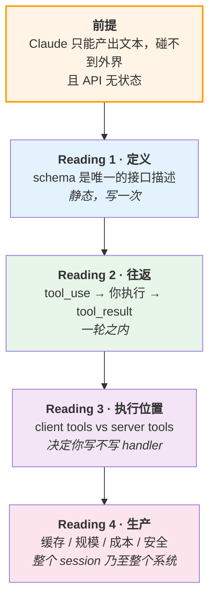
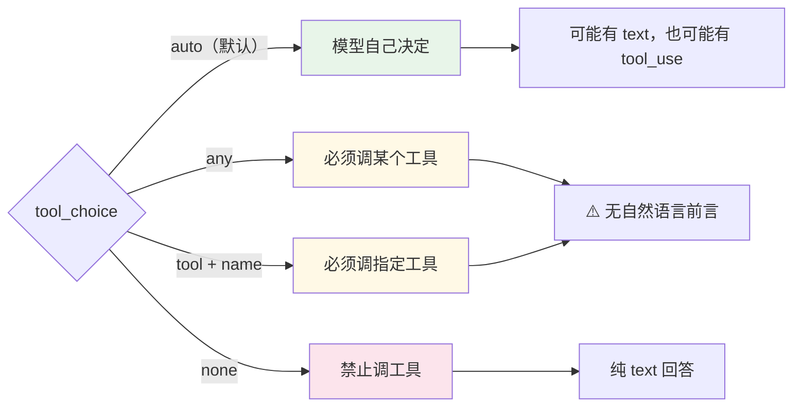
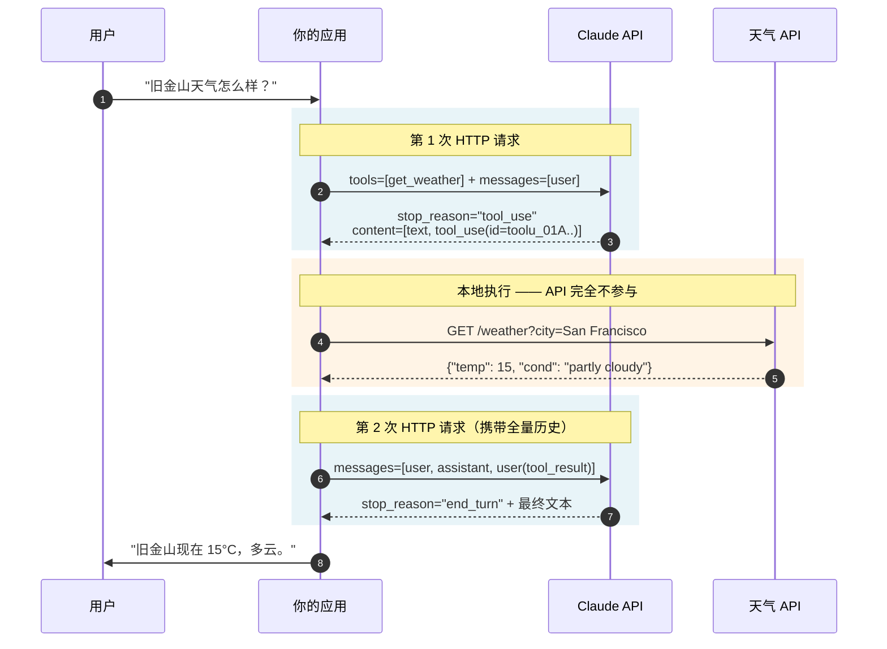
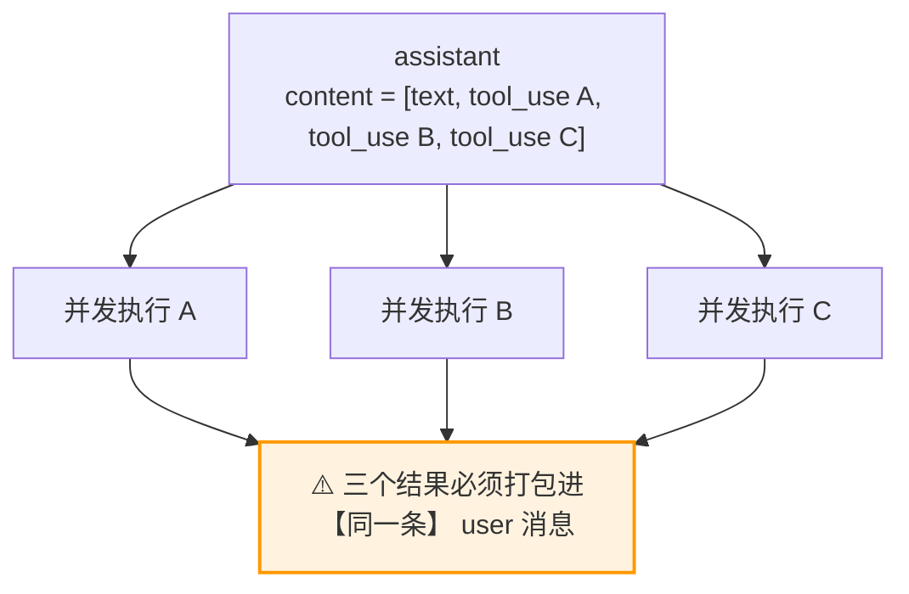
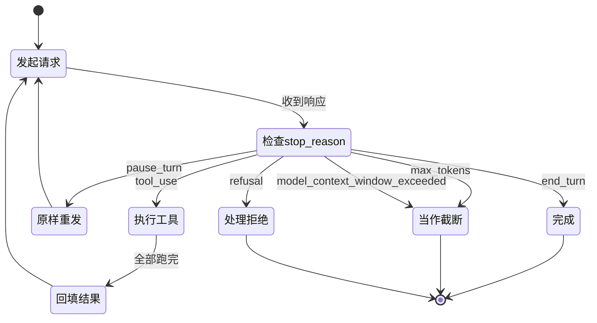
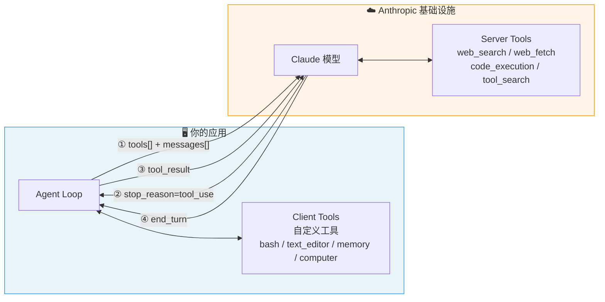

<sub>**BUILDING WITH THE CLAUDE API · PHASE 3**</sub>

# Tool Use 周

工具调用（tool use）让 Claude "call functions that you define or that Anthropic provides"（Anthropic）。本周按一个 harness 工程师需要的方式来学它——不是当成一个 API 参数，而是当成**模型与外部世界之间唯一的那道桥**：

- **工具定义** —— 你用一段 JSON Schema 描述一个能力，模型据此决定何时调、传什么参数。写得好不好，直接决定调用质量。
- **调用往返** —— 模型发出结构化请求，**你的代码**执行，结果回填进对话。模型自己碰不到任何东西。
- **生产边界** —— 缓存、规模化、成本、安全。这部分决定 demo 能不能变成产品。

**形式**：单周，自定进度
**总时长**：约 55 分钟阅读，外加 Anthropic Academy 课时（自定进度）
**怎么读**：四篇 reading 是自足的——**它们就是课程本身**。外部链接是**来源**：想看原文或更深的细节时再按指引去查。本页之外必读的只有 Academy 课时（需注册）和两处官方文档的指定小节，其余都可选。
**节奏**：按建议顺序走，时间自己安排；每篇结构一致：导语 → 正文 → 来源

---

### 目录

| | 内容 | 时长 | |
|---|---|---|---|
| | [本周脉络：一个前提，四个问题](#本周脉络一个前提四个问题) | 5 min | 定位 |
| | [Anthropic Academy · Tool Use 单元](#课程材料--先看) | 自定进度 | **必修** |
| 1 | [Reading 1 · 定义一个工具：schema 就是全部接口](#reading-1--定义一个工具schema-就是全部接口) | 12 min | **必修** |
| 2 | [Reading 2 · 一次完整的往返](#reading-2--一次完整的往返) | 15 min | **必修** |
| 3 | [Reading 3 · 代码在哪里跑](#reading-3--代码在哪里跑) | 10 min | **必修** |
| 4 | [Reading 4 · 生产边界：什么会塌，怎么撑住](#reading-4--生产边界什么会塌怎么撑住) | 15 min | **必修** |
| A | [附录 A · 按症状查表](#附录-a--按症状查表) | — | 速查 |
| B | [附录 B · 课程录制后 API 变了什么](#附录-b--课程录制后-api-变了什么) | — | 速查 |
| C | [附录 C · 参考实现](#附录-c--参考实现) | — | 速查 |

---

<sub>**定位**</sub>

## 本周脉络：一个前提，四个问题

本周所有内容都从一个事实推出来——**Claude 只能产出文本，它碰不到任何东西**。

它读不了你的数据库，发不了邮件，看不到今天的天气。所谓"工具调用"，本质上是模型**用一段结构化的 JSON 说出"我想调这个函数、传这些参数"**，然后**你的代码**去真正执行，再把结果说给它听。模型全程没碰过外界。

叠加上一阶段那个前提——**API 是无状态的，每次请求都要把完整历史重发一遍**——就得到本周的四个问题，每篇 reading 答一个：

| 问题 | 答案 |
|---|---|
| 模型怎么知道有哪些工具、什么时候该调？ | → **Reading 1**：靠你写的 schema，尤其是 description |
| 一次调用在协议层到底怎么走？ | → **Reading 2**：`tool_use` 出去，`tool_result` 回来，你负责搬运 |
| 这段代码到底谁在跑？ | → **Reading 3**：绝大多数在你的机器上，少数在 Anthropic 那边 |
| 上了生产之后什么会塌？ | → **Reading 4**：缓存、规模、成本、安全 |



如果这条线记不住，换个助记法——**四篇对应四个越来越长的时间尺度**：写一次就不动的（定义）→ 一轮之内必须闭合的（往返）→ 一次请求里谁执行（位置）→ 跨整个 session 和整个系统要守住的（生产）。

### 建议顺序

顺序别打乱，时间怎么分自己定。必修项约 55 分钟外加 Academy 课时。

**Step 1** · Anthropic Academy「Tool Use」单元（需注册，自定进度）· **必修**
**Step 2** · Reading 1 · 定义一个工具（12 min）· **必修**
**Step 3** · Reading 2 · 一次完整的往返（15 min）· **必修**
**Step 4** · Reading 3 · 代码在哪里跑（10 min）· **必修**
**Step 5** · Reading 4 · 生产边界（15 min）· **必修**

附录 A/B/C 不用线性读，需要时查。

---

<sub>**课程材料 · 先看**</sub>

## 课程材料 · 先看

Anthropic Academy《Building with the Claude API》的 Tool Use 单元，九个课时。它把一个手写的 agentic loop 从零建起来——先定 schema，再处理多 block 响应，再回填结果，再套上循环，最后接入内置工具。**这条建构路线是这门课最好的部分**，比任何文档的分类式组织都更容易形成肌肉记忆。

| 课时 | 内容 |
|---|---|
| [Tool schemas](https://anthropic.skilljar.com/claude-with-the-anthropic-api/287753) | 三段式规格；让 Claude 帮你生成 schema 的技巧 |
| [Handling message blocks](https://anthropic.skilljar.com/claude-with-the-anthropic-api/287757) | 响应变成多 block；必须完整保存 |
| [Sending tool results](https://anthropic.skilljar.com/claude-with-the-anthropic-api/287752) | `tool_result` 的三个字段；ID 配对 |
| [Multi-turn conversations](https://anthropic.skilljar.com/claude-with-the-anthropic-api/287750) | 重构 helper 支持多 block |
| [Implementing multiple turns](https://anthropic.skilljar.com/claude-with-the-anthropic-api/287758) | `stop_reason` 驱动的循环；错误处理 |
| [Using multiple tools](https://anthropic.skilljar.com/claude-with-the-anthropic-api/287749) | schema 列表 + 路由函数 |
| [Fine grained tool calling](https://anthropic.skilljar.com/claude-with-the-anthropic-api/313160) | 流式下的 JSON 缓冲与校验 |
| [The web search tool](https://anthropic.skilljar.com/claude-with-the-anthropic-api/287755) | 第一个"不用你实现"的工具 |
| [The text edit tool](https://anthropic.skilljar.com/claude-with-the-anthropic-api/287760) | Anthropic 定义 schema、你负责执行 |

> **看之前提个醒。** 课程录制于 Claude 3.5 / 3.7 Sonnet 时代。它教的**方法**至今成立——schema 怎么写、循环怎么转、结果怎么回填，这些是本周四篇 reading 的骨架。但它教的**若干具体写法**已经跟不上当前 API：采样参数被移除了、响应里多了 thinking block、`stop_reason` 多了几个取值、内置工具的版本字符串换了。
>
> 处理办法和你看任何有年头的教程一样：**看课程是为了理解它在解决什么问题，然后用本页 reading 里的当前写法去解决。** 具体差异不必现在记，四篇 reading 会在对应位置就地标出；需要逐条对照时查[附录 B](#附录-b--课程录制后-api-变了什么)。

---

<sub>**READING 1 · 12 MIN**</sub>

## Reading 1 · 定义一个工具：schema 就是全部接口

模型对你的工具**一无所知**，除了你写进 schema 的那些字。它看不到函数体、看不到你的数据库、不知道调用失败会怎样。这段 JSON 就是全部接口——**description 写得好不好，是决定工具调用质量的头号因素**，其重要性超过模型选择。

### 三个必填字段

```json
{
  "name": "get_weather",
  "description": "Get the current weather in a given location",
  "input_schema": {
    "type": "object",
    "properties": {
      "location": {
        "type": "string",
        "description": "The city and state, e.g. San Francisco, CA"
      },
      "unit": {
        "type": "string",
        "enum": ["celsius", "fahrenheit"],
        "description": "The unit of temperature, either 'celsius' or 'fahrenheit'"
      }
    },
    "required": ["location"]
  }
}
```

| 字段 | 要求 |
|---|---|
| `name` | 匹配正则 `^[a-zA-Z0-9_-]{1,64}$` |
| `description` | 纯文本。官方建议**至少 3–4 句**，复杂工具更多 |
| `input_schema` | 标准 [JSON Schema](https://json-schema.org/)，顶层 `type` 必须是 `object` |

JSON Schema 不是 AI 专用的东西——它是存在多年的通用数据校验规范，AI 社区只是拿来描述函数参数。

### description 怎么写

一个对照就够了。**同一个工具，同一个模型，差别全在描述。**

```json
// ❌ 差
{ "description": "Gets the stock price for a ticker." }
```

```json
// ✅ 好
{
  "description": "Retrieves the current stock price for a given ticker symbol. The ticker symbol must be a valid symbol for a publicly traded company on a major US stock exchange like NYSE or NASDAQ. The tool will return the latest trade price in USD. It should be used when the user asks about the current or most recent price of a specific stock. It will not provide any other information about the stock or company."
}
```

差的那版留下一堆没答的问题：返回什么货币？哪个交易所？实时还是延迟？什么时候该用？**什么时候不该用？** 模型只能猜，猜错就是一次错误调用。

写描述时逐条回答这五件事：

1. 这个工具**做什么**
2. **什么时候**该用
3. **什么时候不该用**（最容易漏，但对避免误触发最有效）
4. 每个参数的**含义和影响**
5. 有什么**限制**、不返回什么

### 四条工具设计原则

1. **描述写到极致详细** —— 目前为止影响最大的单一因素。
2. **合并相关操作** —— 与其做 `create_pr` / `review_pr` / `merge_pr` 三个工具，不如做一个带 `action` 参数的。工具越少越强，选择歧义越小。模型在超过 30–50 个工具后选择准确率会明显下降。
3. **用命名空间前缀** —— `github_list_prs`、`slack_send_message`。工具库变大后尤其关键。
4. **返回高信噪比结果** —— 返回语义化、稳定的标识符（slug / UUID），只包含模型下一步推理需要的字段。臃肿的返回值既浪费 context，又让模型难以提取重点。

### 后台发生了什么

传 `tools` 参数时，API 会自动构造一段特殊的 system prompt：

```text
In this environment you have access to a set of tools you can use to answer the user's question.
{{ FORMATTING INSTRUCTIONS }}
Here are the functions available in JSONSchema format:
{{ TOOL DEFINITIONS IN JSON SCHEMA }}
{{ USER SYSTEM PROMPT }}
{{ TOOL CONFIGURATION }}
```

注意**你自己的 system prompt 被夹在中间**。这解释了两件事：工具有固定 token 开销（Opus 5 约 286 tokens，`tool_choice` 为 `any`/`tool` 时约 406），以及为什么工具定义的顺序会影响 prompt 缓存（见 Reading 4）。

### 用示例补足复杂 schema

描述优先，但对**嵌套对象、格式敏感参数**的工具，几个示例胜过再多文字：

```json
{
  "input_examples": [
    { "location": "San Francisco, CA", "unit": "fahrenheit" },
    { "location": "Tokyo, Japan", "unit": "celsius" },
    { "location": "New York, NY" }
  ]
}
```

第三个刻意省略 `unit`，是在演示"这个参数可选"。每个示例必须通过 `input_schema` 校验，否则 400；服务端工具不支持；成本约 20–50 tokens（复杂嵌套 100–200）。

### 用 `strict` 把格式错误焊死

默认情况下参数可能缺失或类型不对——模型会自动重试 2–3 次补全，之后才向用户道歉。`strict` 把这件事从"靠描述和重试"变成"靠语法约束"：

```json
{
  "name": "book_flight",
  "strict": true,
  "input_schema": {
    "type": "object",
    "properties": {
      "destination": { "type": "string" },
      "date": { "type": "string", "format": "date" },
      "passengers": { "type": "integer", "enum": [1, 2, 3, 4, 5, 6, 7, 8] }
    },
    "required": ["destination", "date", "passengers"],
    "additionalProperties": false
  }
}
```

`strict` 是**工具定义的顶层字段**（不是放在 `tool_choice` 里），schema 必须有 `additionalProperties: false` 和 `required`。首次使用有一次性语法编译延迟，之后 24 小时走缓存；改 schema 结构或改工具集会失效，只改 `name` / `description` 不会。

> **`strict` 保证的边界。** 它消除的是**格式层**的错（缺必填、类型不对、多余字段），不是**语义层**的。这些情况仍需客户端校验：
> - **异常结束**：`refusal` / `max_tokens` / `model_context_window_exceeded` 都可能给出截断或空内容
> - **不受支持的约束**：`minimum` / `maxLength` / 递归 schema / 外部 `$ref` 等不进语法，SDK 会剥掉再在客户端校验
> - **业务规则**：这个 ticker 真实存在吗？这个用户有权限下单吗？——schema 管不了

支持的类型：object / array / string / integer / number / boolean / null、`enum`、`const`、`anyOf`、`allOf`，以及 `date-time` / `date` / `email` / `uri` / `uuid` 等字符串格式。

### 控制什么时候调：`tool_choice`



传了 `tools` 时默认 `auto`；没传时默认 `none`。任意取值都可以加 `"disable_parallel_tool_use": true` 限制一次只调一个。

四个坑：

1. **`any` / `tool` 会吞掉自然语言前言。** API 预填 assistant 消息来强制调用，模型不会在 `tool_use` 前输出解释文字，即使你明确要求。想同时要解释和强制调用，用 `auto` + 在 user 消息里明说：`"Use the get_weather tool in your response."` 官方测试表明这不降低性能。
2. **改 `tool_choice` 会让 message 缓存失效**（工具定义和 system prompt 仍缓存）。
3. **手动 extended thinking 与强制调用不兼容**，`any` / `tool` 直接报错。自适应思考（含 Opus 5 这种默认开思考的）则支持。
4. 想同时保证"一定调工具"和"参数一定合法"：`tool_choice: any` + `strict: true`。

不改参数、只用 prompt 微调触发倾向也有效：想多调工具加 `"Use the tools to investigate before responding."`，想保守加 `"Use your judgment about whether to call a tool or respond directly."`

### 来源

- **[Define tools](https://platform.claude.com/docs/en/agents-and-tools/tool-use/define-tools)** — 官方措辞和更多示例；本节已覆盖主体
- **[Strict tool use](https://platform.claude.com/docs/en/agents-and-tools/tool-use/strict-tool-use)** · 可选 — 只需看 schema 支持范围那一节
- **[Writing tools for agents](https://www.anthropic.com/engineering/writing-tools-for-agents)** · 可选 — 工具设计（合并、命名、返回值塑形）的深入版
- 课程：[Tool schemas](https://anthropic.skilljar.com/claude-with-the-anthropic-api/287753)

---

<sub>**READING 2 · 15 MIN**</sub>

## Reading 2 · 一次完整的往返

这是本周的核心机制。理解了这一节，剩下的都是它的变体。

**先记住一句话：一切都走 `POST /v1/messages`。** 没有 `/v1/tools` 端点，也没有 `tool` 或 `function` 这种特殊 role——这是 Claude API 和某些其他厂商的显著差异。工具调用完全嵌在普通的 user / assistant 消息结构里：

| 角色 | 可包含的 content block |
|---|---|
| `assistant` | `text`、`thinking`、`tool_use`、`server_tool_use` |
| `user` | `text`、`image`、`document`、**`tool_result`** |

也就是说——**工具的执行结果是以 `user` 消息的身份回填进历史的**。模型请求工具，你执行，然后你以"用户"的身份把结果告诉它。

### 四步，逐条报文



**① 请求**

```json
{
  "model": "claude-opus-5",
  "max_tokens": 16000,
  "tools": [{ "name": "get_weather", "description": "...", "input_schema": { "...": "..." } }],
  "messages": [{ "role": "user", "content": "What's the weather in San Francisco?" }]
}
```

**② 模型返回 `tool_use`**

```json
{
  "stop_reason": "tool_use",
  "role": "assistant",
  "content": [
    { "type": "text", "text": "I'll check the current weather in San Francisco for you." },
    {
      "type": "tool_use",
      "id": "toolu_01A09q90qw90lq917835lq9",
      "name": "get_weather",
      "input": { "location": "San Francisco, CA", "unit": "celsius" }
    }
  ]
}
```

`id` 后面回填时要原样带回做配对；`input` **已经是解析好的对象**，不是字符串。

注意 text 和 tool_use **并存**——模型常先说一句"我来帮你查"。把这些当普通文本处理，**不要依赖任何固定措辞格式**。

> **别用索引取 block。** `response.content[1]` 这种写法在三种情况下会崩：Opus 5 默认开 thinking（content 变成 `[thinking, text, tool_use]`）、`tool_choice: any`（只有 `[tool_use]`）、并行调用（漏掉第二个）。永远按类型过滤：
> ```python
> tool_uses = [b for b in response.content if b.type == "tool_use"]
> ```

**③ 本地执行后回填**

```json
{
  "tools": [ /* 必须原样重传 */ ],
  "messages": [
    { "role": "user", "content": "What's the weather in San Francisco?" },
    { "role": "assistant", "content": [ /* 上一步完整的 content，含 tool_use */ ] },
    {
      "role": "user",
      "content": [
        {
          "type": "tool_result",
          "tool_use_id": "toolu_01A09q90qw90lq917835lq9",
          "content": "15 degrees Celsius, partly cloudy"
        }
      ]
    }
  ]
}
```

三个高频错误都出在这一步：

- **忘了把 assistant 那轮 append 回去** → API 找不到对应的 tool_use
- **第二次请求没传 `tools`** → 模型不认识历史里的工具引用
- **只存了 text、丢了 `tool_use` block** → 同上。**永远 append 完整的 `response.content`**

**④ 最终答案**：`stop_reason: "end_turn"`，纯文本。

### `tool_result` 的三条格式红线

这三条不知道就会 400，而且报错信息不会直接告诉你违反了哪条。

**红线一：`tool_result` 必须排在 user 消息 content 数组的最前面。** 任何文字都得放在所有 tool_result 之后。

```json
// ❌ 400
{ "role": "user", "content": [
    { "type": "text", "text": "Here are the results:" },
    { "type": "tool_result", "tool_use_id": "toolu_01" }
]}

// ✅
{ "role": "user", "content": [
    { "type": "tool_result", "tool_use_id": "toolu_01" },
    { "type": "text", "text": "What should I do next?" }
]}
```

**红线二：`tool_result` 消息必须紧跟对应的 `tool_use` 消息**，中间不能插任何其他消息。

**红线三：如果这一轮同时调了尚未出结果的服务端工具**，user 消息里**只能有 `tool_result` block**，一个字都不能加。

看到 `"tool_use ids were found without tool_result blocks immediately after"`，就从这三条查起。

`content` 除了字符串，也可以是 block 数组（支持 `text` / `image` / `document` / `search_result`），甚至可以**完全省略**（空 `tool_result` 合法）。

### 失败也要回填

工具抛异常时**仍然必须给一个 result block**——每个 `tool_use.id` 都要有配对的 `tool_result`，缺一个就 400。用 `is_error: true` 标记：

```json
{
  "type": "tool_result",
  "tool_use_id": "toolu_01A...",
  "content": "ConnectionError: the weather service API is not available (HTTP 500)",
  "is_error": true
}
```

**错误信息要写得可操作**——它是给模型看的，决定它下一步怎么恢复：

| ❌ | ✅ |
|---|---|
| `"failed"` | `"Rate limit exceeded. Retry after 60 seconds."` |
| `"error"` | `"Error: Missing required 'location' parameter"` |
| `"not found"` | `"City 'xyz' not found. Provide a valid city name, e.g. 'Tokyo, Japan'."` |

服务端工具的错误**不用你管**，Claude 自己处理并给用户替代回答。

### 并行调用：默认开启

一条 assistant 消息里可能有**多个** `tool_use` block。



**所有 `tool_result` 必须放进同一条 user 消息。** 拆成多条不会报错，但会**悄悄训练模型以后不再做并行调用**——这是最隐蔽的性能退化，没有任何信号提示你。

```python
tool_results = []
for block in response.content:
    if block.type != "tool_use":
        continue
    try:
        result = execute_tool(block.name, block.input)
        tool_results.append({"type": "tool_result", "tool_use_id": block.id, "content": result})
    except Exception as e:
        tool_results.append({
            "type": "tool_result", "tool_use_id": block.id,
            "content": f"{type(e).__name__}: {e}. Check the input and retry.",
            "is_error": True,
        })

messages.append({"role": "user", "content": tool_results})   # ← 一条
```

### 从一次往返到循环

真实 agent 要循环到模型不再要工具。驱动整个循环的是 `stop_reason`：



| `stop_reason` | 含义 | 怎么处理 |
|---|---|---|
| `end_turn` | 自然结束 | 退出循环 |
| `tool_use` | 要调工具 | 执行 → 回填 → 继续 |
| `max_tokens` | 撞到上限 | 调大或续写。**若最后一个 block 是不完整的 `tool_use`，必须提高 `max_tokens` 重试** |
| `stop_sequence` | 命中自定义停止序列 | 读 `stop_sequence` 字段 |
| `pause_turn` | 服务端工具循环达内部上限（默认 10 次） | **原样重发**，服务端自动续跑 |
| `refusal` | 安全拒绝（HTTP 200，不是错误） | 读 `stop_details.category` |
| `model_context_window_exceeded` | 填满上下文窗口 | 当作截断 |

只判 `!= "tool_use"` 就退出是不够的——`pause_turn` 会被当成"完成"，答案**静默截断**，没有任何报错。混用服务端工具时这个坑尤其容易踩。

`pause_turn` 的正确处理：

```python
if response.stop_reason == "pause_turn":
    messages.append({"role": "assistant", "content": response.content})   # append，不是重建
    response = client.messages.create(
        model="claude-opus-5",
        max_tokens=16000,        # 必填
        messages=messages,
        tools=tools,
    )
```

两个容易抄错的点：**必须 append 而不是重建 `messages`**（官方示例那种重建写法是单轮演示，真实 agent 里会丢掉全部历史）；**`max_tokens` 是必填参数**。另外**不要**追加 `"Continue."` ——API 检测到结尾的 `server_tool_use` block 就知道要续跑。

最后，`refusal` 时 `content` 可能是空数组，所以**先判 `stop_reason` 再碰 `content`**；循环一定要设最大迭代次数。完整实现见[附录 C](#附录-c--参考实现)。

### 来源

- **[Handle tool calls](https://platform.claude.com/docs/en/agents-and-tools/tool-use/handle-tool-calls)** — 结果格式和错误信号的完整规则
- **[Handling stop reasons](https://platform.claude.com/docs/en/build-with-claude/handling-stop-reasons)** · 必读 — 只看 "tool_use" 一节，服务端工具与客户端工具混合时的 fallback 规则在那里
- **[Parallel tool use](https://platform.claude.com/docs/en/agents-and-tools/tool-use/parallel-tool-use)** · 可选
- 课程：[Handling message blocks](https://anthropic.skilljar.com/claude-with-the-anthropic-api/287757) · [Sending tool results](https://anthropic.skilljar.com/claude-with-the-anthropic-api/287752) · [Implementing multiple turns](https://anthropic.skilljar.com/claude-with-the-anthropic-api/287758)

---

<sub>**READING 3 · 10 MIN**</sub>

## Reading 3 · 代码在哪里跑

工具分两大类，**唯一的本质区别就是代码在哪执行**。这个区别决定了你要不要写 handler、要不要处理 `tool_result`、怎么计费。



| | **Client Tools** | **Server Tools** |
|---|---|---|
| 执行位置 | 你的应用 | Anthropic 基础设施 |
| 要写 handler 吗 | ✅ 必须 | ❌ 不用 |
| 会不会中断成 `stop_reason: tool_use` | ✅ 会，等你回填 | ❌ 单次响应内完成 |
| 结果 block | `tool_result`（你构造） | `web_search_tool_result` 等（API 返回） |
| 计费 | 只算 token | token + 可能有按次计费 |

服务端工具用起来最省事——一次请求就拿到带引用的答案，不需要 loop：

```json
{
  "model": "claude-opus-5",
  "max_tokens": 1024,
  "tools": [{ "type": "web_search_20260209", "name": "web_search" }],
  "messages": [{ "role": "user", "content": "火星车最新进展？" }]
}
```

### 容易混淆的中间类：Anthropic 定义 schema 的客户端工具

`bash` / `text_editor` / `memory` / `computer` 长得像内置工具，**但代码在你的机器上跑**。Anthropic 只是替你写好了 schema（并针对它训练过模型），执行和回填 `tool_result` 仍然是你的事。

两个后果：

- 这类工具**不要传 `input_schema`**，schema 已内建在模型里
- **不要**自己定义一个名叫 `"bash"` 的自定义工具——那是完全不同的东西，没有任何内建行为

| 工具 | `type` | `name` |
|---|---|---|
| Text editor（Claude 4+） | `text_editor_20250728` | `str_replace_based_edit_tool` |
| Text editor（更早模型） | `text_editor_20250124` | `str_replace_editor` |
| Bash | `bash_20250124` | `bash` |
| Memory | `memory_20250818` | `memory` |
| Computer use | `computer_20251124` | — |

> `type` 和 `name` 是**配对**的。只改一个 → 400。这是升级模型时最常见的 tool use 报错来源。

### 服务端工具目录

| 工具 | `type` | 状态 | 用途 |
|---|---|---|---|
| Web search | `web_search_20260318` / `_20260209` / `_20250305` | GA | 联网搜索，带引用 |
| Web fetch | `web_fetch_20260318` / `_20260309` / `_20260209` / `_20250910` | GA | 抓取指定网页 / PDF 全文 |
| Code execution | `code_execution_20260521` / `_20260120` / `_20250825` | GA | 沙箱跑 Python / bash |
| Tool search | `tool_search_tool_regex_20251119` / `..._bm25_20251119` | GA | 上千工具时按需加载 |
| Advisor | `advisor_20260301` | Beta | 快模型中途咨询强模型 |
| MCP connector | `mcp_toolset` | Beta | 直连远程 MCP server |

### 版本号后缀怎么读

`_YYYYMMDD` 在行为、schema 或模型支持变化时递增，旧版本保留。**理解版本之间的关系，才知道该不该升**：

| 关系 | 例子 | 怎么选 |
|---|---|---|
| **按功能特征区分** | `web_search_20260209` 加了 dynamic filtering；`code_execution_20260120` 加了 PTC | 新旧**都是当前版本**，看你要不要那个能力 |
| **绑定特定模型** | `text_editor_20250728` 是 Claude 4+ 专属 | 看你用的模型 |
| **并列变体，不分新旧** | `tool_search_tool_regex_*` vs `..._bm25_*` | 同时发布的两种算法，互不取代 |
| **纯粹的旧版本** | `code_execution_20250522` 只支持 Python | 直接升 |

`mcp_toolset` 不带日期后缀，版本由 `anthropic-beta` header 承载。

> `web_search_20260209` 及以后版本内建 dynamic filtering（内部自动跑 code execution），**不要再单独声明 `code_execution`**——两个执行环境会让模型混乱。

### 混合场景

一条 assistant 消息里可能同时有尚未出结果的 `server_tool_use` 和你的客户端 `tool_use`。此时：

- `stop_reason` 是 `tool_use`
- 你的 user 消息里**只能放客户端工具的 `tool_result`，一个字的 text 都不能加**
- 服务端工具在你回填后的那次请求里执行，结果出现在下一个响应开头

加了文字会提前结束 turn，API 返回 400 并指出那个未完成的服务端工具。

### 来源

- **[Server tools](https://platform.claude.com/docs/en/agents-and-tools/tool-use/server-tools)** — 服务端工具共有的机制
- **[Tool reference](https://platform.claude.com/docs/en/agents-and-tools/tool-use/tool-reference)** — 全部 `type` 字符串和 beta header 的权威列表；升级时查这里
- **[Text editor tool](https://platform.claude.com/docs/en/agents-and-tools/tool-use/text-editor-tool)** · 可选 — 命令集（`view` / `create` / `str_replace` / `insert`）
- 课程：[The web search tool](https://anthropic.skilljar.com/claude-with-the-anthropic-api/287755) · [The text edit tool](https://anthropic.skilljar.com/claude-with-the-anthropic-api/287760)

---

<sub>**READING 4 · 15 MIN**</sub>

## Reading 4 · 生产边界：什么会塌，怎么撑住

前三篇讲的东西在 demo 里都能跑通。这一篇讲的是**上量之后**的问题：成本、规模、以及安全。

### 缓存：工具定义在位置 0

请求的渲染顺序固定是 **`tools` → `system` → `messages`**，而 prompt 缓存是**前缀匹配**的。这意味着：

**增删或重排任何一个工具，整个缓存全部失效。** 中途切换模型也全失效（缓存按模型隔离）。

三条工程纪律：

- **工具列表确定性序列化**（按 name 排序）。不要用 `set` 迭代，不要用不排序的 `json.dumps`——这类 bug 不报错，只是让你的缓存命中率永远是 0
- **需要"模式切换"时不要换工具集**。给模型一个记录模式转换的工具，或把模式作为 message 内容传
- **验证方式**：看 `usage.cache_read_input_tokens`。重复请求下它一直是 0，说明前缀里有隐形失效因子（时间戳、UUID、不确定的序列化顺序）

把 `cache_control` 打在最后一个 system block 上，可同时缓存 tools + system。

### 规模：上千个工具怎么办

Reading 1 说过模型在 30–50 个工具后选择准确率下降。而且一个典型的多服务集合（GitHub、Slack、Sentry、Grafana、Splunk）光工具定义就能吃掉约 55k tokens。

**Tool search + `defer_loading`** 解决这个：把工具标成延迟加载，模型需要时先搜索、再按需展开。官方数据是**定义 token 通常减少 85% 以上**。

```json
{
  "tools": [
    { "type": "tool_search_tool_regex_20251119", "name": "tool_search_tool_regex" },
    { "name": "get_weather", "description": "...", "input_schema": {}, "defer_loading": true }
  ]
}
```

关键机制：**`defer_loading: true` 的工具在计算 cache key 之前就被剥离**，根本不进 system prompt 前缀。所以加延迟工具**不会**让已有缓存失效，跨"发现"和"调用"两轮缓存都保持有效。

几条硬约束：

- 搜索工具本身不能设 `defer_loading`，且至少要留一个非延迟工具，否则 400 `All tools have defer_loading set`
- **`defer_loading: true` 的工具不能同时带 `cache_control`**，API 返回 400 —— cache breakpoint 要打在非延迟工具上
- 建议把最常用的 3–5 个工具留成非延迟的，省掉一次搜索往返
- 最多 10,000 个延迟工具；每次搜索默认返回最多 5 个

### 成本：把中间结果挡在 context 之外

标准工具调用里每次调用都是一次模型往返，**所有中间结果都进 context**。查 20 个人的预算合规就要 20 次往返，还要把几千行开支明细全拉进上下文。

**Programmatic tool calling** 让模型把多次调用编排进一段脚本：脚本在沙箱里跑，调工具时容器暂停、执行、**结果返回给运行中的代码而不是模型的 context**，脚本用普通循环过滤，**只有最终输出回到模型**。官方测得在 agentic search 基准上性能提升约 11%，输入 token 减少 24%。

```json
{
  "name": "query_orders",
  "input_schema": { "...": "..." },
  "allowed_callers": ["code_execution_20260120"]
}
```

> ⛔ **`allowed_callers` 不是安全边界。** 官方明确：
>
> > "…it is **not a hard API-level block on direct invocation**… **Do not rely on `allowed_callers` as a security boundary.**"
>
> 省略 `"direct"` 只是**引导**模型别直接调，它**仍然可能**返回该工具的 `tool_use`。所以你的路由必须能处理任何已定义工具的直接调用（执行或显式拒绝并回填 `is_error`），真正的鉴权放在**工具函数内部**。

### 手写 loop 还是 Tool Runner

各 SDK 都提供 Tool Runner，自动跑「调 API → 检测 tool_use → 执行你的函数 → 回填 → 循环」，schema 从函数签名和 docstring 自动生成：

```python
from anthropic import beta_tool

@beta_tool
def get_weather(location: str, unit: str = "celsius") -> str:
    """Get current weather for a location.

    Args:
        location: City and state, e.g., San Francisco, CA.
        unit: Temperature unit, either "celsius" or "fahrenheit".
    """
    return f"15 degrees {unit} in {location}"

runner = client.beta.messages.tool_runner(
    model="claude-opus-5",
    max_tokens=16000,
    max_iterations=10,        # ← 别省
    tools=[get_weather],
    messages=[{"role": "user", "content": "What's the weather in Paris?"}],
)

for message in runner:
    print(message)
```

**`max_iterations` 一定要设。** 不设的话唯一退出条件就是模型主动停止调工具——工具之间互相触发时会一直转下去。七个 SDK 都支持这个参数。

什么时候该保留手写 loop：需要自定义传输层；不想引入 beta 依赖；控制流不适配 runner 的每轮钩子；**或者需要处理 `pause_turn`** —— runner 不自动续跑，混用服务端工具时这是硬伤（暂停的 turn 会让 runner 静默退出并当成最终消息返回）。

先手写一遍再用 Runner 是值得的：出问题时你知道该看哪一层。

### 安全：工具结果是不可信输入

这是本周最容易被跳过、代价却最高的一节。

> "Tool results often carry content from sources outside your control: web pages, inbound email, user uploads, third-party APIs. Treat that content as untrusted: an attacker who can influence it may embed instructions that try to redirect Claude (**indirect prompt injection**)."

五条底线：

1. **不可信内容放进 `tool_result` block**，不要放进 `system` prompt 或普通 user `text` block。这不是形式主义——模型对不同通道的信任级别不同。

2. **客户端工具的输入是模型输出，即不可信数据。**
   - `bash`：**必须在隔离沙箱（容器 / VM / 受限用户）中运行、仅允许白名单内的命令、禁止使用 shell 管道符与拼接符（`&&`、`|`、`;`、`` ` ``、`$()`），同时限制执行超时与资源上限并留存日志。** 仅靠黑名单是不安全的——你没法穷举所有危险命令。
   - `text_editor` / `memory`：`path` 规范化后校验仍在项目根内，拒绝 `..`、符号链接、根外绝对路径、URL 编码穿越（`%2e%2e%2f`）。**永远不要**直接拿原始 `path` 调 `open()` / `unlink`。

   ```python
   from pathlib import Path
   PROJECT_ROOT = Path("/srv/workspace").resolve()

   def safe_path(raw: str) -> Path:
       p = (PROJECT_ROOT / raw).resolve()
       if not p.is_relative_to(PROJECT_ROOT):
           raise ValueError(f"path escapes project root: {raw}")
       return p
   ```

3. **有副作用的工具加人工审批门。** 发邮件、改数据库、金融交易——在工具函数里做审批，不要靠 prompt 约束。

4. **web fetch 有数据外泄风险。** 官方明确警告在"Claude 同时处理不可信输入和敏感数据"的环境里启用它的风险。API 本身有一层防护——**Claude 不能动态构造 URL**，只能抓对话上下文里已出现过的。再加上 `allowed_domains` 和 `max_uses` 限制。

5. **沙箱里下载的文件**，写盘前先 `os.path.basename()` 清洗文件名。

### 来源

- **[Tool use with prompt caching](https://platform.claude.com/docs/en/agents-and-tools/tool-use/tool-use-with-prompt-caching)** · 必读 — 什么会让缓存失效
- **[Tool search tool](https://platform.claude.com/docs/en/agents-and-tools/tool-use/tool-search-tool)** · 可选 — 只看 "Limits and best practices"
- **[Programmatic tool calling](https://platform.claude.com/docs/en/agents-and-tools/tool-use/programmatic-tool-calling)** · 可选 — `allowed_callers` 的完整语义
- **[Tool runner (SDK)](https://platform.claude.com/docs/en/agents-and-tools/tool-use/tool-runner)** · 可选
- **[Mitigate jailbreaks and prompt injections](https://platform.claude.com/docs/en/test-and-evaluate/strengthen-guardrails/mitigate-jailbreaks)** · 可选 — 只看 "indirect prompt injection"

---

<sub>**附录 A · 速查**</sub>

## 附录 A · 按症状查表

不用线性读，出问题时按症状找。

### 报错了

| 症状 | 原因 | 修法 |
|---|---|---|
| `tool_use ids were found without tool_result blocks immediately after` | 漏了某个结果 / 中间插了消息 / text 排在 `tool_result` 前 | 查 Reading 2 三条红线 |
| 400，提到某个未完成的 server tool | 该轮同时调了服务端工具，你的 user 消息里带了别的 block | user 消息里只放 `tool_result` |
| 400，`temperature` / `top_p` / `top_k` | 当前模型已移除采样参数 | 删掉，用 prompt 引导 |
| 400，text editor 相关 | `type` 和 `name` 不配对 | `text_editor_20250728` 必须配 `str_replace_based_edit_tool` |
| 400，`All tools have defer_loading set` | 全部工具都延迟了 | 至少留一个非延迟；搜索工具本身不能延迟 |
| 400，`defer_loading` + `cache_control` 同时出现 | 这两个不能共存 | cache breakpoint 打在非延迟工具上 |
| `AttributeError: 'TextBlock' object has no attribute 'input'` | 用索引取 block | 改成按 `type` 过滤 |
| `TypeError: missing required argument: max_tokens` | 续跑请求漏了必填参数 | 补上，一般同原请求 |

### 没报错，但不对劲

| 症状 | 原因 | 修法 |
|---|---|---|
| **答案莫名少一半** | `pause_turn` 被当成完成了 | 显式处理每个 `stop_reason` |
| **模型不再并行调工具了** | 并行结果被拆进了多条 user 消息 | 打包进一条 |
| **`cache_read_input_tokens` 一直是 0** | 前缀有 timestamp / UUID，或工具集序列化不确定 | 确定性序列化，检查前缀 |
| **模型不调工具** | 描述太单薄 | 补描述；或加 `"Use the tools to investigate before responding."` |
| **模型乱调工具** | 描述里 `CRITICAL:` / `MUST` 太激进 | 新模型跟随指令更严格，反而过度触发——删掉 |
| **参数被模型编造** | 描述没说清，或模型能力不足 | 上 `strict: true`；补描述；换 Opus |
| **流式下参数一顿一顿出现** | 这是默认的缓冲 + 校验行为 | 要更快就开 `eager_input_streaming` |
| **循环停不下来** | 没设迭代上限 | 手写 loop 加 `MAX_ITERATIONS`；Runner 传 `max_iterations` |

### 设计选择

| 场景 | 用什么 |
|---|---|
| 参数必须合法 | `strict: true` + `additionalProperties: false` |
| 一定要调工具 | `tool_choice: {"type": "any"}` |
| 复杂嵌套 schema 老调错 | `input_examples` |
| 工具超过 30–50 个 | tool search + `defer_loading` |
| 多步串联、中间结果很大 | programmatic tool calling |
| 不想手写循环 | Tool Runner（但要处理 `pause_turn`） |
| 抓大文档省 token | `web_fetch_20260209+` 的 dynamic filtering |

---

<sub>**附录 B · 速查**</sub>

## 附录 B · 课程录制后 API 变了什么

课程录制于 Claude 3.5 / 3.7 Sonnet 时代。方法仍然成立，以下是具体写法的差异。**照着本页四篇 reading 写就不会踩到这些**——这张表是给"已经按课程写完了代码、需要逐条排查"的情况用的。

### 会直接报错

| 课程写法 | 当前写法 |
|---|---|
| `chat(..., temperature=1.0)` 并透传 | 删掉 `temperature` / `top_p` / `top_k`；Opus 5 / Fable 5 / Opus 4.8 / 4.7 已移除，传非默认值 400 |
| `{"type": "text_editor_20250124", "name": "str_replace_editor"}` | Claude 4+ 用 `{"type": "text_editor_20250728", "name": "str_replace_based_edit_tool"}`，**两个字段必须成对改** |
| `text_editor_20241022` | 已不在当前工具表中 |
| `claude-3-7-sonnet` / `claude-3-5-sonnet` | 已于 2026-02-19 退役，404 |

### 会静默出错（更危险）

| 课程写法 | 问题 |
|---|---|
| `response.content[1].input` | Opus 5 默认开 thinking，content 可能是 `[thinking, text, tool_use]`；`tool_choice: any` 时只有 `[tool_use]` |
| `if response.stop_reason != "tool_use": break` | `pause_turn` / `refusal` / `model_context_window_exceeded` 都被当成"完成"，答案静默截断 |
| `while True` 无迭代上限 | 工具实现有 bug 时无限循环烧 token |
| `max_tokens: 1000` | Opus 5 上这是 thinking + 正文的**总硬上限**，thinking 默认开启会先吃预算 |

### 走的是废弃路径（仍能跑）

| 课程写法 | 当前写法 |
|---|---|
| `fine_grained=True`（beta header） | 工具定义上 `eager_input_streaming: true`，已 GA |
| `web_search_20250305` | `_20260209`（dynamic filtering）或 `_20260318` |
| 实现 `undo_edit` handler | 该命令在 `text_editor_20250728` 已移除 |
| 文档链接 `docs.anthropic.com` | `platform.claude.com` |

### 同期变化的其他 API

课程其他单元如果用到，也要一起改：

| 旧 | 新 |
|---|---|
| `output_format={...}` | `output_config={"format": {"type": "json_schema", "schema": {...}}}`（内层键是 **`schema`**） |
| `thinking={"type": "enabled", "budget_tokens": N}` | `thinking={"type": "adaptive"}` + `output_config={"effort": "..."}` |
| assistant 消息 prefill | 4.6 系列及以后 400；改用 `output_config.format` 或 system prompt |
| beta header `fine-grained-tool-streaming-2025-05-14` / `interleaved-thinking-2025-05-14` / `effort-2025-11-24` / `structured-outputs-2025-11-13` / `token-efficient-tools-2025-02-19` / `output-128k-2025-02-19` | 全部已 GA，删掉 |
| 用 `tiktoken` 估 token | `client.messages.count_tokens()`；tiktoken 是 OpenAI 的分词器，对 Claude 低估约 15–20% |

删完所有 beta header 后，调用点可以从 `client.beta.messages.create(...)` 换回 `client.messages.create(...)`。

### 自查命令

```bash
rg -n "temperature|top_p|top_k" --type py
rg -n "content\[[0-9]\]" --type py
rg -n "stop_reason.*!=.*tool_use" --type py
rg -n "str_replace_editor|text_editor_2024|text_editor_20250124" --type py
rg -n "fine_grained|output_format|budget_tokens|tiktoken" --type py
rg -n "claude-3-[57]-sonnet|claude-3-opus" --type py
rg -n "while True" --type py
```

---

<sub>**附录 C · 速查**</sub>

## 附录 C · 参考实现

课程那个提醒事项 agent 的完整现代化版本，覆盖四篇 reading 的全部规则。可直接运行。

```python
"""
Agentic loop 参考实现。

关键点（对应正文位置）：
  · 没有 temperature —— 当前模型已移除            [附录 B]
  · 按 block.type 过滤，不用索引                  [Reading 2]
  · 显式处理每个 stop_reason                      [Reading 2]
  · 并行结果打包进一条 user 消息                   [Reading 2]
  · 失败也回填 is_error，错误信息可操作             [Reading 2]
  · 循环有迭代上限                                [Reading 4]
  · strict + additionalProperties: false          [Reading 1]
  · 时区：IANA 时区内做日历算术，DST 空洞归一化      [见下]
"""
import json
from datetime import datetime, timedelta, timezone as dt_timezone
from zoneinfo import ZoneInfo          # Python 3.9+

import anthropic

client = anthropic.Anthropic()
MODEL = "claude-opus-5"
MAX_ITERATIONS = 10


# ── 工具实现 ────────────────────────────────────────────────────────────
def get_current_datetime(timezone: str) -> str:
    """返回指定 IANA 时区的当前时间，ISO 8601 带 offset。"""
    return datetime.now(ZoneInfo(timezone)).isoformat()


def add_duration_to_datetime(
    datetime_str: str, duration: int, unit: str, timezone: str
) -> str:
    """在指定 IANA 时区里做日历加减，返回真实存在且 offset 正确的 ISO 8601。

    两个坑都要躲：
      1. 必须先 astimezone(ZoneInfo) 再加。fromisoformat() 只还原出一个
         「固定 offset」的时区，直接加 timedelta 会把原 offset 一路带过去
         —— 跨夏令时边界结果就偏一小时。
      2. 加完还要经 UTC 往返归一化。ZoneInfo 的算术不会自动处理
         spring-forward 空洞：3 月某天 01:30 + 1h 会算出本地根本不存在的
         02:30，往返一次才会落到真实的 03:30。
    """
    base = datetime.fromisoformat(datetime_str)
    if base.tzinfo is None:
        raise ValueError(
            f"datetime_str must include a UTC offset "
            f"(e.g. '2050-01-01T09:00:00-05:00'), got: {datetime_str}"
        )
    delta = {
        "seconds": timedelta(seconds=duration),
        "minutes": timedelta(minutes=duration),
        "hours":   timedelta(hours=duration),
        "days":    timedelta(days=duration),
        "weeks":   timedelta(weeks=duration),
    }[unit]
    zone = ZoneInfo(timezone)
    result = base.astimezone(zone) + delta                      # ①
    return result.astimezone(dt_timezone.utc).astimezone(zone).isoformat()   # ②


def set_reminder(content: str, timestamp: str) -> str:
    """timestamp 必须带 offset。真实实现应写库 / 调日历 API。"""
    when = datetime.fromisoformat(timestamp)
    if when.tzinfo is None:
        raise ValueError(f"timestamp must include a UTC offset, got: {timestamp}")
    return f"Reminder set for {when.astimezone(ZoneInfo('UTC')).isoformat()} (UTC): {content}"


# ── 工具定义 ────────────────────────────────────────────────────────────
TOOLS = [
    {
        "name": "get_current_datetime",
        "description": (
            "Returns the current date and time in a given IANA timezone, as an ISO 8601 "
            "string with a UTC offset (e.g. '2026-08-02T14:30:00-04:00'). Use this whenever "
            "the request depends on 'now' (today, tomorrow, in 3 weeks) and no explicit date "
            "was given. It does NOT do date arithmetic — use add_duration_to_datetime for that. "
            "Always pass the user's timezone; ask them for it if it is not already known."
        ),
        "input_schema": {
            "type": "object",
            "properties": {
                "timezone": {
                    "type": "string",
                    "description": "IANA timezone name, e.g. 'America/New_York' or 'Asia/Seoul'.",
                }
            },
            "required": ["timezone"],
            "additionalProperties": False,
        },
        "strict": True,
    },
    {
        "name": "add_duration_to_datetime",
        "description": (
            "Adds a duration to an ISO 8601 datetime and returns the result, also as ISO 8601 "
            "with a UTC offset. Use this for any date arithmetic — do not compute dates yourself. "
            "The input MUST include a UTC offset; call get_current_datetime first if the base "
            "date is 'today'. Arithmetic is done in the given IANA timezone, so the local "
            "wall-clock time is preserved across daylight saving boundaries: 9am plus 177 days "
            "is still 9am local, and the returned offset reflects DST on the result date. "
            "If the result would land in a spring-forward gap (a local time that does not "
            "exist), it is normalized forward to a real instant."
        ),
        "input_schema": {
            "type": "object",
            "properties": {
                "datetime_str": {
                    "type": "string",
                    "description": "Base datetime, ISO 8601 with offset, e.g. '2050-01-01T09:00:00-05:00'.",
                },
                "duration": {"type": "integer", "description": "Amount to add (may be negative)."},
                "unit": {
                    "type": "string",
                    "enum": ["seconds", "minutes", "hours", "days", "weeks"],
                    "description": "Unit for the duration.",
                },
                "timezone": {
                    "type": "string",
                    "description": "IANA timezone the arithmetic is performed in, e.g. 'America/New_York'.",
                },
            },
            "required": ["datetime_str", "duration", "unit", "timezone"],
            "additionalProperties": False,
        },
        "strict": True,
    },
    {
        "name": "set_reminder",
        "description": (
            "Schedules a reminder to be delivered to the user at a specific absolute time. "
            "Use this only once the exact target timestamp is known — resolve any relative date "
            "with the datetime tools first. The timestamp MUST include a UTC offset so the "
            "reminder does not drift across timezones or daylight saving changes. "
            "Returns a confirmation string."
        ),
        "input_schema": {
            "type": "object",
            "properties": {
                "content": {"type": "string", "description": "What to remind the user about."},
                "timestamp": {
                    "type": "string",
                    "description": "Delivery time, ISO 8601 with offset, e.g. '2050-06-27T09:00:00-04:00'.",
                },
            },
            "required": ["content", "timestamp"],
            "additionalProperties": False,
        },
        "strict": True,
    },
]

TOOL_REGISTRY = {
    "get_current_datetime": get_current_datetime,
    "add_duration_to_datetime": add_duration_to_datetime,
    "set_reminder": set_reminder,
}


# ── Loop ────────────────────────────────────────────────────────────────
def run_tool(name: str, tool_input: dict):
    fn = TOOL_REGISTRY.get(name)
    if fn is None:
        raise ValueError(f"Unknown tool: {name}")
    return fn(**tool_input)


def run_tools(message) -> list[dict]:
    """按 type 过滤。返回的列表整体作为一条 user 消息的 content。"""
    blocks = []
    for req in (b for b in message.content if b.type == "tool_use"):
        try:
            blocks.append({
                "type": "tool_result",
                "tool_use_id": req.id,
                "content": json.dumps(run_tool(req.name, req.input)),
                "is_error": False,
            })
        except Exception as exc:
            # 失败也必须回填，且错误信息要可操作
            blocks.append({
                "type": "tool_result",
                "tool_use_id": req.id,
                "content": f"{type(exc).__name__}: {exc}. Check the arguments and retry.",
                "is_error": True,
            })
    return blocks


def text_from_message(message) -> str:
    return "\n".join(b.text for b in message.content if b.type == "text")


def chat(messages, system=None, tools=None):
    params = {"model": MODEL, "max_tokens": 16000, "messages": messages}
    if tools:
        params["tools"] = tools          # 每轮都要重传
    if system:
        params["system"] = system
    return client.messages.create(**params)


def run_conversation(user_input: str) -> str:
    messages = [{"role": "user", "content": user_input}]

    for _ in range(MAX_ITERATIONS):
        response = chat(messages, tools=TOOLS)

        # 先判 stop_reason，再碰 content
        if response.stop_reason == "refusal":
            return f"[refused] {response.stop_details}"

        if response.stop_reason == "pause_turn":
            # 服务端工具达内部上限：append 后原样重发，不要加 "Continue."
            messages.append({"role": "assistant", "content": response.content})
            continue

        # 永远 append 完整 content（含 tool_use / thinking block）
        messages.append({"role": "assistant", "content": response.content})

        if response.stop_reason in ("max_tokens", "model_context_window_exceeded"):
            return f"[truncated: {response.stop_reason}] {text_from_message(response)}"

        if response.stop_reason != "tool_use":
            return text_from_message(response)

        # 所有并行结果打包进一条 user 消息，tool_result 排最前
        messages.append({"role": "user", "content": run_tools(response)})

    raise RuntimeError(f"agent loop 在 {MAX_ITERATIONS} 轮后仍未收敛")


if __name__ == "__main__":
    print(run_conversation(
        "I'm in America/New_York. Set a reminder for my doctors appointment. "
        "It's 177 days after Jan 1st, 2050."
    ))
```

---

<sub>

学习笔记，非官方文档，按原样提供，不保证准确或完整。所引用材料归各自所有者。技术细节以 Anthropic 官方文档为准（见各节「来源」）；这些功能演进很快，API 参数请以 [Tool reference](https://platform.claude.com/docs/en/agents-and-tools/tool-use/tool-reference) 为准。附录 C 的时区逻辑已本地跑通验证（含 DST 空洞与回拨歧义用例）。最后校验：2026-08-02。

</sub>

<!--
  GitHub Pages（Jekyll）不原生渲染 mermaid，这里补一个 CDN 渲染器。
  在 github.com 直接看 .md 时这段会被忽略，走 GitHub 自带的 mermaid 渲染。

  选择器要覆盖两种 DOM 结构：
    - Kramdown + Rouge（GitHub Pages 默认）把 language-mermaid 放在**外层 wrapper** 上
    - 其他渲染器可能直接放在 <code> 上
-->
<script type="module">
  import mermaid from "https://cdn.jsdelivr.net/npm/mermaid@11.12.0/dist/mermaid.esm.min.mjs";

  const blocks = new Set([
    ...document.querySelectorAll(".language-mermaid code"),
    ...document.querySelectorAll("code.language-mermaid"),
  ]);

  blocks.forEach((code) => {
    const target =
      code.closest(".language-mermaid.highlighter-rouge") ||
      code.closest("pre") ||
      code;
    const div = document.createElement("div");
    div.className = "mermaid";
    div.textContent = code.textContent;
    target.replaceWith(div);
  });

  mermaid.initialize({ startOnLoad: true, theme: "neutral" });
</script>
