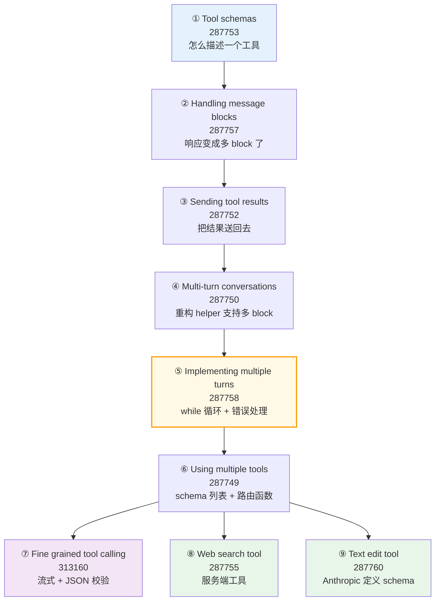
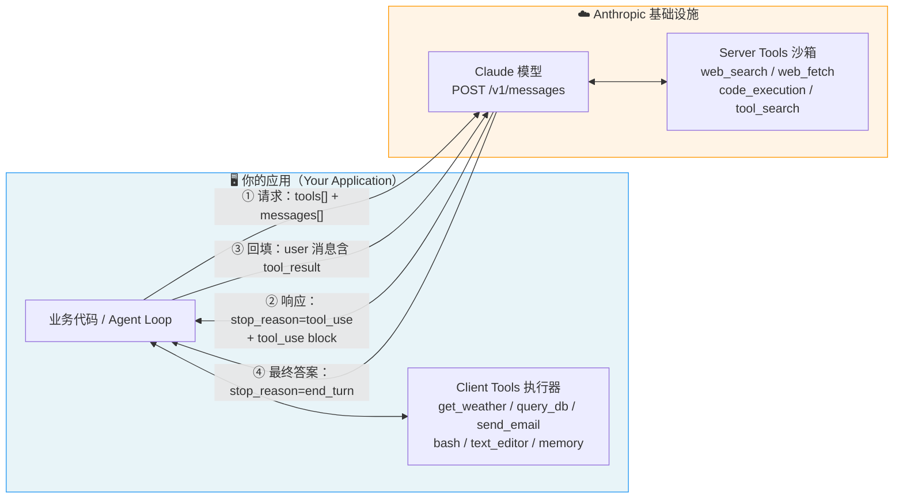
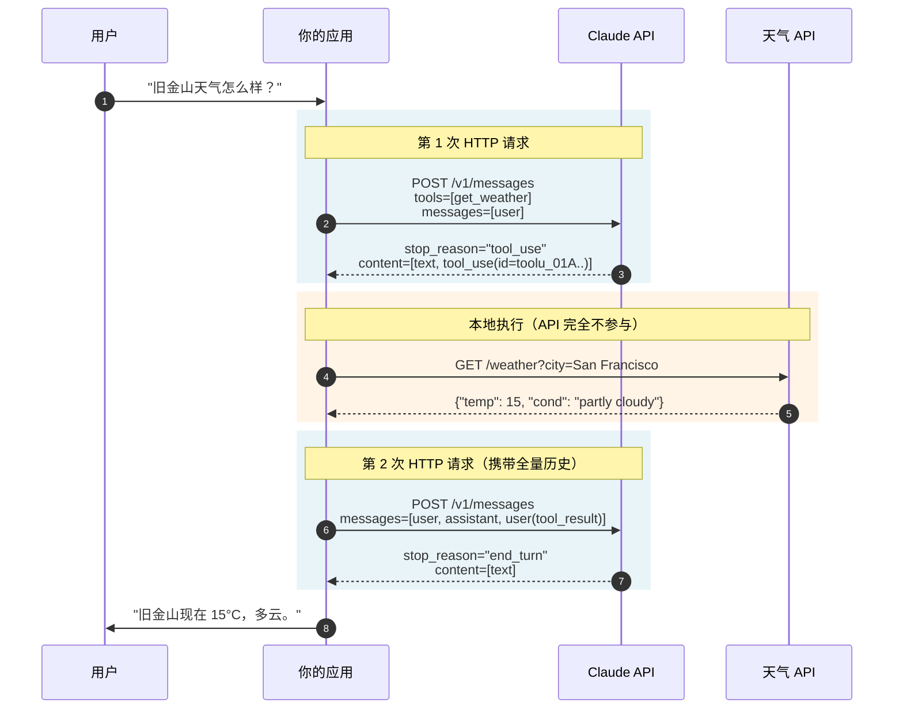
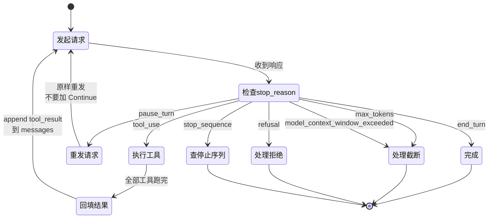
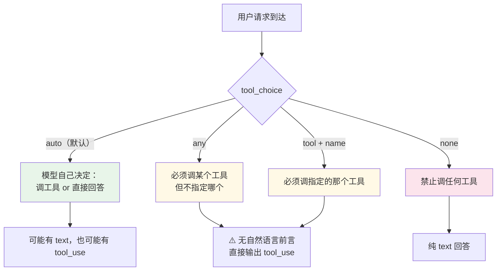
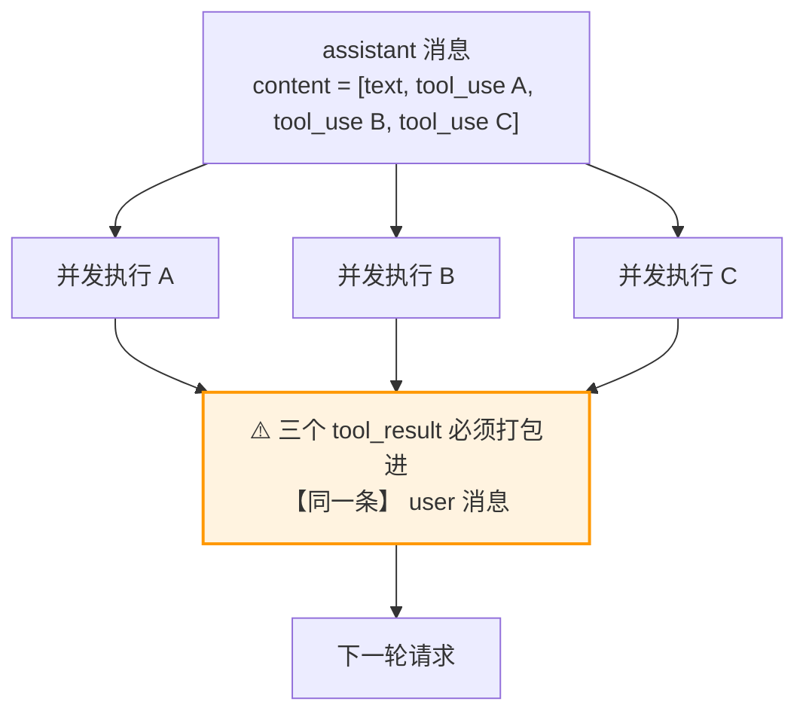
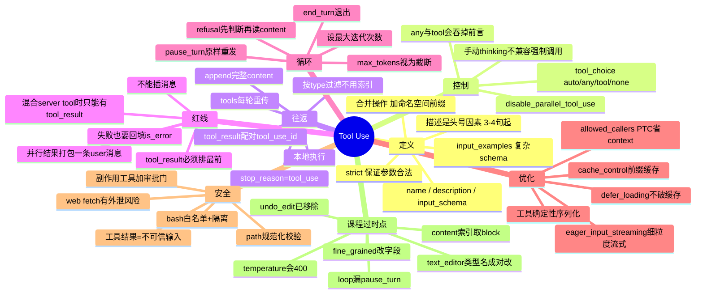

# Phase 3 · Tool Use（工具调用）学习笔记

> **资料来源与方法**
>
> - **课程主线**：Anthropic Academy《Building with the Claude API》Tool Use 单元 9 个课时的正文（通过已登录浏览器获取）。
> - **校准层**：`platform.claude.com` 当前官方文档（overview / define-tools / handle-tool-calls / tool-reference / fine-grained-tool-streaming / structured-outputs / handling-stop-reasons / text-editor-tool / web-fetch-tool / migration-guide）。
>
> **课程录制于 Claude 3.5/3.7 Sonnet 时代，代码有若干处已经跟不上当前 API。**
> 凡是课程写法与当前文档冲突的地方，笔记里一律以官方文档为准，并用 ⚠️ 标出原始写法、当前写法和后果。
> **先读[第 0 部分](#第-0-部分--先看这个课程代码的-6-个过时点)**，那是本笔记最高价值的部分。

---

## 目录

**第 0 部分** · [先看这个：课程代码的 6 个过时点](#第-0-部分--先看这个课程代码的-6-个过时点)

**第 1 部分 · 课程主线**
1. [课程地图](#11-课程地图)
2. [Tool schemas — 工具 schema](#12-tool-schemas工具-schema287753)
3. [Handling message blocks — 多 block 消息](#13-handling-message-blocks多-block-消息287757)
4. [Sending tool results — 回填工具结果](#14-sending-tool-results回填工具结果287752)
5. [Multi-turn conversations — 重构 helper](#15-multi-turn-conversations重构-helper287750)
6. [Implementing multiple turns — 实现循环](#16-implementing-multiple-turns实现循环287758)
7. [Using multiple tools — 多工具](#17-using-multiple-tools多工具287749)
8. [Fine grained tool calling — 细粒度流式](#18-fine-grained-tool-calling细粒度流式313160)
9. [The web search tool — 网页搜索](#19-the-web-search-tool网页搜索287755)
10. [The text edit tool — 文本编辑](#110-the-text-edit-tool文本编辑287760)

**第 2 部分 · 心智模型与架构**
- [2.1 Tool Use 不是新 API](#21-tool-use-不是新-api)
- [2.2 系统架构图：谁在执行代码](#22-系统架构图谁在执行代码)
- [2.3 完整 back-and-forth（逐条报文）](#23-完整-back-and-forth逐条报文)
- [2.4 stop_reason 状态机](#24-stop_reason-状态机)

**第 3 部分 · [Schema 完整参考](#第-3-部分--schema-完整参考)**
**第 4 部分 · [`tool_choice`](#第-4-部分--tool_choice)**
**第 5 部分 · [`tool_result` 格式红线](#第-5-部分--tool_result-格式红线)**
**第 6 部分 · [并行工具调用](#第-6-部分--并行工具调用)**
**第 7 部分 · [服务端工具目录与版本语义](#第-7-部分--服务端工具目录与版本语义)**
**第 8 部分 · [版本漂移校准全表](#第-8-部分--版本漂移校准全表)**
**第 9 部分 · [Tool Runner vs 手写 loop](#第-9-部分--tool-runner-vs-手写-loop)**
**第 10 部分 · [Token 成本模型](#第-10-部分--token-成本模型)**
**第 11 部分 · [安全](#第-11-部分--安全工具结果是不可信输入)**
**第 12 部分 · [最佳实践与报错速查](#第-12-部分--最佳实践与报错速查)**
**附录 A** · [课程代码的现代化重写](#附录-a--课程代码的现代化重写)
**附录 B** · [一页速查](#附录-b--一页速查)

---

# 第 0 部分 · 先看这个：课程代码的 6 个过时点

课程的教学结构依然优秀（渐进式建构，从单工具到多轮循环），**但直接照抄课程代码跑在当前模型上会出问题**。

**共 6 处过时**，按严重程度排序——**前 3 处（①②③）会真正出事**（直接 400 或静默给出错误/截断的答案），后 3 处（④⑤⑥）是配置对不上或走了废弃路径：

| # | 症状 | 课程写法 | 当前正确写法 | 后果 |
|---|---|---|---|---|
| ① | **直接 400** | `chat()` 把 `temperature` 做成可调参数并透传 | 整个删掉，用 prompt 引导行为 | 采样参数在 Opus 5 / Fable 5 / Opus 4.8 / 4.7 上已移除，传非默认值直接 400 |
| ② | **静默取错 block** | `response.content[1].input` 硬编码索引 | 按 `block.type == "tool_use"` 过滤 | Opus 5 **默认开启 thinking**，content 可能是 `[thinking, text, tool_use]`，索引 1 拿到的是 text block → `AttributeError` |
| ③ | **静默截断答案** | `if response.stop_reason != "tool_use": break` | 显式处理 `pause_turn` / `refusal` | 课程同时教了 web search（服务端工具），服务端工具循环达上限会返回 `pause_turn`，这个 loop 会把它当成最终答案直接退出——不报错，答案悄悄少了一半 |
| ④ | **工具名/类型双改** | `text_editor_20250124` + `str_replace_editor` | `text_editor_20250728` + **`str_replace_based_edit_tool`** | `type` 和 `name` 是配对的，只改一个 → 400。课程还提到 `text_editor_20241022`，该版本已不在当前工具表中 |
| ⑤ | **能力已移除** | 课程称文本编辑工具可以「Undo recent edits to files」 | `undo_edit` 命令在 `text_editor_20250728` 已移除 | 按课程实现 `undo_edit` handler 是白写；当前命令集只有 `view` / `create` / `str_replace` / `insert` |
| ⑥ | **走的是废弃路径** | `fine_grained=True`（对应 beta header `fine-grained-tool-streaming-2025-05-14`） | 工具定义上加 **`eager_input_streaming: true`**，已 GA，无需 beta header | 旧 header 仍被兼容，但新代码不该再用 |

另外两处**不算错、但已落后**：

- 课程用 `web_search_20250305`。仍可用，但缺少 `_20260209` 起的 **dynamic filtering**（Claude 写代码在结果进 context 前先过滤，省 token）和 `_20260318` 的 `response_inclusion`。
- 课程教的模型 `claude-3-7-sonnet` / `claude-3-5-sonnet` **已于 2026-02-19 退役**，请求返回 404。

以及**课程完全没覆盖、但现在是硬性要求或重要能力**的部分：

`tool_result` 必须排在 content 数组最前 · 并行结果必须打包进同一条 user 消息 · `strict` · `input_examples` · `defer_loading` + tool search · `allowed_callers` / programmatic tool calling · `cache_control` · Tool Runner · 间接 prompt injection 防护 · 循环最大迭代上限。

完整逐条对照见[第 8 部分](#第-8-部分--版本漂移校准全表)。

---

# 第 1 部分 · 课程主线

## 1.1 课程地图

课程按依赖关系逐层建构，不是按官方文档的分类组织的。理解这条主线有助于把零散知识串起来：



课程的核心洞察：**前 6 课把「一个手写的 agentic loop」从零建出来**，后 3 课展示这个 loop 怎么容纳内置工具。⑤ 是整条主线的收敛点。

---

## 1.2 Tool schemas（工具 schema）〔287753〕

### 课程要点

课程开门见山地澄清一件事：**JSON Schema 不是 AI 专用的东西**。它是一个存在多年的通用数据校验规范，AI 社区只是拿它来描述函数参数。

工具规格三段式：

| 部分 | 说明 |
|---|---|
| `name` | 清晰、描述性的名字（如 `get_weather`） |
| `description` | 做什么、什么时候用、返回什么 |
| `input_schema` | 描述函数参数的 JSON Schema |

**描述的写法**（课程给的清单，与当前官方文档一致）：

- 目标 3–4 句，解释这个工具做什么
- 说明 Claude 什么时候该用它
- 说明返回什么类型的数据
- 每个参数都给详细描述

### 课程的实用技巧：让 Claude 生成 schema

课程给了一个很实际的偷懒办法：

1. 复制你的工具函数代码
2. 打开 Claude，让它为 tool calling 写一份 JSON schema
3. **把 Anthropic 的 tool use 文档作为上下文一起给它**
4. Claude 会按最佳实践生成格式正确的 schema

推荐 prompt：

> "Write a valid JSON schema spec for the purposes of tool calling for this function. Follow the best practices listed in the attached documentation."

### 课程代码

```python
from datetime import datetime

def get_current_datetime(date_format="%Y-%m-%d %H:%M:%S"):
    if not date_format:
        raise ValueError("date_format cannot be empty")
    return datetime.now().strftime(date_format)

get_current_datetime_schema = {
    "name": "get_current_datetime",
    "description": "Returns the current date and time formatted according to the specified format",
    "input_schema": {
        "type": "object",
        "properties": {
            "date_format": {
                "type": "string",
                "description": "A string specifying the format of the returned datetime. Uses Python's strftime format codes.",
                "default": "%Y-%m-%d %H:%M:%S",
            }
        },
        "required": [],
    },
}
```

**命名约定**：`function_name` + `function_name_schema`，让 schema 和函数一一对应，容易维护。

### 类型安全

```python
from anthropic.types import ToolParam

get_current_datetime_schema = ToolParam({
    "name": "get_current_datetime",
    "description": "...",
    # ...
})
```

功能上不是必需的，但能避免类型错误。这条现在依然有效。

> ⚠️ **课程缺失**：课程只讲了必填三字段。当前 API 在工具定义上还支持 `strict`、`input_examples`、`cache_control`、`defer_loading`、`allowed_callers`、`eager_input_streaming` 六个可选字段——见[第 3 部分](#第-3-部分--schema-完整参考)。其中 `strict` 能把参数缺失/类型错误从格式层消掉，是对课程这一课最直接的补强（注意它不保证业务语义正确，见 [3.4](#34-strict--大幅收敛参数缺失问题)）。

---

## 1.3 Handling message blocks（多 block 消息）〔287757〕

### 课程要点

这一课的核心认知转变：**开启工具后，响应不再是单一文本块了。**

```python
messages = []
messages.append({
    "role": "user",
    "content": "What is the exact time, formatted as HH:MM:SS?",
})

response = client.messages.create(
    model=model,
    max_tokens=1000,
    messages=messages,
    tools=[get_current_datetime_schema],
)
```

当 Claude 决定用工具，返回的 assistant 消息 `content` 里是一个**多 block 列表**：

| Block | 内容 |
|---|---|
| **Text Block** | 人类可读的解释文字（"I can help you find out the current time. Let me find that information for you"） |
| **ToolUse Block** | 给你的代码看的指令：调哪个工具、传什么参数 |

ToolUse block 含四项：`id`（追踪用）、`name`（函数名）、`input`（参数字典）、`type: "tool_use"`。

### 关键：保存完整结构

课程反复强调的一点，**至今仍是最高频的坑**：

> Claude doesn't store conversation history - you need to manage it manually. When working with tool responses, you must **preserve the entire content structure, including all blocks**.

```python
messages.append({
    "role": "assistant",
    "content": response.content,   # ← 整个 content，不是提取出来的文本
})
```

只存 text 而丢掉 `tool_use` block，下一次请求就会因为找不到对应的 tool_use 而报错。

### 完整流程（课程版）

1. 带工具 schema 发送 user 消息
2. 收到含 text block + tool use block 的 assistant 消息
3. 提取工具信息并执行真实函数
4. 把工具结果连同完整对话历史发回
5. 收到 Claude 的最终响应

> ⚠️ **当前补充**：课程说多 block 消息"typically contains" text + tool_use。在 **Claude Opus 5 上 thinking 默认开启**，content 里还可能有 `thinking` block，而且它排在最前面。这直接导致了下一课的索引问题。

---

## 1.4 Sending tool results（回填工具结果）〔287752〕

### 课程要点

拿到 `tool_use` 后，取出参数调用函数：

```python
response.content[1].input                      # 参数字典
get_current_datetime(**response.content[1].input)   # Python 解包语法
```

`tool_result` block 的三个属性（课程原文）：

| 属性 | 说明 |
|---|---|
| `tool_use_id` | 必须匹配对应 ToolUse block 的 `id` |
| `content` | 工具输出，序列化成字符串 |
| `is_error` | 出错时为 `True` |

```python
messages.append({
    "role": "user",
    "content": [{
        "type": "tool_result",
        "tool_use_id": response.content[1].id,
        "content": "15:04:22",
        "is_error": False,
    }]
})
```

### 课程强调的两点（都仍然正确）

**1. 多工具调用要靠 ID 配对。** 用户问"10+10 和 30+30 分别是多少"，Claude 可能返回两个 ToolUse block。每个有唯一 ID，**你必须用 ID 匹配结果**——这样即使结果顺序不同 Claude 也知道谁对应谁。

**2. 后续请求仍然必须带 tool schema。**

> "When sending the follow-up request, you must still include the tool schema even though you're not expecting Claude to make another tool call. Claude needs the schema to understand the tool references in your conversation history."

```python
client.messages.create(
    model=model,
    max_tokens=1000,
    messages=messages,
    tools=[get_current_datetime_schema],   # ← 不能省
)
```

### ⚠️ 过时点 ②：`content[1]` 硬编码索引

课程的 `response.content[1].input` 假定 content 永远是 `[text, tool_use]`。**这个假设在三种情况下崩掉**：

| 情况 | 实际 content | `content[1]` 是什么 |
|---|---|---|
| Opus 5 默认开 thinking | `[thinking, text, tool_use]` | text block → `.input` 报 `AttributeError` |
| `tool_choice: any`/`tool` | `[tool_use]`（API 预填，不会有前言） | `IndexError` |
| 并行调用 | `[text, tool_use, tool_use]` | 只处理了第一个，第二个漏了 → 400 |

**正确写法**：

```python
# ✅ 按类型过滤，不要按位置取
tool_uses = [b for b in response.content if b.type == "tool_use"]
for tu in tool_uses:
    result = run_tool(tu.name, tu.input)
```

课程在下一课（287758）的 `run_tools` 里其实已经改成了过滤写法，所以这更像是教学中的阶段性简化——但如果你照着这一课的 notebook 直接写生产代码，会踩坑。

> ⚠️ **课程缺失**：`content` 其实是可选的（空 `tool_result` 合法），也可以是 content block 数组（支持 `text` / `image` / `document` / `search_result`）。而且有三条会 400 的格式硬规则课程完全没提——见[第 5 部分](#第-5-部分--tool_result-格式红线)。

---

## 1.5 Multi-turn conversations（重构 helper）〔287750〕

### 课程要点

这一课解决一个真实问题：用户问 "What day is 103 days from today?"，Claude 需要**先**拿当前日期，**再**加 103 天——两次工具调用才能回答一个问题。

课程给的循环骨架（伪代码）：

```python
def run_conversation(messages):
    while True:
        response = chat(messages)
        add_assistant_message(messages, response)

        # Pseudo code
        if response isn't asking for a tool:
            break

        tool_result_blocks = run_tools(response)
        add_user_message(messages, tool_result_blocks)

    return messages
```

### 三个 helper 的重构

**① `add_user_message` 支持完整 message 对象**

```python
from anthropic.types import Message

def add_user_message(messages, message):
    user_message = {
        "role": "user",
        "content": message.content if isinstance(message, Message) else message,
    }
    messages.append(user_message)
```

这样字符串、block 列表、完整 message 对象都能传。

**② `chat()` 接受工具列表，返回完整 message**

```python
def chat(messages, system=None, temperature=1.0, stop_sequences=[], tools=None):
    params = {
        "model": model,
        "max_tokens": 1000,
        "messages": messages,
        "temperature": temperature,
        "stop_sequences": stop_sequences,
    }
    if tools:
        params["tools"] = tools
    if system:
        params["system"] = system

    message = client.messages.create(**params)
    return message
```

**③ 文本提取工具**

```python
def text_from_message(message):
    return "\n".join(
        [block.text for block in message.content if block.type == "text"]
    )
```

### ⚠️ 过时点 ①：`temperature` 会 400

上面 `chat()` 的签名里那个 `temperature=1.0` 是**整份课程代码里最危险的一处**。

当前状况：

| 模型 | `temperature` / `top_p` / `top_k` |
|---|---|
| Claude Opus 5 / Fable 5 / Mythos 5 / Opus 4.8 / Opus 4.7 | **已移除**，传非默认值返回 400 |
| Claude Sonnet 5 | 非默认值返回 400 |
| Opus 4.6 / Sonnet 4.6 及更早 | 仍可用 |

课程把 `temperature` 做成了**可调参数并透传**——只要调用方传了 `temperature=0.7` 这种值，在当前模型上就直接 400。

**修法**：整个参数删掉。

```python
def chat(messages, system=None, stop_sequences=None, tools=None):
    params = {
        "model": "claude-opus-5",
        "max_tokens": 16000,          # 顺带调大，1000 太容易截断
        "messages": messages,
    }
    if tools:
        params["tools"] = tools
    if system:
        params["system"] = system
    if stop_sequences:
        params["stop_sequences"] = stop_sequences
    return client.messages.create(**params)
```

原来靠 `temperature` 实现的诉求，现在这样替代：

| 原意图 | 现在怎么做 |
|---|---|
| `temperature=0` 求确定性 | `output_config={"effort": "low"}` + 更收紧的 prompt（注意：`temperature=0` 从来也不保证输出完全一致） |
| 高 temperature 求多样性 | 在 prompt 里明确要求变化，比如 "Vary your phrasing and structure across responses" |

> 顺带一提：课程的 `max_tokens: 1000` 在当前模型上偏小。Opus 5 上 `max_tokens` 是 **thinking + 可见回答的总硬上限**，thinking 默认开启会先吃掉一部分预算，1000 很容易在正文还没写完时就 `max_tokens` 截断。
>
> ⚠️ 官方**没有**给出通用的推荐数值——这个值要按模型、任务复杂度、成本预算和你自己的 eval 来标定。本笔记后续示例统一用 16000，那只是一个够用的起点，不是官方建议。
> 另外 streaming 改变的是传输方式（避免长请求超时），**不对应另一套语义预算**，不要理解成"流式就该配更大的 max_tokens"。

---

## 1.6 Implementing multiple turns（实现循环）〔287758〕

### 课程要点

**怎么知道 Claude 还想调工具？** 看 `stop_reason`：

```python
if response.stop_reason != "tool_use":
    break   # Claude is done, no more tools needed
```

完整循环：

```python
def run_conversation(messages):
    while True:
        response = chat(messages, tools=[get_current_datetime_schema])
        add_assistant_message(messages, response)
        print(text_from_message(response))

        if response.stop_reason != "tool_use":
            break

        tool_results = run_tools(response)
        add_user_message(messages, tool_results)

    return messages
```

### `run_tools`：按类型过滤

```python
def run_tools(message):
    tool_requests = [
        block for block in message.content if block.type == "tool_use"
    ]
    tool_result_blocks = []

    for tool_request in tool_requests:
        # Process each tool request...
```

### 错误处理（课程这一段写得很好，至今是标准做法）

```python
try:
    tool_output = run_tool(tool_request.name, tool_request.input)
    tool_result_block = {
        "type": "tool_result",
        "tool_use_id": tool_request.id,
        "content": json.dumps(tool_output),
        "is_error": False,
    }
except Exception as e:
    tool_result_block = {
        "type": "tool_result",
        "tool_use_id": tool_request.id,
        "content": f"Error: {e}",
        "is_error": True,
    }
```

**关键点**：工具失败时**仍然要给一个 result block**，不能因为异常就跳过——每个 `tool_use.id` 都必须有配对的 `tool_result`。

### ⚠️ 过时点 ③：`!= "tool_use"` 会静默吞掉 `pause_turn` 和 `refusal`

课程写这段时，`stop_reason` 实际只有 `end_turn` / `tool_use` / `max_tokens` / `stop_sequence`。现在多了三个：

| 新增取值 | 课程的 loop 会怎样 |
|---|---|
| `pause_turn` | **静默退出，答案截断**。服务端工具（web search / web fetch / code execution）的内部循环达到 10 次上限时返回这个值 |
| `refusal` | 静默退出，然后 `text_from_message()` 拿到空字符串 |
| `model_context_window_exceeded` | 静默退出，用户拿到半截答案且不知情 |

**这个坑在这门课里尤其致命**，因为课程紧接着（287755）就教了 web search——把两课的代码拼起来，就是一个会静默截断的 agent。

**正确写法**：

```python
MAX_ITERATIONS = 10

for _ in range(MAX_ITERATIONS):
    response = chat(messages, tools=tools)

    # 先判 stop_reason，再碰 content
    if response.stop_reason == "refusal":
        return f"[refused] {response.stop_details}"

    if response.stop_reason == "pause_turn":
        # 服务端工具达上限：原样重发，不要加 "Continue."
        add_assistant_message(messages, response)
        continue

    if response.stop_reason in ("max_tokens", "model_context_window_exceeded"):
        add_assistant_message(messages, response)
        return "[truncated] 响应不完整"

    add_assistant_message(messages, response)

    if response.stop_reason != "tool_use":
        return text_from_message(response)

    add_user_message(messages, run_tools(response))
else:
    raise RuntimeError("agent loop 未收敛")
```

另外课程的 `while True` **没有迭代上限**——工具实现有 bug 时会无限循环烧 token。务必加 `MAX_ITERATIONS`。

---

## 1.7 Using multiple tools（多工具）〔287749〕

### 课程要点

课程用一个提醒事项系统演示扩展到三个工具：

1. `get_current_datetime` — 拿当前时间
2. `add_duration_to_datetime` — **因为 "Claude isn't perfect with date time addition"**（这个理由很实在：把模型不擅长的确定性计算交给工具）
3. `set_reminder` — 设置提醒

### 加工具的固定套路（课程总结，至今有效）

```python
response = chat(messages, tools=[
    get_current_datetime_schema,
    add_duration_to_datetime_schema,
    set_reminder_schema,
])
```

```python
def run_tool(tool_name, tool_input):
    if tool_name == "get_current_datetime":
        return get_current_datetime(**tool_input)
    elif tool_name == "add_duration_to_datetime":
        return add_duration_to_datetime(**tool_input)
    elif tool_name == "set_reminder":
        return set_reminder(**tool_input)
```

**四步模式**：写函数实现 → 定义 schema → 加进 `run_conversation` 的 tools 列表 → 在 `run_tool` 里加一个分支。

### 课程的测试用例（设计得很好）

> "Set a reminder for my doctors appointment. Its 177 days after Jan 1st, 2050."

强制 Claude 做两件事：先算日期（`add_duration_to_datetime` → 2050-06-27），再设提醒（`set_reminder`）。这是最小的**多轮串联**验证。

课程还指出，检查对话历史能看到完整结构：user 消息 → **同时含 text 和 tool use block** 的 assistant 消息 → tool result 消息 → 后续 assistant 消息。

> ⚠️ **当前补充**：
> - 官方现在建议**合并相关操作**——与其做 `create_pr` / `review_pr` / `merge_pr` 三个工具，不如做一个带 `action` 参数的工具。工具越少越强，选择歧义越小。
> - 跨服务时用命名空间前缀：`github_list_prs`、`slack_send_message`。
> - 工具数量真的很多（上百上千）时，用 **tool search + `defer_loading`** 按需加载，而不是全部塞进 system prompt。
> - `run_tool` 这种 if/elif 路由现在可以交给 **Tool Runner** 自动处理，见[第 9 部分](#第-9-部分--tool-runner-vs-手写-loop)。

---

## 1.8 Fine grained tool calling（细粒度流式）〔313160〕

### 课程要点：默认行为是「缓冲 + 校验」

这一课解释了一个很多人困惑的现象：**开了流式，为什么工具参数还是一顿一顿地出现？**

流式下工具参数通过 `InputJsonEvent` 返回，两个属性：

- `partial_json` — 本次的 JSON 片段
- `snapshot` — 到目前为止累积的完整 JSON

```python
for chunk in stream:
    if chunk.type == "input_json":
        print(chunk.partial_json)
        current_args = chunk.snapshot
```

**API 默认不是立即推送每个 chunk 的**，而是缓冲 + 校验。对这样的 schema：

```json
{
  "abstract": "This paper presents a novel...",
  "meta": {
    "word_count": 847,
    "review": "This paper introduces QuanNet..."
  }
}
```

API 会：等 `abstract` 的值完整 → 对照 schema 校验这个键值对 → 一次性把 `abstract` 的所有缓冲 chunk 推给你 → 对 `meta` 重复。

> "This validation process explains why you see delays followed by bursts of text, even with streaming enabled."

### 细粒度模式：关掉校验换延迟

课程原话：**"Fine-grained tool calling does one main thing: it disables JSON validation on the API side."**

- chunk 一生成就推给你
- 顶层键之间没有缓冲延迟
- **代价：JSON 校验被关掉，你的代码必须处理非法 JSON**

```python
try:
    parsed_args = json.loads(chunk.snapshot)
except json.JSONDecodeError:
    print("Received invalid JSON, continuing...")
```

课程举的例子很具体：可能收到 `"word_count": undefined` 而不是合法数字。

### ⚠️ 过时点 ⑥：开启方式变了

| | 课程 | 当前 |
|---|---|---|
| 开启方式 | `fine_grained=True`（notebook helper，底层是 beta header `fine-grained-tool-streaming-2025-05-14`） | 工具定义上加 **`eager_input_streaming: true`** |
| 状态 | beta | **GA，无需 beta header** |
| 粒度 | 整个请求 | **每个工具单独控制** |

```python
with client.messages.stream(
    model="claude-opus-5",
    max_tokens=65536,
    tools=[
        {
            "name": "make_file",
            "description": "Write text to a file",
            "eager_input_streaming": True,        # ← 就这一行
            "input_schema": {
                "type": "object",
                "properties": {
                    "filename": {"type": "string", "description": "The filename to write text to"},
                    "lines_of_text": {"type": "array", "description": "An array of lines of text to write to the file"},
                },
                "required": ["filename", "lines_of_text"],
            },
        }
    ],
    messages=[{"role": "user", "content": "Can you write a long poem and make a file called poem.txt?"}],
) as stream:
    for event in stream:
        if event.type == "input_json":
            print(event.partial_json, end="", flush=True)
    final_message = stream.get_final_message()
```

旧 beta header **仍被兼容**：带着它的请求会对所有没显式设置该字段的工具开启细粒度流式；显式设 `false` 的工具即使带着旧 header 也保持缓冲模式。但新代码应该用字段。

### 当前文档补充的两件事（课程没讲）

**1. 累积契约**

`content_block_start` 时 `input` 是 `{}`（占位符，不是真值），真实输入通过一系列 `input_json_delta` 事件的 `partial_json` 到达：

1. `content_block_start` 且 `type: "tool_use"` → 初始化 `input_json = ""`
2. 每个 `content_block_delta` 且 `type: "input_json_delta"` → `input_json += event.delta.partial_json`
3. `content_block_stop` → 解析累积的字符串

`input: {}`（对象）和 `partial_json`（字符串）的类型不一致是**设计如此**：空对象标记数组里的位置，delta 字符串构建真实值。

**2. 非法 JSON 的标准回填格式**

课程只说了 try/except，没说该怎么告诉 Claude。当前文档给了明确格式——把原始字符串包进一个单键 JSON 对象，序列化后作为 `content`，并置 `is_error: true`：

```json
{
  "type": "tool_result",
  "tool_use_id": "toolu_01A09q90qw90lq917835lq9",
  "is_error": true,
  "content": "{\"INVALID_JSON\": \"<the unparseable input you received>\"}"
}
```

这样 Claude 能明确知道"你发来的 JSON 我没法解析"，同时保留原始输入便于调试。**用 JSON 库构造这个包装对象，不要字符串拼接**，否则非法输入里的引号会破坏转义。

还有一点：响应以 `max_tokens` 结束时也可能把参数截断在半路。检查 `stop_reason` 决定是提高 `max_tokens` 重试还是修复部分输入。

---

## 1.9 The web search tool（网页搜索）〔287755〕

### 课程要点

**前置条件**（课程特别标注）：组织必须先在 console 里启用 Web Search 工具 —— <https://console.anthropic.com/settings/privacy>

```python
web_search_schema = {
    "type": "web_search_20250305",
    "name": "web_search",
    "max_uses": 5,
}
```

**这是第一个"你不用写实现"的工具**——Claude 全程自动处理搜索，你只提供 schema。

`max_uses` 限制搜索次数：Claude 可能基于初始结果做后续搜索，这个参数防止 API 调用失控。

### 响应里的 block 类型

| Block | 内容 |
|---|---|
| Text blocks | Claude 的说明 |
| `ServerToolUseBlock` | Claude 实际用的搜索查询 |
| `WebSearchToolResultBlock` | 搜索结果容器 |
| `WebSearchResultBlock` | 单条结果（标题 + URL） |
| Citation blocks | 支撑 Claude 陈述的引用文本 |

### 限制搜索域名

```python
web_search_schema = {
    "type": "web_search_20250305",
    "name": "web_search",
    "max_uses": 5,
    "allowed_domains": ["nih.gov"],
}
```

课程举的例子很好：问医学/运动建议时限制到 PubMed（nih.gov），确保拿到循证内容而不是随便哪个博客。

### 渲染建议（课程这段很实用）

- text block 当正文渲染
- 搜索结果作为来源列表显示在顶部
- 引用内联显示在文本中，包含来源域名、页面标题、URL、引用原文

> "This structure helps users understand how Claude arrived at its answers and provides transparency about the sources being used."

### ⚠️ 版本落后：可以升级但不影响运行

`web_search_20250305` 现在依然可用（基础版），但已有两个更新版本：

| 版本 | 增量能力 |
|---|---|
| `web_search_20250305` | 基础搜索（课程用的） |
| `web_search_20260209` | **dynamic filtering** — Claude 写代码在结果进 context 之前先过滤，只保留相关信息 |
| `web_search_20260318` | 再加 **response inclusion** 控制 |

dynamic filtering 对省 token 效果显著，尤其抓大文档时。

> ⛔ **重要**：dynamic filtering 内部自动跑 code execution，**不要再单独在 `tools` 里声明 `code_execution`**——两个执行环境会让模型混乱。

### 课程完全没讲的姊妹工具：web fetch

课程只教了 search。当前还有 **web fetch**（`web_fetch_20260318` / `_20260309` / `_20260209` / `_20250910`），抓取指定网页和 PDF 全文。两个关键设计：

- **URL 必须先出现在对话上下文里**才能抓（user 消息里的 URL、客户端工具结果里的 URL、之前 search/fetch 结果里的 URL）。Claude **不能动态构造 URL** —— 这是防数据外泄的硬性限制。
- search + fetch 一起开时，用户说"读一下 anthropics/anthropic-sdk-python 的 README"（没给 URL），Claude 会先 search 定位再 fetch。

web fetch **不额外收费**，只按抓到的内容算 input token。参考量级：普通网页（10 kB）≈ 2,500 tokens；大文档页（100 kB）≈ 25,000 tokens；论文 PDF（500 kB）≈ 125,000 tokens。用 `max_content_tokens` 兜底。

> ⚠️ 官方对 web fetch 有明确安全警告：在 Claude 同时处理不可信输入和敏感数据的环境里启用它有**数据外泄风险**。考虑 `allowed_domains` 限定、`max_uses` 限次，或干脆不开。

---

## 1.10 The text edit tool（文本编辑）〔287760〕

### 课程要点

课程把这个工具的定位讲得很清楚，这个认知**至今准确且重要**：

> "while the tool schema is built into Claude, you still need to provide the actual implementation. Think of it this way - **Claude knows how to ask for file operations, but you need to write the code that actually performs those operations**."

也就是说：普通工具你写 schema + 写实现；文本编辑工具 Anthropic 提供 schema（模型也针对它训练过），**但实现还是你写**。

课程列的能力清单：

- View file or directory contents
- View specific ranges of lines in a file
- Replace text in a file
- Create new files
- Insert text at specific lines in a file
- ~~Undo recent edits to files~~ ← **⚠️ 见下**

### ⚠️ 过时点 ④：type 和 name 是配对的，都变了

课程代码：

```python
def get_text_edit_schema(model):
    if model.startswith("claude-3-7-sonnet"):
        return {"type": "text_editor_20250124", "name": "str_replace_editor"}
    elif model.startswith("claude-3-5-sonnet"):
        return {"type": "text_editor_20241022", "name": "str_replace_editor"}
```

当前正确对照：

| 目标模型 | `type` | `name` |
|---|---|---|
| **Claude 4 及以后（含 Opus 5）** | `text_editor_20250728` | **`str_replace_based_edit_tool`** |
| 更早的模型 | `text_editor_20250124` | `str_replace_editor` |
| ~~`text_editor_20241022`~~ | 已不在当前工具表中 | — |

```python
# ✅ 当前写法
{
    "type": "text_editor_20250728",
    "name": "str_replace_based_edit_tool",
    "max_characters": 10000,   # 可选，仅 20250728+ 支持，控制 view 大文件时的截断
}
```

> ⛔ **最容易踩的坑**：`type` 和 `name` **必须成对更新**。只把 `type` 改成 `20250728` 而 `name` 还留着 `str_replace_editor` → **400**。
>
> 另外课程举例的两个模型（`claude-3-7-sonnet`、`claude-3-5-sonnet`）都已在 **2026-02-19 退役**，请求返回 404。

### ⚠️ 过时点 ⑤：`undo_edit` 已移除

课程能力清单里的 "Undo recent edits to files" 对应 `undo_edit` 命令，**在 `text_editor_20250728` 中已移除**。当前命令集：

| `command` | 其他输入 | 行为 |
|---|---|---|
| `view` | `path`，可选 `view_range` | 返回文件内容或目录列表 |
| `create` | `path`, `file_text` | 创建/覆盖文件。**如果文件已存在，自己做备份** |
| `str_replace` | `path`, `old_str`, `new_str` | 精确替换一处；匹配 0 处或 >1 处要报错 |
| `insert` | `path`, `insert_line`, `insert_text` | 在第 `insert_line` 行后插入（0 = 文件开头） |

如果你按课程实现了 `undo_edit` handler，那段代码是白写的；反过来，如果业务需要撤销，得自己在 `create` / `str_replace` 里做版本备份。

### ⛔ 课程完全没讲的安全要求

课程把 `path` 当成普通参数用了。**`path` 是模型输出，即不可信数据。**

官方要求：执行任何文件操作前，把模型给的 `path` 解析成**规范路径（canonical form）**，验证它仍在项目根目录内；拒绝 `..`、符号链接、根目录外的绝对路径、URL 编码的穿越（`%2e%2e%2f`）。

```python
from pathlib import Path

PROJECT_ROOT = Path("/srv/workspace").resolve()

def safe_path(raw: str) -> Path:
    p = (PROJECT_ROOT / raw).resolve()
    if not p.is_relative_to(PROJECT_ROOT):     # Python 3.9+
        raise ValueError(f"path escapes project root: {raw}")
    return p
```

**永远不要**直接拿原始 `path` 去调 `open()` / `writeFile` / `unlink`。

同族的 `bash` 工具（`bash_20250124`，课程没讲）风险更高：在隔离环境（容器 / VM / 受限用户）里跑，用**白名单**限定可执行程序，拒绝 shell 操作符（`&&`、`|`、`;`、`` ` ``、`$()`），设超时和资源上限，记录每一条命令。**黑名单不够。**

---

# 第 2 部分 · 心智模型与架构

## 2.1 Tool Use 不是新 API

课程是自底向上教的，这里补一个自顶向下的心智模型。最重要的一句话：

> **一切都走 `POST /v1/messages`。工具是这个唯一端点上的一个参数，不是独立的 API。**

没有 `/v1/tools`，没有 `tool` 或 `function` 这种特殊 role。官方文档明确指出这个和某些其他厂商的差异：

> "Unlike APIs that separate tool use or use special roles like `tool` or `function`, the Claude API integrates tools directly into the `user` and `assistant` message structure."

| 角色 | 可以包含的 content block |
|---|---|
| `assistant` | `text`、`thinking`、`tool_use`、`server_tool_use` |
| `user` | `text`、`image`、`document`、**`tool_result`** |

**工具的返回结果是以 `user` 消息的身份回填进对话历史的**。模型请求工具（assistant 的 `tool_use`），你执行，然后你以"用户"的身份把结果告诉它（user 的 `tool_result`）。这正是课程 287752 那一课的结构来源。

**API 是无状态的**——每次请求都要把完整对话历史重发一遍。所以 agentic loop 本质上就是不断往 `messages` 数组里 append：

```
messages = [user_1]
messages = [user_1, assistant_1(tool_use)]
messages = [user_1, assistant_1(tool_use), user_2(tool_result)]
messages = [user_1, assistant_1(tool_use), user_2(tool_result), assistant_2(text)]
```

---

## 2.2 系统架构图：谁在执行代码

工具分两大类，**唯一的本质区别是代码在哪里跑**。课程教的自定义工具属于左边，web search 属于右边，text editor 是个特例（schema 在右、执行在左）。



| | **Client Tools** | **Server Tools** |
|---|---|---|
| 执行位置 | 你的应用 | Anthropic 基础设施 |
| 你要写 handler 吗 | ✅ 必须 | ❌ 不用 |
| 是否出现 `stop_reason: "tool_use"` | ✅ 会中断，等你回填 | ❌ 单次响应内部完成 |
| 结果 block 类型 | `tool_result`（你构造） | `web_search_tool_result` 等（API 返回） |
| 计费 | 只算 token | token + 可能有按次用量计费 |
| 例子 | 自定义工具、`bash`、`text_editor`、`memory`、`computer` | `web_search`、`web_fetch`、`code_execution`、`tool_search`、`advisor` |

> ⚠️ **课程里的 text editor 属于哪一类？** 属于 **Client Tools**——Anthropic 定义 schema（模型针对它训练过），但**代码在你的机器上跑**。`bash` / `memory` / `computer` 同理。
> 这类工具**不要传 `input_schema`**，schema 已内建在模型里。也**不要**自己定义一个名叫 `"bash"` 的自定义工具——那是完全不同的工具，没有内建行为。

### 混合场景：一轮里同时有 server tool 和 client tool

课程没覆盖但实际会遇到：一条 assistant 消息里可能同时有 `server_tool_use`（尚未出结果）和你的客户端 `tool_use`。此时：

- 响应 `stop_reason` 是 `tool_use`
- 你的 user 消息里**只能放客户端工具的 `tool_result` block，一个字的 text 都不能加**
- 服务端工具会在你回填后的那次请求里执行，结果出现在下一个响应的开头

加了 text 会提前结束 turn，API 返回 400 并指出那个未完成的服务端工具。

---

## 2.3 完整 back-and-forth（逐条报文）

课程 287757 + 287752 讲的就是这个往返，这里补齐 wire-level 的完整报文。



### 步骤 ①：发起请求

```json
{
  "model": "claude-opus-5",
  "max_tokens": 1024,
  "tools": [
    {
      "name": "get_weather",
      "description": "Get the current weather for a given location.",
      "input_schema": {
        "type": "object",
        "properties": {
          "location": { "type": "string", "description": "City and state, e.g. San Francisco, CA" }
        },
        "required": ["location"]
      }
    }
  ],
  "tool_choice": { "type": "auto", "disable_parallel_tool_use": true },
  "messages": [
    { "role": "user", "content": "What's the weather in San Francisco?" }
  ]
}
```

### 步骤 ②：模型返回 `tool_use`

```json
{
  "id": "msg_01Aq9w938a90dw8q",
  "model": "claude-opus-5",
  "role": "assistant",
  "stop_reason": "tool_use",
  "content": [
    {
      "type": "text",
      "text": "I'll check the current weather in San Francisco for you."
    },
    {
      "type": "tool_use",
      "id": "toolu_01A09q90qw90lq917835lq9",
      "name": "get_weather",
      "input": { "location": "San Francisco, CA", "unit": "celsius" }
    }
  ]
}
```

| 字段 | 说明 |
|---|---|
| `id` | 本次调用的唯一标识，**回填 `tool_result` 时必须原样带回做配对** |
| `name` | 被调用的工具名 |
| `input` | 符合 `input_schema` 的参数对象（**已经是解析好的对象，不是字符串**） |

> 💡 text 和 tool_use **并存**。模型经常先说一句"我来帮你查"再调工具。把这些文字当普通 assistant 文本处理，**不要依赖任何固定措辞格式**。

### 步骤 ③：本地执行 + 回填

```json
{
  "model": "claude-opus-5",
  "max_tokens": 1024,
  "tools": [ /* 必须原样重传，不能省略 */ ],
  "messages": [
    { "role": "user", "content": "What's the weather in San Francisco?" },
    {
      "role": "assistant",
      "content": [
        { "type": "text", "text": "I'll check the current weather in San Francisco for you." },
        {
          "type": "tool_use",
          "id": "toolu_01A09q90qw90lq917835lq9",
          "name": "get_weather",
          "input": { "location": "San Francisco, CA", "unit": "celsius" }
        }
      ]
    },
    {
      "role": "user",
      "content": [
        {
          "type": "tool_result",
          "tool_use_id": "toolu_01A09q90qw90lq917835lq9",
          "content": "15 degrees Celsius, partly cloudy"
        }
      ]
    }
  ]
}
```

### 步骤 ④：最终答案

```json
{
  "role": "assistant",
  "stop_reason": "end_turn",
  "content": [
    { "type": "text", "text": "The current weather in San Francisco is 15 degrees Celsius with partly cloudy skies." }
  ]
}
```

---

## 2.4 `stop_reason` 状态机



| 取值 | 含义 | 你该做什么 |
|---|---|---|
| `end_turn` | 模型自然结束 | 直接用结果，退出 loop |
| `tool_use` | 模型要调工具 | 执行工具 → 回填 `tool_result` → 继续 loop |
| `max_tokens` | 撞到 `max_tokens` 上限 | 调大 `max_tokens`，或把不完整响应 append 回去续写。**若最后一个 block 是不完整的 `tool_use`，必须提高 `max_tokens` 重试**才能拿到完整工具规格 |
| `stop_sequence` | 命中自定义停止序列 | 读响应的 `stop_sequence` 字段看是哪一个触发的 |
| `pause_turn` | 服务端工具循环达到内部迭代上限（默认 10 次） | **原样重发**（user + assistant），服务端自动续跑 |
| `refusal` | 安全策略拒绝（HTTP 200，不是错误） | 读 `stop_details.category`，考虑 fallback 模型或改写请求 |
| `model_context_window_exceeded` | 填满了模型上下文窗口 | 当作截断处理；响应仍有效但不完整 |

### `pause_turn` 的正确处理

```python
if response.stop_reason == "pause_turn":
    messages = [
        {"role": "user", "content": user_query},
        {"role": "assistant", "content": response.content},
    ]
    # 直接再发一次；不要追加 "Continue." 这种 user 消息
    response = client.messages.create(
        model="claude-opus-5", messages=messages, tools=tools
    )
```

API 检测到结尾的 `server_tool_use` block 就知道要续跑，**加 "Continue." 反而是错的**。

> ⚠️ SDK 的 Tool Runner **不会自动处理 `pause_turn`**。一个暂停的 turn 会让 runner 静默退出并把它当成最终消息返回——没有报错、没有警告，只是答案被悄悄截断。混用服务端工具时要每轮检查。

### `refusal` 的防御式写法

```python
response = client.messages.create(...)
if response.stop_reason == "refusal":
    handle_refusal(response.stop_details)   # content 可能是空数组
else:
    print(response.content[0].text)
```

无条件 `response.content[0]` 在 refusal 时会崩。

### 流式下读 `stop_reason`

- `message_start` 事件里 `stop_reason` 是 `null`
- `stop_reason` 在 `message_delta` 事件里给出
- 其他事件类型不包含

---

# 第 3 部分 · Schema 完整参考

## 3.1 必填三字段

| 字段 | 类型 | 说明 |
|---|---|---|
| `name` | string | 必须匹配正则 `^[a-zA-Z0-9_-]{1,64}$` |
| `description` | string | **纯文本**：做什么、什么时候用、什么时候不该用、每个参数的含义、有什么限制。官方建议**至少 3–4 句**。这是影响工具调用质量的**头号因素** |
| `input_schema` | object | 标准 [JSON Schema](https://json-schema.org/)，顶层 `type` 必须是 `object` |

## 3.2 可选字段全表

课程完全没覆盖这一层。这些字段**大体可以组合**，但有一个例外见下。

| 字段 | 作用 | 适用范围 |
|---|---|---|
| `input_examples` | 提供合法输入示例数组 | 用户自定义 + Anthropic-schema 客户端工具。**服务端工具不支持** |
| `strict` | 约束 `tool_use.input` 匹配 schema（受支持子集） | 除 `mcp_toolset` 外全部 |
| `cache_control` | 在该工具定义处打一个 prompt cache 断点 | 全部工具 |
| `defer_loading` | 不放进初始 system prompt，配合 tool search 按需加载 | 全部工具 |
| `allowed_callers` | 限制谁能调这个工具 | 除 `mcp_toolset` 外全部 |
| `eager_input_streaming` | 细粒度输入流式（见 [1.8](#18-fine-grained-tool-calling细粒度流式313160)） | 仅用户自定义工具 |

> ⛔ **唯一的互斥组合：`defer_loading: true` 的工具不能同时带 `cache_control`，API 返回 400。**
> cache breakpoint 要打在**非 deferred** 的工具上。
>
> 这一点两个官方页面说法不一致：Tool reference 页写的是"These properties compose: you can set `defer_loading` and `cache_control` and `strict` on the same tool"，
> 而 Tool search tool 页明确写"A tool with `defer_loading: true` can't also carry `cache_control`: the API returns a 400."
> **以后者为准**——它更具体，且直接描述了 API 的报错行为。`defer_loading` + `strict` 组合则确实没问题（官方说明 strict 的语法从完整工具集构建，两者组合不会触发语法重编译）。

## 3.3 `input_examples`

```json
{
  "name": "get_weather",
  "description": "Get the current weather in a given location",
  "input_schema": { "...": "..." },
  "input_examples": [
    { "location": "San Francisco, CA", "unit": "fahrenheit" },
    { "location": "Tokyo, Japan", "unit": "celsius" },
    { "location": "New York, NY" }
  ]
}
```

第三个例子刻意省略 `unit`，是在告诉模型"这个参数可选"。

**约束**：每个示例必须通过 `input_schema` 校验（否则 400）；服务端工具不支持；有 token 成本（简单示例 20–50 tokens，复杂嵌套 100–200 tokens）。

**什么时候用**：官方立场是"描述优先"，但对**嵌套对象、格式敏感参数、复杂输入**的工具，示例比再多描述都管用。

## 3.4 `strict` —— 大幅收敛参数缺失问题

课程 287752 提到工具参数可能不全（当前文档也说：参数缺失时 Claude 会**自动重试 2–3 次**补全，之后才向用户道歉）。`strict` 把这个问题从"靠描述和重试"变成"靠语法约束"：

```json
{
  "name": "book_flight",
  "description": "Book a flight to a destination",
  "strict": true,
  "input_schema": {
    "type": "object",
    "properties": {
      "destination": { "type": "string" },
      "date": { "type": "string", "format": "date" },
      "passengers": { "type": "integer", "enum": [1, 2, 3, 4, 5, 6, 7, 8] }
    },
    "required": ["destination", "date", "passengers"],
    "additionalProperties": false
  }
}
```

> ⚠️ **别把 `strict` 当成万能校验。** 它的保证边界是：**正常完成（`end_turn` / `tool_use`）时，输出匹配你 schema 中受支持的那个子集**。以下情况仍可能拿到不匹配 schema 的东西，客户端校验不能省：
>
> - **异常结束**：`refusal`、`max_tokens`、`model_context_window_exceeded` 都可能给出截断或空的内容
> - **不受支持的约束**：下表"❌ 不支持"那一列里的约束（`minimum` / `maxLength` / 递归 schema 等）**不进语法**，SDK 会把它们从发给 API 的 schema 里剥掉再在客户端校验——也就是说这些约束根本不由 `strict` 保证
> - **业务规则**：schema 管不了的东西（这个 ticker 真实存在吗？这个用户有权限下单吗？）永远要服务端验
> - `enum` / `const` 的大小写等边角仍有 caveat
>
> 一句话：`strict` 消除的是**格式层**的错（缺必填、类型不对、多余字段），不是**语义层**的错。

- `strict` 是**工具定义的顶层字段**，不是放在 `tool_choice` 里
- schema **必须**有 `additionalProperties: false` 和 `required`
- 首次使用某个 schema 有一次性语法编译延迟，之后 24 小时内走缓存
- **缓存失效规则**：改 schema 结构会失效；**改工具集也会失效**；只改 `name` 或 `description` **不会**失效
- 想同时保证「一定调工具」+「参数一定合法」：`tool_choice: {"type": "any"}` + `strict: true`

**JSON Schema 支持范围**（`strict` 和结构化输出共用）：

| ✅ 支持 | ❌ 不支持 |
|---|---|
| object / array / string / integer / number / boolean / null | 递归 schema |
| `enum`、`const`、`anyOf`、`allOf` | enum 里的复杂类型 |
| 字符串格式：`date-time` / `time` / `date` / `duration` / `email` / `hostname` / `uri` / `ipv4` / `ipv6` / `uuid` | 外部 `$ref`（`http://...`） |
| `additionalProperties: false` | 数值约束 `minimum` / `maximum` / `multipleOf` |
| | 字符串约束 `minLength` / `maxLength` |
| | `additionalProperties` 设成 `false` 以外的值 |

Python / TypeScript SDK 会自动处理不支持的约束：从发给 API 的 schema 里剥掉，然后在客户端校验。

## 3.5 `defer_loading` —— 上千工具时的解法

课程的 `run_tool` if/elif 路由在 3 个工具时很优雅，200 个工具时就不行了——不只是路由代码，**所有 schema 都塞进 system prompt** 会吃掉大量 context 并让模型选择困难。

```json
{
  "tools": [
    { "type": "tool_search_tool_regex_20251119", "name": "tool_search_tool_regex" },
    { "name": "get_weather", "description": "...", "input_schema": {}, "defer_loading": true },
    { "name": "get_forecast", "description": "...", "input_schema": {}, "defer_loading": true }
  ]
}
```

关键机制：**`defer_loading: true` 的工具在计算 cache key 之前就被剥离了**，根本不进 system prompt 前缀。所以：

- 加延迟加载的工具**不会**让已有的 prompt cache 失效
- tool search 发现某个工具后，它的完整定义在对话正文的那个位置**内联展开**，而不是塞进前缀
- 跨"发现工具"和"调用工具"两轮，缓存都保持有效

> ⛔ **不能全部延迟加载**：搜索工具本身不能设 `defer_loading: true`，且 `tools` 里至少要有一个非延迟工具，否则 400 `All tools have defer_loading set`。

## 3.6 `allowed_callers` —— programmatic tool calling

| 取值 | 含义 |
|---|---|
| `"direct"` | 模型可在 `tool_use` block 里直接调用（**省略 `allowed_callers` 时的默认值**） |
| `"code_execution_20260120"` | 沙箱里运行的代码可以调用这个工具 |

`"code_execution_20260120"` 和 `"code_execution_20260521"` 在这里**可以互换**——用任一版本的 code execution 工具发请求，都能满足列了其中任一 caller 的工具。响应 block 里的 caller 标记**始终是 `code_execution_20260120`**，无论请求声明了哪个版本。

```json
{
  "name": "query_orders",
  "description": "...",
  "input_schema": { "...": "..." },
  "allowed_callers": ["code_execution_20260120"]
}
```

**为什么有用**：回到课程 287749 那个"三个工具串联"的场景——标准工具调用里每次调用都是一次往返，中间结果全部进 context。PTC 让模型把多次调用**编排进一段脚本**：脚本在沙箱里跑，调工具时容器暂停、执行、**结果返回给运行中的代码而不是模型的 context**，脚本用普通的循环/过滤处理它，**只有最终输出回到模型**。

适用场景：串联很多次工具调用；中间结果很大、需要先过滤再进 context。

> 响应中 `tool_use` block 会带 `caller` 字段标明是谁调的。回复待处理的 PTC 调用时，user 消息里**只能有 `tool_result` block**（不能有 text）。
> `strict: true` 与 PTC **不兼容**。

### ⛔ `allowed_callers` 不是安全边界

省略 `"direct"` **不是 API 层面的硬阻断**。官方原文：

> "`allowed_callers` controls how the tool is presented to Claude and is validated against `tool_choice`, but it is **not a hard API-level block on direct invocation**. Claude is strongly guided to respect it, but your client should still be prepared to handle a direct `tool_use` for any tool it defines. **Do not rely on `allowed_callers` as a security boundary.**"

也就是说：写了 `"allowed_callers": ["code_execution_20260120"]`，模型**仍然可能**直接返回这个工具的 `tool_use` block。它是**引导**，不是权限控制。

工程含义：

- 你的 `run_tool` 路由**必须**能处理任何已定义工具的直接调用——要么正常执行，要么显式拒绝并回填 `is_error`
- 真正的授权检查（这个调用者有权删这条记录吗？）放在**工具函数内部**，或者更靠后的服务层
- 不要因为某个工具设了 `allowed_callers` 就以为它"只能被沙箱代码调用"从而省掉鉴权

这和[第 11 部分](#第-11-部分--安全工具结果是不可信输入)是同一条原则：**模型输出是不可信输入，工具边界不是信任边界。**

## 3.7 `cache_control`

渲染顺序固定是 **`tools` → `system` → `messages`**。因为缓存是**前缀匹配**：

- 工具定义在**位置 0**。**增删或重排任何一个工具，整个缓存全部失效。**
- 中途切换模型也全失效（缓存按模型隔离）
- 把 `cache_control` 打在最后一个 system block 上，可同时缓存 tools + system

工程建议：

- **工具列表确定性序列化**（按 name 排序），不要用 `set` 迭代或不排序的 `json.dumps`
- 需要"模式切换"时**不要换工具集**——给模型一个记录模式转换的工具，或把模式作为 message 内容传
- 需要动态工具时用 tool search + `defer_loading`（追加而非替换 schema，前缀不变）
- 验证方式：看 `usage.cache_read_input_tokens`。重复请求下它一直是 0，说明前缀里有隐形失效因子（时间戳、UUID、不确定的序列化顺序）

## 3.8 描述写得好 vs 写得差（官方对照）

**✅ 好的描述**

```json
{
  "name": "get_stock_price",
  "description": "Retrieves the current stock price for a given ticker symbol. The ticker symbol must be a valid symbol for a publicly traded company on a major US stock exchange like NYSE or NASDAQ. The tool will return the latest trade price in USD. It should be used when the user asks about the current or most recent price of a specific stock. It will not provide any other information about the stock or company.",
  "input_schema": {
    "type": "object",
    "properties": {
      "ticker": { "type": "string", "description": "The stock ticker symbol, e.g. AAPL for Apple Inc." }
    },
    "required": ["ticker"]
  }
}
```

**❌ 差的描述**

```json
{
  "name": "get_stock_price",
  "description": "Gets the stock price for a ticker.",
  "input_schema": {
    "type": "object",
    "properties": { "ticker": { "type": "string" } },
    "required": ["ticker"]
  }
}
```

差在哪：没说返回什么（USD？哪个交易所？实时还是延迟？）、没说什么时候用、**没说不返回什么**。模型只能靠猜。

### 工具设计的四条官方建议

1. **描述写到极致详细** — 目前为止影响最大的单一因素
2. **合并相关操作** — 与其做 `create_pr` / `review_pr` / `merge_pr` 三个工具，不如做一个带 `action` 参数的工具
3. **用命名空间前缀** — `github_list_prs`、`slack_send_message`。工具库变大后尤其关键（配合 tool search 时是刚需）
4. **返回高信噪比结果** — 返回语义化、稳定的标识符（slug / UUID），只包含模型下一步推理需要的字段。臃肿的返回值既浪费 context 又让模型难以提取重点

## 3.9 后台发生了什么：tool use system prompt

传 `tools` 参数时，API 会**自动构造一段特殊的 system prompt**：

```text
In this environment you have access to a set of tools you can use to answer the user's question.
{{ FORMATTING INSTRUCTIONS }}
String and scalar parameters should be specified as is, while lists and objects should use JSON format.
Note that spaces for string values are not stripped. The output is not expected to be valid XML and is
parsed with regular expressions.
Here are the functions available in JSONSchema format:
{{ TOOL DEFINITIONS IN JSON SCHEMA }}
{{ USER SYSTEM PROMPT }}
{{ TOOL CONFIGURATION }}
```

注意**你自己的 system prompt 是被夹在中间的**。这也解释了工具的固定 token 开销（见[第 10 部分](#第-10-部分--token-成本模型)）。

---

# 第 4 部分 · `tool_choice`

课程从头到尾没提这个参数（一直用默认的 `auto`）。



| 取值 | 行为 | 默认场景 |
|---|---|---|
| `{"type": "auto"}` | 模型自主决定 | 传了 `tools` 时的默认值 |
| `{"type": "any"}` | 必须用某个工具 | — |
| `{"type": "tool", "name": "..."}` | 强制用指定工具 | — |
| `{"type": "none"}` | 禁用工具 | 没传 `tools` 时的默认值 |

任意 `tool_choice` 都可以额外加 `"disable_parallel_tool_use": true`，强制一次最多调一个工具。

### 四个必须知道的坑

1. **`any` / `tool` 会吞掉自然语言前言。** API 会预填 assistant 消息来强制工具调用，模型**不会**在 `tool_use` 之前输出解释文字，即使你明确要求。
   → 想要"既有解释又一定调工具"：用 `tool_choice: auto` + 在 user 消息里明说：`"What's the weather in London? Use the get_weather tool in your response."`
   官方测试表明这不会降低性能。

2. **`tool_choice` 变更会让 message 缓存失效。** 工具定义和 system prompt 仍然缓存，但 message content 必须重新处理。

3. **手动 extended thinking（`thinking: {type: "enabled"}`）与强制工具调用不兼容**，`any` / `tool` 直接报错，只能用 `auto` / `none`。
   **自适应思考（adaptive thinking）支持强制工具调用**，包括 Opus 5 这种默认开启思考的模型。

4. **Claude Mythos Preview 不支持强制工具调用**，`any` / `tool` 返回 400，只能用 `auto` / `none` + prompt 引导。

### 用 prompt 微调触发倾向

| 目标 | 加这句话 |
|---|---|
| 更多调工具 | `"Use the tools to investigate before responding."` |
| 强烈要求调工具 | `"Always call a tool first before responding."` |
| 更保守 | `"Use your judgment about whether to call a tool or respond directly."` |

---

# 第 5 部分 · `tool_result` 格式红线

课程只讲了 `tool_use_id` / `content` / `is_error` 三个字段，**三条会 400 的硬规则一条都没提**。

## 5.1 四种合法形态

```json
// (a) 最简：字符串
{ "type": "tool_result", "tool_use_id": "toolu_01A...", "content": "15 degrees" }
```

```json
// (b) 空结果（合法！课程没提 content 是可选的）
{ "type": "tool_result", "tool_use_id": "toolu_01A..." }
```

```json
// (c) 带图片
{
  "type": "tool_result",
  "tool_use_id": "toolu_01A...",
  "content": [
    { "type": "text", "text": "15 degrees" },
    { "type": "image", "source": { "type": "base64", "media_type": "image/jpeg", "data": "/9j/4AAQSkZJRg..." } }
  ]
}
```

```json
// (d) 带文档
{
  "type": "tool_result",
  "tool_use_id": "toolu_01A...",
  "content": [
    { "type": "text", "text": "The weather is" },
    { "type": "document", "source": { "type": "text", "media_type": "text/plain", "data": "15 degrees" } }
  ]
}
```

`content` 里可用的 block 类型：`text` / `image` / `document` / `search_result`。

## 5.2 ⛔ 三条会 400 的硬规则

**① `tool_result` 必须排在 user 消息 content 数组的最前面，任何文字都得放在所有 tool_result 之后。**

```json
// ❌ 400 错误：text 在 tool_result 之前
{
  "role": "user",
  "content": [
    { "type": "text", "text": "Here are the results:" },
    { "type": "tool_result", "tool_use_id": "toolu_01" }
  ]
}
```

```json
// ✅ 正确
{
  "role": "user",
  "content": [
    { "type": "tool_result", "tool_use_id": "toolu_01" },
    { "type": "text", "text": "What should I do next?" }
  ]
}
```

**② `tool_result` 消息必须紧跟在对应的 `tool_use` 消息之后**，中间不能插任何其他消息。

**③ 如果这一轮 assistant 同时调了尚未出结果的服务端工具**，user 消息里**只能有 `tool_result` block**，一个字都不能加。

看到 `"tool_use ids were found without tool_result blocks immediately after"` 这个错误，先去查上面三条。

## 5.3 错误处理：`is_error`

课程的 `f"Error: {e}"` 能跑，但当前文档给了更高的要求：**错误信息要写得有指导性**，告诉 Claude 出了什么问题、下一步该怎么办。

| ❌ 差 | ✅ 好 |
|---|---|
| `"failed"` | `"Rate limit exceeded. Retry after 60 seconds."` |
| `"error"` | `"Error: Missing required 'location' parameter"` |
| `"not found"` | `"City 'xyz' not found. Provide a valid city name, e.g. 'Tokyo, Japan'."` |

```json
{
  "type": "tool_result",
  "tool_use_id": "toolu_01A09q90qw90lq917835lq9",
  "content": "ConnectionError: the weather service API is not available (HTTP 500)",
  "is_error": true
}
```

Claude 会把错误纳入给用户的回复：*"I'm sorry, I was unable to retrieve the current weather because the weather service API is not available. Please try again later."*

**服务端工具的错误不用你管** —— Claude 自己处理并给用户替代回答，不需要你回填 `is_error`。web search 的错误码：`too_many_requests` / `invalid_input` / `max_uses_exceeded` / `query_too_long` / `unavailable`。

## 5.4 参数缺失时会发生什么

- **Claude Opus** 更可能识别出缺参数并主动追问
- **Claude Sonnet** 也可能追问（尤其被要求先思考时），但**也可能自己编一个合理的值**

只问 "What's the weather?"（没说城市），Sonnet 可能直接返回：

```json
{
  "type": "tool_use",
  "id": "toolu_01A09q90qw90lq917835lq9",
  "name": "get_weather",
  "input": { "location": "New York, NY", "unit": "fahrenheit" }
}
```

这行为**没有保证**，模型越弱越明显。业务上敏感的参数要在服务端二次校验，或者直接上 `strict: true`。

---

# 第 6 部分 · 并行工具调用

**默认开启。** 课程 287752 提到了"多个 ToolUse block"，但**没讲最关键的打包规则**。



### 两条铁律

**1. 所有 `tool_result` 必须放进同一条 user 消息。**
拆成多条 user 消息不会报错，但会**悄悄地训练模型以后不再做并行调用**——这是最隐蔽的性能退化之一。

**2. 失败的工具也要回填**，用 `is_error: true`，**不能直接丢掉**。每个 `tool_use.id` 都必须有配对的 `tool_result`，缺一个就 400。

```python
tool_results = []
for block in response.content:
    if block.type != "tool_use":
        continue
    try:
        result = execute_tool(block.name, block.input)
        tool_results.append({
            "type": "tool_result", "tool_use_id": block.id, "content": result,
        })
    except Exception as e:
        tool_results.append({
            "type": "tool_result", "tool_use_id": block.id,
            "content": f"{type(e).__name__}: {e}. Check the input and retry.",
            "is_error": True,
        })

# 一次性打包成一条 user 消息 ✅
messages.append({"role": "user", "content": tool_results})
```

课程 287758 的 `run_tools` 返回一个 `tool_result_blocks` 列表再整体 append，**结构上是对的**——这一点课程没写错，只是没解释为什么必须这样。

想关掉并行：`tool_choice: {"type": "auto", "disable_parallel_tool_use": true}`。

---

# 第 7 部分 · 服务端工具目录与版本语义

课程只教了 web search 一个。当前的完整目录：

### 服务端工具（Anthropic 执行）

| 工具 | `type` | 状态 | 用途 |
|---|---|---|---|
| Web search | `web_search_20260318` / `_20260209` / `_20250305` | GA | 联网搜索，返回带引用的结果 |
| Web fetch | `web_fetch_20260318` / `_20260309` / `_20260209` / `_20250910` | GA | 抓取指定网页 / PDF 全文 |
| Code execution | `code_execution_20260521` / `_20260120` / `_20250825` | GA | 沙箱里跑 Python / bash |
| Advisor | `advisor_20260301` | Beta `advisor-tool-2026-03-01` | 让快模型中途咨询强模型 |
| Tool search | `tool_search_tool_regex_20251119` / `..._bm25_20251119` | GA | 上千个工具时按需发现加载 |
| MCP connector | `mcp_toolset` | Beta `mcp-client-2025-11-20` | 直连远程 MCP server |

tool search 的 `type` 也接受不带日期的别名：`tool_search_tool_regex` / `tool_search_tool_bm25`，解析到最新版。

### Anthropic 定义 schema 的**客户端**工具

| 工具 | `type` | `name` | 状态 |
|---|---|---|---|
| Memory | `memory_20250818` | `memory` | GA |
| Bash | `bash_20250124` | `bash` | GA |
| Text editor | `text_editor_20250728` | `str_replace_based_edit_tool` | GA |
| Text editor（旧模型） | `text_editor_20250124` | `str_replace_editor` | GA |
| Computer use | `computer_20251124` / `_20250124` | — | Beta `computer-use-2025-11-24` |

### 版本号后缀的四种语义

`_YYYYMMDD` 后缀在工具行为、schema 或模型支持变化时递增。旧版本保留，不破坏既有集成。版本之间的关系分四类——**理解这个才知道该不该升级**：

| 关系 | 例子 | 该怎么选 |
|---|---|---|
| **能力键控** | `web_search_20260209` 加了 dynamic filtering；`web_fetch_20260309` 加了 cache bypass；`code_execution_20260120` 加了 PTC | 新旧**都是当前版本**，取决于你要不要那个新能力 |
| **模型键控** | `text_editor_20250728` 给 Claude 4+，`text_editor_20250124` 给更早模型 | 取决于你用的模型（**课程踩的就是这个坑**） |
| **变体而非版本** | `tool_search_tool_regex_*` vs `..._bm25_*` | 同时发布的两种搜索算法，互不取代 |
| **遗留版本** | `code_execution_20250522` 只支持 Python；`_20250825` 加了 Bash 和文件操作 | 直接升级 |

`mcp_toolset` 不带日期后缀——版本由 `anthropic-beta` header 承载。

> ⚠️ `web_search_20260209` / `web_fetch_20260209` 及以后版本内建 dynamic filtering（内部自动跑 code execution），**不要再单独声明 `code_execution` 工具**——两个执行环境会让模型混乱。

---

# 第 8 部分 · 版本漂移校准全表

按课时逐条对照。这是把课程代码搬到生产前的检查清单。

## 8.1 会直接报错的（必须改）

| 课时 | 课程写法 | 当前写法 | 出处 |
|---|---|---|---|
| 287750 | `chat(..., temperature=1.0)` 并透传 | 删掉 `temperature` / `top_p` / `top_k` | Opus 5 / Fable 5 / Opus 4.8 / 4.7 已移除，非默认值 400 |
| 287760 | `{"type": "text_editor_20250124", "name": "str_replace_editor"}` | Claude 4+ 用 `{"type": "text_editor_20250728", "name": "str_replace_based_edit_tool"}` | tool-reference；**两个字段必须成对改** |
| 287760 | `text_editor_20241022` | 已不在当前工具表 | tool-reference |
| 全部 | `claude-3-7-sonnet` / `claude-3-5-sonnet` | 已于 2026-02-19 退役，404 | 模型退役表 |

## 8.2 会静默出错的（最危险）

| 课时 | 课程写法 | 问题 | 正确写法 |
|---|---|---|---|
| 287752 | `response.content[1].input` | Opus 5 默认开 thinking，content 可能是 `[thinking, text, tool_use]` → 索引 1 拿到 text block；`tool_choice: any` 时 content 只有 `[tool_use]` → IndexError | `[b for b in response.content if b.type == "tool_use"]` |
| 287758 | `if response.stop_reason != "tool_use": break` | `pause_turn` / `refusal` / `model_context_window_exceeded` 都会被当成"完成"，答案静默截断 | 显式分支处理每个 stop_reason（见 [2.4](#24-stop_reason-状态机)） |
| 287758 | `while True` 无迭代上限 | 工具实现有 bug 时无限循环烧 token | 加 `MAX_ITERATIONS` |
| 287750 | `max_tokens: 1000` | Opus 5 上 `max_tokens` 是 thinking + 可见回答的**总硬上限**，thinking 默认开启会吃预算，容易截断 | 按模型/任务/成本自行标定并跑 eval；官方无通用推荐值 |

## 8.3 走的是废弃路径（仍能跑，但该换）

| 课时 | 课程写法 | 当前写法 | 说明 |
|---|---|---|---|
| 313160 | `fine_grained=True`（beta header `fine-grained-tool-streaming-2025-05-14`） | 工具定义上 `eager_input_streaming: true` | 已 GA，无需 beta header；旧 header 仍兼容但新代码别用 |
| 287755 | `web_search_20250305` | `web_search_20260209`（dynamic filtering）或 `_20260318` | 旧版仍可用，只是少能力 |
| 287760 | 实现 `undo_edit` handler | `text_editor_20250728` 已移除该命令 | 当前命令集：`view` / `create` / `str_replace` / `insert` |
| 287760 | 文档链接 `docs.anthropic.com` | `platform.claude.com` | 域名迁移 |

## 8.4 顺带一提：不是工具用，但同期变了的 API

课程其他单元如果用到这些，也要一起改：

| 旧写法 | 当前写法 |
|---|---|
| `output_format={"type": "json_schema", ...}` | `output_config={"format": {"type": "json_schema", "schema": {...}}}`（内层键是 **`schema`**，不是 `json_schema`；旧参数过渡期内仍可用） |
| `thinking={"type": "enabled", "budget_tokens": N}` | `thinking={"type": "adaptive"}` + `output_config={"effort": "..."}`（Opus 5 / Fable 5 / Opus 4.8 / 4.7 上 `budget_tokens` 400） |
| 最后一条 assistant 消息做 prefill | 4.6 系列及以后 400；改用 `output_config.format` 或 system prompt 指令 |
| beta header `structured-outputs-2025-11-13` | 已 GA，删掉 |
| beta header `interleaved-thinking-2025-05-14` | 已 GA（adaptive thinking 自动启用），删掉 |
| beta header `effort-2025-11-24` | 已 GA，删掉 |
| beta header `token-efficient-tools-2025-02-19` | Claude 4+ 内建，删掉（无效果） |
| beta header `output-128k-2025-02-19` | Claude 4+ 内建，删掉（无效果） |
| 用 `tiktoken` 估 token | 用 `client.messages.count_tokens()`。tiktoken 是 OpenAI 的分词器，对 Claude 低估约 15–20%，代码和非英文更离谱 |

删完所有 beta header 后，调用点可以从 `client.beta.messages.create(...)` 换回 `client.messages.create(...)`。

## 8.5 课程完全没覆盖的能力

| 能力 | 价值 |
|---|---|
| `strict: true` | 从格式层消掉参数缺失/类型错误（业务语义仍需自验） |
| `input_examples` | 复杂嵌套 schema 的调用准确率 |
| `defer_loading` + tool search | 上千工具时不炸 context、不破缓存 |
| `allowed_callers` + PTC | 多步串联时把中间结果挡在 context 之外 |
| `cache_control` | 重复前缀省最多 90% 成本 |
| Tool Runner | 不用手写 loop |
| `tool_choice` | 强制/禁止工具调用 |
| `tool_result` 顺序红线 | 不知道就会 400 |
| 并行结果打包规则 | 不知道会静默退化 |
| 间接 prompt injection 防护 | 安全底线 |

## 8.6 自查命令

```bash
# 在自己的代码库里找出所有需要改的地方
rg -n "temperature|top_p|top_k" --type py
rg -n "content\[[0-9]\]" --type py                      # 硬编码索引
rg -n "stop_reason.*!=.*tool_use" --type py             # 不完整的 loop 判断
rg -n "str_replace_editor|text_editor_2024|text_editor_20250124" --type py
rg -n "fine_grained|fine-grained-tool-streaming" --type py
rg -n "output_format" --type py
rg -n "budget_tokens" --type py
rg -n "claude-3-[57]-sonnet|claude-3-opus|claude-3-5-haiku" --type py
rg -n "tiktoken" --type py
rg -n "while True" --type py                            # 检查有没有迭代上限
```

---

# 第 9 部分 · Tool Runner vs 手写 loop

课程手写了整个 loop——**这个教学选择是对的**，理解底层机制之后再用抽象层，才知道出问题时该看哪。但生产代码现在有更省事的选择。

```python
import anthropic
from anthropic import beta_tool

client = anthropic.Anthropic()

@beta_tool
def get_weather(location: str, unit: str = "celsius") -> str:
    """Get current weather for a location.

    Args:
        location: City and state, e.g., San Francisco, CA.
        unit: Temperature unit, either "celsius" or "fahrenheit".
    """
    return f"15 degrees {unit} in {location}"

runner = client.beta.messages.tool_runner(
    model="claude-opus-5",
    max_tokens=16000,
    max_iterations=10,        # ← 别省：不设就只有"模型不再调工具"这一个退出条件
    tools=[get_weather],
    messages=[{"role": "user", "content": "What's the weather in Paris?"}],
)

for message in runner:
    print(message)
```

Schema 从函数签名和 docstring **自动生成**——课程 287753 那一整课的手写 schema 工作被省掉了。`run_tool` 的 if/elif 路由（287749）也不需要了。

> ⚠️ **`max_iterations` 要显式设。** 官方原文：runner "loops until Claude returns a message without a tool use, **or until it reaches `max_iterations` if you set it**"。
> 不设就意味着**唯一的退出条件是模型主动停止调工具**——工具之间互相触发（A 的结果让模型去调 B，B 的结果又让它回头调 A）时会一直转下去。
> 手写 loop 里我们加了 `MAX_ITERATIONS`，用 Tool Runner 时这个边界同样不能省。**七个 SDK 都支持这个参数。**
> 你也可以在循环体里随时 `break` 退出。

### 常见误解澄清

| 误解 | 事实 |
|---|---|
| "需要人工审批，所以只能手写 loop" | ❌ 可以在工具函数内部拦截（返回"用户拒绝"），或在每轮 yield 的消息里检查 pending 的 `tool_use` 再用 `set_messages_params()` 干预——runner 只在你不干预时才自动执行 |
| "Tool Runner 必须用 Pydantic / Zod" | ❌ 也接受原始 JSON Schema |
| "很难判断最后一轮" | ❌ 模型不再调工具时迭代自动结束，最后 yield 的就是最终响应 |
| "Tool Runner = Claude Agent SDK" | ❌ 两个不同的包。Tool Runner 是普通 SDK 里的 helper（只跑你自己定义的工具）；Claude Agent SDK 是 Claude Code 打包成库（自带 Read/Write/Bash 等内建工具） |

### 什么时候该保留手写 loop

- 需要自定义传输层，或 SDK 构造不出的请求体
- 不想引入 beta 依赖（Tool Runner 目前是 beta）
- 控制流不适配 runner 的每轮钩子（比如 loop 中间要穿插不相关的工作）
- **需要显式处理 `pause_turn`** —— runner 不自动续跑，混用服务端工具时这是硬伤

---

# 第 10 部分 · Token 成本模型

工具调用的额外 token 来自三处：

1. `tools` 参数本身（工具名 + 描述 + schema）
2. 请求与响应里的 `tool_use` block
3. 请求里的 `tool_result` block

**外加**：只要传了 `tools`，API 就自动插入一段 tool use system prompt（见 [3.9](#39-后台发生了什么tool-use-system-prompt)），有固定开销：

| 模型 | `auto` / `none` | `any` / `tool` |
|---|---|---|
| Claude Opus 5 | 286 tokens | 406 tokens |
| Claude Opus 4.8 | 290 | 410 |
| Claude Opus 4.7 | 675 | 804 |
| Claude Sonnet 5 | 354 | 474 |
| Claude Haiku 4.5 | 496 | 588 |

这张表假定**至少有一个工具**。完全不传 `tools` 且 `tool_choice: none` 时这部分是 0。

**计费小结**：

- 客户端工具与普通请求计费方式完全一样
- 服务端工具可能有**额外的按次用量计费**（web search 按搜索次数计；**web fetch 不额外收费**，只算抓到内容的 input token）
- 响应的 `usage` 字段同时给出 input / output token 数，服务端工具还有 `usage.server_tool_use`

---

# 第 11 部分 · 安全：工具结果是不可信输入

官方文档的一条重要警告，课程完全没提：

> "Tool results often carry content from sources outside your control: web pages, inbound email, user uploads, third-party APIs. Treat that content as untrusted: an attacker who can influence it may embed instructions that try to redirect Claude (**indirect prompt injection**)."

**这一条对课程的 web search 那一课尤其相关**——搜到的网页内容是彻头彻尾的不可信输入。

### 具体做法

1. **不可信内容放进 `tool_result` block**，不要放进 `system` prompt 或普通 user `text` block。这不是形式主义——模型对不同通道的信任级别不同。

2. **客户端工具的输入是模型输出，即不可信数据。**
   - `bash`：隔离环境 + 白名单可执行程序 + 拒绝 shell 操作符 + 超时和资源上限 + 全量日志。**黑名单不够。**
   - `text_editor` / `memory`：`path` 规范化后校验仍在项目根内，拒绝 `..` / 符号链接 / 根外绝对路径 / URL 编码穿越。见 [1.10](#110-the-text-edit-tool文本编辑287760) 的代码。

3. **有副作用的工具要加人工审批门。** 发邮件、改数据库、金融交易——在工具函数里做审批，不要靠 prompt 约束。

4. **服务端沙箱里下载的文件**，写盘前先 `os.path.basename()` 清洗文件名，防路径穿越。

5. **web fetch 的额外风险**：官方明确说在"Claude 同时处理不可信输入和敏感数据"的环境里启用它有数据外泄风险。缓解手段：`allowed_domains` 限定、`max_uses` 限次、或不开。API 本身已有一层防护——**Claude 不能动态构造 URL**，只能抓对话上下文里已出现过的 URL。

---

# 第 12 部分 · 最佳实践与报错速查

## ✅ 该做的

- [ ] 每个工具描述写 3–4 句以上：做什么 / 何时用 / 何时**不**用 / 每个参数含义 / 限制
- [ ] 工具名具体化：`get_current_weather` > `weather`；跨服务加前缀 `github_list_prs`
- [ ] 相关操作合并成带 `action` 参数的单个工具
- [ ] 工具返回只带高信噪比字段和稳定标识符
- [ ] 用 `json.loads()` / `JSON.parse()` 解析工具输入，**永远不要**对序列化字符串做正则/字符串匹配
- [ ] 每轮把**完整的 `response.content`** append 进历史
- [ ] 按 `block.type` 过滤取 `tool_use`，**不要用索引**
- [ ] 并行调用的所有结果打包进**一条** user 消息，且 `tool_result` 排最前
- [ ] 失败的工具也回填，带 `is_error: true`，错误信息写得可操作
- [ ] loop 设最大迭代次数
- [ ] 显式处理 `pause_turn` / `refusal` / `max_tokens` / `model_context_window_exceeded`
- [ ] 工具列表确定性序列化，保护 prompt cache
- [ ] 参数严格性要求高时上 `strict: true` + `additionalProperties: false`

## ❌ 别做的

- [ ] 不要给 `bash` / `text_editor` / `memory` 传 `input_schema`（schema 已内建）
- [ ] 不要定义一个自己叫 `"bash"` 的自定义工具——那是完全不同的工具
- [ ] 不要在 `tool_result` 前面放 text（400）
- [ ] 不要在 `tool_use` 和 `tool_result` 之间插消息（400）
- [ ] 不要把并行结果拆成多条 user 消息（静默降级并行能力）
- [ ] 不要工具太多——真的多就用 tool search + `defer_loading`
- [ ] 不要在 `pause_turn` 续跑时加 `"Continue."`
- [ ] 不要中途增删工具或换模型（缓存全废）
- [ ] 不要用 `web_search_20260209` 及以后版本的同时再单独声明 `code_execution`
- [ ] 不要无条件读 `response.content[0]`（refusal 时是空数组）
- [ ] 不要用 `tiktoken` 估 Claude 的 token

## 🔍 报错速查

| 症状 | 大概率原因 |
|---|---|
| `tool_use ids were found without tool_result blocks immediately after` | 漏了某个 `tool_use` 的结果 / 中间插了消息 / text 排在 `tool_result` 前面 |
| 400，提到某个未完成的 server tool | assistant 那轮同时调了服务端工具，你的 user 消息里除了 `tool_result` 还带了别的 block |
| 400，`temperature` / `top_p` / `top_k` | 当前模型已移除采样参数，删掉 |
| 400，`budget_tokens` | 改用 `thinking={"type": "adaptive"}` + `output_config.effort` |
| 400，text editor 相关 | `type` 和 `name` 不配对（`text_editor_20250728` 必须配 `str_replace_based_edit_tool`） |
| `All tools have defer_loading set` | 至少留一个非延迟工具，且搜索工具本身不能延迟 |
| `AttributeError: 'TextBlock' object has no attribute 'input'` | 用索引取 block 了；改成按 `type` 过滤 |
| 答案莫名其妙少一半 | `pause_turn` 被当成完成了；检查 loop 的 stop_reason 分支 |
| 模型不调工具 | 描述太单薄；或加 `"Use the tools to investigate before responding."` |
| 模型乱调工具 | 描述里的 `CRITICAL:` / `MUST` / `If in doubt, use X` 太激进——新模型跟随指令更严格反而过度触发，删掉即可 |
| 参数被模型编造 | 上 `strict: true`；或把描述写清楚；或换 Opus |
| `cache_read_input_tokens` 一直是 0 | 前缀里有 timestamp / UUID；工具集序列化不确定；或中途换了模型 |
| 流式下工具参数一顿一顿出现 | 这是默认的缓冲+校验行为；要更快就开 `eager_input_streaming` |

---

# 附录 A · 课程代码的现代化重写

把课程最终形态（287749 + 287758）的 agentic loop 用当前 API 重写，修掉全部 6 个过时点，并补上课程缺失的规则。

```python
"""
课程 agentic loop 的现代化版本。

相对课程的改动：
  ① 删掉 temperature（当前模型 400）
  ② 按 block.type 过滤取 tool_use（不用索引，兼容 thinking block）
  ③ 显式处理 pause_turn / refusal / max_tokens / model_context_window_exceeded
  ④ 加 MAX_ITERATIONS 上限
  ⑤ max_tokens 从 1000 提到 16000
  ⑥ 工具加 strict + additionalProperties: false
  ⑦ 并行结果打包进一条 user 消息（课程结构本就正确，这里显式说明）
  ⑧ 时区契约：timezone-aware datetime + IANA 时区 + 带 offset 的 ISO 8601
"""
import json
import anthropic

client = anthropic.Anthropic()
MODEL = "claude-opus-5"
MAX_ITERATIONS = 10

# ── 工具定义 ────────────────────────────────────────────────────────────
# ⑧ 时区契约：全程用 timezone-aware datetime + IANA 时区名 + 带 offset 的 ISO 8601。
#    课程原版用裸 datetime.now() 和无时区字符串——部署机器时区、用户时区、
#    夏令时切换任意一个不同，提醒就会漂到错误的时刻。
from datetime import datetime, timedelta
from zoneinfo import ZoneInfo          # Python 3.9+

def get_current_datetime(timezone: str) -> str:
    """返回指定 IANA 时区的当前时间，ISO 8601 带 offset。"""
    return datetime.now(ZoneInfo(timezone)).isoformat()

def add_duration_to_datetime(datetime_str: str, duration: int, unit: str) -> str:
    """对一个带 offset 的 ISO 8601 时间做加减，返回同样带 offset 的 ISO 8601。"""
    base = datetime.fromisoformat(datetime_str)
    if base.tzinfo is None:
        raise ValueError(
            f"datetime_str must include a UTC offset (e.g. '2050-01-01T09:00:00-05:00'), got: {datetime_str}"
        )
    delta = {
        "seconds": timedelta(seconds=duration),
        "minutes": timedelta(minutes=duration),
        "hours":   timedelta(hours=duration),
        "days":    timedelta(days=duration),
        "weeks":   timedelta(weeks=duration),
    }[unit]
    return (base + delta).isoformat()

def set_reminder(content: str, timestamp: str) -> str:
    """timestamp 必须是带 offset 的 ISO 8601。真实实现应写库 / 调日历 API。"""
    when = datetime.fromisoformat(timestamp)
    if when.tzinfo is None:
        raise ValueError(
            f"timestamp must include a UTC offset (e.g. '2050-06-27T09:00:00-04:00'), got: {timestamp}"
        )
    # 存储统一转 UTC，展示时再转回用户时区
    return f"Reminder set for {when.astimezone(ZoneInfo('UTC')).isoformat()} (UTC): {content}"

TOOLS = [
    {
        "name": "get_current_datetime",
        "description": (
            "Returns the current date and time in a given IANA timezone, as an ISO 8601 "
            "string with a UTC offset (e.g. '2026-08-02T14:30:00-04:00'). Use this whenever "
            "the request depends on 'now' (today, tomorrow, in 3 weeks) and no explicit date "
            "was given. It does NOT do date arithmetic — use add_duration_to_datetime for that. "
            "Always pass the user's timezone; ask them for it if it is not already known."
        ),
        "input_schema": {
            "type": "object",
            "properties": {
                "timezone": {
                    "type": "string",
                    "description": "IANA timezone name, e.g. 'America/New_York' or 'Asia/Seoul'.",
                }
            },
            "required": ["timezone"],
            "additionalProperties": False,
        },
        "strict": True,
    },
    {
        "name": "add_duration_to_datetime",
        "description": (
            "Adds a duration to an ISO 8601 datetime and returns the result, also as ISO 8601 "
            "with a UTC offset. Use this for any date arithmetic — do not compute dates yourself. "
            "The input MUST include a UTC offset; call get_current_datetime first if the base "
            "date is 'today'. Note this shifts absolute time, so a result that crosses a daylight "
            "saving boundary keeps the original offset — convert to the user's timezone for display."
        ),
        "input_schema": {
            "type": "object",
            "properties": {
                "datetime_str": {
                    "type": "string",
                    "description": "Base datetime, ISO 8601 with offset, e.g. '2050-01-01T09:00:00-05:00'.",
                },
                "duration": {"type": "integer", "description": "Amount to add (may be negative)."},
                "unit": {
                    "type": "string",
                    "enum": ["seconds", "minutes", "hours", "days", "weeks"],
                    "description": "Unit for the duration.",
                },
            },
            "required": ["datetime_str", "duration", "unit"],
            "additionalProperties": False,
        },
        "strict": True,
    },
    {
        "name": "set_reminder",
        "description": (
            "Schedules a reminder to be delivered to the user at a specific absolute time. "
            "Use this only once the exact target timestamp is known — resolve any relative date "
            "with the datetime tools first. The timestamp MUST include a UTC offset so the "
            "reminder does not drift across timezones or daylight saving changes. "
            "Returns a confirmation string."
        ),
        "input_schema": {
            "type": "object",
            "properties": {
                "content": {"type": "string", "description": "What to remind the user about."},
                "timestamp": {
                    "type": "string",
                    "description": "Delivery time, ISO 8601 with offset, e.g. '2050-06-27T09:00:00-04:00'.",
                },
            },
            "required": ["content", "timestamp"],
            "additionalProperties": False,
        },
        "strict": True,
    },
]

TOOL_REGISTRY = {
    "get_current_datetime": get_current_datetime,
    "add_duration_to_datetime": add_duration_to_datetime,
    "set_reminder": set_reminder,
}


def run_tool(name: str, tool_input: dict):
    fn = TOOL_REGISTRY.get(name)
    if fn is None:
        raise ValueError(f"Unknown tool: {name}")
    return fn(**tool_input)


def run_tools(message) -> list[dict]:
    """② 按 type 过滤，不用索引。返回的列表整体作为一条 user 消息的 content。"""
    blocks = []
    for req in (b for b in message.content if b.type == "tool_use"):
        try:
            output = run_tool(req.name, req.input)
            blocks.append({
                "type": "tool_result",
                "tool_use_id": req.id,
                "content": json.dumps(output),
                "is_error": False,
            })
        except Exception as exc:
            # 失败也必须回填，且错误信息要可操作
            blocks.append({
                "type": "tool_result",
                "tool_use_id": req.id,
                "content": f"{type(exc).__name__}: {exc}. Check the arguments and retry.",
                "is_error": True,
            })
    return blocks


def text_from_message(message) -> str:
    return "\n".join(b.text for b in message.content if b.type == "text")


def chat(messages, system=None, tools=None):
    """① 没有 temperature。⑤ max_tokens 提到 16000。"""
    params = {"model": MODEL, "max_tokens": 16000, "messages": messages}
    if tools:
        params["tools"] = tools
    if system:
        params["system"] = system
    return client.messages.create(**params)


def run_conversation(user_input: str) -> str:
    messages = [{"role": "user", "content": user_input}]

    for _ in range(MAX_ITERATIONS):          # ④ 有上限
        response = chat(messages, tools=TOOLS)

        # ③ 先判 stop_reason，再碰 content
        if response.stop_reason == "refusal":
            return f"[refused] {response.stop_details}"

        if response.stop_reason == "pause_turn":
            # 服务端工具达内部上限：原样重发，不要加 "Continue."
            messages.append({"role": "assistant", "content": response.content})
            continue

        # 永远 append 完整 content（含 tool_use / thinking block）
        messages.append({"role": "assistant", "content": response.content})

        if response.stop_reason in ("max_tokens", "model_context_window_exceeded"):
            return f"[truncated: {response.stop_reason}] {text_from_message(response)}"

        if response.stop_reason != "tool_use":
            return text_from_message(response)

        # ⑦ 所有并行结果打包进一条 user 消息，tool_result 排最前
        messages.append({"role": "user", "content": run_tools(response)})

    raise RuntimeError(f"agent loop 在 {MAX_ITERATIONS} 轮后仍未收敛")


if __name__ == "__main__":
    # 课程的测试用例（补上时区——新 schema 要求带 offset）
    print(run_conversation(
        "I'm in America/New_York. Set a reminder for my doctors appointment. "
        "It's 177 days after Jan 1st, 2050."
    ))
```

**等价的 Tool Runner 版本**（省掉 loop、路由和 schema）：

```python
import anthropic
from anthropic import beta_tool

client = anthropic.Anthropic()

@beta_tool
def get_current_datetime(timezone: str) -> str:
    """Returns the current date and time as ISO 8601 with a UTC offset.

    Use this whenever the request depends on 'now' and no explicit date was given.
    Does NOT do date arithmetic. Always pass the user's timezone.

    Args:
        timezone: IANA timezone name, e.g. 'America/New_York' or 'Asia/Seoul'.
    """
    return datetime.now(ZoneInfo(timezone)).isoformat()

# ... 同理定义 add_duration_to_datetime / set_reminder

runner = client.beta.messages.tool_runner(
    model="claude-opus-5",
    max_tokens=16000,
    max_iterations=10,        # ← 和手写 loop 的 MAX_ITERATIONS 等价，别省
    tools=[get_current_datetime, add_duration_to_datetime, set_reminder],
    messages=[{"role": "user", "content":
               "Set a reminder for my doctors appointment. Its 177 days after Jan 1st, 2050."}],
)

for message in runner:
    for block in message.content:
        if block.type == "text":
            print(block.text)
```

> ⚠️ Tool Runner 不自动处理 `pause_turn`。只用自定义工具时没问题；一旦混入 web search 等服务端工具，就要么每轮检查 `stop_reason` 并重启 runner，要么退回手写 loop。

---

# 附录 B · 一页速查



---

## 参考资料

### 课程（需登录）

[Building with the Claude API — Anthropic Academy](https://anthropic.skilljar.com/claude-with-the-anthropic-api) · Tool Use 单元 9 课时：
[Tool schemas](https://anthropic.skilljar.com/claude-with-the-anthropic-api/287753) ·
[Handling message blocks](https://anthropic.skilljar.com/claude-with-the-anthropic-api/287757) ·
[Sending tool results](https://anthropic.skilljar.com/claude-with-the-anthropic-api/287752) ·
[Multi-turn conversations with tools](https://anthropic.skilljar.com/claude-with-the-anthropic-api/287750) ·
[Implementing multiple turns](https://anthropic.skilljar.com/claude-with-the-anthropic-api/287758) ·
[Using multiple tools](https://anthropic.skilljar.com/claude-with-the-anthropic-api/287749) ·
[Fine grained tool calling](https://anthropic.skilljar.com/claude-with-the-anthropic-api/313160) ·
[The web search tool](https://anthropic.skilljar.com/claude-with-the-anthropic-api/287755) ·
[The text edit tool](https://anthropic.skilljar.com/claude-with-the-anthropic-api/287760)

### 官方文档（校准依据）

- [Tool use with Claude — Overview](https://platform.claude.com/docs/en/agents-and-tools/tool-use/overview)
- [Define tools](https://platform.claude.com/docs/en/agents-and-tools/tool-use/define-tools)
- [Handle tool calls](https://platform.claude.com/docs/en/agents-and-tools/tool-use/handle-tool-calls)
- [Tool reference](https://platform.claude.com/docs/en/agents-and-tools/tool-use/tool-reference)
- [Handling stop reasons](https://platform.claude.com/docs/en/build-with-claude/handling-stop-reasons)
- [Fine-grained tool streaming](https://platform.claude.com/docs/en/agents-and-tools/tool-use/fine-grained-tool-streaming)
- [Structured outputs](https://platform.claude.com/docs/en/build-with-claude/structured-outputs)
- [Strict tool use](https://platform.claude.com/docs/en/agents-and-tools/tool-use/strict-tool-use)
- [Text editor tool](https://platform.claude.com/docs/en/agents-and-tools/tool-use/text-editor-tool)
- [Web search tool](https://platform.claude.com/docs/en/agents-and-tools/tool-use/web-search-tool) · [Web fetch tool](https://platform.claude.com/docs/en/agents-and-tools/tool-use/web-fetch-tool)
- [Tool search tool](https://platform.claude.com/docs/en/agents-and-tools/tool-use/tool-search-tool) · [Programmatic tool calling](https://platform.claude.com/docs/en/agents-and-tools/tool-use/programmatic-tool-calling)
- [Parallel tool use](https://platform.claude.com/docs/en/agents-and-tools/tool-use/parallel-tool-use)
- [Tool runner (SDK)](https://platform.claude.com/docs/en/agents-and-tools/tool-use/tool-runner)
- [Prompt caching](https://platform.claude.com/docs/en/build-with-claude/prompt-caching)
- [Model migration guide](https://platform.claude.com/docs/en/about-claude/models/migration-guide)
- [Writing tools for agents（Anthropic Engineering）](https://www.anthropic.com/engineering/writing-tools-for-agents)

<!-- GitHub Pages（Jekyll）不原生渲染 mermaid，这里补一个 CDN 渲染器；在 github.com 直接看 .md 时会被忽略，走 GitHub 自带的 mermaid 渲染。 -->
<script type="module">
  import mermaid from "https://cdn.jsdelivr.net/npm/mermaid@11.12.0/dist/mermaid.esm.min.mjs";
  document.querySelectorAll("code.language-mermaid").forEach((code) => {
    const pre = code.parentElement;
    const div = document.createElement("div");
    div.className = "mermaid";
    div.textContent = code.textContent;
    pre.replaceWith(div);
  });
  mermaid.initialize({ startOnLoad: true, theme: "neutral" });
</script>
