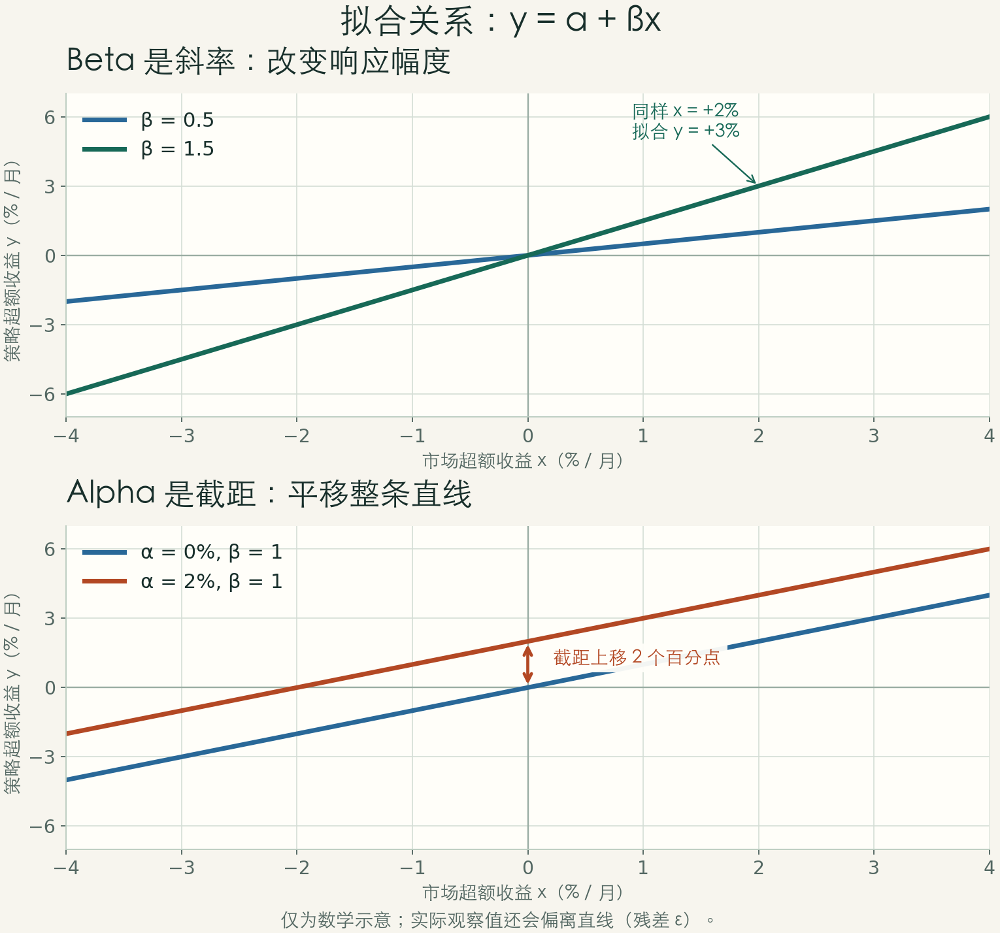

# 从规则到证据：量化投资学习导读

研究日期：2026-09-07。先打开 [量化图解学习页](learn/index.html)，沿着量化原理、成熟策略、验证与论文路线学习；遇到术语时查阅文末附录。

**量化投资，是把投资假设写成可重复的规则，用数据检验，再在成本与风险约束下决定如何持仓。** 数学、统计、代码是工具；最关键的能力是分清“有解释的规律”和“碰巧漂亮的历史”。

本资料默认读者刚接触金融：先图像和算例，再可选公式与 Python。主要研究股票及跨资产的日线至月度方法；做市、执行算法只作进阶地图。学习顺序和难度是本指南的教学判断，原始实证结论另附来源。不按 ENTP 或 ADHD 推断能力；短单元、可跳读、即时反馈来自你明确表达的阅读偏好。

## 1. 先建立四层地图

| 层 | 它回答什么 | 成熟例子 | 常见混淆 |
|---|---|---|---|
| 收益信号 | 什么情况下持有什么？ | 时间序列趋势、横截面动量、价值排序、配对价差 | 指标名称本身不是完整策略 |
| 组合与仓位 | 每种资产持有多少？ | 等权、均值–方差、逆波动率、风险预算 | 资金分得均匀不代表风险均匀 |
| 交易执行 | 怎样把目标仓位成交？ | TWAP、VWAP、Almgren–Chriss | 降低执行成本不等于预测涨跌 |
| 验证与监控 | 凭什么相信、何时停用？ | 时间留出、滚动验证、成本压力测试 | 一条漂亮净值曲线不等于可复现证据 |

广义量化金融也包括衍生品定价和风险模型。本课程聚焦“投资与交易策略研究”。AI 可参与信号、数据处理、风险估计等环节；量化不要求使用 AI，也不要求高频。全景依据：[Pedersen 的书目与目录](https://www.lhpedersen.com/books)、[Almgren–Chriss](https://www.risk.net/journal-risk/2161150/optimal-execution-portfolio-transactions)。

### 收益可能来自哪里？

| 候选机制 | 直觉 | 需要追问 |
|---|---|---|
| 承担风险得到补偿 | 别人不愿承担的坏时候，你承担了 | 是否只是隐藏的尾部风险或杠杆？ |
| 行为与信息反应 | 信息被逐渐吸收，或价格短期反应过度 | 为什么竞争者还没有消除它？ |
| 市场结构与约束 | 被动资金流、融资约束、流动性需求 | 成本、容量、借券是否吃掉机会？ |

这是综合解释框架，不是每种策略的因果定论。历史收益、经济理论、当前估值条件应放在一起判断；参见 [Ilmanen：Expected Returns](https://www.aqr.com/insights/research/book/expected-returns-an-investors-guide-to-harvesting-market-rewards)。

## 2. 六类方法：先会手算，再想优化

| 方法 | 教学规则 | 需要的数据 | 为何可能有效（假说） | 主要失效方式 | 原始入口 |
|---|---|---|---|---|---|
| 趋势／时间序列动量 | 看资产自己的过去收益；为正偏多，为负偏空或转现金 | 一致口径的价格／收益、波动率 | 信息逐渐扩散、趋势持续 | 震荡反复交易、快速反转 | Moskowitz–Ooi–Pedersen 2012 |
| 横截面动量 | 同一时点排序，买相对强者、卖相对弱者 | 同时点可交易资产池、历史收益 | 相对强弱的延续 | 弱者急涨、排名换手、借券限制 | Jegadeesh–Titman 1993 |
| 均值回归／配对交易 | 估计价差正常范围；偏离后押注收敛 | 两腿总收益序列、历史关系、借券与成交条件 | 临时错价、流动性冲击 | 关系永久断裂；两腿无法同步成交 | Gatev 等 2006 |
| 因子投资 | 按价值、规模等特征排序；或用因子回归解释收益 | 当时已公布的财务、价格与资产池 | 风险补偿或错误定价 | 风格长期低迷、价值陷阱、数据滞后处理错误 | Fama–French 1993 |
| 组合配置 | 等权作基线；再考虑波动率和协方差 | 对齐的资产收益 | 不同资产不完全同步 | 估计误差、相关性上升、杠杆 | Markowitz 1952；DeMiguel 等 2009 |
| 机器学习选股 | 用已有特征预测未来收益，再排序／配权 | 严格时间对齐的特征和标签 | 捕捉非线性与交互 | 泄漏、过拟合、成本、市场变化 | Gu–Kelly–Xiu 2020 |

表中“可能有效”的解释是研究假说；“成熟”指有可审查的理论／公开研究和实现传统，不表示现在按教材参数交易就能获得超额收益。

### 2.1 趋势与动量不是同一道题

教学时点：A 过去一年 +20%，B +5%，C −10%。

| 资产 | 时间序列方向 | 横截面排名 |
|---|---|---|
| A | 正 | 第 1 |
| B | 正 | 第 2 |
| C | 负 | 第 3 |

如果三者都下跌，横截面仍有“相对最强”的资产，而时间序列信号可以全部为负。横截面的多头腿可能是跌得最少的资产。

趋势教学规则：`signal_t = sign(过去 L 期累计收益)`。论文更具体：跨 58 个期货／远期品种，以过去 12 个月超额收益的符号构造方向，并结合波动率缩放。单只 ETF 的“上涨买入、下跌现金”只能用来学习流程，不是论文复现。[论文作者稿](https://docs.lhpedersen.com/TimeSeriesMomentum.pdf)、[作者机构摘要](https://www.aqr.com/Insights/Research/Journal-Article/Time-Series-Momentum)。

横截面教学规则：`rank_i = rank(过去收益_i)`；做多最高组，做空最低组，按预定频率重排。经典论文研究多种形成期／持有期；“12–2 动量”（跳过最近一月）是常见后续定义，不能把它当作 1993 年论文唯一算法。[Jegadeesh–Titman 原始出版页](https://onlinelibrary.wiley.com/doi/full/10.1111/j.1540-6261.1993.tb04702.x?scrollTo=footer-citing)。

### 2.2 配对：先定义价差，再谈回归

教学例子（不是论文交易定义）：`s = P_A − β P_B`；β 是对冲比例，`z = (s − μ) / σ`。β、μ、σ 必须由当时已经观察到的数据估计。

| 价差状态 | 教学动作 | 单位解释 |
|---|---|---|
| z > 2 | 做空 A，做多 β 单位 B | 卖出相对贵的价差 |
| z < −2 | 做多 A，做空 β 单位 B | 买入相对便宜的价差 |
| 回到均值附近 | 平仓 | 预先规定平仓区间 |
| 关系失效／到达持有期限 | 退出并重新研究 | 偏离更大不自动等于机会更好 |

若历史 μ=0、σ=2，当前 s=6，则 z=3。随后 s 从 6 变为 2，做空一单位价差的毛利润是 4 个价格单位；变成 10 则亏损 4。**这不是 4% 的账户收益**：收益率还取决于占用资本、杠杆、两腿规模和费用。

原始 Gatev 方法按“标准化累计总收益路径的距离”选配对，使用 12 个月形成期和随后的 6 个月交易期。它不等同于“相关系数筛选 + OLS + z-score”。作者稿也专门讨论伪相关、延迟交易和成本影响。[Yale 作者稿，方法见第 2 节](https://depot.som.yale.edu/icf/papers/fileuploads/2573/original/08-03.pdf)。

### 2.3 因子：特征、收益序列、暴露是三个东西

| 术语 | 例子 | 用途 |
|---|---|---|
| 特征 characteristic | 某公司的账面市值比 B/M | 给股票排序的输入 |
| 因子收益 factor return | 高 B/M 组合减低 B/M 组合的收益 | 可观察的研究收益序列 |
| 因子暴露 beta | 策略收益对 HML 的回归系数 | 解释策略承受了多少价值风格风险 |

三因子回归：`策略收益 − 无风险收益 = α + β_M·(市场−无风险) + β_S·SMB + β_H·HML + ε`。

- SMB：小盘减大盘；HML：高账面市值比减低账面市值比。它们是经过组合构造的收益，不能用一个股票指标直接替代。
- α 是相对于所选模型的截距估计，不是已经证明的能力；应看统计不确定性、遗漏风险、成本和样本外结果。
- 1993 年论文同时研究股票与债券的五个共同因子，其中股票部分是三因子；这与 2015 年股票五因子模型不是同一组“五因子”。后者增加盈利能力 RMW 与投资 CMA，动量并不在标准 FF5 中。

来源：[Fama–French 1993](https://www.sciencedirect.com/science/article/pii/0304405X93900235)、[Fama–French 2015](https://www.sciencedirect.com/science/article/pii/S0304405X14002323)。

### 2.4 组合：公式会优化，也会放大估计误差

两资产组合方差：`σ_p² = w_A²σ_A² + w_B²σ_B² + 2w_Aw_Bρσ_Aσ_B`。

若两资产年化波动率均为 20%、各配置 50%，则：

| 相关性 ρ | 组合年化波动率 | 意义 |
|---|---|---|
| +1 | 20.00% | 完全同向，没有波动分散收益 |
| 0 | 14.14% | 不完全同步，组合波动降低 |
| −1 | 0.00% | 理想数学边界；真实相关性会变化 |

上表为公式计算，不是市场测量，也不表示收益提高。Markowitz 的均值–方差思想把收益、风险与协方差一起考虑。[1952 原始论文](https://onlinelibrary.wiley.com/doi/10.1111/j.1540-6261.1952.tb01525.x)。

| 配置法 | 输入 | 入门用途 | 局限 |
|---|---|---|---|
| 等权 1/N | 资产数量 | 建立难以作弊的简单基线 | 忽略波动率和相关性 |
| 逆波动率 | 每个资产波动率 | 高波动少配、低波动多配 | 通常不等于完整风险平价 |
| 均值–方差优化 | 预期收益向量与协方差矩阵 | 理解“组合最优” | 对收益估计误差敏感 |
| 等风险贡献 | 协方差矩阵和约束 | 让各资产对组合风险的贡献相等 | 相关性估计与杠杆仍会出错 |

等风险贡献的目标可写为各资产 `w_i(Σw)_i / σ_p` 相等；这是对组合波动率的风险贡献。逆波动率只在特定协方差结构下与它一致。学习时不自动加杠杆。

必须配读的反证：DeMiguel 等在所研究的 14 种模型、7 组数据上，没有发现任何一种模型在其评价指标上持续胜过 1/N。结论受样本与模型范围约束，不是“优化永远没用”。[2009 期刊论文（2007 年在线发表）](https://doi.org/10.1093/rfs/hhm075)。

## 3. 先算账：预测对不等于赚到钱

假设 100 次等金额交易；70 次各赚 1 元，30 次各亏 3 元，则毛利润 `70×1−30×3=−20 元`。胜率 70% 仍亏损。这个人为算例只说明盈亏幅度不可忽略。

| 指标 | 它回答什么 | 不能单独证明什么 |
|---|---|---|
| 总收益／CAGR | 财富增加多少、复合年增长多少 | 收益路径是否可以承受 |
| 波动率 | 收益通常抖动多大 | 极端损失和流动性风险全貌 |
| 最大回撤 | 曾经从历史高点跌了多少 | 未来最坏情景 |
| Sharpe | 每单位超额收益波动获得多少平均超额收益 | 无尾部风险、真实 alpha |
| 换手率 | 交易了多少 | 单靠次数无法衡量，需交易规模 |
| 样本外结果 | 固定规则在未参与选择的数据上表现如何 | 永久有效，或完全消除研究者偏差 |

口径：`CAGR=(期末净值/期初净值)^(每年期数/观察期数)−1`；本文统一用非负回撤幅度：`回撤_t=1−净值_t/截至t的历史最高净值`，最大回撤取其最大值；`Sharpe≈平均周期超额收益/周期超额收益标准差×√每年期数`。简单年化需要相应的统计假设，收益有自相关时不能照搬；样本短、尾部厚和估计误差都需另看。[Pedersen，绩效评估章节目录](https://www.lhpedersen.com/books)、[Sharpe 原文](https://web.stanford.edu/~wfsharpe/art/sr/SR.htm)。

### 成本实验的明确口径

学习页设毛收益每年 8%，全年按净值计的**单边交易名义金额合计为 20 倍**。每单位交易金额成本为 c 基点，全年成本近似 `20×c/10000`；c=10bp 时约 2%，净收益近似 6%。买入 100% 再卖出 100% 计作 2 倍。图中的百分比差是“百分点”。

这是固定换手、忽略复利路径的一阶教学近似；现实还需佣金、买卖价差、滑点／冲击、借券、融资和适用税费。不能把“20 倍换手”误读成“20 个完整买卖来回”。执行成本的理论入口：[Almgren–Chriss](https://www.risk.net/journal-risk/2161150/optimal-execution-portfolio-transactions)。

## 4. 回测的时间线必须能画出来

| 时刻 | 确实知道什么 | 可以做什么 |
|---|---|---|
| t 日收盘后 | 截至 t 收盘的价格、此前已公布的数据 | 生成目标仓位 |
| t+1 日 | 后续成交机会 | 在明确模型下成交；不能免费拿到 t 日收盘价 |
| 成交以后 | 持仓期间的价格变化 | 计入策略收益，并扣交易成本 |

教学 Lab 只有收盘价，所以采用保守而清晰的口径：**t 日收盘发信号，t+1 日收盘成交，赚取 t+1 到 t+2 的收益**。它不是所有真实系统的唯一执行方式；若模拟次日开盘，必须提供开盘价并正确计算持有区间。

| 常见错误 | 发生了什么 | 修正 |
|---|---|---|
| 未来函数 | 看见今天完整收盘后又赚到了今天涨幅 | 区分信息、下单、成交与收益时间 |
| 幸存者偏差 | 用今天仍在的股票回到过去 | 使用历史资产池与退市收益 |
| 财务数据泄漏 | 把年报所属日期当公布日期 | 按可用时间对齐，保留发布与修订版本 |
| 全样本预处理 | 标准化、配对选择、β 估计都用了未来 | 训练窗口内拟合，再用于后续窗口 |
| 反复看测试集 | 看到坏结果继续调参数 | 记录尝试次数；测试集一旦用于选择就转为开发数据 |
| 不计成本 | 摩擦前的小优势被当作净优势 | 同时报毛收益、净收益、换手和成本压力测试 |

推荐实验顺序（教学建议）：先固定假说和一个参数 → 按时间分训练／验证／最终测试 → 在开发区滚动验证 → 冻结规则 → 最终测试 → 前向模拟。若标签覆盖多个未来交易日，应清除跨边界的标签重叠，按信息区间设置间隔；简单随机打乱金融时间序列通常不合适。[Gu–Kelly–Xiu 的时间划分](https://academic.oup.com/rfs/article/33/5/2223/5758276)、[López de Prado 的金融 ML 方法书](https://uat.store.wiley.com/en-us/advances-in-financial-machine-learning-p-9781119482086)。

### 试得越多，越容易挑到幸运儿

纯教学假设：每个无效检验的误报率为 5%，各次检验独立且所有原假设为真。

`至少一次误报概率 = 1 − (1−0.05)^N`。

| 独立尝试 N | 至少一次误报 |
|---|---|
| 1 | 5.0% |
| 10 | 40.1% |
| 20 | 64.2% |
| 100 | 99.4% |

这不是实际量化策略的失败概率，也不是论文中的 PBO；真实策略尝试往往相关。PBO 研究的是样本内胜出者在样本外排名落到中位数以下的概率，并提出 CSCV 估计方法。[Bailey 等作者稿](https://www.davidhbailey.com/dhbpapers/backtest-prob.pdf)。CSCV 不是可直接替代前向交易验证的随机时间切分建议；初学阶段先做到时间正确、记录全部尝试、保留未用数据。

## 5. 机器学习放在什么位置？

`当时可用特征 → 预测器 → 预期收益/排名 → 仓位约束 → 扣成本的组合收益`。

| 算法 | 直觉 | 第一件要验证的事 |
|---|---|---|
| 线性回归 | 各特征贡献加起来 | 简单基线是否已有预测力 |
| Ridge／Elastic Net | 限制系数，减少对噪声的追逐 | 只在开发区选择正则强度 |
| 随机森林 | 许多树分工、平均 | 是否学到了可迁移的分组关系 |
| 梯度提升树 | 逐步补偿此前的预测误差 | 增益能否覆盖复杂度和换手成本 |
| 神经网络 | 学习非线性组合 | 数据量、时间稳健性是否足够 |

Gu、Kelly、Xiu 比较了多种方法，研究美国股票月度风险溢价；正式论文覆盖 1957–2016 年。初始训练／验证／测试分别为 1957–1974、1975–1986、1987–2016，并逐年扩展训练和移动验证窗口。它支持研究 ML 的非线性预测价值，不支持“AI 能准确预言明天价格”。预测关系也不直接识别经济因果机制。[2020 正式论文](https://academic.oup.com/rfs/article/33/5/2223/5758276)。

入门项目建议：先等权和买入持有，再一个趋势规则，再一个线性模型，最后再加树模型。每增加一层只回答“相对于上一层，样本外净收益或风险表现改进多少”。

## 6. 书单：六本分工，不必一次买齐

按**英文原名和版本**检索，避免中文译名或重印信息混淆。难度是教学判断。未通读全部付费图书；下面根据出版社、作者目录和公开介绍核对选题，不把出版宣传中的盈利表述当作证据。

| 顺序 | 作者与书 | 用来解决什么 | 推荐打开方式 | 前置／边界 |
|---|---|---|---|---|
| 首选：建立地图 | Lasse Heje Pedersen, **Efficiently Inefficient** (Princeton, 2015) | 策略为何存在，市场摩擦怎样影响收益 | Introduction → Ch.2–5 → Ch.9 量化股票 → Ch.12 趋势；先看图表与访谈 | 低–中；先跳公式。作者官网明确支持不同深度阅读 |
| 首选：建立研究流程 | Ernest P. Chan, **Quantitative Trading: How to Build Your Own Algorithmic Trading Business**, 2nd ed. (Wiley, 2021) | 想法怎样变成回测、风险管理和执行 | 围绕策略选择、回测、风险部分阅读；先不研究创业运营 | 低–中；本指南固定 2021 版，不声称它是最新版本 |
| 第三本：拆策略 | Ernest P. Chan, **Algorithmic Trading: Winning Strategies and Their Rationale** (Wiley, 2013) | 均值回归与动量怎样形成规则 | 按均值回归／动量主题选读，手算一个价差 | 中；书中语言与数据环境较旧，概念比照抄代码更重要 |
| 组合与仓位 | Robert Carver, **Systematic Trading** (Harriman House, 2015) | 把规则与仓位、成本、分散连起来 | 先读规则设计、position sizing、交易成本相关内容 | 中；作者有 AHL 组合管理经历，见出版社简介 |
| 收益来源百科 | Antti Ilmanen, **Expected Returns: An Investor’s Guide to Harvesting Market Rewards** (Wiley, 2011) | 风险溢价、价值、动量、carry 的机制 | 查字典式阅读：先选一个收益来源 | 中–高；不要求从头读到尾 |
| ML 进阶 | Marcos López de Prado, **Advances in Financial Machine Learning** (Wiley, 2018) | 金融数据、标签、验证和研究中的特殊问题 | 带着“标签重叠／验证泄漏”的问题查读 | 高；先会回测和基础统计，不能跳过简单基线 |

购买／目录入口：[Pedersen 作者书页](https://www.lhpedersen.com/books) · [Chan 2021 Wiley 页面](https://uat.store.wiley.com/en-us/quantitative-trading-how-to-build-your-own-algorithmic-trading-business-2nd-edition-p-9781119800064) · [Chan 2013 Wiley 页面](https://uat.store.wiley.com/en-us/algorithmic-trading-winning-strategies-and-their-rationale-p-9781118746912) · [Carver 出版社](https://www.harriman-house.com/authors/robert-carver/systematic-trading/9780857194459) · [Ilmanen 作者机构](https://www.aqr.com/insights/research/book/expected-returns-an-investors-guide-to-harvesting-market-rewards) · [López de Prado Wiley](https://uat.store.wiley.com/en-us/advances-in-financial-machine-learning-p-9781119482086)。部分 Wiley 页面本次直接打开受限，书目信息来自其可读取的搜索索引；未验证购买结账或地区库存。

## 7. 论文路线：八篇核心，两个进阶路标

不必全文精读。每篇先用 15 分钟填五格：**问题、规则、样本、对照、失效条件**。第一轮跳过证明，只看摘要、方法图／表和结论。

| 路线 | 作者、年份与原文 | 只带走一个问题 | 证据边界／打开状态 |
|---|---|---|---|
| P1 组合 | Harry Markowitz (1952), [Portfolio Selection](https://onlinelibrary.wiley.com/doi/10.1111/j.1540-6261.1952.tb01525.x), Journal of Finance 7(1):77–91 | 为什么好资产不一定组成好组合？ | 理论原点；本次核对出版页，未逐页审查全文 |
| P2 相对强弱 | Narasimhan Jegadeesh, Sheridan Titman (1993), [Returns to Buying Winners and Selling Losers](https://onlinelibrary.wiley.com/doi/full/10.1111/j.1540-6261.1993.tb04702.x?scrollTo=footer-citing), Journal of Finance 48(1):65–91 | 相对赢家为何可能继续领先？ | 已读原始摘要；不同形成期与持有期，不能当今日绩效 |
| P3 绝对趋势 | Tobias Moskowitz, Yao Hua Ooi, Lasse Pedersen (2012), [Time Series Momentum](https://docs.lhpedersen.com/TimeSeriesMomentum.pdf), JFE 104(2):228–250 | 自身收益方向与相对排名有何差别？ | 作者 PDF 索引可读，直接读取超时；另核对 AQR 原始摘要。资产是期货／远期 |
| P4 因子 | Eugene Fama, Kenneth French (1993), [Common Risk Factors in the Returns on Stocks and Bonds](https://www.sciencedirect.com/science/article/pii/0304405X93900235), JFE 33(1):3–56 | 策略收益有多少来自共同风险？ | 已读出版摘要；股票三因子与债券两因子 |
| P5 相对价值 | Evan Gatev, William Goetzmann, K. Geert Rouwenhorst (2006), [Pairs Trading: Performance of a Relative-Value Arbitrage Rule](https://doi.org/10.1093/rfs/hhj020), RFS 19(3):797–827；[Yale 作者稿](https://depot.som.yale.edu/icf/papers/fileuploads/2573/original/08-03.pdf) | 配对如何选择、何时进入、分母怎么定义？ | 已读作者稿方法与成本段落；2006 版本样本 1962–2002，勿与 1999 NBER 早稿混用 |
| P6 反证 | Victor DeMiguel, Lorenzo Garlappi, Raman Uppal (2009), [Optimal Versus Naive Diversification](https://doi.org/10.1093/rfs/hhm075), RFS 22(5):1915–1953 | 估计误差能否抵消优化收益？ | 已读原始摘要；2007 在线、2009 卷期；非“一切优化无用” |
| P7 研究陷阱 | David Bailey, Jonathan Borwein, Marcos López de Prado, Qiji Jim Zhu (2017), [The Probability of Backtest Overfitting](https://scholarworks.wmich.edu/math_pubs/42/), Journal of Computational Finance 20(4):39–69；[2015 作者稿](https://www.davidhbailey.com/dhbpapers/backtest-prob.pdf) | 从许多试验里挑冠军，会造成什么偏差？ | 已读作者稿定义、CSCV 与留出局限；作者稿年份和正式出版年份分开 |
| P8 连接 AI | Shihao Gu, Bryan Kelly, Dacheng Xiu (2020), [Empirical Asset Pricing via Machine Learning](https://academic.oup.com/rfs/article/33/5/2223/5758276), RFS 33(5):2223–2273 | 非线性增益是否经得住时间外推？ | 已读正式版模型、数据与时间划分；[NBER 2018/2019 版本](https://www.nber.org/papers/w25398)可作替代入口 |
| P9 做市路标 | Marco Avellaneda, Sasha Stoikov (2008), [High-frequency Trading in a Limit Order Book](https://math.nyu.edu/inmemoriam/avellaneda/HighFrequencyTrading.pdf), Quantitative Finance 8(3):217–224 | 如何在赚价差的同时管理库存？ | 已核对摘要／引言；理想化模型，非现代高频完整系统 |
| P10 执行路标 | Robert Almgren, Neil Chriss (2001), [Optimal Execution of Portfolio Transactions](https://www.risk.net/journal-risk/2161150/optimal-execution-portfolio-transactions), Journal of Risk | 交易太快冲击大，太慢价格风险大，怎么平衡？ | 已读出版摘要；不提供涨跌预测 |

## 8. 免费且适合图像学习的入口

| 入口 | 怎么用 | 不要误用 |
|---|---|---|
| [Robert Shiller：Yale Financial Markets 2011](https://oyc.yale.edu/economics/econ-252) | 优先第 2 讲风险、第 4 讲分散、第 7 讲有效市场、第 11 讲行为金融；先挑一段 | 历史课程用于概念，不用于核对现行市场规则 |
| [第 2 讲：视频、文字、讲义和小测](https://oyc.yale.edu/economics/econ-252-11/lecture-2) | 从 09:58 的收益／统计概念开始；26:29 后看独立性与危机 | 不需要一口气看完完整课程 |
| [Time Series Momentum 作者 slides](https://pages.stern.nyu.edu/~lpederse/papers/TSMOM_Slides.pdf) | 先扫图标题，写下趋势与横截面的区别，再回论文 | 早期 slides 不等于最终期刊版本；本次核对入口，未逐页审阅 |
| [Kenneth French Data Library](https://mba.tuck.dartmouth.edu/pages/faculty/ken.french/data_library.html) | 下载一个月度因子 CSV，先画收益与回撤 | 因子是研究组合收益，不是基金净值，也非扣完个人费用的收益 |
| [AQR：Time Series Momentum 原始论文数据](https://www.aqr.com/Insights/Datasets/Time-Series-Momentum-Original-Paper-Data?aqrPDF=1) | 用已有研究收益练指标；区分原始样本和扩展数据 | 它不是完整的合约级数据，不能据此声称复现交易过程 |

French 数据库说明自 2025 年起使用 CRSP CIZ，月度收益／分红复投计算口径与旧 FIZ 有差异。实验要保存下载日期、文件和数据说明，不把数据更新误认作代码错误。[数据库说明](https://mba.tuck.dartmouth.edu/pages/faculty/ken.french/data_library.html)。本次未下载或检验真实市场序列。

## 9. 10 个短单元与一个最小 Lab

| 单元 | 约用时 | 做完的可见产物 |
|---|---|---|
| 01 量化是什么 | 8 分钟 | 能把直觉改成数据、规则、仓位、检验四格 |
| 02 收益从哪来 | 8 分钟 | 为一个策略写一个机制、一个反例 |
| 03 趋势 | 12 分钟 | 手算一次过去收益和下一步信号 |
| 04 横截面动量 | 8 分钟 | 给三只资产排名，解释全跌时怎么办 |
| 05 均值回归 | 12 分钟 | 算 z-score，画出关系断裂后的亏损 |
| 06 因子 | 10 分钟 | 分清特征、因子收益、因子暴露 |
| 07 组合 | 12 分钟 | 调整相关性，解释分散为何变化 |
| 08 回测与成本 | 15 分钟 | 画对信号→成交→收益的时间线 |
| 09 过拟合 | 10 分钟 | 解释为什么试 100 次会改变证据强度 |
| 10 连接 AI 与下一步 | 15 分钟 | 写出一个可被否定的实验计划 |

时间为建议，可拆成多次完成。每次只完成“看一图 → 算一个数 → 回答一题”；离开前写一句“下次从哪里继续”。不要求打卡、连胜或每日固定时长。

### 可选 Python：只验证回测流程

运行：`python3 quantitative-investing/lab_trend.py`（在仓库根目录）。无需第三方库、账户或网络。

实验使用固定随机种子的**合成价格**，20 日均线、只做多／现金、最多 100% 仓位；不是 2012 年论文复现。把前 2/3 标为开发段、后 1/3 标为固定规则检查段；不自动优化。输出与同口径买入持有对比，并演示更高成本。检查段仍是已知生成规则的合成数据，不能作为真实样本外业绩证据。

| 步骤 | 验收 |
|---|---|
| 先读时间口径 | 第一个信号不会赚到信号当天或下一天成交前的涨幅 |
| 跑默认参数 | 看总收益、最大回撤和单边换手；接受任何盈亏结果 |
| 看高成本场景 | 同一持仓路径成本提高，最终净值不能提高 |
| 看买入持有 | 它使用同一数据区间和成本口径，不能偷偷缩短比较区间 |
| 改一个参数再跑 | 记录此次尝试；原检查段从此也是开发数据 |

下一次真正的研究任务：预先选定一个资产池与数据区间，冻结一个规则，对真实、可用时间正确的数据做时间外推，并审计成本与基线。先不接入自动交易。

## 10. 来源审计与研究范围

- 书目用作者、出版社核对；论文优先正式出版页与作者托管稿；课程／数据使用大学或作者机构页面。未使用营销榜单给策略有效性背书。
- 术语附录另以 Damodaran 作者开放章节、Sharpe 1994 原文核对基础定义与统计口径；它们是免费定义阅读入口，不改变六本策略书与八篇核心策略论文的阅读清单。工程类比、手算与合成散点为本教程编排，不是原作者的实证结果。
- 冲突已分开：PBO 2015 作者稿／2017 正式版；配对 1999 早稿／2006 版本；1/N 2007 在线／2009 卷期；Chan 固定 2021 版。网页的抓取时间不当作研究发表时间。
- AQR 等作者机构同时从事投资业务，机构摘要具有利益相关背景；其历史研究不视作独立的当前业绩保证。
- 查找围绕策略机制、正式版本、方法定义、反例与可读入口；在六本书、八篇核心论文和两个进阶方向均有一手入口，关键定义与时间口径足够支撑入门教学后停止扩展。
- 本次交付是来源可追溯的课程设计和概念实验。没有审计付费书籍全文，没有复现论文收益，没有验证今天任何策略仍有 alpha；未取得的全文访问情况已经逐项标出。

所有价格、收益算例、交互曲线均为本指南自制教学内容；不会把合成数值标为真实行情或论文结果。

## 附录 A. 术语与指标：按需查阅

本附录辅助正文中的策略与风险讨论，遇到不熟悉的词再查。每个指标按问题、定义、计算和用途解释。

| 先问什么 | 数字 | 工程直觉 | 为什么使用它 |
|---|---|---|---|
| 不同本金的盈利怎么比较？ | 收益率 r | 归一化 | 消除资金规模差异，仍需注明周期 |
| 比哪个 baseline 多赚？ | 无风险超额收益／主动收益 | 对照差值 | 区分现金参照与市场／策略参照 |
| 市场变化时，策略如何响应？ | Beta β | 回归斜率 | 衡量市场暴露、做归因与对冲 |
| 模型解释之后，平均还剩多少？ | Alpha α | 回归截距 | 评估相对所选模型的额外表现 |
| 每期结果偏离平均值多远？ | 波动率 σ | 标准差 | 比较波动尺度、调整仓位 |
| 从之前的最高点跌了多少？ | 回撤 D、最大回撤 MDD | 路径上的峰谷差 | 观察资金压力，补充均值与标准差 |
| 每单位波动换来多少超额收益？ | Sharpe | 均值／标准差 | 在共同波动尺度下比较表现 |

### A.1 收益率、百分点与复利

无存取款、分红已计入账户价值时：`r_t = V_t / V_(t−1) − 1`。同一个月，1,000 变 1,100 是 10%，1,000,000 变 1,010,000 是 1%；收益金额与收益率回答不同问题。

累计收益为 `∏(1+r_t) − 1`。100 先涨 10% 再跌 10% 变成 99，累计 −1%。CAGR 是 `(期末/期初)^(1/年数) − 1`，把整条路径折算成恒定年增长率；它不能描述中间的损失。

**1 bp = 0.01 个百分点 = 0.0001。** 5% 到 6% 是提高 1 个百分点／100 bp，而相对原来的 5% 增加了 20%。程序中 10% 通常写为 0.10。

### A.2 Alpha、beta：先画散点，再拟合直线



取同一周期、同一币种的数据，每个月对应一个点：

```text
x_t = 市场收益 r_m,t − 无风险参照收益 r_f,t
y_t = 策略收益 r_t − 无风险参照收益 r_f,t
y_t = α + β x_t + ε_t
```

无风险参照要匹配币种和周期；不能把任意期限的国债收益当作任意持有期里确定不变的现金收益。

**β 是斜率**：x 增加 1 个百分点，拟合 y 增加 β 个百分点。**α 是截距**：当 x=0 时，直线的 y 值；在这个回归中，也是模型因子部分以外的平均收益估计。**ε_t 是残差**：当期实际值相对拟合值的偏离。

从最小二乘推导，最小化 `Σ(y_t − a − bx_t)²`，对 a、b 分别求导为零：

```text
β̂ = Σ[(x_t−x̄)(y_t−ȳ)] / Σ(x_t−x̄)²
   = Cov(x,y) / Var(x)
α̂ = ȳ − β̂x̄
β = ρ(x,y) × σ_y / σ_x
```

协方差统计共同变化，除以输入方差后成为斜率。同一口径下 β 无量纲；α 有收益率的单位与周期，例如“+0.5%／月”。若 x 不变化，无法辨认斜率。相关系数 ρ 在 −1 到 1 之间，beta 因为还包含波动幅度比，可以大于 1。

图解里的七个合成市场收益为 `[-6,-4,-2,0,2,4,6]%`；残差基础序列为 `[1,-1,-1,2,-1,-1,1]%`。残差和为零、与中心化 x 内积为零，所以单独改变其幅度不会改变拟合斜率和截距。真实数据没有这样的人为控制，参数与不确定性需要重新估计。

| 说法 | 正确解释 | 不能推出 |
|---|---|---|
| “高 beta 股” | 对所选市场基准比较敏感；β>1 是常用直观界线，取决于指数、窗口与频率 | 正式股票类别、一定涨得多、每次都按倍数跟随 |
| “β=0” | 没有这个模型中的线性市场暴露 | 无波动、无风险 |
| “月度 α̂=0.5%” | 这段样本与模型下的月度截距估计 | 每个月固定多赚 0.5%、下个月仍然成立 |
| “R²=80%” | 含截距 OLS 在样本内解释了约 80% 的收益变动 | 80% 预测准确率、80% 盈利概率 |
| “这是一个 alpha 信号” | 业界口语可能指预测收益的打分或交易信号 | 已经获得统计显著的回归 alpha |

### A.3 一个账本：跑赢大盘却未显示额外剩余

假设某月无风险收益 0.2%，市场总收益 2.2%，策略总收益 3.2%，此前拟合 β=1.5：

| 项目 | 计算 | 结果 |
|---|---|---|
| 主动收益 | 3.2% − 2.2% | +1.0 个百分点 |
| 市场超额收益 | 2.2% − 0.2% | +2.0 个百分点 |
| 市场暴露项 | 1.5 × 2.0% | +3.0 个百分点 |
| 现金参照加市场暴露 | 0.2% + 3.0% | 3.2% |
| 该月模型调整后的剩余 | 3.2% − 3.2% | 0 |

一个月的剩余是 `α + ε_t`，不能直接拿来判定稳定 alpha。样本内含截距 OLS 的残差均值为零，才有 `α̂ = 平均策略超额收益 − β̂ × 平均市场超额收益`。

人们使用 alpha，是为了判断一个收益记录能否由共同风险暴露解释，辅助策略比较与费用评估。遗漏因素、运气、成本口径和筛选历史都可能影响它。将规模、价值等因子加入模型后，原来的一部分 alpha 可能转为这些因子的解释项。

回归是在数据中拟合关系；CAPM（资本资产定价模型）是在特定假设下讨论预期收益应如何补偿市场风险。`E[r]−r_f = β(E[r_m]−r_f)` 中 E 表示期望。估计出一条回归线不等于证明 CAPM。以这一基准评估的截距常称 Jensen’s alpha；直接回归原始收益得到的截距，不经无风险调整不能自动当成这里的 alpha。

定义来源：[Damodaran，Applied Corporate Finance 第 3 版，第 4 章 4.29–4.30](https://pages.stern.nyu.edu/~adamodar/pdfiles/acf3E/book/ch1thru4.pdf#page=174)。已核对作者开放章节中的回归形式、截距区别、R² 和参数估计误差；算例和推导步骤为本教程自制。

### A.4 波动率、回撤、Sharpe：三种不同的信息压缩

```text
样本标准差：s = sqrt(Σ(r_t − 平均r)² / (n−1))
历史峰值：H_t = max(V_0, …, V_t)
当期回撤：D_t = 1 − V_t/H_t；最大回撤 MDD = max(D_t)
超额序列：d_t = r_t − r_f,t
历史 Sharpe：平均(d_t) / 样本标准差(d_t)
```

为什么标准差平方再开根号？直接平均偏离会正负抵消；平方保留大小，开根号恢复收益率单位。方差便于组合风险的代数分解，但不是唯一可能的风险度量。

教学序列 A=`[0,2,0,2]%`、B=`[-9,11,-9,11]%`，均值均为 1%，样本标准差分别约 1.15%、11.55%。波动率衡量收益率的分散程度，不是价格水平的标准差。净值路径 `[100,120,90,108]` 的最大回撤为 `1−90/120=25%`；末期仍回撤 10%。历史最大回撤不是未来损失上限。

在假设的年度指标中，策略 A 平均收益 12%、无风险参照 4%、超额收益波动率 16%，Sharpe=0.5；B 对应为 10%、4%、8%，Sharpe=0.75。若 A 与现金各占一半，收益均值成为 8%、波动率成为 8%，Sharpe 仍为 0.5。因此单看更高总收益会漏掉风险尺度的区别。

Sharpe 不等于胜率，也不等于样本外可靠程度。它压缩了分布形状，不包含完整的尾部、流动性与路径信息。在以同一无风险利率融资、无额外成本、正倍数缩放的理想条件下，杠杆同时放大超额均值与标准差，比值不变。

月度 Sharpe 常用 `sqrt(12)` 年化，但这依赖稳定且无序列相关的加总近似；自相关、时变波动与复利会影响结果。完整口径必须注明频率、样本长度、无风险参照、费用与年化方法。标准差为零时比值未定义，不能把它解释成无限可靠。

原作者阅读：[William F. Sharpe，The Sharpe Ratio（1994）](https://web.stanford.edu/~wfsharpe/art/sr/SR.htm)。已核对历史／预期定义、时间缩放与规模性质。建议先读 The Ratio、Time Dependence、Scale Independence；表格和数据为本教程原创示意。

其他术语如头寸、仓位、杠杆、因子、暴露、价差、z-score、市值、P/E、B/M、换手与滑点，见 [操作性词典](learn/foundations.html#dictionary)。尤其注意：配对价格回归中的 β 常表示对冲比例，不自动等于本节的市场收益 beta。
