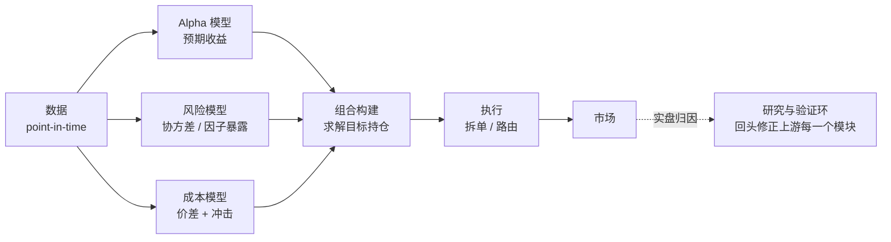
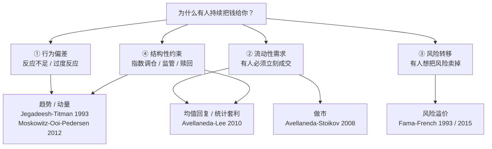
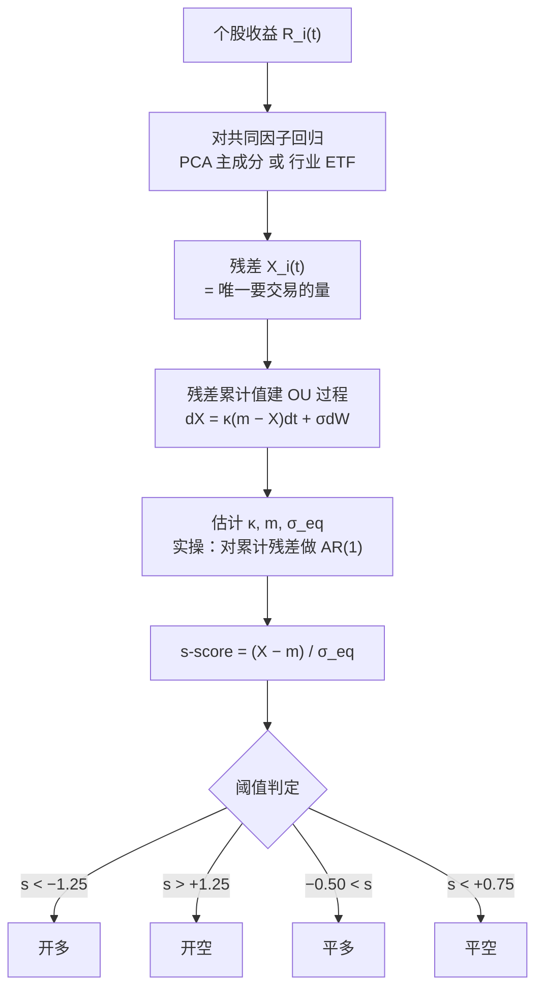
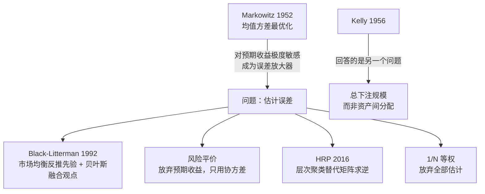

# 量化交易：算法族谱、验证方法与来源账本

> 研究日期：2026-09-07<br>
> 主题范围：系统化 / 量化二级市场交易。覆盖 alpha 来源、组合构建、执行成本与回测验证方法论。**不覆盖**衍生品定价（Black-Scholes 一系）与做市基础设施工程。<br>
> 配套学习页：[一个很小的优势，重复很多次 — 从零学量化交易](learn/)　**先读那篇建立取舍和顺序，再拿这篇当手册查**<br>
> 阅读约定：**【来源事实】** 是论文/书籍直接支持的陈述；**【综合解释】** 是把多个来源放进同一模型后的推导；**【实践建议】** 是可执行但需按你的市场与成本结构自行验证的方案。<br>
> **免责声明：本文为技术与研究方法学习材料，不构成投资建议，不推荐任何证券或交易策略。文中所有历史业绩数字来自公开文献，用于说明方法的性质与局限，不代表未来表现。**

---

## 0. 先给结论

量化交易不是「用数学预测价格」。它是一条把**微弱但可测量的统计偏差**，在成本、风险与自我欺骗三重损耗下，稳定转化为收益的工程链路。



**四条主干判断：**

1. **收益质量由 `IR = TC × IC × √BR` 决定**，量化的选择是牺牲单次准度（IC 低到 0.02–0.06）换取重复次数（BR 大）。【来源事实：Grinold 1989；Clarke-de Silva-Thorley 2002】
2. **alpha 只有四个原始来源**：趋势/动量、均值回复、流动性提供（做市）、承担风险溢价。其余都是这四类的参数化重组。【综合解释】
3. **执行成本按规模的平方根增长**，这构成策略容量的硬上限，也是高 Sharpe 策略普遍封闭的原因。【综合解释，基于 Almgren-Chriss 2000 的冲击成本框架】
4. **回测的默认状态是过拟合**。5 年日线 + 45 个独立配置足以凭空造出样本内 Sharpe = 1 的假策略。【来源事实：Bailey, Borwein, López de Prado & Zhu 2014】

---

## 1. 核心公式：主动管理基本定律

### 1.1 原始形式

【来源事实】Grinold (1989) 给出：

$$ IR = IC \times \sqrt{BR} $$

- **IR**（information ratio）：主动收益 ÷ 主动风险。
- **IC**（information coefficient）：预测值与实现收益的横截面相关系数。
- **BR**（breadth）：每年**独立**主动决策的次数。

### 1.2 约束修正

【来源事实】Clarke、de Silva 与 Thorley (2002) 加入**转移系数**（transfer coefficient, TC）：

$$ IR = TC \times IC \times \sqrt{BR} $$

TC 衡量理想（无约束）权重与实际（受约束）权重的相关性。禁止做空、行业中性约束、单票上限、换手上限、成本约束都会压低 TC。

【综合解释】TC 的实践含义是：**约束会按比例削减有效广度**。这解释了为什么同一套 alpha 信号在对冲基金（约束少）与公募长仓产品（禁止做空）里的表现差异巨大，而这个差异与信号质量无关。

### 1.3 三个常见误用

| 误用 | 为什么错 | 正确做法 |
|---|---|---|
| 把交易次数当 BR | BR 要求**独立**。500 只票上跑同一个信号，若它们共享同一个 beta，有效独立数可能是个位数 | 用主成分或因子模型估计有效独立赌注数；或直接看信号收益序列的有效自由度 |
| 用样本内 IC 代入 | 样本内 IC 是搜索的产物，不是预测能力 | 只用严格样本外的滚动 IC |
| 忽略 TC | 实盘 TC 常在 0.3–0.6 区间 | 把约束加进优化后重算理想权重与实际权重的相关性 |

【实践建议】把这条公式当作**动手之前的可行性估算**：如果在乐观假设下 IR 都算不到 0.5，这个方向不值得投入时间。

---

## 2. Alpha 的四个来源

### 2.1 族谱



### 2.2 对照表

| 家族 | 核心假设 | 典型持仓期 | 文献 Sharpe 区间 | 容量 | 主要失效模式 |
|---|---|---|---|---|---|
| 趋势 / 动量 | 已在运动的会继续运动 | 1–12 月 | 0.3–0.9 | 大 | 动量崩溃（市场急速反转时空头端巨亏） |
| 均值回复 / 统计套利 | 偏离是暂时的 | 分钟–周 | 0.9–1.5 | 中 | 关系断裂（暂时偏离实为永久重定价） |
| 做市 | 双边报价可覆盖库存风险 | 秒–分钟 | 2–8 | 小 | 逆向选择、库存无法及时出清 |
| 风险溢价（beta） | 承担风险应获补偿 | 年 | 0.2–0.5 | 极大 | 风险兑现（按定义就该在最差时刻亏钱） |

【综合解释】Sharpe 区间为公开文献中的典型报告值，**扣除真实成本、考虑发表后衰减之后普遍更低**。它们的作用是提供数量级直觉，不是目标。

【实践建议】对任何候选策略执行一次「对手方检验」：写下一句话说明**谁在持续亏钱给你、为什么他愿意**。答不上来的策略应视为过拟合，直接丢弃。这个检验成本为零，筛除率极高。

---

## 3. 算法拆解 A · 截面动量

### 3.1 原始结论

【来源事实】Jegadeesh & Titman (1993, *Journal of Finance* 48(1): 65–91)：按过去 3–12 个月收益对个股排序，做多赢家组合、做空输家组合，在 3–12 个月的持有期上获得显著正收益。论文最详细考察的设定是**过去 6 个月排序 / 持有 6 个月**，报告**年均约 12.01% 的复合超额收益**。

【来源事实】原文的策略在形成期与持有期之间**跳过一周**（skip a week），用于规避买卖价差、价格压力与滞后反应的影响。

【综合解释】今天通行的 **12-2 动量**（过去 12 个月收益、跳过最近 1 个月）是**后续文献的标准化惯例**（常与 Fama-French 1996、Carhart 1997 一并引用），**不是 1993 年论文的原始算法**。二级资料里常见的「月均约 1.5%」也不是该论文的头条口径，而是某个特定排序/持有组合的单元格数值。引用时应区分这三层：原文结论 / 原文的跳周设定 / 后世的跳月惯例。

【来源事实】Moskowitz、Ooi & Pedersen (2012, *JFE*) 在 **58 个**流动性期货与远期合约（股指、汇率、商品、主权债）上发现**时间序列动量**：单个品种过去 12 个月的超额收益正向预测其未来收益，该效应持续约一年后部分反转。这是 CTA / 管理期货行业的理论支柱。

### 3.2 参考实现

```python
# 前提：R 为月频收益矩阵，且为 point-in-time（含已退市标的、用当时真实成分股）
for t in rebalance_dates:
    universe = liquid_names_as_of(t)                  # 当时可交易且流动性达标
    score = R.loc[t-12 : t-1, universe].sum()         # 12-2：跳过最近 1 个月规避短期反转（后世惯例，非 JT1993 原文）
    score = score / vol.loc[t-12 : t-1, universe]     # 风险调整动量

    ranks = score.rank(pct=True)
    w = pd.Series(0.0, index=universe)
    w[ranks > 0.9] = +1.0
    w[ranks < 0.1] = -1.0
    w = w / w.abs().sum()

    w = neutralize(w, exposures=['sector', 'beta', 'size'])   # 关键：不做这步测的是行业轮动
    target[t] = w
```

### 3.3 必须做的三件事

| # | 步骤 | 不做的后果 |
|---|---|---|
| 1 | **跳过最近 1 个月**（12-2 惯例，非 JT1993 原文；原文跳一周） | 短期反转与中期动量方向相反，会互相抵消，可能得出「动量无效」的错误结论 |
| 2 | **行业 / beta / 市值中性化** | 测到的是行业轮动而非动量本身；回测在特定年份会异常好看 |
| 3 | **按 \|Δw\| 扣价差与冲击** | 高换手策略被系统性高估 |

### 3.4 已知失效模式：动量崩溃

【综合解释】动量的收益分布**左偏**：平时小额稳定盈利，在市场从极度恐慌急速反转时（典型如 2009 年 3 月起数月），做空的「输家」组合是被打到低位的高 beta 股票，反弹幅度最大，空头端集中亏损。其收益形状与卖出保险同构。

【实践建议】标准缓解手段是**波动率目标**（实现波动上升时自动降杠杆）与**状态相关的暴露调整**（熊市中降低动量权重）。注意这不是「加止损」——止损处理的是单笔仓位，这里处理的是整个策略的尾部形状。

---

## 4. 算法拆解 B · 统计套利

### 4.1 为什么不做朴素配对

【综合解释】在 N 个标的中遍历配对得到 N(N−1)/2 个候选（500 只票 → 124 750 对）。在这个规模上按历史协整强度排序，选出的头部配对绝大部分是多重检验的产物。**问题不在配对交易这个想法，在于「遍历筛选」这个发现机制本身就在制造假阳性。**

### 4.2 Avellaneda-Lee 的工业化方案

【来源事实】Avellaneda & Lee (2010, *Quantitative Finance* 10(7): 761–782)：用 PCA 或行业 ETF 回归提取共同因子，把个股的**特异性收益（残差）**建模为均值回复过程，据此构造反向策略。



【综合解释】关键设计有三点：
1. **交易残差而非价格。** 价格接近随机游走，残差才有结构性的回复理由。
2. **s-score 使不同标的可比。** 标准化之后可以在全市场排序，只交易偏离最极端的部分——这直接提高了公式里的 BR。
3. **开平仓阈值不对称。** 开仓要求偏离足够大以覆盖成本；平仓不等回到 0，因为等待有时间成本且关系可能已断裂。

### 4.3 报告的业绩与衰减

【来源事实】扣除交易成本后：

| 版本 | 期间 | 年化 Sharpe |
|---|---|---|
| PCA | 1997–2007 | 1.44 |
| PCA | 2003–2007（子区间） | 0.90 |
| 行业 ETF | 1997–2007 | 1.10 |

【综合解释】**1.44 → 0.90 这个下降比 1.44 这个数字重要得多。** 同一方法、同一市场，仅时间后移，收益接近腰斩。这是 alpha 衰减的直接观测，与 §7 的 McLean-Pontiff 结论互相印证。任何 2026 年读到的公开策略，其真实期望应按显著折扣估计。

### 4.4 必须加的护栏

| 护栏 | 触发条件 | 理由 |
|---|---|---|
| 止损 | s 继续走到 ±4 | 承认模型可能已失效，禁止在此加仓 |
| 事件过滤 | 并购、退市、重大公告、停牌 | 这些情形下均值回复假设不成立 |
| 时间止损 | 持仓超过 2–3 倍 OU 半衰期（半衰期 = ln2/κ） | κ 的估计已被证伪 |

---

## 5. 算法拆解 C · 做市

### 5.1 模型

【来源事实】Avellaneda & Stoikov (2008, *Quantitative Finance* 8(3): 217–224)：单资产做市商在 CARA 效用下最大化终期财富期望。中间价服从常波动布朗运动；主动成交订单以 `A·exp(−k·δ)` 的强度到达，δ 为报价相对中间价的偏移。

**保留价格（reservation price）：**

$$ r = s - q\,\gamma\,\sigma^{2}(T-t) $$

**最优总价差：**

$$ \delta = \gamma\sigma^{2}(T-t) + \frac{2}{\gamma}\ln\!\left(1+\frac{\gamma}{k}\right) $$

其中 `q` 为当前库存（多为正），`γ` 为风险厌恶，`k` 来自订单流强度模型。

### 5.2 机制直觉

【综合解释】整个策略可以概括为：**不预测价格，用报价的不对称把库存推回零。**

- 库存为正（买多了）→ `r` 低于中间价 → 双边报价整体下移 → 卖单更易成交 → 主动卸货。
- 库存为负 → `r` 高于中间价 → 双边上移 → 买单更易成交。
- 库存、波动率、风险厌恶越大，偏移越大。

价差公式的两项分别补偿两种成本：左项补偿库存风险，右项补偿「报得太宽就没有成交」的机会损失。

### 5.3 模型没有覆盖的部分

【综合解释】模型假设订单流是外生的泊松流，与后续价格变动无关。真实市场中二者相关——这正是 **逆向选择**（Kyle 1985 的核心洞察：知情交易者会把私有信息藏进订单流）。因此该模型**系统性低估做市风险**。

【实践建议】真实系统在此骨架之上至少需要补：

| 补丁 | 解决什么 |
|---|---|
| 微观价格 microprice：`(P_bid·V_ask + P_ask·V_bid)/(V_bid+V_ask)` | 订单簿失衡时中间价是有偏的锚，会让你被系统性选中 |
| 订单流不平衡（OFI）信号 | 短期方向预测，用于动态偏移报价 |
| 有毒订单流检测（如 VPIN 一类指标） | 识别知情交易集中期，主动扩大价差或退出 |
| 亚毫秒级撤单能力 | 波动突变时的唯一防线 |

【实践建议】做市对延迟、费率结构与交易所直连的依赖使其本质上是基础设施生意。**个人研究者学习该模型的价值在于理解市场如何运转（这对前两类策略的成本建模极有帮助），而非直接实施。**

---

## 6. 组合构建与仓位

### 6.1 方法谱系



### 6.2 对照表

| 方法 | 需要估计 | 核心机制 | 主要脆弱点 |
|---|---|---|---|
| 等权 1/N | 无 | 全部平分 | 资产风险量级差异大时不合适 |
| 均值方差（Markowitz 1952） | 预期收益 + 完整协方差 | 给定风险最大化收益 | **误差最大化器**：对预期收益的微小扰动产生极端权重 |
| Black-Litterman (1992) | 协方差 + 观点及其置信度 | 从市场组合反推隐含均衡收益作先验，贝叶斯融合观点 | τ、Ω 的设定难有客观依据，易退化为另一种调参 |
| 风险平价 | 协方差 | 等风险贡献而非等资金 | 需杠杆达到目标收益；低波动资产加杠杆的尾部风险 |
| HRP（López de Prado 2016） | 协方差，**无需求逆** | 相关性距离聚类 → 重排序 → 递归二分逆方差分配 | 聚类方法与距离度量的选择影响结果 |
| Kelly / 分数 Kelly | μ、σ 或胜率赔率 | 最大化对数财富期望 | 全 Kelly 的回撤在实践中不可承受 |

### 6.3 HRP 的关键论点

【来源事实】López de Prado (2016, *JPM*, "Building Diversified Portfolios that Outperform Out of Sample")：HRP 针对二次优化器的三个问题——不稳定、过度集中、样本外表现差。HRP **不要求协方差矩阵可逆**，可在病态甚至奇异矩阵上工作。Monte Carlo 实验显示 HRP 的**样本外方差低于 CLA**（Markowitz 临界线算法），尽管最小化方差正是 CLA 的优化目标。

【综合解释】「一个专门优化方差的算法，样本外方差反而更高」是整个量化方法论的浓缩：**在估计误差主导的环境里，优化目标与优化结果可以系统性地背离。** 同样的逻辑解释了为什么 1/N 常能击败复杂优化——它没有可被放大的估计误差。

### 6.4 Kelly 与分数 Kelly

【来源事实】Kelly (1956) 的准则最大化对数财富期望，即长期几何增长率。Ed Thorp 将其应用于 21 点与可转债套利，且在实践中使用**分数 Kelly** 而非全 Kelly。

| 下注比例 | 长期增长率（相对全 Kelly） | 风险特征 |
|---|---|---|
| 1.00× | 100% | 约 1/3 概率经历 50% 回撤 |
| 0.50× | 约 75% | 波动大幅下降 |
| 0.25× | 约 44% | 平稳 |
| 2.00× | ≈ 0 | 即使有真实优势，长期增长率归零 |

【综合解释】Kelly 在实务中的正确用法不是求一个精确最优值（μ、σ 的估计误差太大），而是提供一个**上界**：超过全 Kelly 的杠杆在数学上就是自毁，与回测表现无关。分数 Kelly 的流行源于一个不对称性——**低估杠杆的代价是线性的小损失，高估的代价是毁灭性的**。

---

## 7. 执行成本与容量

### 7.1 最优执行

【来源事实】Almgren & Chriss (2000, *Journal of Risk*)：把大额头寸在固定时间内的清算，建模为**市场冲击成本**（交易过快）与**时机风险**（交易过慢）之间的均值-方差权衡。在价格服从算术布朗运动、冲击为线性且平稳的假设下得到闭式解；最优轨迹为双曲函数形状，**开头快、后面慢**。该工作建立在 Bertsimas & Lo (1998) 之上。

【综合解释】一个有用的记忆锚点：**风险中性情形下的最优解就是匀速执行（TWAP）**。风险厌恶越强，轨迹越向前倾。实务中的执行算法谱系（TWAP / VWAP / POV / IS）都可以放在这条轴上理解。

### 7.2 成本分层

| 层 | 内容 | 量级（美股大盘股，数量级参考） | 随规模 | 可优化性 |
|---|---|---|---|---|
| ① 手续费 / 税 | 佣金、印花税、交易所费 | 通常最小 | 线性 | 一次性（换券商） |
| ② 买卖价差 | 吃单支付半个价差 | 1–5 bp | 线性 | 用限价单挂单 |
| ③ 市场冲击 | 自身订单推动价格 | 大单可达 50–100 bp+ | **非线性**，常用近似 ∝ √(规模/日成交量) | 拆单、择时、多场所路由 |
| ④ 延迟 / 机会成本 | 等待期间价格变动 | 最难测量，常被完全忽略 | ∝ σ·√时间 | 缩短信号到下单的链路 |

### 7.3 容量

【综合解释】若冲击成本率按规模的平方根增长，则资金规模放大 100 倍对应冲击成本率放大约 10 倍。这构成**策略容量**——量化领域最硬的物理约束。它解释了两个常见现象：

1. 顶级机构的高 Sharpe 策略对外封闭：增量资金会稀释所有存量投资者的收益。
2. 公开可得的高频策略即使真实有效，其可承载资金量也很小。

【实践建议】**成本压力测试**：把交易成本乘以 2 和 3，重跑回测。若 ×2 即不盈利，该策略实际上是在赌成本估计的精度，而非在赚 alpha。这一检验耗时极短而筛除率极高，应作为默认流程。

---

## 8. 验证：怎么证明策略不是假的

这一节是全文最重要的部分。

### 8.1 基准事实

【来源事实】Bailey、Borwein、López de Prado & Zhu (2014, *Notices of the AMS*, 5 月号)：证明高模拟业绩在尝试相对少量的策略配置后即可轻易获得。**若仅有五年数据，尝试超过约 45 个独立模型配置，几乎必然得到一个样本内年化 Sharpe = 1、而样本外期望 Sharpe = 0 的策略。**

【来源事实】Harvey、Liu & Zhu (2016, *RFS* 29(1): 5–68)：收集了 **316 个**已发表因子（作者明确指出这仍低估了实际因子总量）。在多重检验框架下（同时考虑检验间相关性与发表偏倚），新因子的显著性门槛应为 **t > 3.0**，而非常规的 2.0。

【来源事实】Hou、Xue & Zhang (2020, *RFS* 33(5): 2019–2133)：用 NYSE 断点与市值加权收益抑制微盘股影响后重做 **452 个**异象，**65% 无法通过 |t| > 1.96 的单检验门槛**；其中交易摩擦类异象失败率达 96%。施加 5% 显著性水平下的多重检验门槛 2.78，失败率升至 **82%**。即便复制成功的异象，其经济幅度也远小于原始报告。

【来源事实】McLean & Pontiff (2016, *Journal of Finance*)：对 97 个已发表的横截面收益预测变量，组合收益在**样本外下降 26%**，在**发表后下降 58%**；差额约 32 个百分点归因于发表引发的套利行为。

### 8.2 把四个结论串成一条线

【综合解释】


由此得到一个可操作的先验：**任何在公开渠道读到的策略，其真实期望收益显著低于文中报告值。** 这不是怀疑论，是对已被量化的三段衰减的直接应用。

### 8.3 回测偏差查表

| 偏差 | 症状 | 成因 | 修法 |
|---|---|---|---|
| 前视 / 未来函数 | Sharpe > 3，回撤异常小 | 财报按报告期而非发布日；复权因子含未来信息；标准化使用全样本统计量 | 全面改用 point-in-time 数据；任何拟合只能使用截至 t 的信息 |
| 幸存者偏差 | 长期收益系统性偏高 | 标的池仅含当前存续的标的 | 使用含退市记录的数据库；标的池为**当时**的成分股 |
| 多重检验 / 过拟合 | 参数微调即崩溃 | 试了 N 次只报最优 | 记录尝试次数；用 Deflated Sharpe Ratio 折算；检查参数**高原**而非尖峰 |
| 数据窥探 | 样本外尚可但实盘失效 | 「样本外」已被反复使用 | 严格留出集，仅使用一次，用后作废 |
| 成本低估 | 高换手策略异常好看 | 只扣手续费 | 见 §7.3 压力测试 |
| 成交假设乐观 | 能在极值价成交 | 忽略排队、涨跌停、限价单未成交 | 按下一 bar 开盘价或更差成交；限价单按保守成交概率 |
| 标签泄漏（ML） | CV 准确率异常高、样本外骤降 | 标签在时间上重叠，随机切分导致训练集含测试集信息 | **Purged K-Fold + Embargo** |

### 8.4 López de Prado 的两个工具

【来源事实】**Deflated Sharpe Ratio**（Bailey & López de Prado, 2014）：按**尝试次数、样本长度、收益序列的偏度与峰度**折算所报告的 Sharpe，输出该 Sharpe 在统计上显著的概率。它同时修正两类膨胀来源——多重检验下的选择偏倚，以及收益的非正态性。由于实际尝试常因特征重叠而不独立，作者另提出用无监督学习估计**有效独立尝试数**。

【来源事实 / 综合解释】**Purged K-Fold + Embargo**（《Advances in Financial Machine Learning》第 7 章）：金融标签通常跨越多个时间单位（如「未来 5 日收益」），普通交叉验证会让训练集与测试集在时间上重叠。**Purging** 删除与测试集重叠的训练样本；**Embargo** 在测试集之后额外保留一段隔离期，以阻断序列相关造成的信息后泄。

【实践建议】若使用 ML 做金融预测，`sklearn.model_selection.cross_val_score` 的默认行为在此场景下是**错误的**，必须替换为 purged 版本。

### 8.5 可执行的验证流程

| # | 步骤 | 通过标准 |
|---|---|---|
| 1 | 先写假设再碰数据 | 能用一句话说清对手方是谁、为什么持续亏钱给你 |
| 2 | 切三段：训练 / 验证 / 留出 | 留出段覆盖多个市场状态；**事先承诺结果不佳即放弃** |
| 3 | 记录每一次尝试 | 一个 CSV：日期、改动、样本内 Sharpe。这是 DSR 的唯一输入 |
| 4 | 参数热力图 | 是连续高原而非孤立尖峰 |
| 5 | 破坏性检验 | 打乱收益序列后策略应归零；信号取反后收益应大致对称变负 |
| 6 | 纸上交易 1–3 个月 | 暴露数据延迟、断线、流动性缺口等回测不可见项 |
| 7 | 上线后按模块归因 | 实盘与回测的差异可拆解为 alpha / 风险 / 成本 / 执行四项 |

【综合解释】第 2 步的有效性**完全依赖第 2 步括号里的那句承诺**。如果留出段表现不佳时你的反应是回去继续改模型，那它已经退化为第二个验证段，统计意义归零。这是纪律问题而非技术问题，也是流程中唯一无法用代码强制的一环。

---

## 9. ML 与 LLM：2020–2026

### 9.1 机器学习在资产定价上的位置

【来源事实】Gu、Kelly & Xiu (2020, *RFS* 33(5): 2223–2273, "Empirical Asset Pricing via Machine Learning")：在美股风险溢价预测这一标准问题上系统比较各类 ML 方法。主要结论：

1. **树模型与神经网络表现最佳**，优势可追溯至它们捕捉了其他方法遗漏的**非线性预测变量交互**。
2. 经济收益显著——在部分设定下，机器学习预测使领先的回归类策略表现**约翻倍**。
3. **所有方法指向同一批主导预测信号：动量的各类变体、流动性、波动率。**

【综合解释】第 3 条限定了 ML 的贡献边界：它更善于**组合已知维度**，而非发现全新维度。「深度学习将挖掘出人类未曾设想的市场规律」这一期待，目前缺乏严谨证据支持。

### 9.2 LLM 的三类用法

| 用法 | 内容 | 证据强度 | 判断 |
|---|---|---|---|
| ① 非结构化数据处理 | 财报电话会、新闻、公告、供应链文本 → 结构化信号 | 强 | 最成熟。本质是把大规模文本阅读自动化，且输出可独立验证 |
| ② 研究生产力 | 文献检索、回测脚手架、数据清洗 | 中 | 真实但易被高估——顶级机构的瓶颈是研究洞察而非产出速度 |
| ③ 自动 alpha 挖掘 | LLM 生成因子表达式 + RL 迭代筛选 | 弱到中 | **最需警惕**：见下 |

【综合解释】关于 ③：若 45 次尝试即足以在 5 年数据上凭空造出 Sharpe = 1 的策略（§8.1），那么一个每日自动生成并测试上万个因子的系统，在缺乏严格多重检验修正的前提下，其产出在统计上应被默认视为噪声。

**该方向的全部价值取决于筛选机制而非生成机制。** 生成一万个候选是容易的部分；证明其中哪一个为真是困难的部分。阅读此类文献时，应直接检视其样本外验证与多重检验处理方案。

### 9.3 没有改变的三件事

| # | 约束 | 为什么 ML 改变不了 |
|---|---|---|
| 1 | 容量按 √规模 衰减 | 这是市场微观结构的性质，与预测方法无关 |
| 2 | Alpha 在公开后衰减 | 套利行为的必然结果；McLean-Pontiff 的 −58% 至今无反例 |
| 3 | 过拟合是默认状态 | **工具越强 → 搜索空间越大 → 假发现越多**。该问题因 ML 而加剧，非缓解 |

---

## 10. 学习材料账本

### 10.1 书籍

| 书 | 作者 | 定位 | 建议章节 | 难度 |
|---|---|---|---|---|
| *Inside the Black Box* | Rishi K. Narang | 无公式的量化系统全景；§0 的六模块结构来自此书 | 全书 | ★☆☆☆☆ |
| *The Man Who Solved the Market* | Gregory Zuckerman | Renaissance / Jim Simons 的叙事史 | 全书 | ★☆☆☆☆ |
| *Active Portfolio Management* | Grinold & Kahn | 主动管理理论基准；§1 公式的出处 | 1–7 章（尤其第 6 章） | ★★★☆☆ |
| *Advances in Financial Machine Learning* | López de Prado | ML × 金融的方法论基准；§8.4 的工具出处 | 2–4、7–8、11–14 章 | ★★★★☆ |
| *Systematic Trading* | Robert Carver | 从业者视角的实操，重仓位管理与成本 | 全书，Part 2 优先 | ★★☆☆☆ |
| *Quantitative Trading* / *Algorithmic Trading* | Ernest P. Chan | 零售视角入门，有可运行代码 | 各挑 3–4 章 | ★★☆☆☆ |
| *Statistical Arbitrage* | Andrew Pole | §4 类策略的专门著作 | 前半部 | ★★★☆☆ |
| *Trading and Exchanges* | Larry Harris | 市场微观结构参考书 | 按需查阅 | ★★★☆☆ |

【实践建议】关于 Ernest Chan 的两本：入门门槛低是优点，但对过拟合的警惕程度不足以匹配 §8 的标准，建议与 Bailey et al. (2014) 对照阅读。

### 10.2 数学前置

| 主题 | 参考 | 需要的深度 | 何时需要 |
|---|---|---|---|
| 线性代数 | Strang, *Introduction to Linear Algebra* | 矩阵运算、特征值、PCA 的几何含义 | 立即（§4 与 §6 都要用） |
| 概率统计 | Casella & Berger, *Statistical Inference* | 分布、假设检验、**多重检验**、贝叶斯基本思想 | 立即 |
| 时间序列 | Tsay, *Analysis of Financial Time Series* | AR/MA、平稳性、协整、GARCH | 做 §4 之前 |
| 随机微积分 | Shreve, 卷 I / II | 仅衍生品定价必需 | **不做期权可暂时跳过** |

【实践建议】随机微积分是最常见的时间陷阱。除非目标是衍生品做市或定价，它对本文覆盖的全部内容都不是前置条件。

### 10.3 论文

**A · 地基**

| 年 | 文献 | 贡献 |
|---|---|---|
| 1952 | Markowitz, "Portfolio Selection", *JF* | 均值方差框架 |
| 1985 | Kyle, "Continuous Auctions and Insider Trading", *Econometrica* | 知情交易与逆向选择 |
| 1987 | Engle & Granger, "Co-integration and Error Correction", *Econometrica* | 协整；配对交易的理论基础 |
| 1989 | **Grinold, "The Fundamental Law of Active Management", *JPM*** | `IR = IC × √BR` |
| 1993 | Fama & French, "Common Risk Factors…", *JFE* | 三因子模型 |
| 2015 | Fama & French, "A Five-Factor Asset Pricing Model", *JFE* | 加入盈利与投资因子 |

**B · 三个算法**

| 年 | 文献 | 贡献 |
|---|---|---|
| 1993 | **Jegadeesh & Titman, "Returns to Buying Winners and Selling Losers", *JF* 48(1): 65–91** | 截面动量；6/6 设定年均约 12.01% 复合超额收益；原文跳一周而非跳一月 |
| 1997 | Carhart, "On Persistence in Mutual Fund Performance", *JF* | 动量作为第四因子 |
| 2000 | **Almgren & Chriss, "Optimal Execution of Portfolio Transactions", *Journal of Risk*** | 冲击 vs 时机风险的闭式解 |
| 2006 | Gatev, Goetzmann & Rouwenhorst, "Pairs Trading…", *RFS* | 配对交易的大规模实证 |
| 2008 | **Avellaneda & Stoikov, "High-Frequency Trading in a Limit Order Book", *QF* 8(3)** | 做市的保留价格与最优价差 |
| 2010 | **Avellaneda & Lee, "Statistical Arbitrage in the U.S. Equities Market", *QF* 10(7)** | PCA → 残差 → OU → s-score |
| 2012 | Moskowitz, Ooi & Pedersen, "Time Series Momentum", *JFE* | 58 个期货品种上的时序动量 |

**C · 组合与仓位**

| 年 | 文献 | 贡献 |
|---|---|---|
| 1956 | Kelly, "A New Interpretation of Information Rate", *BSTJ* | 对数最优下注 |
| 1992 | Black & Litterman, "Global Portfolio Optimization", *FAJ* | 均衡先验 + 贝叶斯观点融合 |
| 2002 | Clarke, de Silva & Thorley, *FAJ* | 转移系数 TC |
| 2016 | **López de Prado, "Building Diversified Portfolios that Outperform Out of Sample", *JPM*** | HRP（附完整 Python 代码） |

**D · 验证方法论**

| 年 | 文献 | 贡献 |
|---|---|---|
| 2014 | **Bailey, Borwein, López de Prado & Zhu, "Pseudo-Mathematics and Financial Charlatanism", *Notices of the AMS*** | 5 年数据 / 45 次尝试 |
| 2014 | Bailey & López de Prado, "The Deflated Sharpe Ratio", *JPM* | 按尝试次数与非正态性折算 Sharpe |
| 2016 | **Harvey, Liu & Zhu, "…and the Cross-Section of Expected Returns", *RFS* 29(1)** | 316 个因子；t > 3.0 |
| 2016 | McLean & Pontiff, "Does Academic Research Destroy Stock Return Predictability?", *JF* | 发表后 −58% |
| 2020 | Hou, Xue & Zhang, "Replicating Anomalies", *RFS* 33(5) | 452 个异象，65% 复制失败 |
| 2020 | Gu, Kelly & Xiu, "Empirical Asset Pricing via Machine Learning", *RFS* 33(5) | ML 有效，但主导信号未变 |

【实践建议】上述论文的工作稿版本多数可免费获取：SSRN、NBER working papers、arXiv `q-fin`、以及作者个人主页。追踪新工作可定期扫 arXiv 的 `q-fin.TR`（交易与市场微观结构）与 `q-fin.PM`（组合管理）。

### 10.4 工具

| 需求 | 选择 | 理由 | 何时更换 |
|---|---|---|---|
| 快速试想法 | pandas + numpy 手写 | 前 3 个月足够；过早学框架会把「学工具」误当成「学量化」 | 实验超过 20 个、开始复制粘贴时 |
| 参数扫描 | vectorbt | 向量化，扫参数快，Jupyter 内出图方便 | 需要真实撮合逻辑时 |
| 事件驱动回测 | backtrader | 生态成熟、逐 bar 推进更接近真实 | 需要订单簿级别建模时 |
| 接近生产 | NautilusTrader | 对订单类型、延迟、撮合顺序建模 | 准备接实盘账户时 |
| ML 流程 | scikit-learn + **手写 Purged K-Fold** | 默认 CV 在金融数据上会泄漏（§8.4） | — |
| 免费数据 | yfinance；交易所公开 API | 练手足够；**有幸存者偏差，不足以支撑结论** | 产出结论或投入真实资金之前 |

---

## 11. 边界与本文没有覆盖的内容

【综合解释】明确列出以避免误读：

| 未覆盖 | 原因 |
|---|---|
| 衍生品定价（Black-Scholes、随机波动率、利率模型） | 属于 sell-side quant / 定价方向，与本文的 buy-side 系统化交易是不同的技能树 |
| 交易系统工程（撮合、风控网关、FIX 协议、共置） | 工程主题，需要独立展开 |
| 具体市场的制度细节（涨跌停、T+1、融券可得性、税制） | 高度依赖具体市场，任何策略落地前必须单独核对 |
| 加密货币市场的特殊性（永续合约资金费率、DEX、MEV） | 机制与传统市场差异较大，四大家族框架适用但参数与失效模式不同 |
| 宏观 / 全球资产配置 | 频率与广度特征不同，基本定律的 BR 项在该场景下极低 |

**关于本文数字的一致性说明：**

1. 所有带具体数值的业绩与统计结论（12.01% 年复合超额收益、Sharpe 1.44 / 0.90 / 1.10、65% / 82%、−58% / −26%、316 / 452 / 97 / 58 个、45 次尝试、t > 3.0 / 2.78 / 1.96）均标注了具体来源，且已与来源核对。
1a. **教学规则 ≠ 论文算法。** 文中给出的可运行规则（如 12-2 动量、s-score 的 ±1.25 阈值、配对的 z 阈值）是便于上手的教学化设定，与原始论文的具体方法存在差异；涉及处已就地标注。复现论文结论必须回到原文的样本、口径与参数。
2. 表格中的 Sharpe「区间」（如做市 2–8）为跨文献的数量级归纳，属【综合解释】，不对应任何单一论文。
3. 成本量级（1–5 bp 价差、50–100 bp+ 冲击）为美股大盘股场景的数量级参考，属【综合解释】，其他市场差异显著。
4. IC 区间（0.02–0.06）与 TC 区间（0.3–0.6）属【综合解释】，用于校准直觉，不应作为目标或验收标准。

---

## 12. 与学习页的一致性检查

| # | 学习页表述 | 本文对应节 | 一致 |
|---|---|---|---|
| 1 | `IR = IC × √BR`，TC 修正 | §1.1、§1.2 | ✓ |
| 2 | 六模块系统结构 | §0 流程图 | ✓ |
| 3 | 四大 alpha 家族 | §2.1、§2.2 | ✓ |
| 4 | 动量：跳过 1 个月、中性化、动量崩溃 | §3.2、§3.3、§3.4 | ✓ |
| 5 | 统计套利：PCA → OU → s-score，1.44 → 0.90 | §4.2、§4.3 | ✓ |
| 6 | 做市：保留价格、最优价差、逆向选择 | §5.1、§5.3 | ✓ |
| 7 | 组合构建谱系与 HRP 的样本外论点 | §6.1–§6.3 | ✓ |
| 8 | 成本四层、√规模、成本压力测试 | §7.2、§7.3 | ✓ |
| 9 | 45 次尝试、t > 3.0、65%、−58% | §8.1 | ✓ |
| 10 | 回测偏差七条与 Purged K-Fold | §8.3、§8.4 | ✓ |
| 11 | ML 主导信号未变、LLM 三类用法 | §9.1、§9.2 | ✓ |
| 12 | 书单与论文表 | §10.1、§10.3 | ✓ |

---

*本文为技术学习材料，不构成投资建议。所有引用数据请以原始文献为准。*

<script type="module" src="../assets/js/util/mermaid-render.js"></script>
