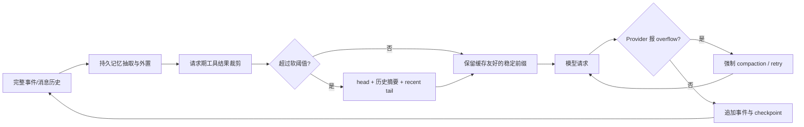

# Agentic Agent 平台的上下文压缩机制：开源实现与 Antigravity 对照

> 研究对象：OpenClaw、Hermes Agent、OpenHands、Letta、LangGraph/LangChain、Microsoft AutoGen、CrewAI、Google ADK、Google Antigravity
> 研究日期：2026-08-02（America/Los_Angeles）
> 研究方法：官方文档 + 官方源码；OpenClaw 与 Hermes 核对本机更新后的代码，Google ADK 额外浅克隆最新稳定版源码核验；Antigravity 因未开放 harness 源码，仅使用官方产品文档
> 这里的 compression 指 Agent 运行时的上下文/会话历史压缩，包括 compaction、summarization、trimming/pruning、memory offload 与 prompt-cache-aware context management；不讨论模型权重量化、蒸馏或文件压缩。

## 1. 结论先行

这些平台看起来都在“压缩历史”，但实际上解决的是五个不同问题：

1. **让下一次模型请求不超 context window**：裁掉或概括旧消息。
2. **保留任务连续性**：必须留下最近用户意图、当前工作状态、关键文件、约束与未完成事项。
3. **控制工具输出膨胀**：终端、文件读取、网页和搜索结果通常比自然语言对话增长得更快。
4. **保留可审计原始历史**：模型看到压缩视图，不等于磁盘上的原始事件也应被删除。
5. **避免破坏 prompt cache**：每次重写旧前缀都会使缓存失效，因此压缩时机本身也是成本策略。

最重要的总体判断如下：

- **OpenClaw 的体系最“分层”**：持久化语义 compaction、仅请求期的 tool-result pruning、压缩前 memory flush、可选 TokenJuice、provider-native compaction，以及可替换的 Context Engine 是不同层，不把所有问题塞进一次 summary。
- **Hermes 的默认压缩器最“防故障工程化”**：除了 head/summary/tail，还处理工具结果去重与结构化降级、最近真实用户消息锚点、重复压缩漂移、摘要模型容量、并发锁、超时、失败冷却、anti-thrashing 和原历史软归档。它的当前代码已经明显领先于部分官方说明文字。
- **OpenHands 的事件模型最干净**：压缩不是直接重写 event log，而是追加一个带 `forgotten_event_ids` 的 `Condensation` 事件，再由 `View` 投影出模型可见历史。这种设计对审计、回放和 time travel 很友好。
- **Letta 把 compaction 放在“分层记忆”体系里理解**：核心 memory blocks 始终在上下文，文件和 archival memory 按需检索；会话压缩只是热上下文的一层。它还明确提供为 prompt cache 优化的 self-compaction 模式。
- **LangGraph/LangChain 最像工具箱**：trim、永久删除、running summary、middleware、checkpoint 和 long-term store 都有，但策略组合与边界正确性主要由开发者负责。灵活性最高，开箱即用的统一策略较弱。
- **AutoGen 默认不做语义压缩**：默认发送完整历史；可选的 buffer、token-limited、head-and-tail 都是确定性的“选择/丢弃视图”，没有内置摘要语义。这很可预测，但信息保真能力最弱。
- **CrewAI 的公开入口最简单**：默认在 provider 抛出 context-length 错误后，把所有非 system 消息分块摘要，再把内存历史替换为 `system + summary`。它容易使用，但不是主动阈值策略，也不保留原始 recent tail。
- **Google ADK 把 compaction 建模为可持久化的事件投影**：配置后可按实际/估算 prompt tokens 或 completed invocations 触发，在 raw event log 上追加带时间范围的 `EventCompaction`，请求组装时以 summary 替换覆盖范围。最新版还专门保护 function call/response、tool confirmation、auth request 与 rewind 边界。
- **Google Antigravity 公开可验证的重点是 context partitioning，而不是 semantic compaction**：subagent 从干净上下文启动，Skills 按需渐进加载，会话按目录隔离，并提供 `/context` 用量面板。官方没有公开自动 summary 的阈值、算法或 summary event schema；它也不是开源平台，因此不能把内部 harness 行为写成源码事实。

一句话概括共同模式：

> 成熟实现通常不是“把全部聊天总结一下”，而是 `不可压缩前缀 + 可重蒸馏历史摘要 + 原样近期尾部 + 可检索长期记忆 + 原始审计记录`。

## 2. 版本与证据边界

### 2.1 版本与源码核验

| 项目 | 本地核验版本 | 本次操作 | 证据定位 |
|---|---:|---|---|
| OpenClaw | `2026.7.1-2 (0790d9f)` | 已从 `2026.7.1` 更新到当前 stable patch；更新后已确认 Gateway 自报并运行该版本 | 安装包：`/opt/homebrew/lib/node_modules/openclaw/` |
| Hermes Agent | commit `21040c4ab66899995d78cca00e83e5325f786883`；Python package `0.19.1` | 已更新到 `origin/main`，本地与远端 `main` 无 ahead/behind | checkout：`/Users/boyangcai/.hermes/hermes-agent/` |
| Google ADK Python | `v2.6.1`；commit `740582e9f283cd23ff5cec1389400b422513f765` | 将当前最新稳定 tag 浅克隆到临时目录，只读核对源码与测试 | 固定 commit 的官方 `google/adk-python` 仓库 |
| Google Antigravity | Antigravity 2.0 docs `v2.4.3`；CLI docs `v1.1.9` | 核对当前官方文档；没有将闭源安装包反编译成“源码” | `antigravity.google/docs` |

Hermes 更新前备份位于 `~/.hermes/backups/pre-update-2026-08-02-213751.zip`。核心 Python 代码更新成功；Web UI 的 npm install 因本机 npm `11.16.0` 不满足项目要求的 `npm <11.10.0 || >=11.17.0` 而失败，这不影响本报告对 Agent 核心源码的分析。

### 2.2 证据优先级

本文采用以下优先级：

1. **当前可运行的本地源码/构建产物**：回答“本机这个版本实际会怎么做”。
2. **固定 commit 的官方源码**：回答具体算法和边界条件。
3. **官方文档**：回答公开承诺、推荐配置和设计意图。
4. 若文档与代码冲突，明确列出冲突，不默默选一个。

对其余开源平台，本机原先没有 checkout；本文核对的是其官方文档和官方仓库源码。选择这些平台不是声称它们构成绝对排名，而是因为它们分别代表事件日志、分层记忆、图状态工具箱、多 Agent 上下文视图、简单自动摘要和 context isolation 等重要架构。Antigravity 是用户指定加入的闭源对照组，不计入“开源实现”的范围。

## 3. 先统一术语：七种常被混称为 compression 的机制

| 层级 | 本文名称 | 是否有损 | 是否改持久化历史 | 典型实现 |
|---|---|---:|---:|---|
| L0 | Prompt caching | 否 | 否 | Anthropic cache breakpoint、固定前缀复用 |
| L1 | View trimming / selection | 是 | 通常否 | AutoGen buffer、LangChain `trim_messages` |
| L2 | Tool-result pruning | 是 | 可选 | OpenClaw cache-TTL pruning、Hermes tool-result prune |
| L3 | Semantic compaction | 是 | 通常会写入摘要或新状态 | OpenClaw、Hermes、OpenHands、Google ADK |
| L4 | Memory offload / retrieval | 取决于抽取质量 | 写入独立记忆层 | OpenClaw memory flush、Letta archival memory、LangGraph store |
| L5 | Storage rotation / archival | 对原数据可无损 | 会改变 active store，不必删除 archive | OpenClaw successor transcript、Hermes soft archive |
| L6 | Context partitioning / progressive disclosure | 否；但跨线程只传选择后的结果 | 通常独立 session 或按需加载 | Antigravity subagents/Skills、OpenHands delegation |

Prompt caching 本身不缩短 prompt；它只是让相同前缀更便宜。因此“缓存命中率高”不能替代 context management。反过来，过于频繁地 prune/compact 会改写前缀，又会损害缓存。成熟平台需要在两者之间做滞回（hysteresis）。



## 4. 横向对比矩阵

| 平台 | 默认行为 | 主要触发器 | 压缩形状 | 工具调用安全 | 持久化语义 | 独立摘要模型 | 最显著特点 |
|---|---|---|---|---|---|---|---|
| OpenClaw | semantic compaction 默认可用；非 Anthropic 的 session pruning 默认关 | 成功 turn 后预算阈值；provider overflow；可选 transcript bytes 与 mid-turn guard | summary + recent tail；safeguard 可分阶段重蒸馏 | split 时保护 tool call/result；pruning 仅处理旧 `toolResult` | compaction entry；stable 可选 successor JSONL；官网 main 已描述 SQLite | 支持；也支持 provider/native compactor | 压缩、裁剪、记忆、缓存、插件分层最完整 |
| Hermes | built-in lossy compressor 默认启用 | agent token 阈值；gateway 85% safety net；5000-message hard valve；可选 idle/absolute/prune 阈值 | system/head + structured summary + token-budget tail | 对齐 tool group；去重、参数截断、结果语义降级 | 默认同 session 原子替换 active rows，旧 rows 软归档 | 支持 auxiliary model，并做可行性检查 | 故障、并发和 repeated-compaction 防护最强 |
| OpenHands | 需给 Agent 挂载 condenser；提供标准 LLM condenser | event count；`CondensationRequest`；overflow | first N + summary of middle + recent tail | 事件边界由 condenser/view 处理 | append-only `Condensation` 事件 + forgotten IDs | 支持 | 原日志不改，模型视图是投影 |
| Letta | 自动 `sliding_window` | 接近 context window；也有显式 compact API | 默认摘要最旧约 30%，保留约 70%，必要时提高摘要比例 | 公开文档不展开底层配对算法 | 改写 in-context message history；API 未承诺保留完整 raw transcript | 默认 provider-specific 轻量模型 | compaction 与 core/archival memory 分层；self-compaction 为缓存优化 |
| LangGraph/LangChain | 默认取决于应用；middleware/node 必须配置 | tokens/messages/fraction 或自定义 graph edge | trim、delete、running summary 均可 | 内置 API 提醒必须维护 AI tool call/result 合法性；自定义时由开发者保证 | state 可被改写；checkpointer 可保留历史 checkpoint | 支持 | 最可组合，但策略责任在应用层 |
| AutoGen | 默认 `UnboundedChatCompletionContext` | 只有配置具体 context class 后生效 | last N、token-limited 中部删除、head+tail+placeholder | 避免以孤立 function result 开头；head/tail 边界做基本修复 | 只改变 `get_messages()` 视图，内部消息仍保存 | 无内置语义摘要 | 确定性、简单，但不保留被丢弃语义 |
| CrewAI | `respect_context_window=True` 是 Agent 公共默认 | provider 已抛 context-length exception 后 | 保留 system；所有非-system 分块摘要为一条 summary | 格式化 tool calls/results 后交给摘要；没有 recent-tail 保留 | 当前 executor 的 message list 原地清空并替换 | 使用当前 agent LLM | API 最简单，但触发最晚且压缩粒度最粗 |
| Google ADK | 默认不压缩；必须配置 experimental `EventsCompactionConfig` | prompt token threshold（优先）；completed invocation interval（补充） | rolling summary + recent raw events；或多个重叠范围 summary | split 保持 call/response、confirmation/auth 闭合；组装期可恢复 orphan 与 parallel sibling | 追加 `EventCompaction`；raw events 保留，请求 view 以 summary 覆盖范围 | 支持；未指定时使用 root agent canonical model | OpenHands 式事件投影 + 双触发 + 细致 tool/rewind 安全 |
| Google Antigravity | 未公开 semantic compactor；提供预防式 context hygiene | 用户委派、Skill 匹配、目录/会话边界；可用 `/context` 观察 | clean-slate subagent + 按需 Skill + 主线程结果回传 | 各 subagent 独立完整执行；内部 prompt 裁剪算法未公开 | 官方公开持久 JSONL transcript；model view/summary schema 未公开 | 未公开 | 闭源对照：主要靠隔离和渐进加载避免主 context 污染 |

## 5. OpenClaw：多层上下文管理，而不是一个 summarizer

### 5.1 核心 semantic compaction

OpenClaw 将旧对话概括为持久化 `compaction` entry，entry 记录 summary、`firstKeptEntryId` 与压缩前 token 信息。以后模型看到的是：

```text
系统与工作区上下文
+ compaction summary
+ firstKeptEntryId 之后的原样近期消息
```

旧完整历史仍在 transcript/event store 中；“不再发给模型”不等于“删除”。官方说明见 [Compaction](https://docs.openclaw.ai/concepts/compaction) 与 [Session management deep dive](https://docs.openclaw.ai/reference/session-management-compaction)。

自动触发分两条主路径：

1. **阈值维护**：成功 turn 后，当当前上下文超过 `contextWindow - reserveTokens` 一类的安全预算时压缩。
2. **溢出恢复**：provider 返回 `context length exceeded`、`request_too_large` 等错误后，压缩并重试。

另外有两个可选 guard：

- `maxActiveTranscriptBytes`：active transcript 过大时在下一 turn 前触发正常语义 compaction。stable 文档要求同时启用 `truncateAfterCompaction`，否则文件不会缩小。
- `midTurnPrecheck.enabled`：工具结果写入后、下一次模型调用前再次检查。它不在工具循环中直接压缩，而是抛结构化信号，让外层恢复路径选择截断 oversized tool result 或 compaction + retry。

手动 `/compact [focus]` 可给摘要一个关注主题。设置 `keepRecentTokens` 时保留近期尾部；没有明确 keep budget 的旧/兼容路径可把手动压缩当作 hard checkpoint。当前 stable 文档给出的常见默认是 `keepRecentTokens=20,000`，`reserveTokensFloor=20,000`。

### 5.2 `safeguard` 模式比普通“一次总结”多做了什么

新配置默认使用 `safeguard`。其关键点不是文案，而是边界和二次压缩策略：

- 对太长历史做 staged/chunk summarization，避免一次 summary call 本身超窗。
- 再压缩时把旧 summary 与新历史一起重蒸馏，而不是永远原样保留旧 summary。
- `recentTurnsPreserve` 默认 3，把最近 user/assistant turns 放在摘要之外。
- runtime 的 `maxHistoryShare` 默认约 0.5；它约束 compaction 后历史最多占总预算的比例。配置文档中的 `0.7` 是示例，不是默认值。
- identifier policy 可要求保留路径、ID、URL 等容易被摘要“美化掉”的精确标识。
- `qualityGuard` 默认启用，默认最多再试 1 次，用来检测 malformed/低质量 summary。
- 分割点若落在 assistant tool call 与 `toolResult` 之间，会向前移动，确保调用和结果成组。

OpenClaw 还允许插件通过 `registerCompactionProvider()` 接管摘要生成；provider 失败或返回空值时回退到内置 LLM pipeline，显式 abort/timeout 则继续向上传播。更彻底的扩展是 [Context Engine](https://docs.openclaw.ai/concepts/context-engine)：插件可实现 `ingest`、`assemble`、`compact`、`afterTurn`，并以 `ownsCompaction` 声明谁负责主动压缩、overflow recovery 和手动 `/compact`。

### 5.3 Session pruning：不写盘的工具结果裁剪

OpenClaw 明确区分 pruning 与 compaction。pruning 只构造本次模型请求的 replay view，不改 raw transcript；只有旧 `toolResult` 可被裁剪，正常 user/assistant 文本不动。[官方 session-pruning 文档](https://docs.openclaw.ai/concepts/session-pruning)给出的 cache-TTL 算法是：

1. TTL 未过，完全不裁，尽量复用现有 prompt cache。
2. TTL 过后，若上下文比例低于 `softTrimRatio=0.3`，继续不动。
3. 达到软阈值，超长工具结果只留 head 1,500 + tail 1,500，合计最多 4,000 chars。
4. 若仍达到 `hardClearRatio=0.5`，且可裁工具内容至少 50,000 chars，则替换成 placeholder。
5. 只有实际发生裁剪才重置 TTL clock。

安全规则：最近 3 个 assistant turns 不裁；first user message 之前的 bootstrap reads 不裁；可用 tool allow/deny list 限定范围。Anthropic 插件在用户没有显式设置时，会为 Anthropic OAuth/API key 自动配置 `cache-ttl` 与 1h TTL；其他 provider 默认 `off`。

对旧 image/media，OpenClaw 还有独立 replay cleanup：最近 3 个 completed turns 原样保留，更旧的已处理图像换成文字 marker；raw transcript 仍不改。这避免每轮重新传陈旧 base64 image。

### 5.4 Memory flush：先外置，再摘要

compaction 会不可逆地丢失细节，所以 OpenClaw 默认在阈值前约 4,000 tokens 的 soft gap 运行一次静默 memory flush：让 agent 把长期重要事实写入 workspace memory，然后以 `NO_REPLY` 隐藏 housekeeping turn。它每个 compaction cycle 最多运行一次，可指定独立且精确的本地/便宜模型；read-only workspace、CLI backend 等不适合写记忆的路径会跳过。

这一点与普通 summary 有本质不同：summary 负责“让当前任务继续”，memory 负责“让未来会话还能检索到 durable facts”。

### 5.5 额外两层：TokenJuice 与 provider-native compaction

- [TokenJuice](https://docs.openclaw.ai/tools/tokenjuice) 是可选 external plugin，在工具结果 middleware 中压缩 `exec`/`bash` 噪声；命令仍照常执行，exit code 不变，精确文件读取和无法安全识别的混合命令保持 raw。
- 对 direct OpenAI Responses models，OpenClaw 可自动注入 server-side `context_management`；可用 `responsesServerCompaction` 和 `responsesCompactThreshold` 调整。Native Codex app-server session 则由 Codex 自己的 thread/compactor 拥有原生历史。

### 5.6 Stable 与官网 main 的存储层差异

这是本次研究中最需要版本化说明的一点：

- 本机最新 stable `2026.7.1-2` 的 bundled docs、CLI help 和大量 active dist path 仍描述/引用 `sessions.json + append-only JSONL`，`truncateAfterCompaction` 会建立 compacted successor JSONL。
- 2026-08-02 访问的官网 deep-dive 已描述“每 agent SQLite 中的 session rows + append-only transcript rows”，旧 JSONL 作为 migration/archive；内置 SQLite compactor 保持当前 session identity。

因此，本文对**压缩逻辑**使用两者共同语义：持久 summary + recent tail + raw history 可追溯；对**物理存储**则不合并说法。部署或写运维脚本时必须以目标 build 的 CLI/schema 为准，不能只看滚动更新的官网 main 文档。

## 6. Hermes Agent：双触发、结构化摘要与强失败防护

Hermes 的公开设计说明见 [Context Compression and Caching](https://github.com/NousResearch/hermes-agent/blob/main/website/docs/developer-guide/context-compression-and-caching.md)。本节以本地已更新到 commit [`21040c4`](https://github.com/NousResearch/hermes-agent/tree/21040c4ab66899995d78cca00e83e5325f786883) 的实现为最终依据，核心文件是 [`context_compressor.py`](https://github.com/NousResearch/hermes-agent/blob/21040c4ab66899995d78cca00e83e5325f786883/agent/context_compressor.py)、[`conversation_compression.py`](https://github.com/NousResearch/hermes-agent/blob/21040c4ab66899995d78cca00e83e5325f786883/agent/conversation_compression.py) 与 [`gateway/run.py`](https://github.com/NousResearch/hermes-agent/blob/21040c4ab66899995d78cca00e83e5325f786883/gateway/run.py)。

### 6.1 可替换 Context Engine

`ContextEngine` 定义 `should_compress()`、`compress()`、token usage tracking 和可选工具。默认 `context.engine: compressor` 使用有损 `ContextCompressor`；插件可显式替换为其他 engine，例如 LCM。插件永远不会自动激活，必须由用户配置，因而不会在升级后悄悄改变会话语义。

### 6.2 双 compression 层

Hermes 有两层相互独立的触发器：

1. **Agent in-loop compressor**：正常主路径，优先使用 API 实际返回的 prompt token。配置默认 `threshold=0.50`。
2. **Gateway session hygiene**：agent 处理新消息前的 safety net，固定在 model context 的 85%；实际 token 不可用时用字符近似。它还带默认 5,000 messages 的 hard safety valve，用来打破“请求持续断开 → 没有 usage → token trigger 永远不触发 → transcript 继续增长”的死循环。

“默认 50%”不是所有模型上的最终触发点。当前代码还应用：

- context window 小于 512K 时，ratio threshold 至少提高到 75%，防止 128K/256K 模型每一两轮就重复压缩。
- Hermes 最低支持 64K context；当 64K floor 会让 trigger 等于/超过可用 input window 时，改用有效 input budget 的 85%，确保在 provider 拒绝前仍能触发。
- 计算 input budget 时会减去 `max_tokens` output reservation。
- 支持 `model_thresholds` 按 model substring 覆盖，也支持 `threshold_tokens` 绝对上限，最终取更早者。
- ChatGPT Codex OAuth 路由上的 GPT-5.4/5.5/5.6 family 会自动提高到 85%；这是 route-specific，因为该 route 的实际 window 与 direct API 不同。历史配置键仍叫 `codex_gpt55_autoraise`。
- `idle_compact_after_seconds` 可在长时间闲置后、第一次回复前主动压缩，但默认 0，即关闭。

### 6.3 四阶段算法

#### Phase 1：确定性清理旧工具结果

在调用 summary LLM 前，Hermes 先做便宜的结构化清理：

- 对完全相同的旧 tool results 用 MD5 去重，只保留更新的完整副本。
- 大于约 200 chars 的旧结果不只换成通用 placeholder，而是尽量生成一行语义摘要，例如“terminal 运行了什么、exit code、多少行”“read_file 读取了哪个路径与范围”。
- 截断过大的 tool-call JSON arguments，但保持 JSON 可用。
- 剥离旧 screenshot/image payload，保留附件 marker。
- `skill_view` 内容被裁时写入显式 reload marker，避免模型误以为仍然拥有已丢失的 skill 指令。

此外还有 `proactive_prune_tokens`：它可在完整 semantic compression 阈值之前独立运行上述 no-LLM prune。默认 0（关闭）；建议值示例为 48K。默认只有单个结果超过 8,000 chars 才进入语义降级，而且至少预计回收 4,096 tokens 才 commit。这个 reclaim gate 的目的正是减少频繁改写旧 prefix 对 prompt cache 的破坏。

#### Phase 2：划分 head / middle / tail

默认参数：

```text
configured threshold ratio = 0.50
target_ratio               = 0.20
protect_first_n            = 3
protect_last_n             = 20
min_tail_user_messages     = 1
```

tail 的主预算为 `threshold_tokens × target_ratio`。代码从末尾反向累计 token，工具调用组不可拆分，并保证至少一个“真实、可执行的”最近 user message 进入 tail；平台 echo、旧 compaction handoff 等不计入这个 user anchor。

`protect_last_n=20` 是公开默认，但当前代码不会把 20 条都当成不可突破的硬下限：对 bulky tool output，hard message floor 上限为 8，压力很大时仍可降级 protected region 内的旧大结果，但最后至少 3 条保持原样。这修复了“20 条大工具消息把整个 tail 冻住，实际无内容可压”的问题。

head 中 system prompt 始终保留。`protect_first_n=3` 在**第一次** compaction 保留最初 3 条 non-system messages；一旦已有 previous summary 或 compression count ≥ 1，它衰减为 0，防止最早任务在每次重压缩时永久化、反过来覆盖当前任务。

#### Phase 3：生成结构化 summary

Hermes 发送给 summarizer 的不是纯对话拼接，而是带角色、tool name/args/results、文件路径和状态的序列化文本，并做以下卫生处理：

- 强制 redaction secrets 与 URL credentials，即使实时工具输出的全局 redaction 被关闭，持久化 summary 边界也不放行密钥。
- 去掉 think/reasoning blocks 和可能被重新执行的 `MEDIA:` directive。
- 单条内容保留 head/tail，有每条 message 与 tool args 上限。
- 总 summary input 再限制为 160,000 chars，保留两端并插入 omitted-middle marker，避免数百条“已经各自截短”的消息合计仍压垮 auxiliary model。

summary 模板重点保留：历史任务快照、当前 goal、constraints/preferences、已完成/进行中/阻塞状态、关键 decisions、相关 files、commands/results、待确认事项与 next steps。注入后的 summary prefix 明确声明“REFERENCE ONLY，最新 user message 是唯一当前任务”，这是为防止 repeated compaction 后旧任务重新复活。

旧 summary 会进入下一次 summary prompt 被重蒸馏，而不是简单地 `old_summary + new_summary` 无界追加。

输出预算按被压缩内容的 20% 估计，至少 2,000 tokens，最多 `min(context_window × 5%, 10,000)`。对 200K window，最大为 10K。

#### Phase 4：组装和规范化

最终形状是：

```text
system prompt
+ 第一次压缩才保留的 early head
+ [CONTEXT COMPACTION — REFERENCE ONLY] structured summary
+ 原样 recent tail
```

组装阶段再次清理 orphan tool result、避免不合法的 provider role alternation，并确保 summary 后仍有可执行的最新 user turn。

### 6.4 摘要模型可行性与失败语义

Hermes 可为 compression 配独立 auxiliary provider/model。当前实现会先检查：

- auxiliary context 至少 64K；
- 若 auxiliary window 小于主 session 的当前 compression threshold，则把 session threshold 安全地下调到 auxiliary 可承载的范围；
- summary call 可按 provider fallback；认证/授权、非恢复 quota 和 network/connection failure 会中止 compaction，保留原消息不动。

对其他 summary failure，默认 `abort_on_summary_failure=false`，使用最多 8,000 chars 的确定性 continuity handoff 后丢弃 middle；用户可改为 true，让任何摘要失败都 fail closed。失败会进入约 10 分钟 cooldown；automatic compaction 连续两次未能真正把 provider-reported prompt token 降到阈值下，会触发 anti-thrashing breaker。手动 `/compress [focus]` 可绕过自动 cooldown/breaker 进行恢复。

这比“summary 返回空也继续轮转”安全得多，但默认 deterministic fallback 仍然是有损的，关键业务可考虑打开 `abort_on_summary_failure`。

### 6.5 并发与持久化

Hermes 用 SQLite per-session compression lease/lock 防止 gateway hygiene、agent loop 或多个 worker 同时压缩同一个 session，锁会刷新 TTL；锁子系统异常时倾向 fail closed。

默认 `compression.in_place=true`：

- 同一 session ID 内原子地软归档旧 active rows（`active=0, compacted=1`）。
- 插入 compacted active transcript，重建 system prompt。
- 原消息仍可搜索与恢复，不物理删除。
- memory extraction 在边界前运行，memory/context provider 在边界后收到通知。

设置 `in_place=false` 可回到 legacy rotation：生成 child session，并以 `parent_session_id` 关联；当前实现包含两阶段 commit/rollback，避免 child 建立失败后丢失原 session。

### 6.6 Native Codex app-server 特例

Hermes 的本地 mirror 无法直接删改 Codex app-server 真正的 thread history，因此 `compression.codex_app_server_auto` 有三种模式：

- `native`（默认）：让 Codex 自己管理 native compaction。
- `hermes`：Hermes 阈值触发 `thread/compact/start`，但压缩动作仍在 Codex thread 内完成。
- `off`：Hermes 不触发；Codex 自身仍可能压缩。

这说明“谁拥有持久化线程”必须和“谁计算阈值”分开设计。

### 6.7 Hermes 文档与当前代码的漂移

| 主题 | 部分官方文档文字 | commit `21040c4` 当前代码 | 本文采用 |
|---|---|---|---|
| `protect_first_n` | “每次/始终保留开头 3 条” | 第一次保留，后续衰减为 0 | 代码行为 |
| summary ceiling | 说明句写 12K，但同页公式算出 10K | 常量为 10,000 | 10K |
| auxiliary model 太小 | 旧说明称可能失败后静默丢 middle | 当前有 64K floor、feasibility check、threshold 调整与终止类错误 fail-closed | 代码行为 |
| Codex autoraise | 文档键名/文字主要写 GPT-5.5 | 代码匹配 Codex OAuth GPT-5.4/5.5/5.6 family | 代码行为 |
| proactive tool prune | developer guide 旧摘要较少提及 | user config 与代码已有独立、cache-aware no-LLM prune | 代码行为 |

## 7. OpenHands：append-only event log 上的 View compaction

[OpenHands SDK Condenser architecture](https://docs.openhands.dev/sdk/arch/condenser)把“历史事实”和“模型现在看到什么”拆成两个对象：

- event log：append-only 原始事件。
- `View`：根据所有 `Condensation` 事件投影出的 LLM-ready history。

标准 `LLMSummarizingCondenser` 继承 rolling condenser。文档默认参数是 `max_size=120` events、`keep_first=4`，压缩后目标约为 `max_size // 2 = 60` events：保留 first N、摘要 middle、保留 recent tail。

当压缩发生时，它不删除旧 event，而是追加：

```text
Condensation {
  forgotten_event_ids: [...],
  summary: "...",
  summary_offset: ...
}
```

Agent 添加该事件后会提前结束当前 step；下一 step 的 `View.from_events()` 过滤 forgotten IDs，并在 `summary_offset` 插入 summary。触发方式有两种：

- 每 step 调用 condenser，event count 超 `max_size` 自动触发。
- Agent 在 context overflow 后或应用代码主动写入 `CondensationRequest`，强制触发。

`PipelineCondenser` 还能串联多个 condenser，例如先 masking/truncate，再 LLM summary。

优点：

- 审计和 replay 非常自然，压缩结果本身也是 event。
- summary 与被遗忘 IDs 有显式对应关系，便于 debug。
- dedicated LLM 可以比 reasoning LLM 更便宜。

局限：

- 默认阈值按 event count，不按 token；单个巨大终端事件可能在 event 数很少时先超窗，主要靠 manual/overflow request 补救。
- 文档称 `LLMSummarizingCondenser` 是“default implementation”，但示例仍需显式实例化并传给 `Agent(condenser=...)`；不能把“标准实现”误读为所有 Agent 默认已经启用。

## 8. Letta：compaction 只是 context hierarchy 的热层

### 8.1 默认 sliding-window compaction

Letta 的 [Compaction 文档](https://docs.letta.com/v1-sdk/messages/compaction)给出四种模式：

- `sliding_window`（默认）：用独立 summarizer 摘要最旧的一段，保留近期消息。
- `all`：摘要整个 conversation history，换最大空间。
- `self_compact_sliding_window`：仍做 sliding window，但 summary request 包含 agent system prompt 与 tools，并把 compaction instruction 作为当前上下文里的 user message。
- `self_compact_all`：`all` 的 cache-compatible 版本。

默认参数：

- 初始摘要约最旧 30% messages，保留约 70%。
- 若剩余 context 仍太大，以约 10% 步进提高被摘要比例。
- summary 最多 50,000 chars。
- 未指定 summarizer 时按 provider 选轻量默认，如 Claude Haiku、GPT mini、Gemini Flash；失败时再回 agent model。

self-compaction 的核心目的不是让主模型“自己反思”，而是保持与常规请求相同的 system/tool prefix，从而提高 provider prompt-cache hit rate。

[Compact Conversation API](https://docs.letta.com/api/resources/conversations/subresources/messages/methods/compact)还允许显式指定 model、model settings、prompt、response format、`clip_chars` 和 `sliding_window_percentage`，并返回压缩前后 message 数与 summary。

### 8.2 分层记忆比 summary 本身更重要

Letta 的 [context hierarchy](https://docs.letta.com/v1-sdk/memory/context-hierarchy)把数据分为：

- memory blocks：始终在 context，可由 agent 更新，适合身份、用户偏好和核心状态。
- conversation messages：热工作集，过长时 compaction。
- files：只打开/检索相关片段。
- archival memory：不常驻 context，通过 search tools 召回。
- external RAG：更大的外部知识源。

因此 Letta 不要求一次 summary 同时承担“当前任务状态”和“所有长期事实”。这和 OpenClaw 的 memory flush、LangGraph 的 long-term store 是同一设计方向，只是 Letta 把它做成更中心的 agent memory model。

局限与证据边界：公开 API 清楚描述 in-context messages 被压缩，但没有在该页面承诺像 OpenHands/Hermes 一样永久保留每条 raw pre-compaction event；需要完整合规审计时，应单独验证部署版本的数据库 retention/backup 策略。按 message 百分比切窗也可能对“少数超大 tool payload”不够敏感，这是从公开算法做出的推论，不是官方声明。

## 9. LangGraph / LangChain：由开发者组合的三套语义

[LangGraph Memory 文档](https://docs.langchain.com/oss/python/langgraph/add-memory)明确提供三种不同操作：

### 9.1 临时 trim：只改本次 model input

`trim_messages` 可按 token 只留最后一段，并用 `start_on="human"`、`end_on=("human", "tool")` 控制合法边界。Graph state 中的完整消息仍可保留。这相当于 OpenClaw session pruning 或 AutoGen model context view。

### 9.2 永久删除：改 graph state

`RemoveMessage` 配合 `add_messages` reducer 从 state 删除指定消息。官方特别提醒：删除后必须仍满足 provider 约束，例如 history 从 user 开始，assistant tool call 后必须有对应 tool result。这也是自定义压缩节点最常见的正确性陷阱。

### 9.3 Running summary：summary state + recent messages

可以给 `MessagesState` 增加 `summary` 字段：若已有 summary，就让模型基于旧 summary 和新消息“extend/update”，然后用 `RemoveMessage` 删除除最近 N 条以外的旧消息。`langmem` 的 `SummarizationNode` 把 running summary、触发 token、总 prompt budget 和 summary budget封装起来。

LangChain Agent 还提供 [SummarizationMiddleware](https://docs.langchain.com/oss/python/langchain/middleware/built-in)：

- `trigger` 可按 `tokens`、`messages`、model-window `fraction`，也可组合 AND/OR。
- `keep` 可按 token、message 或 fraction。
- summary model 必填，可用较便宜模型。
- `keep` 默认最近 20 messages；默认 token counter 是字符近似。
- `trim_tokens_to_summarize` 默认 4,000，限制 summary call 的输入。
- 旧 multimodal 内容压缩后只剩文字 summary；recent kept messages 仍保留原始 media blocks。

LangGraph checkpointer 可保存每个 super-step 的 state snapshot 并支持 history/time travel；但这不等于任何自定义数据库 retention 都永久保存被删除消息。最终语义取决于 checkpointer 和清理策略。

整体评价：它提供最丰富的正交 primitives，却没有强制一个全平台 compaction policy。对复杂 agent，这是优点；对希望“装上就安全”的团队，tool pair、last-user anchor、failure fallback、anti-thrash、summary schema 都需要自己补齐。

## 10. Microsoft AutoGen：确定性上下文视图，不做内置语义摘要

AutoGen `AssistantAgent` 默认使用 `UnboundedChatCompletionContext`，即完整内部消息都发给模型；官方 [Using Model Context](https://microsoft.github.io/autogen/stable/user-guide/agentchat-user-guide/tutorial/agents.html#using-model-context) 要求用户显式选择其他 context。

可选实现：

1. [`BufferedChatCompletionContext`](https://microsoft.github.io/autogen/stable/_modules/autogen_core/model_context/_buffered_chat_completion_context.html)：只返回最后 N 条；如果第一条恰好是孤立 `FunctionExecutionResultMessage`，把它再删除。
2. [`TokenLimitedChatCompletionContext`](https://microsoft.github.io/autogen/dev/_modules/autogen_core/model_context/_token_limited_chat_completion_context.html)：把 tool schemas 也计入预算；超限时反复删除列表**中间**的 message，直到 fits，再移除可能位于开头的 function result。它是 experimental，并非 oldest-first，也不生成 summary。
3. [`HeadAndTailChatCompletionContext`](https://microsoft.github.io/autogen/stable/_modules/autogen_core/model_context/_head_and_tail_chat_completion_context.html)：保留最前 N + 最后 M，在中间插入 `Skipped X messages.`；若 head 末尾是 function call 或 tail 开头是 function result，会调整边界避免最直接的 orphan。

这些类继承的内部 `_messages` 仍保存完整历史，`get_messages()` 只返回模型视图，并支持 save/load。因此其优点是：没有摘要幻觉、行为确定、测试容易。代价是：被跳过历史的语义完全消失；如果关键约束在 middle，placeholder 无法帮助模型恢复。

AutoGen 允许自定义 `ChatCompletionContext`，所以完全可以实现 Hermes/OpenHands 式 summarizer，但它不是默认产品策略。

## 11. CrewAI：overflow 后全量摘要并替换内存历史

CrewAI 公共 Agent 参数 `respect_context_window=True` 默认开启。官方 [Context Window Management](https://docs.crewai.com/en/concepts/agents#context-window-management)说明：context 超限时自动摘要并继续；关闭时抛错，建议改用更小输入或 RAG。

当前官方 [`agent_utils.py`](https://github.com/crewAIInc/crewAI/blob/main/lib/crewai/src/crewai/utilities/agent_utils.py) 显示实际流程：

1. LLM 调用先发生；捕获到 context-length exception 后才进入 `handle_context_length()`，所以是 reactive，不是接近阈值时 proactive。
2. `summarize_messages()` 把 system messages 单独保留，跳过它们的摘要。
3. 非 system messages 按 message boundary 分块；token 估计约为 `len(text) // 4`，每块不超过当前 LLM context window。
4. 格式化 role、tool calls/results 和 multimodal marker，调用**当前 agent LLM**生成结构化 summary；多块可并发摘要，再合并。
5. 收集所有 user messages 上的 `files` 并挂到新的 summary message。
6. `messages.clear()` 后写回 `system_messages + one summary message`，然后原 agent loop retry。

它比早期“固定 10K chars chunk”的实现完善，已经按消息边界、保留 system/files、处理 tool metadata。但仍有三个重要差异：

- 不保留 recent tail；当前未完成 tool/reasoning 也必须经过摘要。
- 没有独立便宜 summary model 的公开参数，复用 agent LLM。
- executor 内存历史被整体替换；此函数本身没有 OpenHands 式 forgotten-ID event 或 Hermes 式软归档事务。

因此 CrewAI 适合“错误发生时自动续命”的一般任务；对精确编码、合规或长时间 tool loop，官方自己也建议关闭自动摘要并使用 RAG/knowledge sources，或自行加更细策略。

## 12. Google ADK：持久 compaction event、双触发与请求期投影

Google Agent Development Kit 的官方入口是 [Context compression](https://adk.dev/context/compaction/)。本节进一步核对 Python 最新稳定版 `v2.6.1`、commit [`740582e`](https://github.com/google/adk-python/tree/740582e9f283cd23ff5cec1389400b422513f765) 的代码。它和 OpenHands 都把“raw event log”与“发给模型的 view”分开，但事件范围、触发器和 tool-call 修复方法不同。

### 12.1 默认关闭，配置本身仍标记 experimental

ADK 不会因为 session 变长就自动启用压缩。应用必须传入 `EventsCompactionConfig`，而且至少完整配置一组 trigger：

- token path：`token_threshold + event_retention_size` 必须成对出现。
- sliding path：`compaction_interval + overlap_size` 必须成对出现。
- 两组可同时存在；同一轮若 token path 真正完成压缩，sliding path 会跳过。

配置类在 `v2.6.1` 仍带 `@experimental`。如果没有显式 `summarizer`，运行时会在 root agent 是 `LlmAgent` 时，用它的 `canonical_model` 构造 `LlmEventSummarizer`；非 LLM root 无法提供默认 summarizer，会抛出错误。因此 ADK 的语义是“提供平台级机制与安全边界，由应用选择阈值”，不是 OpenClaw/Hermes 那种带产品默认值的自动治理。

### 12.2 Token-based path：pre-call safety net + post-run maintenance

`CompactionRequestProcessor` 在模型请求内容正式组装前执行 token 检查；正常 invocation 结束时 Runner 还会再运行 compactor。它取 token 的顺序是：

1. 从 session events 逆序找到最近一次 provider `usage_metadata.prompt_token_count`。
2. 如果没有真实 usage，先按当前 agent branch/isolation 规则构造 effective contents，再用 `text chars // 4` 估算。
3. 当值 `>= token_threshold` 时尝试压缩；该阈值是应用给出的绝对数值，不是模型 window fraction，也不会自动预留 output/tools budget。

候选数据不是简单“删除最旧 N 条”：

- 找到最新的、未被更大范围覆盖的 compaction event。
- 只选择该 compaction 结束时间之后的新 raw events，并让最后 `event_retention_size` 条尽量保持原样。
- 若已有旧 summary，把它物化为一个 seed event，和新的旧历史一起重新总结。新 compaction 因而可以覆盖并取代旧范围，形成 rolling summary，而不是无限追加 summary 文本。
- `event_retention_size` 按**事件数量**保留，不按 token；为保持工具事务完整，实际保留量可能多于配置值。

这条路径很像 `previous summary + new old events + raw tail`。但它没有 OpenClaw/Hermes 的 summary-size budget、anti-thrash、cooldown 或“压后必须降到目标线”的二次验证；阈值和 summarizer 容量仍是应用责任。

### 12.3 Sliding-window path：按 completed invocation 形成重叠摘要

turn-based path 不是数任意 event，而是数新的、已经完整写入 session 的 unique `invocation_id`。达到 `compaction_interval` 后：

1. 找出上次 compaction 之后的新 invocations。
2. 从第一条新 invocation 向前回退 `overlap_size` 个 invocation。
3. 总结这个起点到当前最后 completed invocation 的全部事件。
4. 追加新的 compaction event。

例如 interval=2、overlap=1 时，第一次可总结 `[inv1, inv2]`，下一次总结 `[inv2, inv3, inv4]`。两个 compaction 范围只部分重叠，旧 summary 不一定被新 summary 完全 subsume，所以 request view 中可能同时存在多个按时间排列的 summary。这与 token path 把旧 summary 当 seed 重蒸馏成更大单一范围不同。

这种策略对规则文本对话很可预测，却不感知单条 event 的大小；token path 是它的主要安全网。两者同时配置时，ADK 明确优先 token trigger。

### 12.4 EventCompaction：原始事件不删，读取视图替换范围

summary 成功后，ADK 追加一个普通 `Event`，其 `actions.compaction` 包含：

- `start_timestamp`
- `end_timestamp`
- `compacted_content`

请求组装时，`_process_compaction_events()` 执行 derived view：

- 被更大范围完全覆盖的旧 compaction summary 被判为 subsumed；相同范围保留后写入的那个。
- 每个仍有效的 summary 被物化为 `author='model'` 的事件，时间点放在该范围末尾。
- 落入任一有效 compaction 时间范围的 raw events 不再进入 model request。
- 范围外的 recent events 仍按原时间顺序进入请求。

所以 compaction 改的是**模型看到的事件投影**，不是 session 的原始 event log。这一点非常接近 OpenHands 的 `Condensation + View`；差异是 OpenHands 明确记录 `forgotten_event_ids`，ADK 用时间范围并解决相互覆盖的 compaction ranges。

### 12.5 Tool、rewind 与 summary prompt 的代码级保护

ADK `v2.6.1` 在这里比普通滑窗多做了几层保护：

- `_longest_self_contained_prefix()` 逐 event 跟踪 function-call IDs。只有 call 已被 response 关闭，或 tool confirmation/auth request 已闭合时，才允许 summary range 在这里结束。
- token tail 的 split 会向前移动，避免 recent tail 从一个孤立 function response 开始。
- request assembly 若仍发现 compaction 覆盖了 call、但真实 response 在范围外，会从 raw source events 重新注入原 call event；parallel calls 的 sibling responses 也会恢复，避免 phantom pending call。
- compactor 与 content builder 都先应用 session rewind；已撤销 invocation 不会被 summary“复活”。

默认 `LlmEventSummarizer` 的 prompt 要求保留用户主要语言、用户请求、关键决策、已获取信息、未完成问题和**精确工具名**。格式化输入包含普通文本、非 compaction event 的 thoughts、function calls 与 responses；每个 tool args/response 最多渲染 2,000 chars，防止 summarizer prompt 自己被巨大工具结果撑爆。summary 的 usage metadata 会写进 compaction event，并有独立 OpenTelemetry span。

失败语义比较保守：没有 summary content 就不 append；调用抛错会沿 Runner 路径传播，raw events 仍在。代码没有 Hermes 式 deterministic fallback、重试、锁/cooldown，也没有 OpenClaw 的质量 guard。这是 ADK 当前最明显的可靠性留白。

### 12.6 与 OpenHands、OpenClaw 和 LangGraph 的位置关系

- 与 OpenHands 相同：append-only event + derived context view，适合审计与回放。
- 比 OpenHands 标准 condenser 多：token trigger、provider usage fallback、tool/auth/rewind 边界与 orphan recovery。
- 比 OpenClaw/Hermes 少：工具结果预裁剪、memory flush、summary 容量治理、overflow retry、anti-thrash 和失败降级。
- 比 LangGraph 更 opinionated：不是只给 primitives，而是把 compaction request processor、Runner hook、事件 schema 与 view assembly 串成完整路径；但必须由应用显式开启。

## 13. Google Antigravity：通过隔离和渐进加载“避免需要压缩”

Google Antigravity 2.0 是 agent-first 开发产品，不是开源 Agent framework。当前 [Overview](https://www.antigravity.google/docs/overview) 标注 Antigravity `v2.4.3`、CLI `v1.1.9`、SDK `v0.1.7`。官方没有公布 agent harness 的 source repository，也没有公开 semantic compactor 的 trigger、summary prompt、持久化 summary schema 或 overflow recovery。因此这一节只描述官方可验证机制；“文档未披露”不等于内部一定没有自动压缩。

### 13.1 Clean-slate subagent 是主要 context offload 单元

[Subagents 文档](https://antigravity.google/docs/subagents)明确说，`invoke_subagent` 创建独立 concurrent session：

- subagent 不继承 parent 已有 conversation history，从空白 context window 开始，只接收角色和初始 prompt。
- research、browser、self 或自定义 agent 在自己的窗口完成搜索、测试和浏览器操作，再把结果消息传回 parent。
- idle subagent 被再次唤醒时保留**自己的**旧上下文；killed subagent 的历史 transcript 仍可阅读。
- agent 之间可读彼此 transcript，但这不等于把整份 transcript 自动塞入 parent prompt。

这不是有损 summary，而是 context partitioning：大量 terminal/browser/search 细节留在 worker session，parent 只承担委派描述和回传结果。它和“先让主线程收集所有数据，再 compact”相比，更早阻止了 context 污染；代价是跨 agent handoff 的保真度取决于结果消息质量，官方没有公开强制的结构化 handoff schema。

### 13.2 Skills 与 Rules 控制静态上下文膨胀

Google 官方 [Antigravity IDE codelab](https://codelabs.developers.google.com/getting-started-agy-ide)解释了 Skills 的 progressive disclosure：Skill 平时 dormant，只有请求匹配其 description 时才把专业说明加载到 agent context。这避免把所有工具指南、参考资料和团队规则长期放进 system prefix。

Rules 则支持 Manual、Always On、Model Decision 与 Glob 激活；[Rules 文档](https://www.antigravity.google/docs/ide-rules)还限制单个 rule file 最多 12,000 characters。两者组合相当于：

```text
小而稳定的全局前缀
+ 与当前任务匹配的 Rules
+ 按需加载的 Skill instructions/references
+ 当前 agent 自己的 conversation/tool trajectory
```

它解决的是“少注入无关内容”，并不把已经发生的长对话变短。把 progressive loading 与 semantic compaction 混为一谈，会高估 Antigravity 已公开的压缩能力。

### 13.3 会话隔离、可视化与显式重置

Antigravity CLI 还公开了几项 context hygiene：

- conversation history 按当前 working directory/workspace scope 展示和恢复，避免不相关项目的 semantic memory 混入。
- `/context` 打开上下文用量可视化；statusline JSON 暴露 `context_window_size`、累计 input/output、当前 usage、cache creation/read tokens 和 used/remaining percentage。它让用户能观察压力，但不是自动策略。
- `/clear`（alias `/new`）重置 active conversation contexts；`/fork` 则复制截至当前 turn 的完整 conversation history 到独立 session。前者丢弃连续性，后者保留并分叉，不是摘要。
- Hooks 得到持久 `transcript.jsonl` 路径，位于 conversation-specific brain directory。说明原 trajectory 有磁盘记录，但官方未说明 model view 是否以及何时由隐藏 compactor 替换。

公开命令表没有 `/compact`，设置页也没有 summary threshold、recent-tail budget 或 summarizer model 选项。因而无法像 OpenClaw、Hermes 或 ADK 一样回答“到多少 tokens 自动总结哪些 turns”。

### 13.4 Artifacts 是外置任务状态，但不是已证明的 memory layer

Antigravity 会生成 implementation plan、task list、code diff 和 walkthrough artifacts，用户可直接评论，agent 再依据反馈继续工作。这些结构化产物能减少人类从长 transcript 恢复状态的成本，也可能让 agent 通过文件/工具重新读取工作状态。

但官方文档没有承诺“context overflow 后用 artifacts 自动重建 prompt”，也没有把 artifact 定义为 compaction summary。因此本报告把它归为 externalized working state，不把它计作已验证的 memory offload/semantic compaction 实现。

### 13.5 与其他平台的实质差异

Antigravity 的公开策略更像“把问题拆到不同 context，再按需装载知识”：

- 与 OpenClaw/Hermes：后两者对单一长期 session 做主动压缩，Antigravity 公开资料更强调多 session 分工。
- 与 Google ADK/OpenHands：后两者公开了 raw event 到 compacted view 的数据结构；Antigravity 只公开 JSONL transcript 位置，没有公开 view transformation。
- 与 AutoGen：两者都能用独立 context 控制输入，但 AutoGen 的选择算法有源码，Antigravity harness 无法审计。
- 与 Skills-capable 平台：progressive disclosure 是降低静态 prompt bloat 的好做法，但不能替代动态 tool trajectory compaction。

因此对 Antigravity 最准确的结论不是“它不做 compression”，而是：**官方可验证层主要是 context avoidance/partitioning；内部 semantic compression 状态未知**。

## 14. 共同点：哪些模式已经接近行业共识

### 14.1 Head + summary + tail

OpenClaw、Hermes、OpenHands、Letta、LangGraph 与 Google ADK 的 semantic path 都收敛到这个形状。原因是三段承担不同职责：

- head：system、初始规格或长期身份。
- summary：远端历史的任务状态与决策。
- tail：最近用户意图、工具调用和局部推理，必须原样。

Hermes 的改进说明 head 也不能永久不变：初始 user task 在第一次压缩重要，几十次压缩后可能变成 stale instruction。它选择“第一次保留，之后衰减”，比永远 pin 更稳。

### 14.2 Summary 需要迭代重蒸馏

如果每轮只做 `old_summary + new_summary`，summary 会无限增长，并积累过时状态。OpenClaw safeguard、Hermes、LangGraph running summary 与 Google ADK token path 都把旧 summary 当输入，生成更新后的单一 summary。真正的难点不是缩短，而是明确哪些事项已完成、哪些仍 active。

### 14.3 工具输出应先于自然语言被压

terminal/file/web 结果是上下文增长主因，却往往已有外部可恢复来源。OpenClaw pruning、Hermes deterministic prune、TokenJuice 都先处理工具 payload，再考虑概括人类对话。这通常比提前 summary 整段历史更便宜、保真。

### 14.4 原始历史与模型视图应分离

OpenHands 的 event log/View、Google ADK 的 raw events/compacted projection、OpenClaw 的 transcript/assembled context、Hermes 的 active rows/soft archive、AutoGen 的 `_messages/get_messages()` 都体现同一原则：

> compression 决定模型现在读取什么，不应顺手抹掉审计事实。

### 14.5 独立 summarizer 是成本与可靠性边界

OpenClaw、Hermes、OpenHands、Letta、LangChain、Google ADK 都能使用独立模型。但“便宜”不是唯一条件：它必须有足够 context，遵守结构化输出，能可靠保留精确 identifier。Hermes 对 auxiliary capacity 的检查是这方面最完善的例子；ADK 当前允许选模型和 prompt，却不检查 summarizer capacity。

### 14.6 Prompt cache 需要滞回

- OpenClaw 等 TTL 过期且达到 soft ratio 才 prune。
- Hermes 至少能回收 4,096 tokens 才 commit proactive prune。
- Letta self-compaction 保持 system/tools prefix 相同。

共同目的都是避免“为省一点 token，每轮都让整段 prefix cache 失效”。

### 14.7 Context partitioning 可以把压缩压力提前消解

Antigravity clean-slate subagents、OpenHands delegation 以及任何隔离 worker 模式都说明：如果搜索、浏览器和测试轨迹从未进入 parent window，后续就不必为它们做 summary。它不能取代长主会话 compaction，但经常是成本最低、语义最清楚的第一道防线。

## 15. 关键差异：它们真正不一样的地方

### 15.1 触发时机

| 类型 | 平台 | 后果 |
|---|---|---|
| Proactive token budget | OpenClaw、Hermes、LangChain middleware、Google ADK token path | 在 provider 报错前留出 summary/tool-call headroom；ADK 阈值是应用配置的绝对值 |
| Event/invocation count | OpenHands、Google ADK sliding path；Hermes 另有 hard safety valve | 简单、可预测，但对单条巨大 payload 不敏感 |
| Message percentage | Letta sliding window | 容易解释，但 message 大小高度不均时需要迭代调高比例 |
| Reactive overflow only | CrewAI 主路径 | 平时无额外 summary cost，但失败已经发生，重试延迟更高 |
| No automatic trigger | AutoGen 默认、LangGraph 未配置时 | 策略完全透明，但开发者必须主动完成容量设计 |
| Context avoidance / isolation | Antigravity 公开机制 | 减少进入主窗口的数据；隐藏 harness 是否另有自动 compactor 未公开 |

### 15.2 压缩结果存在哪里

- **追加摘要事件**：OpenHands、Google ADK，最利于审计；前者记录 forgotten IDs，后者记录时间范围。
- **持久 compaction checkpoint/entry**：OpenClaw。
- **同 session active transcript 替换 + old rows 软归档**：Hermes 默认。
- **应用 state 中 summary + 删除消息**：LangGraph semantic example。
- **仅请求 view**：AutoGen、LangChain trim、OpenClaw pruning。
- **当前 executor message list 整体替换**：CrewAI。
- **服务端 conversation in-context history**：Letta；raw retention 需按部署验证。
- **独立 conversation JSONL + 未公开 model view**：Antigravity；能审计 transcript，不代表能验证 hidden compaction。

### 15.3 失败时是保历史还是保可用性

- Hermes 可配置 fail closed，且 auth/network 默认保留原 transcript；一般 summary failure 默认允许 deterministic fallback，偏向可用性。
- OpenClaw provider-backed safeguard 失败可回内置 summarizer，并有质量重试。
- CrewAI summary call 若继续失败，没有独立 fallback 层，原 overflow 恢复也会失败。
- AutoGen 不调用 summarizer，所以没有 summary failure，但接受确定性信息丢失。
- LangGraph 完全由应用定义，应显式决定事务边界。
- Google ADK 只有成功拿到 summary 才 append compaction event，raw events 不删；异常会向 Runner 传播，没有内置 fallback/cooldown。
- Antigravity 未公开 summary failure path，不能评价。

### 15.4 谁保证 tool pair 合法

OpenClaw、Hermes、OpenHands、Google ADK 的平台层做边界保护；其中 ADK 还在组装期恢复被 summary 覆盖的 call 与 parallel sibling response。AutoGen 只做基本首尾修复；LangGraph 明确把责任交给开发者；CrewAI 避免直接截断而选择把全部非-system history 摘要，但因此也失去原样 tail。Antigravity 的内部算法未公开。

## 16. 如果要设计一个新的 Agent 平台，建议采用的组合

最稳健的设计不是复制某一家，而是组合各家的强项：

1. **以 OpenHands/Google ADK 的 append-only event log + derived View 为数据底座**。所有压缩都是新事件，raw facts 可审计；优先使用稳定 event IDs，必要时兼容时间范围。
2. **以 OpenClaw 的多层 pipeline 管理上下文**：先 media/tool-result replay pruning，再 semantic compaction，再 provider-native path；不要只有一个 summarizer。
3. **以 Hermes 的 structured handoff、latest-user precedence、auxiliary feasibility、lock/timeout/cooldown/anti-thrash 做可靠性壳**。
4. **以 Letta 的 memory hierarchy 分离 core memory、hot conversation、files 与 archival/RAG**，让 summary 不必承担全部长期记忆。
5. **以 LangGraph 的可组合 trigger API 暴露 tokens/messages/fraction/AND/OR**，但平台内部仍应给出安全默认。
6. **保留 AutoGen 式 deterministic context view 作为禁用 LLM summary 时的 fallback**，并明确告知信息已被选择性丢弃。
7. **采用 Antigravity 的 clean-slate worker 与 Skill progressive disclosure**，让无关工具轨迹和静态知识尽量不进入 parent window。

推荐的默认策略可以是：

```text
每次请求：
  1. 保持 stable system/tool prefix
  2. 去掉旧 image payload，仅留可恢复引用
  3. TTL + context ratio 同时满足时，裁旧 tool results
  4. 组装 prompt，并用真实 provider token usage 校正估计

到达约 70% effective input budget：
  5. 抽取 durable memory（幂等、一次/cycle）
  6. 锁定 session，生成 structured summary
  7. 保留最新真实 user turn + 完整 tool group + token-budget tail
  8. 把 compaction 作为 append-only event 提交
  9. 用 provider real prompt tokens 验证是否真正降到目标线

异常：
  10. auth/network/invalid summary -> 不 commit
  11. 两次无效 -> cooldown/breaker，提示人工 /compact 或 /new
  12. provider overflow -> 强制更激进 compaction 后只重试一次
```

### 16.1 按使用场景选择现成平台

| 场景 | 更合适的起点 | 原因 |
|---|---|---|
| 长期个人 Agent、多 channel、工具输出多 | OpenClaw / Hermes | 默认就考虑 memory、工具 payload、长期 session 与恢复 |
| 软件工程 Agent，需要事件审计与 replay | OpenHands | Condensation 是 event，raw log/View 分离清晰 |
| 长期有状态 persona 与分层记忆 | Letta | memory blocks + archival/files + compaction 是核心模型 |
| 自定义业务 workflow、状态机、严格控制 | LangGraph | 每个压缩节点、checkpoint 与 store 都可编排 |
| Google 生态的事件型 Agent，想要框架内双触发 compaction | Google ADK | append-only compaction event、token + invocation trigger、tool/rewind 安全已串好 |
| 教学/原型、多 Agent 消息窗口只需简单上限 | AutoGen | deterministic contexts 简单、行为可测试 |
| 想要最少配置、overflow 时自动继续 | CrewAI | `respect_context_window` 入口直接，但应接受粗粒度摘要 |
| 多并发编码/研究任务，重视 context isolation | Antigravity | subagent、Skills 和目录会话隔离成熟；但闭源且 semantic compaction 细节不可审计 |

## 17. 可验证的工程检查清单

评估任何平台的 “compression” 时，建议实际回答这些问题，而不是只看“支持自动摘要”：

- Trigger 使用 estimated tokens 还是真实 provider prompt tokens？是否减掉 output reservation 和 tool schema？
- summary call 自己会不会超窗？有 input bound、chunking 或 auxiliary capacity check 吗？
- 最近真实 user ask 是否保证原样存在？平台 echo 会不会被误当 user anchor？
- assistant tool call 与所有 results 会不会被切开？parallel tool calls 呢？
- 旧 summary 是 append、extend，还是重新蒸馏？如何避免 stale task resurrection？
- 文件路径、IDs、URLs、错误码和 exact commands 是否有 preservation policy？
- 失败时是否原子回滚？auth/network failure 会不会仍丢 middle？
- 两个 worker 同时 compact 是否可能产生 fork/divergence？
- raw transcript 是否仍可审计、检索、恢复？active store 缩小与 archive retention 是否分开？
- pruning 是否破坏 prompt cache？有没有 TTL、minimum reclaim 或其他 hysteresis？
- memory extraction 与 semantic summary 是否分开？谁保证写入幂等？
- multimodal payload 是文字摘要、对象存储引用，还是每轮重新发送？
- repeated compaction 是否有质量评估与长期任务回归测试？

## 18. 研究限制

- 这是 2026-08-02 的版本快照。OpenClaw 官网 main 文档已经领先 stable 包的部分存储层；Hermes main 变化也很快。
- 没有用统一长会话 benchmark 对九个平台做真实 token/cost/任务成功率测量；本文比较的是公开算法与代码语义，不是性能排行榜。
- Google ADK 以 2026-07-30 发布的 Python `v2.6.1` 为源码快照；TypeScript、Java、Go、Kotlin 的公开 API 形状并不完全相同，本文只对 Python 路径做了逐代码结论。
- Antigravity 是闭源产品。官方文档足以确认 context isolation、progressive disclosure、transcript 与用量可视化，但不足以证明或否定内部 semantic compaction；该部分不能与开源平台做同等深度的代码审计。
- Letta 当前站点同时存在新 Agent SDK 与标记为 legacy 的 V1 SDK；本文分析的是仍公开、实现细节最完整的 V1/server compaction 与 conversation compact API。
- 平台外部插件（如 Hermes LCM、OpenClaw 第三方 Context Engine）只分析扩展边界，没有审计每个插件自己的实现。
- “摘要保留关键信息”没有形式化保证。任何 LLM summary 都可能遗漏或改写事实；高风险任务应保留 raw records，并让关键状态进入结构化 store，而不是只存在自然语言 summary。

## 19. 一手资料索引

### OpenClaw

- [Compaction concept](https://docs.openclaw.ai/concepts/compaction)
- [Session management deep dive](https://docs.openclaw.ai/reference/session-management-compaction)
- [Session pruning](https://docs.openclaw.ai/concepts/session-pruning)
- [Context Engine](https://docs.openclaw.ai/concepts/context-engine)
- [TokenJuice](https://docs.openclaw.ai/tools/tokenjuice)
- [OpenClaw source repository](https://github.com/openclaw/openclaw)

### Hermes Agent

- [Context Compression and Caching](https://github.com/NousResearch/hermes-agent/blob/main/website/docs/developer-guide/context-compression-and-caching.md)
- [Configuration reference](https://github.com/NousResearch/hermes-agent/blob/main/website/docs/user-guide/configuration.md)
- [Pinned source: ContextCompressor](https://github.com/NousResearch/hermes-agent/blob/21040c4ab66899995d78cca00e83e5325f786883/agent/context_compressor.py)
- [Pinned source: compression orchestration](https://github.com/NousResearch/hermes-agent/blob/21040c4ab66899995d78cca00e83e5325f786883/agent/conversation_compression.py)
- [Pinned source: gateway hygiene](https://github.com/NousResearch/hermes-agent/blob/21040c4ab66899995d78cca00e83e5325f786883/gateway/run.py)

### OpenHands

- [Condenser architecture](https://docs.openhands.dev/sdk/arch/condenser)
- [Context Condenser guide](https://docs.openhands.dev/sdk/guides/context-condenser)
- [Software Agent SDK source](https://github.com/OpenHands/software-agent-sdk/tree/main/openhands/sdk/context/condenser)

### Letta

- [Compaction modes and defaults](https://docs.letta.com/v1-sdk/messages/compaction)
- [Compact Conversation API](https://docs.letta.com/api/resources/conversations/subresources/messages/methods/compact)
- [Context hierarchy](https://docs.letta.com/v1-sdk/memory/context-hierarchy)
- [Letta source](https://github.com/letta-ai/letta)

### LangGraph / LangChain

- [LangGraph memory and message management](https://docs.langchain.com/oss/python/langgraph/add-memory)
- [SummarizationMiddleware](https://docs.langchain.com/oss/python/langchain/middleware/built-in)
- [Context engineering](https://docs.langchain.com/oss/python/langchain/context-engineering)
- [LangGraph persistence](https://docs.langchain.com/oss/python/langgraph/persistence)

### Microsoft AutoGen

- [Agent model context](https://microsoft.github.io/autogen/stable/user-guide/agentchat-user-guide/tutorial/agents.html#using-model-context)
- [Model context API](https://microsoft.github.io/autogen/stable/reference/python/autogen_core.model_context.html)
- [Buffered context source](https://microsoft.github.io/autogen/stable/_modules/autogen_core/model_context/_buffered_chat_completion_context.html)
- [Token-limited context source](https://microsoft.github.io/autogen/dev/_modules/autogen_core/model_context/_token_limited_chat_completion_context.html)
- [Head-and-tail context source](https://microsoft.github.io/autogen/stable/_modules/autogen_core/model_context/_head_and_tail_chat_completion_context.html)

### CrewAI

- [Agent context-window documentation](https://docs.crewai.com/en/concepts/agents#context-window-management)
- [Current `agent_utils.py` implementation](https://github.com/crewAIInc/crewAI/blob/main/lib/crewai/src/crewai/utilities/agent_utils.py)
- [Current executor call path](https://github.com/crewAIInc/crewAI/blob/main/lib/crewai/src/crewai/agents/crew_agent_executor.py)

### Google ADK

- [Official context compression guide](https://adk.dev/context/compaction/)
- [ADK Python `v2.6.1`](https://github.com/google/adk-python/tree/740582e9f283cd23ff5cec1389400b422513f765)
- [Pinned source: compaction triggers and event selection](https://github.com/google/adk-python/blob/740582e9f283cd23ff5cec1389400b422513f765/src/google/adk/apps/compaction.py)
- [Pinned source: LLM event summarizer](https://github.com/google/adk-python/blob/740582e9f283cd23ff5cec1389400b422513f765/src/google/adk/apps/llm_event_summarizer.py)
- [Pinned source: request-time compaction processor](https://github.com/google/adk-python/blob/740582e9f283cd23ff5cec1389400b422513f765/src/google/adk/flows/llm_flows/compaction.py)
- [Pinned source: compacted event projection and tool-call recovery](https://github.com/google/adk-python/blob/740582e9f283cd23ff5cec1389400b422513f765/src/google/adk/flows/llm_flows/contents.py)

### Google Antigravity

- [Antigravity 2.0 overview and published product versions](https://www.antigravity.google/docs/overview)
- [Asynchronous subagents and context isolation](https://www.antigravity.google/docs/subagents)
- [CLI context usage/statusline payload](https://www.antigravity.google/docs/cli-statusline)
- [CLI command reference: `/context`, `/clear`, `/fork`](https://www.antigravity.google/docs/cli/reference)
- [Conversation scoping and branching](https://www.antigravity.google/docs/cli/conversations)
- [Rules activation and file limits](https://www.antigravity.google/docs/ide-rules)
- [Hooks and persistent transcript location](https://www.antigravity.google/docs/hooks)
- [Official IDE codelab: Skills progressive disclosure](https://codelabs.developers.google.com/getting-started-agy-ide)
