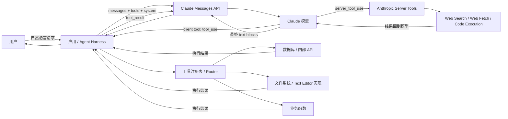
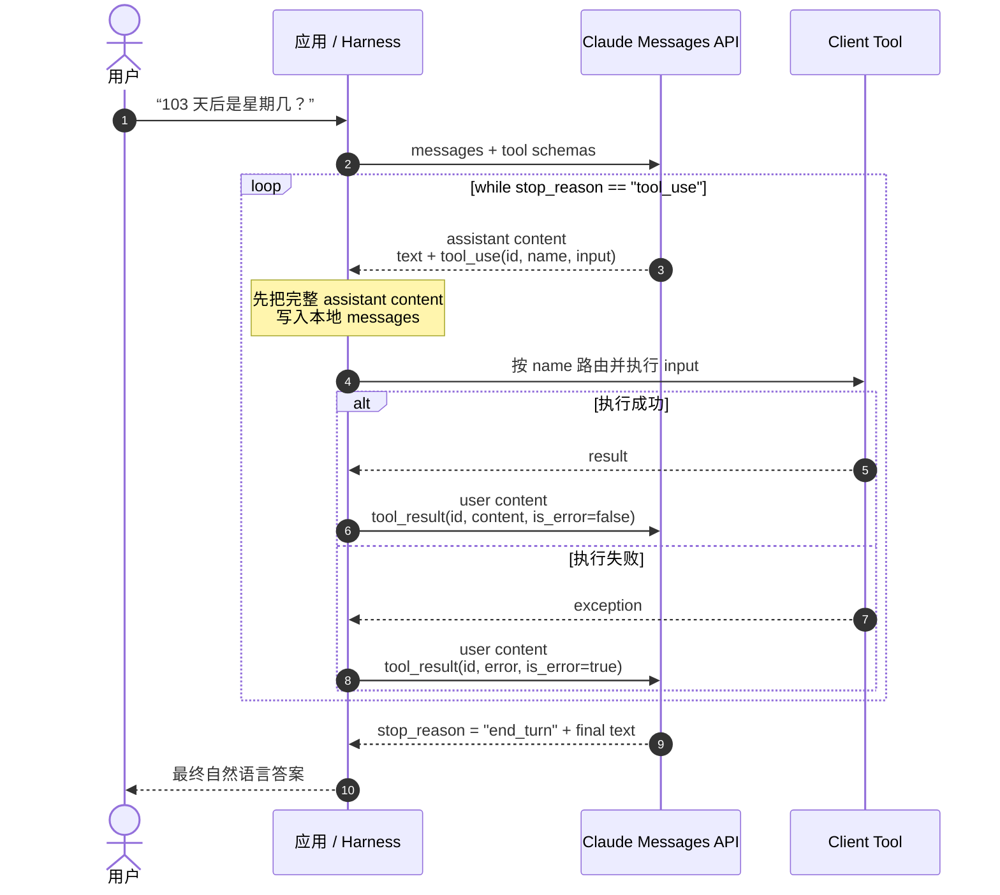
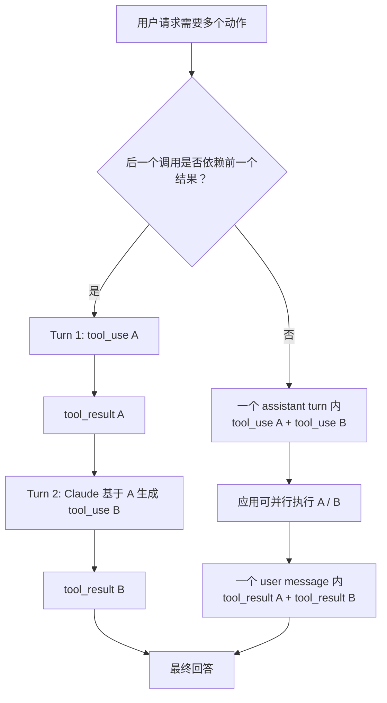
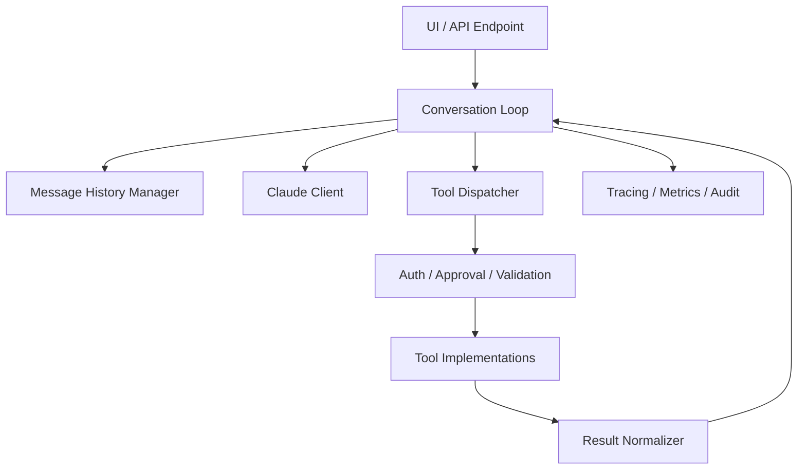

# Claude Tool Use 学习笔记：Schema、消息块与 Agentic Loop

> 基于 Anthropic Academy「Building with the Claude API」中 Tool Use 单元的 9 节课程，并使用 Claude Platform 官方文档校准当前 API 行为。
>
> 整理日期：2026-08-02

## 0. 先记住这句话

**Tool use 不是 Claude 自己去执行函数，而是一份“模型与运行时之间的结构化协议”。**

- 你的应用把工具的名称、用途和输入格式告诉 Claude。
- Claude 根据对话决定是否调用工具，并返回结构化的 `tool_use` block。
- 客户端工具由你的应用执行；执行结果通过 `tool_result` block 送回 Claude。
- Claude 读到结果后继续推理：可能直接回答，也可能继续调用下一个工具。
- Web Search 等 server tool 由 Anthropic 基础设施执行，通常不需要你的应用构造 `tool_result`。

一句工程化的表达：

> LLM 负责“选择动作并生成参数”；运行时负责“权限、执行、错误、状态和结果回传”。

---

## 1. System diagram：谁负责什么



### 三类工具的责任边界

| 工具类别 | Schema 谁提供 | 谁执行 | 客户端是否回传 `tool_result` | 典型用途 |
|---|---|---|---|---|
| User-defined client tool | 你的应用 | 你的应用 | 是 | 业务 API、数据库、订单、日历 |
| Anthropic-schema client tool | Anthropic | 你的应用 | 是 | Text Editor、Bash、Computer、Memory |
| Server tool | Anthropic | Anthropic | 通常否 | Web Search、Web Fetch、Code Execution、Tool Search |

最容易混淆的是第二类：**Anthropic 已经定义并训练了工具接口，不等于 Anthropic 替你执行文件操作。** 例如 Text Editor 的调用格式由 Anthropic 提供，但真正的读写文件仍由你的运行时完成。

---

## 2. Tool definition：把工具“讲清楚”

### 2.1 完整的自定义 Tool Schema

一个用户自定义工具至少包含：

- `name`：工具名称；当前官方限制为 `^[a-zA-Z0-9_-]{1,64}$`。
- `description`：工具做什么、何时用、何时不用、返回什么、有哪些限制。
- `input_schema`：JSON Schema，描述输入对象。

当前官方接口还支持：

- `strict: true`：保证生成的 `input` 符合支持范围内的 JSON Schema。
- `input_examples`：复杂、嵌套或格式敏感输入的有效示例。
- `cache_control`、`defer_loading`、`allowed_callers` 等进阶属性。

下面是一份比课程示例更适合实际项目的 schema：

```python
from anthropic.types import ToolParam

get_current_datetime_tool = ToolParam({
    "name": "get_current_datetime",
    "description": (
        "Return the current date and time for a requested IANA timezone. "
        "Use this when the answer depends on the current clock or calendar date. "
        "Do not use it for date arithmetic; use add_duration_to_datetime after "
        "obtaining the current datetime. Returns an ISO-8601 datetime string."
    ),
    "strict": True,
    "input_schema": {
        "type": "object",
        "properties": {
            "timezone": {
                "type": "string",
                "description": (
                    "IANA timezone such as America/New_York or Asia/Shanghai."
                ),
                "default": "UTC",
            }
        },
        "required": [],
        "additionalProperties": False,
    },
    "input_examples": [
        {"timezone": "America/New_York"},
        {"timezone": "Asia/Shanghai"},
    ],
})
```

### 2.2 Schema 设计检查表

1. `name` 是否能单独表达动作，而不是含糊的 `process_data`？
2. `description` 是否说明了“用 / 不用”的边界？
3. 每个参数是否说明语义、格式、单位和默认值？
4. 固定集合是否使用 `enum`？
5. 必填项是否进入 `required`？
6. 生产环境是否适合加 `strict: true` 与 `additionalProperties: false`？
7. 复杂嵌套结构是否提供 `input_examples`？
8. 工具结果是否只返回下一步推理需要的高信号字段？

### 2.3 Description 为什么比短 schema 更重要

Schema 解决“参数长什么样”，description 解决“什么时候应该调用”。Anthropic 当前文档把详细 description 视为影响工具效果最重要的因素，并建议复杂工具至少写 3–4 句。

推荐写法：

```text
做什么：读取某城市当前天气。
什么时候用：用户询问实时或指定地点的当前天气时。
什么时候不用：历史气候、天气常识或用户已经提供天气数据时。
返回什么：温度、单位、天气状况、观测时间和地点标识。
限制：不返回未来预报；地点含糊时先让用户澄清。
```

不推荐写法：

```text
Get weather.
```

---

## 3. 一次 Tool Call 的四个数据结构

### 3.1 第一次请求：把 `tools` 放在顶层

```python
messages = [
    {
        "role": "user",
        "content": "纽约现在几点？请精确到秒。",
    }
]

response = client.messages.create(
    model="claude-opus-5",  # 示例模型；上线前核对当前可用 model ID
    max_tokens=1024,
    messages=messages,
    tools=[get_current_datetime_tool],
    tool_choice={"type": "auto"},
)
```

提供 `tools` 后，Claude API 会把工具定义、工具配置和你的 system prompt 组合成工具使用上下文。Schema 不只是供你的 Python 校验；它也是模型选择工具和生成参数时会读取的接口说明。

### 3.2 Claude 返回：`tool_use` block

```json
{
  "role": "assistant",
  "stop_reason": "tool_use",
  "content": [
    {
      "type": "text",
      "text": "我先查询纽约当前时间。"
    },
    {
      "type": "tool_use",
      "id": "toolu_01ABC",
      "name": "get_current_datetime",
      "input": {
        "timezone": "America/New_York"
      }
    }
  ]
}
```

`tool_use` block 的关键字段：

| 字段 | 含义 |
|---|---|
| `id` | 本次调用的唯一 ID，用于把结果匹配回来 |
| `name` | 要调用的工具名称 |
| `input` | 按 `input_schema` 生成的参数对象 |
| `type` | 固定为 `tool_use` |

**不要假设 `tool_use` 永远在 `response.content[1]`。** Claude 可能不输出前置文本，也可能一次返回多个 tool block。应按 `block.type` 过滤。

```python
tool_calls = [
    block for block in response.content
    if block.type == "tool_use"
]
```

### 3.3 应用执行：按名称路由，而不是让模型直接碰函数对象

```python
TOOL_HANDLERS = {
    "get_current_datetime": get_current_datetime,
    "add_duration_to_datetime": add_duration_to_datetime,
    "set_reminder": set_reminder,
}

def execute_tool(name: str, tool_input: dict):
    handler = TOOL_HANDLERS.get(name)
    if handler is None:
        raise ValueError(f"Unknown tool: {name}")
    return handler(**tool_input)
```

工具注册表也是安全边界：只有显式允许的实现才能被调用。实际系统还应在 handler 层做身份认证、权限检查、超时、幂等和审计，而不是因为参数符合 schema 就默认有权执行。

### 3.4 第二次请求：把 `tool_result` 作为 `user` content block 回传

```json
{
  "role": "user",
  "content": [
    {
      "type": "tool_result",
      "tool_use_id": "toolu_01ABC",
      "content": "2026-08-02T14:35:22-04:00",
      "is_error": false
    }
  ]
}
```

`tool_result` 的关键字段：

| 字段 | 是否必需 | 含义 |
|---|---:|---|
| `type` | 是 | 固定为 `tool_result` |
| `tool_use_id` | 是 | 必须匹配原 `tool_use.id` |
| `content` | 否 | 字符串，或受支持的 text/image/document/search_result blocks |
| `is_error` | 否 | 工具执行失败时设为 `true` |

回传前，必须保留完整 assistant message：

```python
messages.extend([
    {"role": "assistant", "content": response.content},
    {"role": "user", "content": tool_result_blocks},
])

followup = client.messages.create(
    model="claude-opus-5",
    max_tokens=1024,
    messages=messages,
    tools=[get_current_datetime_tool],  # 后续请求仍保留同一 tools 定义
)
```

### 3.5 三条非常容易导致 400 的格式规则

1. `tool_result` 消息必须紧跟产生对应 `tool_use` 的 assistant 消息，中间不能插入其他消息。
2. 同一个 user content 数组里，所有 `tool_result` blocks 必须放在任何 text block 之前。
3. 一次 assistant response 里有多个 client `tool_use` 时，把所有结果放进**同一个 user message**，不要拆成多个 user message。

正确：

```json
{
  "role": "user",
  "content": [
    {"type": "tool_result", "tool_use_id": "toolu_01", "content": "..."},
    {"type": "tool_result", "tool_use_id": "toolu_02", "content": "..."},
    {"type": "text", "text": "请基于结果继续。"}
  ]
}
```

错误：

```json
{
  "role": "user",
  "content": [
    {"type": "text", "text": "结果如下："},
    {"type": "tool_result", "tool_use_id": "toolu_01", "content": "..."}
  ]
}
```

---

## 4. Back-and-forth：完整往返时序



这里的关键不是“调用一次函数”，而是维护一个**可重复的状态循环**。Claude API 本身是无状态的；应用需要在每轮请求中重新发送需要保留的 conversation history。

---

## 5. 实现 Agentic Loop

### 5.1 一个清晰的手写版本

```python
import json

def run_conversation(client, messages, tools, max_tool_rounds=8):
    for _ in range(max_tool_rounds):
        response = client.messages.create(
            model="claude-opus-5",
            max_tokens=2048,
            messages=messages,
            tools=tools,
        )

        # 必须保留完整 content，而不是只保存 text。
        messages.append({
            "role": "assistant",
            "content": response.content,
        })

        if response.stop_reason != "tool_use":
            return response

        tool_result_blocks = []

        for block in response.content:
            if block.type != "tool_use":
                continue

            try:
                output = execute_tool(block.name, block.input)
                tool_result_blocks.append({
                    "type": "tool_result",
                    "tool_use_id": block.id,
                    "content": json.dumps(output, ensure_ascii=False),
                    "is_error": False,
                })
            except Exception as exc:
                tool_result_blocks.append({
                    "type": "tool_result",
                    "tool_use_id": block.id,
                    "content": f"Tool execution failed: {exc}",
                    "is_error": True,
                })

        messages.append({
            "role": "user",
            "content": tool_result_blocks,
        })

    raise RuntimeError("Exceeded the maximum number of tool rounds")
```

### 5.2 为什么退出条件看 `stop_reason`

- `tool_use`：执行 client tools，再回传结果。
- `end_turn`：通常是正常最终回答。
- `max_tokens`：输出被截断，不能当作完整成功。
- `stop_sequence`：命中了调用方配置的停止序列。
- `refusal`：模型拒绝继续。
- `pause_turn`：常见于 server-side loop 达到本轮迭代上限；应把暂停响应加入历史后续传，而不是当作最终答案。

课程的核心模式是：

```python
while response.stop_reason == "tool_use":
    # execute tools -> append results -> call Claude again
```

手写 loop 有利于理解消息协议和插入自定义权限、日志、审批等逻辑。如果不需要这种控制，当前 Anthropic SDK 的 Tool Runner 可以代管循环、结果包装和部分类型安全。

---

## 6. Multiple tools：串行依赖与并行调用

### 6.1 多工具注册

```python
tools = [
    get_current_datetime_tool,
    add_duration_to_datetime_tool,
    set_reminder_tool,
]
```

新增工具的最小步骤：

1. 实现函数。
2. 定义 schema。
3. 加到 `tools` 数组。
4. 加到显式工具注册表 / router。
5. 加成功、失败、边界和权限测试。

### 6.2 Claude 可能采用两种模式



#### 串行依赖示例

“从现在起 103 天后是星期几？”

1. `get_current_datetime`
2. 把当前时间结果返回 Claude
3. Claude 再调用 `add_duration_to_datetime`
4. 返回最终日期和星期

第二个调用依赖第一个结果，因此需要多轮 back-and-forth。

#### 并行独立示例

“同时查询纽约和旧金山天气。”

Claude 可以在一个 assistant message 中返回两个 `tool_use` blocks。应用执行后，把两个结果一起放进一个 user message。

Claude 4 及之后的模型在适合时默认可以并行调用工具。若要关闭，在 `tool_choice` 内设置：

```python
tool_choice={
    "type": "auto",
    "disable_parallel_tool_use": True,
}
```

不要把有先后依赖的调用盲目并发。一个实用的 system instruction 是：

```text
Only batch tool calls that are independent of each other.
```

---

## 7. `tool_choice`：让模型决定，还是强制调用

| 取值 | 行为 |
|---|---|
| `{"type": "auto"}` | 默认；Claude 可调用工具，也可直接回答 |
| `{"type": "any"}` | 必须调用提供的某一个工具，但不指定哪个 |
| `{"type": "tool", "name": "get_weather"}` | 强制调用指定工具 |
| `{"type": "none"}` | 禁止工具调用 |

强制调用某个工具：

```python
response = client.messages.create(
    model="claude-opus-5",
    max_tokens=1024,
    messages=messages,
    tools=tools,
    tool_choice={"type": "tool", "name": "get_weather"},
)
```

如果既要保证“必定调用某个工具”，又要保证参数符合 schema，可组合 `tool_choice` 与 `strict: true`。但 forced tool use 与 thinking 模式的兼容性会随模型能力变化，部署前应核对当前模型文档。

---

## 8. Fine-grained tool streaming

### 8.1 默认 streaming 为什么会“停一下再成批出现”

标准工具输入 streaming 会缓冲并校验参数。对顶层 key-value 来说，服务端往往等待一个值完整、验证后才发送，因此可能表现为：

```text
等待 ──────► 一批 JSON delta ──► 等待 ──────► 下一批 JSON delta
```

事件中常见：

- `partial_json`：这一次新到的 JSON 片段。
- `snapshot`：目前累计的完整字符串快照。

### 8.2 当前官方启用方式

课程示例使用了 `fine_grained=True`。**当前官方方式已经改为在每个自定义工具上设置 `eager_input_streaming: true`，同时启用 request streaming。** 旧 beta header 仍是兼容路径，但 per-tool 字段已经替代它。

```python
make_file_tool = {
    "name": "make_file",
    "description": "Write the provided text to a file.",
    "eager_input_streaming": True,
    "input_schema": {
        "type": "object",
        "properties": {
            "filename": {"type": "string"},
            "lines_of_text": {
                "type": "array",
                "items": {"type": "string"},
            },
        },
        "required": ["filename", "lines_of_text"],
    },
}

with client.messages.stream(
    model="claude-opus-5",
    max_tokens=65536,
    messages=messages,
    tools=[make_file_tool],
) as stream:
    for event in stream:
        if event.type == "input_json":
            print(event.partial_json, end="", flush=True)

    final_message = stream.get_final_message()
```

### 8.3 代价：更低延迟，较弱的中途保证

| 默认 buffered streaming | Fine-grained / eager input streaming |
|---|---|
| 等待参数值完成并校验 | 生成后尽快发送片段 |
| 首片段可能更慢 | 首片段延迟更低 |
| 中途数据更稳定 | 可能收到不完整或无效 JSON |
| 适合大多数应用 | 适合大文本参数、进度 UI、低延迟处理 |

即使最终工具定义使用 `strict: true`，stream consumer 仍要把 delta 累积后再安全解析。`max_tokens` 也可能把 JSON 截断在中间。

```python
try:
    parsed = json.loads(accumulated_json)
except json.JSONDecodeError:
    # 不执行有副作用的工具；记录并按协议返回错误或请求模型修复。
    ...
```

---

## 9. Anthropic-schema client tool：Text Editor

Text Editor 是“内置 schema、客户端执行”的典型例子。

它可以支持：

- `view`：查看文件或目录；可查看指定行范围。
- `str_replace`：精确替换文本。
- `create`：创建文件。
- `insert`：在指定行插入文本。

### 当前 schema stub

课程里展示了旧模型对应的 `text_editor_20250124` / `text_editor_20241022` 和名称 `str_replace_editor`。当前 Claude 4+ 官方示例为：

```python
text_editor_tool = {
    "type": "text_editor_20250728",
    "name": "str_replace_based_edit_tool",
    "max_characters": 10_000,
}
```

注意：

- 工具 schema 内置且不能自定义，不需要 `input_schema`。
- 你的应用仍要实现文件读取、创建、替换和插入。
- `max_characters` 仅兼容 `text_editor_20250728` 及之后版本。
- Claude 4 的 2025-04-29 及之后版本移除了旧 `undo_edit` 命令；不能照搬课程旧能力列表。
- 工具版本必须与目标模型兼容，不能永久硬编码“看起来最新”的字符串。

典型 `tool_use`：

```json
{
  "type": "tool_use",
  "id": "toolu_01EDIT",
  "name": "str_replace_based_edit_tool",
  "input": {
    "command": "str_replace",
    "path": "primes.py",
    "old_str": "for num in range(2, limit + 1)",
    "new_str": "for num in range(2, limit + 1):"
  }
}
```

执行 Text Editor 时，运行时应限制工作目录、阻止路径穿越、控制文件大小，并为有风险的写操作设置审批或权限策略。

---

## 10. Server tool：Web Search

Web Search 与自定义工具最大的区别是：**Anthropic 在服务端执行搜索和内部循环。** 应用通常只需启用工具并读取带 citations 的结果。

### 10.1 基础 schema

```python
web_search_tool = {
    "type": "web_search_20250305",
    "name": "web_search",
    "max_uses": 5,
    "allowed_domains": ["nih.gov"],
    "user_location": {
        "type": "approximate",
        "city": "New York",
        "region": "New York",
        "country": "US",
        "timezone": "America/New_York",
    },
}
```

规则：

- `max_uses` 限制一次 request 中的搜索次数，不是结果条数。
- `allowed_domains` 与 `blocked_domains` 二选一，同时提供会返回 400。
- 域名不带 scheme，例如 `nih.gov`，也可以带路径。
- Web Search 需要组织设置允许；被管理员禁用时，包含该工具的请求会失败。
- 搜索结果是外部不可信内容；citations 提高可追溯性，但不等于来源一定正确。

### 10.2 当前三个版本

| 版本 | 用途 |
|---|---|
| `web_search_20250305` | 基础搜索 |
| `web_search_20260209` | 增加 dynamic filtering，先用代码筛选结果，减少无关内容进入上下文 |
| `web_search_20260318` | 进一步支持 `response_inclusion`，控制已被同轮 code execution 消费的原始结果是否保留在响应中 |

课程示例使用 `web_search_20250305`，它仍适合说明基础机制；若需要 dynamic filtering 或减少 agentic workflow 的原始结果输出，应按当前模型与平台支持选择新版本。

### 10.3 Response blocks

一个 Web Search 响应可能包含：

- `text`：Claude 的自然语言内容。
- `server_tool_use`：Claude 发起的搜索动作和 query。
- `web_search_tool_result`：搜索执行结果或错误。
- `web_search_result`：单条结果的标题、URL 等。
- citation：把回答中的陈述连接到来源。

正常情况下，不要为 server Web Search 手写 `tool_result`。如果 server-side loop 返回 `pause_turn`，把暂停响应加入 conversation 并继续请求，让服务端循环从原状态接着运行。

---

## 11. 错误处理与安全边界

### 11.1 Tool 执行失败也必须回结果

```json
{
  "type": "tool_result",
  "tool_use_id": "toolu_01FAIL",
  "content": "Permission denied: user cannot update this calendar",
  "is_error": true
}
```

这样 Claude 可以解释失败、修正参数、选择其他工具，或向用户请求必要信息。不要吞掉异常，也不要伪装成成功。

### 11.2 Schema 正确不代表动作安全

`strict: true` 能保证参数形状，不负责：

- 当前用户是否有权限执行动作。
- 删除、支付、发送消息等动作是否需要确认。
- API 是否幂等。
- 结果是否来自被污染或恶意的外部数据。
- 工具是否超时、限流或部分成功。

因此生产运行时至少应考虑：

1. 身份与资源级授权。
2. 有副作用动作的确认与幂等键。
3. 工具 allowlist 和参数级业务校验。
4. 超时、重试、熔断和速率限制。
5. `tool_use_id`、工具名、耗时、结果状态的结构化日志。
6. 将第三方内容保留在 `tool_result` 中，防范间接 prompt injection。
7. 对返回值做裁剪：只给模型下一步真正需要的字段。

---

## 12. 常见错误与修正

| 错误 | 后果 | 修正 |
|---|---|---|
| 只保存 assistant 的文本 | 丢失 `tool_use`，历史不完整 | 保存完整 `response.content` |
| 使用 `response.content[1]` | block 顺序变化时崩溃 | 按 `block.type` 过滤 |
| 忘记回传 `tool_use_id` | Claude 无法匹配调用与结果 | 原样使用对应 `tool_use.id` |
| 多个结果拆成多个 user messages | 可能降低并行工具效果或破坏格式 | 同一 user message 中一次返回全部结果 |
| `tool_result` 前放普通 text | 400 格式错误 | 结果 blocks 放在 content 最前面 |
| 后续请求不再提供 `tools` | 历史引用的工具上下文不完整 | conversation loop 中保持工具定义 |
| 工具 description 只有几个词 | 模型难以判断何时调用 | 写清用途、边界、参数、返回与限制 |
| 把 server tool 当 client tool | 错误地等待或构造结果 | 先确认执行位置与 stop reason |
| 直接照搬课程旧版本字符串 | API / 模型不兼容 | 以当前 Tool reference 为准 |
| fine-grained chunk 到达就执行 | JSON 可能不完整或无效 | 累积、解析、校验完成后再执行 |

---

## 13. 从 Demo 到生产：推荐分层



各层职责：

- **Conversation Loop**：判断 stop reason、控制最大轮数、组织往返。
- **Message History Manager**：完整保存 blocks，并做上下文裁剪或持久化。
- **Tool Dispatcher**：按名称找到显式注册的 handler。
- **Policy**：权限、审批、业务校验、危险动作保护。
- **Tool Implementations**：真正访问数据库、文件或外部 API。
- **Result Normalizer**：把输出变成短、稳定、可解释的结果。
- **Observability**：记录每次 tool use 的 ID、输入摘要、延迟、错误和 token 成本。

这个分层不是为了多写抽象，而是把“模型决定做什么”与“系统允许并实际做什么”分开。

---

## 14. 自测题

1. 为什么 `tool_result` 的 role 是 `user`，而不是一个单独的 `tool` role？
2. Claude 一次返回三个 `tool_use` blocks 时，应该构造几个 user messages？
3. 为什么不能用 `response.content[1]` 直接取工具调用？
4. `strict: true` 能否替代权限校验？为什么？
5. Text Editor 和 Web Search 都是 Anthropic 提供的工具，为什么前者需要客户端执行、后者通常不需要？
6. 什么情况下多个工具适合并行，什么情况下必须多轮串行？
7. Fine-grained tool streaming 为什么降低延迟，同时增加了解析责任？
8. Server tool 返回 `pause_turn` 时，应用应该怎么做？

---

## 15. 一页速查

```text
定义工具：name + detailed description + input_schema
强类型：strict=true + additionalProperties=false
发起请求：messages + tools
识别调用：stop_reason == "tool_use"
读取调用：过滤 content 中 type == "tool_use" 的 blocks
执行工具：显式 registry/router + 权限与业务校验
回传结果：user -> content[] -> tool_result
匹配结果：tool_result.tool_use_id == tool_use.id
多调用：所有 tool_result 放进同一个 user message
格式顺序：tool_result 在 text 之前，并紧跟 assistant tool_use 消息
继续循环：再次发送完整 history 和 tools
结束：正确处理 end_turn / max_tokens / refusal / pause_turn
Server tools：通常由 Anthropic 执行，不手写 tool_result
Streaming：累积 JSON delta，解析成功后才执行有副作用动作
```

---

## 16. 课程来源覆盖

| 课程页 | 本笔记对应内容 |
|---|---|
| [Tool schemas](https://anthropic.skilljar.com/claude-with-the-anthropic-api/287753) | `name`、`description`、`input_schema`、`ToolParam`、schema 命名和描述技巧 |
| [Handling message blocks](https://anthropic.skilljar.com/claude-with-the-anthropic-api/287757) | `tools` 参数、text/tool_use 多 block、保存完整 assistant content |
| [Sending tool results](https://anthropic.skilljar.com/claude-with-the-anthropic-api/287752) | 参数解包、`tool_result`、ID 匹配、完整历史与后续请求 |
| [Multi-turn conversations with tools](https://anthropic.skilljar.com/claude-with-the-anthropic-api/287750) | 多工具依赖、conversation loop、helper 重构、文本提取 |
| [Implementing multiple turns](https://anthropic.skilljar.com/claude-with-the-anthropic-api/287758) | `stop_reason`、批量处理 tool blocks、错误结果、工具路由 |
| [Using multiple tools](https://anthropic.skilljar.com/claude-with-the-anthropic-api/287749) | 多 schema 注册、router 扩展、日期计算与 reminder 串行示例 |
| [Fine grained tool calling](https://anthropic.skilljar.com/claude-with-the-anthropic-api/313160) | `partial_json` / `snapshot`、缓冲验证、低延迟与无效 JSON 风险 |
| [The text edit tool](https://anthropic.skilljar.com/claude-with-the-anthropic-api/287760) | Anthropic-schema client tool、文件编辑能力、版本 stub 与客户端实现 |
| [The web search tool](https://anthropic.skilljar.com/claude-with-the-anthropic-api/287755) | Server tool、`max_uses`、domain filtering、搜索结果 blocks 与 citations |

### 当前官方文档（用于版本校准与进阶 tips）

- [Tool use overview](https://platform.claude.com/docs/en/agents-and-tools/tool-use/overview)
- [How tool use works](https://platform.claude.com/docs/en/agents-and-tools/tool-use/how-tool-use-works)
- [Define tools](https://platform.claude.com/docs/en/agents-and-tools/tool-use/define-tools)
- [Handle tool calls](https://platform.claude.com/docs/en/agents-and-tools/tool-use/handle-tool-calls)
- [Parallel tool use](https://platform.claude.com/docs/en/agents-and-tools/tool-use/parallel-tool-use)
- [Strict tool use](https://platform.claude.com/docs/en/agents-and-tools/tool-use/strict-tool-use)
- [Fine-grained tool streaming](https://platform.claude.com/docs/en/agents-and-tools/tool-use/fine-grained-tool-streaming)
- [Text editor tool](https://platform.claude.com/docs/en/agents-and-tools/tool-use/text-editor-tool)
- [Web search tool](https://platform.claude.com/docs/en/agents-and-tools/tool-use/web-search-tool)

> 课程擅长解释机制，但工具版本和启用参数会更新。实现时应以目标模型对应的当前 Tool reference 为准。
